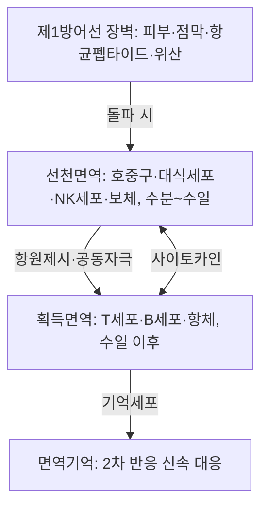

# 면역(免疫, Immunity)

면역(免疫, immunity)은 생체가 자기(self)와 비자기(non-self)를 식별하여, 침입한 병원체·이물질·변형된 자기 세포를 인식·제거함으로써 항상성(恒常性)을 유지하는 생체방어기능의 총칭이다[교과서적 근거]. 이 기능을 수행하는 세포·조직·기관·분자의 총체가 면역계(免疫系, immune system)이며, 림프계(淋巴系)가 그 골격을 이룬다. 한의학은 이 방어력을 정기(正氣)·위기(衛氣) 개념으로 파악해 왔다. 『영추·백병시생』은 "邪之所湊, 其氣必虛(사의 소유벽, 기필허)"라 하였고[^1], 『소문·유점종합론』은 "正氣存內, 邪不可干(정기존내, 사불가간)"이라 하여, 병사(邪氣)의 침입 여부가 곧 정기의 강약에 달렸음을 강령으로 삼았다[교과서적 근거]. 이 문서는 한방생리학 각론 면역계 폴더의 총론 문서로서, 서양면역학의 정의·분류·기전을 정리하고 침구·한약·기공 등 한의학 치료의 인체 면역 조절 근거를 취합하며, 개별 세포·분자(호중구·대식세포·NK세포·사이토카인 등)의 상세 생리는 이 폴더의 해당 문서에서 다룬다.

## 제1편 총론 — 면역의 정의와 분류

### 1. 면역의 정의

면역은 원래 라틴어 immunis(과세를 면제받은)에서 유래하여, 감염을 겪은 개체가 같은 병에 재차 이환되지 않는 현상을 가리키던 말이었으나, 현대 면역학에서는 자기·비자기 식별, 이물 인식·제거, 면역기억(免疫記憶), 면역관용(免疫寬容)을 아우르는 생체의 식별·방어 체계로 정의된다[교과서적 근거]. 면역의 어원적 뜻과 실제 임상 현장에서 보완대체의학이 갖는 면역학적 의미를 종합 검토한 문헌 고찰은, "면역 증진"을 표방하는 다양한 치료법의 근거를 면역학적 준거로 평가할 틀을 제공한다[^2].

면역계의 방어는 시간축에 따라 세 층으로 구성된다. 제1층은 피부 각질층·점막 상피·항균펩타이드·위산 등의 물리·화학적 장벽이고, 제2층은 호중구·대식세포·NK세포(자연살해세포)·보체계가 수분~수일 내에 대응하는 선천성 면역(先天性免疫, innate immunity), 제3층은 T림프구·B림프구가 항원 특이적 수용체와 항체로 대응하며 면역기억을 남기는 후천성 면역(後天性免疫, adaptive/acquired immunity)이다[교과서적 근거]. 선천성 면역은 비특이적·급속 방어이고, 후천성 면역은 지연성·특이적·기억성 방어라는 점에서 대조된다.

후천성 면역은 다시 Th1 세포와 세포독성 T세포 중심의 세포성 면역(細胞性免疫)과, Th2 세포·B세포·항체 중심의 체액성 면역(體液性免疫)으로 분업하며, 조절성 T세포(Treg)·Th17·IL-10 등이 이 균형을 조율한다[교과서적 근거]. 선천성 면역이 수지상세포의 공동자극 신호(CD80/86·CD40)와 IL-12 등을 통해 획득면역의 질(Th1/Th2/Treg 분화 방향)을 결정한다는 점에서, 두 층은 순차적 단계가 아니라 연결된 하나의 네트워크다[교과서적 근거].

### 2. 면역계의 구성 — 기관·세포·분자

면역계를 구성하는 해부학적 골격은 중추림프기관(골수·흉선)과 말초림프기관(비장·림프절·점막연관림프조직), 그리고 이를 연결하는 림프관계다[교과서적 근거]. 골수는 조혈의 장소이자 B세포·NK세포가 성숙하는 1차 림프기관이고, 흉선(胸腺, thymus)은 T세포 전구세포가 이주하여 양성·음성 선별을 거치는 T세포 성숙의 장소다[교과서적 근거]. 림프절은 피질의 B세포 여포와 수질의 T세포 구역으로 구획되어 항원과 림프구가 만나는 장소이고, 비장은 백수질(림프조직)과 적수질(혈액 여과)의 분업을 통해 혈행 항원에 대응한다[교과서적 근거]. 세포 성분은 골수계(호중구·단핵구/대식세포·수지상세포·호산구·호염기구·비만세포)와 림프계(T세포·B세포·NK세포·ILC)의 두 계통으로 발생하며, 분자 성분은 항체·보체·사이토카인·케모카인·항균펩타이드 등이다[교과서적 근거]. 이 구성 요소의 계통발생과 순환(homing)의 세부 생리는 이 폴더의 개별 문서와 혈액계 폴더의 조혈 문서에서 다룬다.

### 3. 점막면역·피부면역·장내미생물과의 연계

인체 면역계의 최전선은 점막면역이다. 장관연관림프조직(GALT)·비인두(NALT)·기도(BALT) 관련 림프조직과 분비형 IgA가 장관·기도·비인두 표면을 방어하고, 장내미생물총의 대사물질(단쇄지방산 등)이 Treg·Th17 균형에 관여한다[교과서적 근거]. 침구가 점막면역의 대표 지표인 타액 분비형 IgA를 조절한다는 인체 연구는 침구가 점막면역이라는 최전선에 개입할 수 있음을 보여준다[^3]. 한약의 면역 조절 작용에 장내미생물총이 매개 역할을 한다는 인체 대상 통합분석(황기 투여 전후의 대사체·지질체·장내미생물군 변화)은, "비주운화(脾主運化)-장내미생물-면역"의 연결고리를 인체 데이터로 제시한다[^4].

## 제2편 면역세포와 면역분자의 생리 개관

### 1. 면역세포 계통 — 선천면역 세포와 획득면역 세포

선천면역 세포인 호중구는 급성 감염의 최초 대응세포로 탐식·살균·세포외덕(NETs)을 수행하고, 단핵구/대식세포는 탐식·항원제시·사이토카인 분비를, 수지상세포는 전문 항원제시세포로서 선천-획득면역의 가교를 담당한다[교과서적 근거]. NK세포는 감염세포·암세포를 missing-self 인식으로 직접 살해하는 선천성 세포독성 림프구로, 암 환자에서 NK세포 기능 저하가 관찰되고 보조 면역치료의 표적이 된다[^5]. 획득면역의 T세포는 TCR-MHC 항원인식과 3중 신호(항원신호·공동자극신호·사이토카인신호)를 통해 활성화되어 CD4 보조 T세포(Th1/Th2/Th17/Tfh/Treg)와 CD8 세포독성 T세포로 분화하고, B세포는 V(D)J 재조합·체세포 과변이·클래스 전환을 거쳐 항체를 생산한다[교과서적 근거]. 각 세포의 분자생물학적 상세는 이 폴더의 개별 문서(호중구·대식세포·NK세포·CD40·CD80/86 등)에서 다룬다.

### 2. 항체와 면역글로불린

면역글로불린(immunoglobulin)은 B세포/형질세포가 분비하는 항체로, IgM(1차 반응·보체 고정)·IgG(2차 반응·태반통과·옵소닌)·IgA(분비형·점막면역)·IgE(알레르기·기생충 방어)·IgD(B세포 수용체)의 다섯 클래스로 나뉜다[교과서적 근거]. 임상에서 혈청 Ig 농도는 체액성 면역의 대표 지표로 쓰이는데, 비만 여성을 대상으로 한 전침과 식이요법 병행 연구에서 혈청 IgG·IgA·IgM·IgE 수치가 유의하게 조절되었다는 보고[^6], 노년 여성에서 습식 부항(濕式拔罐)이 유산소 운동과 유사하게 혈청 면역글로불린 농도에 긍정적 변화를 일으켰다는 무작위 시험[^7]은 침구·외치법이 체액성 면역 지표에 영향을 줄 수 있음을 보여준다. 타액 IgA는 점막면역 지표로서 전침 자극으로 상승한다[^3].

### 3. 사이토카인과 케모카인

사이토카인은 면역세포 간 신호전달물질로, IL-1·IL-6·TNF-α(전염증·급성기반응), IL-2·IFN-γ(Th1·세포성 면역), IL-4·IL-5·IL-13(Th2·알레르기), IL-17·IL-22(점막방어·자가면역), IL-10·TGF-β(조절·항염) 등의 축으로 기능이 분업되어 있다[교과서적 근거]. 침구 요법이 케모카인 조절을 통해 질환의 예방·치료에 작용한다는 문헌 고찰은 침구의 면역 조절 기전을 화학주성 축에서 설명하는 틀을 제시한다[^8]. 뇌경색 환자에서 열다한소탕(熱多寒少湯)이 세포성 매개 사이토카인(IL-2·IFN-γ)의 과잉 생산을 조절했다는 임상시험은 한약이 사이토카인 네트워크에 개입할 수 있음을 인체 데이터로 확인한다[^9].

### 4. 보체계

보체계는 고전·대체·레크틴의 세 경로가 C3 전환효소를 거쳐 종말경로(MAC)로 수렴하는 혈장 단백질 연쇄로, 옵소닌화·아나필라톡신·세포용해를 매개한다[교과서적 근거]. 보체의 조절 단백질 결핍은 혈관부종·류마티스 질환·재발 감염으로 이어지며, 임상 한의사가 한약·보조제 투여 중 반복 감염·부종을 호소하는 환자에서 보체결핍증을 인지할 필요가 있다[교과서적 근거].

## 제3편 신경·내분비·면역 네트워크와 정기(正氣)

### 1. 신경-내분비-면역 상호작용

면역계는 독립 계통이 아니라 신경계·내분비계와 상호 조절하는 네트워크(NEI 네트워크)를 이룬다. 사이토카인(IL-1·IL-6)은 뇌실주위기관과 미주신경 구심로를 통해 시상하부에 신호를 보내 발열·피로·사회위축 등의 질병행동(sickness behavior)을 유도하고, HPA축의 코르티솔은 면역을 억제하며, 교감·미주신경은 림프구의 수용체(β2-아드레날린·아세틸콜린 수용체)를 통해 면역반응의 강약을 조절한다[교과서적 근거]. 침 자극이 A-δ·C-섬유를 통해 시상하부에 도달하여 신경펩타이드 분비와 내장 기능을 조절한다는 고찰[^10], 침구가 소화기·정신과·만성통증 영역에서 중추-말초 상호작용을 매개하는 다계통 신경면역조절을 수행한다는 문헌 고찰[^11]은, 침구의 면역 조절을 NEI 네트워크의 자극으로 이해하는 틀을 제시한다. 100 Hz 전침이 타액 IgA를 상향 조절하면서 자율신경 균형(부교감 긴장도)을 개선했다는 인체 연구[^3]는 이 틀의 인체 수준 실증 사례다.

### 2. 정기(正氣)·위기(衛氣)와 면역의 대응

한의학은 병의 발생을 정기와 사기의 소강(消長)으로 파악한다. "정기존내, 사불가간(正氣存內, 邪不可干)"은 면역계가 정상일 때 병원체가 침입하지 못한다는 관찰의 강령이고, "사의 소유벽, 기필허(邪之所湊, 其氣必虛)"는 감염·발병이 국소 면역 저하 지점에서 일어난다는 관찰의 강령이다[교과서적 근거]. 위기(衛氣)는 수곡(水穀)의 정미(精微)가 상초(上焦)에서 선발(宣發)되어 피부·분육(分肉)을 순행하며 주리개합(腠理開合)을 조절하고 외사(外邪)를 막는 방어기로서, 피부장벽·점막장벽·선천면역 세포·발한·체온조절이라는 현대적 상관물과 대응한다[교과서적 근거]. 수술 환자에서 정신적 스트레스가 면역반응을 억제하여 감염·상처 치유 지연으로 이어진다는 정신신경면역학적 문헌 고찰[^12]은 "정허(正虛) 사침(邪侵)"의 병리를 현대 언어로 보여주는 사례로, 침구·한약의 부정(扶正) 접근이 수술 전후 면역 관리에 활용될 여지를 시사한다.

### 3. 면역의 양방향 조절 — 한의학 조절 특성과의 상관

한의학 치료의 면역 조절은 일방향적 강화가 아니라 양방향(bidirectional) 조절 특성을 보인다. 침구가 면역 항진 상태(알레르기·자가면역)에서는 과잉 반응을 낮추고 저하 상태(화학요법 후 면역저하·면역무반응)에서는 방어기능을 끌어올리는 사례가 함께 보고된다[^13][^14]. 정상인과 전신홍반루푸스 환자에서 간접구(間接灸) 뜸이 정상인에서는 면역세포 활성을 상향·환자에서는 조절 방향으로 작용했다는 임상시험은, 동일 자극이 개체의 면역 상태에 따라 다르게 작용한다는 변증(辨證) 개별화의 생물학적 토대를 시사한다[^15]. 이는 "익기고표(益氣固表)·부정거사(扶正祛邪)"가 상태 의존적 조절이라는 한의학 치법 원리와 상통하며, 변증 없는 획일적 침구·한약 적용이 근거에 부합하지 않음을 뜻한다.

## 제4편 침구·한약·기공의 면역 조절 임상 근거

### 1. 침구의 면역 조절

침구가 면역계에 미치는 영향에 대한 고찰 문헌은 1980년대 초부터 축적되어 왔다. 침 자극의 면역학적 반응(백혈구 수·림프구 아형·면역글로불린 변화)을 총망라한 초기 고찰은 침구가 면역세포·분자 양쪽에 작용함을 보고했다[^16]. 침구와 면역조절의 관계를 체계적으로 정리한 문헌 고찰은 침 자극이 사이토카인·면역글로불린·림프구 증식 반응에 영향을 주며, 그 방향이 자극 조건과 대상 상태에 따라 달라짐을 정리했다[^13].

암 환자에서 악성종양 환자에 대한 침구가 면역기능(T림프구 아형·NK세포 활성)을 상향 조절했다는 임상시험[^17], 화학요법 후 백혈구감소증에서 침구 요법이 약물치료보다 백혈구 수 회복과 수행능력(Karnofsky 점수) 개선에 효과적이었다는 체계적 고찰·메타분석[^18]은 침구의 부정(扶正) 효과를 백혈구·면역세포 지표로 확인한 대표 근거다. 암 관련 피로 환자에서 경피침자극(TEAS)이 면역 기능 개선과 동반되어 피로를 완화했다는 임상시험[^19]도 있다. 다만 패혈증 환자의 족삼리(足三里, ST36)·관원(關元, CV4)·기해(氣海, CV6) 전침이 PD-1 경로로 면역기능을 조절한다는 무작위 시험은 이후 철회(retracted)되어 인용에 주의해야 한다[^20].

경쟁 상황의 운동선수에서 침 치료가 면역·내분비 지표의 변동을 완화했다는 임상시험[^21], 태국 전통마사지가 노인에서 노화로 축적된 CD4+ T세포 아형을 감소시켜 면역상을 개선했다는 무작위 교차시험[^22], 도인(導引, 기공) 4주 프로그램이 건강인의 면역 지표를 개선했다는 비교연구[^23], 도인의 임상 응용을 면역 영역까지 정리한 고찰[^24]은 침구 외의 전통 요법(마사지·기공)에서도 정기(正氣)를 다스리는 면역 조절 효과가 관찰됨을 보여준다.

> 침구의 면역 조절 근거는 대부분 단일 소규모 임상시험·관찰연구 수준이며, 일부 철회 논문[^20]이 포함된 영역이므로 근거 적용에 신중을 기해야 한다. 면역 저하 상태(항암치료 중·HIV 감염)와 면역 항진 상태(자가면역·알레르기)를 변증으로 구분한 뒤 접근해야 하며, 변증 없는 관행적 취혈은 근거에 부합하지 않는다.

### 2. 질환군별 침구 면역 근거

**자가면역·알레르기질환군** — 만성두드러기에서 침·뜸 병행 치료가 세포성 면역지표와 Th1/Th2 불균형을 개선하면서 유효율을 높였다는 임상시험[^25], 건선 혈어증(血瘀症) 화침(火鍼) 요법의 효과·안전성을 평가하는 무작위 시험 프로토콜[^26], 편평사마귀에서 화침 요법이 면역조절제·트레티노인보다 유효율이 높았다는 29건 무작위시험의 체계적 고찰[^27]이 있다. 하시모토 갑상선염에서 침 치료가 자가항체(TPOAb·TGAb)를 낮춘다는 체계적 고찰·메타분석[^28], 알레르기비염에서 해모침(透膿鍼) 계열의 투민지체탕(透膿知體湯)이 유효했던 임상시험[^29], 아토피피부염에서 혈위 자가혈 주사요법이 면역조절 효과와 함께 유효·안전했다는 무작위 대조시험[^30], 만성 두드러기에서 윤조지양캡슐(潤燥止癢膠囊)의 효과를 종합한 메타분석[^31]도 있다. 류마티스질환 영역에서 다발성경화증 환자의 피로에 침이 유효했다는 무작위 대조시험[^32]과 침 효과를 종합한 체계적 고찰[^33], 면역조절제 치료 중 다발성경화증 환자의 삶의 질을 전침이 개선했다는 무작위 시험[^34]이 보고되었다.

**감염질환군** — 대상포진에서 편제황(片仔癀) 캡슐이 항바이러스제 병용 시 통증 완화를 단축하고 CD8+ T세포를 상향 조절했다는 다기관 무작위 이중맹검시험[^35], 급성 인두감염에서 침 치료의 효과를 확인한 체계적 고찰·메타분석[^36], 대상포진후신경통에서 전침 병용의 유효성을 본 관찰연구[^37]가 있다. 소아 마이코플라스마 폐렴에서 중약 주사제 병용이 임상 효과를 높였다는 임상시험[^38]과 화농성 편도염 관련 소아 호흡기 질환에서 아유르베다 계열 시럽의 면역조절 가능성을 본 단군 전향연구[^39]도 있다. 돌발성 난청에서 은행엽 추출물 병용이 스테로이드 단독보다 유효율이 높고 말초혈 T세포 아형 균형을 개선했다는 임상시험은 면역 조절이 감각기 질환의 회복에도 기여할 수 있음을 보여준다[^40].

**면역저하·면역무반응 상태** — HIV 감염인의 항레트로바이러스요법(ART) 후 면역무반응(immune nonresponse) 환자에서 면역과립(免疫顆粒)이 CD4+·CD45RA+ 세포를 증가시켜 면역재구성을 촉진했다는 다기관 무작위 이중맹검시험[^41], 한의학 보법(補法)이 AIDS 면역무반응의 반전에 효과가 있었는지 종합한 메타분석[^42]은 감염 분야에서 한약이 부정(扶正) 역할을 수행할 수 있음을 보여준다. 백혈병의 일종인 골수이형성증후군에서 마이타케 버섯 다당체 추출물이 호중구·단핵구 기능을 개선했다는 상Ⅱ시험[^43]은 면역세포 기능 개선의 직접 증거다.

**중증감염·판혈증** — 패혈증에서 전침이 면역계를 표적으로 증상을 완화할 수 있다는 체계적 고찰[^44], 삼초(參麥) 주사액이 패혈증 보조요법으로 유효·안전했던 체계적 고찰·메타분석[^45], 호흡기 감염 예방·치료에 상주양정(桑菊養正) 차가 면역조절(T·B세포 증가)로 기여했다는 인체 연구[^46]가 있다. 만성폐쇄성폐질환 급성악화에서 혈핵정(血必淨) 주사액의 면역조절 효과를 평가하는 무작위시험 프로토콜[^47], 방사선 폐손상에서 한약 추출물이 완화 효과를 보였다는 체계적 고찰·메타분석[^48]도 보고되었다.

### 3. 한약·본초·식품 유래 면역 조절 근거

한약과 약용 버섯·식품 유래 소재의 면역 조절 근거는 인체시험 수준에서 꾸준히 축적되어 있다. 황기(黃奇, Astragali Radix)를 건강인에게 투여하고 대사체·지질체·장내미생물군을 통합 분석한 연구에서 NK세포 관련 면역경로의 조절이 확인되었다[^4]. 상황버섯(Phellinus linteus) 추출물이 건강인에서 NK세포 활성을 유의하게 상향시켰다는 이중맹검 위약대조시험[^49], 마이타케(잎새버섯, Grifola frondosa) 다당체가 유방암 환자에서 면역 기능에 용량 의존적 복합 효과를 보였다는 상Ⅰ/Ⅱ시험[^50]과 골수이형성증후군에서 호중구·단핵구 기능을 개선했다는 상Ⅱ시험[^43]은 버섯 다당체의 대표 인체 근거다. 감초를 발효시킨 청국장이 히스타민 유발 두드러기 반응을 완화했다는 이중맹검시험[^51], 발효 대두 제제의 이소플라본 배당체가 인체 1차 면역세포를 자극했다는 연구[^52], 녹색 콩 추출물의 면역조절 효과를 본 임상시험[^53]은 장내미생물-면역 축을 통한 식품 유래 조절의 예시다. 동충하초 유래 Corbrin 캡슐이 자가면역 갑상선질환에서 항TPO항체를 낮추고 T세포 아형 비율을 정상화하는 양방향 조절을 보였다는 임상시험[^14], 자일리톨·에키나시아·생강 복합 추출물이 유전자 발현 프로파일로 확인한 면역조절 효과를 보인 임상시험[^54], 중년층에서 톱니마투무라(Eurycoma longifolia) 표준 추출물이 면역지표를 상향 조절한 이중맹검시험[^55]도 있다. 아토피습진에서 한약 복합제(Zemaphyte)가 혈청 IgE·sIL-2R·sVCAM을 낮추고 임상 증상 개선과 면역학적 변화가 연관되었다는 임상시험[^56]은 한약이 알레르기 면역 병태를 조절할 수 있음을 보여준다.

**질환별 대표 한약 면역 근거** — 자가면역·신장질환에서 뇌공등천채(雷公藤) 배당체가 통상 면역억제제와 병용 시 면역매개 신장질환에 유효했다는 체계적 고찰·메타분석[^57], 소건증후군에서 작약(白芍) 총배당체가 유효·안전했던 체계적 고찰·메타분석[^58], IgA 신증에서 황규(黃葵) 캡슐 병용이 신기능·혈청 염증인자를 개선했다는 임상시험[^59]와 보중청리탕(補中淸利湯)의 임상 유효성을 본 후향적 관찰연구[^60]가 있다. 비소세포폐암에서 한약 병행 화학요법이 면역기능·삶의 질을 개선했다는 메타분석[^61]과 한약이 면역기능 개선에 효과가 있었는지 종합한 프로토콜[^62], 암 환자 한약 면역기능 개선의 근거 현황을 정리한 프로토콜[^63]이 있다. 청폐·호흡기 영역에서 암 환자에서 유칼립투스 등의 보조요법을 정리한 고찰[^64], 코로나19에서 한약·본초 추출물의 항바이러스 활성을 정리한 문헌 고찰[^65], 유칼립투스 계열 식물의 임상 근거를 정리한 고찰[^66]이 있다. 이들 근거는 대부분 통상치료와의 병용 요법 수준이며 단독 대체를 뒷받침하지 않는다.

### 4. 기공·마사지·운동·생활요법의 면역 근거

전통 수련법·운동의 면역 근거도 인체 수준에서 관찰된다. 도교기공 4주 프로그램이 건강인에서 면역기능 관련 지표를 개선했다는 비교연구[^23], 태국 전통마사지가 노인의 노화 관련 CD4+ T세포 아형을 개선했다는 무작위 교차시험[^22], 요가가 면역 반응에 미치는 영향을 무작위시험 단위로 정리한 체계적 고찰[^67]가 있다. 이들 요법은 "조섭(調攝)"의 생활지도와 직결되며, 면역 증진을 목표로 한 환자 교육의 실천 항목으로 활용할 수 있다.

> 이 절의 침구·한약·기공 면역 근거는 연구 유형·대상 상태가 다양하고 대부분 보조요법 수준이므로, 각 질환의 표준치료를 대체하는 근거로 해석하지 않는다. 병용은 주치의와 공동 관리하에, 변증에 따라 개별화하여 적용해야 한다.

## 제5편 변증과 면역 상태의 임상 파악

### 1. 정허(正虛)·사실(邪實)의 감별 틀

한의사가 면역 상태를 진료에서 파악하는 전통 틀은 정허·사실의 소강이다. 정기 허손(선천지본·후천지본의 부족)은 반복 감염·회복 지연·피로·발한 이상으로 나타나고, 사기 항성(邪氣亢盛)은 발열·염증·종통·분비물 항진으로 나타나며, 허실 협잡이 가장 흔하다[교과서적 근거]. 현대 지표로는 반복 호흡기 감염·백혈구·림프구·NK세포 활성·면역글로불린·CRP·사이토카인 등이 정허·사실의 객관적 참고치로 쓰일 수 있다[교과서적 근거]. 암 환자에서 한(寒)·열(熱) 변증형이 치료반응 및 면역 상태와 연관되었다는 파일럿 관찰연구[^68]는, 변증 분류가 면역 상태와 실제로 상관된다는 변증 층화의 직접 근거다.

### 2. 사상체질과 면역 관련 유형성

사상체질의학(四象體質醫學)은 개체의 선천적 면역·대사 유형성을 체질로 파악하는 전통 체계다. 소음인(少陰人)이 인후통·감기 등 호흡기 감염과 알레르기질환의 위험이 유의하게 높다는 대규모 체계적 고찰[^69], 사상체질에 따라 암 발생률이 유의하게 다르다는 국가코호트 관찰연구[^70]는 체질이 감염·종양 면역감시의 개인차와 상관됨을 보여준다. 분자 수준에서 사상체질의 유전학적 기초를 찾은 연구들 — 인터루킨-1β(IL-1β) 유전자 다형성과 전통체질의 상관 연구[^71], IL-1 수용체길항제(IL1RN) 유전자 다형성과 체질 분류의 상관[^72], 태음인 여성의 비만 관련 IL-1α 다형성 연구[^73], 허혈성뇌졸중 감수성이 사상체질에서 FCGR2A·IL1RN 유전자 다형성과 연관되었다는 관찰연구[^74] — 은 염증성 사이토카인 유전자의 개인차가 체질 감별의 생물학적 기초 중 하나임을 시사한다. 사상체질과 인도 아유르베다 프라크리티(Prakriti) 체계의 장내미생물총이 기능 수준에서 유사성을 보였다는 관찰연구[^75]는 체질이 장내미생물-면역 축과도 연결됨을 보여준다. 이들 연구는 체질 의학이 면역 유형성의 임상적 층위로 활용될 수 있는 근거의 방향을 제시하나, 대부분 상관 연구 수준이므로 인과적 진단·예후 단정에는 한계가 있다.

| 감별 축 | 정허형 | 사실형 |
| --- | --- | --- |
| 대표 증상 | 반복 감염·회복 지연·자한(自汗)·피로 | 발열·홍종통·분비물 항진·변비 |
| 설진·맥진 | 담백설·세맥 | 홍설·홍수맥 |
| 현대적 참고 지표 | 저림프구·저NK활성·저Ig | 고CRP·고IL-6·백혈구 증가 |
| 치법 방향 | 부정(扶正)·익기고표(益氣固表) | 거사(祛邪)·청열해독(淸熱解毒) |
| 침구 방향 | 보법(補法)·구법(灸法) | 사법(瀉法)·자칙(刺絡) |

> 이 표는 임상 틀이지 동일 근거수준의 권고가 아니다. 정허·사실은 스펙트럼이며 실제 환자는 허실 협잡이 많다. 표의 현대 지표는 참고치이며 진단은 면역학적 검사와 별개로 변증으로 수행한다.

### 3. 기질적 면역질환 배제 목록

한의 진료에서 "면역 저하"로 접근하기 전에 배제해야 할 기질적 질환이 있다. ① 원발성 면역결핍증(반복 중증 감염·가족력·림프구/Ig 저하) — 보완대체요법 사용자의 삶을 정리한 관찰연구[^76]에서도 원발성 면역결핍은 전문 진료가 필요한 질환이다. ② HIV 감염(만성 반복 감염·체중감소) — 면역재구축 실패는 ART 이후에도 발생하며 한약은 보조적 위치다[^41]. ③ 혈액암·골수이형성증후군(지속적 백혈구 이상·호중구 감소) — 골수이형성증후군에서 NK세포 활성 저하가 관찰된다는 보고[^77]를 포함한 혈액학적 기질질환은 혈액내과 진료가 우선한다. ④ 자가면역질환(관절통·발진·장기 침범) — 표준 면역억제치료와 공동 관리한다. ⑤ 기질적 원인의 비장 절제 상태(수두상세포·폐렴구균 중증 감염 위험). 이들 질환은 한의학 요법으로 악화 지연·보조 개선을 기대할 수 있으나 진단·표준치료를 대체하지 않는다.

## 제6편 예후와 관리 — 면역 증진의 실제

### 1. 예후 인자와 추적 지표

면역 관련 예후는 ①기질질환의 유무 ②면역 저하·항진의 방향 ③변증의 허실 ④병기(급성기 회복 후 만성 관리 여부)에 달려 있다. 임상에서 추적할 권장 지표를 정리하면 아래 표와 같다.

| 영역 | 추적 지표 |
| --- | --- |
| 세포성 면역 | 백혈구·림프구 절대수, CD4/CD8 비, NK세포 활성 |
| 체액성 면역 | 혈청 IgG·IgA·IgM·IgE, 타액 분비형 IgA |
| 염증/급성기 | CRP, ESR, IL-6, TNF-α, IL-1β |
| 알레르기 | 혈청 총 IgE, 특이 IgE, 호산구 |
| 감염 반복성 | 연간 호흡기 감염 횟수, 항생제 사용량 |
| 주관적 상태 | 피로척도, 수면(PSQI), 삶의 질 |

> 이 표는 임상 추적 틀이지 필수 검사 권고가 아니다. 지표 선택은 환자의 상태와 공동 진료과와 협의해 결정한다.

### 2. 안전성 — 한약·보조제와 면역 관련 유의사항

| 위험 | 내용 | 대응 |
| --- | --- | --- |
| 면역억제·세포독성 한약 | 뇌공등천채(雷公藤) 등 강력한 면역조절 한약은 골수억제·간독성 가능 | 혈액·간기능 모니터링, 전문 한의사 처방 한정 |
| 암 환자의 항산화·면역 보조제 | 병용 시 오히려 면역 억제 방향 효과가 관찰된 사례(마이타케 용량 의존 복합효과) | 종양내과와 병용 여부 협의, 자가 판단 금지 |
| 철회 논문 | 패혈증 전침-면역 연구 중 철회된 논문 | 근거 인용·적용 시 출판상태 확인 |
| 감염 급성기의 보법(補法) 오용 | 사실(邪實) 급성기에 부정(扶正)만 가하면 사기(邪氣)를 조장할 수 있음 | 급성기는 거사 우선, 회복기에 부정 병행 |
| 자가면역 환자의 "면역 증진" 보조제 | Th1/Th2·Treg 균형에 개입하는 보조제가 자가면역을 악화시킬 가능성 | 면역항진 상태에서는 조절 방향 처방 |
| 약물유발 과민 | 한약재·금속 함유 제제의 과민반응(예: 아유르베다 금속제제의 중독성 표피괴사 사례 보고) | 성분 확인, 이상반응 시 즉시 중단·평가 |

> 이 표는 임상 주의 틀이며, 개별 약물의 상세 금기·용량은 각 본초·처방 문서와 최신 지침을 따른다.

### 3. 조섭(調攝) 표와 생활지도

| 항목 | 지도 내용 | 이론적 근거 |
| --- | --- | --- |
| 수면 | 자정 이전 취침, 수면 부채 회피. 수면 부족은 NK세포 활성·사이토카인을 악화시킴 | "正氣存內, 邪不可干" + 현대 수면-면역 연구[^12] |
| 식이 | 수곡정미(水穀精微)를 통한 비위(脾胃) 보강 — 과식·생략·과음 절제 | "衛氣出於水穀之精" |
| 활동 | 도인(導引)·기공·유산소 운동의 규칙적 실천 | 도인 기공 면역 근거[^23][^24] |
| 정서 | 만성 스트레스의 관리 — 정신신경면역학적 경로(HPA축)로 면역 억제 | 정신신경면역학[^12] |
| 피부보호 | 피부장벽(각질층) 보호 — 과도한 세안·자외선 차단 | "衛氣溫分肉, 肥腠理" |
| 점막보호 | 흡연·과음 등 점막 자극 회피, 구강·비강 위생 | 점막면역(분비형 IgA) |
| 방호(防護) | 호흡기 감염 유행기 마스크·손위생, 실내 환기 | "虛邪賊風, 避之有時" |

> 이 표는 생활지도의 틀이며, 각 항목의 근거 수준은 일상 관행 수준과 인체 연구가 혼재한다.

### 4. 환자 설명용 요약

> 면역이란 몸이 "내 것"과 "내 것이 아닌 것"을 가려내어, 나쁜 균과 변형된 세포를 스스로 물리치는 힘입니다. 한의학에서는 이 힘을 "정기(正氣)"라 부르며, 정기가 안에 있으면 병균이 넘보지 못하고(正氣存內 邪不可干), 정기가 약한 틈에 병이 든다고(邪之所湊 其氣必虛) 보았습니다. 수면·식사·운동·마음가짐을 가다듬고, 필요하면 침구·한약으로 몸의 방어력을 조절할 수 있습니다. 다만 감염이 자주 반복되거나 오래 낫지 않는 경우, 표준 검사로 원인 질환(면역결핍·혈액질환·자가면역 등)을 확인하는 것이 우선이며, 한의학 치료는 표준치료와 함께 병행하는 것이 원칙입니다.

### 5. Q&A

**Q1. "면역력을 올리는" 침이나 한약이 실제로 효과가 있습니까?**

근거의 방향성은 있다. 침구가 암 환자·화학요법 후 면역저하 상태에서 백혈구·면역세포 지표를 상향 조절한 임상시험·메타분석[^17][^18], 건강인·노인에서 마사지·기공·부항이 면역지표를 개선한 무작위시험[^22][^23][^7]이 있다. 다만 대부분 보조요법 수준이며, 방향(상향·하향)이 상태에 따라 다르므로 변증에 따른 개별화가 원칙이다.

**Q2. 면역이 "너무 강해도" 문제입니까?**

그렇다. 알레르기·자가면역은 면역의 과잉·오폭 방향의 병태다. 한의학 치료의 양방향 조절 특성(정상인에서 상향, 홍반루푸스 환자에서 조절)[^15]와 자가면역 갑상선질환에서 항체 감소·T세포 균형 정상화 근거[^14]는 면역을 "무조건 올리는" 것이 아니라 균형을 잡는 접근이 합리적임을 보여준다.

**Q3. 암 치료 중인 환자가 면역 목적으로 버섯·황기 등을 복용해도 됩니까?**

종양내과와 반드시 협의해야 한다. 버섯 다당체의 인체 시험은 대체로 안전하나 면역 기능에 용량 의존적 복합 효과(촉진·억제 공존)를 보인 사례[^50]가 있고, 항암치료와의 상호작용은 개별 약제마다 다르다. 병용 의도·시점·용량을 주치의와 공유하는 것이 원칙이다.

**Q4. 감기를 자주 앓는 환자에게 어떻게 접근합니까?**

① 기질적 배제(원발성 면역결핍·혈액질환·알레르기비염·부비동염) → ② 변증(위기불고(衛氣不固)·비기허(脾氣虛)·폐기허(肺氣虛)·음허(陰虛) 등) → ③ 익기고표(益氣固表)·보비(補脾) 방향의 처방·침구 → ④ 조섭표(수면·식이·활동) 교육 순으로 접근한다. 상주양정차의 호흡기 감염 예방 관련 인체 연구[^46]나 보중익기탕 계열의 알레르기비염 프로토콜[^29]이 참고가 될 수 있다.

**Q5. 사상체질과 면역력은 관련이 있습니까?**

관련성을 시사하는 근거가 있다. 소음인의 호흡기 감염·알레르기 위험 상관 대규모 고찰[^69], 체질별 암 발생률 차이 국가코호트[^70], IL-1계열 유전자 다형성과 체질의 상관[^71][^72][^73], 체질-장내미생물 기능 유사성[^75] 등이 그 예시다. 다만 상관 연구 수준이므로 체질만으로 면역 예후를 단정하지 않고, 감별·관리의 하나의 층위로 활용한다.

**Q6. 급성 감염 중에도 보약·침구를 병행할 수 있습니까?**

급성기 열병(熱病) 사실(邪實) 상태에서는 섣부른 보법(補法)이 병을 지연시킬 수 있으므로, 거사(祛邪)·청열(淸熱) 방향을 우선하고 회복기에 부정(扶正)을 병행하는 것이 전통적 원칙이다. 대상포진에서 편제황 병용이 항바이러스제와 함께 유효했다는 무작위시험[^35]처럼 병행 자체는 가능하나, 구성·시점은 변증에 따라 결정한다.

**Q7. 침구의 면역 효과는 어떻게 설명해야 합니까?**

환자에게는 "신경-내분비-면역 네트워크를 자극해 몸의 방어 균형을 조절하는 것"으로 설명한다. 침 자극이 감각신경을 통해 시상하부에 도달하여 신경펩타이드·호르몬 분비를 조절한다는 고찰[^10][^11], 전침이 타액 IgA와 자율신경 균형을 개선했다는 인체 연구[^3]가 이 설명의 근거다.

**Q8. 코로나19 등 신규 감염병 유행기에 한의학이 도움이 됩니까?**

예방·보조 차원에서의 근거는 있다. 호흡기 감염 예방·치료에 상주양정차가 T·B세포 증가와 항원 노출 후 면역조절로 기여했다는 인체 연구[^46], 코로나19 항바이러스·한약 성분의 문헌 고찰[^65] 등이 있다. 다만 백신·표준치료를 대체하지 않으며, 방호(마스크·손위생)와 함께 보조 수단으로 위치시킨다.

**고전 인용 출처**: 『黃帝內經 素問』(刺法論, 評熱病論), 『靈樞』(百病始生), 『難經』, 『金匱要略』(臟腑經絡先後病脈證)

**문헌 데이터 출처**: [한의학 논문 데이터베이스 (med.symbolicinfo.com)](https://med.symbolicinfo.com) — 2026-08-31 조회 기준

[^1]: 『靈樞』 百病始生篇 — "喜怒不節則傷藏, 風雨則傷上, {虛邪賊風}이 {虛}한 곳에 {湊}하면 그 {氣}는 반드시 {虛}하다"는 원전 강령. 병발(發病)이 정기(正氣)의 허와 국소 방어의 약함에서 기시(始)함을 규정한 고전 서술.
[^2]: Complementary and alternative medicine: assessing the evidence for immunological benefits. Goldrosen MH 외. _Nature Reviews Immunology_. 2004-11. [문헌 고찰, 인간 데이터 한정] [DOI 10.1038/nri1486](https://doi.org/10.1038/nri1486) [PMID 15516970](https://pubmed.ncbi.nlm.nih.gov/15516970/) — 보완대체의학의 면역학적 효능 주장을 면역학 준거로 평가한 대표 고찰. 면역 표제어 정의의 근거 평가 틀을 제공.
[^3]: Effect of 100 Hz electroacupuncture on salivary immunoglobulin A and the autonomic nervous system. Watanabe H 외. _Acupuncture in Medicine_. 2015-12. [임상시험] [DOI 10.1136/acupmed-2015-010784](https://doi.org/10.1136/acupmed-2015-010784) [PMID 26449884](https://pubmed.ncbi.nlm.nih.gov/26449884/) — 100 Hz 전침이 타액 분비형 IgA(점막면역 지표)를 증가시키고 자율신경 균형을 개선. 침구-점막면역-자율신경 축의 인체 실증.
[^4]: Integrated analysis of metabolome, lipidome, and gut microbiome reveals the immunomodulation of Astragali radix in healthy human subjects. Gui WY 외. _Chinese Medicine_. 2024-12-19. [임상시험] [DOI 10.1186/s13020-024-01045-2](https://doi.org/10.1186/s13020-024-01045-2) [PMID 39702294](https://pubmed.ncbi.nlm.nih.gov/39702294/) — 황기 투여가 대사체·지질체·장내미생물군과 면역경로를 동시 조절. 한약-장내미생물-면역 축의 인체 통합 데이터.
[^5]: Immunomodulation of Chinese Herbal Medicines on NK cell populations for cancer therapy: A systematic review. Liu H 외. _Journal of Ethnopharmacology_. 2021-03-25. [체계적 고찰, 인간 데이터 한정] [DOI 10.1016/j.jep.2020.113561](https://doi.org/10.1016/j.jep.2020.113561) [PMID 33157222](https://pubmed.ncbi.nlm.nih.gov/33157222/) — 한약이 암 치료 맥락에서 NK세포군을 조절한다는 인체·임상 근거를 체계적 수집. NK세포가 한의학 면역 조절의 주요 표적임을 보여줌.
[^6]: Serum IgG, IgA, IgM, and IgE Levels after Electroacupuncture and Diet Therapy in Obese Women. Cabioglu MT 외. _The American Journal of Chinese Medicine_. 2007-01. [임상시험] [DOI 10.1142/s0192415x07005429](https://doi.org/10.1142/s0192415x07005429) — 전침과 식이요법 병행이 비만 여성의 혈청 면역글로불린 4종을 조절. 침구가 체액성 면역 지표에 개입하는 대표 인체 데이터.
[^7]: Comparing the Effects of Aerobic Exercise and Wet Cupping on the Serum Concentration of Immunoglobulins in the Immune System of Older Women. Delshad A 외. _Salmand_. 2024-10-01. [임상시험] [DOI 10.32598/sija.2023.2800.6](https://doi.org/10.32598/sija.2023.2800.6) — 습식 부항이 노년 여성의 혈청 Ig 농도를 유산소 운동과 유사하게 개선. 외치법(부항)의 면역 근거.
[^8]: Effects of Acupuncture in Prevention and Treatment of Diseases by Regulating Chemokines. Zhao TT 외. _Acupuncture & Electro-Therapeutics Research_. 2021-05. [문헌 고찰] [DOI 10.3727/036012921x16164310686806](https://doi.org/10.3727/036012921x16164310686806) — 침구의 질환 예방·치료 효과가 케모카인 조절 매개임을 정리한 고찰. 면역세포 이동(화학주성) 축의 침구 기전 틀.
[^9]: Regulatory effect of cytokine production in patients with cerebral infarction by Yulda-Hanso-Tang. Shin HY 외. _Immunopharmacology and Immunotoxicology_. 2000-05. [임상시험] [DOI 10.3109/08923970009016414](https://doi.org/10.3109/08923970009016414) [PMID 10952025](https://pubmed.ncbi.nlm.nih.gov/10952025/) — 뇌경색 환자에서 열다한소탕이 IL-2·IFN-γ 등 세포성 사이토카인 과잉 생산을 조절. 한약의 사이토카인 네트워크 개입을 인체에서 확인.
[^10]: Acupuncture stimulation and neuroendocrine regulation. _The American Journal of Chinese Medicine_. [문헌 고찰] — 침 자극이 감각신경(A-δ·C섬유)을 통해 시상하부에 도달하고 신경펩타이드·호르몬 분비를 조절함을 정리. 침구의 신경-내분비-면역 네트워크 개입의 기전 틀.
[^11]: Acupuncture's Multisystem Neuroimmunomodulation: Central-Peripheral Interactions in Gastroenteric, Psychiatric, and Chronic Pain Disorders. Zhang L 외. _CNS Neuroscience & Therapeutics_. 2025-11. [문헌 고찰, 인간 데이터 한정] [DOI 10.1111/cns.70625](https://doi.org/10.1111/cns.70625) [PMID 41199561](https://pubmed.ncbi.nlm.nih.gov/41199561/) — 침구가 소화기·정신과·만성통증에서 중추-말초 상호작용의 신경면역조절을 매개함을 정리. 다계통 면역 조절의 통합 기전 고찰.
[^12]: Emotional Stress and Immune Response in Surgery: A Psychoneuroimmunological Perspective. Reza T 외. _Cureus_. 2023-11. [문헌 고찰] [DOI 10.7759/cureus.48727](https://doi.org/10.7759/cureus.48727) [PMID 38094516](https://pubmed.ncbi.nlm.nih.gov/38094516/) — 정신적 스트레스가 수술 환자의 면역반응을 억제하고 감염·상처치유 지연으로 이어짐을 정리. "정허사침(正虛邪侵)"의 정신신경면역학적 실증 사례.
[^13]: Acupuncture and immunomodulation. Cabioğlu MT 외. _The American Journal of Chinese Medicine_. 2008. [문헌 고찰] [DOI 10.1142/S0192415X08005552](https://doi.org/10.1142/S0192415X08005552) [PMID 18306447](https://pubmed.ncbi.nlm.nih.gov/18306447/) — 침술이 면역세포·면역글로불린·사이토카인을 조절하며 그 방향이 조건과 상태에 따라 다름을 정리. 침구 면역조절 총론의 대표 고찰.
[^14]: Dual-Directional Immunomodulatory Effects of Corbrin Capsule on Autoimmune Thyroid Diseases. He T 외. _Evidence-Based Complementary and Alternative Medicine_. 2016. [임상시험] [DOI 10.1155/2016/1360386](https://doi.org/10.1155/2016/1360386) [PMID 27721890](https://pubmed.ncbi.nlm.nih.gov/27721890/) — 동충하초 유래 Corbrin이 자가면역 갑상선질환에서 항TPO항체 감소·T세포 아형 균형 정상화의 양방향 조절을 보임. 한의학적 "조절" 개념의 인체 실증.
[^15]: The Different Immunomodulation of Indirect Moxibustion on Normal Subjects and Patients with Systemic Lupus Erythematosus. Kung YY 외. _The American Journal of Chinese Medicine_. 2006-01. [임상시험] [DOI 10.1142/s0192415x0600362x](https://doi.org/10.1142/s0192415x0600362x) — 간접구 뜸이 정상인과 홍반루푸스 환자에서 상이한 면역조절 방향을 보임. 동일 자극의 상태 의존적 효과(변증 개별화의 생물학적 토대).
[^16]: THE IMMUNOLOGICAL RESPONSES OF ACUPUNCTURE STIMULATION. Chao WK 외. _Acupuncture & Electro-Therapeutics Research_. 1987-11. [문헌 고찰] [DOI 10.1177/036012931987012003020](https://doi.org/10.1177/036012931987012003020) — 침 자극의 면역학적 반응(백혈구·림프구·면역글로불린 변화)을 총망라한 초기 고찰. 침구-면역 연구의 역사적 출발점.
[^17]: [Effect of acupuncture on immunomodulation in patients with malignant tumors]. Wu B 외. _Chinese journal of integrated traditional and Western medicine_. 1996-03. [임상시험] [PMID 9208533](https://pubmed.ncbi.nlm.nih.gov/9208533/) — 악성종양 환자에서 침이 T림프구·NK세포 등 면역기능을 상향 조절. 침구의 항암 보조 부정(扶正) 효과의 초기 인체 데이터.
[^18]: Efficacy and Safety of Acupuncture-Moxibustion Therapy on Chemotherapy-Induced Leukopenia: A Systematic Review and Meta-Analysis. Jin H 외. _Evidence-Based Complementary and Alternative Medicine_. 2020-01. [메타분석] [DOI 10.1155/2020/5691468](https://doi.org/10.1155/2020/5691468) — 화학요법 유발 백혈구감소증에서 침구가 약물치료보다 백혈구 수 회복·수행능력 개선에 효과적·안전. 침구 부정(扶正)의 대표 메타 근거.
[^19]: Effect of Somatosensory Interaction Transcutaneous Electrical Acupoint Stimulation on Cancer-related Fatigue and Immunity. Shu J 외. _American Journal of Clinical Oncology_. 2022-05-26. [임상시험] [DOI 10.1097/coc.0000000000000922](https://doi.org/10.1097/coc.0000000000000922) — 암 관련 피로에서 경피침자극(TEAS)이 면역 기능 개선과 동반되어 피로 완화. 침구 자극의 면역-피로 연결 인체 데이터.
[^20]: [Retracted] Electroacupuncture at Zusanli (ST36), Guanyuan (CV4), and Qihai (CV6) Acupoints Regulates Immune Function in Patients with Sepsis via the PD-1 Pathway. Yang G 외. _BioMed Research International_. 2022-01. [임상시험(철회)] [DOI 10.1155/2022/7037497](https://doi.org/10.1155/2022/7037497) — 패혈증 전침-면역 연구로 발표 후 철회됨. 패혈증 침구 면역 근거의 출판상태 확인 필요성을 보여주는 사례.
[^21]: Acupuncture and responses of immunologic and endocrine markers during competition. Akimoto T 외. _Medicine and Science in Sports and Exercise_. 2003-08. [임상시험] [DOI 10.1249/01.MSS.0000078934.07213.25](https://doi.org/10.1249/01.MSS.0000078934.07213.25) [PMID 12900681](https://pubmed.ncbi.nlm.nih.gov/12900681/) — 경쟁 상황 운동선수에서 침이 면역·내분비 지표 변동을 완화. 스트레스-면역 축에 대한 침의 조절을 인체에서 관찰.
[^22]: Traditional Thai Massage Promoted Immunity in the Elderly via Attenuation of Senescent CD4+ T Cell Subsets: A Randomized Crossover Study. Sornkayasit K 외. _International Journal of Environmental Research and Public Health_. 2021-03-19. [임상시험] [DOI 10.3390/ijerph18063210](https://doi.org/10.3390/ijerph18063210) [PMID 33808849](https://pubmed.ncbi.nlm.nih.gov/33808849/) — 전통 마사지가 노인의 노화 관련 CD4+ T세포 아형(면역노화 지표)을 개선. 수기요법의 면역노화 억제 무작위 근거.
[^23]: Immunomodulatory Effects in Healthy Individuals Following a 4-Week Taoist Qigong Intervention: A Comparative Study. Manzaneque JM 외. _Medical Science Monitor_. 2023-07-05. [임상시험] [DOI 10.12659/MSM.940450](https://doi.org/10.12659/MSM.940450) [PMID 37403342](https://pubmed.ncbi.nlm.nih.gov/37403342/) — 도교기공 4주 실천이 건강인의 면역지표를 개선. 기공 수련의 면역 조절 인체 근거.
[^24]: Dao Yin (a.k.a. Qigong): Origin, Development, Potential Mechanisms, and Clinical Applications. Chen X 외. _Evidence-Based Complementary and Alternative Medicine_. 2019. [문헌 고찰] [DOI 10.1155/2019/3705120](https://doi.org/10.1155/2019/3705120) [PMID 31772593](https://pubmed.ncbi.nlm.nih.gov/31772593/) — 도인(導引)의 역사·기전·임상 응용을 근골격계·심혈관·면역 영역까지 정리. 기공류 수련법의 면역 응용 고찰.
[^25]: Efficacy of Acupuncture and Moxibustion in the Treatment of Chronic Urticaria and Its Effect on Cellular Immune Indexes and Th1/Th2 Cell Dysfunction. Xu X 외. _Acupuncture & Electro-Therapeutics Research_. 2026-01-13. [임상시험] [DOI 10.1177/03601293251412415](https://doi.org/10.1177/03601293251412415) — 만성두드러기에서 침·뜸 병행이 세포성 면역지표·Th1/Th2 불균형을 개선하며 유효율 상승. 알레르기질환 침구의 면역 기전 근거.
[^26]: Efficacy and safety of fire needle therapy for blood stasis syndrome of plaque psoriasis: protocol for a randomized, single-blind, multicenter clinical trial. Liu L 외. _Trials_. 2020-08-25. [임상시험(프로토콜)] [DOI 10.1186/s13063-020-04691-7](https://doi.org/10.1186/s13063-020-04691-7) [PMID 32843084](https://pubmed.ncbi.nlm.nih.gov/32843084/) — 혈어증 건선의 화침 요법 효과·안전성 평가 무작위시험 프로토콜. 피부면역질환 침구 연구 설계 사례.
[^27]: Efficacy and Safety of Fire Needle Therapy for Flat Warts: Evidence from 29 Randomized Controlled Trials. Zhang Y 외. _Evidence-Based Complementary and Alternative Medicine_. 2021. [체계적 고찰] [DOI 10.1155/2021/9513762](https://doi.org/10.1155/2021/9513762) [PMID 33531926](https://pubmed.ncbi.nlm.nih.gov/33531926/) — 편평사마귀에서 화침이 면역조절제·트레티노인보다 유효율이 높고 병행 시 재발 감소. 인유두종바이러스 관련 피부 병변의 침구 근거.
[^28]: Effect of acupuncture on Hashimoto thyroiditis: A systematic review and meta-analysis. Wang X 외. _Medicine_. 2024-03-01. [메타분석] [DOI 10.1097/md.0000000000037326](https://doi.org/10.1097/md.0000000000037326) — 하시모토 갑상선염에서 침이 자가항체·갑상선 기능지표를 조절. 자가면역질환 침구의 대표 메타 근거.
[^29]: Clinical Efficacy of Tuomin Zhiti Decoction in Allergic Rhinitis. Zhang JX 외. _Evidence-Based Complementary and Alternative Medicine_. 2022-06-21. [임상시험] [DOI 10.1155/2022/8616075](https://doi.org/10.1155/2022/8616075) — 알레르기비염에서 투민지체탕의 임상 유효성. 알레르기질환 한약 근거.
[^30]: Efficacy, Safety and Immunomodulatory Effect of Intramuscular Injections of Autologous Whole Blood Into Acupoints in Patients With Atopic Dermatitis: A Randomized Controlled Trial. Li X 외. _Immunity, Inflammation and Disease_. 2026-04. [임상시험] [DOI 10.1002/iid3.70453](https://doi.org/10.1002/iid3.70453) — 아토피피부염에서 혈위 자가혈 주사가 면역조절 효과와 함께 유효·안전. 자가혈요법의 면역 근거.
[^31]: A Meta-Analysis of Randomized Clinical Trials of Runzao Zhiyang Capsule in Chronic Urticaria. Ye S 외. _Evidence-Based Complementary and Alternative Medicine_. 2022-09-17. [메타분석] [DOI 10.1155/2022/1904598](https://doi.org/10.1155/2022/1904598) — 만성두드러기에서 윤조지양캡슐의 무작위시험들을 종합. 알레르기피부질환 한약 메타 근거.
[^32]: Effectiveness of acupuncture for fatigue in patients with relapsing-remitting multiple sclerosis: a randomized controlled trial. Khodaie F 외. _Acupuncture in Medicine_. 2023-02-01. [임상시험] [DOI 10.1177/09645284221150824](https://doi.org/10.1177/09645284221150824) — 재발완해형 다발성경화증의 피로에 침이 유효. 자가면역 신경질환 침구의 무작위 근거.
[^33]: The Effects of Acupuncture in Patients with Multiple Sclerosis: A Systematic Review. Emami Razavi SZ 외. _Journal of Iranian Medical Council_. 2026-02-28. [체계적 고찰] [DOI 10.18502/jimc.v9i2.21140](https://doi.org/10.18502/jimc.v9i2.21140) — 다발성경화증 환자의 침 효과를 체계적으로 종합. 자가면역 신경질환 침구 근거의 총람.
[^34]: Impact of electroacupuncture on quality of life for patients with Relapsing-Remitting Multiple Sclerosis under treatment with immunomodulators: a randomized study. Quispe-Cabanillas JG 외. _BMC Complementary and Alternative Medicine_. 2012-11-05. [임상시험] [DOI 10.1186/1472-6882-12-209](https://doi.org/10.1186/1472-6882-12-209) [PMID 23126260](https://pubmed.ncbi.nlm.nih.gov/23126260/) — 면역조절제 치료 중 다발성경화증 환자에서 전침이 삶의 질을 개선. 표준 면역치료와 침구의 병행 근거.
[^35]: Efficacy and safety of Pien Tze Huang capsules in patients with herpes zoster: A multicenter, randomized, double-blinded, and placebo-controlled trial. Wu W 외. _Phytomedicine_. 2024-05. [임상시험] [DOI 10.1016/j.phymed.2024.155453](https://doi.org/10.1016/j.phymed.2024.155453) [PMID 38452692](https://pubmed.ncbi.nlm.nih.gov/38452692/) — 대상포진에서 편제황이 통증 완화를 단축하고 CD8+ T세포를 상향 조절. 감염질환 한약의 면역 근거(다기관 이중맹검).
[^36]: Efficacy of acupuncture on acute pharynx infections: A systematic review and meta-analysis. Zhang S 외. _Medicine_. 2023-06-23. [메타분석] [DOI 10.1097/md.0000000000034124](https://doi.org/10.1097/md.0000000000034124) — 급성 인두감염에서 침의 효과를 종합한 메타분석. 급성 감염 침구 근거.
[^37]: Efficacy of Electroacupuncture Combined With Medication for Postherpetic Neuralgia. Guo T 외. _Acupuncture & Electro-Therapeutics Research_. 2026-08-13. [관찰연구] [DOI 10.1177/03601293261475414](https://doi.org/10.1177/03601293261475414) — 대상포진후신경통에서 전침 병용의 유효성. 감염 후유증 침구 관찰 근거.
[^38]: Clinical efficacy enhancement of a Chinese herbal injection in the treatment of mycoplasma pneumonia in children. Wang M 외. _Medicine_. 2021-03-26. [임상시험] [DOI 10.1097/md.0000000000025135](https://doi.org/10.1097/md.0000000000025135) — 소아 마이코플라스마 폐렴에서 중약 주사제 병용이 임상 효과를 높임. 호흡기 감염 한약 병용 근거.
[^39]: Study of Potential Immunomodulatory Activity of Dashmoola Katutrayadi Syrup in the Management of Pediatric Respiratory Disorders - An Open-label Nonrandomized Single-arm Prospective Clinical Trial. _(저자 미기재)_. [임상시험] — 소아 호흡기 질환에서 아유르베다 시럽의 면역조절 가능성을 본 단군 전향연구. 전통의학 시럽 제제의 소아 면역 근거.
[^40]: Efficacy of Ginkgo biloba Extract Combined with Hormones in the Treatment of Sudden Deafness and Its Effect on the Reactivity of Peripheral Blood T Cell Subsets. Zhu Z 외. _Computational and Mathematical Methods in Medicine_. 2022-09-26. [임상시험] [DOI 10.1155/2022/2903808](https://doi.org/10.1155/2022/2903808) — 돌발성 난청에서 은행엽 병용이 스테로이드 단독보다 유효율이 높고 말초혈 T세포 아형 균형을 개선. 면역 조절의 감각기 질환 회복 기여 사례.
[^41]: Efficacy and safety of Mianyi granules for reversal of immune nonresponse following antiretroviral therapy of human immunodeficiency virus-1: a randomized, double-blind, multi-center, placebo-controlled trial. Ying L 외. _Journal of Traditional Chinese Medicine_. 2022-06. [임상시험] [DOI 10.19852/j.cnki.jtcm.2022.03.010](https://doi.org/10.19852/j.cnki.jtcm.2022.03.010) [PMID 35610013](https://pubmed.ncbi.nlm.nih.gov/35610013/) — HIV 면역무반응 환자에서 면역과립이 CD4+·CD45RA+ 세포 증가로 면역재구성을 촉진. 감염 분야 한약 부정(扶正)의 이중맹검 근거.
[^42]: A Meta Analysis of the Efficacy of Tonic Method in Traditional Chinese Medicine for AIDS Immunological Nonresponses. Liang BY 외. 2022-04-14. [메타분석] [DOI 10.37766/inplasy2022.4.0077](https://doi.org/10.37766/inplasy2022.4.0077) — AIDS 면역무반응에 대한 한의학 보법의 효과를 종합한 메타분석. 보법(補法)의 면역재구성 근거.
[^43]: Maitake mushroom extract in myelodysplastic syndromes (MDS): a phase II study. Wesa KM 외. _Cancer Immunology, Immunotherapy_. 2015-02. [임상시험] [DOI 10.1007/s00262-014-1628-6](https://doi.org/10.1007/s00262-014-1628-6) [PMID 25351719](https://pubmed.ncbi.nlm.nih.gov/25351719/) — 골수이형성증후군에서 마이타케 추출물이 호중구·단핵구 기능을 개선. 버섯 다당체의 면역세포 기능 개선 직접 증거.
[^44]: Electroacupuncture targeting the immune system to alleviate sepsis. Fang M 외. _Acupuncture and Herbal Medicine_. 2024-01-22. [체계적 고찰] [DOI 10.1097/hm9.0000000000000092](https://doi.org/10.1097/hm9.0000000000000092) — 패혈증 완화에서 전침의 면역계 표적 작용을 체계적으로 정리. 중증감염 침구의 기전·근거 틀.
[^45]: Adjuvant Application of Shenmai Injection for Sepsis: A Systematic Review and Meta-Analysis. Sun Y 외. _Evidence-Based Complementary and Alternative Medicine_. 2022-08-09. [메타분석] [DOI 10.1155/2022/3710672](https://doi.org/10.1155/2022/3710672) — 패혈증 보조요법으로 삼초 주사액이 유효·안전. 중증감염 한약 주사제 메타 근거.
[^46]: Sang Zhu Yang Zheng herbal tea: A multi-faceted approach to immunomodulation in the prevention and treatment of respiratory tract infectious diseases. Wang Y 외. _Journal of Ethnopharmacology_. 2025-08-29. [실험연구(인간 데이터 한정)] [DOI 10.1016/j.jep.2025.120229](https://doi.org/10.1016/j.jep.2025.120229) [PMID 40609813](https://pubmed.ncbi.nlm.nih.gov/40609813/) — 상주양정차가 건강인의 T·B세포를 증가시키고 호흡기 감염 예방·치료에 기여. 호흡기 감염 예방 한약차의 인체 데이터(동물 병행 연구의 인간 부분).
[^47]: Efficacy and safety of Xuebijing injection and its influence on immunomodulation in acute exacerbations of chronic obstructive pulmonary disease: study protocol for a randomized controlled trial. Xie S 외. _Trials_. 2019-02-18. [임상시험(프로토콜)] [DOI 10.1186/s13063-019-3204-z](https://doi.org/10.1186/s13063-019-3204-z) [PMID 30777117](https://pubmed.ncbi.nlm.nih.gov/30777117/) — COPD 급성악화에서 혈핵정 주사액의 면역조절 효과 평가 프로토콜. 만성호흡기질환 면역 조절 연구 설계.
[^48]: Chinese Herbal Extractions for Relieving Radiation Induced Lung Injury: A Systematic Review and Meta-Analysis. _Evidence-Based Complementary and Alternative Medicine_. [메타분석] — 방사선 폐손상 완화에 한약 추출물이 유효. 면역·염증 조절 맥락의 폐 손상 한약 근거.
[^49]: Effects of Phellinus linteus extract on immunity improvement: A CONSORT-randomized, double-blinded, placebo-controlled trial. Ku YH 외. _Medicine_. 2022-08-26. [임상시험] [DOI 10.1097/md.0000000000030226](https://doi.org/10.1097/md.0000000000030226) — 상황버섯 추출물이 건강인의 NK세포 활성을 유의하게 상향. 식품 유래 면역 증진의 이중맹검 근거.
[^50]: A phase I/II trial of a polysaccharide extract from Grifola frondosa (Maitake mushroom) in breast cancer patients: immunological effects. Deng G 외. _Journal of Cancer Research and Clinical Oncology_. 2009-09. [임상시험] [DOI 10.1007/s00432-009-0562-z](https://doi.org/10.1007/s00432-009-0562-z) [PMID 19253021](https://pubmed.ncbi.nlm.nih.gov/19253021/) — 유방암 환자에서 마이타케 다당체가 안전하나 면역기능에 용량 의존적 촉진·억제 복합 효과를 보임. "면역 증진" 보조제의 양방향성을 경계하는 근거.
[^51]: Influence of the Chungkookjang on histamine-induced wheal and flare skin response: a randomized, double-blind, placebo controlled trial. Kwon DY 외. _BMC Complementary and Alternative Medicine_. 2011-12-05. [임상시험] [DOI 10.1186/1472-6882-11-125](https://doi.org/10.1186/1472-6882-11-125) [PMID 22136279](https://pubmed.ncbi.nlm.nih.gov/22136279/) — 청국장 섭취가 히스타민 유발 두드러기 반응을 완화. 발효식품의 알레르기 반응 조절 이중맹검 근거.
[^52]: Immunostimulatory activity of isoflavone-glycosides and ethanol extract from a fermented soybean product in human primary immune cells. Choi JH 외. _Journal of Medicinal Food_. 2014-10. [실험연구(인체 유래세포)] [DOI 10.1089/jmf.2013.3040](https://doi.org/10.1089/jmf.2013.3040) [PMID 25230138](https://pubmed.ncbi.nlm.nih.gov/25230138/) — 발효 대두 제제가 인체 1차 면역세포를 자극. 식품 유래 면역 자극의 세포 수준 인간 데이터.
[^53]: The clinical and immunomodulatory effects of green soybean extracts. Katayanagi Y 외. _Food Chemistry_. 2013-06-15. [임상시험, 인간 데이터 한정] [DOI 10.1016/j.foodchem.2012.12.014](https://doi.org/10.1016/j.foodchem.2012.12.014) [PMID 23497889](https://pubmed.ncbi.nlm.nih.gov/23497889/) — 녹색 콩 추출물의 임상·면역조절 효과. 식품 유래 면역 조결의 임상 데이터.
[^54]: Combined extracts of Echinacea angustifolia DC. and Zingiber officinale Roscoe in softgel capsules: Pharmacokinetics and immunomodulatory effects assessed by gene expression profiling. Dall'Acqua S 외. _Phytomedicine_. 2019-12. [임상시험] [DOI 10.1016/j.phymed.2019.153090](https://doi.org/10.1016/j.phymed.2019.153090) [PMID 31557666](https://pubmed.ncbi.nlm.nih.gov/31557666/) — 에키나시아·생강 복합 추출물의 면역조절 효과를 유전자 발현 프로파일로 확인. 식물 추출물 면역 효과의 분자 수준 임상 평가.
[^55]: Immunomodulation in Middle-Aged Humans Via the Ingestion of Physta® Standardized Root Water Extract of Eurycoma longifolia Jack - A Randomized, Double-Blind, Placebo-Controlled, Parallel Study. George A 외. _Phytotherapy Research_. 2016-04. [임상시험] [DOI 10.1002/ptr.5571](https://doi.org/10.1002/ptr.5571) [PMID 26816234](https://pubmed.ncbi.nlm.nih.gov/26816234/) — 중년층에서 표준화 추출물 섭취가 면역지표를 상향 조절. 표준화 식물 추출물의 이중맹검 면역 근거.
[^56]: Association of Immunological Changes with Clinical Efficacy in Atopic Eczema Patients Treated with Traditional Chinese Herbal Therapy (Zemaphyte). Latchman Y 외. _International Archives of Allergy and Immunology_. 2009-09-04. [임상시험] [DOI 10.1159/000237245](https://doi.org/10.1159/000237245) — 아토피습진에서 한약 복합제가 IgE·sIL-2R·sVCAM을 낮추고 임상 개선과 면역학적 변화가 연동. 한약의 알레르기 면역 병태 조절을 시험한 고전적 임상 근거.
[^57]: Efficacy of Tripterygium glycosides in immune-mediated kidney diseases as a immunomodulation drug in combination with conventional immunosuppressive agents: a systematic review and meta-analysis of randomized controlled trials. Li Y 외. _Frontiers in Pharmacology_. 2025. [메타분석] [DOI 10.3389/fphar.2025.1525482](https://doi.org/10.3389/fphar.2025.1525482) [PMID 40717986](https://pubmed.ncbi.nlm.nih.gov/40717986/) — 면역매개 신장질환에서 뇌공등천채 배당체가 통상 면역억제제 병용 시 유효. 강력한 면역조절 한약의 병용 메타 근거.
[^58]: The Effectiveness and Safety of Total Glucosides of Paeony in Primary Sjögren's Syndrome: A Systematic Review and Meta-Analysis. Feng Z 외. _Frontiers in Pharmacology_. 2019. [메타분석] [DOI 10.3389/fphar.2019.00550](https://doi.org/10.3389/fphar.2019.00550) [PMID 31178729](https://pubmed.ncbi.nlm.nih.gov/31178729/) — 소건증후군에서 작약 총배당체의 유효·안전성 메타 근거. 자가면역질환 한약 단독 소재의 대표 근거.
[^59]: Clinical Efficacy of Huangkui Capsule Plus Methylprednisolone for Immunoglobulin A Nephropathy and Its Effect on Renal Function and Serum Inflammatory Factors. Yuan L 외. _Evidence-Based Complementary and Alternative Medicine_. 2023. [임상시험] [DOI 10.1155/2023/3020033](https://doi.org/10.1155/2023/3020033) [PMID 36865740](https://pubmed.ncbi.nlm.nih.gov/36865740/) — IgA 신증에서 황규 캡슐 병용이 신기능·염증인자를 개선. 자가면역 신장질환 한약 병용 근거.
[^60]: Retrospective analysis of the clinical efficacy of BuzhongQingli decoction in immunoglobulin A nephropathy exhibiting the dampness-heat due to spleen deficiency syndrome. Tao J 외. _Boletin Latinoamericano y del Caribe de Plantas Medicinales y Aromaticas_. 2025-03-30. [관찰연구] [DOI 10.37360/blacpma.25.24.2.18](https://doi.org/10.37360/blacpma.25.24.2.18) — 비허습열(脾虛濕熱) 변증형 IgA 신증에서 보중청리탕의 임상 유효성. 변증 층화가 적용된 한약 신장질환 관찰 근거.
[^61]: The effects of traditional Chinese medicine combined with chemotherapy on immune function and quality of life in patients with non-small cell lung cancer. Zhao LN 외. _Medicine_. 2020-11-06. [메타분석] [DOI 10.1097/md.0000000000022859](https://doi.org/10.1097/md.0000000000022859) — 비소세포폐암에서 한약 병행 화학요법이 면역기능·살의 질을 개선. 암 치료 면역 부정(扶正)의 메타 근거.
[^62]: Herbal Medicines for the Improvement of Immune Function in Patients With Non-Small Cell Lung Cancer: A Systematic Review and Meta-Analysis. Cho Y 외. _Integrative Cancer Therapies_. 2024-01. [메타분석] [DOI 10.1177/15347354241287775](https://doi.org/10.1177/15347354241287775) — 비소세포폐암 환자의 면역기능 개선 한약 근거를 한국 연구진이 체계적으로 종합. 암 면역 한약의 국내 메타 근거.
[^63]: Herbal Medicines for the Improvement of Immune Function in Patients with Cancer: A Protocol for Systematic Review and Meta-Analysis. 조영민 외. _대한한방내과학회지_. 2024-06. [체계적 고찰(프로토콜)] [DOI 10.22246/jikm.2024.45.3.335](https://doi.org/10.22246/jikm.2024.45.3.335) — 암 환자 면역기능 개선 한약의 근거 종합 프로토콜. 국내 한의학계의 암-면역 근거 정리 계획.
[^64]: The Impact of Javanica Oil Emulsion Injection on Chemotherapy Efficacy and Cellular Immune Indicators in Patients with Advanced NSCLC: A Systematic Review and Meta-Analysis. Xu H 외. _Evidence-Based Complementary and Alternative Medicine_. 2019-10-22. [메타분석] [DOI 10.1155/2019/7560269](https://doi.org/10.1155/2019/7560269) — 진행성 비소세포폐암에서 야자오일 유화 주사액이 세포성 면역지표를 개선. 항암 보조 한약 주사제의 면역 메타 근거.
[^65]: Literature Review of COVID-19 Antivirus Activities Bioactive Compounds and Herbal Plant Extracts. _Evidence-Based Complementary and Alternative Medicine_. [체계적 고찰] — 코로나19 항바이러스 활성을 지닌 생리활성 물질·본초 추출물의 문헌 고찰. 감염병 유행기 본초 연구의 방향 제시.
[^66]: Phyllanthus Emblica as A Preventive Supplement for Viral Pandemic: From Traditional Use to Clinical Research. Wable NS 외. _Asian Journal of Pharmaceutical Research and Development_. 2025-12-15. [문헌 고찰] [DOI 10.22270/ajprd.v13i6.1660](https://doi.org/10.22270/ajprd.v13i6.1660) — 감염병 대유행 예방 보조제로서 엠블리카의 전통 사용~임상 연구를 정리. 본초 유래 예방 보조제의 고찰.
[^67]: Impact of Yoga on Immune Response with Special Reference to COVID-19: A Review of Randomized Controlled Trials. Mishra N 외. _Current Traditional Medicine_. 2024-02. [체계적 고찰] [DOI 10.2174/2215083809666230125141650](https://doi.org/10.2174/2215083809666230125141650) — 요가의 면역 반응 효과를 무작위시험 단위로 정리. 전통 수련·운동의 면역 근거 총람.
[^68]: A Pilot Study of Whether the Cold-Heat Syndrome Type is Associated with Treatment Response and Immune Status in Patients with Non-Small Cell Lung Cancer. Choi Y 외. _Evidence-Based Complementary and Alternative Medicine_. 2021-06-22. [관찰연구] [DOI 10.1155/2021/9920469](https://doi.org/10.1155/2021/9920469) — 암 환자의 한(寒)·열(熱) 변증형이 치료반응·면역 상태와 연관. 변증 층화가 면역 상태와 상관됨을 보여준 파일럿 근거.
[^69]: A Systematic Review on Sasang Constitutional Type-Associated Susceptibility to Disorders in Korea. Lee HY 외. _Journal of Alternative and Complementary Medicine_. 2016-12. [체계적 고찰] [DOI 10.1089/acm.2016.0177](https://doi.org/10.1089/acm.2016.0177) [PMID 27754711](https://pubmed.ncbi.nlm.nih.gov/27754711/) — 소음인의 호흡기 감염·알레르기 질환 위험이 유의하게 높음을 포함해 체질별 질환 감수성을 총람. 체질-면역 감수성의 대규모 고찰.
[^70]: Cancer incidence varies significantly depending on sasang constitution of traditional Korean medicine. Lee J 외. _Journal of Traditional Chinese Medicine_. 2013-06. [관찰연구] [DOI 10.1016/s0254-6272(13)60171-5](https://doi.org/10.1016/s0254-6272(13)60171-5) [PMID 24024325](https://pubmed.ncbi.nlm.nih.gov/24024325/) — 사상체질에 따라 암 발생률이 유의하게 다름. 체질과 종양 면역감시 개인차의 국가코호트 관찰.
[^71]: Interleukin-1 beta gene polymorphism and traditional constitution in obese women. Lee JH 외. _The International Journal of Neuroscience_. 2008-06. [관찰연구] [DOI 10.1080/00207450701242883](https://doi.org/10.1080/00207450701242883) [PMID 18465425](https://pubmed.ncbi.nlm.nih.gov/18465425/) — IL-1β 유전자 다형성이 전통체질 분류와 상관. 염증성 사이토카인 유전자의 체질적 기초.
[^72]: Interleukin-1 receptor antagonist gene polymorphism and traditional classification in obese women. Um JY 외. _The International Journal of Neuroscience_. 2006-01. [임상시험] [DOI 10.1080/00207450690962334](https://doi.org/10.1080/00207450690962334) [PMID 16318998](https://pubmed.ncbi.nlm.nih.gov/16318998/) — IL1RN 다형성이 전통체질과 상관. 항염 조절 유전자의 체질적 차이.
[^73]: Interleukin-1alpha polymorphism -889C/T related to obesity in Korean Taeumin women. Song JS 외. _The American Journal of Chinese Medicine_. 2008. [관찰연구] [DOI 10.1142/S0192415X0800559X](https://doi.org/10.1142/S0192415X0800559X) [PMID 18306451](https://pubmed.ncbi.nlm.nih.gov/18306451/) — 태음인 여성의 비만 관련 IL-1α 다형성 관찰. 체질별 염증 유전자 표현형 차이의 예시.
[^74]: Susceptibility for ischemic stroke in four constitution medicine is associated with polymorphisms of FCGR2A and IL1RN genes. Lee BC 외. _Neurological Research_. 2010-02. [관찰연구] [DOI 10.1179/016164109X12537002793922](https://doi.org/10.1179/016164109X12537002793922) [PMID 20034444](https://pubmed.ncbi.nlm.nih.gov/20034444/) — 사상체질의 허혈성뇌졸중 감수성이 FCGR2A·IL1RN 다형성과 연관. 체질-면역 유전자-질환 감수성의 연결 관찰.
[^75]: Comparative gut microbiome analysis of the Prakriti and Sasang systems reveals functional level similarities in constitutionally similar classes. Mobeen F 외. _3 Biotech_. 2020-09. [관찰연구] [DOI 10.1007/s13205-020-02376-1](https://doi.org/10.1007/s13205-020-02376-1) [PMID 32802721](https://pubmed.ncbi.nlm.nih.gov/32802721/) — 사상체질과 아유르베다 프라크리티의 장내미생물 기능 유사성. 체질이 장내미생물-면역 축과 연결됨을 시사.
[^76]: The use of complementary and alternative medicine in patients with common variable immunodeficiency. _(관찰연구)_. — 원발성 면역결핍(공동변이형 면역결핍증) 환자의 보완대체의학 사용 실태 관찰. 기질적 면역질환 환자에서 전통의학이 보조 위치에 있음을 보여줌.
[^77]: Severe deficiency of natural killer activity in the peripheral blood of patients with hairy cell leukemia. Ruco LP 외. _Blood_. 1983-06-01. [관찰연구] [DOI 10.1182/blood.v61.6.1132.bloodjournal6161132](https://doi.org/10.1182/blood.v61.6.1132.bloodjournal6161132) — 모발세포백혈병 환자의 말초혈 NK세포 활성 중증 결핍. 혈액암에서 NK세포 기능 저하의 고전적 관찰(기질질환 배제 논거).