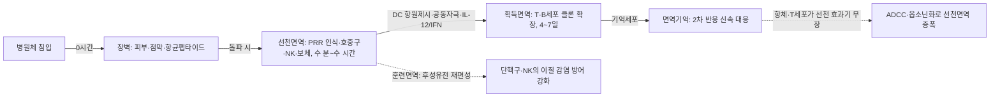

# 선천면역과 획득면역의 대조 (先天性免疫과 獲得性免疫의 對照, Innate versus Adaptive Immunity)

선천면역(先天性免疫, innate immunity)과 획득면역(獲得性免疫, adaptive/acquired immunity)은 인체 방어를 구성하는 두 축이다. 선천면역은 수곡(水穀)의 정미(精微)에서 화생해 피부·분육(分肉)을 순행하며 외사(外邪)에 즉시 대응하는 위기(衛氣)의 방어에, 획득면역은 항원과의 조우(遭遇)를 기억하고 다음 침입에 특이적·기억적으로 대응하는 정기(正氣)의 축적에 각각 개념적으로 상응한다[교과서적 근거]. 이 문서는 한방생리학 각론 면역계 폴더의 대조(對照) 총론 문서로서, 두 면역 축의 인식 원리·시간축·세포·분자·기억 메커니즘을 체계적으로 비교하고, 그 대조 틀이 한의사의 임상 판단(변증·치법 선택·예후 예측)에 어떻게 적용되는지를 인체 대상 근거와 함께 정리한다.

---

## 제1편 총론 — 두 면역 축의 정의와 구분 기준

### 1. 선천면역의 정의

선천면역(先天性免疫, innate immunity)은 태어나면서 갖추고 있는 방어로, 병원체의 공통 분자 패턴을 미리 프로그램된 수용체로 인식하여 감염·손상 후 **수 분~수 시간 내** 에 동원되는 비특이적·즉시성 방어다[교과서적 근거]. 피부·점막 장벽, 호중구·단핵구/대식세포·수지상세포·NK세포·ILC 등의 세포, 보체·급성기 단백질·제1형 인터페론 등의 체액 분자가 협동하며, 개별 병원체를 구분하지 않고 "위험한 무리" 전체에 패턴 단위로 대응한다[교과서적 근거]. 그러나 "기억이 없는 방어"라는 오랜 교과서 서술은 이제 수정되었다 — BCG 접종 인간에서 단핵구의 후성유전학적 재프로그래밍을 통해 항원 비특이적 이질 감염 방어가 강화된다는 훈련면역(trained immunity)의 인체 실증[^1]이 그 근거다.

### 2. 획득면역의 정의

획득면역(獲得性免疫, adaptive/acquired immunity)은 생애 동안 항원과의 조우를 통해 획득되는 특이적 방어다. 무작위 유전자 재조합(V(D)J recombination)으로 만들어진 T세포수용체(TCR)·B세포수용체(BCR)가 각각 특정 항원 에피토프를 인식하고, 흉선·골수의 자기반응 클론 제거(중추 관용)와 말초 관용으로 자기를 공격하지 않도록 이중으로 걸러진다[교과서적 근거]. 반응 개시에 4~7일이 소요되지만, 한 번 형성된 기억 T세포·기억 B세포는 수년~수십 년 지속되어 재감염 시 더 빠르고 강한 2차 반응을 낸다[교과서적 근거]. 백신은 이 기억 형성을 인위적으로 조달하는 대표적 획득면역 조작이며, 장기 면역기억 형성이 선천면역의 훈련면역과 T·B세포 기억 모두에 의해 강화된다는 최근 정리[^2]는 두 축의 기억이 협동함을 보여준다.

### 3. 대조의 다섯 축 — 시간·특이성·기억·세포·인식 원리

| 대조 축 | 선천면역 | 획득면역 |
| --- | --- | --- |
| **반응 개시** | 수 분~수 시간 | 4~7일 (1차 반응), 재노출 시 수 시간 (2차 반응) |
| **인식 대상** | PAMP·DAMP (그룹 패턴) | 항원 에피토프 (개별 항원) |
| **인식 수용체** | PRR (TLR·RLR·NLR·CLR, 배 genome 코딩) | TCR·BCR (V(D)J 무작위 재조합) |
| **특이성** | 낮음 (병원체 그룹 단위) | 높음 (항원 단위·클론 단위) |
| **기억** | 훈련면역 (주~월 단위, 후성유전·대사 재편) | 면역기억 (연~십년 단위, 클론 확장) |
| **주요 세포** | 호중구·Mφ·DC·NK·ILC·비만세포 | T세포·B세포·형질세포·기억세포 |
| **주요 분자** | 보체·급성기 단백질·IFN-α/β·항균펩타이드 | 항체(Ig)·IL-2·IFN-γ·면역관문 분자 |
| **자기 인식** | 위험 신호 중심 (danger model) | 중추·말초 관용 (클론 제거·Treg) |
| **한의학 상관** | 위기(衛氣) | 정기(正氣)·영혈(營血) |

> 이 표는 교과서적 대조 틀을 정리한 것이며, 두 축은 독립 계통이 아니라 제5편에서 다루는 가교로 연결된 하나의 네트워크다. "선천=무기억, 획득=유기억"의 이분법은 훈련면역의 발견 이후 절대적 서술이 아니다.

---

## 제2편 인식 원리의 대조 — 패턴인식과 항원특이 수용체

### 1. 선천면역의 패턴인식 — PRR·PAMP·DAMP와 위험 모델

선천면역 세포는 배genome(germline)에 코딩된 패턴인식수용체(PRR)를 통해, 진화적으로 보존된 병원체 공통 분자패턴(PAMP; LPS·펩티도글리칸·비분해 CpG DNA·이중가닥 RNA 등)과 조직 손상 시 방출되는 위험 신호(DAMP; ATP·HMGB1·열충격단백질 등)를 인식한다[교과서적 근거]. 이 인식 체계는 "자기/비자기" 이분법을 넘어 "위험/무해"를 구분하는 위험 모델(danger model)의 분자적 기반으로, 자기 조직의 손상 산물도 면역반응을 유발할 수 있음을 설명한다[교과서적 근거]. 인간의 선천 항바이러스 방어는 개인차가 커서, 건강인 사이에서도 내인성 인터페론·TNF 수준에 따라 초기 항바이러스 저항성이 계통적으로 다르며 반복 상기도 감염자는 이 선천 저항성이 유의하게 낮다는 인체 연구가 있다[^3]. PRR 자극은 획득면역의 보조제로도 쓰인다 — 식도편평상피암 환자에서 TLR9 작용제(CpG)를 펩타이드 백신에 병용하자 항원 특이적 T세포 반응과 함께 선천면역이 강화되었다[^4].

### 2. 획득면역의 클론성 인식 — TCR·BCR·V(D)J 재조합과 흉선 선별

획득면역의 인식은 무작위성과 선별의 2단 구조다. TCR·BCR의 다양성은 V(D)J 재조합으로 무작위 생성되고, 흉선(양성 선별: 자기-MHC 인식, 음성 선별: 자기반응 클론 제거)과 골수(자기반응 B세포 제거)에서 "자기를 공격하지 않으면서 자기-MHC 위의 이물을 볼 수 있는" 클론만 남는다[교과서적 근거]. 중추 선별을 통과한 자기반응 클론의 말초 통제는 조절성 T세포·무반응(anergy)·활성화 유도 세포사멸(AICD)이 담당한다[교과서적 근거]. 이 선별 체계의 실패가 자가면역이고, 가교 분자(CD80/86-CD28·CTLA-4·PD-1)의 이상은 관문병리로 이어진다(개별 문서 텍스트 교차 참조). MHC 항원제시 경로의 세부 생리는 주조직적합성복합체(MHC) 문서에서 상술한다.

### 3. 자기·비자기 구분의 이중 안전장치

선천면역은 위험 신호의 유무로, 획득면역은 클론 선별과 관용으로 자기를 구분한다 — 두 축은 서로 다른 논리로 같은 문제(자기 공격 방지)를 푼다. NK세포는 MHC-I 발현 소실을 "missing-self"로 감지해 MHC 의존적 감시의 빈틈을 메우며, 이는 획득면역의 MHC 기반 인식과 상보적 관계다[교과서적 근거]. EBI2(옥시스테롤 수용체)가 대식세포의 인터페론 반응을 억제해 선천·획득면역의 과활성을 함께 제한한다는 인간 데이터[^5]는 두 축을 잇는 조절 계통의 존재를 보여준다.

---

## 제3편 세포와 분자의 대조

### 1. 세포 구성 — 골수계 효과기 대 림프계 효과기

선천면역의 세포는 대부분 골수계(myeloid)다. 호중구는 급성 감염의 최초 도달 세포로 탐식·호흡폭발·세포외덕(NETs)을, 단핵구/대식세포는 탐식·항원제시·사이토카인 생산을, 수지상세포는 전문 항원제시를 담당한다[교과서적 근거]. NK세포·ILC는 림프계 계통이나 항원특이 수용체 없이 선천방어를 수행한다[교과서적 근거]. 획득면역의 세포는 T세포(CD4 보조: Th1/Th2/Th17/Tfh/Treg, CD8 세포독성)와 B세포(항체 생산·형질세포·기억)로, 각 세포의 세부 생리는 이 폴더의 개별 문서(호중구·대식세포·NK세포·고유 림프구 등)에서 상술한다. 두 계통의 세포 분포·순환은 해부학 폴더의 면역계 문서와 혈액계 조혈 문서에서 다룬다.

### 2. 분자 구성 — 보체·급성기 단백질·인터페론 대 항체·사이토카인·면역관문

선천면역의 대표 분자는 보체(고전·대체·레크틴 3경로 → 옵소닌화·아나필라톡신·MAC), 간의 급성기 단백질(CRP·SAA), 감염 세포의 제1형 인터페론(IFN-α/β), 항균펩타이드(디펜신·카텔리시딘)다[교과서적 근거]. 획득면역의 대표 분자는 면역글로불린 5클래스(IgM·IgG·IgA·IgE·IgD), T세포 사이토카인(IL-2·IFN-γ·IL-4·IL-17), 면역관문 분자(CTLA-4·PD-1)다[교과서적 근거]. 코로나19 중증 폐에서 IFN-γ·TNF-α 공동자극으로 유도된 CXCL10+CCL2+ 염증성 대식세포 표현형이 류마티스관절염·크론병 등 조직 손상 질환의 폐 이질군과 공유된다는 인간 단일세포 수준 분석[^6]은, 선천(대식세포 극성화)과 획득(T세포 사이토카인 IFN-γ)의 분자 언어가 질환 표현형을 공동으로 쓴다는 사실을 보여준다.

### 3. 효과기전의 대조 — 탐식·세포독성 대 항체 매개 반응

선천 효과기전은 탐식·세포독성(granzyme/perforin)·보체 용해·염증 확산 등 "직접 제거" 중심이고, 획득 효과기전은 항체 중화·옵소닌화·ADCC(항체의존세포독성)·CTL 살해 등 "특이적 조준" 중심이다[교과서적 근거]. 그러나 획득면역의 무기는 대부분 선천 효과기를 무장시킨다 — IgG는 보체를 고전경로로 활성화하고 대식세포·NK세포의 Fc 수용체를 통해 탐식·ADCC를 유도한다. 즉 획득면역은 "선천 세포에 조준경을 달아주는" 계통이며, 두 축의 효과기전은 계단이 아니라 직조(織조) 구조다[교과서적 근거].

---

## 제4편 기억의 대조 — 면역기억과 훈련면역

### 1. 획득면역의 기억 — 기억 T세포·기억 B세포·2차 반응

획득면역의 기억은 클론 확장 후 수축 과정에서 남는 기억 T세포(Tcm·Tem·Tscm)·기억 B세포·장기형질세포가 담당한다. 1차 반응은 IgM 우선·잠복기 4~7일·저친화도지만, 2차 반응은 IgG 우선·수 시간 내 개시·고친화도·대량 생산이라는 질적 도약을 보인다[교과서적 근거]. MERS 회복자가 코로나19 백신 접종·돌파감염을 겪으며 β-코로나바이러스 공통 부위(stem helix)에 대한 교차 반응성 항체·T세포 기억이 다시 상승한 관찰[^7]은 기억의 지속·재동원, 그리고 면역 각인(immunological imprinting)의 양면을 함께 보여준다. 신이식 환자에서 XBB.1.5 백신 부스터 접종 시 새 변이에 대한 반응이 과거 우한 변이 기억에 의해 각인되어 제한된다는 관찰[^8]은 기억이 항상 이로운 것만은 아님을 보여주는 반면 사례다.

### 2. 선천면역의 기억 — 훈련면역(trained immunity)과 후성유전 재프로그래밍

훈련면역은 선천면역 세포(주로 단핵구·대식세포·NK세포)가 PRR 자극(β-글루칸·BCG 등) 후 후성유전학적·대사적 재프로그래밍을 겪어, 이후의 이질 자극에 대해 증폭된 반응을 보이는 현상이다. BCG 접종 건강인에서 황색포도상구귡 등 세균뿐 아니라 바이러스 감염에 대한 비특이적 보호가 IL-1β 매개 훈련면역으로 확인된 인체 무작위시험[^1]이 원형 근거다. 분자 수준에서 β-글루칸 유도 훈련면역에 Set7 메틸전이효소(H3K4me1 표지·산화적 인산화 가소성)가 필수적임이 밝혀졌고[^9], 인체 유전통합분석에서 KDM4 히스톤 탈메틸화효소가 훈련면역 반응의 개인차를 결정한다[^10]. 코로나19 회복자의 단일세포 후성유전체 분석은 단핵구에 훈련면역이 실제로 설립됨을 세포 수준에서 입증했다[^11].

임상적으로 훈련면역은 양날이다. 불안정형 협심증 환자에서 hsCRP 상승군의 말초 단핵구에 훈련면역이 강화되어 잔여 염증 위험(residual inflammatory risk)을 만든다는 관찰[^12], 원발성 소건증후군에서 제1형 인터페론이 단핵구 훈련면역을 유도해 전동맥경화 표현형을 만든다는 연구[^13], 통풍에서 급성 NLRP3-IL-1β 축 활성화가 관해기의 훈련면역 상태로 전이되어 재발 위험을 규정한다는 시공간적 분석[^14], 자가염증질환과 만성 부비동염·COPD에서 병리적 훈련면역이 만성화·치료저항을 견인한다는 정리[^15][^16][^17]는, 기억이 질환의 만성축으로도 전환됨을 보여준다.

### 3. 두 기억의 만남 — 백신·감염 회복에서의 협동

백신의 장기 보호는 T·B세포 기억과 훈련면역의 합작이다. 백신 접종 초기의 선천면역 반응 강도가 후기 항체가를 예측한다는 시스템 백신학 인체 연구(에볼라 백신에서 3일차 IP-10·NK세포 CXCR6 발현이 항체 반응의 상관인자)[^18]는 "선천 반응 없이 획득 기억 없다"를 데이터로 보여준다. 고령자의 저백신반응 개선을 위한 대사·후성유전 조절 전략이 기억 형성의 양 축을 함께 표적으로 삼아야 한다는 정리[^2]는 임상 적용의 방향을 제시한다. 훈련면역의 유도 자체를 치료 전략으로 삼는 시도도 있다 — 비강 유래 Mycobacterium manresensis 제제가 시험관 내 단핵구 훈련면역을 유도하지만 인체 경구 투여에서는 SARS-CoV-2 감염률 감소·단핵구 변화에 유의한 효과가 없었다는 임상시험[^19]은 훈련면역의 임상 전환 난이를 정직하게 보여준다.

---

## 제5편 가교 — 선천면역이 획득면역의 질을 결정한다

### 1. 수지상세포의 가교 — 항원제시·공동자극·사이토카인 환경

두 축을 잇는 핵심 세포는 수지상세포다. PRR 자극으로 성숙한 수지상세포는 MHC-항원 펩타이드(신호 1), CD80/CD86-CD28 공동자극(신호 2), 극성화 사이토카인(신호 3; IL-12→Th1, IL-4/13→Th2, IL-6+TGF-β→Th17/Treg)을 림프조직의 처녀 T세포에 전달한다[교과서적 근거]. 공동자극 없는 항원 노출은 무반응(anergy)을 낳고, 신호 3의 사이토카인 조성이 어떤 효과기 무기를 만들지 결정한다 — 즉 "획득면역이 어떤 병에 어떻게 대응할지는 선천면역이 조성한 국소 환경이 미리 결정한다."(CD40·CD80·CD86 개별 문서 텍스트 교차 참조)

### 2. 제1형 인터페론과 NK-DC-T 세포 연쇄

제1형 인터페론(IFN-α/β)은 감염 초기 선천면역의 경보 사이렌이자 획득면역의 기폭제다. IFN은 CTL·NK 활성과 항원제시를 강화하고, 코로나19에서 초기 IFN 반응 후 획득면역 전환이 늦어지면 중증화한다는 임상 관찰[^20]·중증 폐의 과도한 IFN 자극 유전자 발현[^21]은 시점별 IFN의 양면성(조기 보호 vs 지속 과염증)을 보여준다. 제1형 IFN의 과도한 지속은 전신 자가면역(루푸스 등)의 병태이기도 하여[^22], "선천 경보가 고장 나면 획득 면역이 자기를 겨냥한다"는 것이 자가면역 병리의 대표 서술이다. NK세포-수지상세포 상호작용은 초기 감염에서 IFN-γ·IL-12 교차 활성화로 T세포 반응의 강도·시점을 미리 조율한다[교과서적 근거].

### 3. 가교 실패의 임상 — 급성 감염 중증화와 만성화

가교 실패의 두 갈래는 임상에서 뚜렷이 구분된다. ① 조기 선천 제어 실패 → 획득 전환 지연 → 급성 중증화(패혈증·중증 호흡기 감염). ② 선천 반응의 만성 과잉·훈련면역 병리화 → 획득면역의 만성 활성화 → 만성 염증·자가면역·동맥경화 잔여 위험[^12][^13][^16]. 말라리아 반복 노출로 형성된 "임상적 내성"이 선천 활성화·T세포 신호·혈소판 활성화의 통합 상태임을 보인 대사체·전사체 통합분석[^23]은, 숙주-병원체 균형이 두 축의 협동 상태라는 관점을 극단적으로 보여준다.

---

## 제6편 한의학적 상관 — 위기(衛氣)와 정기(正氣)의 대응

### 1. 위기 — 즉시성·비특이성 방어의 상관

위기(衛氣)는 수곡(水穀)의 정미(精微) 중 "標悍滑疾(표한활질)"한 부분이 상초(上焦)에서 선발(宣發)되어 "分肉(분육)을 순행하고 주리(腠理)를 온유(溫養)하며 개합(開合)을 주관"하는 방어기다[교과서적 근거]. 『영추·본장』은 "衛氣者, 所以溫分肉, 充皮膚, 肥腠理, 司開闔者也(위기자, 소이온분육, 충피부, 비주리, 사개합자야)"라 하였다[교과서적 근거]. 즉각적(標悍)이고 특정 병사를 구분하지 않으며(外邪 전반 방어) 피부·주리(장벽)와 분육(조직)을 무대로 작동한다는 점에서, 위기는 선천면역·장벽 방어의 개념적 상관물로 읽힌다. 발한·오한·발열 등 외감(外感) 초기 증상이 위기-영기 국면의 싸움(영위불화)으로 파악되는 전통 병리학은, 급성기 선천면역 반응(발열·오한·염증)의 임상 관찰을 변증 언어로 기술한 체계다[교과서적 근거].

### 2. 정기·영위(營衛) — 기억성·특이성 방어의 상관

정기(正氣)는 선천지본(腎精)과 후천지본(脾胃)의 수렴로 축적되는 전신 기능 총력이며, "정기존내(正氣存內) 사불가간(邪不可干)"의 강령은 방어력의 축적이 병발을 결정한다는 관찰의 압축이다[교과서적 근거]. 감염·항원 노출·백신을 거치며 축적되는 특이적 기억과, 정기(신장정·후천수곡정미)의 점진적 축적은 구조적으로 상응한다. 영기(營氣)가 맥중(脈中)을 순행하며 오장을 자양하고 위기와 음양으로 짝을 이루는 영위(營衛) 이론은, "맥중 영양(체액·혈중 분자)"과 "맥외 순찰(조직·세포성 순찰)"의 분업이라는 면역학적 구조와 개념적으로 대응한다[교과서적 근거]. 영위조화(營衛調和)는 단순한 은유가 아니라 두 면역 축의 균형 상태를 가리키는 임상 판단 단위로 쓸 수 있다 — 계지탕(桂枝湯)증의 영위불화(자한·발열·악풍) 해석이 그 원형이다[교과서적 근거].

### 3. 영위조화(營衛調和) — 두 축의 균형이라는 관점

한의학은 면역을 "올리는" 학문이 아니라 "조화시키는" 학문으로 파악해 왔다. 위기고탁(衛氣固)·영위화(營衛和)는 감염을 이겨내는 방어 상태이고, 위기허(衛氣虛)·주리불고(腠理不固)는 반복 감염 상태, 영위불화·위기울체(鬱滯)는 만성 염증·알레르기 상태의 변증 언어로 대응된다[교과서적 근거]. 현대의 훈련면역 병리[^12][^16]는 "위기가 지나치게 각인되면(火鬱·瘀) 병이 만성화한다"는 전통적 격병(格病) 관찰과 놀랍게 상응한다. 이 문서는 위기=선천면역·정기=획득면역의 일대일 환원을 주장하지 않는다 — 다만 두 체계가 해결하려는 문제(외부 침입의 즉시 차단과 재침입의 기억 대응)가 상동(相同)하며, 변증 층위(허실·영위·기혈)가 면역 축별 상태 파악에 임상적 틀을 제공한다는 상관론이다.

---

## 제7편 임상 적용 — 대조 틀로 읽는 질환과 한의학 치료

### 1. 질환 읽기 — 어느 축의 실패인가

| 질환군 | 주 실패 축 | 대조 틀에서의 병리 | 한의학 병기 읽기 | KCD-8 |
| --- | --- | --- | --- | --- |
| 반복 호흡기 감염 | 장벽+선천 (위기불고) | 선천 초기 제어 지연·훈련면역 미설립 | 衛氣虛·腠理不固·肺氣虛 | J00-J06 등 |
| 급성 중증 감염·패혈증 | 선천→획득 가교 | 초기 IFN 지연·획득 전환 실패·사이토카인 폭풍 | 熱毒熾盛·正不敵邪 | A40-A41 |
| 알레르기 질환 | 획득 (Th2 우세) | Th1/Th2 불균형·IgE·Treg 부족 | 肺衛不固·風邪犯表·脾虛濕盛 | J30, L20-L30 |
| 자가면역질환 | 관용 실패 (획득)+선천 과잉 | 관용 붕괴·IFN-I 과잉·훈련면역 병리 | 正氣失調·陰虛火旺·熱毒 | M05-M35 등 |
| 만성염증·동맥경화 잔여위험 | 선천 기억의 병리화 | 단핵구 훈련면역·IL-1β·IL-6 지속 | 痰瘀互結·火鬱 | I25 등 |
| 면역결핍 (원발성·HIV) | 획득 (세포성) 우선 | T세포·항체·가교 전 계통 결핍 | 正氣大虛·精氣耗損 | D80-D84, B24 |

> 이 표는 임상 틀이자 동일 근거수준의 권고가 아니며, 각 질환의 병태생리를 축 환원으로 단순화하는 틀도 아니다. 실제 질환은 두 축이 혼재하며, 각 질환의 상세 KCD 각론은 개별 문서에서 다룬다.

### 2. 한의학 치료의 축별 근거 — 위기 고정(固表)과 정기 축적

**선천 축(위기) 개입의 근거** — 침구·한약이 선천면역 지표를 개선한 인체 근거: 반복 호흡기 감염 소아(비허증)에서 가감 인삼오미자탕이 CD3·CD4·CD8 등 T세포 표지와 아연·철을 회복시켰다는 임상시험[^24], 알레르기비염 폐기비허(肺氣脾虛)형에서 방풍고본과립(防風固本顆粒)이 IFN-γ 상승·IL-4 하강으로 Th1/Th2 불균형을 교정했다는 임상시험[^25], 재발성 호흡기 유두종에서 중의약 병행 수술이 IgG·T/B세포 면역지표를 개선해 무재발 기간을 늘렸다는 임상시험[^26]이 대표적이다. 이들 처방의 논리 — 益氣固表(익기고表)·補脾益肺 — 는 "위기의 생성 원천(수곡정미·비위)을 보강해 장벽·선천 순찰을 강화한다"는 전통 치법 그 자체다.

**획득 축(정기·기억) 개입의 근거** — 알레르기·자가면역 질환에서 침구·한약이 획득면역 매개물(사이토카인 균형·항체·T세포)을 조절한 근거: 태음인 뇌경색 급성기의 율다한소탕이 Th1(IFN-γ·IL-2) 상승·Th2(IL-4·IL-6·IgE) 하강의 사이토카인 재조정을 보였다는 임상시험[^27], 만성두드러기 침·뜸 병행이 세포성 면역지표·Th1/Th2 불균형을 개선하며 유효율을 높였다는 임상시험[^28], 지속성 알레르기비염의 보중익기탕(補中益氣湯) 2상 프로토콜[^29]이 있다. 암 면역 영역에서는 NK세포를 축으로 한 한약의 체계적 고찰[^30], 화학요법 병행 한약의 세포성 면역지표 개선 메타분석[^31], 자완유제 주사액의 CD3·CD4·NK 상향[^32]이 "정기 축적"의 임상 변역으로 읽힌다.

**두 축의 조절(조화)로서의 침구** — 침구의 면역 조절이 상태 의존적 양방향성(정상인 상향·자가면역 환자 조절)을 보인다는 전제(면역 총론 문서 텍스트 교차 참조)는, 동일 침구 자극이 위기 부족 상태에서는 고표(固表)·정기 부족 상태에서는 부정(扶正)으로 작용하는 변증 개별화의 생물학적 토대다. 변증 없는 관행적 취혈·처방, 그리고 변증 없이 획일적으로 "면역을 증진"하는 침구·한약은 이 근거 구조에 부합하지 않는다.

### 3. 감별 실무 순서

① 병력의 시간 구조 파악 — "감기가 3일에 끝나는가(선천 제어 성공), 7일 이상 끌리는가(획득 전환 지연), 같은 병이 반복되는가(기억·관용 문제)" ② 기질질환 배제 — 원발성 면역결핍·HIV·혈액질환·자가면역(표준 검사) ③ 면역 지표 참고 — 백혈구·림프구·CD4/CD8·NK활성·Ig·CRP·사이토카인 ④ 변증 층위 — 위기(장벽·선천)·영혈(체액·특이)·허실 ⑤ 치법 방향 설정 — 위기불고형은 익기고표, 정기허형은 보비 익신, 영위불화형은 조영위(解肌·화영), 실열형은 청열해독.

---

## 제8편 예후와 관리

### 1. 예후 인자

예후는 ① 어느 축의 실패인가 ② 기질질환 유무 ③ 훈련면역의 방향(보호적 vs 병리적) ④ 정기의 축적도(영양·수면·연령·사상체질 소인)에 달려 있다. 선천 축 실패(반복 감염)는 대부분 보존적 관리로 예후가 좋으나, 획득 축 실패(관용 붕괴)는 표준 면역치료와의 공동 관리가 필수다.

### 1-1. 안전성 — 축별 주의사항

| 위험 | 내용 | 대응 |
| --- | --- | --- |
| 실열 급성기의 보법(補法) 오용 | 사기항성(邪氣亢盛) 급성기에 부정(扶正)만 가하면 사기를 조장할 수 있음 | 급성 열병은 청열·거사 우선, 회복기에 보법 병행 |
| 자가면역환자의 "면역 증진" 보조제 | Th1/Th2·IFN-I에 개입하는 보조제·한약이 자가면역을 악화시킬 가능 | 항상 조절(調) 방향 처방, 류마티스내과 등과 병용 여부 협의 |
| 훈련면역 병리 상태(잔여 염증)에서의 온보(溫補) | hsCRP 상승·만성염증 상태에서 순한 보양은 염증 각인을 강화할 수 있음 | 청열·활혈·화어 방향 우선, 염증 지표 모니터링 |
| 강력한 면역조절 한약 | 뇌공등천초(雷公藤) 등 골수억제·간독성 가능 | 혈액·간기능 모니터링, 전문 처방 한정 |
| 생물학적제제 병용 환자 | 항TNF·항IL-6 등 표준 면역억제제와 한약의 상호작용 개별 확인 | 주치의와 병용 목록 공유 |

> 이 표는 임상 주의 틀이며, 개별 약물의 금기·용량은 각 본초·처방 문서와 최신 지침을 따른다.

### 2. 추적 지표표

| 감별 축 | 추적 지표 |
| --- | --- |
| 선천 축 | 반복 감염 횟수, 백혈구·호중구, NK세포 활성, CRP·ESR, 타액 IgA |
| 획득 축 | 혈청 IgG·IgA·IgM·IgE, 특이 항체가, CD4/CD8, 림프구 증식 반응 |
| 가교 | IL-6·TNF-α·IFN, 항원 특이 T세포 반응(백신 반응 등) |
| 훈련면역 병리 | hsCRP, IL-1β, 단핵구 사이토카인 분비능 |
| 주관 상태 | 피로척도, 수면(PSQI), 감기 기간(일) |

> 이 표는 임상 틀이자 동일 근거수준의 권고(필수 검사)가 아니다. 지표 선택은 환자 상태와 공동 진료과 협의로 결정한다.

### 3. 조섭표

| 항목 | 지도 내용 | 이론적 근거 |
| --- | --- | --- |
| 수면 | 자정 이전 취침·수면 부재 회피 (선천 항바이러스 저항성 유지) | "衛氣晝行於陽, 夜行於陰" + 인체 인터페론 개인차[^3] |
| 식이 | 수곡정미 보충 — 과식·생략 절제 (위기·영기의 생성 원천) | "衛出於水穀之精" |
| 활동 | 규칙적 유산소·기공 (훈련면역의 보호적 유도) | 養正避邪 |
| 방호 | 유행기 마스크·손위생·환기 ("虛邪賊風 避之有時") | "避其毒氣" |
| 정서 | 만성 스트레스 관리 (잔여 염증 위험 억제) | 恬惔虛無·眞氣從之 |
| 백신 | 표준 예방접종 준수 — 한의학 요법은 기억 형성의 보조 | 正氣存內 + 시스템 백신학[^18] |

> 이 표는 생활지도 틀이며, 각 항목의 근거 수준은 관행·관찰·인체 연구가 혼재한다.

### 4. 환자 설명용 요약

> 우리 몸의 면역은 크게 두 팀으로 나뉩니다. "위기(衛氣)"에 해당하는 첫 번째 팀은 병균이 들어오면 즉시 달려나가 막는 순찰대이고, "정기(正氣)"에 해당하는 두 번째 팀은 그 병균을 기억했다가 다음에 빠르고 정확하게 대응하는 특수부대입니다. 두 팀은 따로 일하지 않습니다. 순찰대가 병균의 정보를 특수부대에 넘겨야 특수부대가 제대로 무장합니다. 감기가 3일에 끝나면 순찰대가 잘 일한 것이고, 같은 병이 자주 반복되면 두 팀의 연결이 약하다는 신호일 수 있습니다. 수면·식사·운동을 가다듬고 필요하면 침구·한약으로 팀을 조율할 수 있습니다. 다만 같은 병이 반복되거나 회복이 지나치게 늦을 때는 표준 검사로 원인 질환을 확인하는 것이 우선입니다.

### 5. Q&A

**Q1. "선천면역은 기억이 없다"고 배웠는데, 훈련면역은 무엇입니까?**

기존 교과서 서술이 수정된 부분이다. BCG 접종 인간에서 단핵구의 후성유전 재프로그래밍으로 항원 비특이적 바이러스 감염 방어가 강화된다는 무작위시험[^1]과 코로나19 회복자의 단핵구에 실제로 훈련면역이 설립됨을 보인 단일세포 후성유전체 분석[^11]이 핵심 근거다. 다만 획득면역의 항원특이적 기억(연~십년)과 달리 훈련면역은 주~월 단위의 비특이적·가역적 상태라는 점에서 질적으로 다르다.

**Q2. 환자에게 "위기와 정기 중 무엇이 부족한지"를 어떻게 설명합니까?**

"위기는 병균을 즉시 막는 순찰대, 정기는 병균을 기억하는 특수부대"로 비유한다. 감기가 자주 들어오지만 3일에 끝나면 순찰대(위기·선천면역) 강화 — 익기고표 방향, 병은 오래 끌지 않지만 같은 병이 반복되거나 백신 반응이 약하면 특수부대(정기·획득면역) 지원 — 보비·익신 방향으로 접근을 달리 한다.

**Q3. 알레르기는 면역이 "넘치는" 병인가요?**

축으로 보면 획득면역(Th2·IgE)의 편향이지 면역 전체의 과잉이 아니다. 방풍고본과립이 IFN-γ/IL-4 비율을 교정했다는 임상시험[^25]·보중익기탕의 알레르기비염 프로토콜[^29]처럼 한의학 치료의 목표는 "올리거나 내리는" 것이 아니라 Th1/Th2·영위의 균형 회복이다.

**Q4. 훈련면역이 병을 만든다는 말이 혼란스럽습니다.**

같은 기전의 두 얼굴이다. 감염 대비 보호(BCG[^1])로도, 만성 염증·잔여 위험(불안정형 협심증[^12]·소건증후군[^13]·만성 부비동염[^16]·COPD[^17])으로도 작동한다. 임상적 함의는 명확하다 — "무조건 선천면역을 각인시키는" 자극이 아니라, 환자의 상태(실열·허·어혈)에 따라 각인의 방향을 조절하는 변증 접근이 필요하다.

**Q5. 반복 감염 아이에게 한약이 도움 됩니까?**

인체 근거의 방향은 있다. 반복 호흡기 감염·비허증 소아에서 가감 인삼오미자탕이 T세포 표지·미량원소를 회복시켰다는 임상시험[^24]이 대표적이다. 다만 기질적 원인(원발성 면역결핍·흉선·혈액질환) 배제가 선행해야 하며, 한약은 표준 치료와 병행하는 보조 위치다.

**Q6. 백신 접종 전후에 한의학 요법이 도움이 됩니까?**

백신 반응의 질은 접종 초기 선천 반응이 결정한다는 시스템 백신학 근거[^18]가 있으므로, 접종 전후의 수면·영양·스트레스 관리(조섭)는 합리적 보조다. 특정 한약·침구의 백신 반응 증강을 주장하는 인체 근거는 아직 충분하지 않으므로, 표준 예방접종을 대체하지 않는 범위에서만 활용한다.

**Q7. 이 대조 틀에서 자가면역은 어떻게 읽습니까?**

"획득면역의 관용 실패 + 선천면역의 과잉 경보(IFN-I·훈련면역 병리)"의 합작으로 읽는다[^13][^22]. 한의학 병기로는 正氣失調(정기 자체의 조율 실패)·음허화왕·열독에 해당한다. "정기를 보하면 자가면역이 악화된다"는 속설은 정기를 단순 상향 조절로 오해한 것 — 정기의 본래 의미는 균형된 방어력이므로, 치법은 보(補)보다 조(調)·청(清)·화(和)가 중심이 된다.

**Q8. 침구가 어느 면역 축에 작용합니까?**

양 축 모두에 작용한다는 관찰이 우세하다 — 타액 IgA·자율신경(선천·점막면역)[면역 총론 문서 텍스트 교차 참조], Th1/Th2·항체 조절(획득)[^28]. 작용 방향이 대상 상태에 따라 다르므로(양방향성), "축"보다 "균형 회복"으로 이해하는 것이 근거에 부합한다.

**고전 인용 출처**: 『黃帝內經 素問』(刺法論, 評熱病論, 瘧論), 『靈樞』(本藏, 營衛生會, 百病始生), 『難經』, 『傷寒論』, 『金匱要略』

**문헌 데이터 출처**: [한의학 논문 데이터베이스 (med.symbolicinfo.com)](https://med.symbolicinfo.com) — 2026-08-31 조회 기준

[^1]: BCG Vaccination Protects against Experimental Viral Infection in Humans through the Induction of Cytokines Associated with Trained Immunity. Arts RJW 외. _Cell Host & Microbe_. 2018-01-10. [임상시험] [DOI 10.1016/j.chom.2017.12.010](https://doi.org/10.1016/j.chom.2017.12.010) [PMID 29324233](https://pubmed.ncbi.nlm.nih.gov/29324233/) — BCG 접종 인간에서 단핵구 후성유전 재프로그래밍으로 항원 비특이적 바이러스 감염 방어가 강화. 훈련면역의 원형 인체 실증.
[^2]: Perspectives on the Development of Immune Memory Associated with Vaccination. He P 외. _Vaccines_. 2026-05-07. [문헌 고찰] [DOI 10.3390/vaccines14050420](https://doi.org/10.3390/vaccines14050420) [PMID 42188792](https://pubmed.ncbi.nlm.nih.gov/42188792/) — 백신의 장기 면역기억이 T·B세포 기억과 선천면역 훈련면역 모두에 의해 강화됨을 정리. 두 기억의 협동 틀.
[^3]: Individual differentiation of innate antiviral immunity in humans; the role of endogenous interferons and tumor necrosis factor. Orzechowska B 외. _Archivum Immunologiae et Therapiae Experimentalis_. 2003. [실험연구(인체 백혈구)] [PMID 12691304](https://pubmed.ncbi.nlm.nih.gov/12691304/) — 인간의 선천 항바이러스 저항성이 내인성 IFN·TNF 수준에 따라 개인차를 보이며 반복 상기도 감염자는 이 저항성이 유의하게 낮음. 선천면역 개인차의 인체 근거.
[^4]: [Peptide vaccine therapy with TLR-9 agonist for patients with esophageal squamous cell carcinoma]. Katsuda M 외. _Gan to Kagaku Ryoho_. 2011-11. [임상시험] [PMID 22202246](https://pubmed.ncbi.nlm.nih.gov/22202246/) — TLR9 작용제(CpG) 병용 펩타이드 백신이 식도암 환자의 항원 특이 T세포 반응과 선천면역을 강화. PRR 자극-획득면역 증폭의 임상 예시.
[^5]: The Oxysterol Receptor EBI2 Links Innate and Adaptive Immunity to Limit IFN Response and Systemic Lupus Erythematosus. Zhang F 외. _Advanced Science_. 2023-09. [실험연구(인체 데이터 한정)] [DOI 10.1002/advs.202207108](https://doi.org/10.1002/advs.202207108) [PMID 37469011](https://pubmed.ncbi.nlm.nih.gov/37469011/) — EBI2 수용체가 대식세포 IFN 반응을 억제해 선천·획득면역 과활성을 함께 제한. 두 축을 잇는 조절 계통의 인체 데이터.
[^6]: IFN-γ and TNF-α drive a CXCL10+ CCL2+ macrophage phenotype expanded in severe COVID-19 lungs and inflammatory diseases with tissue destruction. Zhang F 외. _Genome Medicine_. 2021-04-20. [실험연구(인체 단일세포 데이터 한정)] [DOI 10.1186/s13073-021-00881-3](https://doi.org/10.1186/s13073-021-00881-3) [PMID 33879239](https://pubmed.ncbi.nlm.nih.gov/33879239/) — 획득면역 사이토카인(IFN-γ·TNF-α)이 선천 세포(대식세포)의 염증 표현형을 구동. 두 축의 분자 언어가 질환 표현형을 공유함을 보여주는 단일세포 수준 인체 분석.
[^7]: Rise in broadly cross-reactive adaptive immunity against human β-coronaviruses in MERS-recovered patients during the COVID-19 pandemic. Kim SH 외. _Science Advances_. 2024-03. [관찰연구] [DOI 10.1126/sciadv.adk6425](https://doi.org/10.1126/sciadv.adk6425) [PMID 38416834](https://pubmed.ncbi.nlm.nih.gov/38416834/) — MERS 회복자의 기억 세포가 신종 코로나바이러스 노출 시 stem helix 공통 부위 교차 반응으로 재동원됨. 획득면역 기억의 지속·재동원·교차 반응의 인체 관찰.
[^8]: SARS-CoV-2 mRNA XBB1.5 vaccine immunogenicity in kidney transplant recipients. Surénaud M 외. _Virology Journal_. 2026-06-07. [관찰연구] [DOI 10.1186/s12985-026-03214-1](https://doi.org/10.1186/s12985-026-03214-1) [PMID 42252436](https://pubmed.ncbi.nlm.nih.gov/42252436/) — 신이식 환자에서 새 변이 백신 반응이 과거 우한 변이 면역 각인에 의해 제한. 면역기억의 양면(재동원 vs 각인 제한)을 보여주는 이식 면역 관찰.
[^9]: The Set7 Lysine Methyltransferase Regulates Plasticity in Oxidative Phosphorylation Necessary for Trained Immunity Induced by β-Glucan. Keating ST 외. _Cell Reports_. 2020-04-21. [실험연구(인체 세포 한정)] [DOI 10.1016/j.celrep.2020.107548](https://doi.org/10.1016/j.celrep.2020.107548) [PMID 32320649](https://pubmed.ncbi.nlm.nih.gov/32320649/) — β-글루칸 훈련면역에 Set7-H3K4me1 축의 대사 재편성(산화적 인산화 가소성)이 필수. 선천면역 기억의 분자 기전.
[^10]: An integrative genomics approach identifies KDM4 as a modulator of trained immunity. Moorlag SJCFM 외. _European Journal of Immunology_. 2022-03. [실험연구(인체 유전·세포 한정)] [DOI 10.1002/eji.202149577](https://doi.org/10.1002/eji.202149577) [PMID 34821391](https://pubmed.ncbi.nlm.nih.gov/34821391/) — KDM4 히스톤 탈메틸화효소가 훈련면역 반응의 개인차를 결정. 선천면역 기억의 유전적 조절 인체 근거.
[^11]: Single-cell epigenomic landscape of peripheral immune cells reveals establishment of trained immunity in individuals convalescing from COVID-19. You M 외. _Nature Cell Biology_. 2021-06. [실험연구(인체 단일세포 데이터 한정)] [DOI 10.1038/s41556-021-00690-1](https://doi.org/10.1038/s41556-021-00690-1) [PMID 34108657](https://pubmed.ncbi.nlm.nih.gov/34108657/) — 코로나19 회복자의 단핵구에 훈련면역이 실제로 설립됨을 단일세포 후성유전체 수준에서 입증. 훈련면역의 세포 수준 인체 실증.
[^12]: Enhanced Trained Immunity in Peripheral Monocytes in Unstable Angina With Elevated High-Sensitivity C-Reactive Protein. Zhang J 외. _JACC Basic to Translational Science_. 2025-07. [관찰연구] [DOI 10.1016/j.jacbts.2025.04.014](https://doi.org/10.1016/j.jacbts.2025.04.014) [PMID 40561640](https://pubmed.ncbi.nlm.nih.gov/40561640/) — hsCRP 상승 불안정형 협심증 환자의 단핵구에 훈련면역 강화. 잔여 염증 위험의 기전이자 훈련면역 병리화의 대표 인체 관찰.
[^13]: Trained Immunity in Primary Sjögren's Syndrome: Linking Type I Interferons to a Pro-Atherogenic Phenotype. Huijser E 외. _Frontiers in Immunology_. 2022. [실험연구(인체 데이터 한정)] [DOI 10.3389/fimmu.2022.840751](https://doi.org/10.3389/fimmu.2022.840751) [PMID 35860283](https://pubmed.ncbi.nlm.nih.gov/35860283/) — 제1형 IFN이 소건증후군 단핵구에 훈련면역을 유도해 전동맥경화 표현형 생성. 자가면역-선천기억-대사질환의 연결.
[^14]: Spatiotemporal immune gradients in gout: immune response-driven activation of the NLRP3-IL-1β axis and its transition to trained immunity. Wang K 외. _Frontiers in Immunology_. 2026. [문헌 고찰] [DOI 10.3389/fimmu.2026.1776479](https://doi.org/10.3389/fimmu.2026.1776479) [PMID 41836392](https://pubmed.ncbi.nlm.nih.gov/41836392/) — 통풍의 급성 NLRP3-IL-1β 축 활성화가 관해기 훈련면역 상태로 전이되어 재발 위험을 규정. 선천기억의 시공간적 병리 모델.
[^15]: Trained immunity in autoinflammatory diseases: Cellular reprogramming across the monogenic-polygenic spectrum. Sipos F 외. _European Journal of Cell Biology_. 2026-08-11. [문헌 고찰] [DOI 10.1016/j.ejcb.2026.151561](https://doi.org/10.1016/j.ejcb.2026.151561) [PMID 42585948](https://pubmed.ncbi.nlm.nih.gov/42585948/) — 단일·다유전자성 자가염증질환 전반에서 훈련면역 세포 재프로그래밍의 역할을 정리. 병리적 선천기억의 질환 스펙트럼.
[^16]: Trained immunity in chronic rhinosinusitis: epigenetic reprogramming of innate immune memory as a driver of mucosal inflammation. Huang GJ 외. _Frontiers in Immunology_. 2026. [문헌 고찰] [DOI 10.3389/fimmu.2026.1822395](https://doi.org/10.3389/fimmu.2026.1822395) [PMID 42528773](https://pubmed.ncbi.nlm.nih.gov/42528773/) — 만성 부비동염의 재발·치료저항이 TLR4+ ILC2·기저 줄기세포의 훈련면역적 염증 기억에서 비롯. 점막 만성화의 후성유전 모델.
[^17]: Chronic obstructive pulmonary disease reprograms the lung into an immune organ through trained immunity, cell death networks, and altered immune checkpoint regulation. Saaoud F 외. _Frontiers in Medicine_. 2026. [실험연구(인체 데이터 한정)] [DOI 10.3389/fmed.2026.1721780](https://doi.org/10.3389/fmed.2026.1721780) [PMID 41684927](https://pubmed.ncbi.nlm.nih.gov/41684927/) — COPD가 훈련면역·세포사멸 네트워크·관문 조절 장애로 폐를 면역기관화. 만성 호흡기질환에서의 병리적 선천기억.
[^18]: Systems Vaccinology Identifies an Early Innate Immune Signature as a Correlate of Antibody Responses to the Ebola Vaccine. Rechtien A 외. _Cell Reports_. 2017-08-29. [실험연구(인체 시스템 면역학)] [DOI 10.1016/j.celrep.2017.08.023](https://doi.org/10.1016/j.celrep.2017.08.023) [PMID 28854372](https://pubmed.ncbi.nlm.nih.gov/28854372/) — 에볼라 백신 접종 초기(1~3일) 선천면역 반응 지표(IP-10·NK CXCR6)가 후기 항체가를 예측. "선천 반응이 획득 기억의 질을 결정한다"의 대표 인체 증거.
[^19]: Mycobacterium manresensis induces trained immunity in vitro. de Homdedeu M 외. _iScience_. 2023-06-16. [임상시험] [DOI 10.1016/j.isci.2023.106873](https://doi.org/10.1016/j.isci.2023.106873) [PMID 37250788](https://pubmed.ncbi.nlm.nih.gov/37250788/) — 비강 유래 M. manresensis 제제가 시험관 내 단핵구 훈련면역을 유도하나 인체 경구 투여에서 감염률 감소·단핵구 변화에 유의한 효과 없음. 훈련면역 임상 전환의 정직한 실패 사례.
[^20]: Heightened Innate Immune Responses in the Respiratory Tract of COVID-19 Patients. Zhou Z 외. _Cell Host & Microbe_. 2020-06-10. [관찰연구] [DOI 10.1016/j.chom.2020.04.017](https://doi.org/10.1016/j.chom.2020.04.017) [PMID 32407669](https://pubmed.ncbi.nlm.nih.gov/32407669/) — 코로나19 호흡기에서 과도한 전염증 사이토카인·IFN 자극 유전자 발현 확인. 선천면역 과잉의 중증 감염 병태.
[^21]: An Overview of Current Knowledge of Deadly CoVs and Their Interface with Innate Immunity. Zhang Y 외. _Viruses_. 2021-03-26. [문헌 고찰] [DOI 10.3390/v13040560](https://doi.org/10.3390/v13040560) [PMID 33810391](https://pubmed.ncbi.nlm.nih.gov/33810391/) — 치명적 코로나바이러스의 선천면역 조절·회피 교차면을 정리. IFN 시점(조기 보호 vs 지연 과염증)의 양면성 서술.
[^22]: Type I Interferons in Systemic Autoimmune Diseases: Distinguishing Between Afferent and Efferent Functions for Precision Medicine. Chasset F 외. _Frontiers in Pharmacology_. 2021-04-14. [문헌 고찰] [DOI 10.3389/fphar.2021.633821](https://doi.org/10.3389/fphar.2021.633821) — 전신 자가면역질환에서 IFN-I의 지속 증가가 병 활성과 연관. 선천 경보 고장-자가면역 연결의 대표 고찰.
[^23]: Integrative metabolomics and transcriptomics signatures of clinical tolerance to Plasmodium vivax reveal activation of innate immunity and T cell signaling. Gardinassi LG 외. _Redox Biology_. 2018-07. [실험연구(인체 오믹스 데이터 한정)] [DOI 10.1016/j.redox.2018.04.011](https://doi.org/10.1016/j.redox.2018.04.011) [PMID 29698924](https://pubmed.ncbi.nlm.nih.gov/29698924/) — 말라리아 반복 노출로 형성된 임상적 내성이 선천 활성화·T세포 신호·혈소판 활성화의 통합 상태. 두 축 협동의 숙주-병원체 균형 사례.
[^24]: Clinical observation of the effect of modified Ginseng-Schisandra decoction (MGSD) on trace elements and immune function in children with recurrent respiratory infection. Li H 외. _Translational Pediatrics_. 2021-06. [임상시험] [DOI 10.21037/tp-21-243](https://doi.org/10.21037/tp-21-243) [PMID 34295784](https://pubmed.ncbi.nlm.nih.gov/34295784/) — 반복 호흡기감염·비허증 소아에서 가감 인삼오미자탕이 CD3·CD4·CD8 회복과 미량원소 개선. 위기 고정(固表)·보비 치법의 소아 인체 근거.
[^25]: [To observe the effect of "Fangfenggubenkeli" on IL-4, IL-5, IL-10 and IFN-γ cytokines in PBMC supernatant of allergic rhinitis patients with lung qi and spleen qi deficiency syndrome]. Ma RX 외. _Journal of Clinical Otorhinolaryngology Head and Neck Surgery_. 2017-11-05. [임상시험] [DOI 10.13201/j.issn.1001-1781.2017.21.010](https://doi.org/10.13201/j.issn.1001-1781.2017.21.010) [PMID 29798123](https://pubmed.ncbi.nlm.nih.gov/29798123/) — 폐기비허형 알레르기비염에서 방풍고본과립이 IFN-γ 상승·IL-4 하강으로 Th1/Th2 불균형 교정. 획득면역 편향의 한약 교정 근거.
[^26]: [Clinical curative effect and changes of serum immunology of Traditional Chinese Medicine combined with surgical treatment on the adult onset recurrent respiratory papillomatosis]. Wang H 외. _Journal of Clinical Otorhinolaryngology Head and Neck Surgery_. 2018-01-20. [임상시험] [DOI 10.13201/j.issn.1001-1781.2018.02.008](https://doi.org/10.13201/j.issn.1001-1781.2018.02.008) [PMID 29757556](https://pubmed.ncbi.nlm.nih.gov/29757556/) — 재발성 호흡기 유두종에서 중의약 병행 수술이 IgG·T/B세포 개선으로 무재발 기간 연장. 반복 감염(HPV)의 한약 면역 보조 근거.
[^27]: Regulatory effect of cytokine production in patients with cerebral infarction by Yulda-Hanso-Tang. Shin HY 외. _Immunopharmacology and Immunotoxicology_. 2000-05. [임상시험] [DOI 10.3109/08923970009016414](https://doi.org/10.3109/08923970009016414) [PMID 10952025](https://pubmed.ncbi.nlm.nih.gov/10952025/) — 태음인 뇌경색 급성기의 율다한소탕이 Th1(IFN-γ·IL-2) 상승·Th2(IL-4·IL-6·IgE) 하강의 사이토카인 재조정. 사상체질 기반 한약의 Th1/Th2 조절 인체 근거.
[^28]: Efficacy of Acupuncture and Moxibustion in the Treatment of Chronic Urticaria and Its Effect on Cellular Immune Indexes and Th1/Th2 Cell Dysfunction. Xu X 외. _Acupuncture & Electro-Therapeutics Research_. 2026-01-13. [임상시험] [DOI 10.1177/03601293251412415](https://doi.org/10.1177/03601293251412415) — 만성두드러기 침·뜸 병행이 Th1/Th2 불균형·세포성 면역지표 개선과 유효율 상승. 침구의 획득면역 균형 조절 근거.
[^29]: Efficacy and Safety of Bojungikgi-Tang for Persistent Allergic Rhinitis: A Study Protocol for a Randomized, Double-Blind, Placebo-Controlled, Phase II Trial. Lee SW 외. _Evidence-Based Complementary and Alternative Medicine_. 2022. [임상시험(프로토콜)] [DOI 10.1155/2022/4414192](https://doi.org/10.1155/2022/4414192) [PMID 35769160](https://pubmed.ncbi.nlm.nih.gov/35769160/) — 지속성 알레르기비염의 보중익기탕 2상 무작위 이중맹검 프로토콜. 익기고표 처방의 획득면역 질환 임상 검증 설계.
[^30]: Immunomodulation of Chinese Herbal Medicines on NK cell populations for cancer therapy: A systematic review. Liu H 외. _Journal of Ethnopharmacology_. 2021-03-25. [체계적 고찰] [DOI 10.1016/j.jep.2020.113561](https://doi.org/10.1016/j.jep.2020.113561) [PMID 33157222](https://pubmed.ncbi.nlm.nih.gov/33157222/) — 한약이 NK세포 활성·비율을 상향해 암 치료 보조로 기능. 선천 세포축을 겨냥한 한약 면역 조절의 총람.
[^31]: The Impact of Javanica Oil Emulsion Injection on Chemotherapy Efficacy and Cellular Immune Indicators in Patients with Advanced NSCLC: A Systematic Review and Meta-Analysis. Xu H 외. _Evidence-Based Complementary and Alternative Medicine_. 2019-10-22. [메타분석] [DOI 10.1155/2019/7560269](https://doi.org/10.1155/2019/7560269) — 진행성 비소세포폐암에서 자완유제 주사액 병용이 세포성 면역지표 개선과 유효율·삶의 질 상승. 항암 보조 한약의 면역 메타 근거.
[^32]: Effect of Somatosensory Interaction Transcutaneous Electrical Acupoint Stimulation on Cancer-related Fatigue and Immunity. Shu J 외. _American Journal of Clinical Oncology_. 2022-05-26. [임상시험] [DOI 10.1097/coc.0000000000000922](https://doi.org/10.1097/coc.0000000000000922) — 암 관련 피로의 경피 전침자극이 T세포·NK세포 등 세포성 면역 기능을 상향. 침구 자극의 면역-피로 연결 근거.
