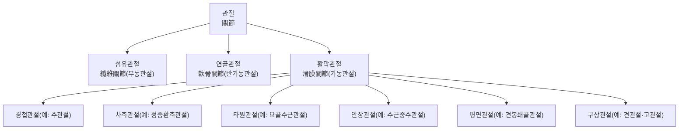
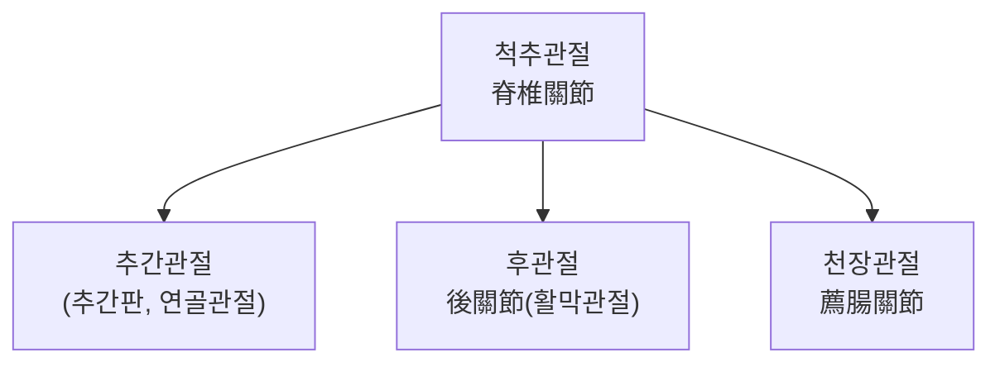
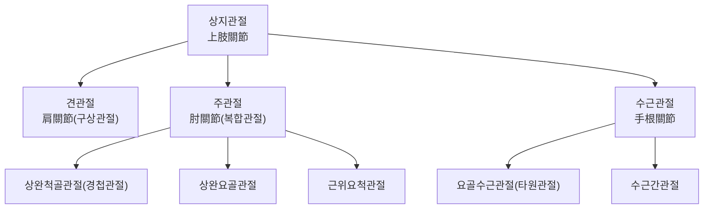
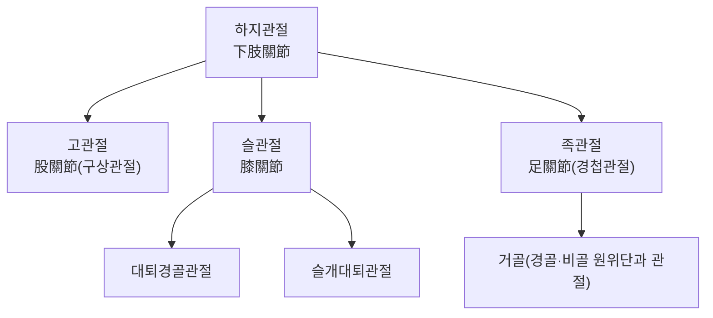
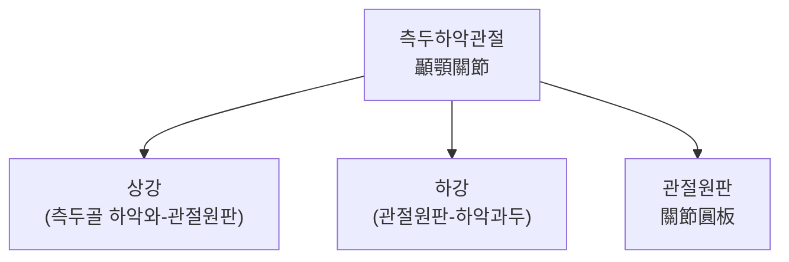

# 관절계(關節系, Articular System)

관절계(關節系, articular system)는 둘 이상의 뼈·연골이 만나는 부위로, 그 결합 형태에 따라 신체의 유연성과 안정성을 동시에 구현하는 계통이다[교과서적 근거]. 관절계 총론에서는 관절을 조직학적 결합 방식에 따라 섬유관절(纖維關節)·연골관절(軟骨關節)·활막관절(滑膜關節)의 3대 유형으로 분류하고, 척추관절·상지관절·하지관절·측두하악관절(TMJ)의 대표적 구조를 개관한 뒤, 한의학의 경근(經筋)·비증(痺證) 이론이 관절 병리를 어떻게 설명하는지, 그리고 관절 질환에 대한 침구·추나 임상 근거와 안전성을 다룬다. 관절을 구성하는 골격 요소는 골격계(骨格系, Skeletal System) 문서에서, 관절을 안정화하는 인대·관절낭 및 관절 운동을 일으키는 골격근·건은 근육계(筋肉系, Muscular System)·인대(靭帶, Ligament)·건(腱, Tendon) 문서에서 각각 다루므로, 이 문서는 "관절"이라는 연결 구조 자체의 분류·기능·임상 적용에 집중한다.

## 제1편 총론

### 1. 관절의 3대 분류

관절은 뼈와 뼈 사이의 결합 조직 종류와 가동성 정도에 따라 세 가지로 분류된다[교과서적 근거].

| 분류 | 결합 조직 | 가동성 | 대표 예 |
|---|---|---|---|
| 섬유관절(纖維關節, fibrous joint) | 치밀결합조직 | 부동관절(不動關節, synarthrosis) 또는 미동관절 | 두개골 봉합(縫合), 하퇴 원위 경비인대결합(원위 경비관절), 치아의 정식(gomphosis) |
| 연골관절(軟骨關節, cartilaginous joint) | 유리연골 또는 섬유연골 | 반가동관절(半可動關節, amphiarthrosis) 위주 | 늑연골결합(1번 늑골-흉골), 치골결합(恥骨結合), 추간판을 사이에 둔 추체간 연결 |
| 활막관절(滑膜關節, synovial joint) | 관절낭(關節囊)·활막(滑膜)·관절연골·활액(滑液) | 가동관절(可動關節, diarthrosis) | 견관절·주관절·슬관절·고관절 등 사지 대부분의 관절 |

> 이 표는 관절의 표준 조직학적 분류를 정리한 것이며, 실제 개별 관절의 가동성은 주변 인대·근육의 긴장도에 따라 개체차가 있을 수 있다.

활막관절은 인체에서 가장 흔한 관절 유형으로, 관절 운동의 축과 형태에 따라 다시 경첩관절(蝶番關節, hinge joint, 예: 주관절)·차축관절(車軸關節, pivot joint, 예: 정중환축관절)·타원관절(楕圓關節, ellipsoid joint, 예: 요골수근관절)·안장관절(鞍狀關節, saddle joint, 예: 수근중수관절 제1지)·평면관절(平面關節, plane joint, 예: 견봉쇄골관절)·구상관절(球狀關節, ball-and-socket joint, 예: 견관절·고관절)로 세분된다[교과서적 근거].

### 2. 활막관절의 구조적 개관

활막관절은 관절연골(關節軟骨, articular cartilage, 유리연골로 마찰을 줄이고 하중을 분산)·관절낭(關節囊, joint capsule, 섬유층과 활막층으로 구성)·활액(滑液, synovial fluid, 윤활과 연골 영양 공급)·관절강(關節腔, joint cavity)의 공통 구조를 가지며, 관절에 따라 관절순(關節脣, labrum)·반월판(半月板, meniscus)·활액낭(滑液囊, bursa) 등의 부속 구조가 추가된다[교과서적 근거]. 이 부속 구조와 관절을 안정화하는 인대·관절낭 인대의 상세는 인대(靭帶, Ligament) 문서에서 다룬다.

### 3. 관절가동범위(ROM)의 개념

관절가동범위(關節可動範圍, range of motion, ROM)는 특정 관절이 정상적으로 움직일 수 있는 각도의 범위로, 능동적 ROM(환자 스스로 움직임)과 수동적 ROM(검사자가 움직임)으로 나뉘며 각도계(goniometer)로 계측하는 것이 표준이다[교과서적 근거]. ROM 감소는 관절 자체의 병변(관절염·강직)뿐 아니라 주변 근육·건·인대의 구축(拘縮)에서도 발생할 수 있어, 관절 가동범위 평가는 관절 내부 병변과 관절 주변 연부조직 병변을 감별하는 임상 지표로 활용된다[교과서적 근거].

### 4. 발생학적 기원 개요

활막관절은 발생 초기 연골 원기(原基, blastema) 내부에 관절중배엽(interzone)이 형성되고, 이 부위의 세포가 사멸·재배열되며 관절강이 형성되는 과정(공동화, cavitation)을 거친다[교과서적 근거]. 이 과정이 불완전하면 선천성 관절 유합(강직)이나 선천성 고관절 이형성증과 같은 발생학적 이상으로 이어질 수 있다[교과서적 근거].

## 제2편 대표 관절 개관

### 1. 척추관절(脊椎關節)

척추관절은 추체 사이의 추간관절(추간판을 사이에 둔 연골관절)과 상하 관절돌기 사이의 후관절(後關節, facet joint, 활막관절)로 구성되며, 이 두 관절의 조합이 척추 분절의 굴곡·신전·측굴·회전 운동을 만든다[교과서적 근거]. 천장관절(薦腸關節, sacroiliac joint)은 천골과 장골 사이의 관절로, 가동 범위가 매우 작지만(수 밀리미터 수준의 미세 운동) 체중을 하지로 전달하는 역학적 요충지이며, 임신·출산기 인대 이완이나 외상으로 천장관절 기능장애가 발생할 수 있다[교과서적 근거].

추간관절은 앞으로 대동맥·하대정맥·식도(흉추부) 또는 후복막장기(요추부)와, 후관절은 뒤로 척주기립근·다열근(多裂筋)과 인접하며, 추간공(椎間孔)을 통해 척수신경 근(根, nerve root)이 척주관을 빠져나가는 통로가 후관절 바로 앞쪽에 위치한다는 점이 임상적으로 중요하다[교과서적 근거]. 척추관절 주변의 혈액 공급은 분절별 척추동맥가지(경추부는 추골동맥, 흉·요추부는 늑간동맥·요동맥의 척추가지)가 담당하며, 후관절 자체는 척수신경 후지의 내측지(內側枝, medial branch)가 지배해 이 신경을 표적으로 한 내측지 차단술·고주파 신경절제술이 만성 요통 치료에 활용된다[교과서적 근거]. 촉지 가능한 표면 지표로는 각 추체의 극돌기(棘突起)와 천골 정중릉(正中稜), 후상장골극(後上腸骨棘, PSIS, 천장관절의 체표 지표)이 있다[교과서적 근거]. 임상 상관 용어로는 후관절증후군(facet joint syndrome)·추간판 탈출증에 의한 신경근병증(神經根病症, radiculopathy)·천장관절 기능장애(SI joint dysfunction) 등이 있다[교과서적 근거].

### 2. 상지관절(上肢關節)

견관절(肩關節, glenohumeral joint)은 견갑골 관절와(關節窩)와 상완골두 사이의 구상관절로, 관절와가 얕아 가동범위가 가장 크지만 그만큼 회전근개·관절순(盂脣, labrum)에 의한 안정화 의존도가 높다[교과서적 근거]. 주관절(肘關節, elbow joint)은 상완척골관절(경첩관절)·상완요골관절·근위요척관절이 하나의 관절낭 안에서 복합적으로 기능하는 복합관절이다[교과서적 근거]. 수근관절(手根關節, wrist joint)은 요골수근관절(타원관절)과 다수의 수근골 사이 관절로 구성되어 정밀한 손동작을 뒷받침한다.

견관절 앞쪽으로는 액와동·정맥 및 완신경총이, 아래쪽으로는 액와(腋窩)가 인접해 있어 탈구 시 이 신경혈관 구조의 손상 여부를 함께 평가해야 하며, 주관절 내측으로는 척골신경이 내측상과 뒤쪽 구(溝, 이른바 "팔꿈치 저림 지점")를 얕게 지나 압박에 취약하다[교과서적 근거]. 상지관절의 혈액 공급은 견관절은 견갑회선동맥(肩胛回旋動脈)·상완회선동맥(上腕回旋動脈)이, 주관절은 주관절동맥망(肘關節動脈網)이, 수근관절은 요골동맥·척골동맥의 수근가지가 담당한다[교과서적 근거]. 신경 지배는 견관절이 액와신경·견갑상신경(肩胛上神經)을, 주관절이 근피신경·요골신경·정중신경·척골신경을, 수근관절이 요골신경·정중신경·척골신경의 관절가지가 각각 분담한다[교과서적 근거]. 촉지 가능한 표면 지표로는 견봉·오구돌기·상완골 대결절(견관절), 외측상과·내측상과·주두(주관절), 요골경상돌기·척골경상돌기(수근관절)가 있다[교과서적 근거]. 임상 상관 용어로는 견관절 전방 탈구(가장 흔한 대관절 탈구 패턴)·외측상과염(테니스 엘보)·내측상과염(골퍼 엘보)·수근관증후군(정중신경 압박) 등이 대표적이다[교과서적 근거].

### 3. 하지관절(下肢關節)

고관절(股關節, hip joint)은 관골구(寬骨臼)와 대퇴골두 사이의 구상관절로, 관절와가 깊어 견관절보다 안정성이 높은 대신 가동범위는 상대적으로 제한된다[교과서적 근거]. 슬관절(膝關節, knee joint)은 대퇴경골관절(경첩관절에 가까우나 회전 요소 포함)과 슬개대퇴관절로 구성된 인체 최대 관절로, 전후방·내외측 십자·측부인대와 내외측 반월판이 함께 안정성을 담당한다(인대 문서 참조)[교과서적 근거]. 족관절(足關節, ankle joint)은 경골·비골 원위단과 거골 사이의 경첩관절로, 외측 인대(전거비인대·종비인대·후거비인대)의 손상(발목 염좌)이 임상에서 가장 흔한 관절 손상 중 하나다[교과서적 근거].

고관절은 앞으로 대퇴신경·대퇴동정맥, 뒤로 좌골신경이 인접하며, 슬관절은 뒤쪽 슬와(膝窩, popliteal fossa)에 슬와동·정맥과 경골·비골신경이 지나 후방 접근 시 손상 위험이 상대적으로 높은 구조다[교과서적 근거]. 족관절은 내측으로 후경골동맥·경골신경이 지나는 족근관(足根管, tarsal tunnel)이, 외측으로 비골건이 인접한다[교과서적 근거]. 혈액 공급은 고관절이 대퇴회선동맥(大腿回旋動脈, 특히 내측대퇴회선동맥이 대퇴골두 혈류의 주공급원)을, 슬관절이 슬와동맥의 관절가지(슬관절동맥망)를, 족관절이 전·후경골동맥의 관절가지를 각각 담당한다[교과서적 근거]. 신경 지배는 고관절이 대퇴신경·폐쇄신경·좌골신경의 관절가지를, 슬관절이 대퇴신경·경골신경·비골신경의 관절가지를, 족관절이 심비골신경·천비골신경·경골신경이 각각 분담한다[교과서적 근거]. 촉지 가능한 표면 지표로는 대전자·서혜인대(鼠蹊靭帶, 고관절), 슬개골·경골조면·대퇴골 내외측상과(슬관절), 내과·외과·거골(족관절)이 있다[교과서적 근거]. 임상 상관 용어로는 대퇴골두 무혈성 괴사(大腿骨頭 無血性壞死, avascular necrosis, 내측대퇴회선동맥 손상과 연관)·전방십자인대 파열·반월판 손상·족관절 외측 인대 손상 등급(Grade I~III) 등이 있다[교과서적 근거].

### 4. 측두하악관절(顳顎關節, Temporomandibular Joint, TMJ)

측두하악관절은 하악과두(下顎顆頭)와 측두골 하악와(下顎窩) 사이의 관절로, 관절 원판(關節圓板, articular disc)이 개재하여 두 개의 관절강(상강·하강)으로 나뉘는 독특한 구조를 갖는 두개골 유일의 가동관절이다[교과서적 근거]. 좌우 TMJ가 하악골을 매개로 연동되어 있어 한쪽의 기능 이상이 반대쪽 저작근·경부 근육의 보상성 긴장으로 이어질 수 있다[교과서적 근거].

TMJ는 앞쪽으로 저작근(咀嚼筋, 교근·측두근·내외측 익돌근), 안쪽으로 이하선(耳下腺)과 안면신경의 분지, 뒤쪽으로 외이도(外耳道)가 인접해 있어 TMJ 통증이 이명·이통(耳痛)으로 오인되는 경우가 임상적으로 드물지 않다[교과서적 근거]. 혈액 공급은 천측두동맥(淺側頭動脈)·상악동맥(上顎動脈)의 관절가지가, 신경 지배는 삼차신경 하악신경(下顎神經)의 이개측두신경(耳介側頭神經, auriculotemporal nerve) 분지가 담당한다[교과서적 근거]. 촉지 가능한 표면 지표는 이주(耳珠, tragus) 바로 앞쪽으로, 입을 벌릴 때 하악과두의 전방 활주(滑走)를 손가락으로 촉지할 수 있다[교과서적 근거]. 임상 상관 용어로는 측두하악관절 장애(TMD, temporomandibular disorder)·관절원판 전위(disc displacement, 개구 시 "clicking" 소리 동반)·저작근 근막통증증후군 등이 있다[교과서적 근거].

## 제3편 한의학적 상관

### 1. 경근(經筋)의 관절 결취(結聚)

12경근(十二經筋)은 사지 말단에서 시작해 각 관절부에서 결취(結聚)한 뒤 몸통으로 향하는 체계로 기술되며, 그 결취 지점은 관절낭·인대 부착부·건 부착부(enthesis)와 해부학적으로 상당 부분 겹친다[교과서적 근거](상세 이론은 근육계 문서에서 다룬다). "諸筋者皆屬於節"(모든 근은 관절에 속한다)이라는 『소문(素問)·오장생성편(五藏生成篇)』의 서술은 관절이 경근 이론의 핵심 결절점으로 다뤄짐을 보여준다[교과서적 근거].

### 2. 비증(痺證)의 분류와 관절 병리

비증(痺證)은 풍(風)·한(寒)·습(濕)의 사기가 경락·관절에 침습하여 통증·부종·운동 제한을 일으키는 병증으로, 사기의 편중에 따라 행비(行痺, 풍 우위, 이동성 통증)·통비(痛痺, 한 우위, 고정성 극심한 통증)·착비(着痺, 습 우위, 중착감·부종)로 나뉘고, 열이 결합하면 열비(熱痺, 관절 발적·발열)로 분류된다[교과서적 근거]. 만성화되어 관절이 변형·강직되는 경우를 완비(頑痺) 또는 역절풍(歷節風)으로 부르며, 이는 현대 의학의 류마티스 관절염과 상당 부분 임상상이 겹친다[교과서적 근거]. 무릎 골관절염을 신허수부족(腎虛髓不足) 변증으로 분류해 전침·온침을 비교한 임상시험[^5]은 비증 변증이 실제 치료법 선택에 반영되는 사례를 보여준다.

### 3. 관절 취혈과 배혈(配穴) 원칙

관절 질환의 침구 치료에서는 국소 취혈(관절 주변 아시혈阿是穴 포함)과 원위 취혈(경락 순행에 따른 원혈·합혈)을 병용하는 것이 전통적 원칙이다[교과서적 근거]. 무릎 골관절염에서 독비(犢鼻)·족삼리(足三里)·양릉천(陽陵泉)·혈해(血海)·내슬안(內膝眼)·양구(梁丘) 등 데이터 마이닝으로 도출된 핵심 혈위를 재활 훈련과 병행한 임상시험은 통증·기능·일상생활 능력의 유의한 개선을 보고하였다[^56]. 발목 염좌에서 양릉천(陽陵泉, GB34)이 근회(筋會)로서 전신 근건 계통을 조절하는 요혈로 취혈되어 완치율을 높였다는 연구[^78]도 경락 이론에 기반한 원위 배혈의 임상적 근거로 참고할 수 있다.

## 제4편 임상 적용과 안전성

### 1. 슬관절 골관절염(膝關節 骨關節炎)에 대한 침구 근거

슬관절 골관절염은 침구 임상에서 가장 많은 근거가 축적된 관절 질환으로, 침·뜸 치료가 통증 완화·관절 기능 개선·염증 감소에 유의미한 효과가 있다는 문헌 고찰이 있다[^1]. 편측 침 치료와 양측 침 치료 모두 무릎 기능 개선에 유의미한 효과를 보이며 두 방법 간 통계적 차이가 없었다는 조기 무작위 대조 시험[^2]부터, 신양허(腎陽虛)·한증(寒證)을 동반한 퇴행성 무릎 관절염에 온침구법이 단순 침보다 효과적이라는 연구[^5], 동적 자극 침법(hysteretic acupuncture)이 관절액 내 염증성 사이토카인(IL-6, TNF-α)을 셀레콕시브보다 더 효과적으로 낮췄다는 연구[^9], 히알루론산 관절강내 주사와 온침 병행이 주사 단독보다 기능·삶의 질 개선에 효과적이라는 연구[^13]까지 다양한 침구 기법이 검증되어 왔다. 전침이 관절 연골의 T2 매핑 MRI 지표 개선에 물리치료보다 우수했다는 연구[^18]는 침구의 효과가 단순 증상 완화를 넘어 관절 구조적 지표와도 연관될 가능성을 시사한다. 네트워크 메타분석은 다양한 침 치료법 중 화침(火鍼)이 통증·강직·기능 개선에서 가장 우수한 효과를 보였고 온침·전침도 일반 침이나 양약보다 효과적이었다고 종합하였다[^25]. 무릎 골관절염 진단·관리에 관한 중의학 전문가 합의문은 비약물요법·외용약·관절강내 주사·경구 한약(변증 기반)·서양의학적 약물 및 수술을 통합한 관리 전략을 제시하고 있다[^30]. 어혈조체(瘀血阻滯)형 무릎 골관절염에서 골막까지 자입하는 단자법(短刺法)이 근육층 자입보다 통증·기능·염증 지표(TNF-α, IL-1β, IL-6, PGE2) 개선에 더 효과적이었다는 연구[^32], 전침 치료가 진통제보다 관절 강직 개선과 전반적 반응률에서 우수하다는 최신 메타분석[^34][^47]도 있다. 코크란 체계적 고찰은 지상 운동 요법에 침 등 보조 요법을 병행했을 때 단기적으로 일부 개선이 있었으나 임상적으로 유의미한 차이는 크지 않았다고 신중한 결론을 제시하였다[^45]. 만성 무릎 통증에 침술을 적용하는 무작위 대조 시험 프로토콜[^38], 침 치료 효과에 대한 최신 근거 수준을 종합한 엄브렐러 리뷰[^54], 데이터 마이닝으로 도출한 핵심 혈위 침 치료와 재활 훈련 병행 연구[^56]도 최근 근거를 보강한다.

> 이 표는 임상 틀이지 동일 근거수준의 권고가 아니다. 무릎 골관절염에 대한 침구 근거는 풍부하지만, 코크란 고찰[^45]이 지적하듯 효과 크기는 연구에 따라 편차가 크다. 변증(한증·습증·어혈·신허 등)에 따른 개별화된 취혈과 서양의학적 영상·기능 평가를 병행하는 것이 근거 수준에 맞는 접근이다.

### 2. 고관절 골관절염(股關節 骨關節炎)에 대한 침구 근거 — 상반된 결과의 종합

고관절 골관절염은 슬관절과 달리 침구 근거가 일관되지 않아 균형 잡힌 해석이 필요한 관절이다. 침 치료가 조언·운동 요법보다 통증·기능 개선에 효과적이었다는 조기 무작위 대조 시험[^59]이 있는 반면, 코크란 체계적 고찰은 침 치료가 가짜 침과 비교했을 때 고관절 골관절염의 통증·기능 개선에 유의미한 효과가 부족하다고 결론지었다[^65]. 전통적 혈위 선정 여부와 관계없이 L2-L5 피부분절 영역에 자입하는 것만으로도 비특이적 효과가 나타났다는 연구[^66]는 고관절 골관절염에서 관찰되는 개선이 경혈 특이성보다 자침 자체의 비특이적 효과(신경생리학적 반응)에 기인할 가능성을 시사한다. 레이저 침이 무릎 골관절염의 단기 통증 완화에 효과적일 수 있다는 메타분석[^58], 전침이 디클로페낙 경구 투여보다 고관절 골관절염의 통증·기능 개선에 우수했다는 연구[^64], 트리거포인트 드라이니들링이 고관절 골관절염·대전자 통증 증후군·이상근증후군의 통증·ROM·근력 개선에 안전하고 효과적일 수 있다는 체계적 고찰[^67]도 있다. 근막통증이 동반된 고관절 골관절염에 침·부항·TPI를 병행한 증례[^70], 고관절 병변 측 이혈(耳穴)에서 전기 피부 저항이 유의하게 낮게 측정된다는 관찰[^68]도 보고된다.

> 이 서술은 고관절 골관절염에서 침구의 특이적 효과에 대한 근거가 슬관절보다 약하다는 점을 정직하게 반영한 것이다. 코크란 고찰[^65]의 부정적 결론에도 불구하고 통증 관리 목적의 보조 요법으로서 침구를 배제할 근거는 아니며, 관절 치환술 적응증 등 정형외과적 평가를 우선하면서 증상 완화 보조 수단으로 활용하는 것이 근거에 부합한다.

### 3. 발목 염좌(足關節 捻挫)에 대한 침구 근거

급성 발목 염좌는 침 치료의 근거가 비교적 풍부하게 축적된 관절 손상이다. 침 치료를 단독 또는 RICE 요법·마사지·중약과 병용했을 때 통증 완화·완치율 향상에 유의미한 효과가 있었다는 메타분석[^72], 초기 체계적 고찰·메타분석[^74]이 있다. 양릉천(陽陵泉, GB34) 자침이 전자기 치료 단독보다 완치율·총 유효율을 유의하게 높였다는 연구[^78], 소절혈(小節穴) 자침과 건조절수법(腱調節手法)을 병용하는 것이 단독 치료보다 통증·부종 감소에 효과적이었다는 연구[^79], 급성기(3일 이내) 위자법(圍刺法)과 냉찜질 병용이 냉찜질 단독보다 통증·부종·기능 회복에 효과적이었다는 연구[^82]도 있다. 다만 코크란 체계적 고찰은 포함된 연구들의 높은 편향 위험과 이질성으로 인해 급성 발목 염좌에 대한 침 치료 근거의 신뢰도가 아직 부족하다고 지적하였다[^89]. 어혈(瘀血)을 제거하는 당귀수산(當歸鬚散)과 침 치료 병행이 위약 병행 침 치료보다 장기적 통증 개선에 긍정적이었다는 무작위 대조 시험[^88], 침 치료에 키네시오 테이핑을 추가해도 유의한 추가 이점이 없었다는 연구[^90]는 병용 요법의 실제 효과 크기에 대한 신중한 해석이 필요함을 보여준다. 국내 건강보험 자료 분석에 따르면 발목 염좌 환자의 절반 이상이 한의원·한방병원을 우선 이용하며, 침 치료가 가장 빈번히 시행되는 한방 처치임이 확인되었다[^85].

> 이 표는 임상 틀이지 동일 근거수준의 권고가 아니다. 발목 염좌 침구 근거는 메타분석 수준에서는 긍정적이나[^72][^74], 코크란 고찰[^89]은 근거 질의 한계를 지적하므로 급성기 손상 등급(Grade I~III)에 따른 감별과 골절 배제(Ottawa Ankle Rule 등 영상 적응증 확인)가 선행되어야 한다.

### 4. 류마티스 관절염(類風濕性 關節炎)에 대한 침구 근거

류마티스 관절염에 대한 침 치료의 특이적 진통 효과는 학계에서 논쟁적이다. 체계적 고찰은 가짜 침과 비교했을 때 침 치료가 통증 조절에 유의미한 특이적 효과를 입증하지 못했다고 결론지었으나[^94], 이후 축적된 개별 연구들은 다른 각도의 근거를 제시한다. 노인 류마티스 관절염 환자에게 독맥(督脈) 격리식 뜸과 만성질환 관리를 병행한 것이 표준 약물 치료만 시행한 경우보다 관절 부종·압통·조조강직 개선에 효과적이었다는 임상시험[^93], 전침 치료가 단순 침보다 관절액 내 염증성 사이토카인(IL-1)을 낮추고 항염증성 사이토카인(IL-4, IL-10)을 높였다는 연구[^98], 전침이 혈액·관절 활액 내 TNF-α·VEGF를 유의하게 감소시켰다는 연구[^99]는 침구의 항염증 기전에 대한 인간 대상 근거를 제시한다. 손 관절 류마티스 관절염에 기능적 진단에 기반한 취혈로 침 치료를 시행한 이중맹검 무작위 대조 시험은 통증·관절 부종·신체 기능·삶의 질의 유의한 개선을 보고하였고[^100], 이를 포함한 정량적 근거의 체계적 고찰도 유사한 긍정적 결론을 제시한다[^101]. 간신음허형(肝腎陰虛型) 류마티스 관절염에서 표준 양약과 전침 병행이 양약 단독보다 통증·관절 부종·HAQ 점수 개선에 효과적이었다는 연구[^105], 6주간의 맞춤형 침 치료가 질병 활성도(DAS28)·부종 관절 수·ESR·삶의 질을 유의하게 개선했다는 파일럿 연구[^106], 전침이 일반 침·표준 약물보다 통증 완화에 효과적이라는 네트워크 메타분석[^107]도 있다.

> 이 서술은 침구가 류마티스 관절염의 근본적 질병 조절(항류마티스제 대체)을 대신할 수 있다는 근거가 아니라, 표준 약물 치료(DMARDs 등)를 유지하면서 병용하는 보조 요법으로서 통증·염증 지표 개선에 근거가 있음을 보여주는 것이다. 활동성 염증이 있는 관절에 대한 관행적 자침보다, 항류마티스제 치료 반응을 정기적으로 평가하며 병용하는 것이 변증 층화의 원칙에 부합한다.

### 5. 유착성 관절낭염(오십견)·측두하악관절 장애·천장관절 기능장애

견관절 유착성 관절낭염(오십견, adhesive capsulitis)에는 침·추나·국소 한약 등 한방 외치법이 통증 완화·ROM 개선에 효과적이며, 여러 외치법을 병행하는 복합 치료가 단일 요법보다 우수하다는 문헌 고찰이 있다[^111]. 매선침(thread-embedding acupuncture)의 유효성·안전성·비용효과성을 검증하는 다기관 무작위 대조 시험 프로토콜[^112], 약침 요법을 물리치료와 비교하는 실용적 임상시험 프로토콜[^113]도 등록되어 있다. 측두하악관절 장애(TMD)와 관련해서는 안면경련과 TMJ 통증이 동반된 환자에게 전침을 시행해 증상이 개선된 증례[^109], 만성 TMD에 매선침의 효능·안전성·비용효과성을 검증하는 무작위 대조 시험 프로토콜[^110]이 있다. 천장관절 손상에는 해부학적 지점에 대한 사침(斜鍼)과 추나를 병행하는 것이 추나 단독보다 통증·기능 개선에 효과적이었다는 연구[^114], 기존 주사·약물 치료에 반응하지 않는 급성 천장관절 통증에 도침(鍼刀, acupotomy) 치료가 즉각적인 통증 완화와 보행 개선을 보였다는 증례[^115]가 있다.

### 6. 관절 시술의 안전성

| 위험 요소 | 내용 | 참고 |
|---|---|---|
| 활막관절 관절강 내 직접 자입 | 감염(화농성 관절염) 위험, 특히 면역저하 환자 | 무균 술기 준수, 관절강 직접 자입은 신중히 적응증 판단[교과서적 근거] |
| TMJ 부위 심부 자침 | 이하선·안면신경 분지 인접, 과도한 심부 자침 시 손상 위험 | 해부학적 깊이 숙지, 저강도 자침 우선[교과서적 근거] |
| 류마티스 관절염 활동성 염증 관절 자침 | 활막 염증이 심한 관절의 자입은 이론적으로 감염·손상 위험 상대적 상승 | 질병 활성도(DAS28) 평가 후 시행, 항류마티스제 병용 유지[^93][^105] |
| 발목 염좌 급성기 무리한 ROM 검사·수기 | 인대 손상 등급 미확인 시 추가 손상 위험 | 손상 등급(Grade I~III) 및 골절 배제 후 수기 강도 결정[^82][^89] |
| 고관절·슬관절 치환술 후 자침 | 인공관절 주변 감염(인공관절 주위 감염) 위험 이론적 존재 | 수술 부위 직접 자침 지양, 집도의와 협의[교과서적 근거] |

> 이 표는 임상 틀이지 동일 근거수준의 권고가 아니다. 개별 환자의 관절 상태·면역 상태·수술력에 따라 위험도가 달라지므로 시술 전 개별 평가가 필요하다.

### 7. 추적 지표표

| 영역 | 추적 지표 |
|---|---|
| 관절 가동범위 | 각도계(goniometer) 계측 ROM |
| 무릎 골관절염 | WOMAC, Lysholm score, VAS, 관절 연골 T2 매핑 MRI[^18] |
| 고관절 골관절염 | Harris Hip Score, VAS |
| 발목 염좌 | Ottawa Ankle Rule(골절 배제), 부종 둘레, 기능적 활동 지수 |
| 류마티스 관절염 | 질병활성도(DAS28), ESR, CRP, RF, 부종·압통 관절 수[^93][^99][^106] |
| 오십견 | ROM(굴곡·외전·외회전), SPADI(Shoulder Pain and Disability Index) |

> 이 지표들은 관절 병리의 변화를 비침습적으로 추적하는 참고 지표이지, 변증 없이 관행적으로 적용해도 되는 정형화된 검사 프로토콜은 아니다.

### 8. 환자 설명용 요약

> 관절은 뼈와 뼈를 이어주는 부위로, 자동차의 경첩이나 베어링처럼 부드럽게 움직이면서도 안정적으로 힘을 견뎌야 하는 구조입니다. 나이가 들거나 과도한 사용, 외상이 누적되면 관절 연골이 닳거나 주변 조직에 염증이 생겨 통증·강직이 나타날 수 있습니다. 한의학에서는 이를 비증(痺證, 저리고 아픈 증후)이라 부르며, 원인이 되는 사기(풍·한·습·열)와 몸 상태(허실)에 따라 다른 치료 전략을 세웁니다. 침구·추나 치료는 통증 완화와 기능 개선에 도움이 될 수 있지만, 관절 자체의 구조적 손상(연골 마모·인대 파열 등)은 영상 검사로 확인하고 필요하면 정형외과적 치료(주사·수술)와 병행하는 것이 안전합니다.

## 제5편 Q&A

**Q1. 관절계와 골격계는 어떻게 다른가?**

골격계가 "뼈"라는 개별 구성 요소를 다룬다면, 관절계는 그 뼈들이 "어떻게 연결되어 움직이는가"에 집중한다. 관절은 섬유관절·연골관절·활막관절로 분류되며, 활막관절이 임상적으로 가장 빈번히 문제되는 가동관절이다[교과서적 근거].

**Q2. 무릎 골관절염에 침구 치료가 효과가 있다는 근거는 확실한가?**

비교적 확실한 편이다. 다수의 임상시험·메타분석이 통증·기능 개선을 일관되게 보고하며[^1][^25][^34][^47], 화침·온침·전침 등 세부 기법 간 비교 근거도 축적되어 있다[^25]. 다만 코크란 고찰은 효과 크기가 임상적으로 크지 않을 수 있다고 신중한 입장을 취한다[^45].

**Q3. 고관절 골관절염도 무릎과 마찬가지로 침구 효과가 확실한가?**

아니다. 고관절은 침구의 특이적 효과에 대한 근거가 무릎보다 약하며, 코크란 고찰은 가짜 침 대비 유의미한 효과를 확인하지 못했다[^65]. 비특이적 자침 효과 자체가 개선에 기여했을 가능성도 제기된다[^66]. 통증 관리의 보조 수단으로 접근하되 정형외과적 평가를 우선해야 한다.

**Q4. 발목 염좌에 침 치료를 받으면 병원 진료(X-ray 등)를 받지 않아도 되는가?**

아니다. 침 치료가 발목 염좌의 통증·기능 개선에 도움이 될 수 있다는 근거가 있으나[^72][^74][^78], 인대 손상 등급이나 골절 동반 여부를 확인하지 않고 치료를 시작하는 것은 권장되지 않는다. Ottawa Ankle Rule 등을 참고한 영상 검사로 골절을 배제하는 것이 우선이다.

**Q5. 류마티스 관절염 환자가 침 치료를 받으면 항류마티스제(DMARDs)를 끊어도 되는가?**

절대 아니다. 침구는 통증·염증 지표 개선에 보조적 근거가 있으나[^98][^99][^100], 질병 자체의 진행(관절 파괴)을 막는 항류마티스제 치료를 대체한다는 근거는 없다. 침구는 표준 약물 치료와 병행하는 보조 요법으로 위치해야 한다.

**Q6. 오십견(유착성 관절낭염)은 자연히 낫는 병인데 침구가 꼭 필요한가?**

오십견은 자연 경과상 회복되는 경향이 있으나, 회복까지 수개월에서 수년이 걸릴 수 있고 그 사이 통증·기능 제한이 삶의 질을 크게 떨어뜨린다. 침·추나 등 복합 외치법이 통증 완화와 ROM 회복을 앞당길 수 있다는 근거가 있어[^111], 자연 경과를 기다리기보다 적극적으로 병행하는 것이 임상적으로 유리하다.

**Q7. 측두하악관절(TMJ) 장애에도 침 치료가 도움이 되는가?**

증례·프로토콜 수준의 근거가 있다[^109][^110]. 다만 TMJ 부위는 이하선·안면신경이 인접해 있어 심부 자침 시 해부학적 지식이 중요하며, 저작근 긴장 완화를 위한 저강도 자침이 우선 고려된다.

**Q8. 경근(經筋) 이론에 기반한 관절 취혈은 근거가 있는가?**

일부 있다. 데이터 마이닝으로 도출된 핵심 혈위를 재활 훈련과 병행한 연구[^56], 양릉천(근회)을 활용한 발목 염좌 치료 연구[^78]처럼 전통적 경락·경근 이론에 기반한 취혈이 실제 임상 지표 개선과 연관된 사례가 축적되고 있다. 다만 이는 경근 이론의 명제 자체를 검증한 것이 아니라, 경근 이론이 가리키는 임상 영역에서 인간 대상 근거가 쌓이고 있다는 방식으로 해석하는 것이 근거 수준에 맞다.

**고전 인용 출처**: 『黃帝內經素問』(五藏生成篇, 痺論, 骨空論), 『靈樞』(經筋, 周痺), 『難經』, 『金匱要略』(中風歷節病脈證并治), 『諸病源候論』.

**문헌 데이터 출처**: [한의학 논문 데이터베이스 (med.symbolicinfo.com)](https://med.symbolicinfo.com) — 2026-08-25 조회 기준.

[^1]: Research Progress on Acupuncture Treatment of Knee Osteoarthritis. Zhang Yueyu 외. _Asian Journal of Complementary and Alternative Medicine_. 2021-11-24. [문헌 고찰] [DOI 10.53043/2347-3894.acam90019](https://doi.org/10.53043/2347-3894.acam90019) — 침·뜸 치료가 무릎 골관절염 환자의 통증·기능·염증·조직 회복에 유의미한 효과가 있음을 종합.
[^2]: Unilateral versus Bilateral Acupuncture on Knee Function in Advanced Osteoarthritis of the Knee – a Prospective Randomised Trial. Abhay Tillu 외. _Acupuncture in Medicine_. 2001-06. [임상시험, 44명] [DOI 10.1136/aim.19.1.15](https://doi.org/10.1136/aim.19.1.15) — 편측·양측 침 치료 모두 무릎 기능·통증 개선에 유의하며 두 방법 간 차이는 없음.
[^5]: [Observation on therapeutic effect of warming needle moxibustion on knee osteoarthritis of deficiency-cold type].. Li CD 외. _Zhongguo zhen jiu = Chinese acupuncture & moxibustion_. 2006-03. [임상시험, 120명] [PMID 16570440](https://pubmed.ncbi.nlm.nih.gov/16570440/) — 신양허·한증 동반 무릎 관절염에 온침구법이 단순 침보다 통증·기능 개선에 효과적.
[^9]: [Effect of hysteretic acupuncture on joint function and related cytokines in articular fluid in patients with knee osteoarthritis].. Wang GX 외. _Zhen ci yan jiu = Acupuncture research_. 2020-07-25. [임상시험, 72명] [DOI 10.13702/j.1000-0607.200054](https://doi.org/10.13702/j.1000-0607.200054) [PMID 32705831](https://pubmed.ncbi.nlm.nih.gov/32705831/) — 동적 자극 침법이 관절액 내 염증성 사이토카인(IL-6, TNF-α)을 셀레콕시브보다 효과적으로 낮춤.
[^13]: [Randomized controlled clinical trails for treatment of knee osteoarthritis by warm acupuncture combined with intra-articular injection of sodium hyaluronate].. Zhang YS 외. _Zhen ci yan jiu = Acupuncture research_. 2011-10. [임상시험, 179명] [PMID 22073891](https://pubmed.ncbi.nlm.nih.gov/22073891/) — 히알루론산 관절강내 주사와 온침 병행이 주사 단독보다 기능·삶의 질 개선에 효과적.
[^18]: [Efficacy observation on knee osteoarthritis treated with electroacupuncture and its influence on articular cartilage with T2 mapping].. Bao F 외. _Zhongguo zhen jiu = Chinese acupuncture & moxibustion_. 2013-03. [임상시험, 30명] [PMID 23713295](https://pubmed.ncbi.nlm.nih.gov/23713295/) — 전침이 관절 연골 T2 매핑 MRI 지표 개선에 물리치료보다 우수.
[^25]: Efficacy of Acupuncture-Related Therapy in the Treatment of Knee Osteoarthritis: A Network Meta-Analysis of Randomized Controlled Trials.. Liu W 외. _Journal of pain research_. 2021. [메타분석, 3215명] [DOI 10.2147/JPR.S315956](https://doi.org/10.2147/JPR.S315956) [PMID 34321920](https://pubmed.ncbi.nlm.nih.gov/34321920/) — 화침이 통증·강직·기능 개선에서 가장 우수, 온침·전침도 일반 침·양약보다 효과적.
[^30]: Diagnosis and management of knee osteoarthritis: Chinese medicine expert consensus (2015).. Chen WH 외. _Chinese journal of integrative medicine_. 2016-02. [임상진료지침] [DOI 10.1007/s11655-015-2432-7](https://doi.org/10.1007/s11655-015-2432-7) [PMID 26688182](https://pubmed.ncbi.nlm.nih.gov/26688182/) — 비약물요법·외용약·관절강내 주사·경구 한약·서양의학적 치료를 통합한 관리 전략 제시.
[^32]: [Short needling for knee osteoarthritis with blood stasis obstruction and its effect on serum inflammatory factors].. Qiu ML 외. _Zhongguo zhen jiu = Chinese acupuncture & moxibustion_. 2022-07-12. [임상시험, 68명] [DOI 10.13703/j.0255-2930.20210901-k0008](https://doi.org/10.13703/j.0255-2930.20210901-k0008) [PMID 35793881](https://pubmed.ncbi.nlm.nih.gov/35793881/) — 어혈조체형 무릎 골관절염에서 골막 단자법이 근육층 자입보다 통증·기능·염증 지표 개선에 우수.
[^34]: The Efficacy of Electroacupuncture in the Treatment of Knee Osteoarthritis: A Systematic Review and Meta-Analysis.. Li P 외. _Advanced biology_. 2023-10. [메타분석, 1616명] [DOI 10.1002/adbi.202200304](https://doi.org/10.1002/adbi.202200304) [PMID 36808899](https://pubmed.ncbi.nlm.nih.gov/36808899/) — 전침 치료가 임상 증상·삶의 질 개선에 효과적, 강직 개선·유효율에서 진통제보다 우수.
[^38]: Efficacy of acupuncture for chronic knee pain: protocol for a randomised controlled trial using a Zelen design.. Hinman RS 외. _BMC complementary and alternative medicine_. 2012-09-19. [임상시험, 282명] [DOI 10.1186/1472-6882-12-161](https://doi.org/10.1186/1472-6882-12-161) [PMID 22992309](https://pubmed.ncbi.nlm.nih.gov/22992309/) — 만성 무릎 통증에 침술·레이저 침술의 효능·비용효과성을 평가하는 프로토콜.
[^45]: Adjunctive therapies in addition to land-based exercise therapy for osteoarthritis of the hip or knee.. French HP 외. _The Cochrane database of systematic reviews_. 2022-10-17. [체계적 고찰, 6508명] [DOI 10.1002/14651858.CD011915.pub2](https://doi.org/10.1002/14651858.CD011915.pub2) [PMID 36250418](https://pubmed.ncbi.nlm.nih.gov/36250418/) — 침 등 보조 요법 병행 시 단기 개선 경향은 있으나 임상적으로 유의미한 차이는 크지 않음.
[^47]: Advances in Electroacupuncture for Treatment of Knee Osteoarthritis: Mechanisms, Efficacy, and Future Directions.. Wu X 외. _Journal of pain research_. 2025. [문헌 고찰] [DOI 10.2147/JPR.S543346](https://doi.org/10.2147/JPR.S543346) [PMID 41050143](https://pubmed.ncbi.nlm.nih.gov/41050143/) — 전침이 NF-κB·MAPK 염증 경로 억제와 신경 조절을 통해 통증·기능 개선에 작용.
[^54]: Clinical Effects of Acupuncture in the Treatment of Knee Osteoarthritis: An Umbrella Review of Level I Evidence.. Yang Y 외. _Journal of evidence-based medicine_. 2026-06. [체계적 고찰] [DOI 10.1111/jebm.70143](https://doi.org/10.1111/jebm.70143) [PMID 42347738](https://pubmed.ncbi.nlm.nih.gov/42347738/) — 침 치료가 통증·기능 개선에 효과적, 전침은 관절 강직 개선·반응률에서 약물보다 우수.
[^56]: Investigating the efficacy of acupoint acupuncture combined with rehabilitation training in knee osteoarthritis treatment: A prospective comparative study informed by systematic acupoint analysis.. Li Y 외. _Joint diseases and related surgery_. 2026-07-13. [임상시험, 84명] [DOI 10.52312/jdrs.2026.2205](https://doi.org/10.52312/jdrs.2026.2205) [PMID 42542906](https://pubmed.ncbi.nlm.nih.gov/42542906/) — 데이터 마이닝 핵심 혈위(독비·족삼리·양릉천·혈해·내슬안·양구) 침 치료와 재활 훈련 병행이 통증·기능·일상생활 능력 향상.
[^58]: Laser Acupuncture for Patients with Knee Osteoarthritis: A Systematic Review and Meta-Analysis of Randomized Placebo-Controlled Trials. Zhonggai Chen 외. _Evidence-Based Complementary and Alternative Medicine_. 2019-11-03. [메타분석, 395명] [DOI 10.1155/2019/6703828](https://doi.org/10.1155/2019/6703828) — 레이저 침이 적절한 조건에서 단기 통증 완화에 효과적일 수 있음.
[^59]: A Comparison of Acupuncture with Advice and Exercises on the Symptomatic Treatment of Osteoarthritis of the Hip – a Randomised Controlled Trial. Roisin Haslam. _Acupuncture in Medicine_. 2001-06. [임상시험, 32명] [DOI 10.1136/aim.19.1.19](https://doi.org/10.1136/aim.19.1.19) — 침 치료가 조언·운동 요법보다 고관절 골관절염의 통증·기능 개선에 효과적.
[^64]: [Comparative observation on hip osteoarthritis treated with electroacupuncture and medication].. Sheng XP 외. _Zhongguo zhen jiu = Chinese acupuncture & moxibustion_. 2010-12. [임상시험, 60명] [PMID 21290833](https://pubmed.ncbi.nlm.nih.gov/21290833/) — 전침이 디클로페낙 경구 투여보다 고관절 골관절염의 통증·기능 개선에 우수.
[^65]: Acupuncture for hip osteoarthritis.. Manheimer E 외. _The Cochrane database of systematic reviews_. 2018-05-05. [체계적 고찰, 413명] [DOI 10.1002/14651858.CD013010](https://doi.org/10.1002/14651858.CD013010) [PMID 29729027](https://pubmed.ncbi.nlm.nih.gov/29729027/) — 침 치료가 가짜 침과 비교해 고관절 골관절염 통증·기능 개선에 유의미한 특이적 효과가 부족.
[^66]: Non-specific effects of traditional Chinese acupuncture in osteoarthritis of the hip.. Fink MG 외. _Complementary therapies in medicine_. 2001-06. [임상시험, 67명] [DOI 10.1054/ctim.2001.0442](https://doi.org/10.1054/ctim.2001.0442) [PMID 11444887](https://pubmed.ncbi.nlm.nih.gov/11444887/) — 전통 혈위 선정 여부와 무관하게 L2-L5 피부분절 자입만으로도 개선 효과 관찰.
[^67]: Efficacy of trigger point dry needling on pain and function of the hip joint: a systematic review of randomized clinical trials.. Forogh B 외. _Acupuncture in medicine_. 2024-04. [체계적 고찰, 273명] [DOI 10.1177/09645284231207870](https://doi.org/10.1177/09645284231207870) [PMID 38149616](https://pubmed.ncbi.nlm.nih.gov/38149616/) — 드라이니들링이 고관절 골관절염·대전자 통증 증후군·이상근증후군의 통증·ROM·근력 개선에 안전하고 효과적.
[^68]: Auricular Acupoints with Reduced Skin Resistance: Detection in Patients Scheduled for Hip Arthroplasty.. Usichenko TI 외. _Medical acupuncture_. 2018-12-01. [관찰연구, 114명] [DOI 10.1089/acu.2018.1314](https://doi.org/10.1089/acu.2018.1314) [PMID 30671150](https://pubmed.ncbi.nlm.nih.gov/30671150/) — 고관절 병변 측 이혈에서 전기 피부 저항이 유의하게 낮게 측정됨.
[^70]: A Non-Pharmacological Approach to Hip Osteoarthritis-Related Pain: A Case Report.. Chantasirivisal A 외. _Cureus_. 2026-05. [증례 보고, 1명] [DOI 10.7759/cureus.109641](https://doi.org/10.7759/cureus.109641) [PMID 42367430](https://pubmed.ncbi.nlm.nih.gov/42367430/) — 근막통증 동반 고관절 골관절염에 침·부항·TPI 병행이 통증·ROM 개선에 효과적일 수 있음.
[^72]: Efficacy and Safety of Acupuncture Therapy for Patients with Acute Ankle Sprain: A Systematic Review and Meta‐Analysis of Randomized Controlled Trials. Ai-Feng Liu 외. _Evidence-Based Complementary and Alternative Medicine_. 2020-01. [메타분석] [DOI 10.1155/2020/9109531](https://doi.org/10.1155/2020/9109531) — 침 치료 단독 또는 RICE·마사지·중약 병용이 통증 완화·완치율 향상에 유의미한 효과.
[^74]: Acupuncture for ankle sprain: systematic review and meta-analysis. Jimin Park 외. _BMC Complementary and Alternative Medicine_. 2013-03-04. [메타분석, 1820명] [DOI 10.1186/1472-6882-13-55](https://doi.org/10.1186/1472-6882-13-55) — 침 치료가 발목 염좌의 증상 개선·통증 완화·일상 복귀에 긍정적 영향을 미칠 수 있음.
[^78]: [Observation on therapeutic effect of acupuncture at Yanglingquan (GB 34) on sprain of external ankle joint].. He XF 외. _Zhongguo zhen jiu = Chinese acupuncture & moxibustion_. 2006-08. [임상시험, 79명] [PMID 16941977](https://pubmed.ncbi.nlm.nih.gov/16941977/) — 양릉천 자침 병행이 전자기 치료 단독보다 완치율·총 유효율 상승.
[^79]: [Impacts on analgesia and detumescence in ankle sprain treated with acupuncture at Xiaojie point combined with tendon-regulation manipulation].. Du WB 외. _Zhongguo zhen jiu = Chinese acupuncture & moxibustion_. 2014-07. [임상시험, 60명] [PMID 25233649](https://pubmed.ncbi.nlm.nih.gov/25233649/) — 소절혈 자침과 건조절수법 병용이 단독 치료보다 통증·부종 감소에 효과적.
[^82]: [Observation of the therapeutic effect on acute ankle sprain treated with surrounding needling and cold compression].. Zhang ZX 외. _Zhen ci yan jiu = Acupuncture research_. 2023-07-25. [임상시험, 68명] [DOI 10.13702/j.1000-0607.20220250](https://doi.org/10.13702/j.1000-0607.20220250) [PMID 37518964](https://pubmed.ncbi.nlm.nih.gov/37518964/) — 급성기 위자법과 냉찜질 병용이 냉찜질 단독보다 통증·부종·기능 회복에 효과적.
[^85]: Analysis of medical services provided to patients with ankle sprains in Korea between 2015 and 2017: a cross-sectional study of the health insurance review and assessment service national patient sample database.. Ryu HS 외. _BMJ open_. 2020-09-24. [관찰연구, 151415명] [DOI 10.1136/bmjopen-2020-039297](https://doi.org/10.1136/bmjopen-2020-039297) [PMID 32973065](https://pubmed.ncbi.nlm.nih.gov/32973065/) — 발목 염좌 환자의 56%가 한방 의료기관을 우선 이용, 침 치료가 가장 빈번.
[^88]: Effects of Dangguixu-san in patients with acute lateral ankle sprain: a randomized controlled trial.. Kim JH 외. _Trials_. 2021-03-04. [임상시험, 48명] [DOI 10.1186/s13063-021-05135-6](https://doi.org/10.1186/s13063-021-05135-6) [PMID 33663582](https://pubmed.ncbi.nlm.nih.gov/33663582/) — 당귀수산과 침 병행이 위약 병행 침 단독보다 장기적 통증 개선에 긍정적.
[^89]: Acupuncture for treating acute ankle sprains in adults.. Kim TH 외. _The Cochrane database of systematic reviews_. 2014-06-23. [체계적 고찰, 2012명] [DOI 10.1002/14651858.CD009065.pub2](https://doi.org/10.1002/14651858.CD009065.pub2) [PMID 24953665](https://pubmed.ncbi.nlm.nih.gov/24953665/) — 포함 연구의 높은 편향 위험·이질성으로 신뢰할 만한 근거가 부족.
[^90]: Add-on effect of kinesiotape in patients with acute lateral ankle sprain: a randomized controlled trial.. Shin JC 외. _Trials_. 2020-02-12. [임상시험, 60명] [DOI 10.1186/s13063-020-4111-z](https://doi.org/10.1186/s13063-020-4111-z) [PMID 32051009](https://pubmed.ncbi.nlm.nih.gov/32051009/) — 침 치료에 키네시오 테이핑 추가가 유의한 추가 이점을 보이지 않음.
[^93]: Effect of Barrier-Separated Moxibustion on the Governing Vessel and Chronic Disease Management in Elderly Rheumatoid Arthritis Patients. Hua Ren 외. _Acupuncture & Electro-Therapeutics Research_. 2025-09-24. [임상시험, 92명] [DOI 10.1177/03601293251378889](https://doi.org/10.1177/03601293251378889) — 독맥 격리식 뜸과 만성질환 관리 병행이 표준 약물 단독보다 관절 부종·압통·조조강직 개선에 효과적.
[^94]: Acupuncture for rheumatoid arthritis: a systematic review.. Lee MS 외. _Rheumatology (Oxford, England)_. 2008-12. [체계적 고찰] [DOI 10.1093/rheumatology/ken330](https://doi.org/10.1093/rheumatology/ken330) [PMID 18710899](https://pubmed.ncbi.nlm.nih.gov/18710899/) — 가짜 침 대비 통증 조절에 유의미한 특이적 효과를 입증하지 못함.
[^98]: [Effects of electroacupuncture and simple acupuncture on changes of IL-1, IL-4, IL-6 and IL-10 in peripheral blood and joint fluid in patients with rheumatoid arthritis].. Ouyang BS 외. _Zhongguo zhen jiu = Chinese acupuncture & moxibustion_. 2010-10. [임상시험, 63명] [PMID 21058483](https://pubmed.ncbi.nlm.nih.gov/21058483/) — 전침이 단순 침보다 IL-1 감소, IL-4·IL-10 증가에 더 유의.
[^99]: Effect of electro-acupuncture on tumor necrosis factor-α and vascular endothelial growth factor in peripheral blood and joint synovia of patients with rheumatoid arthritis.. Ouyang BS 외. _Chinese journal of integrative medicine_. 2011-07. [임상시험, 63명] [DOI 10.1007/s11655-011-0783-2](https://doi.org/10.1007/s11655-011-0783-2) [PMID 21725875](https://pubmed.ncbi.nlm.nih.gov/21725875/) — 전침이 혈액·관절 활액 내 TNF-α·VEGF를 유의하게 감소.
[^100]: Effectiveness of Acupuncture on Pain, Functional Disability, and Quality of Life in Rheumatoid Arthritis of the Hand: Results of a Double-Blind Randomized Clinical Trial.. Seca S 외. _Journal of alternative and complementary medicine_. 2019-01. [임상시험, 105명] [DOI 10.1089/acm.2018.0297](https://doi.org/10.1089/acm.2018.0297) [PMID 30328699](https://pubmed.ncbi.nlm.nih.gov/30328699/) — 기능적 진단 기반 취혈 침 치료가 통증·관절 부종·기능·삶의 질 유의 개선.
[^101]: Effectiveness of Acupuncture on Pain, Physical Function and Health-Related Quality of Life in Patients with Rheumatoid Arthritis: A Systematic Review of Quantitative Evidence.. Seca S 외. _Chinese journal of integrative medicine_. 2019-09. [체계적 고찰, 974명] [DOI 10.1007/s11655-018-2914-x](https://doi.org/10.1007/s11655-018-2914-x) [PMID 30569405](https://pubmed.ncbi.nlm.nih.gov/30569405/) — 침 치료가 통증·신체 기능·삶의 질 향상에 긍정적 효과.
[^105]: [Effects of Electroacupuncture on Joint Function in Rheumatoid Arthritis Patients of Liver- and Kidney-Yin Deficiency Type].. Zhou Y 외. _Zhen ci yan jiu = Acupuncture research_. 2016-10-25. [임상시험, 68명] [PMID 29071946](https://pubmed.ncbi.nlm.nih.gov/29071946/) — 간신음허형 류마티스 관절염에서 전침 병행이 양약 단독보다 통증·부종·HAQ 개선.
[^106]: Acupuncture for symptom management of rheumatoid arthritis: a pilot study.. Lee H 외. _Clinical rheumatology_. 2008-05. [임상시험, 25명] [DOI 10.1007/s10067-007-0819-3](https://doi.org/10.1007/s10067-007-0819-3) [PMID 18193382](https://pubmed.ncbi.nlm.nih.gov/18193382/) — 6주간 맞춤형 침 치료가 DAS28·부종 관절 수·ESR·삶의 질을 유의하게 개선.
[^107]: Comparative effectiveness of electroacupuncture and conventional acupuncture for rheumatoid arthritis pain: A network meta-analysis with emphasis on placebo control validity.. Wang S 외. _Journal of integrative medicine_. 2026-01. [메타분석, 704명] [DOI 10.1016/j.joim.2025.09.005](https://doi.org/10.1016/j.joim.2025.09.005) [PMID 41102052](https://pubmed.ncbi.nlm.nih.gov/41102052/) — 전침이 일반 침·표준 약물보다 통증 완화에 더 효과적.
[^109]: Electroacupuncture on Hemifacial Spasm and Temporomandibular Joint Pain Co-Morbidity: A Case Report. Jian-peng Huang 외. _Frontiers in Neurology_. 2022-06-28. [증례 보고, 1명] [DOI 10.3389/fneur.2022.931412](https://doi.org/10.3389/fneur.2022.931412) — 안면경련·TMJ 통증 동반 환자에게 전침을 30주간 시행해 증상 유의 감소.
[^110]: Thread Embedding Acupuncture for Temporomandibular Disorder: Protocol for a Randomized controlled Clinical Trial. Jinkyung Park 외. 2025-03-07. [임상시험, 76명] [DOI 10.1101/2025.03.05.25323430](https://doi.org/10.1101/2025.03.05.25323430) — 만성 TMD에 매선침의 효능·안전성·비용효과성을 평가하는 프로토콜.
[^111]: Progress in the Treatment of Adhesive Capsulitis with External Therapies of Traditional Chinese Medicine: A Comprehensive Review.. Yang J 외. _Journal of pain research_. 2026. [문헌 고찰] [DOI 10.2147/JPR.S609518](https://doi.org/10.2147/JPR.S609518) [PMID 42294365](https://pubmed.ncbi.nlm.nih.gov/42294365/) — 침·추나·국소 한약 등 복합 외치법이 통증·ROM 개선에 단일 요법보다 우수.
[^112]: Efficacy, Safety and Cost-Effectiveness of Thread-Embedding Acupuncture for Adhesive Capsulitis (Frozen Shoulder): A Study Protocol for a Multicenter, Randomized, Patient-Assessor Blinded, Controlled Trial.. Goo B 외. _Journal of pain research_. 2023. [임상시험, 160명] [DOI 10.2147/JPR.S396264](https://doi.org/10.2147/JPR.S396264) [PMID 36880027](https://pubmed.ncbi.nlm.nih.gov/36880027/) — 매선침의 유효성·안전성·비용효과성 검증 다기관 프로토콜.
[^113]: Effectiveness of Pharmacopuncture Therapy in Adhesive Capsulitis: a Study Protocol for a Pragmatic Randomized Controlled Trial.. Zhao HY 외. _Journal of acupuncture and meridian studies_. 2023-04-30. [임상시험, 50명] [DOI 10.51507/j.jams.2023.16.2.70](https://doi.org/10.51507/j.jams.2023.16.2.70) [PMID 37076182](https://pubmed.ncbi.nlm.nih.gov/37076182/) — 약침 요법을 물리치료와 비교하는 실용적 임상시험 프로토콜.
[^114]: [Clinical Therapeutic Effect of Oblique Needling with Tuina in Relieving Sacroiliac Joint Injury].. Kuang JY 외. _Zhen ci yan jiu = Acupuncture research_. 2016-04. [임상시험, 120명] [PMID 27323447](https://pubmed.ncbi.nlm.nih.gov/27323447/) — 천장관절 부위 사침과 추나 병행이 추나 단독보다 통증·기능 개선에 효과적.
[^115]: Acupotomy combined with Korean medicine treatment in a patient with acute sacroiliac pain unresponsive to conventional therapy: A case report.. Choe G 외. _Explore (New York, N.Y.)_. 2026-08-13. [증례 보고, 1명] [DOI 10.1016/j.explore.2024.04.003](https://doi.org/10.1016/j.explore.2024.04.003) [PMID 38594112](https://pubmed.ncbi.nlm.nih.gov/38594112/) — 기존 치료에 반응하지 않는 급성 천장관절 통증에 도침 치료가 즉각적 통증 완화·보행 개선.
