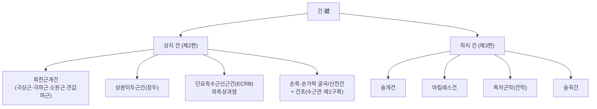
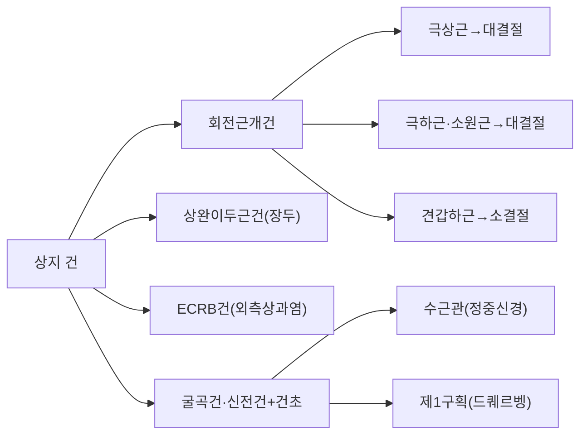
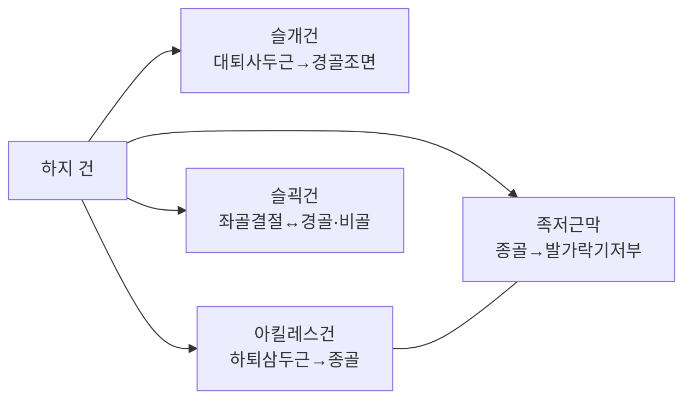

# 건(腱, Tendon)

건(腱, tendon)은 골격근(骨格筋, skeletal muscle)의 근복(筋腹)을 뼈(骨)에 부착시켜 근수축력을 관절 운동으로 전환하는 치밀결합조직(緻密結合組織, dense connective tissue) 구조물이다[교과서적 근거]. 건은 근육 자체와 달리 수축 능력이 없으며, 오직 인장(引張) 방향으로 힘을 전달하는 "케이블"로서 기능한다. 이 문서는 한의사 임상가를 위해 건이라는 조직 자체를 표제어로 삼아 ① 건의 정의·미세구조와 한의학 근(筋) 이론에서 건이 차지하는 위상, ② 상지 주요 건의 육안 해부학, ③ 하지 주요 건의 육안 해부학, ④ 건병증(腱病症, tendinopathy)의 병태생리와 치유, ⑤ 침구·건침(乾鍼, dry needling)·체외충격파(體外衝擊波, extracorporeal shockwave therapy, ESWT) 등 임상 적용의 인간 대상 근거를 다룬다. 근육(筋肉, muscle) 문서가 근육 전반을 다루는 개관 문서라면, 이 문서는 건이라는 조직 자체의 해부학적·병태생리학적·임상적 각론에 집중한다.

## 제1편 총론 — 건의 정의·미세구조와 "근(筋)" 개념에서 건의 위상

### 0. 건 분류 개념도

다음 개념도는 이 문서가 다루는 상지·하지 주요 건을 부위·기능별로 정리한 것이다[교과서적 근거].

### 1. 건의 정의와 근육-뼈 연결 구조

건은 근육의 근외막(筋外膜, epimysium)이 근위(近位)·원위(遠位) 양 끝에서 모여 형성된 치밀결합조직 다발로, 골막(骨膜)과 골질(骨質)에 파고들어 단단히 고정되는 샤피 섬유(Sharpey's fiber)를 통해 뼈에 부착된다[교과서적 근거]. 조직학적으로 건은 규칙치밀결합조직(規則緻密結合組織, dense regular connective tissue)에 해당하며, I형 콜라겐(collagen type I) 원섬유(原纖維, fibril)가 근육의 견인력이 작용하는 방향과 평행하게 배열되어 최대의 인장강도를 낸다는 점이 조직학 각론에서 이미 정리된 바 있다[교과서적 근거]. 건의 계층 구조는 콜라겐 분자(tropocollagen) → 원섬유(fibril) → 섬유(fiber) → 섬유속(fascicle) → 건 전체의 순서로 조립되며, 각 단계 사이에 얇은 결합조직 격막인 건내막(腱內膜, endotenon)이 혈관·신경·림프관의 통로를 제공하고, 건 전체를 둘러싼 건주막(腱周膜, epitenon)과 그 바깥의 활막성 또는 지방성 활주층인 건외막(腱外膜, paratenon)이 주변 조직과의 미끄러짐(gliding)을 가능하게 한다[교과서적 근거]. 활막초(滑膜鞘, tendon sheath)로 둘러싸인 건(손가락 굴곡건·아킬레스건 등)은 활막액이 마찰을 줄이는 반면, 그렇지 않은 건(대부분의 사지 대형 건)은 성긴 건외막이 활주 기능을 대신한다.

### 2. 건의 미세구조 — 교원섬유 배열과 건세포

건의 세포 성분은 섬유아세포(纖維芽細胞, fibroblast)와 형태·기능이 유사하지만 길쭉한 방추형(紡錘形)으로 콜라겐 섬유 다발 사이에 열을 지어 배열되는 건세포(腱細胞, tenocyte)가 전체 세포의 대부분을 차지한다[교과서적 근거]. 건세포는 세포질 돌기를 뻗어 이웃 건세포와 간극연접(間隙連接, gap junction)으로 연결된 망상 구조를 이루며, 이를 통해 기계적 부하(mechanical loading) 신호를 건 전체에 전달하고 콜라겐 합성·분해·재배열(remodeling)을 지속적으로 조절한다는 것이 현대 건생물학의 핵심 개념이다. 건 조직에는 소수의 건줄기세포/전구세포(tendon stem/progenitor cell, TSPC)도 존재하는 것으로 밝혀져 있으며, 이 세포들이 건 항상성 유지와 손상 후 재생에 관여할 잠재력을 지닌다는 문헌 고찰이 보고되었다[^1]. 건세포·건줄기세포와 혈소판 풍부 혈장(platelet-rich plasma, PRP)을 병용하는 생물학적 치료 전략에 관한 체계적 고찰·메타분석에서는 백혈구 함유 PRP(L-PRP)가 건의 콜라겐 합성 증가와 생체역학적 특성 개선에 긍정적 영향을 줄 가능성이 제시되었다[^2].

건은 근육에 비해 혈류 공급이 상대적으로 빈약하고(저혈관성, hypovascular), 특히 아킬레스건 중간부(midportion)처럼 혈관 분포가 특히 희박한 "취약 구역(watershed zone)"이 존재한다[교과서적 근거]. 이 저혈관성·저대사성 특성은 건이 근육보다 손상 후 치유 속도가 느리고, 만성적인 퇴행성 변화(건병증)에 취약한 이유로 설명된다.

### 3. 한의학 "근(筋)" 개념과 건의 중심적 위상 — 원전 근거 재검토

한의학 오체(五體) 이론에서 "근(筋)"은 간(肝)이 주관하는 조직으로 배속되며, 현대 해부학 용어로 옮길 때 흔히 "근육"으로 번역되는 경우가 많다. 그러나 원전을 정밀히 재검토하면 "근"이 지칭하는 실체는 골격근 자체보다 오히려 **건·인대(靭帶, ligament)와 같은 치밀결합조직** 에 더 정확히 대응한다는 사실이 드러난다. 이는 이 문서가 근육(筋肉) 문서와 구별되는 독자적 표제어로서 건을 다루는 핵심적인 이론적 근거다.

『소문(素問)·오장생성편(五藏生成篇)』은 "諸筋者皆屬於節"이라 하여 모든 근(筋)이 관절(節)에 모여 귀속됨을 명시하였다[교과서적 근거]. 관절에 직접 모여 뼈와 뼈, 또는 뼈와 근육을 연결하는 조직은 해부학적으로 건과 인대이지, 근복(筋腹) 자체가 아니다. 골격근의 근복은 대부분 관절과 관절 사이의 근위-원위 공간을 채우며, 정작 관절 부위에 밀집하여 모이는 것은 관절을 가로질러 뼈에 부착하는 건과, 뼈와 뼈를 직접 잇는 인대다. 즉 "제근개속어절(諸筋皆屬於節)"이라는 원전의 관찰은 근복보다 건·인대의 해부학적 분포를 더 정확히 기술한다.

『소문·위론(痿論)』의 "肝主身之筋膜" "筋膜乾則筋急而攣"이라는 서술 역시 마찬가지로 해석할 수 있다[교과서적 근거]. 여기서 "근막이 마르면(乾) 근이 급(急)하게 당겨 경련(攣)한다"는 병리 묘사는, 수축성 조직인 골격근의 "위약(痿弱, 힘빠짐)"보다는 **탄성을 잃은 치밀결합조직이 짧아지고 뻣뻣해져 관절 가동성을 제한하는 양상** 과 더 부합한다. 실제로 임상에서 건·인대가 구축(拘縮)되어 관절 가동 범위가 제한되는 양상(예: 오십견의 관절낭 유착, 아킬레스건 단축에 의한 첨족변형)은 "근급이련(筋急而攣)"의 전형적 표현형이며, 근력 자체가 약해지는 근위축(筋萎縮, 근육 위약)과는 병태생리가 다르다.

『영추(靈樞)·경근편(經筋篇)』이 기술하는 12경근(十二經筋)의 순행 경로 역시 이 논점을 뒷받침한다. 경근은 대개 사지 말단의 손발톱 주위(爪甲)에서 시작하여 관절을 결(結, 매듭)·취(聚, 모임)·락(絡, 얽힘)하면서 몸통 쪽으로 올라가는 것으로 기술되는데, 이 "결(結)"·"취(聚)"라는 표현은 근육 다발이 관절 부위에서 건으로 수렴하여 뼈에 부착하는 해부학적 실체(예: 아킬레스건이 종골에 결집, 슬개건이 경골조면에 결집)를 반영한다[교과서적 근거]. 경근학(經筋學)에서 침구 임상가가 실제로 촉진하고 자침하는 대상(관절 주위의 압통점·구축점)도 상당수가 근복이 아니라 건·인대·건막(腱膜) 부착부에 해당한다.

**핵심 논증**: 간주근(肝主筋) 이론이 강조하는 "질기고 탄력 있게 관절을 지탱·연결하는 조직"이라는 성질은, 수축·이완을 통해 능동적으로 힘을 발생시키는 근육 자체의 생리적 특성보다, 방향성 있는 콜라겐 다발로 인장력을 수동적으로 전달하고 관절을 안정화하는 **건·인대의 물리적 특성** 에 더 부합한다. 근육은 대사적으로 활발하고 혈류가 풍부하며 수축을 통해 능동적으로 힘을 발생시키는 조직인 반면, 건은 대사가 느리고 저혈관성이며 오직 인장 방향으로 힘을 전달하는 "탄력 있게 당기는(緊而有彈)" 조직으로, 한의학 문헌이 근(筋)의 속성으로 묘사하는 "질기다(强靭)"·"당긴다(拘急)"·"이완된다(弛緩)"는 표현과 더 직접적으로 대응한다. 이러한 관점에서 보면 건은 근(筋) 이론이 설명하고자 하는 병태(拘攣·弛緩·痿弱 중 특히 拘攣·弛緩 축)의 물리적 실체에 더 가깝고, 근육은 오히려 근(筋)과 함께 오장 배속에서 별도로 다루어질 수 있는 "육(肉, 비주육)"의 수축 기능적 측면과 개념적으로 근접한다고 볼 수 있다. 다만 한의학 "근"이 건·인대만을 배타적으로 지칭하는 것은 아니며, 근육의 건 부착부·근막·인대를 포괄하는 넓은 결합조직 스펙트럼 개념으로 이해하는 것이 원전에 더 충실한 해석이다.

『소문·육절장상론(六節藏象論)』의 "其充在筋"(간의 충실함이 근에 있다)과 "肝之合筋也, 其榮爪也"(간이 근과 배합되며 그 영화가 손발톱에 나타난다)는 서술도, 손발톱(爪甲)이 해부학적으로 건의 말단 부착부 및 그 주변 결합조직과 인접해 있다는 점에서 근-조(筋-爪)의 배속이 건 계통 조직의 연속성을 반영한다고 해석할 수 있다[교과서적 근거]. 이 문서는 이러한 논증에 따라 **건을 근(筋) 이론의 주변적 파생물이 아니라 오히려 그 핵심 물리적 실체로 다루며**, 근위(筋痿)·근급(筋急)·근련(筋攣) 등 근(筋) 병리의 상당 부분이 건·인대 병리(건병증·건 구축·건 파열)로 구체화될 수 있음을 각 편에서 확인한다.

### 4. 건과 인대의 구별

건과 인대는 조직학적으로 매우 유사한 규칙치밀결합조직이지만, 기능적으로는 명확히 구별된다. 건은 근육과 뼈를 연결하여 근수축력을 관절 운동으로 전달하는 반면, 인대는 뼈와 뼈를 직접 연결하여 관절의 안정성을 유지하고 과도한 운동 범위를 제한한다[교과서적 근거]. 콜라겐 섬유의 배열도 건은 인장 방향으로 거의 완전히 평행하게 배열되는 반면, 인대는 여러 방향의 하중에 대응하기 위해 다소 파상(波狀, crimp)이 크고 배열이 덜 규칙적이다. 이 문서는 건에 집중하되, 건-인대 이행부(예: 슬개인대는 명칭상 인대이나 기능적으로는 대퇴사두근건의 연속체)와 같이 경계가 모호한 구조물은 임상적 관례에 따라 함께 다룬다.

### 5. 건의 신경 지배와 고유수용감각

건에는 골지건기관(Golgi tendon organ, GTO)이라는 특수 감각 수용기가 분포하여, 근육의 장력(張力)을 실시간으로 감지하고 척수 반사(자가억제, autogenic inhibition)를 통해 과도한 장력으로부터 근-건 단위를 보호한다[교과서적 근거]. 이 고유수용감각 기전은 침구·추나 임상에서 근막이완·신장(스트레칭) 기법의 신경생리학적 기전으로 흔히 인용되며, 건 자체가 단순한 수동적 구조물이 아니라 능동적인 감각-운동 조절 회로의 일부임을 보여준다.

## 제2편 상지(上肢) 주요 건 해부

### 1. 회전근개건(回轉筋蓋腱, rotator cuff tendon)

회전근개는 극상근(棘上筋, supraspinatus, 견갑상신경 C5-C6 지배)·극하근(棘下筋, infraspinatus, 견갑상신경 C5-C6 지배)·소원근(小圓筋, teres minor, 액와신경 C5-C6 지배)·견갑하근(肩胛下筋, subscapularis, 상·하견갑하신경 C5-C7 지배)의 네 근육이 각각 상완골 대결절(大結節)과 소결절(小結節)에 부착하는 건으로 이루어지며, 이 네 건이 관절낭과 유합되어 견관절을 안정화하는 "덮개(cuff)"를 형성한다[교과서적 근거]. 혈류는 견갑상동맥(suprascapular artery)·후상완회선동맥(posterior circumflex humeral artery)·견갑하동맥(subscapular artery)이 각 근건 단위에 분포하되, 극상근건의 대결절 부착부 근처(critical zone, 건 부착부에서 근위 약 1cm)는 상대적으로 혈류가 빈약한 저혈관 구역으로 알려져 있어 퇴행성 파열의 호발 부위와 일치한다. 극상근건은 견봉(肩峰) 아래를 통과하는 협소한 공간(견봉하 공간, subacromial space)을 지나기 때문에 반복적인 견봉하 마찰·충돌(impingement)에 가장 취약하며, 임상적으로 회전근개 건병증(rotator cuff tendinopathy)·부분/완전 파열의 호발 부위다. 회전근개는 상완골두를 관절와에 압박·중심화(compression-concavity)시켜 삼각근의 큰 힘이 상완골두를 상방으로 전위시키는 것을 상쇄하는 힘偶(force couple) 관계를 이루며, 견봉하점액낭(subacromial bursa)이 극상근건과 견봉 사이에서 마찰을 완충한다.

체외충격파 치료(ESWT)에 대한 메타분석은 회전근개 건증 환자에서 통증 완화·기능 회복·관절 외회전 범위 개선에 유의미한 효과를 확인하였다[^3]. 혈소판 풍부 혈장(PRP) 주사에 대한 메타분석에서도 회전근개 질환 환자의 장기적 통증 조절과 어깨 기능 개선에 안전하고 효과적인 중재로 평가되었다[^4]. 초음파 유도하 전침(電鍼) 치료가 물리치료·스테로이드 주사에 반응하지 않은 회전근개 건증 환자에게 시행되어 단기 및 장기적으로 유의미한 증상 개선을 보인 증례가 보고되었다[^5]. 키네시오 테이핑과 드라이 니들링을 비교한 무작위대조시험에서는 통증 감소에 있어 키네시오 테이핑이 다소 우월했으나 삶의 질 개선은 두 방법이 유사했다[^6]. 만성 극상근 건병증 환자를 대상으로 초음파 유도하 콜라겐 주사와 드라이 니들링을 비교한 무작위대조시험에서는 콜라겐 주사가 임상 점수와 초음파상 건 구조 개선 모두에서 더 우수한 결과를 보였다[^7]. 경피전기분해술(percutaneous electrolysis)을 드라이 니들링과 비교한 무작위대조시험에서는 경피전기분해술이 통증 완화·관절 가동 범위·압통 역치 개선에서 더 우수했으며 1년 후 장기 효과도 더 좋았다[^8]. 만성 회전근개 건병증 환자에게 신장성 운동과 드라이 니들링을 병행하는 것이 운동 단독보다 효과를 더 오래 유지시켰다는 무작위대조시험도 보고되었다[^9]. 견갑하근 건병증 환자에서 체외충격파와 경피적 침 전해분해술을 병행한 경우가 체외충격파 단독보다 건 강성 감소·내회전 가동 범위 및 근력 향상에서 더 우수한 단기 효과를 보였다는 무작위대조시험도 있다[^10]. 물리치료 중재들을 비교한 대규모 네트워크 메타분석(5,532명)에서는 어깨 근육 강화 운동이 통증 감소와 기능 개선에 가장 근거가 확실한 1차 치료로 확인되었다[^11].

**임상적 의의**: 회전근개건은 견봉하 충돌증후군·석회성 건염(calcific tendinitis)·부분/완전 파열의 호발 부위이며, 극상근건이 가장 흔히 침범된다. 야간통(夜間痛)·팔을 들어 올릴 때의 통증호(painful arc)·저항성 외회전/외전 검사에서의 근력 약화가 특징적 임상 소견이다.

### 2. 상완이두근건(上腕二頭筋腱, biceps brachii tendon)

상완이두근은 장두(長頭, long head)와 단두(短頭, short head)로 이루어지며, 장두건은 상완골 결절간구(結節間溝, bicipital groove)를 지나 관절와상결절(關節窩上結節, supraglenoid tubercle)에 부착하고 단두건은 오구돌기(烏口突起, coracoid process)에서 기시한다[교과서적 근거]. 상완이두근 전체는 근피신경(筋皮神經, musculocutaneous nerve, C5-C6)의 지배를 받으며 상완동맥의 분지가 혈류를 공급한다. 원위건은 요골조면(radial tuberosity)에 부착하여 팔꿈치 굴곡뿐 아니라 전완 회외(回外, supination)를 강하게 일으키는데, 이 회외 작용은 팔꿈치가 90도 굴곡된 자세에서 가장 강력하게 발휘된다(나사돌리기·병따개 동작). 장두건은 결절간구 내에서 상완횡인대(transverse humeral ligament)에 의해 홈 안에 고정되며 활막초로 둘러싸여 견관절낭과 연속되어 있어, 견관절 내 병변(관절염·유착성 관절낭염)이 장두건 활막염과 동반되는 경우가 흔하다. 이 장두건은 좁은 골성 홈을 반복적으로 미끄러지며 주행하기 때문에 건염·아탈구·상완이두근구 활막염의 호발 부위이며, 흔히 회전근개 병변과 동반된다. 상완이두근 장두 건병증에 대한 물리치료 중재의 범위 고찰(scoping review)에서는 체외충격파·초음파·편심성 운동·도수치료·드라이 니들링 등 다양한 접근이 사용되고 있으나 최적 치료에 대한 합의가 부족하다고 보고되었다[^12]. 단일맹검 무작위대조시험에서는 드라이 니들링이 경피신경전기자극(TENS)보다 상완이두근 장두 건병증의 단기·중기 통증/장애 완화 및 건주위 삼출액 감소에 더 우수한 효과를 보였다[^13].

### 3. 외측상과염 관련 건 — 단요측수근신근건(短橈側手根伸筋腱, ECRB tendon)

외측상과염(外側上顆炎, lateral epicondylitis, "테니스 엘보")은 단요측수근신근(短橈側手根伸筋, extensor carpi radialis brevis, ECRB)의 상완골 외측상과 부착부에서 발생하는 만성 건병증으로, 반복적인 손목 신전·회내외 동작이 위험 요인이다[교과서적 근거]. ECRB는 요골신경(橈骨神經, radial nerve)의 심지인 후골간신경(後骨間神經, posterior interosseous nerve, C5-C8)의 지배를 받으며, 요측측부동맥(radial collateral artery)의 분지가 혈류를 공급한다. 작용은 손목의 신전과 요측 편위(radial deviation)이며, 원위건은 제3중수골 기저부에 부착한다. 후골간신경이 ECRB 건막 아래의 섬유성 궁(Arcade of Frohse)을 통과하므로, 만성 외측상과염 환자에서 요골터널증후군(radial tunnel syndrome)이 동반되어 통증 부위가 유사하게 겹치는 경우가 감별 진단상 중요하다. 조직검사상 염증세포보다 콜라겐 배열 이상·혈관신생·점액양변성(粘液樣變性)이 특징적으로 관찰되어, 순수 염증(-itis)보다 퇴행성 건병증(-opathy) 개념이 더 부합한다는 것이 현대 건병증 이론의 핵심이다.

외측상과염에 대한 침구 근거는 한의학 임상에서 가장 두텁게 축적된 영역 중 하나다. 화침(火鍼)과 감미봉독약침을 병행한 증례 연구에서 통증(VAS)이 유의하게 감소하였고[^14], 약침 치료의 연구 동향 체계적 고찰에서는 약침이 효과적으로 보이나 표준화된 지침 마련이 필요함이 지적되었다[^15]. 동측·대측 침 치료와 가짜 침을 비교하는 프로토콜 연구가 보고되었으며[^16], 성인 외측상과염 환자에 대한 침 치료의 통합적 고찰에서는 단기·중기 통증 완화와 팔 기능 회복에 효과적이며 부작용이 적은 안전한 보완 요법으로 평가되었다[^17]. 침 치료와 체외충격파 치료를 비교한 임상시험에서는 두 치료법의 통증 감소 효과가 유사했다[^18]. 309명을 포함한 체계적 고찰에서는 침 치료 및 침·뜸 병용 치료가 팔꿈치 기능·근력 개선 가능성을 시사했으나 방법론적 질이 낮다는 한계가 지적되었고[^19], 침 치료와 화침 병행이 단기 통증 완화·기능 개선에 효과적이라는 무작위 증례-대조 파일럿 연구도 있다[^20]. 796명을 포함한 메타분석에서는 침 치료가 약물치료·신경차단술·가짜침보다 통증 완화 및 임상적 유효성에서 우수했다[^21]. 이후 이 메타분석의 정오표가 발표되었다[^22][^23]. PRISMA 준수 프로토콜 연구도 보고되었다[^24]. 초음파 유도하 인태반 약침 치료가 외측상과염 및 공통신근건 파열 환자의 통증 감소·기능 회복·조직 재생에 효과적일 수 있다는 증례도 있다[^25]. 중국 고전 침법(부자·관자·삼자·호자·투자)을 이용해 경근(經筋)의 구급(拘急)과 기혈 응체를 치료한 임상 경험[^26], 경근 이론에 기반한 인침(刃針)의 반월자법(半月刺法)을 난치성 환자에게 적용한 사례[^27]도 보고되었다. 사지 근골격계 통증에 대한 침구의 임상 초점 근거 종합에서는 족저근막염과 함께 외측상과염이 가장 강력한 근거를 보이는 것으로 평가되었다[^28]. 데이터마이닝 연구에서는 아시혈·곡지(LI11)·수삼리(LI10)·합곡(LI4)·외관(TE5)이 핵심 혈위로 확인되었으며 특히 곡지-수삼리 조합이 임상적으로 유용하다고 보고되었다[^29]. 최근 문헌 고찰에서는 구조화된 물리치료·부하 조절이 1차 치료로, 단기 증상 완화에는 코르티코스테로이드가, 장기적으로는 PRP·자가혈 주사가 권장되었다[^30].

드라이 니들링·체외충격파 영역에서도 다수의 근거가 축적되어 있다. 고강도 레이저 치료(HILT)를 체외충격파와 비교한 메타분석(169명)에서는 HILT가 단기·중기 상지 기능 개선에 더 효과적이었다[^31]. 143명을 대상으로 한 다기관 무작위대조시험에서는 전침(electrical dry needling)과 추나 교정술을 물리치료에 병행하는 것이 통증 감소·기능 회복에 훨씬 효과적이었다[^32]. 외측 상과염 통증 중재를 비교한 네트워크 메타분석에서는 단기적으로 위약 대비 우월한 중재가 없었으나 중기적으로는 물리치료·운동 요법이 효과적이었다[^33].

**임상적 의의**: 저항성 손목 신전 검사(Cozen test)·중지 신전 검사에서 외측상과 통증이 유발되며, 반복적인 손목 사용(라켓 스포츠·타이핑·수공업)이 위험 요인이다. 만성화되면 콜라겐 재배열 이상(angiofibroblastic hyperplasia)이 조직학적으로 확인되어, 급성 염증기보다 퇴행성 재형성 실패 상태에 가깝다.

### 4. 손목·손가락 굴곡건·신전건과 건초(腱鞘)

손목·손가락의 굴곡건(요측수근굴근·척측수근굴근·천지굴근·심지굴근·장무지굴근 등)은 수근관(手根管, carpal tunnel)을 통과하며 정중신경(正中神經, median nerve, C6-T1)과 밀접한 해부학적 관계를 갖는다. 천지굴근·심지굴근은 대부분 정중신경(척측수근굴근·심지굴근 척측 절반은 척골신경 지배)의 지배를 받고, 요골동맥·척골동맥의 분지가 수부 굴곡건에 분포한다. 수근관의 천장은 횡수근인대(굴근지대)가 이루며, 바닥과 벽은 수근골이 형성하는 골성 터널로, 이 협소한 공간 안에서 9개의 굴곡건(천지굴근 4개·심지굴근 4개·장무지굴근 1개)과 정중신경이 함께 주행하기 때문에 굴곡건 활막의 경미한 비후만으로도 신경 압박이 쉽게 발생한다. 수근관증후군(carpal tunnel syndrome, CTS)은 엄밀히는 신경 압박 질환이지만, 굴곡건의 활막(滑膜, synovium)이 비후·염증화되어 수근관 내 압력을 높이는 것이 주요 병태생리 기전 중 하나로 알려져 있어 건초(腱鞘)와 밀접히 연관된 임상 영역이다[교과서적 근거]. 경증·중등도 CTS에 대한 수기침 치료의 체계적 고찰에서는 심각한 부작용 없이 통증 감소·기능 개선에 효과적일 수 있음이 시사되었다[^34]. 코크란 체계적 고찰(869명)에서는 침 및 관련 중재가 CTS 증상 완화에 잠재적 유용성이 있으나 근거 수준이 낮거나 불확실하다고 평가하였다[^35]. 손목 부목과 침 치료를 병행한 무작위대조시험에서는 단순 부목보다 정중신경 단면적(CSA)을 유의하게 감소시키는 해부학적 개선이 초음파로 확인되었다[^36]. 전침 치료가 S1-시상·S1-해마 간 뇌 연결성을 조절하여 정중신경 기능 회복과 임상 증상 개선을 유도한다는 기전 연구도 보고되었다[^37]. 기존 체계적 고찰·메타분석들을 종합 검토한 개관 연구에서는 침 치료가 통증 강도 감소에 효과적일 수 있으며 심각한 부작용은 없는 것으로 평가되었다[^38]. 국내 건강보험 자료 분석에서는 CTS 환자 중 수술적 치료 비율은 감소하는 반면 침 등 한방 치료 이용률은 지속적으로 증가하는 추세가 확인되었다[^39].

수근관 굴곡건과 인접한 요골 경상돌기 부위의 건초염인 드퀘르벵 건초염(de Quervain's tenosynovitis)은 장무지외전근(長拇指外轉筋, abductor pollicis longus, 후골간신경 지배)과 단무지신근(短拇指伸筋, extensor pollicis brevis, 후골간신경 지배)이 공유하는 제1구획 건초의 협착성 건초염이다[교과서적 근거]. 두 근육은 모두 요골·척골 후면(전완 후방 구획)에서 기시하여 각각 제1중수골 기저부·기절골 기저부에 정지하며, 요골동맥의 천지가 이 부위에 분포한다. 신전지대(extensor retinaculum) 제1구획을 이 두 건이 공유하기 때문에 반복적인 무지 외전·신전과 손목 요측 편위 동작이 결합될 때 구획 내 마찰이 급증하여 협착성 건초염이 발생하기 쉽다. 851명을 포함한 메타분석에서는 침 치료가 국소 진통제보다 통증(VAS) 감소와 치료 효과율 개선에 유의하게 우수했다[^40]. 68명을 대상으로 한 무작위대조시험에서는 2주간 5회의 침 치료로 통증 강도가 유의하게 감소하고 악력·핀치력·Q-DASH 기능 점수가 개선되었다[^41]. 침구 치료의 체계적 고찰·메타분석 프로토콜 연구도 보고되었다[^42]. 손목 신전근 구획 주사 시 표재요골신경(superficial radial nerve) 손상을 방지하기 위한 초음파 기반 해부학적 안전 구역 연구는 드퀘르벵 건초염 부위에 자침·주사할 때 신경 손상을 피하는 실무적 근거를 제공한다[^43].

**임상적 의의**: 드퀘르벵 건초염은 핀켈스타인 검사(Finkelstein test)로 요측 경상돌기부 통증이 유발되며, 육아·수유·반복적 손목 요측 편위 동작이 위험 요인이다. 방아쇠수지(trigger finger)는 굴곡건이 A1 도르래(pulley)를 통과할 때 걸리는 협착성 건초염으로, 굴곡건과 도르래 구조의 불일치가 병태생리의 핵심이다.

**이 절의 근거 한계**: 수근관증후군은 정중신경 압박 질환으로서 신경계 병리가 일차적이지만, 굴곡건 활막 비후가 병인에 관여하는 건-신경 복합 병태이므로 이 문서에서 함께 다루었다. 침 치료의 상당수 근거 수준은 "잠재적 유용성" 또는 "낮은 근거 수준"으로 평가되어, 관행적 취혈보다 변증·병기(급성 활막염 vs 만성 협착) 층화가 필요하다.

## 제3편 하지(下肢) 주요 건 해부

### 1. 슬개건(膝蓋腱, patellar tendon)

슬개건은 엄밀히는 대퇴사두근건(大腿四頭筋腱)이 슬개골(膝蓋骨)을 경유해 경골조면(脛骨粗面, tibial tuberosity)에 부착하는 연속체의 원위부로, 근위로는 슬개골 하극(下極)에서 시작하여 원위로 경골조면에 부착하며, 기능적으로 대퇴사두근의 신전력을 하퇴로 전달하는 핵심 구조물이다[교과서적 근거]. 대퇴사두근(대퇴직근·외측광근·내측광근·중간광근)은 대퇴신경(femoral nerve, L2-L4)의 지배를 받으므로 슬개건의 장력도 이 신경 지배하에 간접적으로 놓이며, 슬개하지방체(Hoffa's fat pad)와 심부 슬개건활액낭(deep infrapatellar bursa)이 건과 경골 사이에서 완충 작용을 한다. 슬개골 자체는 대퇴사두근건 내에 형성된 인체 최대의 종자골(種子骨, sesamoid bone)로, 무릎 신전 시 모멘트 암(moment arm)을 늘려 신전력의 기계적 효율을 높이는 지렛대 역할을 한다. 반복적인 점프·착지 동작(농구·배구 등)에서 과사용되어 "점퍼스 니(jumper's knee)"로 불리는 슬개건병증(patellar tendinopathy)이 호발하며, 슬개골 하극(下極) 부착부가 가장 흔한 병소다.

슬개건병증은 침구·건침 영역에서 가장 많은 임상 근거가 축적된 건 병변 중 하나다. 초음파 유도하 드라이 니들링을 평가하는 프로토콜 연구(96명)가 보고되었고[^44], 드라이 니들링·등척성·신장성 운동의 통증·기능 개선 효과를 비교한 체계적 고찰에서는 드라이 니들링과 신장성 운동이 장기 효과에, 등척성 운동이 운동 중 단기 통증 완화에 유용함이 확인되었다[^45]. 430명을 포함한 네트워크 메타분석에서는 백혈구 풍부 PRP 주사가 기능 개선(VISA scale)과 통증 감소에 가장 효과적인 비수술적 치료로 평가되었다[^46]. 보존적 치료의 체계적 고찰(GRADE 권고 포함)에서는 단기 효과가 최소 중재·침습적 중재와 유의한 차이를 보이지 않고 근거 수준이 낮거나 매우 낮다고 지적되었다[^47]. 비수술적 치료 체계적 고찰에서는 신장성 운동·드라이 니들링·PRP·자가혈 주사가 장기적 통증 감소와 기능 회복에 유용하다고 평가되었다[^48]. 신근성 운동 단독과 드라이 니들링 또는 경피전기분해침(percutaneous needle electrolysis, PNE) 병행을 비교한 무작위대조시험에서는 두 군 간 유의한 차이가 없었다[^49]. 이후 비용-효과성 분석에서는 PNE가 드라이 니들링·가짜침보다 비용-효과성 측면에서 더 우수함이 확인되었다[^50]. 세 팔(arm) 무작위 이중맹검 대조시험의 위약·노시보 효과 분석에서는 PNE와 드라이 니들링 모두에서 임상적 통증 감소가 나타났으나 군 간 차이는 없었다[^51](정오표[^52]). 편심성 운동에 드라이 니들링을 병행하는 것이 무릎 기능뿐 아니라 점프 시 편심성 파워(eccentric power) 향상에도 효과적이었다는 후속 연구도 보고되었다[^53]. 농구 선수의 슬개건병증에 건침·체외충격파·수기치료·교정 운동을 결합한 다각적 재활 접근법에 관한 후향적 관찰연구도 있다[^54]. 연부조직 기법(드라이 니들링·경피전기분해술·횡마찰마사지)을 운동 치료에 병행하는 것이 운동 단독보다 통증 감소·기능 회복에 더 효과적이라는 메타분석(309명)도 보고되었다[^55]. 보존적 치료에 반응하지 않는 석회성 만성 슬개건병증에 드라이 니들링·주사·바보타주를 결합한 3단계 영상 유도 중재술 증례도 있다[^56]. 건세포 유사 세포·폴리도카놀·LP-PRP·건침 주사 요법을 비교한 네트워크 메타분석에서는 이들 주사 요법이 보존적 치료보다 단기·중기 통증 완화와 기능 개선에 효과적일 수 있다고 평가되었다[^57].

### 2. 아킬레스건(踵骨腱, Achilles tendon)

아킬레스건은 비복근(腓腹筋, 대퇴골 내·외측과에서 기시)·가자미근(比目魚筋, 비골·경골 후면에서 기시)이 합쳐진 하퇴삼두근(下腿三頭筋)의 건으로, 인체에서 가장 강력하고 굵은 건이며 종골(踵骨) 융기에 부착하여 발바닥굽힘(저측굴곡, 보행 추진기에 체중의 여러 배에 이르는 부하를 전달)을 담당한다[교과서적 근거]. 하퇴삼두근은 경골신경(脛骨神經, tibial nerve, S1-S2)의 지배를 받으며 후경골동맥의 분지가 혈류를 공급한다. 건 근위부는 나선형으로 약 90도 회전(twist)하며 주행하는데, 이 해부학적 회전 구조가 취약 구역의 응력 집중과 관련된 것으로 설명된다. 건 중간부(부착부에서 약 2~6cm 근위, midportion)는 국소 혈류가 가장 빈약한 취약 구역으로, 만성 아킬레스 건병증의 호발 부위다. 부착부형(insertional)과 중간부형(midportion) 건병증은 병태생리·치료 전략이 다르다는 점이 임상적으로 중요하다.

초음파 유도하 드라이 니들링과 건주위 정수압 감압술을 병행한 증례 연구(21명)에서는 만성 아킬레스 건병증 환자의 통증 감소와 기능적 회복에 안전하고 유의한 효과가 보고되었다[^58]. 도수 치료·운동 요법에 드라이 니들링을 추가하는 타당성 연구에서는 임상적 유효 가능성은 있으나 높은 중도 탈락률로 대규모 RCT 설계에 어려움이 지적되었다[^59]. 근육 내 자극술(건침)을 표준 재활 운동에 추가한 무작위대조시험(52명)에서는 재활 단독·가짜 침 치료 대비 추가적 이점이 확인되지 않았다[^60]. 경피적 치료법의 분자·구조적 효과를 다룬 문헌 고찰에서는 신생혈관 형성·조직 재형성에 대한 근거가 있으나 임상시험 수준의 근거는 아직 부족함이 지적되었다[^61]. 초음파 유도하 경피전기분해술을 비복근 유발점 드라이 니들링과 비교한 무작위대조시험(60명)에서는 경피전기분해술이 통증 감소·삶의 질·발목 기능 개선에 더 효과적이었다[^62]. 발·발목 침 치료에 대한 체계적 고찰(211명)에서는 족저근막염과 아킬레스 건병증 모두에서 단기·중기 통증 완화에 효과적이고 안전한 치료 옵션으로 평가되었다[^63]. 슬개건병증·아킬레스 건병증·족저근막염에 대한 체외충격파 치료의 효과를 다룬 메타분석에서도 유의미한 근거가 확인되었다[^64].

### 3. 족저근막(足底筋膜, plantar fascia/aponeurosis)

족저근막은 엄밀히 말하면 건이 아니라 불규칙치밀결합조직으로 구성된 건막(腱膜, aponeurosis)이지만, 종골 내측결절(medial calcaneal tuberosity)에서 기시하여 다섯 발가락의 기저부(각 중족지관절 근위)까지 부채꼴로 부착하며 보행 시 발의 종아치(longitudinal arch)를 유지하는 인장 구조물이라는 점에서 건과 기능적으로 매우 유사하고, 아킬레스건-족저근막 근막연쇄(fascial chain)로 해부학적으로 연속되어 있어 이 문서에서 함께 다룬다[교과서적 근거]. 외측족저신경(lateral plantar nerve)의 첫 분지(내측종골신경 분지 또는 무지외전근 신경)가 족저근막 심부·내측종골결절 부근을 지나므로, 만성 족저근막염 통증의 일부는 이 신경의 포착과 겹쳐 나타날 수 있다. 발가락을 배측굴곡(신전)시키면 족저근막이 권양기(卷揚機, windlass) 원리로 팽팽해지며 종아치가 상승하는 권양기전(windlass mechanism)은 보행 추진기의 아치 강성 확보에 핵심적인 생체역학이다. 족저근막염(plantar fasciitis)은 종골 부착부의 미세 파열·퇴행성 변화로, 아침 첫걸음 통증(post-static dyskinesia)이 특징적이다.

족저근막염에 대한 침구 근거는 상당히 두텁게 축적되어 있다. PC7(내관) 혈위 침 치료가 LI4(합곡) 혈위 치료보다 아침 통증·전반적 통증·압통 역치 개선에 더 효과적이었던 무작위대조시험(53명)이 보고되었고[^65], 만성 족저근막염 환자를 대상으로 침 치료의 유효성을 가짜침·대기 대조군과 비교하는 프로토콜 연구(120명)도 있다[^66]. 한비증후군(寒-痺症候群)을 동반한 족저근막염 환자에게 침·뜸을 병행해 5회기 만에 통증이 완전히 소실된 증례[^67], 침구 치료의 다양한 접근법과 이론적 근거를 분석한 비판적 해석적 종합 연구[^68], 침·뜸·괄사·자락관·마사지를 병행한 다중 양식 치료 증례[^69]도 보고되었다. 전침과 수침을 비교한 무작위대조시험(92명)에서는 두 방법 모두 효과가 있었으나 유의한 차이는 없었고[^70], 만성 난치성 족저근막염에 전침 치료를 병행한 무작위대조시험(30명)에서는 통증(VAS)·족부 기능(FFI)이 유의하게 개선되고 치료 성공률이 80%로 나타났다[^71]. 태계(KI3)·곤륜(BL60)·삼음교(SP6) 혈위 침 치료가 만성 통증 완화에 유의미한 효과를 보인 초기 연구[^72], 전침 세션 빈도를 비교하는 프로토콜 연구[^73], 한국 건강보험 자료 기반의 의료이용 분석(60,079명, 양방은 물리치료·진통제, 한방은 침 치료가 주된 치료법으로 확인됨)[^74], 전침·드라이 니들링·레이저 침 병행 치료를 비교한 파일럿 연구[^75], 초음파 유도하 봉약침 치료가 통증 감소·근막 두께 개선에 효과적이었던 증례[^76], 건침·침·전침·초음파 유도하 침습 기술의 최신 동향을 검토한 문헌 고찰[^77], 근막 유발점 침 치료와 전통 경혈 침 치료를 비교하는 프로토콜 연구[^78], 원-락(原-絡) 혈위 조합(태계-곤륜)을 이용해 기존 치료에 반응하지 않던 환자를 개선시킨 증례[^79], 고강도 침 치료가 16주까지 효과가 지속된 만성 난치성 족저근막염 무작위시험(120명)[^80]도 보고되었다.

**임상적 의의**: 족저근막염은 체중부하 시 종골 내측 결절 압통, 아침 첫걸음 통증이 특징이며, 비만·장시간 서 있는 직업·평발/요족 등이 위험 요인이다. 아킬레스건 단축이 동반된 경우가 흔해 두 구조물을 함께 평가·치료하는 것이 임상적으로 권장된다.

### 4. 슬괵건(膝膕腱, hamstring tendon)

슬괵근(반건양근·반막양근·대퇴이두근)의 근위건은 좌골결절(坐骨結節)에, 원위건은 각각 경골 내측(반건양근·반막양근, 거위발건pes anserinus 구성)과 비골두(대퇴이두근)에 부착한다[교과서적 근거]. 반건양근·반막양근·대퇴이두근 장두는 좌골신경의 경골 분지(tibial division, L5-S2)의 지배를 받는 반면, 대퇴이두근 단두만 예외적으로 좌골신경의 총비골 분지(common peroneal division)의 지배를 받아 이중 신경 지배 양상을 보인다. 슬괵근은 무릎 굴곡과 고관절 신전이라는 이관절근 작용을 수행하며, 심대퇴동맥(profunda femoris artery)의 관통가지가 근위건 부위에 분포한다. 좌골결절 부착부의 슬괵건병증(hamstring tendinopathy, "달리기 선수 엉덩이")은 좌골신경과 인접해 좌골신경통과 감별이 필요하며, 대전자 통증 증후군(greater trochanteric pain syndrome, GTPS)과 함께 골반대 후방부 만성 통증의 주요 원인으로 다루어진다. 스테로이드 주사·물리치료에 반응하지 않는 난치성 대전자 통증 증후군 환자에게 드라이 니들링과 전기 자극 치료를 병행하여 통증 감소·기능 회복을 이끌어낸 증례가 보고되었다[^81].

**이 편의 근거 한계**: 이 편에서 제시한 임상 근거표·비교 연구들은 특정 건 병변에 대한 개별 중재의 상대적 효과를 보여주는 임상 틀이지, 모든 건병증에 동일하게 적용 가능한 표준 치료 순서를 뜻하지 않는다. 부위·병기(급성/만성, 부착부형/중간부형)에 따라 치료 반응이 다르므로 근거를 기계적으로 대입하지 않아야 한다.

## 제4편 건의 병리와 재생

### 1. 건병증(腱病症, tendinopathy)의 병태생리

과거 건 통증을 "건염(腱炎, tendinitis)"으로 명명하며 급성 염증 반응으로 설명했던 것과 달리, 현대 건병리학은 만성 건 통증의 조직학적 실체가 염증세포 침윤보다 **콜라겐 구조 붕괴·기질 변화·신생혈관·신경성장(neurovascular ingrowth)** 을 특징으로 하는 퇴행성·실패한 치유 반응(failed healing response)에 가깝다는 것을 밝혀, "건병증(tendinopathy)"이라는 용어가 표준으로 자리잡았다[교과서적 근거]. 건병증 조직에서는 정상 배열의 I형 콜라겐이 감소하고 III형 콜라겐 비율이 증가하며, 프로테오글리칸·글리코사미노글리칸 침착에 의한 점액양변성(mucoid degeneration)이 관찰되고, 통증과 관련된 신생혈관 및 무수초 신경섬유(sensory nerve fiber)의 침입이 확인된다. 건병증 치료에 관한 체계적 고찰들을 종합한 개관 연구(systematic review of systematic reviews)는 신장성 운동(eccentric exercise)이 통증 감소·기능 개선에 가장 일관되고 효과적인 치료법으로 확립되어 있음을 확인했다[^82].

### 2. 건 손상 치유의 조직학적 단계

건 손상의 치유는 결합조직 손상 치유의 일반 원리와 마찬가지로 **염증기(炎症期)→증식기(增殖期)→재형성기(再形成期)** 의 연속적 단계로 진행된다는 개념 틀이 제시되어 있으며, 각 단계에서 건세포와 세포외기질의 역할이 순차적으로 전환된다(치밀결합조직 각론 문서에서 이 개념 틀의 세부를 다룬다). 이 치유 과정은 저혈관성이라는 건의 조직학적 특성 때문에 근육·피부 등 혈류가 풍부한 조직보다 훨씬 느리게 진행되며, 재형성기에 형성되는 반흔 콜라겐은 정상 건 조직만큼 정연하게 배열되지 못해 장력 강도가 완전히 회복되지 않는 경우가 많다[교과서적 근거]. 이는 건 파열 수술 후 장기간의 점진적 부하 재활(graded loading rehabilitation)이 필요한 이유이자, 급성기 과도한 조기 부하가 재파열 위험을 높이는 이유이기도 하다.

굴곡건(수부 Zone II) 수술적 봉합 후 재활에서는 부목의 종류(맨체스터 단축 부목 vs 전통적 배측 부목)가 근위지관절 굴곡 구축과 최종 관절 가동 범위에 영향을 미칠 수 있음을 검증하는 무작위대조시험 프로토콜이 보고되어, 건 봉합 후 재활 전략이 임상 결과에 직접적으로 영향을 준다는 점을 뒷받침한다[^83]. 건줄기세포/전구세포와 PRP를 결합한 생물학적 치료가 건 손상 재생의 유망한 전략으로 제시되고 있으나[^1], L-PRP의 콜라겐 합성·생체역학 개선 효과에 대한 메타분석은 아직 인체 대상 근거가 제한적이라는 한계도 함께 지적한다[^2].

### 3. 노화·과사용에 따른 건의 변화

건은 나이가 들면서 콜라겐 교차결합(cross-linking)의 비효소적 당화(advanced glycation end-product, AGE)가 축적되어 조직이 뻣뻣해지고 탄성이 감소하며, 동시에 건세포 밀도와 대사 활성이 저하되어 손상 후 자가 치유 능력이 함께 떨어진다[교과서적 근거]. 반복적 과사용(repetitive overuse)은 미세손상 누적 속도가 건의 재형성 속도를 초과하는 상황을 만들어 만성 건병증으로 이행하는 핵심 기전으로 설명된다. 이는 젊은 운동선수의 급성 과사용성 건병증과, 중장년층의 퇴행성 건병증(석회화 동반 빈도가 높음)이 임상적으로 다른 양상을 보이는 이유이기도 하다.

## 제5편 임상 적용 — 침구·건침·체외충격파·초음파 유도 시술

### 1. 건침(乾鍼, dry needling)의 건병증 적용

건침(드라이 니들링)은 서양 물리치료 영역에서 발전한 침습적 중재로, 근막 유발점(myofascial trigger point) 자극뿐 아니라 건 조직 자체에 반복적으로 미세 천공(microtrauma)을 가해 국소 출혈·성장인자 방출을 유도함으로써 정체된 만성 건병증의 치유 반응을 재점화(reignite)하는 것을 기전으로 한다[교과서적 근거]. 건병증에 대한 건침의 유용성을 다룬 서술적 문헌 고찰에서는 건침이 최소 침습적이고 안전하며 비용 효율적인 치료 옵션이 될 수 있다고 평가되었다[^84]. 필라멘트형 건침의 활용에 관한 체계적 고찰에서는 건침이 통증 감소·기능 및 근육 성능 개선에 유용한 보조적 치료 수단으로 평가되었다[^85]. 건침과 코르티코스테로이드 주사를 비교한 체계적 고찰에서는 단기적으로는 두 방법이 유사하나 장기적으로는 건침이 더 유의미한 효과를 보인다고 보고되었다[^86]. 건침에 신장성 운동을 병합한 경우의 효과를 다룬 체계적 고찰에서도 통증 완화·기능 회복에 효과적임이 시사되었다[^87]. 357명을 포함한 체계적 고찰에서는 건침이 다양한 부위의 건병증에 효과적으로 사용될 수 있는 치료 옵션으로 평가되었다[^88]. 건침을 운동 요법에 병행하는 것이 운동 단독보다 통증 완화·기능 개선에 더 효과적일 수 있다는 메타분석(255명)도 보고되었다[^89].

### 2. 체외충격파(ESWT)의 건병증 적용

체외충격파 치료는 저에너지 또는 고에너지 음향파를 병변 건에 집속시켜 신생혈관 형성·성장인자 방출·석회 침착물 분쇄를 유도하는 비침습적 물리적 치료다[교과서적 근거]. 치료용 초음파·충격파에 대한 서술적 고찰에서는 수술보다 부작용 위험이 낮은 대안으로서의 가능성이 제시되었으나 임상 결과의 일관성은 아직 부족하다고 평가되었다[^90]. 건침과 체외충격파를 직접 비교한 메타분석(528명)에서는 두 치료를 병용하는 것이 단독 치료보다 통증 완화에 더 효과적이라는 결과가 확인되었다[^91].

### 3. 초음파 유도 주사·경피전기분해술(percutaneous electrolysis, PE)

초음파 유도 기술의 발달로 PRP·콜라겐·경피전기분해술 등의 시술이 병변 건에 정밀하게 표적화될 수 있게 되었다. 초음파 유도하 PRP 주사에 대한 메타분석(2,025명)에서는 대부분의 건병증에서 대조군 대비 뚜렷한 우월성이 확인되지 않았으나 수근관증후군의 통증·중증도 개선에는 유의미한 효과가 있었다[^92]. 이러한 결과는 건병증 치료 반응이 부위·병기별로 이질적임을 보여주며, 단일 시술을 모든 건병증에 획일적으로 적용하는 것이 근거에 부합하지 않음을 시사한다.

### 4. 자침(刺鍼) 시 건 손상 위험과 안전성

건 조직에 자침·시술을 시행할 때는 건 자체의 손상(미세 파열 누적)뿐 아니라 인접 신경·혈관 손상 위험을 함께 고려해야 한다. 손목 신전근 구획에 대한 초음파 기반 해부학적 연구는 표재요골신경 손상을 방지하기 위한 안전 구역을 구체적으로 제시하여, 드퀘르벵 건초염·외측상과염 부위 자침 시 신경 손상을 피하는 실무적 근거를 제공한다[^43]. 손 부위의 흔한 근골격계 질환(수근관증후군·방아쇠수지·드퀘르벵 건초염) 인식률 연구에서는 이들 질환 환자의 약 63%가 업무 관련성임에도 실제 임상 인식률이 13%에 불과함이 확인되어, 정확한 해부학적 감별진단의 중요성을 뒷받침한다[^93].

 

| 안전성 항목 | 내용 | 참고 |
|---|---|---|
| 신경 손상 위험 | 표재요골신경(요측 손목)·정중신경(수근관)·좌골신경(둔부 슬괵건 부위) 등 건과 인접한 신경 구조물의 손상 가능성 | 초음파 기반 안전 구역 확립이 권장됨[^43] |
| 건 자체 손상 | 과도한 자침·건침 반복은 콜라겐 미세손상 누적을 유발할 수 있어 시술 간격 조절 필요 | [교과서적 근거] |
| 감염·활막염 악화 | 건초를 침범하는 자침은 무균술 미준수 시 화농성 건초염으로 이어질 수 있음 | [교과서적 근거] |
| 항응고제 복용자 | 건 주위 혈종 형성 위험 증가 | [교과서적 근거] |
| 완전 파열 오인 | 부분 파열을 건병증으로 오인해 침습적 시술을 반복하면 파열 진행 위험 | 영상 검사(초음파·MRI) 병행 권장[교과서적 근거] |

**이 표는 임상 틀이지 동일 근거수준의 권고가 아니다.** 부위별 해부학적 위험도와 환자 개별 요인(항응고제·당뇨병·국소 감염력)을 종합적으로 고려해야 하며, 관행적으로 동일한 취혈·시술 프로토콜을 모든 건병증에 적용하는 것은 근거에 부합하지 않는다. **변증 층화 강조**: 급성 염증성 활막염(발적·열감 동반)과 만성 퇴행성 건병증(국소 압통 위주)은 치법이 달라야 하며, 변증 없는 획일적 취혈·자침 강도 적용은 근거에 부합하지 않는다.

### 5. 건 부위별 추적 지표

건병증 환자를 침구·건침·체외충격파로 관리할 때는 통증 척도뿐 아니라 부위별 표준화된 기능 평가 지표를 병행해 치료 반응을 객관적으로 추적하는 것이 임상적으로 권장된다.

| 부위 | 추적 지표 |
|---|---|
| 회전근개건 | VAS, Constant-Murley Score(CMS), ASES 점수, 관절 외회전 가동 범위 |
| 외측상과염(ECRB건) | VAS, PRTEE(Patient-Rated Tennis Elbow Evaluation), 악력(grip strength) |
| 수근관·굴곡건초 | Boston Carpal Tunnel Questionnaire(BCTQ), 정중신경 단면적(초음파 CSA), 신경전도속도 |
| 드퀘르벵 건초염 | VAS, Q-DASH, 핀치력·악력 |
| 슬개건 | VISA-P(Victorian Institute of Sport Assessment-Patella) 점수, 초음파 건 구조·두께 |
| 아킬레스건 | VISA-A(Victorian Institute of Sport Assessment-Achilles) 점수, 발목 저측굴곡 근력 |
| 족저근막 | VAS(아침 첫걸음 통증), Foot Function Index(FFI), 초음파 근막 두께 |

**이 표는 임상 틀이지 동일 근거수준의 권고가 아니다.** 표준화 지표는 연구 간 비교를 위한 도구이며, 개별 환자의 임상적 판단(변증·병기·기능적 요구도)을 대체하지 않는다.

환자 설명용 요약은 다음과 같이 제시할 수 있다.

> 건병증은 "건에 염증이 생긴 것"이라기보다 "건 조직이 반복적인 부담을 견디지 못하고 서서히 약해진 상태"에 가깝습니다. 급성 염좌처럼 며칠 쉬면 낫는 것이 아니라, 콜라겐이라는 질긴 섬유 조직이 다시 튼튼하게 자리 잡기까지 수 주에서 수개월이 걸릴 수 있습니다. 침·건침·체외충격파 치료는 이 회복 과정을 도와주는 보조 수단이며, 동시에 무리한 사용을 줄이고 점진적으로 부하를 늘려가는 운동(신장성 운동)을 병행하는 것이 가장 근거가 확실한 관리 방법입니다. 통증이 조금 줄었다고 곧바로 이전 강도의 운동으로 복귀하면 재발하기 쉬우므로, 담당 한의사·물리치료사와 함께 단계적인 회복 계획을 세우는 것이 중요합니다.

## 제6편 Q&A 및 고전 인용 출처

**Q1. 한의학의 "근(筋)"은 현대 해부학의 근육(muscle)과 같은 개념인가?**

완전히 같지 않다. 이 문서 제1편에서 논증했듯이, "제근개속어절(諸筋皆屬於節)"·"근급이련(筋急而攣)" 등 원전의 서술은 관절 부위에 밀집하고 탄력을 잃으면 뻣뻣해지는 조직의 특성을 묘사하는데, 이는 근복(筋腹)보다 건·인대의 물리적 성질에 더 부합한다. 한의학 "근"은 골격근뿐 아니라 건·인대·근막을 포괄하는 넓은 결합조직 스펙트럼 개념으로 이해하는 것이 원전에 더 충실하다.

**Q2. 건염(腱炎, tendinitis)과 건병증(腱病症, tendinopathy)은 같은 말인가?**

아니다. 건염은 급성 염증 반응을 전제한 옛 용어이고, 건병증은 조직학적으로 염증세포 침윤보다 콜라겐 구조 붕괴·신생혈관·점액양변성이 특징적인 만성 퇴행성 상태를 가리키는 현재 표준 용어다. 만성 건 통증 환자의 상당수는 엄밀히 "건병증"에 해당하며, 이 구별은 치료 전략(급성 염증 억제 vs 만성 재형성 촉진) 선택에 직접적인 영향을 준다[^84].

**Q3. 드라이 니들링(건침)과 전통 침구는 같은 것인가?**

기전상 밀접하게 겹치지만 이론적 배경이 다르다. 드라이 니들링은 서양 물리치료 이론에 따라 근막 유발점·건 조직을 직접 표적하는 반면, 전통 침구는 경락·경혈 이론에 따라 취혈한다. 다만 임상 연구에서는 두 접근이 유사한 부위(아시혈·국소 압통점)를 표적하는 경우가 많고, 실제 효과 비교 연구에서도 유사한 결과를 보이는 경우가 흔하다[^18][^37].

**Q4. 건병증에 침·건침 치료를 하면 즉시 통증이 사라지는가?**

그렇지 않다. 만성 건병증의 조직 재형성은 저혈관성 조직 특성상 수 주~수개월이 소요되며, 다수의 연구가 신장성 운동과의 병행, 여러 회기의 치료를 전제로 효과를 평가했다[^45][^48]. 단회 시술로 극적인 개선을 기대하기보다 점진적 부하 재활과 병행하는 장기적 관리 계획이 권장된다.

**Q5. 회전근개 건병증에 침·건침이 수술을 대체할 수 있는가?**

부분적으로만 그렇다. 다수의 연구가 보존적 치료(운동·침·건침·체외충격파)의 유효성을 보고하지만, 완전 파열이나 보존적 치료에 반응하지 않는 진행성 병변에서는 수술적 봉합이 필요할 수 있다[^11]. 침·건침은 보존적 치료의 보조 수단으로 위치하며, 정확한 영상 진단(초음파·MRI)을 통한 파열 정도 확인이 선행되어야 한다.

**Q6. 족저근막염과 아킬레스 건병증은 왜 함께 언급되는가?**

두 구조물은 종골(踵骨)을 매개로 근막연쇄(fascial chain)를 이루기 때문이다. 아킬레스건이 단축·긴장되면 족저근막에 가해지는 견인력이 증가해 족저근막염 위험이 높아지고, 실제로 두 질환은 임상적으로 동반되는 경우가 흔해 함께 평가하는 것이 권장된다[^63].

**Q7. 자침 시 건 자체를 직접 찌르는 것이 안전한가?**

건은 저혈관성·저신경분포 조직이라 근막이나 근육보다 자침에 상대적으로 둔감하지만, 반복적인 관통은 콜라겐 미세손상을 누적시킬 수 있어 시술 간격 조절이 필요하다. 특히 표재요골신경·정중신경 등 인접 신경 구조물의 해부학적 위치를 숙지하고 초음파 유도를 활용하는 것이 안전성을 높인다[^43].

**Q8. 건병증에 스테로이드 주사는 왜 신중하게 사용해야 하는가?**

스테로이드는 단기 진통 효과가 있지만 건세포의 콜라겐 합성을 억제하고 장기적으로 건 조직을 약화시켜 파열 위험을 높일 수 있다는 우려가 문헌에서 반복적으로 제기된다. 최근 문헌 고찰은 단기 증상 완화에는 코르티코스테로이드가, 장기적 이점에는 PRP·자가혈 주사가 더 적합할 수 있다고 정리한다[^30].

**고전 인용 출처**: 『黃帝內經素問』(五藏生成篇, 痿論, 六節藏象論), 『靈樞』(經筋篇, 九鍼論), 『難經』.

**문헌 데이터 출처**: [한의학 논문 데이터베이스 (med.symbolicinfo.com)](https://med.symbolicinfo.com) — 2026-08-25 조회 기준.

---

[^1]: Application of Tendon Stem/Progenitor Cells and Platelet-Rich Plasma to Treat Tendon Injuries. Wang JH 외. _Operative techniques in orthopaedics_. 2016-06. [문헌 고찰] [DOI 10.1053/j.oto.2015.12.008](https://doi.org/10.1053/j.oto.2015.12.008) [PMID 27574378](https://pubmed.ncbi.nlm.nih.gov/27574378/) — 건줄기세포/전구세포의 분화 능력과 PRP의 성장인자 공급·지지체 기능을 결합한 생물학적 치료 전략의 잠재력을 정리한 근거.
[^2]: Leukocyte and Platelet-Rich Plasma (L-PRP) in Tendon Models: A Systematic Review and Meta-Analysis of in vivo/in vitro Studies. Xueli Liu 외. _Evidence-Based Complementary and Alternative Medicine_. 2022-12-15. [메타분석] [DOI 10.1155/2022/5289145](https://doi.org/10.1155/2022/5289145) — L-PRP가 건의 콜라겐 합성 증가·생체역학적 특성 개선에 미치는 영향을 정리한 근거.
[^3]: Effect of extracorporeal shockwave therapy for rotator cuff tendinopathy: a systematic review and meta-analysis. Xue X 외. _BMC musculoskeletal disorders_. 2024-05-04. [메타분석, 1093명] [DOI 10.1186/s12891-024-07445-7](https://doi.org/10.1186/s12891-024-07445-7) [PMID 38704572](https://pubmed.ncbi.nlm.nih.gov/38704572/) — ESWT가 회전근개 건증의 통증·기능·외회전 범위 개선에 유의미하다는 근거.
[^4]: Platelet-rich plasma for rotator cuff tendinopathy: A systematic review and meta-analysis. A Hamid MS 외. _PloS one_. 2021. [메타분석] [DOI 10.1371/journal.pone.0251111](https://doi.org/10.1371/journal.pone.0251111) [PMID 33970936](https://pubmed.ncbi.nlm.nih.gov/33970936/) — PRP 주사가 회전근개 질환의 장기 통증 조절과 기능 개선에 안전하고 효과적이라는 근거.
[^5]: Ultrasound-Guided Electroacupuncture Treatment for Rotator Cuff Tendinopathy: Proposing an Effective Alternative to Nonoperative Medical Treatments. Chaney G. Stewman. _Medical Acupuncture_. 2023-10. [증례 보고, 1명] [DOI 10.1089/acu.2023.0042](https://doi.org/10.1089/acu.2023.0042) — 물리치료·스테로이드 주사에 반응하지 않은 회전근개 건증 환자에서 초음파 유도 전침의 유효성을 보여준 증례.
[^6]: Comparison of Kinesio Tape and Dry Needling in the Management of Rotator Cuff Tendinopathy: A Randomized Control Trial. Muhammad Salman 외. _Journal of Disability Research_. 2023. [임상시험, 40명] [DOI 10.57197/jdr-2023-0046](https://doi.org/10.57197/jdr-2023-0046) — 키네시오 테이핑이 드라이 니들링보다 통증 감소에 다소 우월했던 근거.
[^7]: Collagen injections versus dry needling in the treatment of chronic supraspinatus tendinopathy: a randomized controlled trial. Vincenzo Alessio Chirico 외. _Frontiers in Surgery_. 2026-03-13. [임상시험, 40명] [DOI 10.3389/fsurg.2026.1771944](https://doi.org/10.3389/fsurg.2026.1771944) — 콜라겐 주사가 드라이 니들링보다 극상근 건병증의 임상·초음파 소견 개선에 더 우수했던 근거.
[^8]: Effectiveness of Percutaneous Electrolysis in Supraspinatus Tendinopathy: A Single-Blinded Randomized Controlled Trial. Rodríguez-Huguet M 외. _Journal of clinical medicine_. 2020-06-12. [임상시험, 36명] [DOI 10.3390/jcm9061837](https://doi.org/10.3390/jcm9061837) [PMID 32545583](https://pubmed.ncbi.nlm.nih.gov/32545583/) — 경피전기분해술이 드라이 니들링보다 극상근 건병증의 통증·가동범위·압통역치 개선 및 장기 효과에서 우수했던 근거.
[^9]: Effects of eccentric exercises with and without dry needling approaches at the patients with chronic rotator cuff tendinopathy. Pourshafie S 외. _Journal of bodywork and movement therapies_. 2025-06. [임상시험, 28명] [DOI 10.1016/j.jbmt.2025.01.032](https://doi.org/10.1016/j.jbmt.2025.01.032) [PMID 40325781](https://pubmed.ncbi.nlm.nih.gov/40325781/) — 신장성 운동에 드라이 니들링을 병행하는 것이 운동 단독보다 효과 유지에 더 효과적이었던 근거.
[^10]: Comparative effectiveness of percutaneous needle electrolysis and shockwave therapy in subscapularis tendinopathy: a randomized clinical trial. Kużdżał A 외. _Pain management_. 2026-08. [임상시험, 30명] [DOI 10.1080/17581869.2026.2669520](https://doi.org/10.1080/17581869.2026.2669520) [PMID 42120301](https://pubmed.ncbi.nlm.nih.gov/42120301/) — 경피적 침 전해분해술과 체외충격파 병행이 견갑하근 건병증의 건 강성·가동범위 개선에 우수했던 근거.
[^11]: Comparative effectiveness of physical therapy interventions in adults with rotator cuff tendinopathy: a systematic review and network meta-analysis. Lazzarini SG 외. _British journal of sports medicine_. 2026-07-06. [메타분석, 5532명] [DOI 10.1136/bjsports-2025-110024](https://doi.org/10.1136/bjsports-2025-110024) [PMID 42135016](https://pubmed.ncbi.nlm.nih.gov/42135016/) — 어깨 근육 강화 운동이 회전근개 건병증 1차 치료로 가장 근거가 확실하다는 대규모 네트워크 메타분석.
[^12]: Physical therapy interventions used to treat individuals with biceps tendinopathy: a scoping review. McDevitt AW 외. _Brazilian journal of physical therapy_. 2026-08-13. [체계적 고찰] [DOI 10.1016/j.bjpt.2023.100586](https://doi.org/10.1016/j.bjpt.2023.100586) [PMID 38219522](https://pubmed.ncbi.nlm.nih.gov/38219522/) — 상완이두근 장두 건병증에 다양한 물리치료 중재가 사용되나 최적 접근에 합의가 부족하다는 범위 고찰.
[^13]: Pain, function and peritendinous effusion improvement after dry needling in patients with long head of biceps brachii tendinopathy: a single-blind randomized clinical trial. Chen IW 외. _Annals of medicine_. 2024-12. [임상시험, 30명] [DOI 10.1080/07853890.2024.2391528](https://doi.org/10.1080/07853890.2024.2391528) [PMID 39140690](https://pubmed.ncbi.nlm.nih.gov/39140690/) — 드라이 니들링이 TENS보다 상완이두근 장두 건병증의 통증·삼출액 개선에 우수했던 근거.
[^14]: A Case Study of 20 Patients with Lateral Epicondylitis of the Elbow by Using Hwachim (Burning Acupuncture Therapy) and Sweet Bee Venom Pharmacopuncture. 정세호 외. _Journal of Pharmacopuncture_. 2014-12. [증례 보고, 20명] [DOI 10.3831/KPI.2014.17.033](https://doi.org/10.3831/KPI.2014.17.033) — 화침과 감미봉독약침 병행이 외측상과염 통증(VAS)을 유의하게 감소시킨 증례.
[^15]: Research Trends in Pharmacopuncture Treatment for Lateral Epicondylitis. Jae Hee Yoo 외. _Journal of Acupuncture Research_. 2020-02-29. [체계적 고찰] [DOI 10.13045/jar.2019.00353](https://doi.org/10.13045/jar.2019.00353) — 약침 치료가 외측상과염에 효과적으로 보이나 표준화된 지침이 부족하다는 근거.
[^16]: Acupuncture for lateral epicondylitis (tennis elbow): study protocol for a randomized, practitioner-assessor blinded, controlled pilot clinical trial. Shin KM 외. _Trials_. 2013-06-14. [임상시험, 45명] [DOI 10.1186/1745-6215-14-174](https://doi.org/10.1186/1745-6215-14-174) [PMID 23768129](https://pubmed.ncbi.nlm.nih.gov/23768129/) — 동측·대측·가짜 침 치료의 효과를 비교하는 프로토콜 연구.
[^17]: The Effect of Acupuncture in the Treatment of Lateral Epicondylitis in Adults: An Integrative Review. Aline Sayuri Fujivara Siro 외. _Medical Acupuncture_. 2026-06-28. [체계적 고찰] [DOI 10.1177/19336586261464238](https://doi.org/10.1177/19336586261464238) — 침 치료가 성인 외측상과염의 단기·중기 통증 완화 및 기능 회복에 효과적이고 안전한 보완 요법이라는 근거.
[^18]: Comparison of treatment effects on lateral epicondylitis between acupuncture and extracorporeal shockwave therapy. Wong CW 외. _Asia-Pacific journal of sports medicine, arthroscopy, rehabilitation and technology_. 2017-01. [임상시험, 34명] [DOI 10.1016/j.asmart.2016.10.001](https://doi.org/10.1016/j.asmart.2016.10.001) [PMID 29264270](https://pubmed.ncbi.nlm.nih.gov/29264270/) — 침과 ESWT의 통증 감소 효과가 유사했다는 근거.
[^19]: Acupuncture for Lateral Epicondylitis: A Systematic Review. Tang H 외. _Evidence-based complementary and alternative medicine : eCAM_. 2015. [체계적 고찰, 309명] [DOI 10.1155/2015/861849](https://doi.org/10.1155/2015/861849) [PMID 26843886](https://pubmed.ncbi.nlm.nih.gov/26843886/) — 침·침뜸 병용이 팔꿈치 기능·근력 개선 가능성을 시사하나 방법론적 질이 낮다는 근거.
[^20]: Therapeutic effects of acupuncture plus fire needle versus acupuncture alone in lateral epicondylitis: A randomized case-control pilot study. Wu SY 외. _Medicine_. 2019-05. [임상시험, 38명] [DOI 10.1097/MD.0000000000015937](https://doi.org/10.1097/MD.0000000000015937) [PMID 31145366](https://pubmed.ncbi.nlm.nih.gov/31145366/) — 침과 화침 병행이 단기 통증·기능 개선에 효과적이라는 근거.
[^21]: Effectiveness of Acupuncture for Lateral Epicondylitis: A Systematic Review and Meta-Analysis of Randomized Controlled Trials. Zhou Y 외. _Pain research & management_. 2020. [메타분석, 796명] [DOI 10.1155/2020/8506591](https://doi.org/10.1155/2020/8506591) [PMID 32318130](https://pubmed.ncbi.nlm.nih.gov/32318130/) — 침 치료가 약물·신경차단술·가짜침보다 우수했다는 메타분석.
[^22]: Corrigendum to "Effectiveness of Acupuncture for Lateral Epicondylitis: A Systematic Review and Meta-Analysis of Randomized Controlled Trials". Zhou Y 외. _Pain research & management_. 2022. [메타분석] [DOI 10.1155/2022/9764940](https://doi.org/10.1155/2022/9764940) [PMID 35222769](https://pubmed.ncbi.nlm.nih.gov/35222769/) — 위 메타분석의 정오표.
[^23]: Acupuncture therapy for tennis elbow: A protocol for systematic review and meta-analysis. Zhou Y 외. _Medicine_. 2021-02-05. [체계적 고찰] [DOI 10.1097/MD.0000000000024402](https://doi.org/10.1097/MD.0000000000024402) [PMID 33592887](https://pubmed.ncbi.nlm.nih.gov/33592887/) — 외측상과염 침 치료 유효성·안전성 평가 프로토콜.
[^24]: Acupuncture for lateral epicondylitis: A prisma-compliant protocol for a systematic review and meta-analysis of randomized controlled trials. Kim HN 외. _Medicine_. 2020-09-11. [체계적 고찰] [DOI 10.1097/MD.0000000000022008](https://doi.org/10.1097/MD.0000000000022008) [PMID 32925732](https://pubmed.ncbi.nlm.nih.gov/32925732/) — PRISMA 준수 프로토콜 연구.
[^25]: A Case Report of Ultrasound-guided Hominis Placenta Pharmacopuncture on Lateral epicondylitis. Seung-Yun Oh 외. _Journal of Korean Medicine_. 2024-06-01. [증례 보고, 1명] [DOI 10.13048/jkm.24030](https://doi.org/10.13048/jkm.24030) — 초음파 유도 인태반 약침이 외측상과염 및 건 파열 환자의 통증·기능·조직 재생에 효과적일 수 있다는 증례.
[^26]: [Summary of YIN Kejing's experience in treating lateral epicondylitis with classical acupuncture techniques]. Li J 외. _Zhongguo zhen jiu = Chinese acupuncture & moxibustion_. 2025-06-12. [증례 보고] [DOI 10.13703/j.0255-2930.20240430-k0001](https://doi.org/10.13703/j.0255-2930.20240430-k0001) [PMID 40518787](https://pubmed.ncbi.nlm.nih.gov/40518787/) — 경근 구급·기혈 응체 이론에 기반한 고전 침법 임상 경험.
[^27]: [Summary of WANG Jihong's experience in treating refractory lateral epicondylitis with crescent technique of blade needle]. Hou J 외. _Zhongguo zhen jiu = Chinese acupuncture & moxibustion_. 2025-07-12. [증례 보고] [DOI 10.13703/j.0255-2930.20240425-0001](https://doi.org/10.13703/j.0255-2930.20240425-0001) [PMID 40670178](https://pubmed.ncbi.nlm.nih.gov/40670178/) — 경근 이론에 기반한 인침 반월자법 임상 경험.
[^28]: Acupuncture Therapy for Extremity Musculoskeletal Pain: A Clinically Focused Evidence Synthesis with Therapeutic Implications. Zhu F 외. _Journal of pain research_. 2025. [체계적 고찰] [DOI 10.2147/JPR.S551446](https://doi.org/10.2147/JPR.S551446) [PMID 41164823](https://pubmed.ncbi.nlm.nih.gov/41164823/) — 족저근막염·외측상과염에서 침 치료가 가장 강력한 근거를 보인다는 종합 근거.
[^29]: Data Mining of Acupuncture Prescriptions for Lateral Epicondylitis: A Literature-Based Analysis of Acupoint Patterns and Parameters. Xu Y 외. _Journal of pain research_. 2026. [체계적 고찰] [DOI 10.2147/JPR.S583466](https://doi.org/10.2147/JPR.S583466) [PMID 41938221](https://pubmed.ncbi.nlm.nih.gov/41938221/) — 아시혈·곡지·수삼리·합곡·외관이 핵심 혈위 조합이라는 데이터마이닝 근거.
[^30]: A Literature Review of Lateral Epicondylitis: Diagnosis, Risk Factors, Management and Treatment. Biedroń E 외. _Life (Basel, Switzerland)_. 2026-06-23. [문헌 고찰] [DOI 10.3390/life16071043](https://doi.org/10.3390/life16071043) [PMID 42514112](https://pubmed.ncbi.nlm.nih.gov/42514112/) — 물리치료·부하 조절이 1차, 스테로이드는 단기, PRP·자가혈이 장기 치료로 권장된다는 문헌 고찰.
[^31]: High-Intensity Laser Therapy Versus Extracorporeal Shockwave Therapy for Lateral Elbow Tendinopathy: A Systematic Review and Meta-Analysis. Wu PC 외. _Bioengineering (Basel, Switzerland)_. 2026-01-28. [메타분석, 169명] [DOI 10.3390/bioengineering13020155](https://doi.org/10.3390/bioengineering13020155) [PMID 41749695](https://pubmed.ncbi.nlm.nih.gov/41749695/) — 고강도 레이저 치료가 ESWT보다 상지 기능 개선에 더 효과적이었다는 메타분석.
[^32]: Percutaneous tendon dry needling and thrust manipulation as an adjunct to multimodal physical therapy in patients with lateral elbow tendinopathy: A multicenter randomized clinical trial. Dunning J 외. _Clinical rehabilitation_. 2024-08. [임상시험, 143명] [DOI 10.1177/02692155241249968](https://doi.org/10.1177/02692155241249968) [PMID 38676324](https://pubmed.ncbi.nlm.nih.gov/38676324/) — 전침과 추나 교정술 병행이 물리치료 단독보다 훨씬 효과적이었던 다기관 RCT.
[^33]: Comparison of Interventions for Lateral Elbow Tendinopathy: A Systematic Review and Network Meta-Analysis for Patient-Rated Tennis Elbow Evaluation Pain Outcome. Lowdon H 외. _The Journal of hand surgery_. 2024-07. [메타분석] [DOI 10.1016/j.jhsa.2024.03.007](https://doi.org/10.1016/j.jhsa.2024.03.007) [PMID 38678448](https://pubmed.ncbi.nlm.nih.gov/38678448/) — 외측 상과염 단기 위약 대비 우월한 중재가 없으나 중기적으로 물리치료·운동이 효과적이었다는 네트워크 메타분석.
[^34]: Effect of Manual Acupuncture for Mild-to-Moderate Carpal Tunnel Syndrome: A Systematic Review. Huh Jeong Ho 외. _Journal of Pharmacopuncture_. 2021-12. [체계적 고찰] [DOI 10.3831/KPI.2021.24.4.153](https://doi.org/10.3831/KPI.2021.24.4.153) — 경증·중등도 CTS에 수기침이 부작용 없이 효과적일 수 있다는 근거.
[^35]: Acupuncture and related interventions for the treatment of symptoms associated with carpal tunnel syndrome. Choi GH 외. _The Cochrane database of systematic reviews_. 2018-12-02. [체계적 고찰, 869명] [DOI 10.1002/14651858.CD011215.pub2](https://doi.org/10.1002/14651858.CD011215.pub2) [PMID 30521680](https://pubmed.ncbi.nlm.nih.gov/30521680/) — 침 치료의 CTS 증상 완화 근거는 낮거나 불확실하다는 코크란 리뷰.
[^36]: The Acupuncture Effect on Median Nerve Morphology in Patients with Carpal Tunnel Syndrome: An Ultrasonographic Study. Ural FG 외. _Evidence-based complementary and alternative medicine : eCAM_. 2017. [임상시험, 27명] [DOI 10.1155/2017/7420648](https://doi.org/10.1155/2017/7420648) [PMID 28676832](https://pubmed.ncbi.nlm.nih.gov/28676832/) — 침 치료 병행이 정중신경 단면적을 유의하게 감소시켰다는 초음파 근거.
[^37]: Rewiring the primary somatosensory cortex in carpal tunnel syndrome with acupuncture. Maeda Y 외. _Brain : a journal of neurology_. 2017-04-01. [임상시험, 80명] [DOI 10.1093/brain/awx015](https://doi.org/10.1093/brain/awx015) [PMID 28334999](https://pubmed.ncbi.nlm.nih.gov/28334999/) — 전침이 정중신경 전도 속도 개선과 체성감각피질 재구성을 유도한다는 근거.
[^38]: Effectiveness and safety of acupuncture for carpal tunnel syndrome: An overview of systematic reviews and meta-analyses. Liu Y 외. _Integrative medicine research_. 2024-12. [체계적 고찰] [DOI 10.1016/j.imr.2024.101088](https://doi.org/10.1016/j.imr.2024.101088) [PMID 39640077](https://pubmed.ncbi.nlm.nih.gov/39640077/) — 침 치료가 CTS 통증 감소에 효과적이며 심각한 부작용이 없다는 개관 연구.
[^39]: Medical Service Utilization for Carpal Tunnel Syndrome in Korea (2010-2017): A Retrospective, Cross-Sectional Study Using a Nationally Representative Sample from the HIRA-National Patient Sample Database. Kim JW 외. _Healthcare (Basel, Switzerland)_. 2026-01-02. [관찰연구, 29112명] [DOI 10.3390/healthcare14010109](https://doi.org/10.3390/healthcare14010109) [PMID 41517040](https://pubmed.ncbi.nlm.nih.gov/41517040/) — 국내 CTS 환자의 한방 치료 이용률 증가 추세를 보여주는 근거.
[^40]: A systematic review and meta-analysis of acupuncture for De Quervain's tenosynovitis treatment. Yuxi Qin 외. _Postgraduate Medical Journal_. 2024-06-26. [메타분석, 851명] [DOI 10.1093/postmj/qgae057](https://doi.org/10.1093/postmj/qgae057) — 침 치료가 국소 진통제보다 드퀘르벵 건초염 통증·유효율에 우수했다는 메타분석.
[^41]: Acupuncture for de Quervain's tenosynovitis: A randomized controlled trial. Leung K 외. _Phytomedicine : international journal of phytotherapy and phytopharmacology_. 2022-09. [임상시험, 68명] [DOI 10.1016/j.phymed.2022.154254](https://doi.org/10.1016/j.phymed.2022.154254) [PMID 35728386](https://pubmed.ncbi.nlm.nih.gov/35728386/) — 침 치료가 드퀘르벵 건초염의 통증·악력·기능장애를 개선시켰다는 RCT.
[^42]: The effectiveness of acupuncture and moxibustion for treating tenosynovitis: A systematic review and meta-analysis protocol. Huang S 외. _Medicine_. 2020-12-04. [체계적 고찰] [DOI 10.1097/MD.0000000000022372](https://doi.org/10.1097/MD.0000000000022372) [PMID 33285669](https://pubmed.ncbi.nlm.nih.gov/33285669/) — 침구 치료 유효성 평가 체계적 고찰 프로토콜.
[^43]: An Ultrasonographic Study of the Superficial Radial Nerve in Healthy Subjects: Suggesting a Safe Zone for Wrist Extensor Compartment Injections. Park SH 외. _Diagnostics (Basel, Switzerland)_. 2026-06-10. [관찰연구, 29명] [DOI 10.3390/diagnostics16121788](https://doi.org/10.3390/diagnostics16121788) [PMID 42351449](https://pubmed.ncbi.nlm.nih.gov/42351449/) — 손목 신전근 구획 자침·주사 시 표재요골신경 손상을 피하는 안전 구역 근거.
[^44]: Ultrasound Guided Dry Needling for Treatment of Patients with Jumper's Knee: a Study Protocol for Randomized Controlled Trial. F. Sharif 외. _Muscles, Ligaments and Tendons Journal_. 2022-06-30. [임상시험, 96명] [DOI 10.32098/mltj.02.2022.05](https://doi.org/10.32098/mltj.02.2022.05) — 초음파 유도 드라이 니들링의 슬개건병증 효과 평가 프로토콜.
[^45]: A systematic review: impact of dry needling, isometric, and eccentric exercises on pain and function in individuals with patellar tendinopathy. Faiza Sharif 외. _Frontiers in Rehabilitation Sciences_. 2025-07-01. [체계적 고찰] [DOI 10.3389/fresc.2024.1263295](https://doi.org/10.3389/fresc.2024.1263295) — 드라이 니들링·신장성 운동이 장기 효과에, 등척성 운동이 단기 효과에 유용하다는 근거.
[^46]: Comparative Effectiveness of Different Nonsurgical Treatments for Patellar Tendinopathy: A Systematic Review and Network Meta-analysis. Chen PC 외. _Arthroscopy_. 2019-11. [메타분석, 430명] [DOI 10.1016/j.arthro.2019.06.017](https://doi.org/10.1016/j.arthro.2019.06.017) [PMID 31699265](https://pubmed.ncbi.nlm.nih.gov/31699265/) — LR-PRP 주사가 슬개건병증 기능·통증 개선에 가장 효과적이었다는 네트워크 메타분석.
[^47]: How strong is the evidence that conservative treatment reduces pain and improves function in individuals with patellar tendinopathy? A systematic review of randomised controlled trials including GRADE recommendations. Mendonça LM 외. _British journal of sports medicine_. 2020-01. [체계적 고찰] [DOI 10.1136/bjsports-2018-099747](https://doi.org/10.1136/bjsports-2018-099747) [PMID 31171514](https://pubmed.ncbi.nlm.nih.gov/31171514/) — 보존적 치료의 GRADE 근거 수준이 낮다는 체계적 고찰.
[^48]: Non-surgical treatment of patellar tendinopathy: A systematic review of randomized controlled trials. Vander Doelen T 외. _Journal of science and medicine in sport_. 2020-02. [체계적 고찰] [DOI 10.1016/j.jsams.2019.09.008](https://doi.org/10.1016/j.jsams.2019.09.008) [PMID 31606317](https://pubmed.ncbi.nlm.nih.gov/31606317/) — 신장성 운동·드라이 니들링·PRP·자가혈 주사가 유용하다는 체계적 고찰.
[^49]: A Comparative Study of Treatment Interventions for Patellar Tendinopathy: A Randomized Controlled Trial. López-Royo MP 외. _Archives of physical medicine and rehabilitation_. 2021-05. [임상시험, 48명] [DOI 10.1016/j.apmr.2021.01.073](https://doi.org/10.1016/j.apmr.2021.01.073) [PMID 33556350](https://pubmed.ncbi.nlm.nih.gov/33556350/) — 신근성 운동 단독과 건침/PNE 병행 간 유의한 차이가 없었다는 RCT.
[^50]: A comparative study of treatment interventions for patellar tendinopathy: a secondary cost-effectiveness analysis. Fernández-Sanchis D 외. _Acupuncture in medicine_. 2022-12. [실험연구, 48명] [DOI 10.1177/09645284221085283](https://doi.org/10.1177/09645284221085283) [PMID 35670045](https://pubmed.ncbi.nlm.nih.gov/35670045/) — PNE가 드라이 니들링·가짜 침보다 비용-효과성이 우수했다는 근거.
[^51]: Placebo and nocebo effects of percutaneous needle electrolysis and dry-needling: an intra and inter-treatment sessions analysis of a three-arm randomized double-blinded controlled trial in patients with patellar tendinopathy. Doménech-García V 외. _Frontiers in medicine_. 2024. [임상시험, 48명] [DOI 10.3389/fmed.2024.1381515](https://doi.org/10.3389/fmed.2024.1381515) [PMID 38903823](https://pubmed.ncbi.nlm.nih.gov/38903823/) — PNE와 드라이 니들링 모두에서 임상적 통증 감소가 나타났으나 군 간 차이는 없었다는 근거.
[^52]: Correction: Placebo and nocebo effects of percutaneous needle electrolysis and dry-needling: an intra and inter-treatment sessions analysis of a three-arm randomized double-blinded controlled trial in patients with patellar tendinopathy. Doménech-García V 외. _Frontiers in medicine_. 2026. [임상시험] [DOI 10.3389/fmed.2026.1851424](https://doi.org/10.3389/fmed.2026.1851424) [PMID 42131598](https://pubmed.ncbi.nlm.nih.gov/42131598/) — 위 연구의 수정본.
[^53]: Functionality and jump performance in patellar tendinopathy with the application of three different treatments. López-Royo MP 외. _Journal of science and medicine in sport_. 2024-10. [임상시험, 48명] [DOI 10.1016/j.jsams.2024.06.006](https://doi.org/10.1016/j.jsams.2024.06.006) [PMID 39097510](https://pubmed.ncbi.nlm.nih.gov/39097510/) — 편심성 운동에 건침 병행이 무릎 기능·점프 파워 향상에 효과적이었다는 근거.
[^54]: Multimodal management of patellar tendinopathy in basketball players: A retrospective chart review pilot study. Vander Doelen T 외. _Journal of bodywork and movement therapies_. 2020-07. [관찰연구, 9명] [DOI 10.1016/j.jbmt.2020.02.013](https://doi.org/10.1016/j.jbmt.2020.02.013) [PMID 32825999](https://pubmed.ncbi.nlm.nih.gov/32825999/) — 건침·체외충격파·수기치료 병행 다각적 재활의 후향적 근거.
[^55]: The Effects of Soft-Tissue Techniques and Exercise in the Treatment of Patellar Tendinopathy-Systematic Review and Meta-Analysis. Ragone F 외. _Healthcare (Basel, Switzerland)_. 2024-02-07. [메타분석, 309명] [DOI 10.3390/healthcare12040427](https://doi.org/10.3390/healthcare12040427) [PMID 38391804](https://pubmed.ncbi.nlm.nih.gov/38391804/) — 연부조직 기법 병행이 운동 단독보다 효과적이었다는 메타분석.
[^56]: Image-guided intervention in the management of chronic patellar tendinopathy with calcification: a three-pronged approach. Butt A 외. _BMJ case reports_. 2021-06-11. [증례 보고, 1명] [DOI 10.1136/bcr-2020-240553](https://doi.org/10.1136/bcr-2020-240553) [PMID 34116988](https://pubmed.ncbi.nlm.nih.gov/34116988/) — 석회성 만성 슬개건병증에 3단계 영상 유도 중재술을 적용한 증례.
[^57]: Effectiveness of Injection Strategies on Patients With Patellar Tendonitis (Jumpers' Knee): A Network Meta-analysis of Randomized Controlled Trials. Wang S 외. _Sports health_. 2026-08-13. [메타분석] [DOI 10.1177/19417381241263338](https://doi.org/10.1177/19417381241263338) [PMID 39101544](https://pubmed.ncbi.nlm.nih.gov/39101544/) — 다양한 주사 요법이 보존적 치료보다 효과적일 수 있다는 네트워크 메타분석.
[^58]: Ultrasound‐guided dry needling with percutaneous paratenon decompression for chronic Achilles tendinopathy. Andrea Yeo 외. _Knee Surgery, Sports Traumatology, Arthroscopy_. 2014-12-02. [증례 보고, 21명] [DOI 10.1007/s00167-014-3458-7](https://doi.org/10.1007/s00167-014-3458-7) — 초음파 유도 드라이 니들링+건주위 감압술의 안전성·유효성 근거.
[^59]: Trigger point dry needling, manual therapy and exercise versus manual therapy and exercise for the management of Achilles tendinopathy: a feasibility study. Koszalinski A 외. _The Journal of manual & manipulative therapy_. 2020-09. [임상시험, 22명] [DOI 10.1080/10669817.2020.1719299](https://doi.org/10.1080/10669817.2020.1719299) [PMID 32048918](https://pubmed.ncbi.nlm.nih.gov/32048918/) — 드라이 니들링 추가의 타당성 연구, 높은 탈락률 한계.
[^60]: Intramuscular stimulation vs sham needling for the treatment of chronic midportion Achilles tendinopathy: A randomized controlled clinical trial. Solomons L 외. _PloS one_. 2020. [임상시험, 52명] [DOI 10.1371/journal.pone.0238579](https://doi.org/10.1371/journal.pone.0238579) [PMID 32898170](https://pubmed.ncbi.nlm.nih.gov/32898170/) — 근육 내 자극술이 추가적 이점을 보이지 않았다는 근거.
[^61]: Molecular and Structural Effects of Percutaneous Interventions in Chronic Achilles Tendinopathy. Darrieutort-Laffite C 외. _International journal of molecular sciences_. 2020-09-23. [문헌 고찰] [DOI 10.3390/ijms21197000](https://doi.org/10.3390/ijms21197000) [PMID 32977533](https://pubmed.ncbi.nlm.nih.gov/32977533/) — 경피적 치료의 분자·구조적 효과와 임상 근거 부족을 정리한 문헌 고찰.
[^62]: Effectiveness of Dry Needling Versus Percutaneous Electrolysis in Achilles Tendinopathy: A Randomized Clinical Trial. Delgado Álvarez S 외. _Cureus_. 2026-02. [임상시험, 60명] [DOI 10.7759/cureus.104384](https://doi.org/10.7759/cureus.104384) [PMID 41913860](https://pubmed.ncbi.nlm.nih.gov/41913860/) — 경피전기분해술이 드라이 니들링보다 우수했다는 RCT.
[^63]: The Efficacy of Acupuncture on Foot and Ankle for Pain Intensity, Functional Status, and General Quality of Life in Adults: A Systematic Review. Kien Trinh 외. _Medical Acupuncture_. 2021-12. [체계적 고찰, 211명] [DOI 10.1089/acu.2021.0006](https://doi.org/10.1089/acu.2021.0006) — 족저근막염·아킬레스 건병증 모두에 침 치료가 효과적·안전하다는 체계적 고찰.
[^64]: The effectiveness of shockwave therapy on patellar tendinopathy, Achilles tendinopathy, and plantar fasciitis: a systematic review and meta-analysis. Charles R 외. _Frontiers in immunology_. 2023. [메타분석] [DOI 10.3389/fimmu.2023.1193835](https://doi.org/10.3389/fimmu.2023.1193835) [PMID 37662911](https://pubmed.ncbi.nlm.nih.gov/37662911/) — ESWT가 족저근막염을 포함한 세 건병증에 높은 근거 수준으로 효과적이라는 메타분석.
[^65]: Acupuncture Treatment for Plantar Fasciitis: A Randomized Controlled Trial with Six Months Follow‐Up. Shi Ping Zhang 외. _Evidence-Based Complementary and Alternative Medicine_. 2011-01. [임상시험, 53명] [DOI 10.1093/ecam/nep186](https://doi.org/10.1093/ecam/nep186) — PC7 혈위 침이 LI4 혈위 침보다 족저근막염 통증 개선에 더 효과적이었던 RCT.
[^66]: Efficacy of acupuncture versus sham acupuncture or waitlist control for patients with chronic plantar fasciitis: study protocol for a two-centre randomised controlled trial. Weiming Wang 외. _BMJ Open_. 2020-09. [임상시험, 120명] [DOI 10.1136/bmjopen-2020-036773](https://doi.org/10.1136/bmjopen-2020-036773) — 침 치료 유효성 검증 프로토콜.
[^67]: Acupuncture Intervention for Plantar Fasciitis: A Case Study. Paulus Suyadi 외. _International Journal of Health and Pharmaceutical (IJHP)_. 2026-03-11. [증례 보고, 1명] [DOI 10.51601/ijhp.v6i1.587](https://doi.org/10.51601/ijhp.v6i1.587) — 한비증후군 동반 족저근막염 환자의 침구 병행 치료 증례.
[^68]: Rationales and treatment approaches underpinning the use of acupuncture and related techniques for plantar heel pain: a critical interpretive synthesis. Clark MT 외. _Acupuncture in medicine_. 2017-03. [체계적 고찰] [DOI 10.1136/acupmed-2015-011042](https://doi.org/10.1136/acupmed-2015-011042) [PMID 27390253](https://pubmed.ncbi.nlm.nih.gov/27390253/) — 족저근막염 침구 치료 접근법의 다양성을 분석한 비판적 종합 연구.
[^69]: Noninvasive, Multimodality Approach to Treating Plantar Fasciitis: A Case Study. Lee TL 외. _Journal of acupuncture and meridian studies_. 2018-08. [증례 보고, 1명] [DOI 10.1016/j.jams.2018.04.002](https://doi.org/10.1016/j.jams.2018.04.002) [PMID 29673797](https://pubmed.ncbi.nlm.nih.gov/29673797/) — 침·뜸·괄사·자락관·마사지 병행 다중 양식 치료 증례.
[^70]: Comparison of electroacupuncture and manual acupuncture for patients with plantar heel pain syndrome: a randomized controlled trial. Weiming Wang 외. _Acupuncture in Medicine_. 2020-08-18. [임상시험, 92명] [DOI 10.1177/0964528420947739](https://doi.org/10.1177/0964528420947739) — 전침과 수침 간 유의한 차이가 없었다는 RCT.
[^71]: Efficacy of Electro-Acupuncture in Chronic Plantar Fasciitis: A Randomized Controlled Trial. Wipoo Kumnerddee 외. _The American Journal of Chinese Medicine_. 2012-01. [임상시험, 30명] [DOI 10.1142/s0192415x12500863](https://doi.org/10.1142/s0192415x12500863) — 전침 병행이 통증·족부기능을 유의하게 개선시켰다는 RCT.
[^72]: Effect of Acupuncture Treatment on Heel Pain Due to Plantar Fasciitis. A Tillu 외. _Acupuncture in Medicine_. 1998-11. [임상시험, 18명] [DOI 10.1136/aim.16.2.66](https://doi.org/10.1136/aim.16.2.66) — 태계·곤륜·삼음교 혈위 침 치료의 통증 완화 효과.
[^73]: Comparing different session regimens of electroacupuncture for chronic plantar fasciitis: Study protocol for a randomized clinical trial. Shi J 외. _Contemporary clinical trials communications_. 2024-10. [임상시험, 80명] [DOI 10.1016/j.conctc.2024.101355](https://doi.org/10.1016/j.conctc.2024.101355) [PMID 39280785](https://pubmed.ncbi.nlm.nih.gov/39280785/) — 전침 세션 빈도 비교 프로토콜.
[^74]: Healthcare usage and cost for plantar fasciitis: a retrospective observational analysis of the 2010-2018 health insurance review and assessment service national patient sample data. Ahn J 외. _BMC health services research_. 2023-05-25. [관찰연구, 60079명] [DOI 10.1186/s12913-023-09443-2](https://doi.org/10.1186/s12913-023-09443-2) [PMID 37231457](https://pubmed.ncbi.nlm.nih.gov/37231457/) — 국내 족저근막염 환자의 한·양방 의료이용 분석.
[^75]: A Pilot Study on the Comparative Effect of Electrical Dry Needling and Dry Needling Combined with Laser Acupuncture in Patients with Plantar Fasciitis. Gunneri Sumanth 외. _International Journal of Allied Medical Sciences and Clinical Research_. 2026-04-29. [임상시험, 20명] [DOI 10.61096/ijamscr.v14.iss2.2026.743-752](https://doi.org/10.61096/ijamscr.v14.iss2.2026.743-752) — 전침·드라이 니들링·레이저 침 병행 치료 비교 파일럿 연구.
[^76]: A Case Report of Ultrasound-guided Bee Venom Pharmacopuncture on Plantar Fasciitis. Seung-Yun Oh 외. _Journal of Korean Medicine_. 2023-03-01. [증례 보고, 1명] [DOI 10.13048/jkm.23010](https://doi.org/10.13048/jkm.23010) — 초음파 유도 봉약침이 통증·근막 두께 개선에 효과적이었던 증례.
[^77]: Current advances and novel research on minimal invasive techniques for musculoskeletal disorders. Romero-Morales C 외. _Disease-a-month : DM_. 2021-10. [문헌 고찰] [DOI 10.1016/j.disamonth.2021.101210](https://doi.org/10.1016/j.disamonth.2021.101210) [PMID 34099238](https://pubmed.ncbi.nlm.nih.gov/34099238/) — 건침·침·전침·초음파 유도 침습 기술의 최신 동향과 안전성 검토.
[^78]: The Effectiveness of Acupuncture on Myofascial Trigger Points Versus Traditional Chinese Medicine Acupoints for Treating Plantar Fasciitis With Low Back Pain: A Study Protocol for a Randomised Clinical Trial. Huang Z 외. _Journal of pain research_. 2025. [임상시험, 62명] [DOI 10.2147/JPR.S492541](https://doi.org/10.2147/JPR.S492541) [PMID 39895813](https://pubmed.ncbi.nlm.nih.gov/39895813/) — 근막 유발점 침 vs 전통 경혈 침 비교 프로토콜.
[^79]: Treatment of Plantar Fasciitis with the Yuan-Luo Point Pair: A Clinical Case Report. Day J. _Journal of acupuncture and meridian studies_. 2019-12. [증례 보고, 1명] [DOI 10.1016/j.jams.2019.05.003](https://doi.org/10.1016/j.jams.2019.05.003) [PMID 31170496](https://pubmed.ncbi.nlm.nih.gov/31170496/) — 원-락 혈위 조합으로 난치성 환자를 개선시킨 증례.
[^80]: Efficacy of acupuncture for chronic recalcitrant plantar fasciitis: A randomized trial. Wang W 외. _Complementary therapies in medicine_. 2026-05. [임상시험, 120명] [DOI 10.1016/j.ctim.2026.103329](https://doi.org/10.1016/j.ctim.2026.103329) [PMID 41713561](https://pubmed.ncbi.nlm.nih.gov/41713561/) — 고강도 침 치료 효과가 16주까지 지속되었다는 RCT.
[^81]: Treatment of chronic recalcitrant gluteal trochanteric pain syndrome with dry needling and electrical stimulation: A case study. Bleacher J 외. _Journal of bodywork and movement therapies_. 2026-06. [증례 보고, 1명] [DOI 10.1016/j.jbmt.2025.11.017](https://doi.org/10.1016/j.jbmt.2025.11.017) [PMID 41927197](https://pubmed.ncbi.nlm.nih.gov/41927197/) — 난치성 대전자 통증 증후군에 건침·전기자극 병행 치료 증례.
[^82]: Clinical management of tendinopathy: A systematic review of systematic reviews evaluating the effectiveness of tendinopathy treatments. Irby A 외. _Scandinavian journal of medicine & science in sports_. 2020-10. [체계적 고찰] [DOI 10.1111/sms.13734](https://doi.org/10.1111/sms.13734) [PMID 32484976](https://pubmed.ncbi.nlm.nih.gov/32484976/) — 신장성 운동이 건병증 치료에서 가장 일관되고 효과적이라는 개관 연구.
[^83]: Efficacy of the Manchester Short Splint versus traditional dorsal splint for rehabilitation of Zone II flexor tendon repairs: study protocol for a randomized controlled trial. Vivien Lees 외. 2020-09-04. [임상시험] [DOI 10.21203/rs.3.rs-21059/v1](https://doi.org/10.21203/rs.3.rs-21059/v1) — 굴곡건 봉합 후 부목 종류가 관절 구축·가동범위에 영향을 줄 수 있다는 프로토콜 근거.
[^84]: Dry Needling as a Treatment Modality for Tendinopathy: a Narrative Review. Stoychev V 외. _Current reviews in musculoskeletal medicine_. 2020-02. [문헌 고찰] [DOI 10.1007/s12178-020-09608-0](https://doi.org/10.1007/s12178-020-09608-0) [PMID 31942676](https://pubmed.ncbi.nlm.nih.gov/31942676/) — 건침이 최소 침습적·안전·비용효율적 치료 옵션이라는 서술적 고찰.
[^85]: The utilization and effects of filiform dry needling in the management of tendinopathy: a systematic review. Jayaseelan DJ 외. _Physiotherapy theory and practice_. 2022-12. [체계적 고찰] [DOI 10.1080/09593985.2021.1920076](https://doi.org/10.1080/09593985.2021.1920076) [PMID 33904812](https://pubmed.ncbi.nlm.nih.gov/33904812/) — 필라멘트형 건침이 통증·기능 개선에 유용한 보조 치료라는 체계적 고찰.
[^86]: Dry needling versus corticosteroid injections to treat tendinopathy: a systematic review. Ifra Aman 외. _The Journal of the International Society of Physical and Rehabilitation Medicine_. 2023-09-06. [체계적 고찰] [DOI 10.1097/ph9.0000000000000014](https://doi.org/10.1097/ph9.0000000000000014) — 건침이 장기적으로 코르티코스테로이드보다 유의미하다는 체계적 고찰.
[^87]: The Effectiveness of Dry Needling Combined With Therapeutic Exercises in Treating Tendinopathy Conditions: A Systematic Review. Emily Giorgi 외. _Journal of Sport Rehabilitation_. 2022-09-01. [체계적 고찰] [DOI 10.1123/jsr.2021-0200](https://doi.org/10.1123/jsr.2021-0200) — 건침+신장성 운동 병합이 통증 완화·기능 회복에 효과적이라는 근거.
[^88]: Dry needling in the management of tendinopathy: A systematic review of randomized control trials. Nuhmani S 외. _Journal of bodywork and movement therapies_. 2023-01. [체계적 고찰, 357명] [DOI 10.1016/j.jbmt.2022.09.021](https://doi.org/10.1016/j.jbmt.2022.09.021) [PMID 36775507](https://pubmed.ncbi.nlm.nih.gov/36775507/) — 건침이 다양한 부위의 건병증에 효과적인 치료 옵션이라는 체계적 고찰.
[^89]: Effectiveness of Dry Needling Combined With Exercise Versus Exercise Alone in Various Tendinopathies: A Systematic Review and Meta-Analysis. Tayyab M 외. _Cureus_. 2025-09. [메타분석, 255명] [DOI 10.7759/cureus.92833](https://doi.org/10.7759/cureus.92833) [PMID 41127782](https://pubmed.ncbi.nlm.nih.gov/41127782/) — 건침 병행이 운동 단독보다 효과적일 수 있다는 메타분석.
[^90]: Therapeutic Ultrasound and Shockwave Therapy for Tendinopathy: A Narrative Review. Smallcomb M 외. _American journal of physical medicine & rehabilitation_. 2022-08-01. [문헌 고찰] [DOI 10.1097/PHM.0000000000001894](https://doi.org/10.1097/PHM.0000000000001894) [PMID 35859290](https://pubmed.ncbi.nlm.nih.gov/35859290/) — 치료용 초음파·충격파가 대안적 치료 가능성을 보이나 결과가 일관되지 않는다는 서술적 고찰.
[^91]: Comparing Dry Needle Therapy and Extracorporeal Shockwave Therapy for Tendinopathy: A Systematic Review and Meta-Analysis of Randomized Controlled Trials. Li Z 외. _Archives of rehabilitation research and clinical translation_. 2025-06. [메타분석, 528명] [DOI 10.1016/j.arrct.2025.100432](https://doi.org/10.1016/j.arrct.2025.100432) [PMID 40678292](https://pubmed.ncbi.nlm.nih.gov/40678292/) — 건침+ESWT 병용이 단독 치료보다 효과적이라는 메타분석.
[^92]: Ultrasound-guided injection of platelet-rich plasma for tendinopathies: a systematic review and meta-analysis. Masiello F 외. _Blood transfusion = Trasfusione del sangue_. 2023-03. [메타분석, 2025명] [DOI 10.2450/2022.0087-22](https://doi.org/10.2450/2022.0087-22) [PMID 36346880](https://pubmed.ncbi.nlm.nih.gov/36346880/) — 초음파 유도 PRP가 대부분 건병증에서는 우월성이 없으나 CTS에는 유의미했다는 메타분석.
[^93]: Recognition of Three Common Work-Related Hand Diseases in a Teaching Hospital. Amporn Mitprasit 외. _Biomedical Sciences and Clinical Medicine_. 2025-07-01. [관찰연구, 270명] [DOI 10.12982/bscm.2025.26](https://doi.org/10.12982/bscm.2025.26) — 손 근골격계 질환의 업무 관련성 대비 낮은 임상 인식률을 보여주는 근거.
