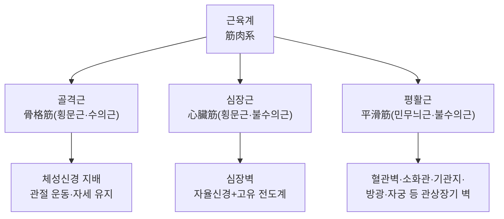
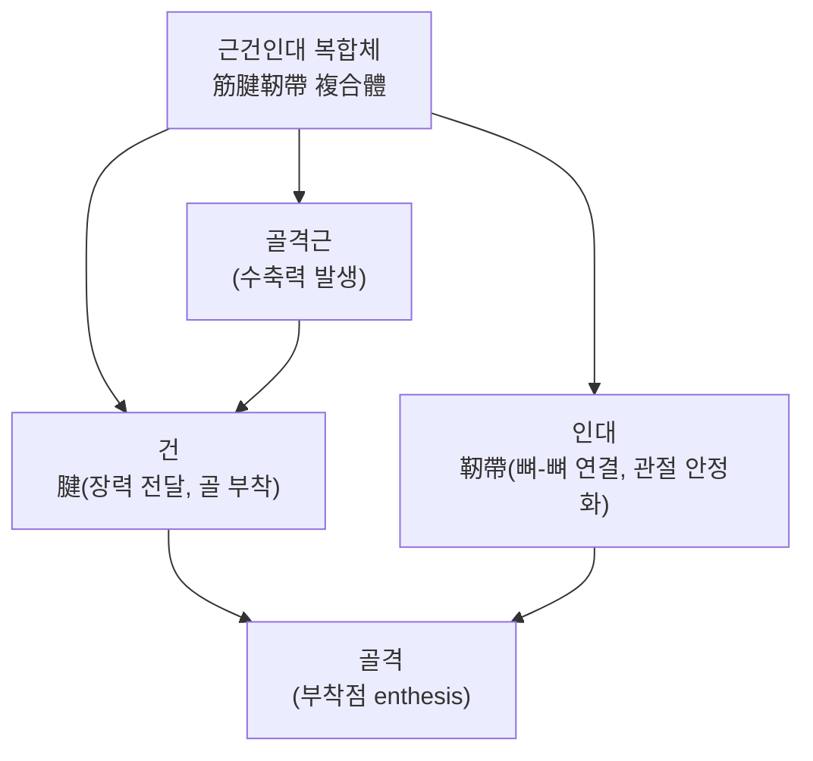
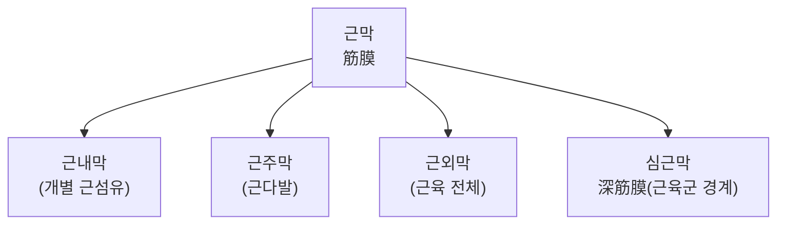
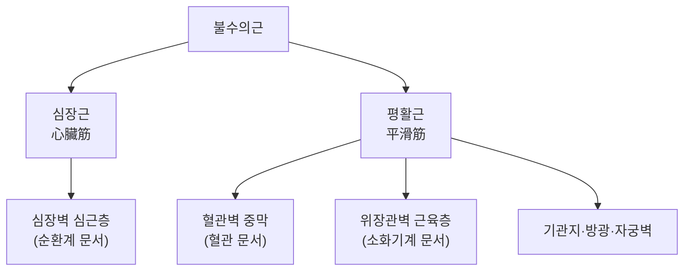

# 근육계(筋肉系, Muscular System)

근육계(筋肉系, muscular system)는 수축성 조직을 통해 신체의 운동·순환·소화 등 다양한 기능을 담당하는 계통으로, 조직학적으로 골격근(骨格筋, skeletal muscle)·심장근(心臟筋, cardiac muscle)·평활근(平滑筋, smooth muscle)의 세 유형으로 구성된다[교과서적 근거]. 근육(筋肉, Muscle) 문서가 침구·추나 임상에 직결되는 골격근·건(腱)·인대(靭帶)의 육안 해부학적 각론과 경근(經筋) 이론을 상세히 다루었다면, 이 문서는 그보다 상위의 계통적 관점에서 세 근육 유형이 어떻게 구분되고, 골격근·건·인대가 어떻게 하나의 근골격계(筋骨格系, musculoskeletal system)로 통합되며, 한의학의 오체(五體)·경근 이론이 이 통합을 어떻게 개념화하는지를 개관한다. 개별 골격근의 기시·정지·작용, 건·인대의 구조·병태생리, 자침 안전성의 상세 각론은 근육(筋肉)·건(腱)·인대(靭帶) 문서에서 이미 다루었으므로, 이 문서는 그 내용을 반복하지 않고 계통 전체의 통합적 조망과 텍스트 교차 참조에 집중한다.

## 제1편 총론

### 1. 근육계의 3대 유형

| 유형 | 형태·수의성 | 분포 | 신경 지배 | 대표 기능 |
|---|---|---|---|---|
| 골격근(骨格筋, skeletal muscle) | 횡문근, 수의근(隨意筋) | 골격에 부착 | 체성신경(운동신경) | 관절 운동, 자세 유지, 열 생산 |
| 심장근(心臟筋, cardiac muscle) | 횡문근, 불수의근(不隨意筋) | 심장벽 | 자율신경(조절), 심장 고유 전도계(발생) | 심장 박동, 혈액 박출 |
| 평활근(平滑筋, smooth muscle) | 무늬 없는 근, 불수의근 | 혈관벽·소화관·기관지·방광·자궁 등 관상·낭상 장기 벽 | 자율신경(교감·부교감) | 관강 장기의 연동 운동, 혈관 긴장도 조절 |

> 이 표는 근육 조직의 표준 분류를 정리한 것이며, 각 유형의 미세구조(근절·개재판·방추형 세포 등)는 조직학 폴더의 근조직(筋組織) 문서에서 상세히 다룬다.

세 유형 모두 액틴(actin)-미오신(myosin) 필라멘트의 활주(滑走)를 이용해 수축력을 발생시킨다는 공통 분자기전을 공유하지만, 골격근은 근절(筋節, sarcomere)의 규칙적 배열로 강한 힘을 신속히 발생시키고, 심장근은 개재판(介在板, intercalated disc)을 통한 세포 간 전기적 연결로 동기화된 수축을 만들며, 평활근은 근절 구조 없이 밀도체(dense body)를 매개로 느리지만 지속적인 수축을 유지한다는 점에서 기능적으로 분화되어 있다[교과서적 근거].

세 유형의 위치 관계·혈관·신경 지배도 그 기능적 분화와 맞물려 뚜렷이 구분된다. 골격근은 뼈에 인접해 건을 매개로 부착하며, 각 골격근군은 고유의 영양동맥(근육 이름을 딴 근동맥 가지, 예: 상완이두근의 상완동맥 가지)과 정맥·림프관을 동반하는 신경혈관다발(神經血管束, neurovascular bundle)을 이루어 근막 사이 공간(fascial plane)을 따라 주행한다[교과서적 근거]. 심장근은 관상동맥(冠狀動脈, coronary artery)이 유일한 혈액 공급원이며 좌우 관상동맥 어느 쪽이든 폐색되면 곧바로 심근경색(心筋梗塞, myocardial infarction)으로 이어진다는 점에서 골격근의 측부순환(側副循環, collateral circulation) 의존도와 대비된다[교과서적 근거]. 평활근은 지배하는 장기벽에 분포하는 혈관(예: 상장간막동맥·하장간막동맥이 소화관 평활근을) 자체로부터 국소적으로 영양을 공급받는다[교과서적 근거]. 신경 지배 측면에서 골격근은 체성운동신경의 종말이 이루는 신경근접합부(神經筋接合部, neuromuscular junction)를 촉지할 수는 없지만, 그 지배 신경의 주행 경로(예: 요골신경구를 지나는 요골신경)는 임상적으로 중요한 표면·심부 지표가 된다[교과서적 근거]. 임상 상관 용어로는 골격근의 근육 파열·근막통증증후군(myofascial pain syndrome), 심장근의 심근경색·부정맥(不整脈, arrhythmia), 평활근의 장폐색(腸閉塞)·혈관 연축(血管攣縮, vasospasm) 등이 각 근육 유형에 특이적인 병태로 제시된다[교과서적 근거].

### 2. 발생학적 기원 개요

세 근육 유형은 모두 중배엽(中胚葉, mesoderm)에서 기원하지만 경로가 다르다. 골격근은 체절(體節, somite)의 근절(筋節, myotome)에서 유래하고, 심장근은 심장중배엽(cardiogenic mesoderm)에서, 평활근은 대부분 내장중배엽(splanchnic mesoderm, 소화관·혈관 평활근)에서 분화한다[교과서적 근거]. 안면부 일부 골격근(저작근·안면표정근)은 예외적으로 신경능(神經稜, neural crest)이 아닌 두부 중배엽에서 기원하는 것으로 알려져 있다[교과서적 근거].

### 3. 근수축의 공통 기전과 계통적 조절

세 근육 유형 모두 근형질세망(筋形質細網, sarcoplasmic reticulum)에서 방출되는 칼슘 이온이 수축의 방아쇠 역할을 한다는 공통점을 갖지만, 골격근은 체성운동신경의 활동전위에 전적으로 의존하는 반면 심장근·평활근은 자체 박동성(심장근의 동방결절 등 고유 전도계) 또는 자율신경·호르몬의 조절을 받아 불수의적으로 작동한다는 차이가 있다[교과서적 근거]. 이 차이는 침구 임상에서 특히 중요한데, 골격근의 긴장도(경직·구축)는 체성신경계를 매개로 한 자침·전침의 직접적 조절 대상이 되는 반면, 평활근(위장관 연동운동)·심장근(심박변이도)의 조절은 자율신경계를 매개로 한 간접적 경로를 통해 이루어진다는 점이 임상 기전 해석의 출발점이 된다(제4편에서 상술).

## 제2편 근골격계 통합 개관

### 1. 근건인대(筋腱靭帶) 복합체 — 골격근·건·인대의 기능적 통합

골격근은 단독으로 작용하지 않고, 근육의 수축력을 뼈로 전달하는 건(腱, tendon), 뼈와 뼈 사이를 연결해 관절을 안정화하는 인대(靭帶, ligament)와 함께 하나의 기능적 단위 — 근건인대 복합체(筋腱靭帶 複合體, musculotendinous-ligamentous complex) — 를 이루어 관절 운동과 안정성을 동시에 구현한다[교과서적 근거]. 이 복합체의 조직학적 구성(교원섬유 배열·건부착부enthesis 구조)과 개별 근육·건·인대의 육안 해부학적 각론은 근육(筋肉)·건(腱)·인대(靭帶) 문서에서 이미 상세히 다루었으며, 회전근개(回轉筋蓋)가 근육(수축력 발생)·건(장력 전달)·관절낭인대(수동적 제한)의 삼중 협동으로 견관절의 동적 안정성을 유지하는 사례가 이 통합의 대표 예로 제시된 바 있다. 이 문서에서는 이러한 개별 각론을 반복하지 않고, "근육계"라는 상위 계통이 골격근뿐 아니라 그 부속 결합조직(건·인대·근막)까지 포괄하는 넓은 개념으로 이해되어야 한다는 계통적 관점을 강조한다.

이 복합체는 위치적으로 관절을 사이에 두고 근육(근복筋腹)이 근위부, 건이 관절에 가까운 원위부에 배치되며, 인대는 관절낭 안팎에서 뼈와 뼈를 직접 연결한다는 배치상의 차이를 갖는다[교과서적 근거]. 혈액 공급은 근복은 분절 동맥가지가 풍부하게 분포하는 반면, 건·인대는 상대적으로 혈관 분포가 적은 저혈류 조직(hypovascular tissue)이어서 손상 후 치유가 느리다는 것이 임상적으로 중요한 차이로 지적된다[교과서적 근거]. 신경 지배 역시 근복은 체성운동신경이 직접 지배해 수의적 수축을 일으키지만, 건·인대에는 운동신경 대신 골지건기관(Golgi tendon organ)·기계수용기(mechanoreceptor) 등 감각 수용기가 풍부해 장력·관절 위치를 중추신경계에 피드백하는 고유수용감각(固有受容感覺, proprioception)의 주요 발신처로 기능한다[교과서적 근거]. 촉지 가능한 표면 지표로는 아킬레스건·슬개건·상완이두근건처럼 피하에서 직접 만져지는 대형 건이 대표적이며, 이들은 건염(腱炎, tendinitis)·건병증(腱病症, tendinopathy)의 촉진 부위로도 활용된다[교과서적 근거]. 임상 상관 용어로는 근파열(筋破裂, muscle strain, 등급 Grade I~III)·건파열(腱破裂, tendon rupture, 예: 아킬레스건 파열)·인대 염좌(靭帶 捻挫, ligament sprain) 등이 있으며, 이 세 병태는 손상 조직이 근육·건·인대 중 어디인지에 따라 치유 기간·재활 전략이 달라진다는 점이 근건인대 복합체 개념의 임상적 함의다[교과서적 근거].

### 2. 근막(筋膜)의 계통적 역할

근막(筋膜, fascia)은 개별 근섬유(근내막)·근다발(근주막)·근육 전체(근외막)를 감싸는 결합조직 층으로, 인접한 근육들을 연결해 힘을 전달하는 근막경선(筋膜經線, myofascial meridian)의 해부학적 기반이 되기도 한다[교과서적 근거]. 근막의 미세구조와 조직학적 특성은 조직학 폴더 결합조직 문서에서, 경락과의 상관 가설은 한방생리학 문서에서 텍스트로 교차 참조하며 다루어지는 주제이므로, 이 문서에서는 근막이 골격근·건·인대와 함께 근골격계의 결합조직 연속체를 이룬다는 계통적 위치만을 개관한다.

근막은 위치적으로 피부밑 피하지방층과 근육 사이의 천근막(淺筋膜)과, 개별 근육·근육군을 둘러싸 근구획(筋區劃, muscle compartment)을 형성하는 심근막(深筋膜)으로 나뉘며, 이 근구획 경계를 따라 혈관·신경이 함께 주행하는 경우가 많아 근막 사이 공간이 임상적으로 자침·주사 경로의 지표로 활용된다[교과서적 근거]. 근막 자체는 상대적으로 혈관·신경 분포가 적은 조직이지만, 통각 수용기(nociceptor)와 기계수용기가 풍부하게 분포해 근막성 통증(筋膜性 痛症)의 발생원으로 다루어진다[교과서적 근거]. 촉지 가능한 표면 지표로는 장경인대(腸脛靭帶, iliotibial band, 대퇴근막의 비후부)·흉요근막(胸腰筋膜, thoracolumbar fascia)이 대표적이며, 임상 상관 용어로는 근막통증증후군의 발통점(trigger point)·구획증후군(區劃症候群, compartment syndrome, 근막으로 둘러싸인 구획 내 압력 상승에 의한 응급 병태)이 있다[교과서적 근거].

### 3. 평활근·심장근의 계통적 위치 — 순환계·소화기계와의 접점

근육계를 골격근에 국한하지 않고 세 유형 모두를 포괄하는 계통으로 이해하면, 평활근·심장근은 순환계(循環系)·소화기계(消化器系) 문서에서 다루는 개별 장기(혈관·심장·위장관)의 벽 구조 일부로도 위치한다. 혈관벽의 중막(中膜)을 이루는 혈관평활근은 혈관(血管, Blood Vessel) 문서에서, 심장벽의 심근층은 순환계 문서의 심장(心臟) 항목에서 각각 다루어지는 내용과 겹치므로, 이 문서는 그 세부 구조를 반복하지 않고 "근육계"라는 계통이 운동기관(골격근)뿐 아니라 순환·소화 기능을 담당하는 불수의근까지 포괄한다는 사실을 계통 분류의 관점에서 명시하는 데 집중한다. 침구가 골격근의 수의적 긴장도뿐 아니라 자율신경계를 매개로 위장관 평활근의 연동운동에도 영향을 미칠 수 있다는 근거는 제4편에서 다룬다.

위치적으로 심장근은 심낭(心囊, pericardium)에 둘러싸인 심장벽 중간층(심근층)을 이루며 앞으로 흉골, 좌우로 폐와 인접하고, 위장관 평활근은 점막하층과 장막층 사이에서 내윤상근(內輪狀筋)·외종주근(外縱走筋)의 이중 층을 이루어 연동운동을 일으킨다[교과서적 근거]. 혈관 평활근은 혈관벽 중막에서 동심원상으로 배열되어 혈관 직경(따라서 말초저항)을 조절한다[교과서적 근거]. 신경 지배는 심장근이 교감신경(심박수·수축력 증가)과 부교감신경(미주신경, 심박수 감소)의 이중 지배를 받고, 위장관 평활근은 장관 내 고유의 장신경계(腸神經系, enteric nervous system)와 자율신경계의 이중 조절을 받는다는 점이 골격근의 단일 체성신경 지배와 대비된다[교과서적 근거]. 임상 상관 용어로는 심장근의 협심증(狹心症)·심근경색, 혈관평활근의 고혈압·혈관연축, 위장관 평활근의 장폐색·과민성 대장 증후군(IBS)·위마비(胃麻痺, gastroparesis) 등이 있으며, 이들은 골격근 병리(근력저하·경직)와는 임상적으로 구분되는 불수의근 특이적 병태로 다루어진다[교과서적 근거].

## 제3편 한의학적 상관

### 1. 오체(五體) 이론에서 근육계의 위치

한의학의 오체(五體) 이론은 인체의 연부 구조를 피(皮)·맥(脈)·기육(肌肉)·근(筋)·골(骨)의 다섯 층으로 나누고 이를 각각 폐(肺)·심(心)·비(脾)·간(肝)·신(腎)이 주관한다고 본다[교과서적 근거]. 이 분류에서 기육(肌肉)은 비주기육(脾主肌肉) 이론에 따라 비(脾)가 주관하는 대상으로, 근육의 양적 충실함(비만·수척)과 관련되며, 근(筋)은 간주근(肝主筋) 이론에 따라 간(肝)이 주관하는 대상으로 근력·긴장도·관절 안정성과 관련된다[교과서적 근거]. 현대 해부학의 골격근이 오체 이론에서는 기육(비 주관)과 근(간 주관)이라는 두 축에 걸쳐 있다는 점은, 근육(筋肉) 문서에서 상세히 논증한 "근(筋)이 골격근·건·인대를 포괄하는 넓은 개념"이라는 논의와 함께, 한의학이 근육 조직을 단일한 장부의 배타적 관할로 보지 않고 기육의 양적 측면(비)과 근의 기능적 측면(간)으로 나누어 이해했음을 보여준다.

### 2. 12경근(十二經筋)의 계통적 총론

12경근(十二經筋)은 12경맥(十二經脈)과 이름을 같이하되 오장육부에 직접 속락(屬絡)하지 않고, 사지 말단에서 시작해 관절에서 결취(結聚)한 뒤 몸통으로 향하는 독자적인 체계로 기술된다[교과서적 근거]. 경근은 기육·근·건·인대를 아우르는 근골격계 전체의 분포도로 기능하며, 개별 경근의 순행 경로와 골격근 분포의 대응, 경근침법(經筋鍼法)의 임상 근거는 근육(筋肉) 문서에서 상세히 논증하였다. 이 문서에서는 12경근이 "근육계 전체의 경락적 지도(地圖)"라는 계통적 위상을 갖는다는 점, 그리고 경근의 병증(근육통·관절 구축·강직·마비)이 골격근·건·인대 중 어느 하나의 병리로 국한되지 않고 근건인대 복합체 전반의 기능 이상을 반영한다는 통합적 관점을 강조한다.

### 3. 간주근(肝主筋) 이론의 계통적 재확인

간주근(肝主筋) 이론은 간(肝)의 혈(血)이 근(筋)을 자양(滋養)하여 정상적인 근력·유연성·관절 운동을 유지한다고 본다[교과서적 근거]. 근육(筋肉) 문서에서 이미 이 이론이 골격근의 근력·긴장도뿐 아니라 건·인대의 장력 유지와 관절 안정성까지 포괄하는 넓은 임상 영역을 설명한다고 논증한 바 있다. 이 문서에서는 이 논의를 반복하지 않되, 근감소증(筋減少症, sarcopenia)·뇌졸중 후 경직(痙直, spasticity)과 같이 "근육계 전체"의 기능 저하 또는 과항진을 다루는 임상 문제에서 간주근 이론이 어떻게 적용되는지를 제4편에서 근거와 함께 다룬다.

## 제4편 임상 적용과 안전성

### 1. 근감소증(筋減少症, Sarcopenia)에 대한 근거

근감소증은 노화·만성질환에 따라 골격근량과 근력이 전신적으로 감소하는 상태로, 근육계 계통 전체의 쇠퇴를 대표하는 병태다. 한약·침·기공과 같은 전통 의학적 치료를 현대 의학과 통합하는 것이 근육량·근력·삶의 질 개선에 효과적일 수 있다는 문헌 고찰[^1], 기공(氣功) 운동과 한약 처방이 근감소증 고령자의 악력·신체 기능 개선에 긍정적 영향을 미칠 수 있다는 체계적 고찰[^2]이 있다. 침 치료가 근육량 증가·악력 및 보행 속도 개선·C-반응성 단백질 감소에 유의미한 효과가 있다는 메타분석[^4], 침 치료와 팔단금(八段錦, Baduanjin) 운동 병행이 단독 치료보다 근육량 증가·신체 기능 개선에 더 효과적이었다는 무작위 대조 시험[^5]도 있다. 유지 혈액투석을 받는 근감소증 환자에게 8주간 전침 치료를 시행한 결과 보행 속도·악력·골격근 질량 지수가 유의하게 개선되었다는 연구[^7]는 만성 신질환이라는 전신 질환의 맥락에서도 근육계 전체의 쇠퇴에 침구가 관여할 수 있음을 시사한다. 근감소증 고령자에 대한 침 치료의 유효성·안전성을 검증하는 체계적 고찰 프로토콜[^3], 표준 운동 요법과 전침 병행 효과를 검증하는 평가자 맹검 무작위 대조 시험 프로토콜[^6]도 등록되어 있다. 근감소증의 병태생리에서 만성 저강도 염증과 미토콘드리아 기능 장애가 핵심 역할을 한다는 문헌 고찰[^8]은 침구의 항염증 기전(근육 문서에서 다룬 근막통증증후군의 항염증 반응과 유사한 축)이 근감소증에도 적용될 수 있는 이론적 근거를 제공한다.

> 이 서술은 근감소증에 대한 침구 근거가 축적되고 있음을 보여주는 것이지, 저항 운동·단백질 섭취라는 표준 관리 원칙을 침구가 대체할 수 있다는 근거는 아니다. 근감소증은 전신적 노쇠(frailty)의 한 축이므로, 변증(비허·간신휴손 등)에 따른 개별화된 접근과 표준 운동·영양 관리를 병행하는 것이 근거에 부합한다.

### 2. 뇌졸중 후 근경직(痙直, Spasticity)에 대한 근거

뇌졸중 후 상하지 경직은 골격근의 신근-굴근 균형이 무너져 과긴장이 지속되는 상태로, 근육계 계통 중 신경 조절 이상에 의한 병태를 대표한다. 신근과 굴근의 균형을 맞추는 침법이 일반 침 치료보다 근력·근긴장도·ROM 개선에 효과적이었다는 임상시험[^9], 대응점 및 중심축 취혈을 재활 훈련과 병행하는 것이 일반 침 치료나 단순 재활보다 근긴장도 완화와 임상경련척도(CSS) 개선에 더 효과적이었다는 연구[^10], 길항근과 주동근을 동시에 전침 자극하는 것이 길항근 단독 자극보다 운동 기능 회복에 더 효과적이었다는 연구[^11]가 있다. 운동상상(運動想像)과 침 치료를 결합한 '운동상상침법'이 초기 이완성 마비 환자의 근긴장도 회복에 더 효과적이었다는 연구[^12], 진시(辰時, 오전 7~9시) 복부 뜸 치료가 하지 경직 환자의 운동 기능·경직도 개선에 효과적이었다는 연구[^13]는 시간대·자극 부위의 정교화가 경직 관리에 반영된 사례다. 특정 혈위(합곡·외관)를 표적으로 한 혈위 건침과 일반 건침을 비교하는 임상시험[^14], 건침과 정적 스트레칭 병행이 족저굴곡근 경직에 미치는 효과를 평가하는 연구[^15], 길항침법이 경직 감소뿐 아니라 근육 구조(두께·섬유 길이)의 회복과도 연관된다는 연구[^16]는 침구가 근긴장도라는 기능적 지표뿐 아니라 근육의 구조적 지표에도 영향을 줄 수 있음을 시사한다. 두피침과 운동 재활을 동시에 적용하는 '동시 적용 두피침(MSSA)'이 단독·순차 치료보다 경직 감소·운동 기능 개선에 효과적이었다는 메타분석[^17], 자락부항이 상완이두근의 적분근전도(iEMG) 감소와 함께 경직도·운동 기능을 개선했다는 연구[^18], 자락관법과 발관요법이 상지 경직 완화에 도움이 되었다는 연구[^19], 두침 치료를 체침·현대적 재활에 추가하는 것이 근력·일상생활 수행능력 개선에 더 효과적이었다는 연구[^20]도 있다.

> 이 표는 임상 틀이지 동일 근거수준의 권고가 아니다. 경직 관리에서 "길항근-주동근 균형"이라는 원칙은 다양한 침법(길항침법·운동상상침법·전침)으로 구현되지만, 경직의 중증도·이환 시기(급성기·만성기)에 따라 반응이 다를 수 있으므로 획일적인 프로토콜 적용보다 개별 환자의 브룬스트롬 단계·MAS 점수에 따른 접근이 필요하다.

### 3. 평활근 기능(위장관 운동)에 대한 침구 근거 — 불수의근 조절의 예

근육계가 골격근에 국한되지 않는다는 계통적 관점을 뒷받침하는 대표적 임상 영역이 위장관 평활근 조절이다. 사관혈(四關穴, 합곡合谷, LI4·태충太衝, LR3) 자침이 가속화된 위장관 운동 상태에서 운동성을 유의하게 감소시켰다는 무작위 가짜침 대조 교차 시험[^21], 족삼리(足三里, ST36) 자침이 하부식도괄약근의 휴지기압을 유의하게 감소시켰다는 연구[^27]는 사지 말단의 경혈 자극이 원위부 소화관 평활근의 긴장도에 영향을 줄 수 있음을 보여주는 인간 대상 근거다. 대장암 수술 후 전침 병행이 위장관 운동 회복(첫 방귀·배변 시간 단축)에 기여하는지 평가하는 무작위 대조 시험 프로토콜[^23], 전신경화증 환자의 위장관 운동이상증에 지압·경피전침이 증상 완화에 긍정적 영향을 줄 수 있다는 체계적 고찰[^24], 수술 후 회복 과정에서 침·지압이 위장관 운동 개선·오심·구토·통증 완화에 효과적이라는 체계적 고찰[^25]도 있다. 기능성 소화불량 환자에게 시행한 침 치료가 뇌의 기능적 연결성(뇌-장 축)을 정상화하여 위장관 증상을 개선한다는 안정상태 기능적 자기공명영상(fcMRI) 연구[^26]는 평활근 조절이 단순 국소 반사가 아니라 중추신경계 수준의 뇌-장 축 조절을 매개할 수 있음을 시사한다. 간경변증 환자의 위장관 운동저하에 전침 치료가 모틸륨 투여보다 효과적이었다는 연구[^28], 전침 치료가 기능성 소화불량·변비·과민성 대장 증후군 등 다양한 기능성 위장관 질환에 효과적일 수 있다는 문헌 고찰[^29], 위암 근치적 절제술 후 저주파 전침이 첫 방귀 배출 시간을 단축시켰다는 연구[^30], 패혈증 위장관 기능 장애 환자에서 경피전침자극이 경장 영양 이행·내약성을 개선했다는 다기관 무작위 대조 시험[^31]도 있다. 중환자실 환자에서 침 치료가 통증·진정제 의존도·섬망·근쇠약을 줄이고 위장관 운동성을 개선하는 다계통 조절 효과를 갖는다는 문헌 고찰[^32]은 골격근(근쇠약)과 평활근(위장관 운동)이라는 서로 다른 근육 유형에 침구가 동시에 관여할 수 있음을 보여주는 사례로 주목할 만하다. 결장직장암 복강경 수술 후 이침이 위장관 운동 회복과 통증 감소에 기여했다는 관찰연구[^33], 위절제술 후 침·지압·경피전기자극이 위장관 운동성을 유의하게 개선한다는 메타분석[^34]도 있다.

> 이 서술은 침구가 골격근뿐 아니라 자율신경계를 매개로 평활근에도 조절 효과를 가질 수 있음을 보여주는 것이지, 위장관 운동 이상의 기질적 원인(폐색·종양 등)을 배제하지 않고 관행적으로 침구만 시행해도 된다는 근거는 아니다. 수술 후 회복이나 기능성 질환의 보조 요법으로 위치시키는 것이 근거 수준에 맞는 해석이다.

### 4. 안전성 표

| 위험 요소 | 내용 | 참고 |
|---|---|---|
| 근감소증 고령자의 자침 | 피하지방·근육량 감소로 상대적 자입 심도 변화, 멍·출혈 경향 | 체구성 변화 고려한 자입 깊이 조절[교과서적 근거] |
| 뇌졸중 경직 환자의 강한 신전 수기·과도한 전침 자극 | 급성기 과도한 자극이 오히려 경직을 악화시킬 이론적 가능성 | 브룬스트롬 단계·MAS 점수에 따른 자극 강도 조절[^9][^17] |
| 복부 자침(위장관 운동 조절 목적) | 장관 천공 등 드문 합병증 이론적 가능성(특히 복부 수술력 있는 환자) | 해부학적 깊이 숙지, 수술력 확인 후 시행[교과서적 근거] |
| 만성 신질환자(혈액투석)의 자침 | 출혈 경향(항응고제 병용), 감염 위험(투석 접근로 인접 부위 회피) | 투석 스케줄·항응고제 확인 후 시행[^7] |
| 중환자실 환자 자침 | 다발성 카테터·모니터링 장치와의 간섭, 면역저하 감염 위험 | 중환자 관리팀과 협진, 무균 술기 강화[^32] |

> 이 표는 임상 틀이지 동일 근거수준의 권고가 아니다. 개별 환자의 전신 상태·기저질환·수술력에 따라 위험도가 달라지므로 시술 전 개별 평가가 필요하다.

### 5. 추적 지표표

| 영역 | 추적 지표 |
|---|---|
| 골격근량·근력 | 악력, 사지 골격근량 지수(ASM/height²), 보행 속도, 도수근력검사(MMT) |
| 근긴장도(경직) | Modified Ashworth Scale(MAS), 임상경련척도(CSS), 표면 근전도(sEMG) |
| 근육 구조 | 근골격계 초음파(두께·섬유 길이), 근생검(연구 목적) |
| 평활근 기능(위장관) | 첫 방귀·배변 시간, 위전정 운동성, 하부식도괄약근압 |
| 전신 염증·대사 | C-반응성 단백질(CRP), 인터루킨(IL-6 등) |

> 이 지표들은 근육계 병리의 변화를 비침습적으로 추적하는 참고 지표이지, 변증 없이 관행적으로 적용해도 되는 정형화된 검사 프로토콜은 아니다.

### 6. 환자 설명용 요약

> 근육계는 우리 몸을 움직이게 하는 골격근뿐 아니라, 심장을 뛰게 하고 음식물을 소화관을 따라 이동시키는 근육까지 모두 포함하는 계통입니다. 한의학에서는 이를 기육(肌肉, 양적인 근육)과 근(筋, 근력·유연성)으로 나누어 각각 비(脾)와 간(肝)이 주관한다고 봅니다. 나이가 들며 전신 근육량과 근력이 줄어드는 근감소증, 뇌졸중 이후 나타나는 근육 경직은 모두 이 근육계 전체의 문제이며, 침구 치료는 저항 운동·재활 훈련과 함께 병행할 때 근력·기능 회복에 도움이 될 수 있습니다. 또한 침 치료가 사지의 경혈을 통해 위장관처럼 우리가 의식적으로 조절할 수 없는 근육(평활근)의 움직임에도 영향을 줄 수 있다는 것이 여러 연구를 통해 확인되고 있습니다.

## 제5편 Q&A

**Q1. 근육계 문서와 근육(筋肉) 문서는 어떤 차이가 있는가?**

근육(筋肉) 문서는 침구·추나 임상에 직결되는 골격근 개별 근육의 기시·정지·작용과 건·인대 각론, 경근 이론의 상세 논증에 집중한 각론 문서다. 이 근육계 문서는 골격근·심장근·평활근이라는 세 근육 유형 전체를 아우르는 상위 계통의 조망으로, 근건인대 복합체의 통합적 관점과 근감소증·경직·위장관 운동처럼 근육계 전체에 걸친 임상 문제를 다룬다.

**Q2. 한의학에서 "근육"을 주관하는 장부는 간(肝)인가 비(脾)인가?**

둘 다 관여한다. 오체(五體) 이론에서 근육의 양적 충실함(살집)은 비(脾)가 주관하는 기육(肌肉)에 해당하고, 근력·긴장도·관절 안정성은 간(肝)이 주관하는 근(筋)에 해당한다. 따라서 근감소증처럼 근육량 자체가 줄어드는 문제는 비허(脾虛) 변증과, 경직·구축처럼 긴장도 이상이 두드러지는 문제는 간(肝) 관련 변증과 더 밀접하게 연관지어 해석되는 경향이 있다.

**Q3. 침 치료가 위장관 운동처럼 내 의지로 조절할 수 없는 근육에도 영향을 주는가?**

그렇다는 근거가 있다. 사관혈 자침이 위장관 운동성을 조절했다는 연구[^21], 족삼리 자침이 하부식도괄약근압을 낮췄다는 연구[^27]가 대표적이다. 이는 자율신경계를 매개로 한 간접적 조절로 해석되며, 골격근에 대한 체성신경 매개의 직접적 조절과는 기전이 다르다.

**Q4. 근감소증에 침구가 근력 운동을 대체할 수 있는가?**

아니다. 침구·기공이 근육량·근력 개선에 보조적 근거가 있으나[^2][^4][^5], 저항 운동(레지스턴스 트레이닝)과 충분한 단백질 섭취가 근감소증 관리의 표준 원칙이다. 침구는 이를 보완하는 병행 요법으로 위치해야 한다.

**Q5. 뇌졸중 후 경직에는 어떤 침법이 가장 근거가 확실한가?**

단일 침법이 우월하다고 단정하기는 어렵다. 길항근-주동근 균형 침법[^9][^11], 운동상상침법[^12], 두피침 병행(MSSA)[^17] 등 여러 접근이 각각의 연구에서 유의한 개선을 보고했으나, 직접 비교한 대규모 연구는 제한적이다. 경직의 중증도·이환 시기에 따라 개별화된 선택이 필요하다.

**Q6. 근육계 질환에서 근육 구조(초음파상 두께·섬유 길이)까지 침구로 변화시킬 수 있는가?**

일부 연구에서 그런 가능성이 제시되었다. 길항침법이 경직 감소뿐 아니라 근육 구조(두께·섬유 길이) 회복과도 연관되었다는 연구[^16]가 있으나, 이는 단일 연구 수준의 소견이므로 향후 반복 검증이 필요하다.

**고전 인용 출처**: 『黃帝內經素問』(五藏生成篇, 痿論, 六節藏象論, 陰陽應象大論), 『靈樞』(經筋, 九鍼論), 『難經』.

**문헌 데이터 출처**: [한의학 논문 데이터베이스 (med.symbolicinfo.com)](https://med.symbolicinfo.com) — 2026-08-25 조회 기준.

[^1]: Exploring the role of traditional Chinese medicine in sarcopenia: mechanisms and therapeutic advances. Jianjun Yao 외. _Frontiers in Pharmacology_. 2025-06-30. [문헌 고찰] [DOI 10.3389/fphar.2025.1541373](https://doi.org/10.3389/fphar.2025.1541373) — 한약·침·기공 통합 치료가 근감소증의 근육량·근력·삶의 질 개선에 효과적임을 시사.
[^2]: Traditional Chinese Medicine and Sarcopenia: A Systematic Review.. Guo CY 외. _Frontiers in aging neuroscience_. 2022. [체계적 고찰, 1330명] [DOI 10.3389/fnagi.2022.872233](https://doi.org/10.3389/fnagi.2022.872233) [PMID 35645784](https://pubmed.ncbi.nlm.nih.gov/35645784/) — 기공 운동과 한약 처방이 근감소증 고령자의 악력·신체 기능 개선에 긍정적.
[^3]: Efficacy and safety of acupuncture for sarcopenia in older adults: protocol for a systematic review and meta-analysis.. Xiang Y 외. _BMJ open_. 2025-10-21. [체계적 고찰] [DOI 10.1136/bmjopen-2025-108639](https://doi.org/10.1136/bmjopen-2025-108639) [PMID 41125262](https://pubmed.ncbi.nlm.nih.gov/41125262/) — 고령자 근감소증에 대한 침 치료의 유효성·안전성을 평가하는 프로토콜.
[^4]: The potential of acupuncture in treating sarcopenia: a systematic review and meta-analysis of randomized controlled trials.. Niu X 외. _Frontiers in public health_. 2025. [메타분석] [DOI 10.3389/fpubh.2025.1696030](https://doi.org/10.3389/fpubh.2025.1696030) [PMID 41293592](https://pubmed.ncbi.nlm.nih.gov/41293592/) — 침 치료가 근육량·악력·보행 속도 개선, CRP 감소에 유의미한 효과.
[^5]: Effects of acupuncture combined with Baduanjin on muscle mass, strength, and quality of life in older adults with sarcopenia: A randomized controlled trial.. Ji W 외. _Journal of back and musculoskeletal rehabilitation_. 2026-05. [임상시험, 105명] [DOI 10.1177/10538127261415998](https://doi.org/10.1177/10538127261415998) [PMID 41569985](https://pubmed.ncbi.nlm.nih.gov/41569985/) — 침 치료와 팔단금 병행이 단독 치료보다 근육량·신체 기능 개선에 더 효과적.
[^6]: Electroacupuncture Plus Exercise for Sarcopenia in Older Adults: Protocol for a Randomized, Controlled, Assessor-Blinded Trial.. Wu W 외. _Clinical interventions in aging_. 2025. [임상시험, 122명] [DOI 10.2147/CIA.S545035](https://doi.org/10.2147/CIA.S545035) [PMID 41164821](https://pubmed.ncbi.nlm.nih.gov/41164821/) — 표준 운동과 전침 병행이 운동 단독보다 근육량·신체 기능 개선에 효과적인지 평가하는 프로토콜.
[^7]: Electroacupuncture Treatment on Sarcopenia in Patients Undergoing Maintenance Haemodialysis: An Effective Therapy.. Chen R 외. _Journal of cachexia, sarcopenia and muscle_. 2026-08. [임상시험, 36명] [DOI 10.1002/jcsm.70345](https://doi.org/10.1002/jcsm.70345) [PMID 42473028](https://pubmed.ncbi.nlm.nih.gov/42473028/) — 8주 전침 치료 후 혈액투석 환자의 보행 속도·악력·골격근 질량 지수 유의 개선.
[^8]: Mitochondrial Inflammation and Muscle Aging: Targeting the Inflammatory Microenvironment in Sarcopenic Muscle.. Wang X 외. _Aging and disease_. 2026-08-03. [문헌 고찰] [DOI 10.14336/AD.2026.0331](https://doi.org/10.14336/AD.2026.0331) [PMID 42579356](https://pubmed.ncbi.nlm.nih.gov/42579356/) — 만성 저강도 염증과 미토콘드리아 기능 장애가 근감소증 병태생리의 핵심.
[^9]: [Clinical evaluation on balanced muscular tension needling method for improving disabled function of stroke patients with spastic paralysis].. Lou BD 외. _Zhongguo zhen jiu = Chinese acupuncture & moxibustion_. 2010-02. [임상시험, 106명] [PMID 20214061](https://pubmed.ncbi.nlm.nih.gov/20214061/) — 신근-굴근 균형 침법이 일반 침 치료보다 근력·근긴장도·ROM 개선에 효과적.
[^10]: [Effects of acupuncture on different acupoints in combination with rehabilitation on hemiplegic muscle spasticity in hemiplegia patients].. Lu JY 외. _Zhongguo zhen jiu = Chinese acupuncture & moxibustion_. 2010-07. [임상시험, 90명] [PMID 20862934](https://pubmed.ncbi.nlm.nih.gov/20862934/) — 대응점·중심축 침치료와 재활 병행이 일반 침치료·단순 재활보다 근긴장도 완화·CSS 점수 개선에 더 효과적.
[^11]: [Effect of electroacupuncture at antagonistic muscle and agonistic muscle on motor function in patients with upper-extremity spasticity after stroke].. Zhang JB 외. _Zhongguo zhen jiu = Chinese acupuncture & moxibustion_. 2022-04-12. [임상시험, 60명] [DOI 10.13703/j.0255-2930.20210406-k0001](https://doi.org/10.13703/j.0255-2930.20210406-k0001) [PMID 35403395](https://pubmed.ncbi.nlm.nih.gov/35403395/) — 길항근·주동근 동시 전침이 길항근 단독보다 운동 기능·일상생활 수행능력 향상.
[^12]: [Superiority of motor imagery acupuncture in improving muscle tension for patients with upper limb hemiplegia of stroke in early stage].. Wang HQ 외. _Zhongguo zhen jiu = Chinese acupuncture & moxibustion_. 2021-10-12. [임상시험, 64명] [DOI 10.13703/j.0255-2930.20200915-0002](https://doi.org/10.13703/j.0255-2930.20200915-0002) [PMID 34628736](https://pubmed.ncbi.nlm.nih.gov/34628736/) — 운동상상침법이 초기 이완성 마비 환자의 근긴장도 회복·운동 기능 개선에 더 효과적.
[^13]: [Impact of abdominal moxibustion in a period of day from 7 am to 9 am on improvement in post-stroke lower limb spasticity and muscle architecture parameter].. Lin ZH 외. _Zhongguo zhen jiu = Chinese acupuncture & moxibustion_. 2020-10-12. [임상시험, 100명] [DOI 10.13703/j.0255-2930.20190904-k0001](https://doi.org/10.13703/j.0255-2930.20190904-k0001) [PMID 33068343](https://pubmed.ncbi.nlm.nih.gov/33068343/) — 진시 복부 뜸 병행이 하지 경직 운동 기능·경직도 개선에 더 효과적.
[^14]: A Clinical Trial Protocol to Compare the Effect of Dry Needling and Acupoint Dry Needling on Wrist Flexor Spasticity after Stroke.. Nazari N 외. _Journal of acupuncture and meridian studies_. 2022-08-31. [임상시험, 24명] [DOI 10.51507/j.jams.2022.15.4.273](https://doi.org/10.51507/j.jams.2022.15.4.273) [PMID 36521776](https://pubmed.ncbi.nlm.nih.gov/36521776/) — 혈위 표적 건침과 일반 근육내 건침의 손목 경직 완화 효과를 비교하는 프로토콜.
[^15]: Effect of Dry Needling Plus Static Stretching on Plantar Flexors Spasticity in Chronic Stroke Patients.. Esmaeeli M 외. _Journal of acupuncture and meridian studies_. 2024-08-31. [임상시험, 28명] [DOI 10.51507/j.jams.2024.17.4.141](https://doi.org/10.51507/j.jams.2024.17.4.141) [PMID 39205617](https://pubmed.ncbi.nlm.nih.gov/39205617/) — 건침과 정적 스트레칭 병행이 만성 뇌졸중 환자의 족저굴곡근 경직에 미치는 효과를 평가.
[^16]: [Clinical efficacy of antagonistic needling therapy on post-stroke lower limb spasticity and its effect on muscle morphology].. Yu T 외. _Zhongguo zhen jiu = Chinese acupuncture & moxibustion_. 2025-02-12. [임상시험, 100명] [DOI 10.13703/j.0255-2930.20240411-k0001](https://doi.org/10.13703/j.0255-2930.20240411-k0001) [PMID 39943751](https://pubmed.ncbi.nlm.nih.gov/39943751/) — 길항침법이 경직 감소·운동 기능·근육 구조(두께·섬유 길이) 회복에 더 효과적.
[^17]: Novel efficacy evidence and mechanistic explorations of motion-style scalp acupuncture in post-stroke muscle spasticity management: Systematic review and meta-analysis of randomized controlled trials.. Zhong JS 외. _Neuroscience_. 2025-11-28. [메타분석, 1648명] [DOI 10.1016/j.neuroscience.2025.10.030](https://doi.org/10.1016/j.neuroscience.2025.10.030) [PMID 41135694](https://pubmed.ncbi.nlm.nih.gov/41135694/) — 동시 적용 두피침(MSSA)이 단독·순차 치료보다 경직 감소·운동 기능 개선에 효과적.
[^18]: [Effects of pricking and cupping combined with rehabilitation training on elbow flexion spasticity of upper limb after stroke and its IEMG value].. Huang Z 외. _Zhongguo zhen jiu = Chinese acupuncture & moxibustion_. 2018-02-12. [임상시험, 60명] [DOI 10.13703/j.0255-2930.2018.02.002](https://doi.org/10.13703/j.0255-2930.2018.02.002) [PMID 29473352](https://pubmed.ncbi.nlm.nih.gov/29473352/) — 자락부항 병행이 약물 단독보다 ROM·경직도·상완이두근 IEMG 개선.
[^19]: [Blood-letting and cupping therapy for upper limb spasticity in recovery phase of stroke].. Xi M 외. _Zhongguo zhen jiu = Chinese acupuncture & moxibustion_. 2018-11-12. [임상시험, 60명] [DOI 10.13703/j.0255-2930.2018.11.002](https://doi.org/10.13703/j.0255-2930.2018.11.002) [PMID 30672193](https://pubmed.ncbi.nlm.nih.gov/30672193/) — 자락관법·발관요법 병행이 상지 경직 완화·운동 기능 회복에 더 효과적.
[^20]: Clinical observation of acupuncture combined with modern rehabilitation in the treatment of limb motor dysfunction after ischemic stroke: A randomized controlled trial.. Xie H 외. _Medicine_. 2022-11-11. [임상시험, 90명] [DOI 10.1097/MD.0000000000031703](https://doi.org/10.1097/MD.0000000000031703) [PMID 36397362](https://pubmed.ncbi.nlm.nih.gov/36397362/) — 두침 추가가 체침·재활 병행보다 근력·일상생활 수행능력 개선에 더 효과적.
[^21]: Effect of Siguan Acupuncture on Gastrointestinal Motility: A Randomized, Sham-Controlled, Crossover Trial. Kyung-Min Shin 외. _Evidence-Based Complementary and Alternative Medicine_. 2013. [임상시험, 21명] [DOI 10.1155/2013/918392](https://doi.org/10.1155/2013/918392) — 사관혈(합곡·태충(LR3)) 침 치료가 가속화된 위장관 운동성을 유의하게 감소.
[^23]: Efficacy of electro-acupuncture for gastrointestinal motility after colorectal cancer surgery: study protocol for a randomized controlled trial. yixuan Feng 외. 2020-01-24. [임상시험, 160명] [DOI 10.21203/rs.2.21821/v1](https://doi.org/10.21203/rs.2.21821/v1) — 대장암 수술 후 전침 병행이 위장관 운동 회복에 기여하는지 평가하는 프로토콜.
[^24]: Acupuncture-based modalities: novel alternative approaches in the treatment of gastrointestinal dysmotility in patients with systemic sclerosis.. Sallam HS 외. _Explore (New York, N.Y.)_. 2026-08-14. [체계적 고찰] [DOI 10.1016/j.explore.2013.10.001](https://doi.org/10.1016/j.explore.2013.10.001) [PMID 24439095](https://pubmed.ncbi.nlm.nih.gov/24439095/) — 지압·경피전침이 전신경화증 위장관 운동이상증 개선에 긍정적 영향 가능성.
[^25]: Naturopathic Treatment and Complementary Medicine in Surgical Practice.. Lederer AK 외. _Deutsches Arzteblatt international_. 2018-12-07. [체계적 고찰] [DOI 10.3238/arztebl.2018.0815](https://doi.org/10.3238/arztebl.2018.0815) [PMID 30678751](https://pubmed.ncbi.nlm.nih.gov/30678751/) — 수술 후 침·지압이 위장관 운동 개선·오심·구토·통증 완화에 효과적.
[^26]: Brain-Gut Axis Modulation of Acupuncture in Functional Dyspepsia: A Preliminary Resting-State fcMRI Study.. Fang J 외. _Evidence-based complementary and alternative medicine : eCAM_. 2015. [임상시험, 18명] [DOI 10.1155/2015/860463](https://doi.org/10.1155/2015/860463) [PMID 26649064](https://pubmed.ncbi.nlm.nih.gov/26649064/) — 침 치료가 뇌의 기능적 연결성을 정상화하여 기능성 소화불량의 위장관 증상을 개선함을 시사.
[^27]: Changes in Esophageal Motility after Acupuncture.. Vieira FM 외. _Journal of gastrointestinal surgery_. 2017-08. [임상시험, 16명] [DOI 10.1007/s11605-017-3464-4](https://doi.org/10.1007/s11605-017-3464-4) [PMID 28589298](https://pubmed.ncbi.nlm.nih.gov/28589298/) — 족삼리 자극이 하부식도괄약근의 휴지기압을 유의하게 감소.
[^28]: [Efficacy controlled observation on acupuncture and western medicine for gastrointestinal dysmotility in liver cirrhosis].. Deng JJ 외. _Zhongguo zhen jiu = Chinese acupuncture & moxibustion_. 2013-05. [임상시험, 40명] [PMID 23885607](https://pubmed.ncbi.nlm.nih.gov/23885607/) — 전침 치료가 모틸륨보다 간경변증 환자의 위장관 운동저하 개선에 효과적.
[^29]: Electroacupuncture treatments for gut motility disorders.. Chen JDZ 외. _Neurogastroenterology and motility_. 2018-07. [문헌 고찰] [DOI 10.1111/nmo.13393](https://doi.org/10.1111/nmo.13393) [PMID 29906324](https://pubmed.ncbi.nlm.nih.gov/29906324/) — 전침이 기능성 소화불량·변비·과민성 대장 증후군 등에 효과적일 수 있음.
[^30]: [Effect of low-frequency electrical acupoint stimulation on gastrointestinal motility function following radical gastrectomy in patients with gastric cancer].. He D 외. _Zhen ci yan jiu = Acupuncture research_. 2020-01-25. [임상시험, 177명] [DOI 10.13702/j.1000-0607.1901256](https://doi.org/10.13702/j.1000-0607.1901256) [PMID 32144909](https://pubmed.ncbi.nlm.nih.gov/32144909/) — 저주파 전침 병행이 위암 수술 후 첫 방귀 배출 시간을 유의하게 단축.
[^31]: [Transcutaneous electrical acupoint stimulation for early enteral nutrition tolerance in patients with sepsis of gastrointestinal dysfunction: a multi-center randomized controlled trial].. Liu H 외. _Zhongguo zhen jiu = Chinese acupuncture & moxibustion_. 2020-03-12. [임상시험, 49명] [DOI 10.13703/j.0255-2930.20190426-0003](https://doi.org/10.13703/j.0255-2930.20190426-0003) [PMID 32270631](https://pubmed.ncbi.nlm.nih.gov/32270631/) — 경피전침자극이 패혈증 위장관 기능 장애 환자의 경장 영양 이행·내약성을 개선.
[^32]: Acupuncture for ICU patients: evidence, mechanisms, and implementation challenges.. Li P 외. _Frontiers in neurology_. 2025. [문헌 고찰] [DOI 10.3389/fneur.2025.1711600](https://doi.org/10.3389/fneur.2025.1711600) [PMID 41551320](https://pubmed.ncbi.nlm.nih.gov/41551320/) — 침 치료가 중환자실 환자의 통증·진정제 의존도·섬망·근쇠약·위장관 운동성에 다계통 조절 효과.
[^33]: Retrospective Analysis of the Effect of Auricular Acupuncture on Pain and Gastrointestinal Motility Recovery After Laparoscopic Surgery for Colorectal Cancer. Xiaofan Li 외. _Proceedings of Anticancer Research_. 2023-05-30. [관찰연구, 76명] [DOI 10.26689/par.v7i3.4982](https://doi.org/10.26689/par.v7i3.4982) — 이침 치료가 결장직장암 수술 후 위장관 운동 회복·통증 감소에 기여.
[^34]: Effect of Acupoint Stimulation on Improving Gastrointestinal Motility in Patients After Gastrectomy: A Systematic Review and Meta-Analysis.. Cheng YL 외. _Journal of integrative and complementary medicine_. 2023-11. [메타분석, 785명] [DOI 10.1089/jicm.2022.0752](https://doi.org/10.1089/jicm.2022.0752) [PMID 37379490](https://pubmed.ncbi.nlm.nih.gov/37379490/) — 침·지압·경피전기자극이 위절제술 후 위장관 운동성을 유의하게 개선.
