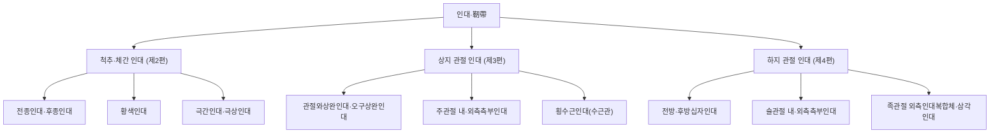
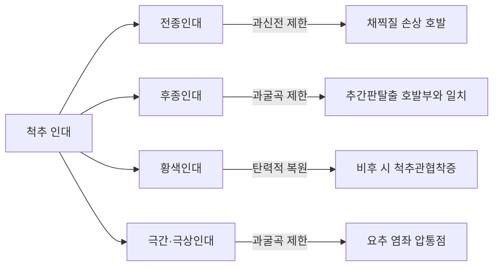
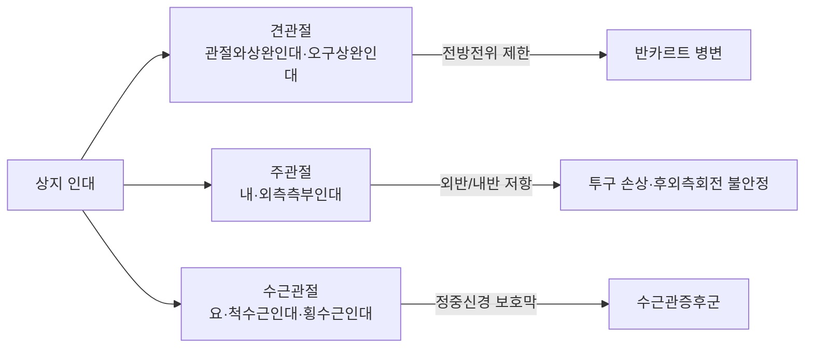
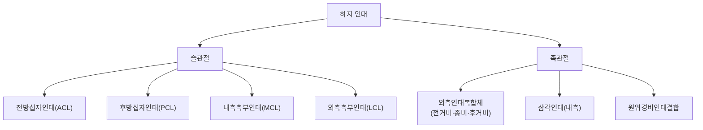

# 인대(靭帶, Ligament)

인대(靭帶, ligament)는 뼈와 뼈를 직접 연결하여 관절을 안정시키는 치밀결합조직(緻密結合組織, dense connective tissue) 구조물이다. 힘줄(건, 腱, tendon)이 근육을 뼈에 연결해 힘을 전달하는 구조라면, 인대는 근육의 개입 없이 뼈와 뼈 사이를 직접 이어 관절의 정상 가동범위를 벗어난 과도한 움직임을 물리적으로 제한하는 역할을 한다[교과서적 근거]. 두 조직 모두 교원섬유(콜라겐 섬유)를 주성분으로 하는 규칙치밀결합조직(規則緻密結合組織, dense regular connective tissue)에 속하지만, 힘줄은 근육의 수축 방향과 정확히 일치하는 단일 축 방향으로 섬유가 평행하게 배열되어 장력 전달에 최적화된 반면, 인대는 관절이 여러 방향으로 움직이는 동안에도 뼈와 뼈 사이의 결속을 유지해야 하므로 교원섬유 다발이 여러 각도로 교차·배열되는 다방향적 구조를 갖는다는 점에서 뚜렷이 구별된다[교과서적 근거]. 이 문서는 인대라는 조직 자체의 해부학적 구조, 부위별 주요 인대, 손상·재생의 병리, 그리고 한의학적 치료(침구·추나·본초 외치)와의 접점을 임상가의 관점에서 정리한다.

## 목차

- 제1편 총론 — 인대의 정의와 미세구조, 그리고 「근주속골이리기관(筋主束骨而利機關)」의 재조명
- 제2편 척추·체간 주요 인대 해부
- 제3편 상지 관절 주요 인대 해부
- 제4편 하지 관절 주요 인대 해부
- 제5편 인대의 병리 — 염좌·손상·재생과 만성 불안정성
- 제6편 임상 적용 — 침구·추나·프롤로테라피와 인대
- 제7편 Q&A와 고전 인용 출처

## 제1편 총론

### 0. 인대 분류 개념도

다음 개념도는 이 문서가 다루는 척추·상지·하지 주요 인대를 부위별로 정리한 것이다[교과서적 근거].

### 1. 인대의 정의와 힘줄·근육과의 구분

인대는 관절낭(關節囊, joint capsule)의 국소적 비후(肥厚)이거나 관절낭과 별도로 존재하는 섬유성 띠(band) 또는 판(sheet) 구조로, 뼈의 골막(骨膜, periosteum)이나 뼈 표면에 직접 부착(附着, insertion)되어 관절을 이루는 두 뼈를 서로 묶어준다[교과서적 근거]. 조직학적으로 인대는 교원섬유(주로 I형 콜라겐)와 소량의 탄력섬유(elastic fiber, 특히 척추의 황색인대에 풍부), 그리고 그 사이에 배열된 섬유아세포(纖維芽細胞) 유사 세포인 인대세포(靭帶細胞, ligamentocyte)로 구성된다[교과서적 근거]. 이 구조는 결합조직(結合組織, connective tissue) 중에서도 세포외기질(細胞外基質)의 비중이 압도적으로 높은 규칙치밀결합조직에 해당하며, 힘줄과 조직학적으로 매우 유사하지만 기능적으로는 명확히 구분된다.

힘줄은 근육의 수축력을 뼈로 전달하는 "능동적" 매개체로서 근섬유 방향과 정확히 일치하는 평행 배열을 취하는 반면, 인대는 근육의 개입이 전혀 없는 "수동적" 관절 안정화 구조물로서 여러 방향에서 가해지는 힘에 저항하도록 섬유가 사선(斜線)·교차(交叉) 방향으로 배열된다는 점이 핵심 차이다[교과서적 근거]. 임상적으로 이 구분은 매우 중요한데, 힘줄 손상(건병증·건염)은 대개 반복적인 근수축·과사용과 관련되는 반면, 인대 손상(염좌)은 관절이 정상 가동범위를 벗어나는 순간적인 외력(비틀림·과신전·과굴곡)에 의해 발생한다는 손상 기전의 차이로 이어진다.

### 2. 「근주속골이리기관(筋主束骨而利機關)」 원문의 재조명 — 인대의 관절 안정화 기능과의 개념적 부합

한의학의 오체(五體) 이론에서 근(筋)은 간(肝)이 주관하는 신체 구성 조직으로 배속되며, 전통적으로 근의 병리는 근위(筋痿)·근급(筋急)과 같이 골격근의 수축·이완 이상, 즉 현대 해부학의 골격근(骨格筋, skeletal muscle) 기능과 연결지어 해석되어 왔다. 그러나 『황제내경·소문(黃帝內經·素問)·위론(痿論)』의 원문을 정밀히 읽으면, 근(筋)이라는 개념이 단순히 수축·이완하는 골격근만을 가리키는 것이 아니라 관절을 결속(結束)하는 결합조직 전반—오늘날의 힘줄과 인대를 포괄하는 더 넓은 범주—을 함께 지칭하고 있음을 확인할 수 있다.

『소문·위론』은 "阳明者, 五藏六府之海, 主闰宗筋, 宗筋主束骨而利机关也"라 하여, 종근(宗筋)이 "뼈를 묶어(束骨) 관절을 이롭게 한다(利機關)"고 명시하였다[교과서적 근거]. 여기서 "속골(束骨)"이라는 표현은 문자 그대로 "뼈와 뼈를 묶는다"는 뜻으로, 이는 근육이 수축을 통해 관절을 움직이는 능동적 기능이라기보다,**뼈와 뼈 사이를 물리적으로 결속하여 관절의 형태와 안정성을 유지하는 기능**을 서술한 것으로 읽는 것이 해부학적으로 더 정확하다. 근육(골격근)의 본질적 기능은 수축을 통한 "운동의 발생"이지 "뼈의 결속"이 아니다. 반면 인대의 본질적 기능은 정확히 "뼈와 뼈 사이의 결속을 통한 관절 안정화"이며, 근육의 개입 없이 오직 결합조직 자체의 장력만으로 골 사이의 상대적 위치를 제한한다. 따라서 "속골이리기관"이라는 원문의 표현은 근육보다 인대의 해부학적 역할에 더 정확히, 그리고 더 직접적으로 대응한다고 볼 수 있다.

이러한 관점은 『소문·오장생성편(五藏生成篇)』의 "諸筋者皆屬於節(모든 근은 관절에 속한다)"이라는 서술과도 정합적이다. 골격근의 힘줄 부착부는 대개 관절을 사이에 두고 서로 다른 뼈에 부착하지만, 근 자체(근육의 몸통, 근복筋腹)는 관절 자체에 존재하지 않는다. 반면 인대는 그 자체가 관절 부위에 위치하며 관절낭과 직접 연속되어 있다는 점에서, "근이 모두 관절에 속한다(皆屬於節)"는 서술은 관절 주변에 실제로 위치하는 인대·관절낭 구조에 더 부합하는 해부학적 사실이다[교과서적 근거].

정리하면, 한의학의 근(筋)이라는 단일 범주는 현대 해부학의 세 가지 서로 다른 조직—① 능동적으로 수축하는 골격근, ② 근육의 힘을 뼈에 전달하는 힘줄, ③ 뼈와 뼈를 직접 결속하는 인대—를 포괄하는 더 넓은 개념이다. 그중에서도 "속골이리기관(束骨而利機關)"이라는 표현이 서술하는 기능—뼈를 묶어 관절을 원활하게 한다—은 세 조직 중 인대의 기능에 가장 근접한 서술이다. 이는 한의학의 근 이론이 부정확한 것이 아니라, 오히려 고대의 관찰이 결합조직 전반(근·건·인대)의 통합적 기능을 하나의 범주로 직관적으로 포착했음을 보여주는 사례로 이해할 수 있다. 임상적으로 이 관점은 관절 부위의 급성 통증·불안정(염좌·탈구 성향)을 다룰 때 "근을 다스린다"는 치법이 단순히 근육 이완만이 아니라 인대·관절낭 등 관절 주변 결합조직 전반의 기능 회복을 목표로 해야 함을 시사한다.

### 3. 인대의 미세구조 — 다방향 교원섬유 배열과 건과의 차이

인대의 교원섬유는 힘줄처럼 완전히 평행한 단일 방향 배열을 취하지 않고, 다양한 각도로 교차하며 그물망(net-like) 또는 층상(層狀, laminar) 구조를 형성한다[교과서적 근거]. 예를 들어 슬관절 전방십자인대(前方十字靭帶, anterior cruciate ligament, ACL)는 육안으로는 단일 구조물처럼 보이지만, 실제로는 전내측(anteromedial) 다발과 후외측(posterolateral) 다발이 서로 다른 각도로 배열되어 굴곡·신전 각도에 따라 각기 다른 다발이 주로 장력을 부담하는 정교한 다방향 구조를 이룬다[교과서적 근거]. 이러한 다방향 배열은 인대가 단일 평면의 힘뿐 아니라 회전력·전단력(shear force) 등 복합적인 방향의 외력에 저항해야 하는 관절 안정화 기능과 직접 연관된다.

인대의 부착부(附着部, enthesis)는 뼈와의 경계에서 섬유연골(纖維軟骨, fibrocartilage)로 이행하는 4개 층(인대 본체 → 섬유연골 → 석회화 섬유연골 → 뼈)의 점진적 구조를 취하는데, 이는 탄성계수(彈性係數)가 크게 다른 연조직(인대)과 경조직(뼈) 사이의 응력 집중을 완화하는 생체역학적 적응이다[교과서적 근거]. 이 부착부 구조는 힘줄-뼈 부착부와 조직학적으로 유사하나, 인대는 근육과 연속되지 않으므로 부착부가 관절의 양쪽 뼈 모두에 존재한다는 점이 특징이다.

## 제2편 척추·체간 주요 인대 해부

척추는 추체(椎體)·추간판·후관절이 여러 인대에 의해 종적(longitudinal)·분절적(segmental)으로 결속되어 안정성을 유지한다.

### 4. 전종인대(前縱靭帶, anterior longitudinal ligament)와 후종인대(後縱靭帶, posterior longitudinal ligament)

전종인대는 추체(椎體) 및 추간판의 전면 골막에 폭넓게 부착하며 두개저(頭蓋底) 전결절에서 천골(薦骨) 전면까지 종주하는 척추 인대 중 가장 강한 인대로, 추체 사이의 과신전(過伸展)을 제한하는 두꺼운 섬유성 띠이며, 채찍질 손상(whiplash injury)이나 과신전 외상 시 손상되기 쉽다[교과서적 근거]. 전종인대의 감각 신경 지배는 척추동맥신경총(vertebral nerve plexus) 및 각 분절의 척수신경 회귀분지(sinuvertebral nerve, recurrent meningeal nerve)가 담당하며, 인접한 추체 골막과 강하게 유착되어 있어 추체 전방부 골극(osteophyte) 형성과 인대 골화가 함께 진행되는 경우가 흔하다(전종인대 골화증, OPLL과 대비되는 OALL). 후종인대는 추체의 후면(척추관 쪽)을 따라 주행하며 과굴곡(過屈曲)을 제한하는데, 전종인대보다 폭이 좁고 추간판 부위에서 특히 얇아지는 구조적 취약점이 있어 추간판 탈출증(herniated intervertebral disc)이 발생하기 쉬운 부위와 해부학적으로 일치한다[교과서적 근거]. 후종인대 역시 회귀수막신경(recurrent meningeal nerve, sinuvertebral nerve)의 지배를 받으며, 이 신경이 통증 감각을 전달하기 때문에 후종인대 자체의 손상·염증도 요통·경항통의 통증원(pain generator)이 될 수 있다. 후종인대 골화증(ossification of the posterior longitudinal ligament, OPLL)은 경추부에서 척수병증(myelopathy)을 유발할 수 있는 중요한 감별 대상이다. 편타성 손상(whiplash) 환자의 경추 시상면 정렬(sagittal alignment)을 CT로 분석한 관찰연구는 목 기울기(neck tilt)와 흉곽 입구 각도(thoracic inlet angle)가 낮은 환자군에서 비회복률(nonrecovery rate)이 유의하게 높았음을 보고하여, 경추부 인대·관절 복합체의 구조적 정렬이 편타성 손상 후 예후에 영향을 미치는 요인임을 시사했다[^1].

### 5. 황색인대(黃色靭帶, ligamentum flavum)

황색인대는 상위 추궁판(椎弓板)의 전하연에서 기시하여 하위 추궁판의 후상연에 정지하며 좌우 한 쌍이 극돌기 기저부에서 정중선을 향해 거의 맞닿는 형태로 척추관 후벽의 일부를 이루는 인대로, 탄력섬유(elastin) 함량이 60~80%에 이를 만큼 매우 높아 전형적인 백색 인대와 달리 황색을 띠며, 신전 시 늘어나고 굴곡 시 원래 길이로 되돌아오는 탄성적 특성을 갖는다[교과서적 근거]. 감각 지배는 척수신경 후지(dorsal ramus)의 내측지가 담당하며, 별도의 자체 혈관 분포는 빈약하여 주변 후관절낭·경막외 지방조직의 혈관에 의존한다. 황색인대는 후관절낭(facet joint capsule)과 함께 척추관 후방 경계를 형성하므로, 후관절 퇴행성 변화(관절병증)와 황색인대 비후가 동반되어 척추관 협착증의 복합적 병리를 이루는 경우가 많다. 이 탄성 덕분에 척추가 굴곡할 때 황색인대가 척추관 내로 접혀 들어가지 않고 팽팽하게 유지되지만, 노화·반복적 기계적 스트레스에 의해 섬유화·비후(肥厚)가 진행되면 척추관 협착증(spinal stenosis)의 핵심 병리 기전이 된다. 대식세포유주억제인자(macrophage migration inhibitory factor, MIF)가 Src 신호전달 경로를 통해 황색인대 세포의 증식과 콜라겐·MMP13 발현을 촉진하여 요추 황색인대 비후를 유발하는 핵심 인자로 작용함을 보고한 실험연구는 인간 황색인대 조직에서 MIF 농도가 협착증 환자군에서 유의하게 높았음을 확인했다[^2]. 인간 퇴행성 추간판·황색인대 유래 전구세포(progenitor cell)를 대상으로 IL-1β·IL-19·IL-20이 골분화·지방분화 방향을 상반되게 조절함을 보고한 실험연구는 황색인대 비후의 세포생물학적 기전에 사이토카인 신호가 관여함을 보여주었다[^3].

전침(電鍼, electroacupuncture)이 염증성 사이토카인(TNF-α·IL-1β·IL-6 감소, IL-10 증가)과 NF-κB·JAK/STAT·MAPK 신호경로 억제를 통해 황색인대 비후를 완화할 수 있다는 기전적 가능성을 정리한 문헌 고찰은 요추관 협착증의 비수술적 관리에서 전침의 잠재적 역할을 제시했다[^4]. 도침(導鍼, acupotomy) 요법이 요추관 협착증 환자의 통증(VAS)과 기능(JOA score)을 개선하며 특히 요추 견인 치료보다 우수한 효과를 보였다는 체계적 고찰·메타분석[^5]과, CT 유도하 침도(needle knife)로 황색인대를 경피적으로 절개하여 척추관 협착증 증상을 개선한 증례 보고[^6]는 황색인대라는 구조물을 직접 표적한 최소침습적 한의학 치료 접근의 임상적 근거를 보여준다.

이 표는 임상 틀이지 동일 근거수준의 권고가 아니다.

| 인대 | 주행 | 주요 제한 운동 | 임상적 의의 |
|---|---|---|---|
| 전종인대 | 추체 전면, 두개저~천골 | 과신전 제한 | 채찍질 손상 시 파열 위험 |
| 후종인대 | 추체 후면, 척추관 내 | 과굴곡 제한 | 폭 좁은 부위에서 추간판탈출 호발 |
| 황색인대 | 추궁판 사이 | 굴곡 시 탄력적 복원 | 비후 시 척추관 협착증 |
| 극간인대·극상인대 | 극돌기 사이·첨단 | 과굴곡 제한 | 요추 염좌 시 압통점 |

### 6. 극간인대(棘間靭帶)·극상인대(棘上靭帶)와 요추 염좌

극간인대는 인접한 극돌기(棘突起) 사이의 공간을 채우며 상위 극돌기 하연에서 하위 극돌기 상연에 걸쳐 부착하고, 극상인대는 각 극돌기의 첨단을 연결하며 표층에서 경추부의 항인대(項靭帶, ligamentum nuchae)와 연속된다. 두 인대 모두 과도한 척추 굴곡을 제한하며, 척수신경 후지의 지배를 받는다[교과서적 근거]. 극간인대는 요추부에서 가장 발달되어 있고 굴곡 시 가장 먼저 긴장되는 인대이므로, 요추 굴곡 손상 시 초기에 손상되는 구조물로 임상적으로 중요하다. 임상에서 흔히 접하는 "급성 요추 염좌(急性腰椎捻挫, acute lumbar sprain)"는 근막·근육뿐 아니라 이들 극간·극상 인대 및 후관절낭의 미세 손상을 포함하는 경우가 많다. 요통점(腰痛點)·아시혈(阿是穴) 자침과 요추 운동을 병행한 치료가 약물 단독 치료보다 유효율(96.2% 대 75.0%)이 높았다는 임상시험[^7], 경락을 따른 자침이 마사지·서양의학적 치료 병행군보다 통증(VAS)·기능(RMDQ)·염증 지표(TNF-α·IL-6)를 유의하게 개선했다는 임상시험[^8], 원위 취혈(요통점·후계·위중·승산·수구) 침 치료를 마사지에 병행한 무작위대조시험[^9], 완안침(腕踝鍼, wrist-ankle acupuncture)이 급성 요추 염좌에 효과적·안전하다는 체계적 고찰·네트워크 메타분석[^10]은 요추부 인대·근막 복합체 손상에 대한 침구 치료의 인간 대상 근거를 뒷받침한다. 응급실 환경에서 급성 요통·발목 염좌·편두통 환자에게 침 치료를 진통 목적으로 적용하는 프로토콜 연구들[^11][^12]은 인대 손상을 포함한 급성 근골격계 통증에 침구가 응급의학적 맥락에서도 보조적 진통 수단으로 고려되고 있음을 보여준다.

## 제3편 상지 관절 주요 인대 해부

### 7. 견관절(肩關節) 인대·관절와순 복합체

견관절은 관절와(關節窩)가 얕고 상완골두(上腕骨頭)가 크다는 골성 불안정성을 관절와순(關節窩脣, glenoid labrum)·관절와상완인대(盂肱靭帶, glenohumeral ligament, 상·중·하 세 갈래)·오구상완인대(烏喙上腕靭帶, coracohumeral ligament)·회전근개(回轉筋蓋)라는 연부조직 복합체로 보완하는 대표적 관절이다[교과서적 근거]. 관절와상완인대는 관절와순의 전방·전하방 가장자리에서 기시하여 상완골 해부경(anatomical neck) 및 소결절 부근에 부착하며, 상완신경총(brachial plexus)의 관절 분지와 액와신경의 감각 가지가 분포하고, 견갑회선동맥(circumflex scapular artery)·전상완회선동맥(anterior circumflex humeral artery)의 분지가 혈류를 공급한다. 오구상완인대는 오구돌기 외측연에서 상완골 대·소결절 사이(결절간구 상부)에 걸쳐 부착하여 상완이두근 장두건을 결절간구 안에 고정하는 지붕 역할도 겸한다. 특히 하방 관절와상완인대(inferior glenohumeral ligament complex)는 외전·외회전 자세에서 상완골두의 전방 전위를 막는 핵심 정적 안정 구조로, 이 인대와 관절와순의 손상(반카르트 병변, Bankart lesion)은 재발성 견관절 전방 탈구의 주된 병리다.

과다이완성(hyperlaxity)을 동반한 견관절 불안정성 환자에 대한 문헌 고찰은 견갑골 주위 근육 강화와 감각운동 조절에 집중한 물리치료가 유망한 비수술적 1차 치료이며, 수술이 필요한 경우 관절낭의 과잉과 관절와순 손상을 함께 해결하는 관절경적 전관절낭 이동술(capsular shift)·중첩술(capsulorrhaphy)이 효과적인 벤치마크로 보고됨을 정리했다[^13]. 회전근개 질환 환자에서 침 치료를 받은 군의 견봉성형술(acromioplasty) 시행률이 대조군보다 유의하게 낮았다는(위험비 0.264) 성향점수 매칭 코호트 연구는 견관절 주변 결합조직 문제에 대한 보존적 한의학 치료가 수술 이행을 늦추는 데 기여할 가능성을 시사한다[^14].

### 8. 주관절(肘關節) 측부인대

주관절은 내측측부인대(內側側副靭帶, ulnar collateral ligament, 전방·후방·횡 세 다발로 구성되며 상완골 내측상과에서 기시해 척골 구상돌기 부근에 부착)와 외측측부인대(外側側副靭帶, radial collateral ligament·외측요골측부인대, 상완골 외측상과에서 기시해 요골 윤상인대와 척골에 부착)가 각각 외반(外反, valgus)·내반(內反, varus) 스트레스에 저항하며 관절을 안정시킨다[교과서적 근거]. 두 인대 모두 자체 신경 지배는 뚜렷하지 않으나 인접한 척골신경(내측)·요골신경 심지(외측)의 감각 가지가 분포하며, 척측측부동맥·요측측부동맥의 분지가 혈류를 공급한다. 내측측부인대는 투구 동작과 같은 반복적 외반 스트레스에 만성적으로 노출되는 스포츠 손상의 호발 부위이며(투수 팔꿈치), 인대 바로 내측에 척골신경이 주행하는 주관절 터널(cubital tunnel)이 인접해 있어 인대 손상 시 척골신경병증이 동반될 수 있다. 외측측부인대 복합체(외측요골측부인대 중에서도 외측척골측부인대 성분)의 손상은 후외측 회전 불안정성(posterolateral rotatory instability)으로 이어질 수 있다.

### 9. 수근(手根) 인대와 수근관(手根管)의 횡수근인대

손목에는 요골(橈骨)-척골(尺骨)-수근골(手根骨) 사이를 연결하는 다수의 소형 인대(요수근인대·척수근인대·수근간인대 등)가 있어 수근골 배열을 유지하는데, 이 중 임상적으로 가장 중요한 것은 수근관(手根管, carpal tunnel)의 천장을 이루는 횡수근인대(橫手根靭帶, transverse carpal ligament, 굴근지대flexor retinaculum)다. 이 인대는 요측으로 주상골 결절(scaphoid tubercle)·대능형골 능선(trapezium ridge)에, 척측으로 유구골 갈고리(hook of hamate)·두상골(pisiform)에 걸쳐 부착하여 수근골이 이루는 오목한 아치 위에 지붕을 씌우는 형태로 수근관을 완성한다. 이 인대의 비후·섬유화는 정중신경(正中神經)을 압박하여 수근관증후군(carpal tunnel syndrome)을 유발하는 직접적 병리 구조다[교과서적 근거]. 요수근인대·척수근인대는 각각 요골·척골 원위단에서 기시하여 수근골 근위열(주상골·월상골·삼각골)에 부착하며, 수근골 배열의 정적 안정성을 담당하는 동시에 전완의 요골동맥·척골동맥 종지가 이 인대 주변을 지나 수부 심장(deep palmar arch)·천장(superficial palmar arch)을 형성한다. 초음파 유도하 침도(needle-knife)로 횡수근인대를 절개하는 시술이 경증·중등도 수근관증후군에서 스테로이드 국소주사보다 통증·저림·기능 회복 면에서 더 우수한 임상 결과를 보였다는 무작위대조시험[^15]과, 초음파 유도하 도침(acupotomy)에 혈소판풍부혈장(platelet-rich plasma, PRP)을 병행하는 것이 도침 단독보다 유효율이 높고 합병증이 적었다는 임상시험[^16]은 이 인대를 직접 표적한 한의학적 최소침습 시술의 근거로 축적되고 있다.

이 표는 임상 틀이지 동일 근거수준의 권고가 아니다.

| 부위 | 주요 인대 | 안정화 기능 |
|---|---|---|
| 견관절 | 관절와상완인대(상·중·하), 오구상완인대 | 상완골두 전방·하방 전위 제한 |
| 주관절 | 내측(척골)측부인대, 외측(요골)측부인대 | 외반·내반 스트레스 저항 |
| 수근관절 | 요수근인대, 척수근인대, 횡수근인대 | 수근골 배열 유지, 수근관 천장 형성 |

### 10. 관절 과가동성(過可動性, joint hypermobility)과 상지 인대 이완

일부 환자군에서는 인대 자체의 결합조직 구성 이상(콜라겐 유형 비율 변화 등)으로 여러 관절에서 전반적인 과가동성이 나타난다. 신경발달장애(자폐스펙트럼·주의력결핍과잉행동장애 등)를 가진 성인이 대조군보다 전신관절과가동성(generalized joint hypermobility, GJH)의 유병률이 유의하게 높았으며(오즈비 2.84~4.51), 과가동 관절 수가 자율신경실조증·근골격계 통증과 신경다양성 사이의 관계를 매개했다는 관찰연구는 인대 이완이 단순한 국소 정형외과적 문제를 넘어 전신적 결합조직·자율신경 축과 연관될 수 있음을 보여준다[^17].

## 제4편 하지 관절 주요 인대 해부

임상적으로 인대 손상이 가장 빈발하는 부위는 슬관절과 족관절이다. 이 편은 두 관절의 주요 인대와 그 손상에 대한 재활·한의학적 개입 근거를 중심으로 서술한다.

### 11. 슬관절(膝關節) 인대 — 사(四)대 인대와 재건 후 재활

슬관절은 관절와가 매우 얕은 대신 전방십자인대(前方十字靭帶, anterior cruciate ligament, ACL)·후방십자인대(後方十字靭帶, posterior cruciate ligament, PCL)·내측측부인대(內側側副靭帶, medial collateral ligament, MCL)·외측측부인대(外側側副靭帶, lateral collateral ligament, LCL)라는 네 개의 주요 인대가 관절의 전후·내외 안정성을 각각 분담하는 구조를 갖는다[교과서적 근거]. ACL은 경골의 전방 전위와 회전 불안정을 억제하고, PCL은 경골의 후방 전위를 억제하며, MCL·LCL은 각각 외반·내반 스트레스에 저항한다. PCL은 대퇴골 내과의 외측면(과간와 전상방)에서 기시하여 경골 후과간영역(posterior intercondylar area)에 부착하며, ACL보다 굵고 강하여 파열 빈도는 낮으나 손상 시 후외측 회전 불안정성을 동반하는 경우가 많다. MCL은 대퇴골 내측상과에서 기시해 경골 내측면(거위발건 하방)에 부착하는 표층섬유와 반월판에 직접 연결되는 심층섬유(내측측부인대 심층부, meniscofemoral·meniscotibial ligament)로 이루어져 내측 반월판 손상과 동반되기 쉽고, LCL은 대퇴골 외측상과에서 기시해 비골두에 부착하며 대퇴이두근건과 인접하여 후외측 코너(posterolateral corner) 복합체의 일부를 이룬다. 슬관절 인대는 대부분 자체 감각신경이 빈약한 대신 후관절 지각신경(articular branch of tibial/peroneal nerve)의 분지가 관절낭을 통해 분포하며, 슬관절 동맥환(genicular anastomosis, 상·하 내외측 슬동맥과 중슬동맥)이 인대 주변 혈류를 공급한다.

**내측측부인대(MCL) 손상**은 슬관절 인대 손상 중 빈도가 높은 부위로, 이완침(理完鍼) 치료를 재활 훈련에 병행한 군이 재활 단독군보다 통증(VAS)·기능(Lysholm)·유효율(93.1% 대 71.4%) 모두에서 우수했다는 임상시험[^18]과, 침·한약·추나·고약 등 한방 치료가 MCL 손상에 임상적으로 효과적임을 정리한 체계적 고찰[^19]은 침 치료가 인대 재활 과정의 보조 요법으로 활용될 수 있음을 뒷받침한다.

**전방십자인대(ACL) 재건술 후 재활**은 근거가 가장 방대하게 축적된 인대 관련 재활 영역이다. 전통의학(TCM) 요법을 표준 재활에 병행한 군이 통증·관절가동범위·부종·Lysholm 점수에서 대조군보다 유의한 개선을 보였다는 체계적 고찰·메타분석[^20], 전침(電鍼)을 병행한 군이 통상적 재활 단독군보다 관절가동범위·IKDC·Lysholm 점수에서 우수했다는 임상시험[^21]은 한의학적 개입의 직접적 근거다. 고유수용성감각 훈련의 효과에 대해서는 전체 연구에서는 기능·고유수용성감각 개선이 확인되었으나 고품질 연구로 한정하면 관절가동범위 외에는 뚜렷한 효과가 불확실하다는 체계적 고찰·메타분석[^22]과, 수동적 관절위치감각·홉테스트·주관적 기능 지표는 개선되었으나 능동적 관절위치감각·근력·통증에는 유의한 영향이 없었다는 체계적 고찰·메타분석[^23]이 있어, 고유수용성 훈련의 효과는 근거 수준별로 신중하게 해석해야 한다. 저강도 혈류제한훈련(blood flow restriction training, BFR-RT)이 대퇴사두근 부피와 Lysholm 점수 개선에서 일반 재활보다 우수했다는 메타분석[^24], 가상현실 균형훈련이 IKDC 점수·근력·통증에서 유의한 개선을 보였다는 메타분석[^25], 가상현실 기술 전반이 무릎 기능·보행·근력 회복에 효과적이라는 메타분석[^26]은 디지털·물리치료적 보조 수단의 근거를 보여준다.

ACL 재건술의 수술·재활 통합 전략에 대해서는, 조기 무릎 신전 회복과 대퇴사두근 기능 회복, 움직임의 질에 초점을 맞춘 재활 원칙을 정리한 프레디 푸 팬서 심포지엄 전문가그룹 review[^27], 소아·청소년 ACL 손상 관리에 대한 APKASS 2024 합의문(Part I)[^28], 스포츠 복귀 결정 시 시간 기준이 아닌 임상적·기능적·심리적 다면 평가를 권고하는 APKASS 2024 합의문(Part III)[^29], 엘리트 선수의 스포츠 복귀 촉진을 위한 마사지 기반 재활의 체계적 고찰[^30], 비수술적 ACL 재활 프로토콜의 표준화 부재와 낮은 스포츠 복귀율(30%)·높은 재부상률(28%)을 지적한 범위 문헌고찰[^31], 무릎 관절섬유증(arthrofibrosis) 치료로 마취하 조작술·유착박리술이 가장 흔히 보고됨을 정리한 체계적 고찰[^32]이 있다. 이식건의 이완을 방지하는 중국식 매듭법(Chinese knotting technique)이 조기의 공격적 재활을 가능하게 하여 단기 임상 결과를 개선했다는 관찰연구[^33], 잔존 조직 보존 재건술이 잔존 조직 제거 재건술보다 통증·가동범위·고유수용성감각·기능 점수에서 더 우수했다는 임상시험[^34], 수술 전 5주간의 전신진동운동(whole-body vibration) 사전재활이 대퇴사두근 신경근 기능과 술 후 IKDC 점수를 개선했다는 단일맹검 무작위대조시험[^35], 신경근전기자극(NMES)을 병행한 군이 운동 단독군보다 등속성 근기능·IKDC 점수·균형·근육 단면적에서 더 큰 개선을 보였다는 임상시험[^36], 혈류제한저항훈련(BFR-RT)이 고중량저항훈련(HL-RT)과 유사한 근력 회복 효과를 보이면서 무릎 통증은 더 적었다는 두 건의 영국 NHS 무작위대조시험[^37][^38]은 ACL 재건 후 재활의 최신 근거를 보여준다.

이 표는 임상 틀이지 동일 근거수준의 권고가 아니다.

| 인대 | 제한 운동 | 손상 호발 기전 |
|---|---|---|
| 전방십자인대(ACL) | 경골 전방 전위·회전 억제 | 방향 전환·착지 시 비접촉성 손상 |
| 후방십자인대(PCL) | 경골 후방 전위 억제 | 굴곡위 무릎 전면 강한 타격(대시보드 손상) |
| 내측측부인대(MCL) | 외반 스트레스 저항 | 무릎 외측에서 가해지는 외반력 |
| 외측측부인대(LCL) | 내반 스트레스 저항 | 무릎 내측에서 가해지는 내반력 |

### 12. 족관절(足關節) 외측인대복합체와 급성 발목 염좌

족관절 외측인대복합체는**전거비인대(前距腓靭帶, anterior talofibular ligament, ATFL, 외과 전연에서 기시해 거골 경부 외측면에 부착, 관절낭과 유합된 편평한 띠)**·**종비인대(踵腓靭帶, calcaneofibular ligament, CFL, 외과 첨단에서 기시해 종골 외측면 결절에 부착, 세 인대 중 유일하게 거골하관절을 가로지름)**·**후거비인대(後距腓靭帶, posterior talofibular ligament, PTFL, 외과 내면 오목에서 기시해 거골 후방돌기에 부착, 가장 강하고 손상 빈도가 낮음)**세 갈래로 구성되며, 이 중 ATFL이 족관절 저굴·내번(內飜, inversion) 상태에서 가장 먼저, 가장 흔하게 손상되는 인대다[교과서적 근거]. 발목 염좌의 약 85%가 이 외측인대복합체의 손상이며, 그중에서도 ATFL 단독 손상이 가장 많고, 손상이 심할수록 CFL·PTFL까지 순차적으로 파급된다. 이 세 인대는 비복신경(sural nerve)·표재비골신경(superficial peroneal nerve)의 감각 가지가 분포하며, 전외측 관통동맥(perforating branch of peroneal artery)의 분지가 혈류를 공급한다.

내측에는 삼각인대(三角靭帶, deltoid ligament)가 외번(外飜, eversion)을 억제하는데, 골 구조상 내번보다 외번이 더 강하게 제한되어 있어 내측인대 손상은 외측보다 드물지만 손상 시 더 심각한 경우가 많다[교과서적 근거]. 삼각인대는 내과(內踝, medial malleolus)에서 부채꼴로 기시하여 표층(경주골인대·경종골인대·경거골인대 후부)과 심층(경거골인대 전부)의 두 층으로 나뉘어 각각 주상골·종골·거골에 부착하며, 심층부가 족관절 내측 안정성의 일차적 제한 인자로 알려져 있다. 후경골신경(posterior tibial nerve)의 감각 가지가 삼각인대 심부를 지나 내과 후방 터널을 통과하므로, 심한 삼각인대 손상이나 그 주변 부종은 후경골신경 포착(족근관증후군, tarsal tunnel syndrome)과 감별이 필요하다. 원위 경비인대결합(遠位脛腓靭帶結合, distal tibiofibular syndesticulation, 하이 앵클 스프레인high ankle sprain)의 손상은 회복 기간이 통상적 외측 인대 염좌보다 현저히 길다는 점에서 임상적으로 중요한 감별 대상이다.

**급성 외측 발목 염좌**는 전 세계적으로 가장 흔한 근골격계 손상 중 하나이며, 한의학적 치료 근거가 가장 방대하게 축적된 인대 손상 영역이다. 3도 완전 파열(전거비인대 완전 단열)에 대해 단순 고정보다 조기 가동을 포함한 기능적 치료가 더 빠른 활동 복귀를 가능하게 했다는 무작위대조시험[^39], 급성기·중기·후기 조직 손상 단계에 맞춘 청혈지혈(淸血止血)→활혈거어(活血祛瘀)→조화생신(調和生新) 순서의 중의학 외치 표준 프로토콜을 제시한 전문가 합의문[^40], 상백고(傷柏膏) 외용제가 급성 외측인대 손상 환자의 통증·부종을 유의하게 감소시켰다는 무작위대조시험[^41]은 인대 손상의 조직 회복 단계에 맞춘 단계적 한의학 치료 전략의 근거다.

침구 치료에 대해서는, 회전-견인-포킹(rotating-pulling-poking) 수기법이 보행 속도·보폭·발목 가동범위를 대조군(냉찜질)보다 유의하게 개선했다는 임상시험[^42], 아급성 발목 염좌에 대한 중서의 통합 재활 프로그램의 무작위대조시험 프로토콜[^43], 동근침법(同根鍼法)과 치황소어지통고(止黃消瘀止痛膏) 외용제를 병용한 군이 외용제 단독군보다 유효율(96.77% 대 82.26%)이 높았다는 임상시험[^44], 급성 발목 염좌에 침 치료를 단독 또는 RICE·마사지·중약과 병용했을 때 통증 완화·완치율 향상이 확인된 체계적 고찰·메타분석[^45], 침 치료가 발목 염좌의 전반적 증상 개선에 긍정적 영향을 미칠 수 있으나 개별 연구의 방법론적 질이 낮다고 지적한 체계적 고찰·메타분석[^46], 양릉천(陽陵泉, GB34) 자침이 전자기 치료 단독보다 완치율·총유효율을 높였다는 임상시험[^47], 소절혈(小節穴) 자침과 건조절수법(腱調節手法)을 병용한 군이 부종·통증 감소에서 더 우수했다는 임상시험[^48], 피내침(皮內鍼)과 추나를 병행한 군이 추나 단독군보다 만성 발목 염좌 후유증의 통증 개선에서 더 효과적이었다는 임상시험[^49], 발목 염좌 초기 3일 이내 위자(圍刺, surrounding needling)와 냉압박을 병용한 것이 냉압박 단독보다 효과적이었다는 관찰연구[^50], 적외선 열화상을 기반으로 급성 외측 발목 염좌의 신속한 통증 완화와 운동기능 회복을 평가하는 무작위대조시험 프로토콜[^51], 침 치료에 키네시오테이핑을 추가하는 것이 침 단독 대비 추가적 이점을 보이지 않았다는 무작위대조시험[^52], 당귀수산(當歸鬚散)을 침 치료에 병행한 군이 장기적으로 증상 완화에 더 긍정적 효과를 보였다는 무작위대조시험[^53], 급성 발목 염좌 치료에서 침 치료의 근거를 종합했으나 편향 위험과 이질성으로 신뢰할 만한 결론을 내리기 어렵다고 결론지은 코크란 체계적 고찰[^54]이 있다.

역학·서비스 이용 측면에서는 한국의 발목 염좌 환자 중 56%가 한의원·한방병원 외래를 이용했고 그중 침 치료가 가장 흔히 시행되었다는 건강보험심사평가원 자료 기반 관찰연구[^55], 400명의 급성 손상 환자 중 92%가 양릉천 중심 침 치료로 양호 이상의 효과를 보였다는 관찰연구(1983년)[^56]가 있어, 발목 염좌에 대한 침 치료의 임상적 활용이 오랜 기간 지속되어 왔음을 보여준다.

**만성 발목 불안정성(chronic ankle instability, CAI)**에 대해서는, 전거비인대에 15% 포도당 프롤로테라피(dextrose prolotherapy, DPT)를 주사한 군이 생리식염수군보다 동적 자세균형(SEBT)을 개선하고 52주 시점 재염좌 위험을 낮췄다는 1년 무작위위약대조시험[^57], 고농도 포도당 주사(증식치료)의 안전성·유효성을 평가하는 무작위임상시험 프로토콜[^58], 침 또는 유사 자침 요법이 CAI 환자의 통증·고유수용성감각·균형·자기보고 기능을 유의하게 개선했다는 체계적 고찰·메타분석[^59], 전신진동훈련·근력훈련·균형훈련·전침 등이 관절위치오차 개선에 효과적이었으나 치료법 간 우열은 뚜렷하지 않았다는 네트워크 메타분석[^60], 평형침(平衡鍼)과 무의식적 고유수용성 훈련을 병행한 복합치료군이 보행·균형 지표에서 가장 우수했다는 무작위대조시험[^61], 건침(dry needling) 자극이 뇌 활동에 미치는 영향을 fMRI로 규명하려는 무작위대조시험 프로토콜[^62]이 있다.

이 표는 임상 틀이지 동일 근거수준의 권고가 아니다.

| 인대 | 주행 | 손상 시 검사 |
|---|---|---|
| 전거비인대(ATFL) | 비골 원위단~거골 경부, 저굴위에서 수평 주행 | 전방전위검사(anterior drawer test) |
| 종비인대(CFL) | 비골 원위단~종골 외측면 | 거골경사검사(talar tilt test) |
| 후거비인대(PTFL) | 비골 원위단~거골 후방돌기 | 중증 손상 시에만 관여 |
| 삼각인대(내측) | 내과~거골·종골·주상골 | 외전스트레스검사 |

### 13. 기타 하지 인대 — 슬개건 부착부(오스굿-슐라터)와 천골극인대

경골조면(脛骨粗面, tibial tuberosity)에 부착하는 슬개건(patellar tendon, 넓게는 슬개인대patellar ligament로도 불림)의 견인 손상은, 성장판이 아직 골화되지 않은 경골조면 골단(apophysis)에 반복적인 견인력이 가해져 연골 미세 파열·골화 이상을 일으키는 것이 병태생리이며, 성장기 청소년에서 오스굿-슐라터병(Osgood-Schlatter disease)으로 나타난다. 대퇴신경 지배를 받는 대퇴사두근의 반복적 신전력이 원인이 되므로 성장 급증기의 운동량 조절이 예방·관리의 핵심이다. 근막 추나 요법을 포함한 한방 복합 치료 후 무릎 통증 감소와 관절가동범위 개선을 보고한 증례는 이 부위의 견인성 손상에 대한 한의학적 접근의 참고 사례다[^63]. 천골극인대(薦骨棘靭帶, sacrospinous ligament, 천골·미골 외측연에서 기시하여 좌골극ischial spine에 부착하며 대좌골공을 대·소좌골공으로 분할하는 인대)의 단독 석회화가 심둔부증후군(deep gluteal syndrome)의 좌골신경통 원인이 될 수 있으며, 이 인대는 좌골신경·음부신경(pudendal nerve)과 해부학적으로 인접해 있어 병변 시 신경 포착 증상과 혼동되기 쉽고, 초음파 유도하 프롤로테라피로 통증 감소와 기능 회복을 이끌어냈다는 증례 보고는 잘 알려지지 않은 골반부 인대 병리의 감별 진단적 가치를 보여준다[^64].

## 제5편 인대의 병리 — 염좌·손상·재생과 만성 불안정성

### 14. 염좌(捻挫, sprain)의 등급 분류

인대 손상, 즉 염좌는 손상 정도에 따라 세 등급으로 분류하는 것이 국제적으로 통용되는 임상 기준이다[교과서적 근거].

이 표는 임상 틀이지 동일 근거수준의 권고가 아니다.

| 등급 | 병리 | 임상 소견 |
|---|---|---|
| 1도(경도) | 인대 섬유의 미세 파열, 육안적 연속성 유지 | 경한 압통·부종, 관절 불안정성 없음 |
| 2도(중등도) | 인대 섬유의 부분 파열 | 중등도 압통·부종·멍, 경도의 관절 불안정성 |
| 3도(중증) | 인대의 완전 단열(斷裂) | 심한 부종·혈종, 뚜렷한 관절 불안정성, 통증은 오히려 적을 수 있음 |

이러한 등급 분류는 실제로는 연속선상의 병리이며, 3도 손상에서 오히려 급성 통증이 상대적으로 적게 느껴질 수 있다는 점(신경 종말의 완전 단절로 인한 역설적 무통)은 임상에서 통증 강도만으로 손상 중증도를 판단하면 안 된다는 중요한 함의를 갖는다[교과서적 근거]. 발목 외측인대 완전 파열(3도)에 대한 무작위대조시험은 고정 치료보다 조기 기능적 치료가 더 나은 결과를 보였음을 확인했다[^39].

### 15. 인대 손상 치유의 조직학적 단계

인대의 치유는 힘줄과 마찬가지로 염증기(炎症期)→증식기(增殖期)→재형성기(再形成期)의 연속적 과정을 거치며, 각 단계에서 세포·기질 구성이 순차적으로 전환된다[교과서적 근거]. 초기 염증기에는 혈종과 염증세포가 손상 부위에 모여 조직 파편을 제거하고, 증식기에는 섬유아세포·모세혈관이 풍부한 육아조직(肉芽組織)이 형성되며 III형 콜라겐이 우세하게 합성되고, 재형성기에는 III형 콜라겐이 인장강도가 더 강한 I형 콜라겐으로 점진적으로 치환되면서 섬유 배열이 원래의 다방향 구조로 재정렬된다.

그러나 인대 조직은 힘줄과 함께 혈류 공급이 상대적으로 빈약한 저혈관성(低血管性, hypovascular) 조직에 속하여, 근육이나 피부에 비해 치유 속도가 현저히 느리고 완전한 조직학적 재생보다는 반흔 형태의 불완전한 회복(fibrotic scar)에 그치는 경우가 많다는 점이 인대 손상의 중요한 병리적 특징이다[교과서적 근거]. 특히 ACL은 관절액(활액)에 둘러싸인 관절내(關節內, intra-articular) 구조라는 특수한 환경 때문에 자연 치유 능력이 매우 제한적이어서, 완전 파열 시 자연 봉합보다 재건술이 표준 치료로 자리잡은 배경이 된다[교과서적 근거].

### 16. 만성 불안정성과 관절 과가동성의 병태생리

인대 손상 후 불완전한 치유는 만성 관절 불안정성(chronic instability)으로 이어질 수 있으며, 이는 단순한 기계적 이완뿐 아니라 인대에 분포하는 고유수용기(固有受容器, proprioceptor)의 소실로 인한 신경근육 조절 이상(감각운동 결손, sensorimotor deficit)을 동반한다는 것이 현대적 병태생리 이해다[교과서적 근거]. 이 때문에 만성 발목 불안정성 환자의 재활에서 단순한 근력 강화를 넘어 고유수용성감각·균형 훈련이 강조되며[^59][^60][^61], 이는 "인대가 단순한 수동적 끈이 아니라 관절 위치 감각을 뇌에 전달하는 감각기관이기도 하다"는 관점과 일치한다.

전신적 관절 과가동성(GJH)은 인대·관절낭 콜라겐 구성의 유전적·체질적 차이와 관련되며, 신경발달장애군에서 유병률이 유의하게 높고 자율신경실조증·통증과 매개 관계에 있다는 관찰연구[^17]와, 견관절 과다이완성에 대한 관리 원칙을 정리한 문헌 고찰[^13]은 국소적 손상이 아닌 체질적 인대 이완이 임상적으로 별도의 접근을 필요로 하는 병태임을 보여준다. 턱관절(측두하악관절) 과가동성 환자에게 10% 포도당 프롤로테라피를 시행한 결과 골구조 변화 없이 최대 4년까지 증상 개선이 지속되었다는 단일군 연구는 인대 이완 자체를 표적으로 하는 개입의 장기적 가능성을 시사한다[^65].

## 제6편 임상 적용 — 침구·추나·프롤로테라피와 인대

### 17. 추나·침구의 인대 손상 재활 근거 총괄

앞선 제2~5편에서 다룬 개별 근거들을 종합하면, 침구·추나를 포함한 한의학적 개입은 (1) 급성 염좌의 초기 진통·소종(消腫), (2) 아급성기의 기능 회복 촉진, (3) 수술 후(특히 ACL 재건술 후) 통합 재활의 보조, (4) 만성 불안정성의 고유수용성감각 개선이라는 네 국면 모두에서 인간 대상 근거가 축적되어 있다. 다만 코크란 체계적 고찰이 지적하듯[^54], 개별 연구의 방법론적 질과 편향 위험이 근거의 확실성을 제한하는 경우가 많으므로, 변증(辨證) 없이 관행적으로 특정 혈위·수기법을 적용하는 것은 근거에 부합하지 않으며, 손상 부위·단계(급성/아급성/만성)·동반 손상 여부를 정확히 변별한 후 치료 전략을 세우는 것이 원칙이다.

### 18. 프롤로테라피(증식치료, prolotherapy)와의 개념적 접점

프롤로테라피는 고장성 포도당액 등의 자극제를 인대·힘줄의 부착부에 주입하여 국소 염증 반응을 유도하고, 이를 통해 결합조직의 재형성과 강화를 촉진하고자 하는 시술이다[교과서적 근거]. 이 접근은 "손상된 결합조직에 통제된 자극을 가하여 스스로 치유·강화 반응을 유도한다"는 원리 면에서, 침구 자침이 국소 조직에 미세 손상과 혈류 변화를 일으켜 치유 반응을 촉진한다는 기전 가설과 개념적으로 유사한 지점이 있다.

무릎 골관절염 환자에서 오존 프롤로테라피와 고장성 식염수 단독 주입이 모두 통증·기능을 유의하게 개선했으나 두 군 간 차이는 없었다는 무작위대조시험[^66], 프롤로테라피가 요통·고관절통·무릎 골관절염·경추통 관리에 널리 활용되고 있음을 보여준 3년간 10,319명 대상 역학 연구[^67], 프롤로테라피가 무릎 관련 삶의 질과 일상생활 기능을 유의하게 개선했다는 질적 연구[^68], 관절강 내 고장성 포도당 프롤로테라피(DPT)와 생리식염수를 비교하는 삼중맹검 무작위대조시험 프로토콜[^69], 미국 의료 수련 프로그램의 24.7%가 프롤로테라피를 사용하고 13.9%가 관련 교육을 제공한다는 설문 연구[^70]는 프롤로테라피가 보완대체의학 영역에서 상당한 임상적 기반을 갖추고 있음을 보여준다. 프롤로테라피가 표준 치료에 반응하지 않는 만성 근골격계 통증(요통·건병증·골관절염)에 유용한 보완적 옵션이 될 수 있다는 일차의료 종설[^71], 척추 수술 실패 증후군(FBSS) 환자에게 5% 포도당 주사를 시행하여 통증·기능장애가 유의하게 개선되었다는 연속 증례군[^72]도 인대·힘줄 부착부를 표적으로 하는 주사 요법의 폭넓은 적용례를 보여준다. 족저근막염에 대한 여섯 가지 주사 요법을 비교한 네트워크 메타분석에서는 보툴리눔독소A가 가장 우수했고 혈소판풍부혈장이 차선책으로 나타났으며[^73], 고장성 포도당 주사가 족저근막병증에서 생리식염수보다 중기적으로 더 효과적이나 단기 진통 효과는 스테로이드 주사보다 열등하다는 체계적 고찰·메타분석[^74]은 부위별로 주사 요법 간 상대적 효과가 다를 수 있음을 보여준다. 무지외반증(hallux valgus) 환자의 통증·기능 개선에 프롤로테라피와 건침 모두 유의한 효과를 보였다는 연구[^75]도 인대·연부조직을 표적으로 하는 최소침습 시술의 다양한 적용 영역을 보여준다.

**근거를 읽는 원칙**: 프롤로테라피는 국내에서 한의사의 표준 진료 범위와 법적 허용 여부가 지역·기관에 따라 다르며, 이 문서는 프롤로테라피 자체를 한의학적 시술로 권장하는 것이 아니라, "결합조직에 통제된 자극을 가하여 재형성을 유도한다"는 원리가 침구 치료의 작용기전 가설과 공유하는 개념적 접점을 소개하는 데 목적이 있다. 실제 시술 여부는 관련 법령과 각 기관의 진료 지침을 따라야 한다.

### 19. 도침(導鍼)·침도(鍼刀) 요법과 인대 유착·구축의 해소

도침(침도, acupotomy/needle-knife)은 침의 자입(刺入) 기전과 소형 칼날의 박리(剝離) 기전을 결합한 한의학적 최소침습 시술로, 인대·근막의 유착(癒着)이나 구축(拘縮)을 물리적으로 이완하는 데 활용된다. 도침 요법의 발전이 기구의 고도화와 이론적 혁신을 통해 전통 침구학의 확장으로 이어졌다는 종설[^76], 연조직 질환에 대한 도침과 국소 스테로이드 주사를 비교하는 체계적 고찰 프로토콜[^77], 유착성 관절낭염(오십견)에서 도침 요법이 통증·기능을 유의하게 개선했다는 메타분석[^78], 경추 신경근증에 대한 도침학(acupotomology)의 효능·안전성을 평가하는 체계적 고찰 프로토콜[^79], 경추성 두통 환자에서 후두부 도침 치료가 81.7%의 유효율을 보였다는 임상시험(다만 3개월 이내 재발률이 높다는 한계도 함께 보고됨)[^80], 경추 척수증성 신경근병증 환자에서 도침과 초음파 유도하 상완신경총 수압박리술을 병행한 것이 도침 단독보다 더 효과적이었다는 다기관 후향적 연구[^81], 강직성 척추염 중·후기 환자에게 경근(經筋) 이론에 기반한 침도 요법을 적용한 증례[^82]는 인대·근막을 포함한 연부조직 구조물에 대한 도침 시술의 다양한 적용 스펙트럼을 보여준다.

### 20. 자침 시 인대 주변 신경·혈관 손상 위험과 안전성

인대가 위치한 관절 주변부는 신경·혈관이 밀집한 구조적 특성상, 자침 시 해부학적 지식이 부족하면 심각한 합병증으로 이어질 수 있다. 봉침(蜂鍼, bee venom acupuncture) 시술 중 척골신경(尺骨神經) 인근에 자침하여 심각한 신경 손상이 발생한 증례 보고는 자침 깊이·위치를 정확한 해부학적 지식에 기반해 결정해야 함을 경고한다[^83]. 이는 관절 주변 인대·신경혈관 구조에 대한 정밀한 해부학적 이해가 안전한 침구·도침 시술의 전제 조건임을 보여주는 사례로, 인대 부위 자침 시에는 특히 신경·혈관의 주행 경로를 숙지하는 것이 필수적이다.

이 표는 임상 틀이지 동일 근거수준의 권고가 아니다.

| 부위 | 안전 주의사항 | 근거 |
|---|---|---|
| 주관절 내측(척골신경) | 척골신경구 부위 얕은 자침 회피 | 봉침 후 척골신경 손상 증례[^83] |
| 슬와부(비골신경) | 비골두 후방 심자 회피 | [교과서적 근거] |
| 족관절 외측(비복신경·복재신경) | ATFL 표층 신경 주행 확인 | [교과서적 근거] |
| 경추 후관절 주변(추골동맥) | 심부 자침 시 영상 유도 고려 | [교과서적 근거] |

이 표는 임상 틀이지 동일 근거수준의 권고가 아니다.

**변증 층화 강조**: 인대 손상 부위·손상 단계(급성/아급성/만성)·동반 병리(골절·신경 손상·관절 탈구 여부)를 감별하지 않은 채 관행적으로 통증 부위에만 자침하는 것은 근거에 부합하지 않는다. 특히 3도 완전 파열이 의심되는 경우(뚜렷한 관절 불안정성, 체중 부하 불가) 영상 검사를 통한 감별과 정형외과적 협진을 우선해야 하며, 침구·추나는 이러한 감별 이후 재활 단계에서 근거 기반으로 적용해야 한다.

### 21. 부위별 추적 지표표

인대 손상·재활의 경과를 평가할 때는 부위·손상 유형에 맞는 표준화된 추적 지표를 사용하는 것이 임상적으로 중요하다. 앞서 인용한 연구들에서 실제로 사용된 평가 지표를 부위별로 정리하면 다음과 같다.

이 표는 임상 틀이지 동일 근거수준의 권고가 아니다.

| 부위·상황 | 주요 추적 지표 | 비고 |
|---|---|---|
| 슬관절(MCL·ACL 손상 및 재건 후) | Lysholm 점수, IKDC 점수, VAS, 관절가동범위(ROM), Tegner 활동척도 | 재건술 후 시기별(1·3·6·12개월) 반복 측정[^18][^20][^21][^33] |
| 족관절(외측인대 염좌·CAI) | AOFAS 점수, CAIT(Cumberland Ankle Instability Tool), FAAM-ADL, 동적자세균형(SEBT, Star Excursion Balance Test) | 급성기·만성 불안정성 평가에 모두 활용[^41][^57][^59] |
| 요추부 염좌 | VAS, RMDQ(Roland-Morris Disability Questionnaire), 요추 가동범위(ROM) | 염증 지표(TNF-α·IL-6) 병행 측정 사례 있음[^8] |
| 척추관 협착(황색인대 비후) | JOA(Japanese Orthopaedic Association) score, VAS | 도침·전침 치료 효과 평가에 사용[^4][^5] |
| 수근관증후군(횡수근인대) | 증상 중증도 척도, 신경전도속도, 손 기능 점수 | 도침·주사 치료 비교에 사용[^15][^16] |
| 스포츠 복귀 관련 | ACL-RSI(심리적 준비도), Y-Balance 검사, 홉 테스트(hop test) | ACL 재건 후 스포츠 복귀 결정에 활용[^22][^23][^29] |

이 표는 임상 틀이지 동일 근거수준의 권고가 아니다.

### 22. 환자 설명용 요약

> 인대는 뼈와 뼈를 직접 이어주는 질긴 끈과 같은 조직으로, 관절이 정상 범위를 벗어나 흔들리지 않도록 붙잡아 주는 역할을 합니다. 발목을 삐끗하거나(염좌) 무릎에서 "뚝" 소리가 나며 붓는 경우 대부분 이 인대가 손상된 것입니다. 인대는 근육과 달리 혈액 공급이 적어서 회복이 더디고, 완전히 끊어진 경우에는 저절로 잘 붙지 않아 수술이 필요할 수도 있습니다. 침·추나 치료는 급성기의 붓기와 통증을 줄이고, 회복기에는 관절의 위치 감각과 균형 능력을 되찾는 데 도움을 줄 수 있다는 근거가 쌓이고 있습니다. 다만 심하게 부어오르거나 체중을 싣지 못할 정도로 불안정하다면, 반드시 영상 검사를 통해 완전 파열 여부를 확인한 뒤 치료 방향을 정해야 합니다.

## 제7편 Q&A

**Q1. 한의학의 근(筋)과 현대 해부학의 인대(靭帶)는 같은 개념인가?**

완전히 같지는 않다. 한의학의 근은 골격근·힘줄·인대를 모두 포괄하는 더 넓은 범주이며, 인대는 그중 "뼈와 뼈를 직접 결속하는" 기능을 담당하는 하위 구조로 이해할 수 있다. 특히 『소문·위론』의 "종근주속골이리기관(宗筋主束骨而利機關)"이라는 서술은 근육의 수축 기능보다 인대의 관절 결속·안정화 기능에 더 정확히 대응한다[교과서적 근거].

**Q2. 발목을 삐었는데 통증이 별로 없다. 오히려 안심해도 되는가?**

아니다. 3도(완전 단열) 손상에서는 신경 종말이 완전히 단절되어 역설적으로 통증이 경한 경우가 있다. 통증의 정도만으로 손상의 중증도를 판단해서는 안 되며, 관절 불안정성·부종·체중 부하 가능 여부를 함께 평가해야 한다[교과서적 근거].

**Q3. 급성 발목 염좌에 침 치료는 근거가 있는가?**

여러 임상시험·체계적 고찰에서 침 치료가 급성 발목 염좌의 통증 완화와 기능 회복에 긍정적 효과를 보였으나[^45][^47][^48], 코크란 체계적 고찰은 개별 연구의 방법론적 질이 낮아 확실한 결론을 내리기 어렵다고 지적했다[^54]. 따라서 침 치료를 보조적 진통·기능 회복 수단으로 활용하되, 근거 수준의 한계를 인지하고 변증에 기반해 적용해야 한다.

**Q4. 전방십자인대(ACL) 재건술 후에도 침구 치료가 도움이 되는가?**

그렇다. 전침 병행군이 재활 단독군보다 관절가동범위·기능 점수에서 우수했다는 임상시험[^21]과 전통의학 요법 병행이 통증·부종·기능 개선에 유의한 효과를 보인 메타분석[^20]이 있어, 표준 재활에 침구를 보조적으로 병행하는 것은 근거에 부합한다. 다만 수술 후 재활 프로토콜(단계별 부하 기준)은 반드시 수술 집도의·물리치료사와 협의하에 진행해야 한다.

**Q5. 프롤로테라피(증식치료)는 한의학 치료인가?**

아니다. 프롤로테라피는 서양의학에서 유래한 주사 시술로, 고장성 포도당 등을 인대·힘줄 부착부에 주입해 국소 재형성 반응을 유도하는 기법이다. 다만 "결합조직에 통제된 자극을 주어 치유를 촉진한다"는 원리가 침 치료의 작용기전 가설과 개념적으로 접점을 갖는다는 점에서 함께 소개했다. 실제 시행 여부는 관련 법령과 소속 기관의 진료 범위를 따라야 한다.

**Q6. 만성적으로 발목이 자주 삐끗한다. 근력 운동만으로 충분한가?**

충분하지 않을 수 있다. 만성 발목 불안정성은 인대의 기계적 이완뿐 아니라 고유수용성감각 소실을 동반하므로, 근력 강화와 함께 균형·고유수용성 훈련을 병행하는 것이 권고된다[^59][^60][^61]. 포도당 프롤로테라피가 재염좌 위험을 낮췄다는 연구도 있어[^57], 반복적 재발 시 인대 자체를 표적으로 하는 개입도 고려할 수 있다.

**Q7. 인대 손상 부위에 바로 뜸이나 온열 치료를 해도 되는가?**

급성기(부종·발열·발적이 뚜렷한 시기)에는 온열 자극이 국소 염증·부종을 악화시킬 수 있어 신중해야 하며, 중의학 외치 프로토콜은 급성기에는 청혈지혈(淸血止血), 이후 회복 단계로 갈수록 활혈거어(活血祛瘀)·조화생신(調和生新)으로 치법을 전환할 것을 제시한다[^40]. 즉 손상 단계에 따라 치법을 달리해야 하며, 급성기부터 온열 자극을 적용하는 것은 근거에 부합하지 않는다.

**Q8. 관절이 유난히 잘 꺾이고 유연한 사람(과가동성)은 인대가 튼튼한 것 아닌가?**

오히려 반대로 해석해야 한다. 전신 관절 과가동성은 인대·관절낭 결합조직 자체의 구조적 이완을 반영하며, 자율신경실조증·만성 통증과 연관된다는 관찰연구가 있다[^17]. 과가동성이 있는 사람은 관절 안정성이 오히려 낮아 반복적 염좌·아탈구의 위험이 높으므로, 근력·감각운동 강화를 통한 능동적 안정화가 더욱 중요하다.

**고전 인용 출처**: 『黃帝內經素問』(痿論, 五藏生成篇), 『靈樞』(九鍼論).
**문헌 데이터 출처**: [한의학 논문 데이터베이스 (med.symbolicinfo.com)](https://med.symbolicinfo.com) — 2026-08-25 조회 기준

[^1]: The significance of cervical sagittal alignment for nonrecovery after whiplash injury. Rydman E 외. _The spine journal_. 2020-08. [관찰연구] [DOI 10.1016/j.spinee.2020.02.005](https://doi.org/10.1016/j.spinee.2020.02.005) [PMID 32058085](https://pubmed.ncbi.nlm.nih.gov/32058085/) — 경추 시상면 정렬(목 기울기·흉곽입구각)이 편타성 손상 후 비회복률과 관련됨을 보여준 인간 대상 관찰연구.
[^2]: Macrophage migration inhibitory factor takes part in the lumbar ligamentum flavum hypertrophy. Lu QL 외. _Molecular medicine reports_. 2022-09. [실험연구] [DOI 10.3892/mmr.2022.12805](https://doi.org/10.3892/mmr.2022.12805) [PMID 35904178](https://pubmed.ncbi.nlm.nih.gov/35904178/) — 인간 요추 황색인대 조직에서 MIF가 Src 경로를 통해 콜라겐·MMP13 발현을 촉진, 황색인대 비후의 분자기전 규명.
[^3]: Manipulation of osteogenic and adipogenic differentiation of human degenerative disc and ligamentum flavum derived progenitor cells using IL-1β, IL-19, and IL-20. Hsu YH 외. _European spine journal_. 2023-10. [실험연구] [DOI 10.1007/s00586-023-07878-z](https://doi.org/10.1007/s00586-023-07878-z) [PMID 37563485](https://pubmed.ncbi.nlm.nih.gov/37563485/) — 인간 추간판·황색인대 유래 전구세포에서 사이토카인이 골·지방분화 방향을 상반되게 조절함을 규명.
[^4]: Electroacupuncture in non-surgical management of lumbar spinal stenosis: mechanistic potential in attenuating ligamentum flavum thickening via inflammatory factor modulation. Shi HX 외. _Frontiers in immunology_. 2025. [문헌 고찰] [DOI 10.3389/fimmu.2025.1644394](https://doi.org/10.3389/fimmu.2025.1644394) [PMID 41246317](https://pubmed.ncbi.nlm.nih.gov/41246317/) — 전침이 염증 신호경로 억제를 통해 황색인대 비후를 완화할 수 있다는 기전적 근거를 정리.
[^5]: Acupotomy for the treatment of lumbar spinal stenosis: A systematic review and meta-analysis. Kwon CY 외. _Medicine_. 2019-08. [메타분석] [DOI 10.1097/MD.0000000000016662](https://doi.org/10.1097/MD.0000000000016662) [PMID 31393365](https://pubmed.ncbi.nlm.nih.gov/31393365/) — 도침 치료가 요추관 협착증의 통증·기능을 개선하며 견인 치료보다 우수했음을 보고.
[^6]: CT-Guided Percutaneous Lumbar Ligamentum Flavum Release by Needle Knife for Treatment of Lumbar Spinal Stenosis: A Case Report and Literature Review. Zhu X 외. _Journal of pain research_. 2020. [증례 보고] [DOI 10.2147/JPR.S255249](https://doi.org/10.2147/JPR.S255249) [PMID 32884333](https://pubmed.ncbi.nlm.nih.gov/32884333/) — CT 유도하 침도로 황색인대를 경피적으로 절개하여 척추관 협착증 증상을 12개월간 재발 없이 개선.
[^7]: [Clinical Trials for Treatment of Acute Lumbar Sprain by Acupuncture Stimulation of "Yaotong" and Local Ashi-points in Combination with Patients' Lumbar Movement]. Liu LL 외. _Zhen ci yan jiu_. 2017-02-25. [임상시험] [PMID 29072002](https://pubmed.ncbi.nlm.nih.gov/29072002/) — 요통혈·아시혈 자침과 요추 운동 병행이 약물 단독 대비 유효율·통증·기능에서 우수.
[^8]: Effect of Acupuncture along Meridians on Pain Degree and Treatment of Acute Lumbar Sprain. Li Y 외. _Disease markers_. 2022. [임상시험] [DOI 10.1155/2022/5497805](https://doi.org/10.1155/2022/5497805) [PMID 35915733](https://pubmed.ncbi.nlm.nih.gov/35915733/) — 경락 자침 병행군이 통증·기능·염증 지표(TNF-α·IL-6) 모두에서 개선.
[^9]: [Acute lumbar sprain treated with massage combined with acupuncture at different distal acupoints: a randomized controlled trial]. Cao Y 외. _Zhongguo zhen jiu_. 2015-05. [임상시험] [PMID 26255517](https://pubmed.ncbi.nlm.nih.gov/26255517/) — 원위 취혈 침 치료를 마사지에 병행한 군이 마사지 단독보다 우수, 혈위 간 차이는 유의하지 않음.
[^10]: Effectiveness and Safety of Wrist–Ankle Acupuncture for Acute Lumbar Sprain: A Systematic Review and Network Meta-analysis. Wang H 외. _Acupuncture & Electro-Therapeutics Research_. 2026-05-07. [메타분석] [DOI 10.1177/03601293261445636](https://doi.org/10.1177/03601293261445636) — 완안침 및 관련 병행요법이 급성 요추 염좌의 증상·염증지표 개선에 효과적이고 안전함을 시사.
[^11]: Acupuncture as analgesia for low back pain, ankle sprain and migraine in emergency departments: Study protocol for a randomized controlled trial. Cohen M 외. _Trials_. 2011-11-15. [임상시험] [DOI 10.1186/1745-6215-12-241](https://doi.org/10.1186/1745-6215-12-241) — 응급실 환경에서 급성 요통·발목 염좌·편두통에 대한 침 진통 효과를 평가하는 프로토콜.
[^12]: Acupuncture as analgesia for non-emergent acute non-specific neck pain, ankle sprain and primary headache in an emergency department setting: a protocol for a parallel group, randomised, controlled pilot trial. Kim KH 외. _BMJ open_. 2014-06-12. [임상시험] [DOI 10.1136/bmjopen-2014-004994](https://doi.org/10.1136/bmjopen-2014-004994) [PMID 24928587](https://pubmed.ncbi.nlm.nih.gov/24928587/) — 응급실 내 급성 근골격계 통증에 침 치료 병행의 타당성을 평가한 파일럿 시험.
[^13]: Management of Shoulder Instability in Patients with Underlying Hyperlaxity. Rupp MC 외. _Current reviews in musculoskeletal medicine_. 2023-04. [문헌 고찰] [DOI 10.1007/s12178-023-09822-6](https://doi.org/10.1007/s12178-023-09822-6) [PMID 36821029](https://pubmed.ncbi.nlm.nih.gov/36821029/) — 과다이완성 견관절 불안정성에 대한 물리치료·수술적 관리 원칙 정리.
[^14]: Acromioplasty rates in patients with shoulder disorders with and without acupuncture treatment: a retrospective propensity score-matched cohort study. Yang G 외. _Acupuncture in medicine_. 2020-08. [관찰연구] [DOI 10.1177/0964528419895529](https://doi.org/10.1177/0964528419895529) [PMID 32310005](https://pubmed.ncbi.nlm.nih.gov/32310005/) — 침 치료군에서 견봉성형술 시행률이 유의하게 낮음(위험비 0.264).
[^15]: Comparison of ultrasound-guided needle-knife release of the transverse carpal ligament with glucocorticoid injection in the treatment of carpal tunnel syndrome: a randomized trial. Li YN 외. _Quantitative imaging in medicine and surgery_. 2026-07-01. [임상시험] [DOI 10.21037/qims-2026-1-0088](https://doi.org/10.21037/qims-2026-1-0088) [PMID 42433544](https://pubmed.ncbi.nlm.nih.gov/42433544/) — 초음파 유도하 침도의 횡수근인대 절개가 스테로이드 주사보다 통증·저림·기능에서 우수.
[^16]: Clinical application of ultrasound-guided acupotomy combined with platelet-rich plasma in the treatment of carpal tunnel syndrome. Ji G 외. _Frontiers in surgery_. 2025. [임상시험] [DOI 10.3389/fsurg.2025.1629781](https://doi.org/10.3389/fsurg.2025.1629781) [PMID 41340985](https://pubmed.ncbi.nlm.nih.gov/41340985/) — 도침+PRP 병합이 도침 단독보다 유효율이 높고 합병증이 적음.
[^17]: Joint Hypermobility Links Neurodivergence to Dysautonomia and Pain. Csecs JLL 외. _Frontiers in psychiatry_. 2021. [관찰연구] [DOI 10.3389/fpsyt.2021.786916](https://doi.org/10.3389/fpsyt.2021.786916) [PMID 35185636](https://pubmed.ncbi.nlm.nih.gov/35185636/) — 신경다양성군에서 관절 과가동성 유병률이 높고, 이것이 자율신경실조증·통증과의 관계를 매개.
[^18]: [Relaxing needling combined with rehabilitation training for medial collateral ligament injury of knee joint]. Ding Y 외. _Zhongguo zhen jiu_. 2016-09-12. [임상시험] [DOI 10.13703/j.0255-2930.2016.09.007](https://doi.org/10.13703/j.0255-2930.2016.09.007) [PMID 29231385](https://pubmed.ncbi.nlm.nih.gov/29231385/) — 이완침+재활 병행군이 재활 단독군보다 통증·기능·유효율 모두 우수.
[^19]: A Clinical Analysis to Study Effectiveness of Korean Medicine for Medial Collateral Ligament Injury of the Knee. Oh TY 외. _Korean Society of Chuna Manual Medicine Spine and Nerves_. 2022-06-30. [체계적 고찰] [DOI 10.30581/jcmm.2022.17.1.35](https://doi.org/10.30581/jcmm.2022.17.1.35) — 침·한약·추나·고약 등 한방 치료가 MCL 손상에 임상적으로 효과적임을 정리.
[^20]: Traditional Chinese Medicine for Postoperative Care following Anterior Cruciate Ligament Reconstruction: A Systematic Review and Meta-Analysis. Chang H 외. _Evidence-based complementary and alternative medicine_. 2021. [메타분석] [DOI 10.1155/2021/9993651](https://doi.org/10.1155/2021/9993651) [PMID 34594394](https://pubmed.ncbi.nlm.nih.gov/34594394/) — TCM 병행이 ACL 재건술 후 통증·ROM·부종·기능 점수를 개선.
[^21]: [Effect of electroacupuncture on rehabilitation of knee joint movement after anterior cruciate ligament reconstruction]. Ding LB 외. _Zhongguo zhen jiu_. 2020-02-12. [임상시험] [DOI 10.13703/j.0255-2930.20190213-00014](https://doi.org/10.13703/j.0255-2930.20190213-00014) [PMID 32100498](https://pubmed.ncbi.nlm.nih.gov/32100498/) — 전침 병행군이 통상 재활 단독군보다 ROM·IKDC·Lysholm 점수에서 우수.
[^22]: The effects of proprioceptive training on anterior cruciate ligament reconstruction rehabilitation: A systematic review and meta-analysis. Ma J 외. _Clinical rehabilitation_. 2021-04. [메타분석] [DOI 10.1177/0269215520970737](https://doi.org/10.1177/0269215520970737) [PMID 33222527](https://pubmed.ncbi.nlm.nih.gov/33222527/) — 고품질 연구로 한정 시 ROM 외 뚜렷한 효과는 불확실.
[^23]: Outcomes of Proprioceptive Training on Recovery After Anterior Cruciate Ligament Reconstruction: A Systematic Review and Meta-analysis. Huang L 외. _American journal of physical medicine & rehabilitation_. 2025-05-01. [메타분석] [DOI 10.1097/PHM.0000000000002639](https://doi.org/10.1097/PHM.0000000000002639) [PMID 39331480](https://pubmed.ncbi.nlm.nih.gov/39331480/) — 수동적 관절위치감각·홉테스트·주관적 기능은 개선, 근력·통증은 유의한 차이 없음.
[^24]: Effects of Low-Load Blood Flow Restriction Training on Muscle Volume After Anterior Cruciate Ligament Reconstruction: A Systematic Review and Meta-analysis. Lin Q 외. _Orthopaedic journal of sports medicine_. 2024-12. [메타분석] [DOI 10.1177/23259671241301731](https://doi.org/10.1177/23259671241301731) [PMID 39678440](https://pubmed.ncbi.nlm.nih.gov/39678440/) — 저강도 BFR 훈련이 대퇴사두근 부피·Lysholm 점수를 유의하게 개선.
[^25]: Efficacy of virtual reality balance training on rehabilitation outcomes following anterior cruciate ligament reconstruction: A systematic review and meta-analysis. Du C 외. _PloS one_. 2025. [메타분석] [DOI 10.1371/journal.pone.0316400](https://doi.org/10.1371/journal.pone.0316400) [PMID 39808622](https://pubmed.ncbi.nlm.nih.gov/39808622/) — VR 균형훈련이 IKDC·근력·통증에서 유의한 개선.
[^26]: Effectiveness of virtual reality technology in rehabilitation after anterior cruciate ligament reconstruction: A systematic review and meta-analysis. Li Y 외. _PloS one_. 2025. [메타분석] [DOI 10.1371/journal.pone.0314766](https://doi.org/10.1371/journal.pone.0314766) [PMID 40029868](https://pubmed.ncbi.nlm.nih.gov/40029868/) — VR 기술이 기능·보행·근력 회복에서 전통적 치료보다 효과적.
[^27]: Freddie Fu Panther Symposium Expert Group 2024: Rehabilitation and return to sport after anterior cruciate ligament reconstruction Part 1: Early and intermediate phases of rehabilitation. Wackerle AM 외. _Knee surgery, sports traumatology, arthroscopy_. 2026-02. [문헌 고찰] [DOI 10.1002/ksa.70115](https://doi.org/10.1002/ksa.70115) [PMID 41186026](https://pubmed.ncbi.nlm.nih.gov/41186026/) — 조기 무릎 신전·대퇴사두근 기능·움직임의 질에 초점을 맞춘 재활 원칙 정리.
[^28]: APKASS 2024 consensus statement on anterior cruciate ligament reconstruction, Part I: Management of paediatric anterior cruciate ligament injury. Wang M 외. _Asia-Pacific journal of sports medicine, arthroscopy, rehabilitation and technology_. 2026-07. [임상진료지침] [DOI 10.1016/j.asmart.2026.05.007](https://doi.org/10.1016/j.asmart.2026.05.007) [PMID 42291753](https://pubmed.ncbi.nlm.nih.gov/42291753/) — 소아·청소년 ACL 손상 관리에 대한 국제 합의 지침.
[^29]: APKASS 2024 consensus statement on anterior cruciate ligament reconstruction, part Ⅲ: Return to play after anterior cruciate ligament reconstruction. Liang Z 외. _Asia-Pacific journal of sports medicine, arthroscopy, rehabilitation and technology_. 2026-07. [임상진료지침] [DOI 10.1016/j.asmart.2026.05.006](https://doi.org/10.1016/j.asmart.2026.05.006) [PMID 42205141](https://pubmed.ncbi.nlm.nih.gov/42205141/) — 스포츠 복귀 결정에 시간 기준이 아닌 다면적 평가를 권고.
[^30]: Effectiveness of massage-based rehabilitation in professional and elite athletes following arthroscopic ACL reconstruction for enhancing return-to-sport (RTS): a systematic review. Esmaeili Nematabadi E 외. _Research in sports medicine_. 2026-06-18. [체계적 고찰] [DOI 10.1080/15438627.2026.2690515](https://doi.org/10.1080/15438627.2026.2690515) [PMID 42312325](https://pubmed.ncbi.nlm.nih.gov/42312325/) — 마사지 기반 중재가 통증·부종 감소와 기능 회복 촉진에 기여.
[^31]: Nonsurgical Anterior Cruciate Ligament Rehabilitation: A Scoping Review of Exercise Descriptors and Return-to-Sport Outcomes. Ghezzi S 외. _Sports health_. 2026-06-03. [체계적 고찰] [DOI 10.1177/19417381261449486](https://doi.org/10.1177/19417381261449486) [PMID 42233492](https://pubmed.ncbi.nlm.nih.gov/42233492/) — 비수술적 재활 프로토콜의 표준화 부재와 낮은 스포츠 복귀율(30%)·높은 재부상률(28%) 지적.
[^32]: Manipulation Under Anesthesia and Lysis of Adhesions Are the Most Commonly Reported Treatments for Arthrofibrosis of the Knee After Arthroscopy or Anterior Cruciate Ligament Reconstruction in Both Pediatric and Adult Patients. Reddy R 외. _Arthroscopy, sports medicine, and rehabilitation_. 2024-04. [체계적 고찰] [DOI 10.1016/j.asmr.2024.100896](https://doi.org/10.1016/j.asmr.2024.100896) [PMID 38469123](https://pubmed.ncbi.nlm.nih.gov/38469123/) — 무릎 관절섬유증에 마취하 조작술·유착박리술이 가장 흔히 사용됨.
[^33]: The Chinese knotting technique assist anatomical anterior cruciate ligament reconstruction for aggressive rehabilitation. Yu Y 외. _Medicine_. 2022-09-02. [관찰연구] [DOI 10.1097/MD.0000000000030107](https://doi.org/10.1097/MD.0000000000030107) [PMID 36107515](https://pubmed.ncbi.nlm.nih.gov/36107515/) — 중국식 매듭법이 이식건 이완을 방지해 공격적 조기 재활을 가능하게 함.
[^34]: Effect of stump-preserving arthroscopic reconstruction or stump-eliminating arthroscopic reconstruction combined with exercise rehabilitation therapy on knee functional recovery in patients with anterior cruciate ligament injuries. Li S 외. _Annals of the Royal College of Surgeons of England_. 2026-04. [임상시험] [DOI 10.1308/rcsann.2025.0056](https://doi.org/10.1308/rcsann.2025.0056) [PMID 40726250](https://pubmed.ncbi.nlm.nih.gov/40726250/) — 잔존 조직 보존술이 통증·ROM·고유수용성감각·기능에서 더 우수.
[^35]: Five Weeks of Whole-body Vibration in Prehabilitation for Knee Function Following Anterior Cruciate Ligament Reconstruction: A Single-blinded Randomized Controlled Trial. Qiu J 외. _Sports medicine - open_. 2025-08-22. [임상시험] [DOI 10.1186/s40798-025-00901-1](https://doi.org/10.1186/s40798-025-00901-1) [PMID 40844690](https://pubmed.ncbi.nlm.nih.gov/40844690/) — 수술 전 전신진동운동이 대퇴사두근 신경근 기능과 술 후 IKDC 점수를 개선.
[^36]: Neuromuscular Electrical Stimulation after Anterior Cruciate Ligament Reconstruction. Kong DH 외. _International journal of sports medicine_. 2026-07-27. [임상시험] [DOI 10.1055/a-2903-1345](https://doi.org/10.1055/a-2903-1345) [PMID 42349518](https://pubmed.ncbi.nlm.nih.gov/42349518/) — NMES 병행군이 등속성 근기능·IKDC·균형·근단면적에서 더 큰 개선.
[^37]: Examination of the comfort and pain experienced with blood flow restriction training during post-surgery rehabilitation of anterior cruciate ligament reconstruction patients: A UK National Health Service trial. Hughes L 외. _Physical therapy in sport_. 2019-09. [임상시험] [DOI 10.1016/j.ptsp.2019.06.014](https://doi.org/10.1016/j.ptsp.2019.06.014) [PMID 31288213](https://pubmed.ncbi.nlm.nih.gov/31288213/) — BFR-RT가 HL-RT보다 무릎 통증을 유의하게 낮추면서 유사한 운동 강도 유지.
[^38]: Comparing the Effectiveness of Blood Flow Restriction and Traditional Heavy Load Resistance Training in the Post-Surgery Rehabilitation of Anterior Cruciate Ligament Reconstruction Patients: A UK National Health Service Randomised Controlled Trial. Hughes L 외. _Sports medicine_. 2019-11. [임상시험] [DOI 10.1007/s40279-019-01137-2](https://doi.org/10.1007/s40279-019-01137-2) [PMID 31301034](https://pubmed.ncbi.nlm.nih.gov/31301034/) — BFR-RT가 HL-RT와 유사한 근력 회복을 보이며 통증·부종은 더 적게 유발.
[^39]: Treatment of complete rupture of the lateral ligaments of the ankle: a randomized clinical trial comparing cast immobilization with functional treatment. Ardèvol J 외. _Knee surgery, sports traumatology, arthroscopy_. 2002-11. [임상시험] [DOI 10.1007/s00167-002-0308-9](https://doi.org/10.1007/s00167-002-0308-9) [PMID 12444517](https://pubmed.ncbi.nlm.nih.gov/12444517/) — 3도 완전 파열에서 조기 기능적 치료가 고정 치료보다 더 빠른 복귀를 가능하게 함.
[^40]: [Expert consensus on Chinese external treatment protocol for acute external ankle ligament injury]. Zhang L 외. _Zhongguo gu shang_. 2024-11-25. [임상진료지침] [DOI 10.12200/j.issn.1003-0034.20240503](https://doi.org/10.12200/j.issn.1003-0034.20240503) [PMID 39604348](https://pubmed.ncbi.nlm.nih.gov/39604348/) — 급성 외측 발목 인대 손상의 회복 단계별(청혈지혈→활혈거어→조화생신) 중의학 외치 표준안.
[^41]: [Efficacy of Shangbai ointment in alleviating pain in patients with acute ankle joint lateral collateral ligament injury: a randomized controlled trial]. Zhou L 외. _Nan fang yi ke da xue xue bao_. 2017-03-20. [임상시험] [DOI 10.3969/j.issn.1673-4254.2017.03.21](https://doi.org/10.3969/j.issn.1673-4254.2017.03.21) [PMID 28377360](https://pubmed.ncbi.nlm.nih.gov/28377360/) — 상백고 외용제가 급성 외측인대 손상의 통증·부종을 유의하게 감소.
[^42]: Rotating-pulling-poking manipulation in gait analysis for lateral ankle sprain treatment. Mingshan F 외. _Journal of traditional Chinese medicine_. 2025-06. [임상시험] [DOI 10.19852/j.cnki.jtcm.2025.03.019](https://doi.org/10.19852/j.cnki.jtcm.2025.03.019) [PMID 40524306](https://pubmed.ncbi.nlm.nih.gov/40524306/) — 회전-견인-포킹 수기법이 냉찜질 대조군보다 보행속도·보폭·ROM 개선.
[^43]: The effects of integrated traditional Chinese and western medicine rehabilitation programs on post-acute ankle sprain: A randomized controlled trial study protocol. Gao H 외. _PloS one_. 2025. [임상시험] [DOI 10.1371/journal.pone.0318535](https://doi.org/10.1371/journal.pone.0318535) [PMID 39883688](https://pubmed.ncbi.nlm.nih.gov/39883688/) — 아급성 발목 염좌에 대한 중서의 통합 재활 프로그램 검증 프로토콜.
[^44]: [A study on the effectiveness of dongjin acupuncture therapy combined with zhihuang stasis-pain relief ointment in treatment of acute ankle sprain]. Yao RY 외. _Zhen ci yan jiu_. 2026-05-25. [임상시험] [DOI 10.13702/j.1000-0607.20250574](https://doi.org/10.13702/j.1000-0607.20250574) [PMID 42185064](https://pubmed.ncbi.nlm.nih.gov/42185064/) — 동근침법+치황소어지통고 병용군의 유효율(96.77%)이 외용제 단독군(82.26%)보다 높음.
[^45]: Efficacy and Safety of Acupuncture Therapy for Patients with Acute Ankle Sprain: A Systematic Review and Meta‐Analysis of Randomized Controlled Trials. Liu AF 외. _Evidence-Based Complementary and Alternative Medicine_. 2020-01. [메타분석] [DOI 10.1155/2020/9109531](https://doi.org/10.1155/2020/9109531) — 침 치료(단독·RICE·마사지·중약 병용)가 통증·완치율 개선에 유의한 효과.
[^46]: Acupuncture for ankle sprain: systematic review and meta-analysis. Park J 외. _BMC Complementary and Alternative Medicine_. 2013-03-04. [메타분석] [DOI 10.1186/1472-6882-13-55](https://doi.org/10.1186/1472-6882-13-55) — 긍정적 경향은 있으나 개별 연구의 방법론적 질이 낮아 근거 강도는 제한적.
[^47]: [Observation on therapeutic effect of acupuncture at Yanglingquan (GB 34) on sprain of external ankle joint]. He XF 외. _Zhongguo zhen jiu_. 2006-08. [임상시험] [PMID 16941977](https://pubmed.ncbi.nlm.nih.gov/16941977/) — 양릉천 자침 병행군이 전자기치료 단독보다 완치율·총유효율이 높음.
[^48]: [Impacts on analgesia and detumescence in ankle sprain treated with acupuncture at Xiaojie point combined with tendon-regulation manipulation]. Du WB 외. _Zhongguo zhen jiu_. 2014-07. [임상시험] [PMID 25233649](https://pubmed.ncbi.nlm.nih.gov/25233649/) — 소절혈 자침+건조절수법 병용군이 단독 치료보다 통증·부종 개선에 우수.
[^49]: [Effects of intradermal needling combined with tuina on ankle sprain sequelae]. Yang Y 외. _Zhongguo zhen jiu_. 2018-06-12. [임상시험] [DOI 10.13703/j.0255-2930.2018.06.004](https://doi.org/10.13703/j.0255-2930.2018.06.004) [PMID 29971999](https://pubmed.ncbi.nlm.nih.gov/29971999/) — 피내침+추나 병행군이 추나 단독군보다 만성 후유증 통증 개선에 효과적.
[^50]: [Observation of the therapeutic effect on acute ankle sprain treated with surrounding needling and cold compression]. Zhang ZX 외. _Zhen ci yan jiu_. 2023-07-25. [임상시험] [DOI 10.13702/j.1000-0607.20220250](https://doi.org/10.13702/j.1000-0607.20220250) [PMID 37518964](https://pubmed.ncbi.nlm.nih.gov/37518964/) — 위자+냉압박 병용이 냉압박 단독보다 초기(3일 이내) 발목 염좌에 효과적.
[^51]: Acupuncture for Rapid Pain Relief and Restoration of Motor Function in Acute Lateral Ankle Sprains: A Randomized Controlled Trial Protocol Based on Infrared Thermography. Wen W 외. _Journal of pain research_. 2025. [임상시험] [DOI 10.2147/JPR.S538205](https://doi.org/10.2147/JPR.S538205) [PMID 40901385](https://pubmed.ncbi.nlm.nih.gov/40901385/) — 적외선 열화상 기반으로 침 치료의 신속한 통증·운동기능 회복 효과를 검증하는 프로토콜.
[^52]: Add-on effect of kinesiotape in patients with acute lateral ankle sprain: a randomized controlled trial. Shin JC 외. _Trials_. 2020-02-12. [임상시험] [DOI 10.1186/s13063-020-4111-z](https://doi.org/10.1186/s13063-020-4111-z) [PMID 32051009](https://pubmed.ncbi.nlm.nih.gov/32051009/) — 침 치료에 키네시오테이핑 추가가 침 단독 대비 유의한 추가 이점을 보이지 않음.
[^53]: Effects of Dangguixu-san in patients with acute lateral ankle sprain: a randomized controlled trial. Kim JH 외. _Trials_. 2021-03-04. [임상시험] [DOI 10.1186/s13063-021-05135-6](https://doi.org/10.1186/s13063-021-05135-6) [PMID 33663582](https://pubmed.ncbi.nlm.nih.gov/33663582/) — 당귀수산 병행군이 위약 병행군보다 통증 감소 등에서 긍정적인 장기 효과.
[^54]: Acupuncture for treating acute ankle sprains in adults. Kim TH 외. _The Cochrane database of systematic reviews_. 2014-06-23. [체계적 고찰] [DOI 10.1002/14651858.CD009065.pub2](https://doi.org/10.1002/14651858.CD009065.pub2) [PMID 24953665](https://pubmed.ncbi.nlm.nih.gov/24953665/) — 높은 편향 위험과 이질성으로 확실한 근거 도출이 어려움을 지적.
[^55]: Analysis of medical services provided to patients with ankle sprains in Korea between 2015 and 2017: a cross-sectional study of the health insurance review and assessment service national patient sample database. Ryu HS 외. _BMJ open_. 2020-09-24. [관찰연구] [DOI 10.1136/bmjopen-2020-039297](https://doi.org/10.1136/bmjopen-2020-039297) [PMID 32973065](https://pubmed.ncbi.nlm.nih.gov/32973065/) — 발목 염좌 환자의 56%가 한의원·한방병원 외래를 이용, 침 치료가 가장 흔함.
[^56]: ACUPUNCTURE TREATMENT FOR INJURIES. Chung C. _Acupuncture & Electro-Therapeutics Research_. 1983-11. [관찰연구] [DOI 10.1177/036012931983008003016](https://doi.org/10.1177/036012931983008003016) — 400명의 급성 손상 환자 중 92%가 양릉천 중심 침 치료로 양호 이상의 효과.
[^57]: Dextrose Prolotherapy Injection Improves Dynamic Postural Balance and Reduces Risk of Recurrent Sprains in Chronic Ankle Instability: A 1-Year Randomized Placebo-Controlled Trial. Sit RW 외. _Archives of physical medicine and rehabilitation_. 2026-07. [임상시험] [DOI 10.1016/j.apmr.2025.11.032](https://doi.org/10.1016/j.apmr.2025.11.032) [PMID 41391614](https://pubmed.ncbi.nlm.nih.gov/41391614/) — 전거비인대 DPT 주사가 생리식염수군보다 동적 자세균형 개선, 재염좌 위험 감소.
[^58]: A protocol for a randomized clinical trial assessing the efficacy of hypertonic dextrose injection (prolotherapy) in chronic ankle instability. Sit RWS 외. _Trials_. 2022-12-29. [임상시험] [DOI 10.1186/s13063-022-07037-7](https://doi.org/10.1186/s13063-022-07037-7) [PMID 36581935](https://pubmed.ncbi.nlm.nih.gov/36581935/) — 만성 발목 불안정성에서 고농도 포도당 주사의 안전성·유효성을 평가하는 프로토콜.
[^59]: Effects of acupuncture or similar needling therapy on pain, proprioception, balance, and self-reported function in individuals with chronic ankle instability: A systematic review and meta-analysis. Luan L 외. _Complementary therapies in medicine_. 2023-10. [메타분석] [DOI 10.1016/j.ctim.2023.102983](https://doi.org/10.1016/j.ctim.2023.102983) [PMID 37666474](https://pubmed.ncbi.nlm.nih.gov/37666474/) — 침 또는 유사 자침요법이 CAI의 통증·고유수용성감각·균형·기능을 개선.
[^60]: Effects of Physical Therapy on Proprioception in Individuals With Chronic Ankle Instability: A Systematic Review With Pairwise and Network Meta-Analyses. Chen P 외. _American journal of physical medicine & rehabilitation_. 2026-07-01. [메타분석] [DOI 10.1097/PHM.0000000000002905](https://doi.org/10.1097/PHM.0000000000002905) [PMID 41955546](https://pubmed.ncbi.nlm.nih.gov/41955546/) — 전신진동·근력·균형훈련·전침 모두 관절위치오차를 개선하나 치료법 간 우열은 불확실.
[^61]: Comparative efficacy of conventional rehabilitation, balance acupuncture combined with conventional rehabilitation and additional unconscious proprioception training for chronic ankle instability: A randomized-controlled clinical study. Liu N 외. _Joint diseases and related surgery_. 2026-07-10. [임상시험] [DOI 10.52312/jdrs.2026.2311](https://doi.org/10.52312/jdrs.2026.2311) [PMID 42542908](https://pubmed.ncbi.nlm.nih.gov/42542908/) — 평형침+무의식적 고유수용성 훈련 복합군이 보행·균형 지표에서 가장 우수.
[^62]: The Effect of Ankle Muscles Dry Needling on Brain Activity Map Based on fMRI: a Study Protocol for Randomized Controlled Trial. Honarpishe R 외. _Journal of acupuncture and meridian studies_. 2024-06-30. [임상시험] [DOI 10.51507/j.jams.2024.17.3.94](https://doi.org/10.51507/j.jams.2024.17.3.94) [PMID 38898646](https://pubmed.ncbi.nlm.nih.gov/38898646/) — 건침 자극의 신경 조절 기전을 fMRI로 규명하려는 프로토콜.
[^63]: A Case Report on Osgood-Schlatter Disease Treatment Using Complex Korean Medicine Therapy Including Chuna Therapy. Lee JW 외. _Korean Society of Chuna Manual Medicine Spine and Nerves_. 2022-12-31. [증례 보고] [DOI 10.30581/jcmm.2022.17.2.51](https://doi.org/10.30581/jcmm.2022.17.2.51) — 근막 추나 포함 한방 복합치료 후 무릎 통증 감소와 ROM 개선.
[^64]: Ultrasound-Guided Prolotherapy for Sciatica Secondary to Sacrospinous Ligament Calcification: A Potential and Previously Overlooked Etiological Factor in Deep Gluteal Syndrome-A Case Report and Literature Review. Yoon Y 외. _Life (Basel, Switzerland)_. 2025-09-22. [증례 보고] [DOI 10.3390/life15091486](https://doi.org/10.3390/life15091486) [PMID 41010428](https://pubmed.ncbi.nlm.nih.gov/41010428/) — 천골극인대 석회화가 심둔부증후군의 좌골신경통 원인이 될 수 있음을 확인, 초음파 유도하 프롤로테라피로 개선.
[^65]: Long-term therapeutic effects of dextrose prolotherapy in patients with hypermobility of the temporomandibular joint: a single-arm study with 1-4 years' follow up. Refai H. _The British journal of oral & maxillofacial surgery_. 2017-06. [임상시험] [DOI 10.1016/j.bjoms.2016.12.002](https://doi.org/10.1016/j.bjoms.2016.12.002) [PMID 28460873](https://pubmed.ncbi.nlm.nih.gov/28460873/) — 턱관절 과가동성에 포도당 프롤로테라피가 골구조 변화 없이 최대 4년간 효과 지속.
[^66]: The Efficacy of Ozone Prolotherapy Compared to Intra-Articular Hypertonic Saline Injection in Reducing Pain and Improving the Function of Patients with Knee Osteoarthritis: A Randomized Clinical Trial. Farpour HR 외. _Evidence-Based Complementary and Alternative Medicine_. 2021-08-03. [임상시험] [DOI 10.1155/2021/5579944](https://doi.org/10.1155/2021/5579944) — 오존 병용·식염수 단독 프롤로테라피 모두 통증·기능 개선, 군간 차이는 유의하지 않음.
[^67]: Approximately Three Years of Prolotherapy Experience of a Traditional and Complementary Medicine Center: An Epidemiologic Study. Solmaz İ 외. _International Journal of Traditional and Complementary Medicine Research_. 2022-08-05. [관찰연구] [DOI 10.53811/ijtcmr.1040648](https://doi.org/10.53811/ijtcmr.1040648) — 3년간 10,319명 분석, 프롤로테라피가 요통·고관절통·무릎 골관절염·경추통에 널리 활용됨.
[^68]: Qualitative Assessment of Patients Receiving Prolotherapy for Knee Osteoarthritis in a Multimethod Study. Rabago D 외. _Journal of alternative and complementary medicine_. 2016-12. [관찰연구] [DOI 10.1089/acm.2016.0164](https://doi.org/10.1089/acm.2016.0164) [PMID 27603001](https://pubmed.ncbi.nlm.nih.gov/27603001/) — 프롤로테라피 후 무릎 관련 삶의 질·기능이 유의하게 개선.
[^69]: Efficacy of intra-articular hypertonic dextrose prolotherapy versus normal saline for knee osteoarthritis: a protocol for a triple-blinded randomized controlled trial. Sit RWS 외. _BMC complementary and alternative medicine_. 2018-05-15. [임상시험] [DOI 10.1186/s12906-018-2226-5](https://doi.org/10.1186/s12906-018-2226-5) [PMID 29764447](https://pubmed.ncbi.nlm.nih.gov/29764447/) — 무릎 골관절염에서 DPT와 생리식염수를 비교하는 삼중맹검 프로토콜.
[^70]: Prolotherapy in the Academy: A Mixed Methods Survey Study. Dubey J 외. _Journal of integrative and complementary medicine_. 2025-12. [관찰연구] [DOI 10.1177/27683605251370128](https://doi.org/10.1177/27683605251370128) [PMID 40865097](https://pubmed.ncbi.nlm.nih.gov/40865097/) — 미국 의료 수련 프로그램의 24.7%가 프롤로테라피를 사용, 13.9%가 교육 제공.
[^71]: Prolotherapy in primary care practice. Rabago D 외. _Primary care_. 2010-03. [문헌 고찰] [DOI 10.1016/j.pop.2009.09.013](https://doi.org/10.1016/j.pop.2009.09.013) [PMID 20188998](https://pubmed.ncbi.nlm.nih.gov/20188998/) — 표준 치료 무반응 만성 근골격계 통증에 프롤로테라피가 유용한 보완 옵션이 될 수 있음.
[^72]: Dextrose injections for failed back surgery syndrome: a consecutive case series. Solmaz İ 외. _European spine journal_. 2019-07. [증례 보고] [DOI 10.1007/s00586-019-06011-3](https://doi.org/10.1007/s00586-019-06011-3) [PMID 31115685](https://pubmed.ncbi.nlm.nih.gov/31115685/) — 척추 수술 실패 증후군에서 5% 포도당 주사 후 통증·기능장애가 유의하게 개선.
[^73]: Comparative efficacy of six injection therapies for plantar fasciitis: a systematic review and network meta-analysis. Wang Z 외. _International journal of surgery_. 2026-02-01. [메타분석] [DOI 10.1097/JS9.0000000000003926](https://doi.org/10.1097/JS9.0000000000003926) [PMID 41217356](https://pubmed.ncbi.nlm.nih.gov/41217356/) — 보툴리눔독소A가 단기·장기 모두 가장 우수, PRP가 차선책.
[^74]: Effectiveness of Hypertonic Dextrose Injection (Prolotherapy) in Plantar Fasciopathy: A Systematic Review and Meta-analysis of Randomized Controlled Trials. Fong HPY 외. _Archives of physical medicine and rehabilitation_. 2023-11. [메타분석] [DOI 10.1016/j.apmr.2023.03.027](https://doi.org/10.1016/j.apmr.2023.03.027) [PMID 37098357](https://pubmed.ncbi.nlm.nih.gov/37098357/) — DPT가 중기적으로 생리식염수보다 우수하나 단기 진통은 스테로이드보다 열등.
[^75]: The Effect of Prolotherapy and Dry Needling on Pain and Foot Functions in Hallux Valgus. Sağlam S 외. _Düzce Tıp Fakültesi Dergisi_. 2024-08-30. [임상시험] [DOI 10.18678/dtfd.1443155](https://doi.org/10.18678/dtfd.1443155) — 프롤로테라피·건침 모두 무지외반증의 통증·기능 개선에 유의한 효과.
[^76]: [Inspiration of the development of acupotomy therapy to acupuncture and moxibustion science]. Wang QY 외. _Zhongguo zhen jiu_. 2012-06. [문헌 고찰] [PMID 22741249](https://pubmed.ncbi.nlm.nih.gov/22741249/) — 도침 요법의 기구·이론적 발전이 전통 침구학 확장에 기여한 배경을 정리.
[^77]: A comparison between acupotomy vs the local steroid injection for the management of soft tissue disorder: A systematic review protocol. Shen Y 외. _Medicine_. 2019-11. [체계적 고찰] [DOI 10.1097/MD.0000000000017926](https://doi.org/10.1097/MD.0000000000017926) [PMID 31702675](https://pubmed.ncbi.nlm.nih.gov/31702675/) — 연조직 질환에서 도침과 국소 스테로이드 주사를 비교하는 프로토콜.
[^78]: Acupotomy Therapy for Shoulder Adhesive Capsulitis: A Systematic Review and Meta-Analysis of Randomized Controlled Trials. You J 외. _Evidence-based complementary and alternative medicine_. 2019. [메타분석] [DOI 10.1155/2019/2010816](https://doi.org/10.1155/2019/2010816) [PMID 31915443](https://pubmed.ncbi.nlm.nih.gov/31915443/) — 도침 요법이 유착성 관절낭염의 통증·기능을 유의하게 개선.
[^79]: Evidence for acupotomology in the management of cervical radiculopathy: A protocol for systematic review and meta-analysis. Dai W 외. _Medicine_. 2020-09-04. [체계적 고찰] [DOI 10.1097/MD.0000000000022007](https://doi.org/10.1097/MD.0000000000022007) [PMID 32899050](https://pubmed.ncbi.nlm.nih.gov/32899050/) — 경추 신경근증에서 도침학의 효능·안전성을 평가하는 프로토콜.
[^80]: [Clinical study on acupotomy of occipitalia on the treatment of cervicogenic headache]. Li SL 외. _Zhongguo gu shang_. 2012-01. [임상시험] [PMID 22489517](https://pubmed.ncbi.nlm.nih.gov/22489517/) — 후두부 도침 치료가 81.7%의 유효율을 보였으나 3개월 이내 재발률도 함께 보고.
[^81]: Ultrasound-guided brachial plexus hydrodissection combined with acupotomy release for the treatment of cervical spondylotic radiculopathy: a multicenter retrospective study. Shang X 외. _Frontiers in Aging Neuroscience_. 2026-07-13. [관찰연구] [DOI 10.3389/fnagi.2026.1846209](https://doi.org/10.3389/fnagi.2026.1846209) — 도침+상완신경총 수압박리술 병행이 도침 단독보다 신경생리·통증·기능에서 더 효과적.
[^82]: [Needle knife diagnosis and treatment for ankylosing spondylitis at middle and advanced stage based on the theory of meridian tendons]. Gao Y 외. _Zhongguo zhen jiu_. 2025-04-12. [증례 보고] [DOI 10.13703/j.0255-2930.20240317-0001](https://doi.org/10.13703/j.0255-2930.20240317-0001) [PMID 40229163](https://pubmed.ncbi.nlm.nih.gov/40229163/) — 경근 이론에 기반한 침도 요법으로 강직성 척추염 증상 개선 사례.
[^83]: Severe Ulnar Nerve Injury After Bee Venom Acupuncture at a Traditional Korean Medicine Clinic: A Case Report. Park JS 외. _Annals of rehabilitation medicine_. 2017-06. [증례 보고] [DOI 10.5535/arm.2017.41.3.483](https://doi.org/10.5535/arm.2017.41.3.483) [PMID 28758087](https://pubmed.ncbi.nlm.nih.gov/28758087/) — 봉침 시술 시 척골신경 인근 자침으로 심각한 신경 손상 발생, 해부학적 지식의 중요성을 강조.
