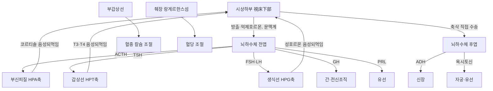

# 내분비계(內分泌系, Endocrine System)

내분비계(內分泌系, endocrine system)는 도관(導管) 없이 호르몬(hormone)을 혈류로 직접 분비하여 표적 장기의 기능을 조절하는 샘(腺)·세포·조직의 총체다[교과서적 근거]. 신경계가 전기신호를 통해 빠르고 국소적인 조절을 담당한다면, 내분비계는 혈중 화학전달물질을 매개로 느리지만 전신적이고 지속적인 항상성(恒常性) 조절을 수행한다는 점에서 상호 보완적이다. 시상하부(視床下部)·뇌하수체(腦下垂體)·갑상선(甲狀腺)·부갑상선(副甲狀腺)·부신(副腎)·췌장(膵臟) 내분비부·생식선(生殖腺)이 대표적인 내분비 기관이며, 이들은 서로 위계적인 축(軸, axis) 구조를 이루어 스트레스 반응·대사·생식·성장·수분전해질 균형을 조율한다.

한의학에서는 단일한 "내분비계" 개념이 별도로 존재하지 않으나, 신위선천지본(腎爲先天之本)·신주생장발육생식(腎主生長發育生殖)·간주소설(肝主疏泄)·비주운화(脾主運化) 등 장부(臟腑) 이론이 성장·생식·대사·스트레스 반응을 포괄적으로 설명하며, 현대 내분비축과 개념적으로 상당 부분 대응한다. 이 문서는 조직학 폴더의 「상피조직(上皮組織, Epithelial Tissue)」 문서가 다룬 내분비선의 조직학적 미세구조(선상피·분비 방식)와는 별개로, 각 내분비 기관의 육안 해부학적 위치·구조·혈관 분포, 신경내분비 축의 인체 대상 임상 근거, 그리고 한의학적 상관을 종합적으로 정리한 계통 총론(系統 總論) 문서다.

## 제1편 총론 — 내분비계의 정의와 호르몬 작용 기전

### 1. 내분비계의 정의와 분류

내분비 조직은 분비물이 도관을 거치지 않고 모세혈관으로 직접 방출되는 선상피(腺上皮) 조직으로, 배엽학적 기원이 다양함에도(뇌하수체 전엽은 외배엽성 라트케낭, 갑상선 소포세포는 내배엽, 부신피질은 중배엽 유래) 모세혈관과 밀접하게 접촉하는 공통된 구조적 특징을 갖는다[교과서적 근거].

다음 개념도는 시상하부를 정점으로 하는 신경내분비 축의 위계 구조와 주요 표적선을 도식화한 것이다.

이 축 다이어그램은 되먹임 조절의 위계 구조를 요약한 개념도이며, 각 기관의 육안 해부·위치는 아래 각론에서 상술한다. 내분비 기관은 형태상 크게 세 유형으로 나뉜다. 첫째는 뇌하수체·갑상선·부신처럼 독립된 육안적 샘 구조를 이루는 고전적 내분비선이고, 둘째는 췌장의 랑게르한스섬(Langerhans islet)·고환의 라이디히세포(Leydig cell)처럼 외분비 조직 속에 흩어져 존재하는 산재성 내분비 조직이며, 셋째는 심장(나트륨이뇨펩타이드)·신장(에리트로포이에틴)·지방조직(렙틴·아디포넥틴)처럼 본래 기능과 별개로 호르몬을 분비하는 비고전적 내분비 기관이다[교과서적 근거].

### 2. 호르몬 분비 양식과 수용체 기전

호르몬의 작용 방식은 분비된 물질이 도달하는 거리에 따라 내분비(內分泌, endocrine, 혈류를 통해 원격 표적기관에 작용)·측분비(側分泌, paracrine, 인접 세포에 작용)·자가분비(自家分泌, autocrine, 분비 세포 자신에 작용)·신경내분비(神經內分泌, neuroendocrine, 신경세포가 호르몬을 혈류로 분비)로 구분된다[교과서적 근거]. 호르몬은 화학적 구조에 따라 다시 세 부류로 나뉜다. 펩타이드·단백질 호르몬(인슐린·성장호르몬·부갑상선호르몬 등)은 세포막의 G단백질연관수용체(G protein-coupled receptor, GPCR)나 수용체 티로신키나제(receptor tyrosine kinase)에 결합해 cAMP·이노시톨삼인산(IP3) 등 2차전달자를 통해 신속하게 작용하고, 스테로이드 호르몬(부신피질호르몬·성호르몬)과 갑상선호르몬은 지용성이므로 세포막을 직접 통과해 세포질·핵 내 수용체와 결합한 뒤 유전자 전사를 조절하여 비교적 느리지만 지속적인 효과를 낸다[교과서적 근거]. 아민 호르몬(에피네프린·노르에피네프린·티록신)은 두 기전을 부분적으로 공유한다.

### 3. 되먹임 조절과 신경내분비 축

내분비계는 대부분 시상하부-뇌하수체를 정점으로 하는 위계적 축(axis) 구조를 통해 조절되며, 표적 샘에서 분비된 최종 호르몬이 상위 중추에 작용해 자신의 분비를 억제하는 음성 되먹임(陰性 feedback)이 기본 조절 원리다[교과서적 근거]. 배란 직전 에스트로겐 급증이 뇌하수체의 황체형성호르몬(LH) 분비를 일시적으로 촉진하는 양성 되먹임(陽性 feedback)은 예외적 사례다. 침 자극이 A-δ 및 C-섬유를 통해 시상하부 등 뇌 영역으로 신호를 전달하여 다양한 신경펩타이드와 호르몬 분비를 조절하고 내장 기능을 개선한다는 문헌 고찰은, 침구 자극이 내분비계·자율신경계 불균형을 동반한 질환에서 조절 수단으로 작용할 수 있는 신경내분비학적 기반을 제시한다[^1]. 침 치료가 시상하부-뇌하수체 축을 포함해 갑상선·부신·성선 등 주요 내분비 기관에 유의미한 영향을 미친다는 기전적 근거를 정리한 문헌은, 침구가 뇌하수체 전엽 호르몬 분비 조절에 관여할 수 있음을 제시했다[^2].

## 제2편 시상하부·뇌하수체 해부

### 1. 시상하부(視床下部)의 위치와 핵군

시상하부는 간뇌(間腦)의 일부로 제3뇌실 하부 벽을 이루며, 시삭교차(視索交叉, optic chiasm)에서 유두체(乳頭體, mammillary body)에 이르는 부위에 위치한다[교과서적 근거]. 시삭상핵(supraoptic nucleus)·실방핵(paraventricular nucleus)은 항이뇨호르몬(ADH, 바소프레신)과 옥시토신(oxytocin)을 합성해 뇌하수체 후엽으로 축삭을 통해 직접 수송하며, 궁상핵(arcuate nucleus)을 비롯한 다른 핵군은 성선자극호르몬방출호르몬(GnRH)·부신피질자극호르몬방출호르몬(CRH)·갑상선자극호르몬방출호르몬(TRH)·성장호르몬방출호르몬(GHRH)·소마토스타틴(somatostatin)·도파민(프로락틴 억제 인자) 등 방출호르몬·억제호르몬을 분비해 시상하부-뇌하수체 문맥계(portal system)를 통해 뇌하수체 전엽을 조절한다[교과서적 근거].

### 2. 뇌하수체(腦下垂體)의 육안 해부학적 구조

뇌하수체는 접형골(蝶形骨)의 안장(터키안, sella turcica) 내에 위치하는 완두콩 크기의 내분비 기관으로, 발생학적으로 기원이 다른 전엽(前葉, adenohypophysis, 라트케낭 유래 상피성 조직)과 후엽(後葉, neurohypophysis, 시상하부 신경조직의 연장)으로 구성된다[교과서적 근거]. 전엽은 시상하부-뇌하수체 문맥 혈관을 통해 방출호르몬의 조절을 받아 성장호르몬(GH)·갑상선자극호르몬(TSH)·부신피질자극호르몬(ACTH)·난포자극호르몬(FSH)·황체형성호르몬(LH)·프로락틴(PRL) 등 6종의 주요 호르몬을 분비하고, 후엽은 시상하부에서 합성된 ADH·옥시토신을 저장했다가 방출하는 저장·방출 기관으로 기능한다. 뇌하수체는 시신경교차 바로 아래에 위치해 뇌하수체 선종(腺腫)이 커지면 시야결손(양측 반맹)을 일으킬 수 있고, 해면정맥동(cavernous sinus)과 인접해 뇌신경(제3·4·6·5-1분지) 마비를 동반할 수 있다는 점이 임상 국소해부학적으로 중요하다[교과서적 근거].

뇌하수체의 혈액 공급은 다른 내분비선과 근본적으로 다른 독특한 경로를 취한다 — 뇌하수체 전엽은 자체 동맥 공급이 빈약한 대신, 상뇌하수체동맥(superior hypophyseal artery)이 시상하부 정중융기(median eminence)에서 1차 모세혈관총을 형성한 뒤 이것이 긴 문맥혈관(long portal vessel)을 통해 전엽에서 2차 모세혈관총으로 이어지는 시상하부-뇌하수체 문맥계(hypothalamic-hypophyseal portal system)를 통해 간접적으로 공급받으며, 이 구조 덕분에 시상하부의 방출호르몬이 전신 순환으로 희석되지 않고 국소적으로 고농도인 채 전엽에 전달될 수 있다[교과서적 근거]. 반면 후엽은 하뇌하수체동맥(inferior hypophyseal artery)의 직접 공급을 받는다[교과서적 근거]. 조직학적으로 전엽은 호산성세포(성장호르몬·프로락틴 분비)·호염기성세포(TSH·ACTH·FSH·LH 분비)·무염색세포로 구성된 내분비 상피이고, 후엽은 실제 내분비세포가 없고 시상하부 신경세포의 축삭 말단과 뇌하수체세포(pituicyte, 신경교세포의 일종)로 구성된 신경조직이라는 것이 두 엽의 근본적인 조직학적 차이다[교과서적 근거]. 임상적으로 뇌하수체선종(GH 과다분비 시 말단비대증acromegaly·소인증, PRL 과다분비 시 프로락틴종prolactinoma, ACTH 과다분비 시 쿠싱병Cushing's disease), 출산 시 대량출혈로 인한 뇌하수체 허혈성 괴사인 시한증후군(Sheehan's syndrome), 후엽 기능부전으로 인한 요붕증(尿崩症, diabetes insipidus)은 이 육안·혈관 구조와 직결되는 대표적 진단명이다[교과서적 근거].

### 3. 시상하부-뇌하수체-부신 축(HPA axis)의 침구 임상 근거

시상하부-뇌하수체-부신 축(hypothalamic-pituitary-adrenal axis, HPA axis)은 스트레스 반응의 중심 축으로, CRH→ACTH→코르티솔(cortisol)의 순차적 분비를 통해 작동한다. 만성 불면증 환자를 대상으로 침 치료가 수면의 질 개선 및 HPA 축 호르몬 조절에 미치는 영향을 평가하는 무작위 대조 시험 프로토콜은, 침구가 단순한 증상 완화를 넘어 내분비계 조절을 통해 불면증을 치료하는 기전적 근거를 제공할 수 있다고 설계되었다[^3]. 신문(神門, HT7)과 삼음교(三陰交, SP6)를 배합한 전침 치료가 단독 치료보다 시너지 효과가 크며 HPA 축의 과활성을 억제(ACTH·코르티솔 감소)하고 SCN-송과체-멜라토닌(SCN-PG-MT) 시스템의 기능을 개선한다는 임상시험 결과가 있고[^4], 조신침법(調神鍼法, Tiaoshen needling)이 혈장 멜라토닌 농도를 높여 HPA 축의 과도한 활성화를 억제함으로써 만성 불면증 환자의 수면 질과 주간 피로도를 개선한다는 임상시험도 있다[^5]. 중등도·중증의 지속성 알레르기비염 환자에서 심신조절침(心身調節鍼)이 HPA 축의 기능을 조절해 면역 체계를 안정화하는 기전이 있을 것으로 기대하는 임상시험 프로토콜도 보고되었다[^6]. 단순 비만 환자에게 침구 치료를 시행해 지질 수치를 조절하고 HPA 축 기능을 강화함으로써 체중 감소 효과를 낸다는 오래된 임상시험[^7]과, 생강을 이용한 뱀 모양 뜸(蛇灸)이 양허체질(陽虛體質) 지원자의 혈청 ACTH·코르티솔 수치를 유의하게 증가시켜 체질 점수를 개선했다는 임상시험[^8]은 침구가 HPA 축의 상·하향 조절 모두에 관여할 수 있음을 시사한다. 전통적 경혈 자극이 가짜 혈위 자극보다 주관적 득기(得氣) 감각뿐 아니라 객관적 혈청 코르티솔 농도를 유의하게 증가시킨다는 초기 연구는 경혈의 생물학적 특이성을 뒷받침하는 근거로 인용된다[^9]. 경혈의 전기전도도가 테스토스테론·칼시토닌 등 적응호르몬 수치와 밀접한 상관관계를 보인다는 관찰연구는, 경혈의 전기적 특성이 신경-내분비-면역(NEI) 네트워크 상태를 반영하는 생체지표가 될 가능성을 제시했다[^10].

> 위 HPA 축 관련 연구는 대부분 소규모 프로토콜·파일럿 수준이며, 침구가 HPA 축에 미치는 영향의 방향(항진 억제 vs 강화)이 연구 대상 병태(불면증의 과각성 vs 양허체질의 저활성)에 따라 상반되게 보고된다는 점에 유의해야 한다. 변증 없는 관행적 취혈은 근거에 부합하지 않으며, 개별 환자의 항진/저하 상태를 감별한 뒤 접근해야 한다.

## 제3편 갑상선·부갑상선·부신 해부

### 1. 갑상선(甲狀腺)의 육안 해부학적 구조

갑상선은 갑상연골(甲狀軟骨) 하부에서 제2~4 기관연골 앞쪽에 걸쳐 위치하는 나비 모양의 기관으로, 좌우 엽(葉)과 이를 연결하는 협부(峽部, isthmus)로 구성된다[교과서적 근거]. 조직학적으로 콜로이드(colloid)를 채운 소포(follicle)가 기본 단위이며, 소포세포(follicular cell)가 티록신(T4)·삼요오드티로닌(T3)을 분비하고 소포 사이 C세포(parafollicular cell)가 칼시토닌(calcitonin)을 분비한다는 미세구조는 조직학 폴더 문서와 교차 참조된다. 갑상선은 상갑상동맥(외경동맥 분지)·하갑상동맥(쇄골하동맥 갑상경동맥간 분지)의 이중 혈액 공급을 받으며, 되돌이후두신경(recurrent laryngeal nerve)이 갑상선 뒤쪽을 주행하므로 갑상선 수술·경부 자침 시 이 신경의 손상 가능성에 유의해야 한다는 것이 국소해부학적으로 중요하다[교과서적 근거]. 갑상선은 얇은 갑상선피막(true capsule)과 그 바깥의 기관전근막(pretracheal fascia)의 두 층으로 싸여 있어 연하 시 후두와 함께 상하로 움직이는데, 이 가동성은 목의 종괴가 갑상선 기원인지 감별하는 진찰 소견(연하 시 종괴 이동 여부)의 해부학적 근거가 된다[교과서적 근거]. 갑상선 뒤쪽 상·하부에는 각각 부갑상선이 위치하며, 갑상선 옆으로 총경동맥·내경정맥이 지나는 경동맥초(carotid sheath)가 인접해 있어 경부 심자 시 대혈관 손상 가능성도 함께 고려해야 한다[교과서적 근거]. 임상적으로 갑상선기능항진증(甲狀腺機能亢進症, hyperthyroidism, 그레이브스병이 대표적 원인)·갑상선기능저하증(甲狀腺機能低下症, hypothyroidism, 하시모토 갑상선염이 대표적 원인)·갑상선종(甲狀腺腫, goiter)·갑상선결절(甲狀腺結節, thyroid nodule)은 이 구조와 직결되는 대표적 진단명이다[교과서적 근거].

### 2. 갑상선 기능이상의 침구 임상 근거

하시모토 갑상선염(Hashimoto thyroiditis)에 대한 침 치료의 인체 대상 근거가 비교적 풍부히 축적되어 있다. 침 치료가 레보티록신 단독 요법보다 갑상선 관련 자가항체(TPOAb·TGAb) 수치를 낮추고 갑상선 기능 지표(FT3·FT4·TSH)를 조절하는 데 유의미한 효과가 있다는 체계적 고찰·메타분석[^11]이 있고, 수양명경(手陽明經) 침술의 효과와 안전성을 평가한 무작위 대조 시험 프로토콜[^12], 수양명경 관통침(貫通鍼) 치료가 티로글로불린 항체(TGAb) 수치를 유의하게 낮추고 삶의 질(ThyPRO-39·SF-36)을 개선했다는 탐색적 무작위 대조 시험[^13], 가임기 하시모토 갑상선염 환자의 항체 감소와 가임력 개선을 목표로 한 무작위 대조 연구[^14], 간기울결형(肝氣鬱結形) 하시모토 갑상선염 환자에게 혈위첩부(穴位貼敷) 요법을 적용해 TgAb·TPOAb 수치 감소와 삶의 질 향상을 확인한 무작위 대조 시험[^15]이 뒤를 잇는다. 침과 뜸을 병행한 치료가 TPOAb·TGAb·TSH 등 바이오마커 개선에 긍정적 영향을 줄 가능성을 확인한 체계적 고찰·메타분석·시험순차분석(trial sequential analysis)이 있으나[^16], 방법론적 결함으로 근거 수준이 낮다고 지적한 메타분석도 있어[^17] 확정적 결론에는 신중해야 한다. 침 치료가 갑상선기능항진증·저하증 환자의 증상 완화와 생물학적 지표 개선에 효과적이며 안전한 보완 요법이 될 수 있다는 개관 문헌[^18]이 있고, 그레이브스병(Graves' disease) 환자에게 시행한 자점요법(刺點療法, picking therapy)이 표준 약물(타파졸)보다 전체 유효율과 TRAb 수치 감소 효과가 높았다는 임상시험[^19], 갑상선기능항진증성 안구돌출증에 침 치료를 병행했을 때 안구 증상 개선이 우수했으나 출혈·혈종 등 시술 관련 부작용이 관찰되어 안구 주변 시술 시 주의가 필요하다는 임상시험[^20], 침과 안와 주변·경추부 마사지 병행이 표준 스테로이드·면역억제제보다 부작용이 적었다는 임상시험[^21]도 있다. 하시모토 갑상선염에 부자떡-분리구법(附子餠-分離灸法)을 병행해 임상 유효율과 FT4 개선을 확인한 임상시험[^22], 무증상 갑상선기능저하증 환자에서 침치료와 괄사(刮痧)로 TSH 정상화·삶의 질 개선을 보고한 임상시험[^23], 갑상선기능저하증 환자에게 침과 화관(火罐) 요법을 병행해 TSH 정상화·BMI 감소·약물 감량을 확인한 증례 시리즈[^24]도 있다. 최근의 내러티브 리뷰들은 침·뜸·한약을 병행한 통합 치료가 레보티록신 단독보다 임상 증상 개선과 TSH·T3·T4 조절에 더 효과적일 수 있다고 정리하며[^25], 레보티록신으로 갑상선 수치가 정상화되었음에도 증상이 지속되는 환자에게 침·부항·영양 보충이 잠재적 도움이 될 수 있음을 시사하고[^26][^27], 침 치료가 면역 조절·산화 스트레스 완화·세포사멸 억제 기전을 통해 자가항체 수치를 낮출 수 있다는 관점을 제시한다[^28].

> 갑상선 결절 환자를 대상으로 한 침 치료의 유효성·안전성을 평가하는 체계적 고찰·메타분석 프로토콜도 진행되고 있으나[^39], 염증 상태의 갑상선 부위에 가해진 침 자극이 외상성 갑상선염(traumatic thyroiditis)을 재유발할 수 있다는 증례 보고[^29]는 갑상선 결절·염증이 의심되는 경부 부위 자침 시 반드시 주의해야 함을 보여준다. 변증 없는 관행적 경부 취혈은 근거에 부합하지 않으며, 갑상선 종괴·염증 병력이 있는 환자는 초음파 등으로 병변을 확인한 뒤 시술 여부를 판단해야 한다.

### 3. 갑상선 수술 주위 침구 마취·회복 근거

갑상선 절제술 관련 침구 병용 마취·회복 촉진 근거는 중국 임상시험을 중심으로 광범위하게 축적되어 있다. 전통적 갑상선 절제술에서 침술 복합 마취(acupuncture compound anesthesia)가 마취 효과를 높이고 통증·진통제 사용량을 줄이며 활력징후를 안정시켰다는 체계적 고찰·메타분석[^30], 경추신경총마취에 전침·경피전기자극(TEAS)을 병행하는 침-약 병용 마취법이 수술 중 혈역학적 안정과 부작용 감소에 효과적이었다는 체계적 고찰·메타분석[^31]이 있다. 갑상선 절제술 후 발생하는 오심·구토(PONV) 예방을 위해 프로포폴 마취나 수술 후 침 치료를 독립적으로 적용하는 것이 효과적이라는 무작위 대조 시험[^32], 손목-발목 침법(腕踝鍼, wrist-ankle acupuncture)의 유침(留鍼) 시간을 45~60분으로 늘리는 것이 30분보다 수술 후 통증·PONV 감소에 더 효과적이라는 무작위 대조 시험[^33], 당일 수술 갑상선절제술 후 인후통에 손목-발목 침법이 유효했다는 무작위 대조 시험[^34], 내관혈(內關穴, PC6)·수지침 혈위에 고추패취를 부착해 PONV를 줄인 무작위 대조 시험[^35], 방사성 요오드 치료 후 식욕부진을 겪는 갑상선암 환자에게 침 치료가 삶의 질·식욕 지표를 개선할 가능성을 보인 파일럿 연구[^36]도 있다.

### 4. 부갑상선(副甲狀腺)의 위치와 임상 근거

부갑상선은 대개 갑상선 좌우엽의 후면에 상·하 2쌍(총 4개)으로 위치하는 쌀알 크기의 내분비선으로, 부갑상선호르몬(PTH)을 분비해 혈중 칼슘 농도를 조절한다[교과서적 근거]. 부갑상선의 개수·위치는 변이가 흔해(이소성 부갑상선 5~15%) 갑상선 수술 시 의인성 손상·저칼슘혈증의 위험이 상존한다. 상부갑상선은 발생학적으로 제4인두낭에서, 하부갑상선은 흉선과 함께 제3인두낭에서 기원하는데 하부갑상선의 하강 거리가 더 길어 위치 변이(종격동 이소성 등)가 하부갑상선에서 더 흔하다[교과서적 근거]. 혈액 공급은 주로 하갑상동맥의 분지가 담당하며(상·하 부갑상선 모두), 이 때문에 갑상선 수술 시 하갑상동맥을 주간(主幹)에서 결찰하지 않고 말단 분지 수준에서 처리하는 것이 부갑상선 혈류 보존의 원칙이다[교과서적 근거]. 조직학적으로 부갑상선은 PTH를 분비하는 주세포(主細胞, chief cell)와 기능이 불명확한 호산성세포(oxyphil cell)로 구성된다[교과서적 근거]. 임상적으로 부갑상선기능항진증(副甲狀腺機能亢進症, hyperparathyroidism, 주로 선종에 의한 고칼슘혈증)·부갑상선기능저하증(副甲狀腺機能低下症, hypoparathyroidism, 주로 갑상선 수술 후 의인성 손상에 의한 저칼슘혈증·테타니)은 이 구조와 직결되는 대표적 진단명이다[교과서적 근거]. 부갑상선 절제술 및 자가이식술을 받은 요독증(尿毒症) 환자에게 칼슘 보충과 이침(耳鍼) 플라스터 요법을 병행해 삶의 질 지표를 개선했다는 임상시험[^37], 혈액투석 환자의 요독성 소양증(尿毒性 搔痒症) 완화를 위해 삼음교·혈해·족삼리·곡지 혈위에 지압을 적용해 소양증 심각도와 함께 혈청 인·부갑상선호르몬 수치를 낮췄다는 무작위 임상시험[^38]도 있다.

### 5. 부신(副腎)의 위치와 육안 해부학적 구조

부신은 양측 신장 상극(上極)에 모자처럼 얹혀 있는 삼각형 내분비 기관으로, 발생학적 기원이 다른 피질(皮質, cortex)과 수질(髓質, medulla)로 구성된다[교과서적 근거]. 피질은 바깥에서부터 사구대(絲球帶, zona glomerulosa, 알도스테론 분비)·속상대(束狀帶, zona fasciculata, 코르티솔 분비)·망상대(網狀帶, zona reticularis, 안드로겐 분비)의 3층으로 나뉘며, 수질은 교감신경절 후 뉴런이 변형된 크롬친화세포(chromaffin cell)가 에피네프린·노르에피네프린을 분비해 교감신경계의 연장으로 기능한다. 우측 부신정맥은 짧게 하대정맥으로 직접 유입되고 좌측은 좌신정맥을 거치는 좌우 비대칭 정맥 배출 구조는 부신정맥 채혈을 통한 원발성 알도스테론증 국소화 진단에서 임상적으로 중요하다[교과서적 근거]. 부신의 동맥 공급은 상부신동맥(하횡격동맥 분지)·중부신동맥(복부대동맥 직접 분지)·하부신동맥(신동맥 분지)의 세 갈래가 피막 아래에서 그물망을 이루어 공급하는 다중 혈관 구조로, 단일 동맥 결찰만으로는 완전 허혈에 이르지 않는다는 것이 외과적으로 중요한 특징이다[교과서적 근거]. 부신의 신경 지배는 피질은 뇌하수체 ACTH의 체액성 조절이 주된 신호이지만, 수질은 예외적으로 교감신경절전섬유(내장신경, splanchnic nerve)의 직접 신경 지배를 받는다 — 이는 수질의 크롬친화세포 자체가 발생학적으로 신경능(neural crest) 유래의 변형된 교감신경절후뉴런이기 때문이며, 부신수질을 "특수화된 교감신경절"로 이해하는 근거가 된다[교과서적 근거]. 임상적으로 쿠싱증후군(Cushing's syndrome, 피질의 코르티솔 과다분비)·애디슨병(Addison's disease, 피질기능부전)·원발성 알도스테론증(Conn's syndrome, 사구대의 알도스테론 과다분비)·크롬친화세포종(嗜銀細胞腫, pheochromocytoma, 수질의 카테콜아민 과다분비 종양)은 이 층 구조와 직결되는 대표적 진단명이다[교과서적 근거]. 족삼리(足三里, ST36) 침 치료가 미주신경-부신 항염증 축(vagus nerve-adrenal anti-inflammatory axis)을 활성화해 노화를 지연시키고 관련 질환을 예방할 수 있는지 평가하는 최근의 무작위 대조 시험 프로토콜[^64]과, 성인 습진 환자에게 폐(肺)·신문(神門)·내분비·부신 이혈(耳穴)에 이침 요법을 병행해 SCORAD·DLQI 점수를 유의하게 감소시켰다는 무작위 대조 시험[^65]은 부신이 침구의 신경-면역-내분비 통합 조절의 표적 기관으로 연구되고 있음을 보여준다.

## 제4편 췌장 내분비부·생식선 내분비 기능 개관

### 1. 췌장 내분비부(랑게르한스섬)의 구조

췌장은 대부분 외분비 소화효소를 생산하는 선방(腺房, acinus)으로 구성되나, 그 사이에 랑게르한스섬(Langerhans islet)이라는 내분비 세포 집합체가 산재한다[교과서적 근거]. 랑게르한스섬은 β세포(인슐린 분비, 약 70%)·α세포(글루카곤 분비, 약 20%)·δ세포(소마토스타틴 분비)·PP세포(췌장폴리펩타이드 분비)로 구성되며, 인슐린-글루카곤의 길항적 작용을 통해 혈당을 좁은 범위 내로 유지한다. 이 육안·조직학적 구조는 소화기계 문서의 췌장 외분비부 서술과 중복 없이, 내분비 기능에 초점을 맞춰 상호 참조한다.

랑게르한스섬은 췌장 전체에 산재하나 미부(尾部, tail)에 상대적으로 밀도가 높으며, 각 섬은 β세포가 중심부에, α·δ세포가 주변부에 배열되는 특징적인 세포 배치를 이룬다[교과서적 근거]. 랑게르한스섬은 췌장동맥(비장동맥·상장간막동맥의 분지)에서 갈라진 소섬동맥(insulo-acinar portal system)을 통해 외분비 선방보다 우선적으로 풍부한 혈류를 공급받으며, 이는 내분비 호르몬이 신속히 전신 순환에 도달해야 하는 기능적 요구를 반영한다[교과서적 근거]. 신경 지배는 미주신경(부교감, 인슐린 분비 촉진)과 내장신경(교감, 인슐린 분비 억제·글루카곤 분비 촉진)이 길항적으로 작용한다[교과서적 근거]. 임상적으로 제1형 당뇨병(β세포 자가면역 파괴)·제2형 당뇨병(인슐린저항성과 상대적 분비 부족)·인슐린종(insulinoma, β세포 기원 종양)·글루카곤종(glucagonoma, α세포 기원 종양)은 이 구조와 직결되는 대표적 진단명이다[교과서적 근거].

### 2. 제2형 당뇨병에 대한 침구 임상 근거

제2형 당뇨병(type 2 diabetes mellitus)의 혈당 조절에 대한 침구 근거는 여러 편의 메타분석으로 축적되어 있다. 침 치료가 당화혈색소(HbA1c) 수치를 낮추고 삶의 질을 개선하는 데 긍정적 영향을 줄 수 있다는 메타분석[^51], 21건의 무작위 대조 시험을 종합해 침 치료가 공복혈당(FBG)을 낮추고 인슐린저항성(HOMA-IR)을 개선하는 데 보조적 효과와 안전성을 확인한 메타분석[^52], 침 치료가 HbA1c·공복혈당·식후혈당 등 주요 혈당 지표를 유의하게 개선한다는 체계적 고찰·메타분석[^53], 공복혈당·HbA1c·식후혈당·인슐린저항성을 유의하게 감소시키나 인슐린 수치 자체에는 영향이 없었다는 최근 메타분석[^54]이 있다. 연속혈당모니터링(CGM)으로 측정한 침 치료의 급성 혈당 조절 효과를 본 파일럿 연구[^55], 약물 치료와 침 치료 병행이 사망률 감소와 음의 상관관계를 보였으나 통계적 유의성에는 이르지 못한 실사용 데이터(real-world) 관찰연구[^56], 로시글리타존과 전침 병용이 혈장 유리지방산 농도를 낮춰 인슐린저항성을 개선하고 내인성 인슐린 분비를 억제한다는 무작위 대조 시험[^57]도 있다. 전당뇨(pre-diabetes)를 동반한 비만 환자의 체중 감소를 위한 전침 치료 프로토콜[^58], 좌씨 온양침(左氏 溫陽鍼) 요법을 생활습관 중재와 병행해 당뇨 전단계 환자의 공복혈당·식후혈당·HbA1c를 개선한 무작위 대조 시험[^59]도 있다. 당뇨병성 말초신경병증에 대해서는 침 치료가 약물(리포산·알프로스타딜)보다 감각장애·신경전도속도 개선에 효과적이었다는 무작위 대조 시험[^60], 전기생리학적으로 신경전도 기능 회복을 입증한 ACUDIN 무작위 대조 시험[^61]이 있으며, 당뇨병성 위마비(胃麻痺, gastroparesis) 환자에서 전침 단독 또는 모사프라이드 병용이 증상 중증도에 따라 선택적으로 유효했다는 임상시험[^62]도 보고되었다. 다낭성난소증후군(PCOS)을 동반한 당뇨 환자에서 침 치료가 miR-32-3p를 억제하고 PLA2G4A 발현을 증가시켜 포도당 대사를 개선할 수 있다는 임상시험[^63]은 췌장 내분비 기능과 생식선 내분비 기능이 침구 치료의 공통 표적으로 상호작용할 수 있음을 시사한다.

> 당뇨병 관련 침구 근거는 대부분 경증·보조요법 수준의 개선을 보고하며, 표준 혈당강하제·인슐린 요법을 대체할 근거는 없다. 변증 없는 관행적 침 치료는 근거에 부합하지 않으며, 당뇨병 진단·약물 조정은 반드시 내분비내과와 공동 관리해야 한다.

### 3. 생식선(生殖腺)의 내분비 기능과 갱년기 임상 근거

고환(睾丸)의 라이디히세포는 테스토스테론을, 난소(卵巢)의 과립막세포·황체는 에스트로겐·프로게스테론을 분비하며, 이는 시상하부-뇌하수체-생식선 축(HPG axis)의 조절을 받는다[교과서적 근거]. 생식선의 육안 해부학적 위치·혈관 분포(고환동맥·난소동맥이 모두 복부대동맥에서 직접 분지되는 공통 발생학적 기원)·조직학적 구조는 생식기계(生殖器系, Reproductive System) 문서 제2·3편에서 상세히 다루었으므로, 이 문서는 그와 중복 없이 HPG 축이라는 내분비 조절 측면에 집중한다[교과서적 근거]. 임상적으로 성선기능저하증(性腺機能低下症, hypogonadism, 원발성은 생식선 자체의 문제, 이차성은 시상하부·뇌하수체 신호 이상)·폐경(閉經, menopause, 난소 예비력 고갈에 따른 생리적 HPG 축 변화)은 이 축의 이상·생리적 변화를 반영하는 대표적 개념이다[교과서적 근거]. 삼음교(三陰交, SP6) 전침이 갱년기증후군 환자의 생식내분비 기능을 조절해 FSH·LH를 낮추고 E2를 높인다는 임상시험[^42], 침 치료와 약물 병행이 난소반응저하(POR) 환자의 호르몬 수치 개선·난소예비능 향상 및 생식선자극호르몬(Gn) 사용량 감소에 효과적이었다는 임상시험[^43], 갱년기증후군을 동반한 여성 비만 환자에서 변증에 따른 침구·이침 병행이 비만지수·갱년기증상(Kupperman index)과 E2·FSH를 정상화했다는 관찰연구[^44], 체외수정(IVF) 과정에서 침 치료 병행군이 과배란 유도 단계의 혈청 코르티솔·프로락틴을 정상 생리 주기에 가깝게 조절했다는 관찰연구[^45]도 있다. 폐경 관련 안면홍조(顔面紅潮)에 대해서는 수기침이 안면홍조 빈도·강도를 줄이고 온침(溫鍼)이 삶의 질 개선에 유용하다는 네트워크 메타분석[^46], 침 치료가 가짜 침보다 폐경 후 증상·안면홍조를 개선하고 에스트라디올 증가·LH 감소와 관련될 가능성을 보인 무작위 대조 시험[^47], 중국 여성의 갱년기 증상에 침구가 효과적·안전한 비호르몬적 대안이 될 수 있다는 체계적 고찰[^48]이 있는 반면, 가짜 침과 비교했을 때는 통계적 유의성이 불충분하다는 체계적 고찰[^49]도 있어 근거 수준이 엇갈린다. 최근의 개관 문헌은 호르몬요법이 금기인 폐경 여성의 혈관운동증상 관리에서 인지행동치료·최면술이 효과적인 비호르몬 대안이며, 침이 전반적 증상 부담과 삶의 질을 주관적으로 개선할 수 있다고 정리한다[^50]. 호르몬수용체 양성 유방암 환자의 내분비요법 유발 안면홍조에 대해서는 다국가 임상시험 설계 연구[^40]에 이어, 10주간의 집중 침 치료가 안면홍조를 유의하게 개선하고 치료 순응도를 높였다는 개별환자자료 통합분석(pooled analysis)이 보고되었다[^41].

> 폐경·유방암 내분비요법 관련 침구 근거는 방법론(가짜 침 대조 여부)에 따라 결과가 엇갈리므로, 호르몬요법 대체가 아닌 보조·대안 요법으로 신중히 위치시켜야 한다. 특히 호르몬수용체 양성 유방암 환자는 침구 병용 여부를 반드시 종양내과와 상의해야 한다.

## 제5편 한의학적 상관 — 신위선천지본(腎爲先天之本)과 내분비축

### 1. 신(腎)과 성장·생식·생식선 축

한의학의 신(腎)은 "선천지본(先天之本)"으로서 생장(生長)·발육(發育)·생식(生殖)을 주관한다고 보며[교과서적 근거], 이는 현대 내분비학의 시상하부-뇌하수체-생식선 축(HPG axis) 및 시상하부-뇌하수체-갑상선 축(HPT axis)의 생리적 범위와 상당 부분 겹친다. 신정(腎精)이 충실하면 사춘기·생식 기능·노화 과정이 정상적으로 진행된다는 이론은, 뇌하수체 성선자극호르몬·성호르몬의 생애주기별 분비 변화라는 현대적 관찰과 개념적으로 대응한다. 신음허(腎陰虛)·신양허(腎陽虛) 변증이 갱년기·생식기능 저하와 임상적으로 연관된다고 보는 관점은 앞서 제4편에서 다룬 삼음교 전침의 생식내분비 조절 근거[^42][^43]와 접점을 이룬다.

### 2. 신-명문화(命門火)와 HPA·HPT 축의 대응

명문화(命門火)는 신양(腎陽)의 온후(溫煦) 작용을 상징하는 개념으로, 부신피질호르몬·갑상선호르몬이 담당하는 기초대사·체온 유지·스트레스 저항력과 개념적으로 유사한 기능을 설명한다[교과서적 근거]. 양허체질(陽虛體質) 지원자에서 생강 뱀 모양 뜸이 혈청 ACTH·코르티솔을 상향 조절해 체질 점수를 개선했다는 임상시험[^8]은, "신양부족(腎陽不足)"이라는 한의학적 변증이 HPA 축의 기능적 저하와 일부 대응할 수 있음을 시사하는 인체 대상 관찰이다. 반면 하시모토 갑상선염의 간기울결형(肝氣鬱結形) 변증에 따른 혈위첩부 치료 근거[^15]는, 갑상선 기능이상이 신(腎)뿐 아니라 간(肝)의 소설(疏泄) 실조와도 연관되어 다장부(多臟腑) 변증의 틀에서 접근해야 함을 보여준다.

### 3. 비주운화(脾主運化)와 췌장 내분비 기능

비(脾)의 운화(運化) 기능은 음식물을 정미(精微)로 변화시켜 전신에 수송하는 소화·대사 기능을 포괄하며, 이는 췌장 내분비부의 혈당 조절 기능과 임상적으로 상당 부분 겹친다[교과서적 근거]. 비기허(脾氣虛)·습열(濕熱)이 소갈(消渴, 당뇨병에 해당하는 전통 병명)의 주요 병기로 거론되는 것은, 제4편에서 다룬 당뇨병 대상 침구 임상시험[^51][^52][^53][^54]이 비위(脾胃) 계통 경혈(족삼리 등)을 다용하는 경향과 일치한다.

### 4. 설진(舌診)·안진(眼診)과 내분비 지표의 상관

한의학의 사진(四診) 가운데 설진(舌診)·목진(目診)은 갑상선기능항진증의 안구돌출·수전(手顫), 부신피질기능이상의 색소침착 등 내분비 질환의 육안적 징후를 관찰하는 데 활용되어 왔다. 갑상선기능항진증성 안구돌출증에 대한 침구 치료 근거[^20][^21]는 망진(望診)으로 파악되는 안구 돌출이라는 소견이 실제로 침구 개입의 반응 지표로 추적될 수 있음을 보여준다.

## 제6편 임상 적용과 안전성

### 1. 안전성 표

내분비 기관 주변 침구 시술은 해당 기관의 해부학적 특수성으로 인해 일반 연부조직 자침과는 다른 위험을 내포한다.

| 부위/상황 | 위험 | 근거·비고 |
|---|---|---|
| 갑상선 결절·염증 부위 경부 자침 | 외상성 갑상선염 재유발 가능 | 조영제 투여 후 갑상선염 환자에서 자침이 재발 유발 가능성을 보인 증례 보고[^29] |
| 갑상선기능항진증성 안구돌출증 부위 자침 | 출혈·혈종 | 안구 주변 자침 부작용 관찰[^20] |
| 갑상선 결절 침 치료 | 안전성 근거 불충분 | 유효성·안전성 평가가 아직 프로토콜 단계[^39] |
| 부갑상선절제술 후 이침 | 비교적 안전 | 삶의 질 개선, 중대 부작용 미보고[^37] |
| 호르몬수용체 양성 유방암 환자 침 치료 | 종양내과와 병용 여부 상의 필요 | 안면홍조 완화 근거는 있으나 호르몬 요법 대체 근거 아님[^40][^41] |
| 하시모토 갑상선염 혈위첩부 | 피부 알레르기 | 첩부 부위 피부반응 발생 가능[^15] |
| 당뇨병 환자 자침 | 감염·상처치유 지연 위험 | 당뇨병성 말초신경병증·미세혈관병증 동반 시 자침 부위 감염·궤양화 위험 증가[교과서적 근거] |

> 이 표는 임상 틀이지 동일 근거수준의 권고가 아니다. 개별 환자의 갑상선·부신·췌장 질환 유무, 항응고제 복용 여부, 면역 상태를 종합적으로 평가한 뒤 시술 여부를 결정해야 한다.

### 2. 임상 추적 관찰 지표

| 내분비 영역 | 추적 지표 |
|---|---|
| 갑상선 | TSH, FT3, FT4, TPOAb, TGAb, TRAb |
| 부갑상선 | 혈청 칼슘, 인, PTH |
| 부신 | 혈청 코르티솔(아침·일주기), ACTH |
| 췌장 내분비부 | 공복혈당, 식후혈당, HbA1c, HOMA-IR |
| 생식선 | FSH, LH, E2, 테스토스테론, Kupperman index |

> 이 표는 임상 참고용 추적 지표 목록이며, 실제 진단·치료 결정은 내분비내과·산부인과 등 관련 전문과와의 협진 하에 이루어져야 한다.

### 3. 생활 관리와 조섭(調攝)

내분비 질환 환자의 침구 병용 관리에서는 다음과 같은 생활 지도가 함께 이루어진다.

| 항목 | 지도 내용 | 이론적 근거 |
|---|---|---|
| 수면 | 규칙적 취침·기상, 야간 각성 최소화 | 「신장정기, 정즉신장(腎藏精, 精則神藏)」— 수면이 신정 보존과 연관된다는 이론[교과서적 근거] |
| 정서 | 스트레스·정서적 긴장 관리 | 간주소설(肝主疏泄) 실조가 갑상선·생식선 기능에 영향을 줄 수 있다는 관점[교과서적 근거] |
| 식이 | 규칙적 식사, 과도한 단맛·기름진 음식 절제 | 비주운화(脾主運化)와 소갈(消渴) 병기 이론[교과서적 근거] |
| 보온 | 사지 냉증·오한 관리 | 신양(腎陽)·명문화(命門火) 부족과 대사저하 대응[교과서적 근거] |

> 이 표는 생활지도 참고 틀이며, 내분비 질환의 약물 치료를 대체하지 않는다.

### 4. 환자 설명용 요약

> 내분비계는 몸속의 "화학 신호 전달 체계"입니다. 뇌하수체·갑상선·부신·췌장·생식선이 서로 신호를 주고받으며 몸의 대사·성장·생식·스트레스 반응을 조절합니다. 침구 치료가 이 신호 체계에 직접적으로 관여한다는 연구들이 있지만, 대부분 보조적인 효과를 보여주는 수준이며 갑상선 호르몬제·인슐린·성호르몬 치료를 대체할 수 있다는 근거는 아직 충분하지 않습니다. 갑상선에 결절이 있거나 염증이 있는 경우, 경부에 침을 맞기 전 반드시 담당 한의사에게 알려야 하며, 당뇨병이 있는 경우 시술 부위의 감염 예방에 더욱 신경 써야 합니다.

## 제7편 Q&A

**Q1. 침 치료로 갑상선기능저하증의 호르몬제(레보티록신)를 줄이거나 끊을 수 있는가?**

단정할 수 없다. 소규모 증례 시리즈에서 침·화관 병용 후 TSH 정상화와 함께 약물 복용량이 줄어든 사례가 보고되었으나[^24], 이는 소수 환자 대상의 예비적 관찰일 뿐이다. 레보티록신 용량 조정은 반드시 내분비내과 검사 결과에 따라 이루어져야 하며, 임의로 감량·중단해서는 안 된다.

**Q2. 하시모토 갑상선염에 침 치료가 도움이 되는가?**

인체 대상 무작위 대조 시험과 메타분석이 다수 축적되어 있으며, 자가항체(TPOAb·TGAb) 수치 감소와 삶의 질 개선을 보고한 연구가 많다[^11][^13][^15]. 다만 방법론적 한계를 지적하는 메타분석도 있어[^17], 표준 호르몬 대체 요법을 유지하면서 보조적으로 병행하는 것이 원칙이다.

**Q3. 갑상선 결절이 있는 환자에게 경부 자침을 해도 되는가?**

변증에 따른 판단이 필요하다. 결절·염증 부위에 대한 직접 자침은 외상성 갑상선염을 유발할 수 있다는 증례 보고가 있으므로[^29], 결절이 확인된 환자는 초음파 등으로 병변의 성질을 파악한 뒤 결절을 피해 시술하거나 원위취혈(遠位取穴)을 우선 고려해야 한다.

**Q4. 당뇨병 환자에게 침 치료가 혈당 조절에 도움이 되는가?**

여러 메타분석이 공복혈당·HbA1c의 유의한 개선을 보고하지만[^51][^52][^53], 효과 크기는 대체로 크지 않고 인슐린 수치 자체에는 유의한 영향이 없었다는 분석도 있다[^54]. 따라서 침 치료는 표준 혈당강하제·생활습관 관리의 보조 수단으로 위치해야 하며, 침 치료만으로 약물을 대체해서는 안 된다.

**Q5. 갱년기 안면홍조에 침 치료가 호르몬 대체 요법(HRT)만큼 효과적인가?**

연구마다 결과가 엇갈린다. 일부 네트워크 메타분석은 수기침이 안면홍조 빈도를 줄이는 데 효과적이라고 보고하지만[^46], 가짜 침 대조군과 비교했을 때 통계적 유의성이 불충분하다는 체계적 고찰도 있다[^49]. HRT가 금기이거나 기피하는 환자에서 비호르몬적 보조 수단으로 고려할 수 있다[^48][^50].

**Q6. 유방암으로 내분비요법(호르몬차단제)을 받는 환자도 침 치료를 받을 수 있는가?**

안면홍조 완화 목적의 침 치료 근거가 축적되고 있으나[^40][^41], 반드시 종양내과 주치의와 상의한 뒤 병행해야 한다. 침 치료가 내분비요법의 항암 효과 자체에 영향을 준다는 근거는 없으며, 어디까지나 부작용(안면홍조) 관리 목적의 보조 요법이다.

**Q7. 부신 관련 질환(쿠싱증후군·애디슨병)에도 침 치료 근거가 있는가?**

현재까지 축적된 인체 대상 연구는 대부분 HPA 축의 스트레스 반응·코르티솔 일주기 조절에 관한 것이지[^3][^4][^5][^9][^10], 쿠싱증후군·애디슨병과 같은 명확한 부신 질환 자체에 대한 침구 임상시험은 매우 드물다. 이러한 질환은 반드시 내분비내과의 진단·치료가 우선되어야 하며, 침구는 보조적 관리 범위를 넘어서는 안 된다.

**Q8. 침구 치료 중 갑상선·생식선 호르몬 수치가 갑자기 크게 변하면 어떻게 해야 하는가?**

침구 자체가 호르몬 수치에 미치는 영향은 대체로 완만하고 보조적인 수준으로 보고된다[^11][^42][^43]. 만약 짧은 기간 내 호르몬 수치가 크게 변동한다면 침구 외의 원인(약물 순응도 변화, 새로운 갑상선·생식선 질환 발생 등)을 우선 감별해야 하며, 내분비내과 재평가를 지체해서는 안 된다.

---

[^1]: Acupuncture stimulation and neuroendocrine regulation. Yu JS 외. _International review of neurobiology_. 2013. [문헌 고찰] [DOI 10.1016/B978-0-12-411545-3.00006-7](https://doi.org/10.1016/B978-0-12-411545-3.00006-7) [PMID 24215920](https://pubmed.ncbi.nlm.nih.gov/24215920/) — 침 자극이 시상하부 등 중추로 신호를 전달해 신경펩타이드·호르몬 분비를 조절한다는 신경내분비학적 기전 개관.
[^2]: Endocrinological Basis of Acupuncture. Qi-Wen Xie. _The American Journal of Chinese Medicine_. 1981-01. [문헌 고찰] [DOI 10.1142/s0192415x81000391](https://doi.org/10.1142/s0192415x81000391) — 침 치료가 시상하부-뇌하수체 축, 갑상선, 부신, 성선에 영향을 미친다는 초기 기전적 개관.
[^3]: Effects of acupuncture on the hypothalamus-pituitary-adrenal axis in chronic insomnia patients: a study protocol for a randomized controlled trial. Chengyong Liu 외. _Trials_. 2019-12. [임상시험] [DOI 10.1186/s13063-019-3964-5](https://doi.org/10.1186/s13063-019-3964-5) — 침 치료의 HPA 축 조절 효과를 평가하는 무작위 대조 시험 설계.
[^4]: [Acupoint compatibility effect and mechanism of Shenmen (HT7) and Sanyinjiao (SP6) in improving daytime fatigue and sleepiness of insomnia]. Song XJ 외. _Zhen ci yan jiu = Acupuncture research_. 2022-07-25. [임상시험] [DOI 10.13702/j.1000-0607.20210590](https://doi.org/10.13702/j.1000-0607.20210590) [PMID 35880281](https://pubmed.ncbi.nlm.nih.gov/35880281/) — 신문·삼음교 배합 전침이 HPA 축 과활성을 억제하고 멜라토닌계 기능을 개선.
[^5]: [Effect of Tiaoshen needling on plasma melatonin and cortisol in patients with chronic insomnia]. Li JH 외. _Zhen ci yan jiu = Acupuncture research_. 2021-08-25. [임상시험] [DOI 10.13702/j.1000-0607.201009](https://doi.org/10.13702/j.1000-0607.201009) [PMID 34472755](https://pubmed.ncbi.nlm.nih.gov/34472755/) — 조신침법이 멜라토닌 농도를 높여 HPA 축 과활성을 억제.
[^6]: Impact of acupuncture for allergic rhinitis on the activity of the hypothalamus-pituitary-adrenal axis: study protocol for a randomized controlled trial. Chen S 외. _Trials_. 2019-06-20. [임상시험] [DOI 10.1186/s13063-019-3424-2](https://doi.org/10.1186/s13063-019-3424-2) [PMID 31221225](https://pubmed.ncbi.nlm.nih.gov/31221225/) — 심신조절침이 HPA 축을 통해 알레르기비염 면역 반응을 조절할 가능성을 평가하는 설계 연구.
[^7]: [Effect of acupuncture and moxibustion on hypothalamus-pituitary-adrenal axis suffering from simple obesity]. Liu ZC. _Zhong xi yi jie he za zhi_. 1990-11. [임상시험] [PMID 2176576](https://pubmed.ncbi.nlm.nih.gov/2176576/) — 침구가 단순 비만 환자의 HPA 축 기능을 강화해 체중 감소에 기여한다는 초기 임상 관찰.
[^8]: [Ginger-separated Snake Moxibustion Improves Yang Deficiency Constitution by Up-regulating Serum Adrenocorticotropic Hormone and Cortisol Levels in Yang Deficiency Constitution Volunteers]. Hu XW 외. _Zhen ci yan jiu = Acupuncture research_. 2018-12-25. [임상시험] [DOI 10.13702/j.1000-0607.180513](https://doi.org/10.13702/j.1000-0607.180513) [PMID 30585454](https://pubmed.ncbi.nlm.nih.gov/30585454/) — 생강 뱀 모양 뜸이 양허체질에서 ACTH·코르티솔을 상향 조절한다는 임상시험.
[^9]: Acupuncture Points Have Subjective (Needing Sensation) and Objective (Serum Cortisol Increase) Specificity. LU Roth 외. _Acupuncture in Medicine_. 1997-05. [임상시험] [DOI 10.1136/aim.15.1.2](https://doi.org/10.1136/aim.15.1.2) — 경혈 자극의 혈청 코르티솔 상승 특이성을 확인한 초기 연구.
[^10]: Relationships between electrical conductivity of acupuncture points and adaptation hormones. Toto Zantaraia 외. _Quality in Sport_. 2024-07-02. [관찰연구] [DOI 10.12775/qs.2024.21.53009](https://doi.org/10.12775/qs.2024.21.53009) — 경혈 전기전도도와 테스토스테론·칼시토닌 등 적응호르몬의 상관관계.
[^11]: Effect of acupuncture on Hashimoto thyroiditis: A systematic review and meta-analysis. Xiaohui Wang 외. _Medicine_. 2024-03-01. [메타분석] [DOI 10.1097/md.0000000000037326](https://doi.org/10.1097/md.0000000000037326) — 침 치료가 하시모토 갑상선염의 자가항체·갑상선 기능 지표를 개선한다는 메타분석.
[^12]: Acupuncture for Hashimoto thyroiditis: study protocol for a randomized controlled trial. Shanze Wang 외. _Trials_. 2021-01-21. [임상시험] [DOI 10.1186/s13063-021-05036-8](https://doi.org/10.1186/s13063-021-05036-8) — 수양명경 침술의 하시모토 갑상선염 치료 효과·안전성 평가 설계.
[^13]: Acupuncture treatment for Hashimoto's thyroiditis: An exploratory randomized controlled trial. Wang S 외. _Integrative medicine research_. 2024-03. [임상시험] [DOI 10.1016/j.imr.2024.101023](https://doi.org/10.1016/j.imr.2024.101023) [PMID 38420579](https://pubmed.ncbi.nlm.nih.gov/38420579/) — 수양명경 관통침이 TGAb 감소와 삶의 질 개선에 유효.
[^14]: The efficacy of acupuncture for the treatment and the fertility improvement in child-bearing period female with Hashimoto Disease: A randomized controlled study. Li F 외. _Medicine_. 2020-07-02. [임상시험] [DOI 10.1097/MD.0000000000020909](https://doi.org/10.1097/MD.0000000000020909) [PMID 32629685](https://pubmed.ncbi.nlm.nih.gov/32629685/) — 가임기 하시모토 갑상선염 환자의 항체 감소·가임력 개선 목표 연구.
[^15]: [Acupoint application for Hashimoto's thyroiditis with liver-qi stagnation: a randomized controlled trial]. Qiao X 외. _Zhongguo zhen jiu_. 2024-05-12. [임상시험] [DOI 10.13703/j.0255-2930.20230916-k0001](https://doi.org/10.13703/j.0255-2930.20230916-k0001) [PMID 38764100](https://pubmed.ncbi.nlm.nih.gov/38764100/) — 간기울결형 하시모토 갑상선염에 대한 혈위첩부 요법의 효과·피부 부작용.
[^16]: A systematic review, meta-analysis, and trial sequential analysis of the effect of acupuncture and moxibustion cake on thyroid function in patients with Hashimoto thyroiditis. Ren Haitao 외. _Medicine_. 2026-05-01. [메타분석] [DOI 10.1097/md.0000000000048352](https://doi.org/10.1097/md.0000000000048352) — 침구 병행이 하시모토 갑상선염 바이오마커에 미치는 영향의 메타분석·시험순차분석.
[^17]: Meta-analysis of Acupuncture-Related Therapy Versus Western Drug Replacement Therapy in the Treatment of Hashimoto's Thyroiditis. Weichen Si. _Journal of Alternative, Complementary & Integrative Medicine_. 2022-11-25. [메타분석] [DOI 10.24966/acim-7562/100290](https://doi.org/10.24966/acim-7562/100290) — 기존 문헌의 방법론적 결함으로 근거 수준이 낮다고 지적한 메타분석.
[^18]: An overview of the contribution of acupuncture to thyroid disorders. Cheng FK. _Journal of integrative medicine_. 2018-11. [문헌 고찰] [DOI 10.1016/j.joim.2018.09.002](https://doi.org/10.1016/j.joim.2018.09.002) [PMID 30341025](https://pubmed.ncbi.nlm.nih.gov/30341025/) — 갑상선기능항진증·저하증 전반에 대한 침 치료 근거 개관.
[^19]: [Observation on therapeutic effect of picking therapy on Graves' disease]. Li GL 외. _Zhongguo zhen jiu_. 2006-11. [임상시험] [PMID 17165495](https://pubmed.ncbi.nlm.nih.gov/17165495/) — 자점요법이 그레이브스병의 TRAb 감소·유효율에서 표준 약물보다 우수.
[^20]: [Therapeutic effect and side effect of treatment on hyperthyroid exophthalmos with the combination of acupuncture and medication]. Xia Y 외. _Zhongguo zhen jiu_. 2010-10. [임상시험] [PMID 21058474](https://pubmed.ncbi.nlm.nih.gov/21058474/) — 침 병행이 안구돌출증 개선에 우수하나 출혈·혈종 등 부작용 관찰.
[^21]: [Efficacy observation on infiltrative exophthalmos treated with acupuncture and acupoint massage]. Xu WM 외. _Zhongguo zhen jiu_. 2011-02. [임상시험] [PMID 21442804](https://pubmed.ncbi.nlm.nih.gov/21442804/) — 침·마사지 병행이 표준 치료보다 부작용이 적은 안구돌출증 개선.
[^22]: [Effect of aconite cake-separated moxibustion at Guanyuan (CV 4) and Mingmen (GV 4) on thyroid function in patients of Hashimoto's thyroiditis]. Xia Y 외. _Zhongguo zhen jiu_. 2012-02. [임상시험] [PMID 22493914](https://pubmed.ncbi.nlm.nih.gov/22493914/) — 부자떡-분리구법 병행이 하시모토 갑상선염의 FT4 개선에 기여.
[^23]: [The influence of acupuncture on the quality of life and the level of thyroid-stimulating hormone in patients presenting with subclinical hypothyroidism]. Luzina KÉ 외. _Voprosy kurortologii, fizioterapii, i lechebnoi fizicheskoi kultury_. [임상시험] [PMID 22165143](https://pubmed.ncbi.nlm.nih.gov/22165143/) — 침치료·괄사 병행이 무증상 갑상선기능저하증의 TSH·삶의 질 개선.
[^24]: Role of Acupuncture and Fire Cupping in Reducing the Thyroxine Dose and Improving the Thyroid Function in Hypothyroidism Patients: A Case Series. Nair PMK 외. _Journal of acupuncture and meridian studies_. 2021-10-31. [증례 보고] [DOI 10.51507/j.jams.2021.14.5.200](https://doi.org/10.51507/j.jams.2021.14.5.200) [PMID 35770589](https://pubmed.ncbi.nlm.nih.gov/35770589/) — 침·화관 병행이 TSH 정상화·약물 감량과 관련된 소규모 증례.
[^25]: From Tradition to Future: Pathophysiological Mechanisms and Clinical Research Progress in the Treatment of Hypothyroidism with Traditional Chinese Medicine--A Narrative Review. Piao L 외. _Therapeutics and clinical risk management_. 2026. [문헌 고찰] [DOI 10.2147/TCRM.S581042](https://doi.org/10.2147/TCRM.S581042) [PMID 41889672](https://pubmed.ncbi.nlm.nih.gov/41889672/) — 침·뜸·한약 통합 치료가 갑상선기능저하증 지표 개선에 기여할 가능성을 정리한 내러티브 리뷰.
[^26]: Beyond levothyroxine: a narrative review of adjunctive management strategies for Hashimoto's thyroiditis. Personius L 외. _Gland surgery_. 2026-04-30. [문헌 고찰] [DOI 10.21037/gs-2025-1-554](https://doi.org/10.21037/gs-2025-1-554) [PMID 42164686](https://pubmed.ncbi.nlm.nih.gov/42164686/) — 레보티록신 정상화 후에도 증상이 지속되는 환자를 위한 보조 요법 개관.
[^27]: Persistent symptoms in euthyroid Hashimoto's thyroiditis: current hypotheses and emerging management strategies. Zhang H 외. _Frontiers in endocrinology_. 2025. [문헌 고찰] [DOI 10.3389/fendo.2025.1627787](https://doi.org/10.3389/fendo.2025.1627787) [PMID 40756512](https://pubmed.ncbi.nlm.nih.gov/40756512/) — 갑상선 수치 정상임에도 증상 지속 시 한약·침 등 보조 전략 정리.
[^28]: Exploring the Comprehensive Treatment of Hashimoto's Thyroiditis with Traditional Chinese Medicine from the Perspective of Modern Medicine. Zhang J 외. _Therapeutics and clinical risk management_. 2026. [문헌 고찰] [DOI 10.2147/TCRM.S575059](https://doi.org/10.2147/TCRM.S575059) [PMID 41908912](https://pubmed.ncbi.nlm.nih.gov/41908912/) — 면역 조절·산화스트레스 완화·세포사멸 억제라는 한방 치료 기전 정리.
[^29]: [A case of chronic thyroiditis with transient painful thyroiditis occurring after the administration of lipiodol]. Ishizuki Y 외. _Nihon Naibunpi Gakkai zasshi_. 1992-10-20. [증례 보고] [DOI 10.1507/endocrine1927.68.10_1089](https://doi.org/10.1507/endocrine1927.68.10_1089) [PMID 1333996](https://pubmed.ncbi.nlm.nih.gov/1333996/) — 염증 상태의 갑상선에 대한 침 자극이 외상성 갑상선염을 재유발할 수 있음을 시사하는 증례.
[^30]: Acupuncture compound anesthesia for traditional thyroidectomy: a systematic review and meta-analysis. Zhe Ye 외. _Journal of Acupuncture and Tuina Science_. 2023-12. [메타분석] [DOI 10.1007/s11726-023-1410-4](https://doi.org/10.1007/s11726-023-1410-4) — 침술 복합 마취가 갑상선 절제술의 마취 효과·활력징후 안정에 기여.
[^31]: Combined acupuncture-medicine anesthesia used in thyroid surgery: A systematic review and meta-analysis. Wei Zhang 외. _Medicine_. 2023-01-06. [메타분석] [DOI 10.1097/md.0000000000032582](https://doi.org/10.1097/md.0000000000032582) — 침-약 병용 마취가 갑상선 수술의 혈역학적 안정에 기여.
[^32]: Clinical trial effects of acupuncture combined with different general anesthesia on postoperative nausea and vomiting and early recovery after thyroidectomy with intra-operative neuromonitoring: a randomized controlled trial. Weipeng Zhao 외. _Frontiers in Medicine_. 2025-10-16. [임상시험] [DOI 10.3389/fmed.2025.1650403](https://doi.org/10.3389/fmed.2025.1650403) — 갑상선 절제술 후 PONV 예방에서 마취법·침 치료의 개별 효과 비교.
[^33]: Treatment duration of wrist-ankle acupuncture for relieving post-thyroidectomy pain: A randomized controlled trial. Han XR 외. _Journal of integrative medicine_. 2023-03. [임상시험] [DOI 10.1016/j.joim.2023.02.001](https://doi.org/10.1016/j.joim.2023.02.001) [PMID 36841749](https://pubmed.ncbi.nlm.nih.gov/36841749/) — 손목-발목 침법의 유침 시간에 따른 통증·PONV 개선 차이.
[^34]: Randomized Controlled Trial of Wrist-Ankle Acupuncture for Postoperative Pharyngeal Pain in Patients Undergoing Day Surgery Thyroidectomy. Fang-Fang Li 외. _Cancer Nursing_. 2025-09-29. [임상시험] [DOI 10.1097/ncc.0000000000001547](https://doi.org/10.1097/ncc.0000000000001547) — 당일 수술 갑상선절제술 후 인후통에 대한 손목-발목 침법의 효과.
[^35]: Antiemetic efficacy of capsicum plaster on acupuncture points in patients undergoing thyroid operation. Koo MS 외. _Korean journal of anesthesiology_. 2013-12. [임상시험] [DOI 10.4097/kjae.2013.65.6.539](https://doi.org/10.4097/kjae.2013.65.6.539) [PMID 24427460](https://pubmed.ncbi.nlm.nih.gov/24427460/) — 경혈 고추패취가 갑상선 수술 후 PONV를 감소.
[^36]: Effect of acupuncture for radioactive-iodine-induced anorexia in thyroid cancer patients: a randomized, double-blinded, sham-controlled pilot study. Jeon JH 외. _Integrative cancer therapies_. 2015-05. [임상시험] [DOI 10.1177/1534735415570634](https://doi.org/10.1177/1534735415570634) [PMID 25691084](https://pubmed.ncbi.nlm.nih.gov/25691084/) — 방사성 요오드 치료 후 식욕부진에 대한 침 치료의 안전성·유효성 파일럿.
[^37]: [Effects of auricular plaster therapy on quality of life in uremia patients after parathyroidectomy plus autograft]. Li L 외. _Zhongguo zhen jiu_. 2017-09-12. [임상시험] [DOI 10.13703/j.0255-2930.2017.09.007](https://doi.org/10.13703/j.0255-2930.2017.09.007) [PMID 29354913](https://pubmed.ncbi.nlm.nih.gov/29354913/) — 부갑상선절제술 후 이침 플라스터 병행이 삶의 질 지표 개선.
[^38]: The Effect of Acupressure on the Severity of Pruritus and Laboratory Parameters in Patients Undergoing Hemodialysis: A Randomized Clinical Trial. Karjalian F 외. _Journal of acupuncture and meridian studies_. 2020-08. [임상시험] [DOI 10.1016/j.jams.2020.05.002](https://doi.org/10.1016/j.jams.2020.05.002) [PMID 32497714](https://pubmed.ncbi.nlm.nih.gov/32497714/) — 지압이 혈액투석 환자의 소양증·혈청 인·부갑상선호르몬 수치를 낮춤.
[^39]: Acupuncture for thyroid nodule treatment: A protocol of systematic review and meta-analysis of randomized clinical trials. Chen Q 외. _Medicine_. 2020-10-02. [체계적 고찰] [DOI 10.1097/MD.0000000000022276](https://doi.org/10.1097/MD.0000000000022276) [PMID 33019402](https://pubmed.ncbi.nlm.nih.gov/33019402/) — 갑상선 결절 침 치료의 유효성·안전성 평가 프로토콜(진행 중).
[^40]: Acupuncture for hot flashes in hormone receptor-positive breast cancer, a coordinated multinational study: Rationale and design of the study protocol. Lu W 외. _Contemporary clinical trials_. 2022-10. [임상시험] [DOI 10.1016/j.cct.2022.106885](https://doi.org/10.1016/j.cct.2022.106885) [PMID 35998768](https://pubmed.ncbi.nlm.nih.gov/35998768/) — 호르몬수용체 양성 유방암 안면홍조에 대한 다국가 침 치료 임상시험 설계.
[^41]: Acupuncture for hot flashes in hormone receptor-positive breast cancer: A pooled analysis of individual patient data from parallel randomized trials. Lu W 외. _Cancer_. 2024-09-15. [메타분석] [DOI 10.1002/cncr.35374](https://doi.org/10.1002/cncr.35374) [PMID 38924035](https://pubmed.ncbi.nlm.nih.gov/38924035/) — 10주 집중 침 치료가 안면홍조·순응도 개선에 유효.
[^42]: [Effects of electroacupuncture of Sanyinjiao (SP 6) on genito-endocrine in patients with perimenopausal syndrome]. Qin ZY 외. _Zhen ci yan jiu_. 2007-08. [임상시험] [PMID 17907389](https://pubmed.ncbi.nlm.nih.gov/17907389/) — 삼음교 전침이 갱년기증후군의 FSH·LH·E2를 조절.
[^43]: [Acupuncture combined with medication improves endocrine hormone levels and ovarian reserve function in poor ovarian response patients undergoing in vitro fertilization-embryo transplantation]. Dong XL 외. _Zhen ci yan jiu_. 2019-08-25. [임상시험] [DOI 10.13702/j.1000-0607.180779](https://doi.org/10.13702/j.1000-0607.180779) [PMID 31475495](https://pubmed.ncbi.nlm.nih.gov/31475495/) — 침 치료와 약물 병행이 난소반응저하 환자의 호르몬·난소예비능을 개선.
[^44]: [Observation on the efficacy of female obesity complicated with climacteric syndrome treated by acupuncture and moxibustion]. Ren BB 외. _Zhongguo zhen jiu_. 2012-10. [관찰연구] [PMID 23259259](https://pubmed.ncbi.nlm.nih.gov/23259259/) — 변증별 침구·이침 병행이 갱년기 비만 여성의 호르몬·비만지수 개선.
[^45]: Changes in serum cortisol and prolactin associated with acupuncture during controlled ovarian hyperstimulation in women undergoing in vitro fertilization-embryo transfer treatment. Magarelli PC 외. _Fertility and sterility_. 2009-12. [관찰연구] [DOI 10.1016/j.fertnstert.2008.10.067](https://doi.org/10.1016/j.fertnstert.2008.10.067) [PMID 19118825](https://pubmed.ncbi.nlm.nih.gov/19118825/) — IVF 과배란 유도 중 침 치료 병행군의 코르티솔·프로락틴 변화.
[^46]: Efficacy Comparison of Different Acupuncture Treatments for Hot Flashes: A Systematic Review with Network Meta-Analysis. Hyo Rim Jo 외. _Journal of Acupuncture Research_. 2021-05-31. [메타분석] [DOI 10.13045/jar.2020.00010](https://doi.org/10.13045/jar.2020.00010) — 수기침·온침이 폐경 후 안면홍조·삶의 질에 미치는 효과 비교.
[^47]: The Effect of Acupuncture on Postmenopausal Symptoms and Reproductive Hormones: A Sham Controlled Clinical Trial. Didem Sunay 외. _Acupuncture in Medicine_. 2011-03. [임상시험] [DOI 10.1136/aim.2010.003285](https://doi.org/10.1136/aim.2010.003285) — 침 치료가 가짜 침보다 폐경 후 증상·에스트라디올·LH에 미친 영향.
[^48]: Acupuncture for menopausal symptoms in Chinese women: a systematic review. Qin Y 외. _Climacteric_. 2021-02. [체계적 고찰] [DOI 10.1080/13697137.2020.1795115](https://doi.org/10.1080/13697137.2020.1795115) [PMID 32729333](https://pubmed.ncbi.nlm.nih.gov/32729333/) — 중국 여성의 갱년기 증상 관리에서 침구의 비호르몬적 대안 가능성.
[^49]: Acupuncture for vasomotor menopausal symptoms: a systematic review. Cho SH 외. _Menopause_. [체계적 고찰] [DOI 10.1097/gme.0b013e3181a48abd](https://doi.org/10.1097/gme.0b013e3181a48abd) [PMID 19424092](https://pubmed.ncbi.nlm.nih.gov/19424092/) — 가짜 침 대조 시 혈관운동증상 개선의 유의성이 불충분하다는 체계적 고찰.
[^50]: Integrative Medicine Approaches for Menopause. Patel J 외. _Obstetrics and gynecology_. 2026-08-06. [문헌 고찰] [DOI 10.1097/AOG.0000000000006388](https://doi.org/10.1097/AOG.0000000000006388) [PMID 42561418](https://pubmed.ncbi.nlm.nih.gov/42561418/) — 폐경 증상 통합 관리에서 침의 주관적 삶의 질 개선 역할 정리.
[^51]: Meta-Analysis: Effect of Acupuncture Therapy on HbA1c Levels in Type II Diabetes Mellitus. Fatimah Wahyu 외. _Indonesian Journal of Medicine_. 2024-06-10. [메타분석] [DOI 10.26911/theijmed.2024.9.3.774](https://doi.org/10.26911/theijmed.2024.9.3.774) — 침 치료의 HbA1c 개선 효과를 종합한 메타분석.
[^52]: Effect and Safety of Acupuncture for Type 2 Diabetes Mellitus: A Systematic Review and Meta-analysis of 21 Randomised Controlled Trials. Li SQ 외. _Chinese journal of integrative medicine_. 2022-05. [메타분석] [DOI 10.1007/s11655-021-3450-2](https://doi.org/10.1007/s11655-021-3450-2) [PMID 34432205](https://pubmed.ncbi.nlm.nih.gov/34432205/) — 21건 RCT 종합, 공복혈당·인슐린저항성 개선과 안전성 확인.
[^53]: The effect of acupuncture on blood glucose control in patients with type 2 diabetes: a systematic review and meta-analysis of randomized controlled trials. Si Y 외. _Frontiers in endocrinology_. 2025. [메타분석] [DOI 10.3389/fendo.2025.1596062](https://doi.org/10.3389/fendo.2025.1596062) [PMID 40568559](https://pubmed.ncbi.nlm.nih.gov/40568559/) — HbA1c·공복혈당·식후혈당 개선을 확인한 메타분석.
[^54]: Effect of acupuncture for type 2 diabetes mellitus: a systematic review and meta-analysis of randomized controlled trials. Li N 외. _Postgraduate medical journal_. 2026-01-23. [메타분석] [DOI 10.1093/postmj/qgaf132](https://doi.org/10.1093/postmj/qgaf132) [PMID 41052150](https://pubmed.ncbi.nlm.nih.gov/41052150/) — 혈당 지표 개선을 확인했으나 인슐린 수치 자체에는 유의한 영향 없음.
[^55]: Acute Effect of Acupuncture on Glycemic Control in Type 2 Diabetes Measured by Continuous Glucose Monitoring: A Pilot Study. Vencio S 외. _Medical acupuncture_. 2021-02-01. [임상시험] [DOI 10.1089/acu.2020.1457](https://doi.org/10.1089/acu.2020.1457) [PMID 33613813](https://pubmed.ncbi.nlm.nih.gov/33613813/) — CGM으로 측정한 침 치료의 급성 혈당 조절 효과.
[^56]: Association of Acupuncture Treatment with Mortality of Type 2 Diabetes in China: Evidence of a Real-World Study. Sui M 외. _International journal of environmental research and public health_. 2020-10-25. [관찰연구] [DOI 10.3390/ijerph17217801](https://doi.org/10.3390/ijerph17217801) [PMID 33113774](https://pubmed.ncbi.nlm.nih.gov/33113774/) — 침 치료 병행과 사망률의 음의 상관 경향(통계적 유의성 미달).
[^57]: Electroacupuncture and rosiglitazone combined therapy as a means of treating insulin resistance and type 2 diabetes mellitus: a randomized controlled trial. Lin RT 외. _Evidence-based complementary and alternative medicine_. 2013. [임상시험] [DOI 10.1155/2013/969824](https://doi.org/10.1155/2013/969824) [PMID 23983807](https://pubmed.ncbi.nlm.nih.gov/23983807/) — 전침 병용이 유리지방산 감소를 통해 인슐린저항성을 개선.
[^58]: Effect and safety of electroacupuncture on weight loss in obese patients with pre-diabetes: study protocol of a randomised controlled trial. Xiying Li 외. _BMJ Open_. 2024-03. [임상시험] [DOI 10.1136/bmjopen-2023-075873](https://doi.org/10.1136/bmjopen-2023-075873) — 전당뇨 비만 환자의 체중 감소 목적 전침 치료 설계 연구.
[^59]: Effect of Zuo's warming Yang acupuncture therapy combined with lifestyle interventions on prediabetes: A randomized controlled trial. Li Y 외. _Complementary therapies in medicine_. 2023-11. [임상시험] [DOI 10.1016/j.ctim.2023.102985](https://doi.org/10.1016/j.ctim.2023.102985) [PMID 37730092](https://pubmed.ncbi.nlm.nih.gov/37730092/) — 온양침이 생활습관 중재 단독보다 당뇨 전단계 혈당지표를 더 개선.
[^60]: [Acupuncture for distal symmetric multiple peripheral neuropathy of diabetes mellitus: a randomized controlled trial]. Lu M 외. _Zhongguo zhen jiu_. 2016-05. [임상시험] [PMID 27509606](https://pubmed.ncbi.nlm.nih.gov/27509606/) — 침 치료가 당뇨병성 말초신경병증 증상·신경전도속도 개선에서 약물보다 우수.
[^61]: Electrophysiologically verified effects of acupuncture on diabetic peripheral neuropathy in type 2 diabetes: The randomized, partially double-blinded, controlled ACUDIN trial. Meyer-Hamme G 외. _Journal of diabetes_. 2021-06. [임상시험] [DOI 10.1111/1753-0407.13130](https://doi.org/10.1111/1753-0407.13130) [PMID 33150711](https://pubmed.ncbi.nlm.nih.gov/33150711/) — 전기생리학적으로 확인된 침 치료의 당뇨병성 말초신경병증 개선 효과.
[^62]: Electroacupuncture combined with mosapride alleviates symptoms in diabetic patients with gastroparesis. Pan W 외. _Experimental and therapeutic medicine_. 2017-04. [임상시험] [DOI 10.3892/etm.2017.4139](https://doi.org/10.3892/etm.2017.4139) [PMID 28413522](https://pubmed.ncbi.nlm.nih.gov/28413522/) — 전침 단독 또는 모사프라이드 병용이 당뇨병성 위마비 중증도에 따라 선택적으로 유효.
[^63]: Acupuncture therapy protects PCOS patients with diabetes by regulating miR-32-3p/PLA2G4A pathway. Wu J 외. _American journal of translational research_. 2021. [임상시험] [PMID 34539997](https://pubmed.ncbi.nlm.nih.gov/34539997/) — 침 치료가 miR-32-3p/PLA2G4A 경로 조절을 통해 PCOS 동반 당뇨의 포도당 대사를 개선.
[^64]: Activating the vagus nerve-adrenal anti-inflammatory axis to delay aging: A randomized controlled trial protocol. Sun C 외. _Contemporary clinical trials communications_. 2026-06. [임상시험] [DOI 10.1016/j.conctc.2026.101632](https://doi.org/10.1016/j.conctc.2026.101632) [PMID 42005520](https://pubmed.ncbi.nlm.nih.gov/42005520/) — 족삼리 침이 미주신경-부신 항염증 축을 활성화해 노화 지연에 기여할 가능성을 평가하는 설계 연구.
[^65]: The effects of auricular acupuncture at lung, shenmen, endocrine, adrenal points on adult eczema: a randomized trial. Dieu Thuong Thi Trinh 외. _MedPharmRes_. 2023-03-31. [임상시험] [DOI 10.32895/ump.mpr.7.1.7](https://doi.org/10.32895/ump.mpr.7.1.7) — 폐·신문·내분비·부신 이혈 자극이 성인 습진의 SCORAD·DLQI를 개선.

**고전 인용 출처**: 『黃帝內經素問』(上古天眞論, 陰陽應象大論), 『靈樞』(本神, 決氣), 『難經』(三十六難, 腎爲先天之本), 『景岳全書』(命門論), 『類經』, 『醫學入門』.
**문헌 데이터 출처**: [한의학 논문 데이터베이스 (med.symbolicinfo.com)](https://med.symbolicinfo.com) — 2026-08-25 조회 기준.
