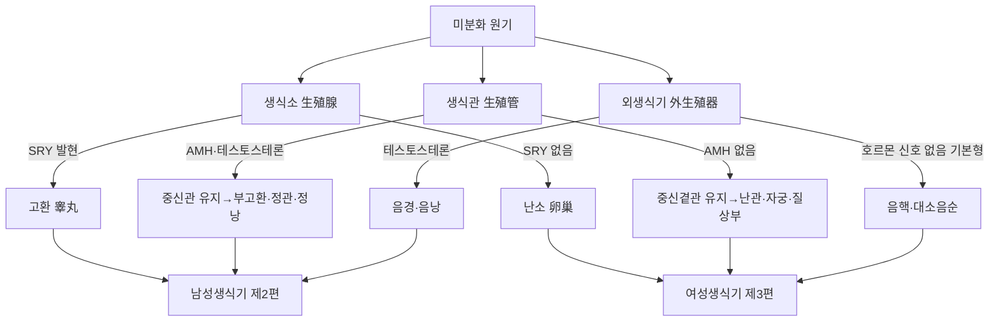

# 생식기계(生殖器系, Reproductive System)

생식기계(生殖器系, reproductive system)는 남성생식기(男性生殖器)와 여성생식기(女性生殖器)로 나뉘며, 생식세포(정자·난자)의 생성, 수정, 임신·출산이라는 종족 보존 기능을 담당하는 기관계다. 이 문서는 현대 육안 해부학의 관점에서 남녀 생식기의 구조·발생학적 기원·주행 및 위치 관계를 총론부터 각론까지 체계적으로 정리하고, 침구(鍼灸) 임상에서 필요한 국소해부학적 지식과 안전성 근거를 종합한다.

이 위키에는 생식기를 다루는 관점이 서로 다른 문서가 함께 존재한다. 한방생리학 영역의 여자포(女子胞, Uterus) 문서는 기항지부(奇恒之腑)로서의 포궁(胞宮)이라는 한의학 고유의 생리 이론 — 신(腎)-천계(天癸)-충임맥(衝任脈)-포궁이라는 생식축, 월경·임신·출산의 전통적 기전 — 을 중심으로 서술한다. 이 문서는 그와 구별되는 관점 — 육안 해부학(gross anatomy) 층위에서 남녀 생식기가 실제로 어떤 형태·위치·혈관신경 지배를 가지며, 침구·복진 시술이 실제로 어떤 구조와 마주치는가 — 에 집중한다. 두 문서는 서로의 서술을 대체하지 않으며, 필요한 경우 텍스트로만 교차 참조한다.

이 문서는 총 6편으로 구성된다. 제1편은 남녀 생식기의 발생학적 공통 기원과 분화 과정을 총론적으로 정리한다. 제2편은 남성생식기(고환·부고환·정관·전립선·음경)의 육안 해부를 다룬다. 제3편은 여성생식기(난소·난관·자궁·질)의 육안 해부를 다루며, 한방생리학 여자포(女子胞) 문서와 텍스트로 교차 참조한다. 제4편은 신주생식(腎主生殖)·천계(天癸) 이론 등 한의학적 상관을 정리한다. 제5편은 침구·한약 임상에서의 적용(불임·발기부전·만성전립선염·다낭성난소증후군 등)과 안전성 근거를 종합한다. 제6편은 Q&A와 고전 인용 출처로 마무리한다. 인용된 인간 대상 연구는 med.symbolicinfo.com 데이터베이스에서 전수 수집한 것이며, 동물실험 단독 연구는 인용에서 제외하고 인간 데이터와 동물실험이 혼합된 연구는 인간 데이터 부분만 인용하였다. 순수 해부학적 구조 서술(육안 구조·표준 발생 경로 등 표준 교과서 내용)은 `[교과서적 근거]`로 표기하고, 임상 근거·안전성 관련 인간 대상 연구는 개별 각주로 표기한다.

---

## 제1편 총론 — 남녀 생식기의 발생학적 공통 기원과 분화

### 1. 미분화 단계 — 생식소·생식관·외생식기의 공통 원기

인간 배아는 발생 초기(약 7주까지) 남녀 구별 없이 동일한 생식기 원기(原基)를 갖는 미분화(未分化) 단계를 거친다[교과서적 근거].

다음 개념도는 미분화 원기가 SRY 유전자 발현 여부에 따라 남성형·여성형으로 분화하는 경로와, 각 계통의 성체 구조를 함께 도식화한 것이다.

이 흐름도는 발생학적 분화 경로를 요약한 개념도이며, 실제 남녀 생식기의 육안 형태·위치는 제2편·제3편에서 각각 상술한다. 이 단계에서 생식소(生殖腺, gonad)는 미분화 생식융기(genital ridge)로, 생식관은 중신관(中腎管, mesonephric duct, 볼프관)과 중신곁관(paramesonephric duct, 뮐러관)이라는 두 쌍의 관으로, 외생식기는 생식결절(genital tubercle)·요도주름(urethral fold)·음순음낭융기(labioscrotal swelling)라는 공통 원기로 존재한다[교과서적 근거]. 이 공통 기원은 비뇨기계 문서에서 다룬 배설강(泄殖腔)의 비뇨생식동(泌尿生殖洞) 분화와 발생학적으로 연속선상에 있다.

### 2. 성 결정과 생식소의 분화 — SRY 유전자와 성호르몬

Y염색체 상의 SRY 유전자가 발현되면 미분화 생식소가 고환(睾丸)으로 분화하고, 고환의 세르톨리세포(Sertoli cell)가 분비하는 항뮐러호르몬(anti-Müllerian hormone, AMH)이 중신곁관(뮐러관)을 퇴화시키며, 라이디히세포(Leydig cell)가 분비하는 테스토스테론이 중신관(볼프관)을 부고환·정관·정낭으로 분화시킨다[교과서적 근거]. SRY 유전자가 없으면 생식소는 난소(卵巢)로 분화하고, 항뮐러호르몬이 분비되지 않으므로 중신곁관(뮐러관)이 유지되어 난관·자궁·질 상부로 분화하며, 중신관(볼프관)은 테스토스테론의 부재로 퇴화한다[교과서적 근거]. 즉 "여성형이 기본값이고 남성 호르몬 신호가 추가되어야 남성형으로 분화한다"는 것이 발생학의 핵심 원리이며, 이 원리가 남녀 생식기 구조 사이의 상동(相同, homologous) 관계 — 고환과 난소, 음경해면체와 음핵해면체, 음낭과 대음순 등 — 을 설명하는 발생학적 근거다[교과서적 근거].

### 3. 외생식기의 분화 — 남녀 상동 구조표

| 미분화 원기 | 남성 분화 구조 | 여성 분화 구조 |
|---|---|---|
| 생식결절(genital tubercle) | 음경귀두(陰莖龜頭) | 음핵(陰核, clitoris) |
| 요도주름(urethral fold) | 음경 요도해면체(융합) | 소음순(小陰脣) |
| 음순음낭융기(labioscrotal swelling) | 음낭(陰囊) | 대음순(大陰脣) |
| 중신관(볼프관) | 부고환·정관·정낭 | 퇴화(가르트너관 흔적) |
| 중신곁관(뮐러관) | 퇴화(전립선소실 흔적) | 난관·자궁·질 상부 |

**이 표는 임상 틀이지 동일 근거수준의 권고가 아니다.**실제 발생 과정에는 개인차·이상 분화(간성 상태 등)가 존재할 수 있으며, 이 표는 전형적인 분화 경로를 도식화한 것일 뿐이다.

### 4. 한의학의 "신주생식(腎主生殖)"과 서양의학적 생식기계 — 개념 범위의 차이

한의학의 신(腎)은 생식 기능(신장정腎藏精)을 포함하되 그에 국한되지 않는 광범위한 기능계(機能系) 개념으로, 신주수(腎主水)·신주납기(腎主納氣)·신주골생수(腎主骨生髓) 등을 함께 포괄한다는 점은 한방생리학 신(腎, Kidney) 문서와 비뇨기계 문서에서 이미 다루었다[교과서적 근거]. 여자포(女子胞) 역시 서양의학적 자궁(uterus)과 상당 부분 겹치지만, 신-천계-충임맥이라는 상류 축의 최종 집행 기관으로 이해되는 기능적 개념이라는 점이 한방생리학 여자포(女子胞) 문서에서 상세히 다루어졌다. 이 문서가 다루는 서양의학적 생식기계는 고환·난소·자궁 등 개별 기관의 국한된 해부·생리 기능에 집중하는 개념이며, "현대적 상관물" 서술은 두 개념을 동일시하는 것이 아니라 접점을 확인하는 작업임을 밝혀 둔다.

---

## 제2편 남성생식기 해부

### 5. 고환(睾丸)의 위치·형태·정삭

고환은 음낭(陰囊) 내에 좌우 한 쌍으로 위치하는 타원형의 실질 장기로, 정자를 생성하는 곡세정관(曲細精管, seminiferous tubule)과 테스토스테론을 분비하는 라이디히세포로 구성된다[교과서적 근거]. 고환은 배아기에 후복막강에서 발생하여 하강(下降, descent)을 거쳐 음낭으로 이동하며, 이 하강 경로를 따라 정삭(精索, spermatic cord)이 형성된다 — 정삭은 정관(精管)·고환동정맥·신경·림프관·거고근(擧睾筋)을 감싸는 구조물로, 서혜관(鼠蹊管, inguinal canal)을 통과해 골반강과 음낭을 연결한다[교과서적 근거]. 고환이 음낭 밖(복강·서혜부)에 머무는 잠복고환(潛伏睾丸, cryptorchidism)은 체온보다 낮은 음낭 내 온도가 정상적인 정자형성에 필수적임을 보여주는 대표적 임상 소견이다[교과서적 근거].

고환의 혈액 공급은 복부대동맥에서 직접 분지되는 고환동맥(testicular artery)이 담당하는데, 이 동맥이 신동맥 바로 아래 높이의 대동맥에서 길게 하행하여 서혜관을 통과하는 것은 고환의 발생학적 기원이 원래 후복막강 상부였음을 보여주는 흔적이다[교과서적 근거]. 정맥 배출은 고환 주위를 그물처럼 감싸는 덩굴정맥총(蔓狀靜脈叢, pampiniform plexus)이 담당하며, 이 정맥총이 고환동맥과 대향 열교환(countercurrent heat exchange)을 이루어 고환 온도를 심부 체온보다 2~3℃ 낮게 유지하는 데 기여한다 — 좌측 고환정맥이 좌신정맥에 직각으로 합류하는 해부학적 특징 때문에 정맥류(精索靜脈瘤, varicocele)가 좌측에서 압도적으로 호발한다[교과서적 근거]. 고환의 신경 지배는 고환신경총(testicular plexus, 신경총·대동맥신경총에서 오는 교감신경 위주)이 담당하며, 정삭을 감싸는 거고근(擧睾筋)은 음부대퇴신경(genitofemoral nerve)의 생식가지가 지배해 넓적다리 안쪽 피부 자극 시 고환이 위로 끌어올려지는 거고근반사(cremasteric reflex)의 해부학적 기초가 된다[교과서적 근거]. 조직학적으로 곡세정관 벽은 세르톨리세포와 발달 단계별 생식세포로 구성되며, 세르톨리세포 사이의 밀착연접(tight junction)이 혈액-고환장벽(blood-testis barrier)을 형성해 정자형성 중인 생식세포를 자가면역 공격으로부터 보호한다[교과서적 근거]. 임상적으로 고환염전(睾丸捻轉, testicular torsion, 정삭이 꼬여 혈류가 급격히 차단되는 비뇨기과 응급질환)·부고환고환염(附睾丸-睾丸炎, epididymo-orchitis)·음낭수종(陰囊水腫, hydrocele)·정계정맥류(精系靜脈瘤)는 이 국소해부학적 구조와 직결되는 대표적 진단명이다[교과서적 근거].

### 6. 부고환(副睾丸)과 정관(精管)

부고환은 고환 후상연에 부착된 구불구불한 관상 구조로, 고환에서 생성된 정자가 이곳을 통과하며 운동성과 수정 능력을 획득(성숙)한다[교과서적 근거]. 부고환은 두부(頭部)·체부(體部)·미부(尾部)로 나뉘며, 미부에서 이어지는 정관(精管, vas deferens)은 정삭을 따라 서혜관을 지나 골반강으로 들어가 방광 후벽을 따라 주행하다가 정낭(精囊)의 배출관과 합쳐져 사정관(射精管, ejaculatory duct)을 이루고, 전립선을 관통해 전립선요도로 개구한다[교과서적 근거]. 이 정관의 전 주행 경로(음낭→서혜관→골반강→전립선)는 정관절제술(vasectomy)이라는 남성 불임 시술의 해부학적 근거이자, 서혜부 탈장 수술 시 정관 손상을 피해야 하는 이유이기도 하다.

부고환의 혈액 공급은 고환동맥과 정관동맥(vas deferens artery, 상방광동맥 분지)이 함께 담당하며, 정관 자체도 정관동맥의 지배를 받아 정관절제술 후에도 부고환의 혈류가 완전히 차단되지는 않는다[교과서적 근거]. 조직학적으로 부고환관은 위중층원주상피에 긴 부동섬모(不動纖毛, stereocilia)가 특징적으로 배열되어 정자 성숙에 필요한 물질 흡수·분비 표면적을 넓히며, 정관은 두꺼운 3층 평활근(내종주·중환주·외종주)이 관강을 둘러싸 사정 시 강한 연동성 배출을 가능하게 한다[교과서적 근거]. 임상적으로 부고환염(附睾丸炎, epididymitis, 젊은 남성에서는 주로 성매개감염, 고령에서는 요로병원체가 원인)은 부고환의 위치·구조와 직결되는 대표적 염증성 질환이며, 급성 음낭통을 유발한다는 점에서 고환염전과의 감별이 임상적으로 중요하다[교과서적 근거].

### 7. 전립선(前立腺)의 구조와 요도와의 관계

전립선은 방광경부 바로 아래, 요도가 관통하는 밤톨 모양의 부속샘으로, 전립선액을 분비해 정액의 구성 성분을 이룬다[교과서적 근거]. 전립선은 이행대(移行帶, transition zone)·중심대(中心帶, central zone)·말초대(末梢帶, peripheral zone)의 구역으로 나뉘며, 전립선비대증(BPH)은 주로 요도를 둘러싼 이행대에서, 전립선암은 주로 말초대에서 호발한다는 것이 임상적으로 중요한 구역별 특징이다[교과서적 근거]. 전립선의 방광경부·요도 압박이 하부요로증상(LUTS)을 유발하는 기전은 비뇨기계 문서 제3편에서 다룬 요도 해부와 직결된다.

전립선은 앞으로 치골결합, 뒤로 직장(直腸)과 인접하며, 이 직장-전립선 인접 관계가 직장수지검사(直腸手指檢査, digital rectal examination)로 전립선 후면(주로 말초대)을 촉진할 수 있는 해부학적 근거다[교과서적 근거]. 혈액 공급은 하방광동맥(inferior vesical artery)의 전립선 분지가 담당하고, 정맥은 전립선정맥총(prostatic venous plexus, 방광정맥총·음경등정맥과 연속되며 척추정맥총과도 문합)을 거쳐 내장골정맥으로 유입되는데, 이 척추정맥총과의 문합(바트슨 정맥총, Batson's venous plexus)은 전립선암이 폐를 거치지 않고 척추로 직접 전이될 수 있는 해부학적 경로로 임상적으로 중요하다[교과서적 근거]. 신경 지배는 골반신경총(하복신경총)에서 오는 자율신경이 담당하며, 전립선을 감싸는 신경혈관다발(neurovascular bundle)이 발기 기능과 밀접히 연관되어 전립선절제술 시 이 다발의 보존 여부가 술후 발기부전 발생률을 좌우한다[교과서적 근거]. 조직학적으로 전립선은 관상포상선(管狀胞狀腺, tubuloalveolar gland) 형태의 분비 실질이 섬유근성 기질(fibromuscular stroma)에 둘러싸인 구조이며, 이 기질의 평활근이 사정 시 전립선액 배출을 돕는다[교과서적 근거]. 임상적으로 전립선염(前立腺炎, prostatitis, 급성세균성·만성세균성·만성골반통증증후군으로 분류)·전립선비대증(前立腺肥大症, BPH)·전립선암(前立腺癌)은 이 구역별 해부와 직결되는 대표적 진단명이다[교과서적 근거].

### 8. 음경(陰莖)의 해면체 구조와 발기 기전

음경은 두 개의 음경해면체(陰莖海綿體, corpus cavernosum penis)와 한 개의 요도해면체(尿道海綿體, corpus spongiosum, 요도를 감싸며 귀두龜頭를 이룸)로 구성된 해면상 발기 조직이다[교과서적 근거]. 발기는 부교감신경 자극에 따른 산화질소(NO) 매개 평활근 이완으로 해면체동(海綿體洞, cavernous sinusoid)에 동맥혈이 충만하면서 정맥유출이 억제되는 혈역학적 현상이며, 이 신경혈관 기전의 장애(당뇨병성 신경병증·동맥경화·정신적 요인 등)가 발기부전(勃起不全, erectile dysfunction, ED)의 병태생리적 배경이다[교과서적 근거].

각 해면체는 단단한 섬유성 막인 백막(白膜, tunica albuginea)으로 둘러싸여 있으며, 발기 시 이 백막이 신전되면서 해면체동에서 백막 바로 아래를 지나는 정맥(도출정맥導出靜脈, emissary vein)을 압박해 정맥유출을 차단하는 정맥폐쇄기전(veno-occlusive mechanism)이 완성된다 — 백막이 손상·섬유화되면 이 기전이 깨져 발기 유지가 어려워지거나(정맥성 발기부전) 음경이 비정상적으로 만곡되는 페이로니병(Peyronie's disease)이 발생할 수 있다[교과서적 근거]. 음경의 동맥 혈액 공급은 내음부동맥(internal pudendal artery)에서 갈라지는 음경해면체동맥(cavernous artery, 나선동맥을 통해 해면체동에 직접 개구)이 담당하며, 신경은 부교감신경(발기 유발, 골반내장신경에서 오는 해면체신경cavernous nerve)·교감신경(사정·발기 종료)·체성신경(음부신경, 귀두 감각과 구해면체근 등 골반저근 운동)이 함께 지배한다[교과서적 근거]. 이 신경혈관 기전이 4시간 이상 지속적으로 활성화되어 발기가 저절로 풀리지 않는 지속발기증(持續勃起症, priapism)은 비뇨기과 응급질환으로, 해면체동 내 정체된 혈액이 저산소증을 유발해 조직 손상으로 이어질 수 있다[교과서적 근거].

---

## 제3편 여성생식기 해부

### 9. 난소(卵巢)의 위치·형태·주기적 변화

난소는 골반강 내 좌우 한 쌍으로 위치하는 편평한 타원형 장기로, 난소고유인대(卵巢固有靭帶)와 난소걸이인대(卵巢懸垂靭帶)에 의해 자궁·골반벽에 고정된다[교과서적 근거]. 난소 피질에는 출생 시 이미 정해진 수의 원시난포(原始卵胞)가 존재하며, 매 월경주기마다 일부가 성숙난포로 발달해 배란(排卵)을 거치는데, 이 과정에서 난소 표면·크기가 주기적으로 변화한다는 점이 다른 대부분의 실질 장기와 구별되는 난소의 해부학적 특징이다[교과서적 근거]. 다낭성난소증후군(PCOS)에서 관찰되는 난소의 다낭성 형태(작은 미성숙 난포들이 피질 주변에 배열된 소견)는 이 주기적 난포 발달 과정의 이상을 반영하는 육안·초음파 소견이다[교과서적 근거].

난소는 골반강 외측벽의 난소와(卵巢窩, ovarian fossa)에 위치하며, 앞으로 광인대(廣靭帶)의 일부인 난소간막(mesovarium), 뒤로 요관·내장골혈관과 인접한다는 것이 부인과 수술의 국소해부학적 기초다[교과서적 근거]. 난소의 혈액 공급은 고환동맥과 발생학적으로 상동인 난소동맥(ovarian artery)이 복부대동맥에서 직접 분지되어 담당하며, 자궁동맥의 난소가지와도 문합을 이루는 이중 혈류 공급을 받는다 — 이 이중 공급 구조 때문에 난소염전(卵巢捻轉, ovarian torsion)이 발생해도 완전한 괴사까지 이르지 않는 경우가 있다[교과서적 근거]. 신경 지배는 난소신경총(ovarian plexus, 신경총에서 기원하는 교감신경 위주)이 담당하며, 이는 난소가 발생학적으로 후복막강 상부(신장 부근)에서 기원해 하강한 결과 그 신경 지배의 기원 분절(T10 부근)도 신장과 유사하다는 것을 반영한다[교과서적 근거]. 조직학적으로 난소 피질은 단층입방상피인 배아상피(germinal epithelium) 아래 백막(tunica albuginea)과 그 안의 다양한 발달 단계 난포로 구성되며, 수질은 혈관·신경이 풍부한 결합조직이다[교과서적 근거]. 임상적으로 난소낭종(卵巢囊腫, ovarian cyst)·난소염전·자궁내막종(endometrioma, 자궁내막증이 난소에 발생한 경우)은 이 구조와 직결되는 대표적 진단명이다[교과서적 근거].

### 10. 난관(卵管)의 네 구간과 수정의 해부학적 무대

난관(卵管, fallopian tube)은 난소에서 배란된 난자를 자궁으로 이송하는 관상 구조로, 난소에 가까운 순서대로 난관채(漏斗部, infundibulum, 술 모양의 난관채가 난소 표면의 난자를 포집)·팽대부(膨大部, ampulla, 수정이 실제로 일어나는 부위)·협부(峽部, isthmus)·자궁부(子宮部, intramural part)의 네 구간으로 나뉜다[교과서적 근거]. 난관 팽대부의 협착·유착(주로 골반염증성질환 후유증)은 난관 폐쇄성 불임(tubal obstructive infertility)의 대표적 원인으로, 정자와 난자가 만나는 수정의 해부학적 무대 자체가 손상되었음을 의미한다[교과서적 근거].

난관은 광인대 상연을 따라 주행하며, 난소·자궁과 함께 골반강 내에서 서로 인접한 위치 관계를 이룬다[교과서적 근거]. 혈액 공급은 자궁동맥과 난소동맥의 난관가지가 함께 그물망을 이루어 공급하는데, 이 이중 문합 구조는 난소와 마찬가지로 부분적 허혈에 대한 예비력을 제공한다[교과서적 근거]. 신경은 자궁난관신경총(uterotubal plexus, 자율신경 위주)이 지배한다[교과서적 근거]. 조직학적으로 난관 점막은 섬모세포(纖毛細胞, ciliated cell, 난자를 자궁 쪽으로 이동시키는 섬모운동 담당)와 분비세포(分泌細胞, secretory cell, 수정·초기 배아 발달에 필요한 영양물질 분비)가 혼재하는 단층원주상피로 구성되며, 팽대부에서 섬모세포 비율이 가장 높다[교과서적 근거]. 임상적으로 난관염(卵管炎, salpingitis, 골반염증성질환의 일부)과 자궁외임신(子宮外妊娠, ectopic pregnancy, 수정란이 자궁강에 도달하지 못하고 난관 팽대부에 착상하는 경우가 가장 흔함)은 이 난관 구조·기능과 직결되는 부인과 응급질환이다[교과서적 근거].

### 11. 자궁(子宮)의 구조 — 여자포(女子胞)와의 대응

자궁은 저부(底部, fundus)·체부(體部, body)·경부(頸部, cervix)로 구성된 두꺼운 근성 장기로, 내막(內膜, endometrium)·근층(筋層, myometrium)·외막(外膜, perimetrium)의 세 층으로 이루어진다[교과서적 근거]. 자궁내막은 매 월경주기마다 증식·분비·탈락(월경)을 반복하는 유일한 성인 조직으로, 이 주기적 변화가 여자포(女子胞)의 "정혈을 저장하다가 주기적으로 배출한다"는 한의학적 서술과 대응하는 해부·조직학적 기초다. 자궁 형태·위치(전굴전위前屈前位가 표준적)·자궁내막 두께는 초음파로 평가 가능한 임상 지표로, 착상(着床) 성공률과 밀접히 관련된다는 것이 현대 생식의학의 관찰이다[교과서적 근거]. 자궁 자체의 기능적 이론(포궁이 신-천계-충임 축의 신호를 받아 월경·임신·출산을 구현하는 기전)은 한방생리학 여자포(女子胞, Uterus) 문서에서 상세히 다루었으므로, 이 문서는 그 이론을 반복하지 않고 자궁의 육안 해부학적 구조에 집중한다.

자궁은 앞으로 방광, 뒤로 직장과 인접하며, 이 두 장기 사이의 함몰 공간인 자궁직장와(子宮直腸窩, Douglas' pouch, 복막강에서 가장 낮은 지점)는 골반강 내 혈액·삼출액이 고이기 쉬워 자궁외임신 파열이나 골반염증성질환 시 진단적 천자(경질 후원개 천자)의 표적이 된다[교과서적 근거]. 자궁의 혈액 공급은 내장골동맥에서 갈라지는 자궁동맥(子宮動脈, uterine artery)이 주 담당이며, 자궁동맥은 요관을 앞쪽에서 가로질러 자궁경부 측면에 도달하는데("물 아래 다리 water under the bridge"라는 비유로 알려진 이 교차 관계) 자궁절제술 시 요관 손상을 피하기 위해 반드시 숙지해야 하는 국소해부학적 지식이다[교과서적 근거]. 신경 지배는 자궁질신경총(uterovaginal plexus, 하복신경총에서 이어지는 자율신경)이 담당하며, 자궁체부는 주로 교감신경(T10~L1, 통증이 하복부 정중선으로 연관통), 자궁경부는 부교감신경(S2~S4)의 지배를 받는다는 것이 분만통·월경통의 신경학적 기초다[교과서적 근거]. 임상적으로 자궁근종(子宮筋腫, uterine leiomyoma, myoma, 근층의 평활근 양성 종양)·자궁선근증(子宮腺筋症, adenomyosis, 자궁내막 조직이 근층 내로 침윤)·자궁내막증(子宮內膜症, endometriosis)·자궁경부암(子宮頸部癌)은 이 층 구조·인접 장기 관계와 직결되는 대표적 진단명이다[교과서적 근거].

### 12. 질(膣)의 구조와 골반저(骨盤底)와의 관계

질은 자궁경부에서 외음부(外陰部)까지 이어지는 근성 관상 구조로, 성교·분만·월경혈 배출의 통로 역할을 한다[교과서적 근거]. 질 벽은 방광·요도(전방)와 직장(후방) 사이에 위치하며, 골반저 근육군(항문거근肛門擧筋 등)이 질·요도·직장을 함께 지지하는 구조적 기반을 이룬다[교과서적 근거]. 이 골반저 지지 구조의 약화(분만 손상·노화·에스트로겐 저하 등)는 골반장기탈출증(pelvic organ prolapse)이나 복압성요실금의 해부학적 배경이 되며, 이는 비뇨기계 문서에서 다룬 요도 지지 구조와 밀접히 연관된다.

질의 혈액 공급은 자궁동맥의 질가지·질동맥(내장골동맥 분지)·중간직장동맥의 문합이 담당하며, 신경은 상부(자궁경부에 가까운 부위)는 자율신경(자궁질신경총) 위주로 통증에 비교적 둔감하나, 하부(질구에 가까운 부위)는 음부신경의 체성감각 지배를 받아 통증에 민감하다는 차이가 임상적으로 중요하다[교과서적 근거]. 조직학적으로 질 점막은 비각화 중층편평상피(非角化 重層扁平上皮, non-keratinized stratified squamous epithelium)로 덮여 있으며, 이 상피는 에스트로겐 자극에 반응해 글리코겐을 축적하고, 축적된 글리코겐이 정상 질 세균총(락토바실루스Lactobacillus)에 의해 젖산으로 분해되어 산성 환경(pH 3.8~4.5)을 유지함으로써 병원균 증식을 억제하는 자정 기전을 형성한다[교과서적 근거]. 폐경 후 에스트로겐 저하로 이 상피가 위축되면(위축성질염, atrophic vaginitis) 산성 환경이 무너져 감염에 취약해진다는 것이 임상적으로 중요한 함의다[교과서적 근거]. 임상적으로 질염(膣炎, vaginitis, 세균성·칸디다성·트리코모나스성)·질탈출증(膣脫出症)은 이 구조와 직결되는 대표적 진단명이다[교과서적 근거].

---

## 제4편 한의학적 상관 — 신주생식(腎主生殖)과 천계(天癸)

### 13. 신주생식(腎主生殖) 이론의 해부학적 접점

신장정(腎藏精)에 의한 생장·발육·생식 이론은 한방생리학 신(腎, Kidney) 문서 제2편에서 상세히 다루었다[교과서적 근거]. 이 문서의 관점에서 볼 때, 신장정 이론이 서양의학적으로 접점을 이루는 지점은 고환·난소라는 생식소(生殖腺)의 배우자형성(정자형성·난자형성) 기능과 시상하부-뇌하수체-성선축(HPG axis)의 내분비 조절이다 — 신정(腎精)이 충족해야 생식이 가능하다는 전통 이론은, 현대적으로 생식소의 정상 발달·기능이 유지되어야 생식능력이 확보된다는 관찰과 개념적으로 조응한다[교과서적 근거]. 다만 "신허(腎虛)로 인한 불임"이 반드시 서양의학적 무배란·정자형성장애의 특정 원인(호르몬 이상·유전적 이상 등)을 지칭하는 것은 아니며, 변증은 병리생리학적 진단명을 대체하지 않고 그 위에서 개별화된 치료 표적을 제시하는 틀임을 유의해야 한다.

### 14. 천계(天癸)와 남녀 생식주기 — 발생학적 상동성과의 연결

천계(天癸)가 여자는 14세(이칠二七), 남자는 16세(이팔二八)에 이르러 각각 월경·사정이 가능해진다는 『소문·상고천진론』의 서술은 한방생리학 신(腎, Kidney) 문서에서 이미 다루었다[교과서적 근거]. 이 문서의 관점에서 흥미로운 지점은, 이 발생학적 공통 기원(제1편)에서 분화한 남녀 생식기가 사춘기에 이르러 성호르몬 축(HPG axis)의 활성화를 통해 유사한 시간표로 성숙한다는 사실이 천계 이론의 "생물학적 시계"라는 서술과 개념적으로 조응한다는 것이다. 남성 정실(精室, 정낭·전립선에 해당하는 개념)을 여자포와 구조적으로 유비하는 논의는 정설로 확립되지 않았다는 점은 여자포(女子胞) 문서에서 이미 지적된 바다.

### 15. 충임맥(衝任脈)과 골반강 해부 구조의 위치 관계

충맥(衝脈)·임맥(任脈)은 모두 포궁(胞宮)에서 일어난다(起於胞中)고 서술되며, 이 이론은 여자포(女子胞) 문서 제2편 7절에서 상세히 다루었다[교과서적 근거]. 임맥의 주요 경혈인 관원(關元, CV4)·중극(中極, CV3)은 해부학적으로 하복부 정중선, 방광 상연 및 자궁 저부에 가까운 체표 위치에 해당하며, 이 위치 관계는 이 경혈들이 전통적으로 신정(腎精)·생식 기능을 배양하는 요혈로 활용되어 온 배경과 관련이 있는 것으로 이해할 수 있다[교과서적 근거].

---

## 제5편 임상 적용과 안전성

### 16. 여성 불임(不姙)에 대한 침구 임상 근거 — 체외수정(IVF) 병용

여성 불임 치료 영역에서 가장 방대하게 축적된 인간 대상 근거는 체외수정(IVF) 시술과 침 치료를 병용한 임신율·출산율 연구다. 초기 코크란 계열 메타분석은 IVF 시술 시 배아이식 전후 침 치료가 임상 임신율을 유의하게 높인다고 보고하였고[^1], BMJ에 게재된 메타분석 역시 침 치료 병용이 임신·출산율을 높일 가능성을 제시하였다[^2]. 이후 발표된 다수의 갱신된 체계적 고찰·메타분석은 이러한 초기 긍정적 결과가 연구마다 이질성이 크다는 점을 지적하면서도[^3][^4][^5][^6], 침 치료의 시기·용량(세션 수)에 따른 효과 차이를 분석한 최신 메타분석[^7]과 베이지안 네트워크 메타분석[^8]은 특정 시점(배아이식 당일 등)의 침 치료가 상대적으로 더 나은 결과와 관련될 가능성을 제시하였다. IVF 관련 불안(anxiety)에 대한 침 치료 효과를 평가한 메타분석[^9], 자궁내막수용성(endometrial receptivity) 개선에 대한 침 치료 효과를 평가한 메타분석[^10]도 이 영역의 근거를 보충한다. IVF 여성을 대상으로 한 침 치료 체계적 고찰들을 다시 종합한 개관 연구[^11], 여성 불임에서 침구·한약의 체계적 고찰을 종합한 개관 연구[^12]도 확인된다.

### 17. 배란장애·황체기결손·난관폐쇄성 불임에 대한 침구 근거

배란장애로 인한 불임에서 침 치료를 보조 중재로 적용한 타당성을 평가한 메타분석[^13], 무배란성 불임에 침과 클로미펜을 병용한 효과를 평가한 메타분석[^14], 황체기결손(luteal phase defect)으로 인한 불임에 침 치료를 적용한 메타분석[^15], 난관폐쇄성 불임에 침구 관련 중재를 비교한 베이지안 메타분석[^16]이 이 영역의 근거를 구성한다. 여성 불임 전반에 대한 침 치료의 무작위 대조 시험을 종합한 메타분석[^17]과 보완대체요법 전반의 체계적 고찰[^18][^19]도 이러한 임상적 관심을 뒷받침한다.

**변증 없는 관행적 취혈은 근거에 부합하지 않는다.**여성 불임은 배란장애·난관폐쇄·자궁내막 요인·황체기결손 등 원인이 이질적인 병태를 포괄하므로, 산부인과적 원인 감별(난소예비력·난관 개통성·자궁내막 상태 평가) 없이 침구를 근본 치료로 오인해서는 안 되며, 반드시 생식의학과 협진 하에 보조요법으로 위치 지어야 한다.

### 18. 다낭성난소증후군(PCOS)에 대한 침구 근거

다낭성난소증후군(PCOS)은 배란장애·인슐린저항성·고안드로겐혈증을 특징으로 하는 대표적 여성 내분비 질환으로, 이 영역에서 방대한 침구 임상 근거가 축적되어 있다. 코크란 체계적 고찰은 PCOS에 대한 침 치료가 표준치료 단독보다 배란·임신율 개선에 일부 이점이 있을 가능성을 제시하면서도 근거의 질이 낮음을 지적하였다[^20]. PCOS 배란율에 대한 침 치료의 용량-반응 관계를 분석한 메타분석[^21], PCOS 여성의 인슐린저항성에 대한 침 치료의 유효성·안전성을 평가한 메타분석[^22], PCOS에서 침 치료의 안전성을 별도로 평가한 체계적 고찰·메타분석[^23], PCOS 환자의 당·지질대사에 대한 침 치료 효과를 평가한 메타분석[^24], 메트포르민과 침 병용이 PCOS 임신율에 미치는 효과를 평가한 메타분석[^25], 여러 침구 요법을 비교한 네트워크 메타분석[^26], PCOS 환자의 불안·우울에 대한 침 치료 효과를 평가한 메타분석[^27]이 확인된다. PCOS에 대한 비약물적 중재 전반의 체계적 고찰 개관[^28], 조기난소부전·PCOS 환자에서 침 치료 효과를 종합한 엄브렐러 리뷰[^29]도 이 영역의 근거를 보충한다.

**변증 없는 관행적 취혈은 근거에 부합하지 않는다.**PCOS는 배란장애형·인슐린저항형·고안드로겐형 등 임상 표현형이 다양하므로, 변증(신허·담습·간울 등)에 따른 개별화된 치법 없이 "PCOS에는 삼음교" 식의 획일적 접근은 근거 수준의 뒷받침을 받기 어렵다.

### 19. 발기부전(勃起不全, ED)에 대한 침구 근거

발기부전에 대한 침 치료의 효과를 평가한 근거도 다수 확인된다. 네트워크 메타분석은 여러 침구 관련 기법의 상대적 안전성·유효성을 비교하였고[^30], 발기부전에 대한 침 치료의 체계적 고찰·메타분석[^31]도 유사한 결론을 제시하였다. 발기부전에 대한 비약물적 중재 전반을 비교한 네트워크 메타분석[^32], 최신 체계적 고찰·메타분석[^33]도 이 영역의 근거를 뒷받침한다. 성기능장애 전반에 대한 침 치료 효과를 평가한 체계적 고찰[^34], 발기부전 치료에 침을 적용한 다수의 체계적 고찰[^35][^36][^37]도 확인된다.

### 20. 만성전립선염/만성골반통증증후군(CP/CPPS)에 대한 침구 근거

만성전립선염/만성골반통증증후군(chronic prostatitis/chronic pelvic pain syndrome, CP/CPPS)은 남성 하부 생식기 영역에서 침구 임상 근거가 가장 풍부하게 축적된 병태 중 하나다. 갱신된 체계적 고찰·메타분석은 침 치료가 CP/CPPS 증상 점수(NIH-CPSI)를 유의하게 개선한다고 보고하였고[^38], 침·알파차단제·항생제의 상대적 효과를 비교한 네트워크 메타분석[^39]도 침 치료의 근거를 뒷받침한다. CP/CPPS에 대한 침 치료의 메타분석[^40], 임상 증상·검사 지표 개선을 평가한 메타분석[^41], 침 치료의 장기 효과를 평가한 체계적 고찰·단일군 메타분석[^42], 최신 네트워크 메타분석[^43]이 이 영역의 근거를 구성한다.

### 21. 조루증(早漏症, premature ejaculation)에 대한 침구 근거

남성 성기능 관련 영역에서 조루증에 대한 침구 치료 근거도 확인된다. 조루증에 대한 여러 침구 기법의 효과를 비교한 체계적 고찰은[^44] 침 치료가 사정잠복시간(IELT) 연장에 유의한 효과가 있을 가능성을 제시하였으며, 조루증에 대한 침 치료 효과를 평가하는 체계적 고찰 프로토콜[^45]도 이러한 임상적 관심을 반영한다. 테스토스테론 수치를 지표로 전침의 조루증 치료 효과를 평가한 임상시험[^46], 신허간울(腎虛肝鬱)형 원발성 조루증에 온침(溫鍼)·대장구(大壯灸)를 적용한 무작위 대조 시험[^47]은 신주생식 이론(신정 부족이 생식 기능 저하로 이어진다는 병기)이 조루증 치료의 변증 기반 취혈로 구체화되는 임상 사례다. 조루증 관리를 위한 보완대체의학 전반을 평가한 체계적 고찰[^48][^49]도 이 영역의 근거를 보충한다.

### 22. 침구 시 생식기 손상 위험 부위와 안전성 표

골반강·서혜부 경혈의 자침은 이론적으로 생식기 관련 구조(정삭·자궁·난소·방광 등)에 인접하므로 국소해부학적 지식에 근거한 안전 원칙이 필요하다.

| 경혈/부위 | 인접 생식기 구조 | 임상적 주의점 |
|---|---|---|
| 기충(氣衝, ST30) | 정삭(남), 자궁원인대(여) | 서혜부 대혈관(대퇴동맥) 인접, 자침 각도 주의(혈관 문서 참조) |
| 중극(中極, CV3) | 방광 상연, 자궁 저부(충만/임신 시 상승) | 방광 충만 상태·임신 중 심자 주의, 임신부 금침혈로 분류되는 경우가 많음 |
| 관원(關元, CV4) | 소장·자궁 저부 | 임신 중 자침 시 태아 안전 고려, 변증에 따라 신중히 적용 |
| 삼음교(三陰交, SP6) | 하지 원위부(직접적 골반강 구조 없음이나) | 전통적으로 임신부 금침혈로 분류, 자궁 수축 유발 가능성에 대한 이론적 우려 존재 |
| 회음(會陰, CV1) | 항문·질구/음경뿌리 사이 회음부 | 표재 자침 원칙, 감염 관리 중요 |

**이 표는 임상 틀이지 동일 근거수준의 권고가 아니다.**임신부 금침혈(삼음교·합곡(LI4)·곤륜崑崙 등)에 대한 전통적 금기는 대부분 고전 문헌의 경험적 기재에 근거하며, 현대 임상시험에서 이 경혈들의 자극이 실제로 유산·조산을 유발한다는 통제된 인간 대상 근거는 제한적이다. 다만 안전을 우선하는 임상 관행상 임신 중에는 이러한 경혈의 자침을 신중히 결정하는 것이 일반적이다.

### 23. 임신부 자침의 일반 원칙

임신 중 침 치료는 입덧·요통 등 임신 관련 증상 관리에 활용되나, 하복부·요천추부 경혈의 심자, 그리고 전통적으로 자궁 수축과 관련된 것으로 알려진 경혈(삼음교·합곡 등)의 강자극은 신중히 결정해야 한다는 것이 임상 관행이다[교과서적 근거]. 이는 확립된 대규모 인간 대상 안전성 연구에 근거한다기보다, 원전·교과서에 기재된 전통적 금기와 임상적 신중함이 결합된 관행이라는 점을 정직하게 밝혀 둔다.

---

### 추적 지표표

생식기계 관련 침구 임상에서는 다음과 같은 지표로 경과를 추적한다.

| 영역 | 추적 지표 |
|---|---|
| 여성 불임·IVF 병용 | 임상 임신율, 배란 여부(초음파 난포 추적), 호르몬(FSH·LH·AMH) |
| PCOS | 배란 회복 여부, 인슐린저항성(HOMA-IR), 월경 주기 |
| 발기부전 | 국제발기능지수(IIEF), 발기 강직도 |
| 만성전립선염/CPPS | NIH-CPSI 증상 점수 |
| 조루증 | 질내사정잠복시간(IELT) |

이 표는 임상 틀이지 동일 근거수준의 권고가 아니다.

다음은 환자 설명용 요약이다.

> 이 문서에서 다루는 생식기계는 자녀를 갖는 기능뿐 아니라 남녀 각자의 삶의 질과 밀접한 신체 구조입니다. 난임이나 발기부전, 만성 골반통 같은 문제로 침구 치료를 고려하신다면, 침 치료는 표준 의학적 치료(체외수정·약물치료 등)를 대체하는 것이 아니라 함께 활용할 때 도움이 될 수 있는 보조적 방법이라는 점을 기억해 주시기 바랍니다. 임신 중이시거나 임신을 계획 중이시라면 반드시 담당 한의사에게 미리 알리고 안전한 취혈 계획을 상의하시기 바랍니다.

## 제6편 Q&A·고전 인용 출처

**Q1. 이 문서와 한방생리학의 여자포(女子胞) 문서는 어떻게 다른가?**

두 문서는 관련 대상(자궁·생식 기능)을 다루지만 관점이 다르다. 여자포(女子胞) 문서는 기항지부(奇恒之腑)로서의 포궁 개념과 신-천계-충임 생식축이라는 한의학 고유의 생리·병기 이론을 중심으로 서술하고, 이 문서는 남녀 생식기 전체의 발생학적 기원과 육안 해부학적 구조, 그리고 침구 임상의 국소해부학적 안전성에 집중한다. 두 문서는 상호 보완적이다.

**Q2. 왜 남녀 생식기는 발생학적으로 "상동" 구조를 갖는다고 하는가?**

배아 초기(약 7주까지)에는 남녀 구별 없이 동일한 생식기 원기(생식소·생식관·외생식기)가 존재하며, Y염색체의 SRY 유전자 발현 여부에 따라 이후 분화 방향이 남성형 또는 여성형으로 갈린다[교과서적 근거]. 이 때문에 고환-난소, 음경해면체-음핵해면체, 음낭-대음순처럼 서로 대응하는 상동 구조가 존재한다.

**Q3. 침 치료가 체외수정(IVF) 임신율을 실제로 높이는가?**

초기 메타분석들은 배아이식 전후 침 치료 병용이 임상 임신율을 높일 가능성을 제시하였으나[^1][^2], 이후 갱신된 체계적 고찰들은 연구 간 이질성이 크고 최근 대규모 시험에서는 효과가 뚜렷하지 않은 경우도 있어 결론이 엇갈린다[^3][^4][^5][^6]. 침 치료의 시기·용량에 따라 효과가 달라질 수 있다는 최신 분석도 있어[^7][^8], 확정적 결론보다는 개별 환자에서 부작용이 적은 보조요법으로 고려할 수 있다는 정도로 이해하는 것이 정직한 해석이다.

**Q4. 다낭성난소증후군(PCOS)에 침 치료가 도움이 되는가?**

코크란 체계적 고찰을 포함한 다수의 메타분석이 PCOS의 배란·인슐린저항성·정서 증상 개선에 침 치료가 도움이 될 가능성을 제시한다[^20][^21][^22][^24][^25][^27]. 다만 코크란 고찰은 근거의 질이 낮음을 지적하고 있어[^20], 대사·내분비 표준 관리(체중 관리·인슐린저항성 개선 약물 등)를 대체하는 것이 아니라 병행하는 보조요법으로 이해해야 한다.

**Q5. 발기부전에 침이 비아그라 같은 약물을 대신할 수 있는가?**

여러 메타분석이 침 치료가 발기부전 증상 개선에 유의한 효과가 있을 가능성을 제시하지만[^30][^31][^32][^33], 근거 수준이 포스포디에스테라제-5 억제제(PDE5 inhibitor) 등 표준 약물치료에 비해 확립되어 있지 않다. 약물 치료가 금기이거나 부작용으로 어려운 환자, 또는 약물과 병행하는 보조요법으로 고려하는 것이 현실적이다.

**Q6. 만성전립선염(CP/CPPS)에 침이 왜 이렇게 많이 연구되었는가?**

CP/CPPS는 항생제·알파차단제 등 표준 약물치료의 반응률이 제한적인 만성 통증 질환으로, 이 치료 공백을 메우기 위한 보완적 접근으로 침 치료가 활발히 연구되어 왔다[^38][^39][^40][^41][^42][^43]. 다수의 메타분석이 NIH-CPSI 증상 점수 개선에 유의한 효과를 보고하지만, CP/CPPS 자체가 염증형·비염증형 등 이질적 아형을 포괄하므로 변증에 따른 개별화가 필요하다.

**Q7. 임신 중에는 삼음교·합곡 같은 경혈에 침을 놓으면 안 되는가?**

전통적으로 삼음교(三陰交)·합곡(合谷)·곤륜(崑崙) 등은 자궁 수축을 유발할 수 있다는 이유로 임신부 금침혈로 분류되어 왔다[교과서적 근거]. 다만 이 금기가 대규모 통제된 인간 대상 안전성 연구로 확립된 것은 아니며, 경험적·전통적 근거에 기반한 임상적 신중함의 성격이 강하다. 실제 임상에서는 안전을 우선해 이러한 경혈의 강자극을 신중히 결정하는 것이 일반적 관행이다.

**Q8. 남성 불임(정자 관련)에도 침구가 활용되는가?**

정자의 질(운동성·농도 등)과 관련된 인간 대상 관찰연구가 일부 확인되나, 여성 불임·PCOS·CP/CPPS 영역에 비해 인간 대상 근거의 축적이 상대적으로 제한적이다. 이는 근거가 없다는 뜻이 아니라, 이 문서 작성 시점에서 확보 가능한 고품질 인간 대상 연구의 절대량이 아직 부족하다는 사실을 정직하게 반영한 것이다.

**고전 인용 출처**: 『黃帝內經素問』(上古天眞論, 靈蘭秘典論), 『難經』, 『東醫寶鑑』(內景篇, 婦人).
**문헌 데이터 출처**: [한의학 논문 데이터베이스 (med.symbolicinfo.com)](https://med.symbolicinfo.com) — 2026-08-24 조회 기준

[^1]: The effects of acupuncture on rates of clinical pregnancy among women undergoing in vitro fertilization: a systematic review and meta-analysis. Manheimer E 외. _Human reproduction update_. [메타분석] [DOI 10.1093/humupd/dmt026](https://doi.org/10.1093/humupd/dmt026) [PMID 23814102](https://pubmed.ncbi.nlm.nih.gov/23814102/) — IVF 배아이식 전후 침 치료 병용이 임상 임신율 개선과 관련될 가능성을 제시한 초기 대표 메타분석.
[^2]: Effects of acupuncture on rates of pregnancy and live birth among women undergoing in vitro fertilisation: systematic review and meta-analysis. Manheimer E 외. _BMJ_. 2008-03-08. [메타분석] [DOI 10.1136/bmj.39471.430451.BE](https://doi.org/10.1136/bmj.39471.430451.BE) [PMID 18258932](https://pubmed.ncbi.nlm.nih.gov/18258932/) — BMJ 게재 메타분석으로 침 치료의 임신·출산율 개선 가능성을 제시.
[^3]: Acupuncture versus placebo acupuncture for in vitro fertilisation: a systematic review and meta-analysis. Coyle ME 외. _Acupuncture in Medicine_. 2020-10-10. [메타분석] [DOI 10.1177/0964528420958711](https://doi.org/10.1177/0964528420958711) — 위약침 대조 시험만을 분석해 침 특이적 효과의 불확실성을 지적.
[^4]: Effects of acupuncture on pregnancy outcomes in women undergoing in vitro fertilization: an updated systematic review and meta-analysis. Xu M 외. _Archives of gynecology and obstetrics_. 2024-03. [메타분석] [DOI 10.1007/s00404-023-07142-1](https://doi.org/10.1007/s00404-023-07142-1) [PMID 37436463](https://pubmed.ncbi.nlm.nih.gov/37436463/) — 최신 문헌을 반영한 갱신 메타분석.
[^5]: The Timing and Dose Effect of Acupuncture on Pregnancy Outcomes for Infertile Women Undergoing In Vitro Fertilization and Embryo Transfer: A Systematic Review and Meta-Analysis. Wang X 외. _Journal of Integrative and Complementary Medicine_. 2024-11. [메타분석] [DOI 10.1089/jicm.2023.0478](https://doi.org/10.1089/jicm.2023.0478) — 침 치료의 시기·용량에 따른 임신 결과 차이를 분석.
[^6]: Effects of different electroacupuncture/transcutaneous electrical acupoint stimulation parameters on IVF outcomes. _BMJ open_. 2025-08-08. [메타분석] [DOI 10.1136/bmjopen-2024-097901](https://doi.org/10.1136/bmjopen-2024-097901) [PMID 40780719](https://pubmed.ncbi.nlm.nih.gov/40780719/) — 전침·경피경혈전기자극 매개변수에 따른 IVF 결과 차이를 분석.
[^7]: Meta analysis of ovulation induction effect and pregnancy outcome of acupuncture & moxibustion combined with assisted reproductive technology. _Frontiers in Endocrinology_. 2023-11-20. [메타분석] [DOI 10.3389/fendo.2023.1261016](https://doi.org/10.3389/fendo.2023.1261016) — 침구와 보조생식술 병용의 배란 유도·임신 결과를 종합.
[^8]: Effects of acupuncture-related therapies on pregnancy outcomes among women undergoing in vitro fertilization and embryo transfer: a Bayesian network meta-analysis. Bin C 외. _Journal of assisted reproduction and genetics_. 2025-06. [메타분석] [DOI 10.1007/s10815-025-03489-3](https://doi.org/10.1007/s10815-025-03489-3) [PMID 40343601](https://pubmed.ncbi.nlm.nih.gov/40343601/) — 여러 침구 관련 요법의 상대적 임신 결과 개선 효과를 베이지안 네트워크 메타분석으로 비교.
[^9]: Effect of acupuncture on IVF-related anxiety: a systematic review and meta-analysis. Hullender Rubin LE 외. _Reproductive biomedicine online_. 2022-07. [메타분석] [DOI 10.1016/j.rbmo.2022.02.002](https://doi.org/10.1016/j.rbmo.2022.02.002) [PMID 35570176](https://pubmed.ncbi.nlm.nih.gov/35570176/) — IVF 관련 불안 완화에 대한 침 치료 효과를 확인.
[^10]: Acupuncture in improving endometrial receptivity: a systematic review and meta-analysis. Zhong Y 외. _BMC complementary and alternative medicine_. 2019-03-13. [메타분석] [DOI 10.1186/s12906-019-2472-1](https://doi.org/10.1186/s12906-019-2472-1) [PMID 30866920](https://pubmed.ncbi.nlm.nih.gov/30866920/) — 자궁내막수용성 개선에 대한 침 치료 효과를 확인.
[^11]: An Overview of Systematic Reviews of Acupuncture for Infertile Women Undergoing in vitro Fertilization and Embryo Transfer. Wang X 외. _Frontiers in public health_. 2021. [체계적 고찰] [DOI 10.3389/fpubh.2021.651811](https://doi.org/10.3389/fpubh.2021.651811) [PMID 33959581](https://pubmed.ncbi.nlm.nih.gov/33959581/) — 기존 체계적 고찰들을 종합한 개관 연구.
[^12]: Acupuncture and herbal medicine for female infertility: an overview of systematic reviews. Lee JW 외. _Integrative medicine research_. 2021-09. [체계적 고찰] [DOI 10.1016/j.imr.2020.100694](https://doi.org/10.1016/j.imr.2020.100694) [PMID 33665092](https://pubmed.ncbi.nlm.nih.gov/33665092/) — 여성 불임에서 침구·한약의 체계적 고찰을 종합.
[^13]: Feasibility of acupuncture as an adjunct intervention for ovulatory disorder infertility: A systematic review and meta-analysis. Chen YQ 외. _World journal of clinical cases_. 2024-08-06. [메타분석] [DOI 10.12998/wjcc.v12.i22.5108](https://doi.org/10.12998/wjcc.v12.i22.5108) [PMID 39109015](https://pubmed.ncbi.nlm.nih.gov/39109015/) — 배란장애 불임에 침을 보조 중재로 적용하는 타당성을 확인.
[^14]: Acupuncture and clomiphene citrate for anovulatory infertility: a systematic review and meta-analysis. Gao R 외. _Acupuncture in Medicine_. 2019-10-03. [메타분석] [DOI 10.1136/acupmed-2017-011629](https://doi.org/10.1136/acupmed-2017-011629) — 무배란성 불임에서 침과 클로미펜 병용 효과를 확인.
[^15]: Acupuncture in the Treatment of Infertility due to Luteal Phase Defect: A Meta-Analysis. Kong Y 외. _Clinical and Experimental Obstetrics & Gynecology_. 2025-04-08. [메타분석] [DOI 10.31083/ceog19928](https://doi.org/10.31083/ceog19928) — 황체기결손 불임에서 침 치료 효과를 확인.
[^16]: Comparative efficacy of acupuncture-related interventions for tubal obstructive infertility: A systematic review and Bayesian meta-analysis of randomized controlled trials. Huang W 외. _Complementary therapies in medicine_. 2023-12. [메타분석] [DOI 10.1016/j.ctim.2023.103003](https://doi.org/10.1016/j.ctim.2023.103003) [PMID 37951408](https://pubmed.ncbi.nlm.nih.gov/37951408/) — 난관폐쇄성 불임에서 여러 침구 관련 중재의 상대적 효과를 비교.
[^17]: Acupuncture as Treatment for Female Infertility: A Systematic Review and Meta-Analysis of Randomized Controlled Trials. Quan K 외. _Evidence-Based Complementary and Alternative Medicine_. 2022-02-16. [메타분석] [DOI 10.1155/2022/3595033](https://doi.org/10.1155/2022/3595033) — 여성 불임 전반에서 무작위 대조 시험을 종합한 메타분석.
[^18]: The Efficacy of Complementary and Alternative Medicine in the Treatment of Female Infertility. Feng J 외. _Evidence-Based Complementary and Alternative Medicine_. 2021-04-23. [체계적 고찰] [DOI 10.1155/2021/6634309](https://doi.org/10.1155/2021/6634309) — 여성 불임 치료에서 보완대체의학 전반의 근거를 종합.
[^19]: A systematic review of the evidence for complementary and alternative medicine in infertility. Clark NA 외. _International journal of gynaecology and obstetrics_. 2013-09. [체계적 고찰] [DOI 10.1016/j.ijgo.2013.03.032](https://doi.org/10.1016/j.ijgo.2013.03.032) [PMID 23796256](https://pubmed.ncbi.nlm.nih.gov/23796256/) — 불임 치료에서 보완대체의학 근거를 초기에 종합한 체계적 고찰.
[^20]: Acupuncture for polycystic ovary syndrome. Zhang GS 외. _The Cochrane database of systematic reviews_. 2025-10-28. [체계적 고찰] [DOI 10.1002/14651858.CD007689.pub5](https://doi.org/10.1002/14651858.CD007689.pub5) [PMID 41147529](https://pubmed.ncbi.nlm.nih.gov/41147529/) — 코크란 체계적 고찰로 PCOS에서 침 치료의 배란·임신율 개선 가능성을 제시하나 근거의 질이 낮음을 지적.
[^21]: Dose-response of acupuncture on ovulation rates in polycystic ovary syndrome: a meta-analysis and exploratory dose-response analysis. Wei J 외. _Frontiers in Endocrinology_. 2025-08-28. [메타분석] [DOI 10.3389/fendo.2025.1610338](https://doi.org/10.3389/fendo.2025.1610338) — 침 치료 용량과 PCOS 배란율 사이의 용량-반응 관계를 분석.
[^22]: Effectiveness and safety of acupuncture for insulin resistance in women with polycystic ovary syndrome: A systematic review and meta-analysis. Liu Y 외. 2022-02-02. [메타분석] [DOI 10.1101/2022.01.31.22270217](https://doi.org/10.1101/2022.01.31.22270217) — PCOS 여성의 인슐린저항성 개선에 대한 침 치료 효과·안전성을 확인.
[^23]: Safety of Acupuncture in Polycystic Ovary Syndrome: A Systematic Review and Meta-Analysis of Randomized Controlled Trials. Nurwati I 외. _Medical Acupuncture_. 2025-08. [메타분석] [DOI 10.1177/19336586251360119](https://doi.org/10.1177/19336586251360119) — PCOS 환자에서 침 치료의 안전성을 별도로 종합 평가.
[^24]: The Effect of Acupuncture on Glucose Metabolism and Lipid Profiles in Patients with PCOS: A Systematic Review and Meta-Analysis of Randomized Controlled Trials. Zheng R 외. _Evidence-based complementary and alternative medicine : eCAM_. 2021. [메타분석] [DOI 10.1155/2021/5555028](https://doi.org/10.1155/2021/5555028) [PMID 33824676](https://pubmed.ncbi.nlm.nih.gov/33824676/) — PCOS 환자의 당·지질대사 지표 개선에 대한 침 치료 효과를 확인.
[^25]: Acupuncture combined with metformin versus metformin alone to improve pregnancy rate in polycystic ovary syndrome: A systematic review and meta-analysis. Chen X 외. _Frontiers in endocrinology_. 2022. [메타분석] [DOI 10.3389/fendo.2022.978280](https://doi.org/10.3389/fendo.2022.978280) [PMID 36105396](https://pubmed.ncbi.nlm.nih.gov/36105396/) — 메트포르민 단독 대비 침 병용이 PCOS 임신율을 높일 가능성을 확인.
[^26]: Efficacy of acupuncture therapies for polycystic ovary syndrome: a network meta-analysis. Yang N 외. _Frontiers in medicine_. 2026. [메타분석] [DOI 10.3389/fmed.2026.1895421](https://doi.org/10.3389/fmed.2026.1895421) [PMID 42591356](https://pubmed.ncbi.nlm.nih.gov/42591356/) — 여러 침구 요법의 상대적 효과를 네트워크 메타분석으로 비교.
[^27]: Acupuncture improves anxiety and depression in patients with polycystic ovary syndrome: a systematic evaluation and meta-analysis. Ye R 외. _Frontiers in medicine_. 2026. [메타분석] [DOI 10.3389/fmed.2026.1738629](https://doi.org/10.3389/fmed.2026.1738629) [PMID 41647523](https://pubmed.ncbi.nlm.nih.gov/41647523/) — PCOS 환자의 불안·우울 개선에 대한 침 치료 효과를 확인.
[^28]: Overview of systematic reviews of non-pharmacological interventions in women with polycystic ovary syndrome. Pundir J 외. _Human reproduction update_. 2019-03-01. [체계적 고찰] [DOI 10.1093/humupd/dmy045](https://doi.org/10.1093/humupd/dmy045) [PMID 30608609](https://pubmed.ncbi.nlm.nih.gov/30608609/) — PCOS에서 침구를 포함한 비약물적 중재 전반의 체계적 고찰을 종합.
[^29]: The effects of acupuncture on patients with premature ovarian insufficiency and polycystic ovary syndrome: an umbrella review of systematic reviews and meta-analyses. Bai T 외. _Frontiers in medicine_. 2024. [체계적 고찰] [DOI 10.3389/fmed.2024.1471243](https://doi.org/10.3389/fmed.2024.1471243) [PMID 39655237](https://pubmed.ncbi.nlm.nih.gov/39655237/) — 조기난소부전·PCOS 환자에서 침 치료 효과를 종합한 엄브렐러 리뷰.
[^30]: The safety and efficacy of acupuncture for erectile dysfunction: A network meta-analysis. Wang J 외. _Medicine_. 2019-01. [메타분석] [DOI 10.1097/MD.0000000000014089](https://doi.org/10.1097/MD.0000000000014089) [PMID 30633219](https://pubmed.ncbi.nlm.nih.gov/30633219/) — 여러 침구 관련 기법의 발기부전 개선 효과·안전성을 네트워크 메타분석으로 비교.
[^31]: Acupuncture for Treatment of Erectile Dysfunction: A Systematic Review and Meta-Analysis. Lai BY 외. _The world journal of men's health_. 2019-09. [메타분석] [DOI 10.5534/wjmh.180090](https://doi.org/10.5534/wjmh.180090) [PMID 30929323](https://pubmed.ncbi.nlm.nih.gov/30929323/) — 발기부전에 대한 침 치료 효과를 확인한 메타분석.
[^32]: Comparative efficacy and safety of non-pharmacological interventions for erectile dysfunction: a systematic review and network meta-analysis. He X 외. _Sexual medicine reviews_. 2026-01-02. [메타분석] [DOI 10.1093/sxmrev/qeag004](https://doi.org/10.1093/sxmrev/qeag004) [PMID 41649306](https://pubmed.ncbi.nlm.nih.gov/41649306/) — 발기부전에 대한 여러 비약물적 중재의 상대적 효과를 비교.
[^33]: Efficacy and safety of acupuncture for erectile dysfunction: a systematic review and meta-analysis of randomized controlled trials. Yan M 외. _Sexual medicine reviews_. 2026-04-02. [메타분석] [DOI 10.1093/sxmrev/qeag042](https://doi.org/10.1093/sxmrev/qeag042) [PMID 42364146](https://pubmed.ncbi.nlm.nih.gov/42364146/) — 발기부전에서 침 치료의 유효성·안전성을 재확인한 최신 메타분석.
[^34]: Does acupuncture improve sexual dysfunction? A systematic review. Abdi F 외. _Journal of Complementary and Integrative Medicine_. 2021-10-01. [체계적 고찰] [DOI 10.1515/jcim-2021-0194](https://doi.org/10.1515/jcim-2021-0194) — 성기능장애 전반에 대한 침 치료 효과를 종합.
[^35]: Acupuncture for treating erectile dysfunction: a systematic review. Lee MS 외. _BJU International_. 2009-07-09. [체계적 고찰] [DOI 10.1111/j.1464-410x.2009.08422.x](https://doi.org/10.1111/j.1464-410x.2009.08422.x) — 발기부전에 대한 침 치료 근거를 초기에 종합.
[^36]: Acupuncture for Erectile Dysfunction: A Systematic Review. Cui X 외. _BioMed Research International_. 2016. [체계적 고찰] [DOI 10.1155/2016/2171923](https://doi.org/10.1155/2016/2171923) — 발기부전에 대한 침 치료 체계적 고찰.
[^37]: Alternative medicine and herbal remedies in the treatment of erectile dysfunction: A systematic review. _Arab journal of urology_. 2021. [체계적 고찰] [DOI 10.1080/2090598X.2021.1926753](https://doi.org/10.1080/2090598X.2021.1926753) [PMID 34552783](https://pubmed.ncbi.nlm.nih.gov/34552783/) — 발기부전 치료에서 침구를 포함한 대체요법·본초 근거를 종합.
[^38]: Acupuncture for Chronic Prostatitis or Chronic Pelvic Pain Syndrome: An Updated Systematic Review and Meta-Analysis. Pan J 외. _Pain Research and Management_. 2023-03-14. [메타분석] [DOI 10.1155/2023/7754876](https://doi.org/10.1155/2023/7754876) — CP/CPPS 증상 점수 개선에 대한 침 치료 효과를 갱신 종합.
[^39]: Network Meta-Analysis of the Efficacy of Acupuncture, Alpha-blockers and Antibiotics on Chronic Prostatitis/Chronic Pelvic Pain Syndrome. Qin Z 외. _Scientific reports_. 2016-10-19. [메타분석] [DOI 10.1038/srep35737](https://doi.org/10.1038/srep35737) [PMID 27759111](https://pubmed.ncbi.nlm.nih.gov/27759111/) — 침·알파차단제·항생제의 상대적 효과를 네트워크 메타분석으로 비교.
[^40]: The efficacy of acupuncture in managing patients with chronic prostatitis/chronic pelvic pain syndrome: A systemic review and meta-analysis. Chang SC 외. _Neurourology and urodynamics_. 2017-02. [메타분석] [DOI 10.1002/nau.22958](https://doi.org/10.1002/nau.22958) [PMID 26741647](https://pubmed.ncbi.nlm.nih.gov/26741647/) — CP/CPPS 관리에서 침 치료의 유효성을 확인.
[^41]: Effect of acupuncture on clinical symptoms and laboratory indicators for chronic prostatitis/chronic pelvic pain syndrome: a systematic review and meta-analysis. Liu BP 외. _International urology and nephrology_. 2016-12. [메타분석] [DOI 10.1007/s11255-016-1403-z](https://doi.org/10.1007/s11255-016-1403-z) [PMID 27590134](https://pubmed.ncbi.nlm.nih.gov/27590134/) — 임상 증상·검사 지표 개선에 대한 침 치료 효과를 확인.
[^42]: Long-term effects of acupuncture for chronic prostatitis/chronic pelvic pain syndrome: systematic review and single-arm meta-analyses. Qin Z 외. _Annals of translational medicine_. 2019-03. [메타분석] [DOI 10.21037/atm.2018.06.44](https://doi.org/10.21037/atm.2018.06.44) [PMID 31032268](https://pubmed.ncbi.nlm.nih.gov/31032268/) — 침 치료의 CP/CPPS 개선 효과가 장기간 유지되는지를 평가.
[^43]: Acupuncture-Related Interventions for Chronic Prostatitis/Chronic Pelvic Pain Syndrome: A Systematic Review and Network Meta-Analysis of Randomized Controlled Trials. Liu X 외. _Journal of pain research_. 2026. [메타분석] [DOI 10.2147/JPR.S612867](https://doi.org/10.2147/JPR.S612867) [PMID 42294361](https://pubmed.ncbi.nlm.nih.gov/42294361/) — 여러 침구 관련 중재의 상대적 효과를 최신 네트워크 메타분석으로 비교.
[^44]: Effectiveness comparisons of acupuncture for premature ejaculation. Dai H 외. _Medicine_. 2019-02. [체계적 고찰] [DOI 10.1097/md.0000000000014147](https://doi.org/10.1097/md.0000000000014147) — 조루증에서 여러 침구 기법의 사정잠복시간 연장 효과를 비교 종합.
[^45]: Acupuncture for premature ejaculation: Protocol for a systematic review. Zhao Q 외. _Medicine_. 2018-08. [체계적 고찰] [DOI 10.1097/MD.0000000000011980](https://doi.org/10.1097/MD.0000000000011980) [PMID 30170398](https://pubmed.ncbi.nlm.nih.gov/30170398/) — 조루증에 대한 침 치료 효과를 평가하는 체계적 고찰 프로토콜.
[^46]: Study on the Efficacy of Electric Acupuncture in the Treatment of Premature Ejaculation Based on Testosterone Level. Lu X 외. _Journal of healthcare engineering_. 2022. [임상시험] [DOI 10.1155/2022/8331688](https://doi.org/10.1155/2022/8331688) [PMID 35360482](https://pubmed.ncbi.nlm.nih.gov/35360482/) — 테스토스테론 수치를 지표로 전침의 조루증 치료 효과를 평가.
[^47]: [Primary premature ejaculation of kidney deficiency and liver stagnation treated with warm acupuncture of large-quantity moxibustion: a randomized controlled trial]. Sun D 외. _Zhongguo zhen jiu = Chinese acupuncture & moxibustion_. 2024-08-12. [임상시험] [DOI 10.13703/j.0255-2930.20231215-k0004](https://doi.org/10.13703/j.0255-2930.20231215-k0004) [PMID 39111790](https://pubmed.ncbi.nlm.nih.gov/39111790/) — 신허간울형 원발성 조루증에 온침·대장구를 적용해 변증 기반 취혈의 효과를 평가.
[^48]: Complementary and Alternative Medicine for Management of Premature Ejaculation: A Systematic Review. Cooper K 외. _Sexual medicine_. 2017-03. [체계적 고찰] [DOI 10.1016/j.esxm.2016.08.002](https://doi.org/10.1016/j.esxm.2016.08.002) [PMID 28041925](https://pubmed.ncbi.nlm.nih.gov/28041925/) — 조루증 관리에서 침구를 포함한 보완대체의학 전반의 근거를 종합.
[^49]: Interventions to treat premature ejaculation: a systematic review short report. Cooper K 외. _Health technology assessment_. 2015-03. [체계적 고찰] [DOI 10.3310/hta19210](https://doi.org/10.3310/hta19210) [PMID 25768099](https://pubmed.ncbi.nlm.nih.gov/25768099/) — 조루증 치료 중재 전반(침구 포함)의 근거 수준을 평가한 영국 보건기술평가 보고서.
