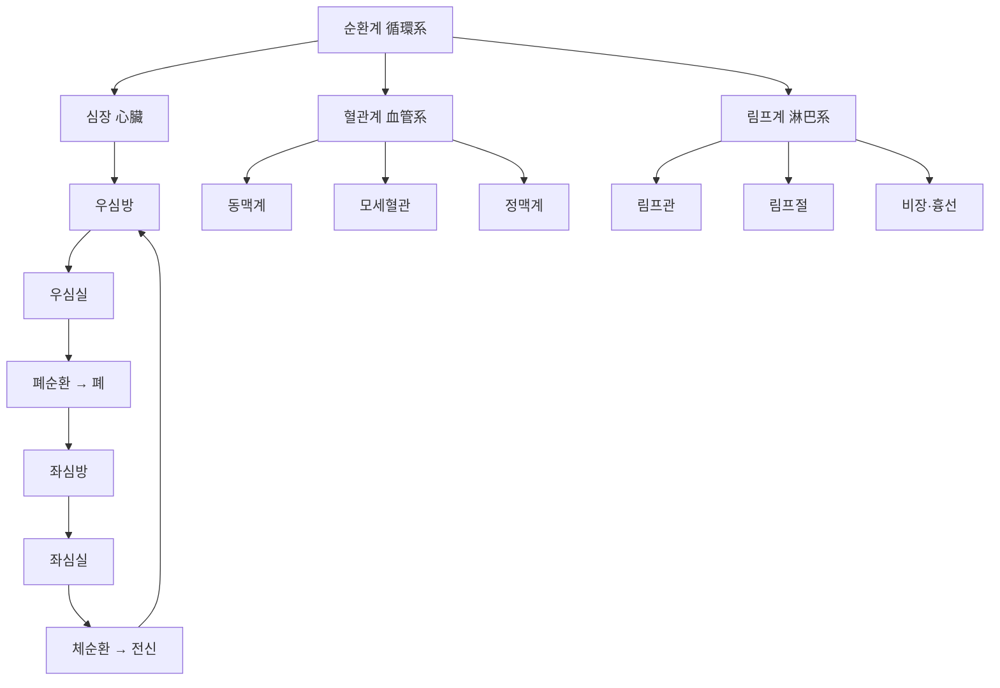
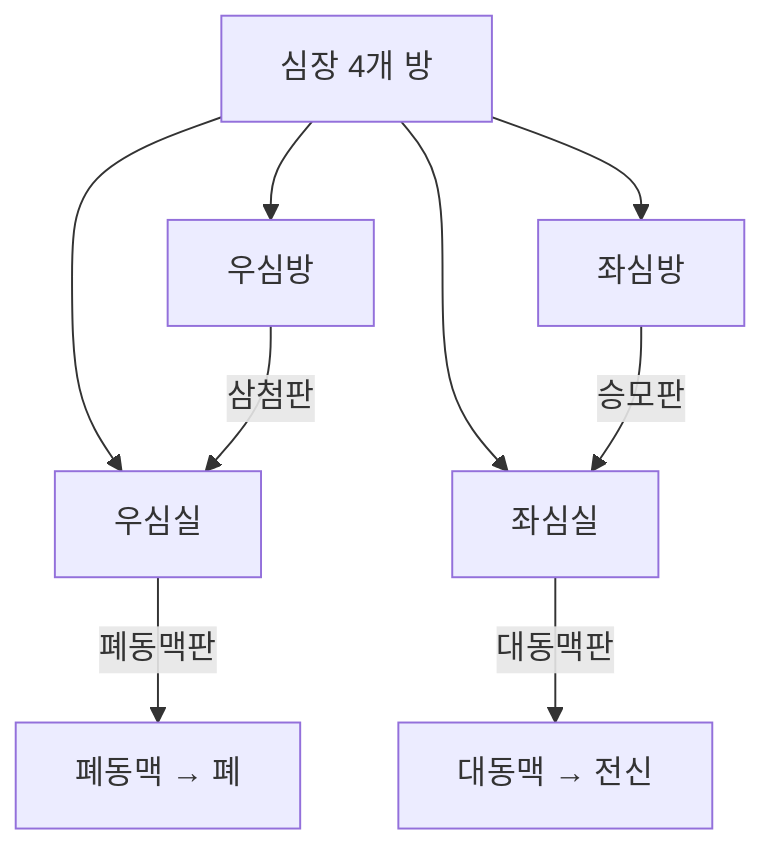
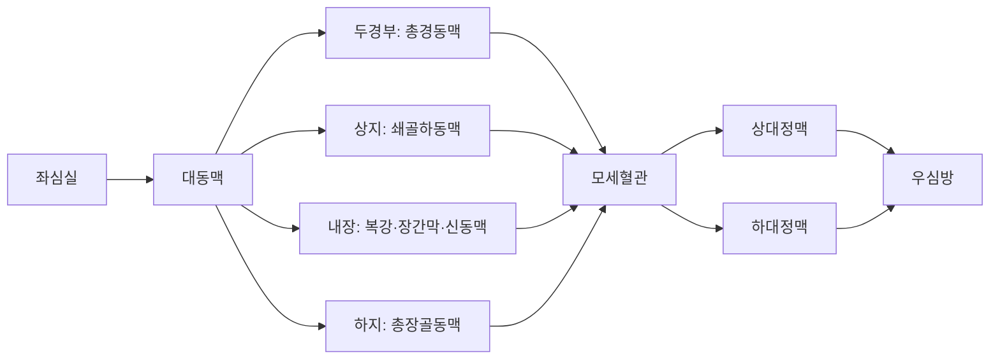
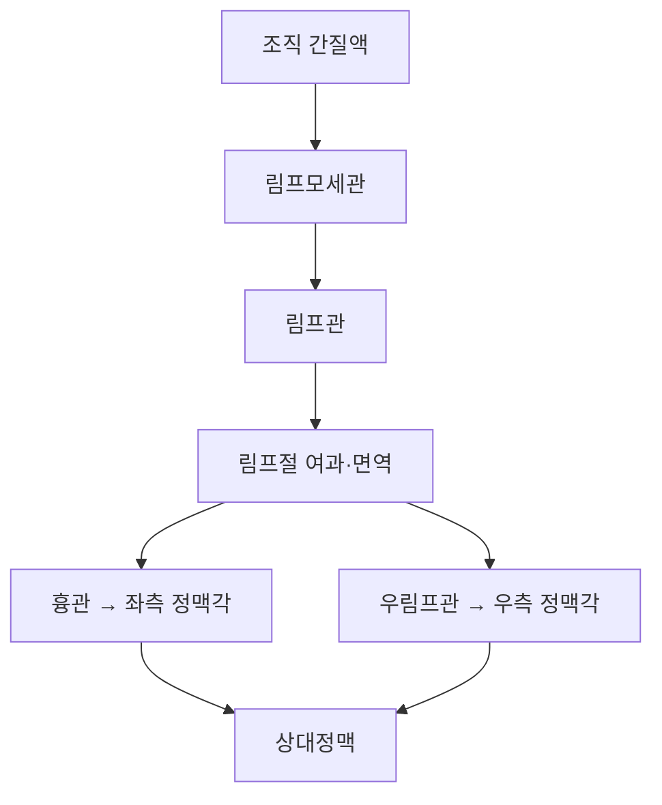

# 순환계(循環系, Circulatory System)

순환계(循環系, circulatory system)는 심장(心臟)을 펌프로 삼아 혈관계(血管系)를 통해 전신에 혈액을 순환시키고, 림프계(淋巴系)를 통해 조직액을 회수하는 통합 계통이다[교과서적 근거]. 이 위키에는 순환계를 다루는 관점이 서로 다른 문서가 이미 존재한다. 혈관(血管, Blood Vessel) 문서는 동맥·정맥·모세혈관·림프관의 육안 해부학적 분류와 주행 경로, 맥진 부위의 해부학적 대응, 경혈 부위 혈관 국소해부와 자침·방혈·부항의 안전성 근거를 상세히 각론화하였고, 한방생리학의 심(心) 문서는 "심주혈맥(心主血脈)" 이론을 중심으로 한의학 고유의 생리학적 관점을 다룬다. 이 문서는 그와 구별되는** 계통 총론(系統總論)** — 심장·혈관·림프관을 하나의 통합된 순환계로 조망하고, 심장 자체의 육안 해부학(그동안 해부학 폴더에서 "작성 예정"으로 남아 있던 항목)을 새롭게 정리하며, 계통 전체의 임상 근거 분포를 종합하는 상위 개관 — 에 집중한다.

이 문서는 총 6편으로 구성된다. 제1편은 심장·혈관·림프관을 아우르는 순환계 전체의 통합적 개관을 다룬다. 제2편은 심장(心臟)의 육안 해부(심방·심실·판막·관상동맥·전도계)를 새롭게 정리한다. 제3편은 혈관계 개관을 다루되 상세 각론은 혈관(血管, Blood Vessel) 문서로 텍스트 교차 참조한다. 제4편은 림프계(림프절·비장·흉선) 개관을 다룬다. 제5편은 임상 적용과 안전성을, 제6편은 Q&A와 고전 인용 출처로 마무리한다. 인용된 인간 대상 연구는 med.symbolicinfo.com 데이터베이스에서 수집한 것이며, 동물실험 단독 연구는 인용에서 제외하였다. 순수 해부학적 구조 서술은 `[교과서적 근거]`로 표기하고, 임상 근거는 개별 각주로 표기한다.

---

## 제1편 총론 — 심장·혈관·림프관의 통합 순환계 개관

### 1. 순환계의 세 구성 요소와 두 회로

순환계는 펌프 기능을 담당하는 심장, 혈액을 운반하는 혈관계(동맥·모세혈관·정맥), 조직액을 회수해 정맥계로 되돌리는 림프계의 세 구성 요소로 이루어진다[교과서적 근거]. 심장은 좌심실→대동맥→전신 조직→대정맥→우심방으로 이어지는 체순환(體循環)과, 우심실→폐동맥→폐→폐정맥→좌심방으로 이어지는 폐순환(肺循環)의 두 회로를 직렬로 연결하여 구동한다[교과서적 근거]. 혈관계의 상세 분류(동맥·모세혈관·정맥·림프관)와 3층 혈관벽 구조, 전신 주행 경로는 혈관(血管, Blood Vessel) 문서 제1~4편에서 이미 상세히 다루었으므로, 이 문서는 그 내용을 반복하지 않고 심장 자체의 해부와 순환계 전체의 통합적 관점에 집중한다.

### 2. 심-맥-혈의 통합적 이해 — 한방생리학 심(心) 문서와의 관계

한의학은 "심주혈맥(心主血脈)"이라 하여 심(心)이 혈(血)과 맥(脈)을 주관하며 전신에 혈액을 운행시키는 원동력이라고 본다[교과서적 근거]. 이 이론은 현대 해부학의 심장 박출·혈관 순환 개념과 상당 부분 조응하며, 안색(顔色)의 홍윤(紅潤) 여부·설질(舌質)의 색택·맥상(脈象)을 통해 심-맥-혈 축의 상태를 진찰하는 전통적 진단법의 이론적 근거가 된다. 이 이론의 상세한 생리학적 논의는 한방생리학 심(心) 문서에서 다루었으므로, 이 문서는 그 내용을 반복하지 않고 심장의 육안 해부학적 구조(제2편)와 순환계 전체의 임상 근거 종합에 집중한다.

### 3. 순환계 질환에 대한 침구 근거의 전체 지형

침구 요법이 심혈관 건강 관리에서 표준 약물 치료의 효과적인 보완 요법이 될 수 있다는 문헌 고찰이 있으며[^1], 부정맥·고혈압·관상동맥질환·심부전을 아우르는 순환계 전반에서 침구 근거가 축적되어 있다. 다만 영역별로 근거 수준의 편차가 크다 — 고혈압은 메타분석 수준의 근거가 상당히 축적된 반면, 심부전·부정맥은 아직 프로토콜·소규모 임상시험 단계에 머무른 연구가 많다.

> 순환계는 자침·방혈·부항 등 한의학적 시술이 직접 접촉하는 혈관(정맥·동맥·모세혈관)과, 시술이 간접적으로 조절하는 심장 기능(자율신경을 매개로 한 심박수·혈압 조절)이라는 두 축을 모두 포함한다. 이 문서의 제2~4편은 전자(직접 접촉 구조인 심장·대혈관)를, 제5편은 후자(간접 조절과 안전성)를 함께 다룬다.

---

## 제2편 심장(心臟) 해부 — 육안 해부학

### 4. 심장의 위치와 외형

심장(心臟, heart)은 종격동(縱隔洞) 중앙에서 약간 좌측으로 치우쳐 위치하며, 심낭(心囊, pericardium)이라는 이중막 주머니에 싸여 있다[교과서적 근거]. 심장은 좌우 두 개의 심방(心房, atrium)과 좌우 두 개의 심실(心室, ventricle)의 네 개 방으로 구성되며, 심방중격(心房中隔)과 심실중격(心室中隔)이 좌우를 나누어 정맥혈(우측)과 동맥혈(좌측)이 정상적으로는 서로 섞이지 않도록 한다[교과서적 근거].

심장벽은 안쪽부터 심내막(心內膜, endocardium, 혈액과 접하는 단층 내피)·심근(心筋, myocardium, 심장 박출력을 만드는 두꺼운 근육층으로 좌심실이 전신 혈압을 감당하기 위해 가장 두껍다)·심외막(心外膜, epicardium, 장측 심낭막과 동일)의 3층으로 구성되며, 심외막 바깥의 벽측 심낭막과의 사이 공간(심낭강)에는 소량의 심낭액이 있어 심장 박동 시 마찰을 줄인다[교과서적 근거]. 심장의 체표 투영은 흉골 뒤쪽에서 제2~6늑연골 사이에 걸쳐 있으며, 심첨박동(心尖搏動, apex beat)은 좌측 제5늑간 쇄골중선(midclavicular line) 부근에서 촉지되는 것이 정상이다[교과서적 근거]. 이 심첨 위치는 흉부 좌측 경혈(전중·유근 등)의 심자(深刺) 시 심장·심낭과의 근접성을 가늠하는 표면 지표로 참고된다.

### 5. 심장의 네 판막(瓣膜)

심장의 각 방 사이와 심실 유출로에는 혈액의 역류를 막는 네 개의 판막이 있다[교과서적 근거]. 우심방-우심실 사이의 삼첨판(三尖瓣, tricuspid valve), 좌심방-좌심실 사이의 승모판(僧帽瓣, mitral valve, 이첨판), 우심실-폐동맥 사이의 폐동맥판(肺動脈瓣, pulmonary valve), 좌심실-대동맥 사이의 대동맥판(大動脈瓣, aortic valve)이 그것이다. 삼첨판·승모판(방실판막)은 심실 내벽의 유두근(乳頭筋, papillary muscle)에서 나온 건삭(腱索, chordae tendineae)이 판막첨을 잡아당겨 심실 수축기에 판막이 심방 쪽으로 뒤집히는 것을 방지하며, 이 건삭·유두근 장치의 파열이 급성 승모판 역류의 대표적 기전이다[교과서적 근거]. 네 판막의 섬유성 고리(fibrous ring)는 심장 중심부의 섬유성 지지 구조(心臟骨格, cardiac skeleton)에 부착되어 있어 심방과 심실의 근섬유가 전기적으로 절연되고, 오직 방실결절-히스속 경로를 통해서만 흥분이 전달되게 하는 해부학적 기초를 이룬다[교과서적 근거]. 판막 개폐 시 발생하는 소리가 청진 시 제1심음(S1, 방실판막 폐쇄)·제2심음(S2, 반월판막 폐쇄)의 기초가 되며, 임상적으로 대동맥판 청진은 우측 제2늑간, 폐동맥판은 좌측 제2늑간, 삼첨판은 흉골 하단 좌측, 승모판은 심첨부(좌측 제5늑간)에서 각각 가장 잘 들린다는 청진 부위 원칙이 널리 사용된다[교과서적 근거].

### 6. 관상동맥(冠狀動脈)의 육안 해부

심장 자체에 혈액을 공급하는 관상동맥은 대동맥판 바로 위 대동맥동(aortic sinus)에서 갈라져 나온 좌관상동맥(左冠狀動脈)과 우관상동맥(右冠狀動脈)으로 구성되며, 좌관상동맥은 짧은 주간부(left main) 이후 좌전하행지(left anterior descending, LAD)와 좌회선지(left circumflex, LCx)로 분지된다[교과서적 근거]. LAD는 심실중격 앞쪽 2/3와 좌심실 앞벽을, LCx는 좌심실 측벽·후벽 일부를, 우관상동맥(RCA)은 우심방·우심실 및 대다수(약 85~90%)에서 방실결절과 후하행지(posterior descending artery)를 통해 좌심실 하벽을 관류한다는 것이 표준적인 관류 영역 구분이다[교과서적 근거] — 이 후하행지가 우관상동맥에서 나오는지 좌회선지에서 나오는지에 따라 각각 우관상동맥 우세형·좌관상동맥 우세형으로 나뉜다. 관상동맥의 정맥 환류는 대부분 관상정맥동(冠狀靜脈竇, coronary sinus)을 거쳐 우심방으로 직접 유입되며, 심장의 정맥계는 전신 정맥계와 별도의 폐쇄 경로를 이룬다[교과서적 근거]. LAD 폐쇄는 전벽 심근경색, RCA 폐쇄는 하벽 심근경색, LCx 폐쇄는 측벽 심근경색으로 각각 특징적인 심전도 유도(V1-V4, II·III·aVF, I·aVL·V5-V6)에 대응하는 것이 임상적으로 활용된다[교과서적 근거]. 이 관상동맥의 협착·폐쇄가 관상동맥성 심장질환(허혈성 심질환)의 핵심 병태생리이며, 관상동맥성 심장질환에 대한 침구 근거는 제5편에서 종합한다.

### 7. 심장 전도계(傳導系)의 육안 해부

심장은 독자적인 전기 신호 생성·전도 체계를 갖추고 있다. 우심방 상부, 상대정맥이 유입되는 지점 부근의 동방결절(洞房結節, sinoatrial node, SA node)이 심박동의 자연 기시점(pacemaker) 역할을 하며, 이 신호는 심방 내 결절간로(internodal pathway)를 따라 좌우 심방 전체로 퍼져 심방 수축을 일으키는 동시에, 우심방 하부·심실중격 상단에 위치한 방실결절(房室結節, AV node)에 도달한다[교과서적 근거]. 방실결절은 신호 전달을 약 0.1초 지연시켜 심방 수축이 끝난 뒤 심실이 수축하도록 시간차를 만드는 "관문" 역할을 하며, 이후 신호는 심실중격 내부를 주행하는 히스속(His bundle)과 좌우 다리(bundle branches), 심내막 아래로 널리 퍼지는 푸르키녜 섬유(Purkinje fibers)를 통해 매우 빠른 속도로 심실 전체에 전파되어 좌우 심실이 거의 동시에 수축하게 한다[교과서적 근거]. 이 전도계는 심전도(ECG)의 P파(심방 탈분극)·PR간격(방실결절 지연)·QRS파(심실 탈분극)·T파(심실 재분극)와 해부학적으로 대응하며, 동방결절 이상은 동기능부전증후군(sick sinus syndrome), 방실결절·히스속 전도 지연은 방실차단(atrioventricular block), 다리 손상은 각차단(bundle branch block)의 해부학적 기초가 된다[교과서적 근거]. 이 전도계의 이상이 각종 부정맥(不整脈)의 해부학적·전기생리학적 기초이며, 부정맥에 대한 침구 근거는 제5편에서 다룬다.

### 8. 심장과 자율신경 지배

심장은 교감신경(심박수·수축력 증가)과 부교감신경(미주신경, 심박수 감소)의 이중 지배를 받으며, 이 균형이 심박변이도(HRV)로 측정된다[교과서적 근거]. 이 자율신경 지배의 상세한 해부학적 경로(교감신경간·미주신경)는 신경계(神經系, Nervous System) 문서 제3편에서 다루었으므로, 이 문서는 그 내용을 반복하지 않고 심장 자체의 구조에 집중한다.

---

## 제3편 혈관계(血管系) 개관

### 9. 동맥계·정맥계의 개관과 혈관(血管) 문서와의 관계

혈관계는 심장에서 나온 혈액을 전신으로 운반하는 동맥계(대동맥·주요 분지·말단 세동맥)와, 조직에서 심장으로 되돌리는 정맥계(대정맥·주요 분지·말단 세정맥)로 구성된다[교과서적 근거]. 대동맥의 주요 분지(완두동맥간·좌총경동맥·좌쇄골하동맥 등), 두경부·상지·하지 동맥의 주행 경로, 맥진 부위(촌구맥·인영맥·충양맥·태계맥 등)의 해부학적 대응, 상대정맥계·하대정맥계의 구성, 경혈 부위 관통혈관(perforator vessel)의 해부학적 근거는 혈관(血管, Blood Vessel) 문서 제2~4편에서 이미 상세히 각론화하였으므로, 이 문서는 그 내용을 반복하지 않고 텍스트로 교차 참조한다. 아래 개념도는 대동맥에서 나온 혈류가 대정맥으로 되돌아오기까지의 큰 흐름만을 순환계 총론 수준에서 요약한 것이며, 개별 동맥·정맥의 세부 분지·문합·촉지 지표는 혈관 문서를 참조해야 한다.

### 10. 순환계 총론 관점에서 본 혈관계의 위상

혈관계는 심장이 만들어낸 압력을 전신에 전달하는 통로이자, 그 자체로 혈압·혈류를 능동적으로 조절하는 기관이다[교과서적 근거]. 고혈압(高血壓)은 심장의 박출량과 혈관의 말초저항이 함께 상승하는 상태로, 침구 임상 근거가 순환계 질환 중 가장 광범위하게 축적된 영역이다. 침 치료를 항고혈압제와 병용하는 것이 약물 단독보다 수축기·이완기 혈압 강하에 더 효과적이라는 메타분석(3,859명)[^2], 침 치료가 양약과 병행될 때 혈압을 유의하게 감소시킬 가능성을 시사한 체계적 고찰(2,539명)[^3], 침술이 표준 항고혈압제와 유사한 효과를 보이며 특히 ACE 억제제나 행동요법과 병용 시 효과율이 높았다는 네트워크 메타분석(2,649명)[^4]이 대표적이다. 다만 SHARP 임상시험(192명)은 침 치료가 가짜 침 대비 통계적으로 유의미한 차이를 보이지 않았다고 보고하였고[^5], 폐경기 여성을 대상으로 한 소규모 임상시험도 혈압·지질 개선에는 유의미한 영향이 없었다고 보고하는 등[^6], 근거가 완전히 일관되지는 않는다. 곡지(曲池, LI11)·태충(太衝, LR3) 등 특정 혈위 전침이 젊은 고혈압 환자의 혈압 변동성과 주야간 리듬을 개선했다는 임상시험[^7], 침 치료의 혈압 강하 기전이 중추·말초 교감신경 억제와 RAAS(레닌-안지오텐신-알도스테론계) 조절을 포함한 다기관-다표적 기전이라는 문헌 고찰[^8]도 있다.

### 11. 고혈압 침구 기전 연구 — 뇌영상과 신경내분비 지표

고혈압에 대한 침구 기전 연구는 뇌영상(fMRI)과 신경내분비 지표를 활용해 축적되고 있다. 태충(太衝, LR3) 침 치료가 본태성 고혈압 환자의 수축기 혈압을 유의하게 감소시키며 이것이 시상하부와 전두엽·소뇌·뇌섬엽 간 신경 네트워크 연결성 변화와 관련된다는 임상시험(30명)[^41], 태충·태계(太谿, KI3)를 병용한 자극이 단일 혈위보다 더 광범위한 뇌 영역(정서·인지·체성감각·언어·시각 관련)의 활성 변화를 유도한다는 rs-fMRI 연구(30명)[^42]가 대표적이다. 혈장의 올레산(OA)·마이오이노시톨(MI)이 고혈압의 잠재적 대사체 바이오마커이며, 침 치료를 통해 이들 수치가 정상화되면서 24시간 혈압이 유의하게 감소했다는 실험연구[^43]는 대사체 수준의 근거를 제공한다. 초기 본태성 고혈압 환자에게 침 치료가 혈압 강하뿐 아니라 심근 수축·이완 기능 개선, 심근 비대 완화 효과를 보였다는 고전적 임상시험(49명)[^44]도 있다.

곡지(曲池, LI11) 침 자극이 고혈압 환자의 심박수를 감소시키고 심박변이도를 증가시켜 심혈관계 조절에 긍정적 영향을 준다는 임상시험(60명)[^45], 침 치료가 수주에서 수개월에 걸쳐 HRV를 증가시키고 LF/HF 비율을 감소시켜 생리적 스트레스를 완화할 수 있다는 증례 연구[^46]도 자율신경 매개 기전을 뒷받침한다. 전침 치료가 1단계 고혈압 환자의 혈압을 낮추는 동시에 장내 미생물 불균형(Firmicutes/Bacteroidetes 비율)을 개선한다는 임상시험(108명)[^47]은 장-뇌-심혈관 축이라는 새로운 기전적 관점을 제시한다. 만성 신장 질환에 의한 신성 고혈압에서 침 치료와 소량의 혈압강하제 병용이 약물 단독보다 장기적으로 더 우수한 효과를 보였다는 임상시험(152명)[^48]은 이차성 고혈압에서도 보조적 근거가 있음을 보여준다. 침 치료가 항고혈압제 대비 이상반응을 비교 평가한 베이지안 네트워크 메타분석 프로토콜[^49], 기존 체계적 고찰·메타분석들을 종합한 개관 연구[^50]도 이 영역의 근거 지형을 보여준다.

> 혈관계 각론(동맥·정맥·모세혈관의 육안 구조, 자침·방혈·부항 시 혈관 손상 안전성)은 혈관(血管, Blood Vessel) 문서에서 이미 상세히 다루었으므로, 이 문서는 반복하지 않는다.

---

## 제4편 림프계(淋巴系, Lymphatic System) 개관

### 12. 림프계의 구성과 기능

림프계는 모세혈관에서 여과된 조직액(간질액)을 회수하여 정맥계(주로 좌측 정맥각, 흉관의 종착점)로 되돌리는 편도(片道) 순환계로, 림프관(淋巴管)·림프절(淋巴節)·비장(脾臟)·흉선(胸腺)·편도로 구성된다[교과서적 근거]. 림프관은 혈액을 담지 않으며 판막이 조밀하게 배치되어 있어 조직액을 한 방향(말초→중심)으로만 이동시킨다[교과서적 근거]. 하반신·좌측 상반신·좌측 두경부의 림프는 인체 최대의 림프관인 흉관(胸管, thoracic duct)에 모여 척추 앞을 상행한 뒤 좌측 정맥각(내경정맥과 쇄골하정맥의 합류점)으로 유입되고, 우측 두경부·우측 상반신의 림프는 별도로 우림프관(right lymphatic duct)을 거쳐 우측 정맥각으로 유입된다는 좌우 비대칭 구조가 임상적으로 중요하다 — 이 때문에 좌측 쇄골상와 림프절(Virchow 림프절)의 종대가 복부 장기 악성종양의 전이를 시사하는 대표적 이학적 소견으로 활용된다[교과서적 근거]. 림프관 자체의 미세 구조는 혈관(血管, Blood Vessel) 문서 제1편에서 개관하였으므로, 이 문서는 림프절·비장·흉선의 육안 해부와 임상 근거에 집중한다.

### 13. 림프절(淋巴節)의 육안 해부

림프절은 콩 모양의 작은 기관으로, 여러 개의 수입림프관(afferent lymphatic vessel)을 통해 림프액이 들어오고 피막 반대편의 문(門, hilum)에 위치한 소수의 수출림프관(efferent lymphatic vessel)을 통해서만 빠져나가는 구조를 취하여, 림프액이 반드시 림프절 내부의 피질(皮質, cortex, B림프구가 모인 림프소절 존재)과 수질(髓質, medulla, T림프구·형질세포가 많은 수질삭)을 통과하며 여과·면역감시를 받도록 설계되어 있다[교과서적 근거]. 경부·액와(겨드랑이)·서혜부(사타구니)의 림프절군이 체표에서 촉지 가능한 대표적 부위이며, 이 부위들은 감염·종양의 전이 여부를 평가하는 임상적으로 중요한 진찰 부위다[교과서적 근거]. 액와 림프절은 특히 유방암 림프 전이의 일차 경로(감시림프절, sentinel lymph node)로서 중요하며, 액와 림프절 곽청술(axillary lymph node dissection)이나 방사선치료 후 발생하는 상지 림프부종(lymphedema)은 림프계 손상의 대표적 임상 양상으로, 이에 대한 침구 근거는 아래에서 다룬다.

### 14. 유방암 관련 림프부종에 대한 침구 근거

유방암 수술 후 발생하는 상지 림프부종은 림프계 관련 침구 근거가 가장 두텁게 축적된 영역이다. 침구 치료(AMT)가 부종 증상 완화 및 수행 능력 개선에서 양방 치료·물리치료·기능 훈련보다 유의하게 효과적이고 안전하다는 메타분석[^9], 침 치료가 상지 부종을 완화하고 통증·불편감을 개선하며 총 유효율을 높인다는 메타분석(747명)[^10], 침과 뜸 요법이 팔 둘레 감소·관절 가동 범위 개선·부종 및 통증 완화에 효과적이라는 메타분석[^11]이 대표적이다. 침과 뜸을 병용하는 것이 팔 둘레 감소에 가장 효과적일 수 있다는 네트워크 메타분석(422명)[^12], 여덟 가지 침구 요법을 비교한 베이지안 네트워크 메타분석(1,976명)도 침구 병행이 증상 완화에 효과적임을 확인하였다[^13]. 온침(溫鍼) 치료가 디오스민 복용보다 유의하게 팔 둘레·삶의 질을 개선했다는 무작위 대조 시험(30명)[^14], 사암침(舍岩鍼) 치료가 부종·통증을 유의하게 감소시켰다는 관찰연구(9명)[^15]도 있다. 미국임상종양학회(ASCO)가 승인한 국제학회(SIO) 임상진료지침은 유방암 환자의 증상 관리에 침·지압을 포함한 심신 요법의 사용을 권고하고 있다[^16].

부인과 암 수술 후 골반 내 림프절 곽청술에 따른 하지 림프부종에도 침과 뜸 치료가 치료·예방에 효과적일 수 있다는 초기 보고가 있으며[^17], 림프부종 증후군 환자에게 변증에 따른 한약과 침 치료를 병행해 96%의 높은 유효율을 보인 관찰연구(27명)도 있다[^18]. 력동침(力動針) 치료를 기능적 운동과 병행하는 것이 상지 림프부종 완화와 상지 기능 개선에 효과적이라는 무작위 대조 시험(73명)[^19]도 확인된다.

### 15. 비장(脾臟)과 흉선(胸腺)의 육안 해부 — 한방생리학 비(脾) 문서와의 관계

비장은 좌상복부 늑골 아래에 위치하는 최대의 림프성 기관으로, 노후 적혈구를 제거하고 혈액을 여과하며 면역 세포를 저장하는 기능을 한다[교과서적 근거]. 흉선은 흉골 뒤 전종격동에 위치하며 T림프구의 성숙이 일어나는 곳으로, 사춘기 이후 점차 퇴화(퇴축)한다[교과서적 근거]. 여기서 다루는 비장은 서양의학적 실체 장기로서의 구조에 한정되며, 한의학의 "비주운화(脾主運化)" 이론이 가리키는 소화·흡수 기능은 현대 해부학의 비장이 아니라 췌장·소장의 기능과 더 밀접하게 대응된다는 점은 한방생리학 비(脾) 문서에서 상세히 논의하였다.

> 이 편은 림프계의 육안 구조와 유방암 관련 림프부종이라는 대표 임상 영역에 집중하였다. 림프절·비장·흉선의 상세한 조직학적 미세구조(림프소절·배중심 등)는 조직학 폴더 문서에서 다룬다.

---

## 제5편 임상 적용과 안전성

### 16. 관상동맥성 심장질환(冠狀動脈性 心臟疾患)에 대한 침구 근거

관상동맥성 심장질환은 협심증(狹心症)을 중심으로 침구 근거가 축적되어 있다. 침 치료나 팔단금(八段錦) 등 TCM 운동·정서 요법을 표준 치료와 병행하는 것이 증상 개선과 삶의 질 향상에 효과적이고 안전하다는 체계적 고찰[^20], 표준 치료와 침 치료 병행이 당지질 대사 지표(LDL-C, HbA1c 등)를 유의하게 개선한다는 메타분석(1,346명)[^21]이 있다. 내관(內關, PC6)과 심수(心兪, BL15) 전침이 관상동맥성 심장질환 환자의 허혈 심근 관류를 증가시켰다는 SPECT 연구(59명)[^22], PCI(경피적 관상동맥 중재술) 전후 내관·극문(郄門, PC4) 경피혈위전자극(TEAS)이 혈관 내피 기능을 개선하고 염증 인자를 낮췄다는 임상시험(94명)[^23]도 있다. 우울증 환자에게 시행한 침 치료가 관상동맥성 심장질환 발생 위험을 유의하게 낮췄다는 대규모 코호트 연구(29,294명)[^24], 류마티스 관절염 환자의 침 치료가 관상동맥성 심장질환 발생 위험을 낮췄다는 대만 전국 코호트 연구(29,741명)[^25]는 침구 치료가 심혈관계 위험 인자 관리에 간접적으로 기여할 가능성을 시사한다. 내관(PC6) 혈위를 활용한 침 치료의 임상적 근거를 정리한 주사적 고찰(scoping review)도 있다[^26].

### 17. 심부전(心不全)에 대한 침구 근거

심부전 영역은 아직 프로토콜·소규모 연구 단계의 근거가 많다. 침과 뜸 치료를 약물 치료와 병행했을 때 좌심실 박출률(LVEF)·심박출량(CO)이 개선되고 BNP 수치가 감소했다는 메타분석(2,499명)[^27], 침 치료가 운동 능력·삶의 질·혈역학적 지표·NT-proBNP를 개선하고 급성 심부전 환자의 ICU 체류 기간·재입원율을 낮추는 경향을 보였다는 체계적 고찰[^28]이 있다. 표준 약물 치료와 전침 병행이 박출률 감소 심부전(HFrEF) 환자의 LVEF·6분 보행 거리·삶의 질(KCCQ-23)을 유의하게 개선했다는 무작위 대조 시험(34명)[^29], 심부전을 새로 진단받은 환자에게 침 치료를 병행하는 것이 전원인 사망 위험을 낮출 수 있다는 대규모 코호트 연구(42,002명)[^30], 심부전 환자가 진단 초기(1년 이내) 침 치료를 병행하는 것이 순환기 질환·전체 사망률을 낮추는 것과 연관된다는 코호트 연구(8,630명)[^31]도 있다. 심신 중재법(태극권·요가·침 치료)이 심부전 환자의 삶의 질·운동 능력·심리 상태·일부 생리 지표를 소폭에서 중등도로 개선한다는 체계적 고찰(1,314명)[^32]도 확인된다.

### 18. 부정맥(不整脈)에 대한 침구 근거

부정맥에서는 항부정맥제와의 병용·비교 연구가 중심을 이룬다. 침 치료를 경구 중약과 병용하는 것이 임상적 유효성·조기박동 수 감소·전환율·좌심실 구출률 개선 측면에서 더 효과적이고 안전하다는 메타분석(804명)[^33], 심부정맥 환자의 침 치료가 대조군 대비 유의미한 이상반응 증가 없이 안전한 보조 요법이 될 수 있다는 최신 메타분석(356명)[^34]이 있다. 발작성 상심실성 빈맥(PSVT)에서 침 치료가 기존 약물 치료와 유사한 효과를 보였고 심실 조기 수축(VPB)에서는 항부정맥제 단독보다 침 병행이 더 효과적이었다는 메타분석(797명)[^35], 침치료가 심실조기수축 환자에게 항부정맥제와 병용 시 치료 반응률을 높이는 보조 수단으로 유용하고 심방세동(Af) 환자에게도 안전한 대안이 될 가능성이 있다는 체계적 고찰(638명)[^36]도 있다. 급성 심방세동 환자에게 이침(耳鍼)과 내관(PC6) 자침으로 약물 없이 동리듬 전환을 유도한 증례[^37], 내관혈 침 치료로 부정맥 환자의 HRV를 조절한 증례[^38]도 있다. 흉강경 수술 전후 전침이 상심실성 빈맥 발생률을 낮추고 수면의 질을 개선했다는 무작위 대조 시험(77명)[^39], TEAS가 복강경 수술 시 이산화탄소 기복으로 인한 심전도 복극 이상을 억제해 수술 중 부정맥 위험을 낮췄다는 임상시험(60명)[^40]은 주술기(周術期) 부정맥 예방이라는 특수한 임상 맥락에서의 근거를 보여준다.

### 19. 침구 시술의 심혈관계 안전성 — 심낭·대혈관 손상

심장 자체와 그 주변 대혈관은 침구 시술이 직접 접촉하는 대상은 아니지만, 흉부 깊은 심자(深刺)는 극히 드물게 심낭·대혈관까지 도달할 위험이 있다[교과서적 근거]. 흉부·경부 대혈관 손상(가성동맥류·혈종 등)에 대한 상세한 증례와 안전성 근거는 혈관(血管, Blood Vessel) 문서 제5편에서 이미 종합하였으므로, 이 문서는 그 내용을 반복하지 않는다. 순환계 총론 관점에서 강조할 점은, 자침으로 유발된 미주신경 반사가 서맥·부정맥을 유발해 극단적으로는 사망에 이른 부검 증례가 있다는 것으로[교과서적 근거, 신경계 문서 참조], 기저 심장질환(부정맥·전도장애)이 있는 환자에서는 경부·이개 자극에 특히 신중해야 한다.

### 20. 안전성 표

| 위험 요소 | 관련 구조·부위 | 내용 | 근거 |
|---|---|---|---|
| 대혈관·심낭 손상 | 흉부 심자 | 극히 드문 대혈관 손상, 가성동맥류(혈관 문서 참조) | (혈관 문서 참조) |
| 미주신경 반사성 서맥·부정맥 | 경부·이개 자극 | 서맥·실신, 기저 심질환자에서 위험 증대 | (신경계 문서 참조) |
| 항부정맥제·항고혈압제 병용 | 전신 | 침 치료가 약물과 병용 시 이상반응 증가는 보고되지 않음 | [^33][^34] |
| 항응고제 병용 환자의 혈종 | 자침 부위 전반 | 항응고요법 병용 시 혈관 손상 위험 증가(혈관 문서 참조) | (혈관 문서 참조) |
| 근거 수준의 한계 | 심부전·부정맥 영역 | 프로토콜·소규모 연구 위주로 방법론적 질이 제한적 | [^27][^33] |

**이 표는 임상 틀이지 동일 근거수준의 권고가 아니다.** 심혈관계 관련 침구 안전성 근거는 극히 드문 중대 합병증(대혈관 손상·치명적 부정맥)과 상대적으로 흔한 경증 반응(일시적 서맥·현훈)이 혼재되어 있으며, 기저 심질환·항응고제/항혈소판제 복용 여부에 따라 위험도가 달라지므로 시술 전 개별 평가가 필요하다. 변증 없는 관행적 취혈·자침은 근거에 부합하지 않으며, 심혈관계 기저질환이 있는 환자는 특히 변증과 해부학적 위치를 함께 고려한 신중한 시술이 요구된다.

### 21. 순환계 질환군별 근거 수준 요약

| 영역 | 대표 근거 수준 | 대표 지표 |
|---|---|---|
| 본태성 고혈압 | 메타분석·네트워크 메타분석 다수(결과 일부 불일치) | 수축기/이완기 혈압, HRV(LF/HF) |
| 관상동맥성 심장질환(협심증) | 체계적 고찰·메타분석 | 심전도 ST분절, 심근 관류(SPECT), 당지질 지표 |
| 심부전 | 메타분석(소규모 연구 위주) | LVEF, BNP/NT-proBNP, 6분 보행 거리 |
| 부정맥 | 메타분석(항부정맥제 병용 비교 중심) | 조기박동 수, 동리듬 전환율, Holter 모니터링 |
| 유방암 관련 림프부종 | 메타분석·네트워크 메타분석 | 사지 둘레, 관절 가동 범위, 통증 VAS |

**이 표는 임상 틀이지 동일 근거수준의 권고가 아니다.** 고혈압조차 SHARP 임상시험처럼 가짜 침 대비 유의성을 확인하지 못한 대규모 연구가 있어[^5], 메타분석의 존재가 곧 확정적 효과를 의미하지는 않는다.

---

## 제6편 Q&A, 환자 설명, 고전 인용 출처

### 22. 순환계 질환군별 추적 지표표

| 영역 | 추적 지표 |
|---|---|
| 고혈압 | 24시간 활동혈압, HRV(LF/HF, SDNN) |
| 관상동맥성 심장질환 | 심전도, 트로포닌, 지질 패널(LDL-C·TC·TG) |
| 심부전 | LVEF(심초음파), BNP/NT-proBNP, 6분 보행 거리, KCCQ 삶의 질 지표 |
| 부정맥 | Holter 심전도, 조기박동 수, 동리듬 유지율 |
| 림프부종 | 사지 둘레(cm), 관절 가동 범위(ROM), VAS |

**이 표는 임상 틀이지 동일 근거수준의 권고가 아니다.** 각 지표는 표준 심장내과·혈관외과 진료의 일부로 이미 사용되는 지표이며, 침구 치료 효과 판정 시에도 동일한 도구로 반복 측정하는 것이 중요하다.

### 23. 환자 설명용 요약

> 순환계는 심장이라는 펌프와 온몸에 뻗어 있는 혈관(동맥·정맥)과 조직의 부기를 배출하는 림프관으로 이루어진, 우리 몸의 "물류 시스템"입니다. 고혈압·부정맥·심부전처럼 순환계에 이상이 생겼을 때, 침 치료는 심장이나 혈관 자체의 구조적 문제를 대신 고치는 것이 아니라, 자율신경 균형을 조절하고 혈관 기능을 보조하여 표준 치료(약물·재활)의 효과를 더하는 역할을 합니다. 유방암 수술 후 팔이 붓는 림프부종처럼 순환계의 특정 부위 문제에는 침·뜸 치료가 비교적 근거가 잘 축적되어 있어 적극적으로 고려할 수 있습니다. 다만 심장 질환이 있는 경우 반드시 담당 심장내과 의사와 상의하며 치료를 병행해야 합니다.

**Q1. 심장 질환이 있는 환자에게 침을 놓아도 안전한가?**

일반적으로 침 치료 자체는 안전한 것으로 보고되지만, 항부정맥제·항응고제를 복용 중인 환자, 인공심박동기를 삽입한 환자는 시술 전 개별 평가가 필요하다. 부정맥 환자에게 침 치료를 병행했을 때 이상반응 증가가 보고되지 않았다는 메타분석이 있으나[^34], 심낭·대혈관 근접 부위의 심자는 피해야 한다.

**Q2. 고혈압 환자가 침 치료만으로 항고혈압제를 끊어도 되는가?**

아니다. 다수의 메타분석이 침 치료를 약물과** 병용** 했을 때의 유의한 혈압 강하 효과를 보고하고 있으나[^2][^3], 침 단독으로 약물을 대체할 수 있다는 근거는 없다. 항고혈압제는 뇌졸중·심근경색 등 중대한 합병증 예방을 위해 유지되어야 하며, 침구는 보조 요법으로 위치해야 한다.

**Q3. 부정맥에 대한 침구 치료는 심전도 이상을 정말 교정하는가?**

일부 연구는 조기박동 수 감소, 심방세동의 동리듬 전환 촉진 등 구체적인 전기생리학적 지표 개선을 보고하지만[^33][^36], 다수는 항부정맥제와의 병용 효과를 다루고 있어 침 단독의 독립적 항부정맥 효과로 단정하기는 이르다.

**Q4. 유방암 수술 후 림프부종에 침을 놓아도 안전한가?**

수술받은 쪽 팔에 직접 자침하는 것에 대한 우려가 있으나, 다수의 임상시험·메타분석이 환측 팔 또는 인근 부위 자침을 포함한 프로토콜에서 안전성 문제를 크게 보고하지 않았다[^9][^11]. 다만 개인차가 있으므로 시술 전 림프부종 병력·중증도를 확인해야 한다.

**Q5. 심부전 환자에게 침구 치료를 시행하면 심장 기능이 실제로 좋아지는가?**

LVEF·BNP 등 심장 기능 지표의 개선을 보고한 메타분석이 있으나[^27], 대부분 소규모 연구이고 방법론적 질이 제한적이다. 표준 심부전 치료(약물·재활)를 유지하면서 보조적으로 병행하는 것이 근거에 부합하는 접근이다.

**Q6. 고혈압에 특정 혈위(태충·곡지 등)를 쓰면 다른 혈위보다 더 효과적인가?**

일부 fMRI 연구는 태충(太衝, LR3) 등 특정 혈위 자극이 시상하부-전두엽-소뇌 연결성 변화와 관련된다고 보고하지만[^7], 이는 국소해부·기전 연구 수준이며, 특정 혈위가 다른 혈위보다 임상적으로 우월하다는 확정적 결론을 내리기는 어렵다. 변증에 따른 배혈이 우선되어야 한다.

**Q7. 순환계 질환에 방혈·부항 요법을 적용해도 되는가?**

방혈·부항은 표층 미세혈관을 대상으로 하는 시술로, 심부 대혈관·심장 자체와는 겨냥하는 층위가 다르다. 다만 항응고제 복용 환자나 출혈 경향이 있는 환자에서는 신중해야 하며, 상세한 안전성 근거는 혈관(血管, Blood Vessel) 문서에서 다루었다.

---

**고전 인용 출처** : 『黃帝內經素問』(五藏生成篇, 脈要精微論), 『靈樞』(決氣篇, 邪客篇), 『東醫寶鑑』(內景篇).
**문헌 데이터 출처** : [한의학 논문 데이터베이스 (med.symbolicinfo.com)](https://med.symbolicinfo.com) — 2026-08-25 조회 기준

[^1]: Acupuncture in Traditional Chinese Medicine: A Complementary Approach for Cardiovascular Health. Wang S 외. _Journal of multidisciplinary healthcare_. 2024. [문헌 고찰] [DOI 10.2147/JMDH.S476319](https://doi.org/10.2147/JMDH.S476319) [PMID 39050695](https://pubmed.ncbi.nlm.nih.gov/39050695/) — 침 요법이 심혈관 질환 관리에서 표준 약물 치료의 효과적인 보완 요법이 될 수 있다.
[^2]: Randomized controlled trials of acupuncture for the treatment of essential hypertension: a meta-analysis. Yuqing Lu 외. _Journal of Acupuncture and Tuina Science_. 2022-11-04. [메타분석, 3859명] [DOI 10.1007/s11726-022-1330-8](https://doi.org/10.1007/s11726-022-1330-8) — 침 치료를 항고혈압제와 병용하는 것이 약물 단독 요법보다 혈압 강하에 더 효과적이며, 침 단독 요법도 유의한 혈압 강하와 낮은 부작용을 보였다.
[^3]: Acupuncture for essential hypertension. Wang J 외. _International journal of cardiology_. 2013-11-20. [체계적 고찰, 2539명] [DOI 10.1016/j.ijcard.2013.09.001](https://doi.org/10.1016/j.ijcard.2013.09.001) [PMID 24060112](https://pubmed.ncbi.nlm.nih.gov/24060112/) — 침 치료가 양약과 병행될 때 수축기·이완기 혈압을 유의하게 감소시킬 가능성이 있다.
[^4]: Acupuncture therapy for essential hypertension: a network meta-analysis. Tan X 외. _Annals of translational medicine_. 2019-06. [메타분석, 2649명] [DOI 10.21037/atm.2019.05.59](https://doi.org/10.21037/atm.2019.05.59) [PMID 31355233](https://pubmed.ncbi.nlm.nih.gov/31355233/) — 침술이 항고혈압제와 유사한 효과를 보이며 ACE 억제제·행동요법 병용 시 효과율이 높았다.
[^5]: Stop Hypertension with the Acupuncture Research Program (SHARP): results of a randomized, controlled clinical trial. Macklin EA 외. _Hypertension_. 2006-11. [임상시험, 192명] [DOI 10.1161/01.HYP.0000241090.28070.4c](https://doi.org/10.1161/01.HYP.0000241090.28070.4c) [PMID 17015784](https://pubmed.ncbi.nlm.nih.gov/17015784/) — 개별화 또는 표준화된 침 치료가 가짜 침 대비 통계적으로 유의한 혈압 강하 차이를 보이지 않았다.
[^6]: [Effect of a standardized acupuncture treatment on complains, blood pressure and serum lipids of hypertensive, postmenopausal women. A randomized, controlled clinical study]. Kraft K 외. _Forschende Komplementarmedizin_. 1999-04. [임상시험, 10명] [DOI 10.1159/000021223](https://doi.org/10.1159/000021223) [PMID 10352369](https://pubmed.ncbi.nlm.nih.gov/10352369/) — 표준화된 침 치료가 주관적 증상은 개선했으나 혈압·혈청 지질에는 유의미한 영향이 없었다.
[^7]: [Effect of electroacupuncture on Quchi (LI 11) and Taichong (LR 3) on blood pressure variability in young patients with hypertension]. Yang DH. _Zhongguo zhen jiu = Chinese acupuncture & moxibustion_. 2010-07. [임상시험, 60명] [PMID 20862935](https://pubmed.ncbi.nlm.nih.gov/20862935/) — 곡지(LI11)·태충(LR3) 전침이 젊은 고혈압 환자의 혈압 변동성 감소와 주야간 리듬 개선에 효과적이다.
[^8]: [Review of the mechanism of essential hypertension treated by acupuncture]. Wang J 외. _Zhongguo zhen jiu = Chinese acupuncture & moxibustion_. 2019-02-12. [문헌 고찰] [DOI 10.13703/j.0255-2930.2019.02.031](https://doi.org/10.13703/j.0255-2930.2019.02.031) [PMID 30942045](https://pubmed.ncbi.nlm.nih.gov/30942045/) — 침 치료는 중추·말초 교감신경 억제, RAAS 조절, 혈관 기능 개선 등 다기관-다표적 기전으로 혈압을 강하시킨다.
[^9]: Effectiveness and Safety of Acupuncture Moxibustion Therapy Used in Breast Cancer‐Related Lymphedema: A Systematic Review and Meta‐Analysis. Huimin Jin 외. _Evidence-Based Complementary and Alternative Medicine_. 2020-01. [메타분석] [DOI 10.1155/2020/3237451](https://doi.org/10.1155/2020/3237451) — 침구 치료가 부종 증상 완화·수행 능력 개선에서 양방 치료·물리치료·기능 훈련보다 유의하게 효과적이고 안전하다.
[^10]: Acupuncture therapy for breast cancer-related lymphedema: A systematic review and meta-analysis. Hou W 외. _The journal of obstetrics and gynaecology research_. 2019-12. [메타분석, 747명] [DOI 10.1111/jog.14122](https://doi.org/10.1111/jog.14122) [PMID 31608558](https://pubmed.ncbi.nlm.nih.gov/31608558/) — 침 치료가 상지 부종을 완화하고 통증·불편감을 개선하며 총 유효율을 유의하게 높인다.
[^11]: Effects of Acupuncture and Moxibustion on Breast Cancer-Related Lymphedema: A Systematic Review and Meta-Analysis of Randomized Controlled Trials. Gao Y 외. _Integrative cancer therapies_. 2026-08-14. [메타분석] [DOI 10.1177/15347354211044107](https://doi.org/10.1177/15347354211044107) [PMID 34521235](https://pubmed.ncbi.nlm.nih.gov/34521235/) — 침·뜸 치료가 팔 둘레 감소·어깨 관절 가동 범위 개선·부종 및 통증 완화에 효과적이다.
[^12]: The efficacy and safety of acupuncture and moxibustion for breast cancer lymphedema: a systematic review and network meta-analysis. Wang S 외. _Gland surgery_. 2023-02-28. [메타분석, 422명] [DOI 10.21037/gs-22-767](https://doi.org/10.21037/gs-22-767) [PMID 36915814](https://pubmed.ncbi.nlm.nih.gov/36915814/) — 침·뜸 병용이 팔 둘레 감소에 가장 효과적일 수 있다.
[^13]: Effect of eight different acupuncture and moxibustion therapies on breast cancer-related lymphedema: a Bayesian network meta-analysis. Zhang D 외. _Supportive care in cancer_. 2025-09-13. [메타분석, 1976명] [DOI 10.1007/s00520-025-09861-4](https://doi.org/10.1007/s00520-025-09861-4) [PMID 40944772](https://pubmed.ncbi.nlm.nih.gov/40944772/) — 재활 치료와 침·뜸 병행이 유방암 관련 림프부종 증상 완화에 효과적이다.
[^14]: Effects of Warm Acupuncture on Breast Cancer–Related Chronic Lymphedema: A Randomized Controlled Trial. C. Yao 외. _Current Oncology_. 2016-02-01. [임상시험, 30명] [DOI 10.3747/co.23.2788](https://doi.org/10.3747/co.23.2788) — 온침 치료가 디오스민 복용보다 팔 둘레 감소·삶의 질 개선에 유의하게 효과적이다.
[^15]: Treatment of Lymphedema with Saam Acupuncture in Patients with Breast Cancer: A Pilot Study. Young Ju Jeong 외. _Medical Acupuncture_. 2015-06-01. [관찰연구, 9명] [DOI 10.1089/acu.2014.1071](https://doi.org/10.1089/acu.2014.1071) — 사암침 치료로 부종 정도와 주관적 통증·불편감이 유의하게 감소하였다.
[^16]: Integrative Therapies During and After Breast Cancer Treatment: ASCO Endorsement of the SIO Clinical Practice Guideline. Lyman GH 외. _Journal of clinical oncology_. 2018-09-01. [임상진료지침] [DOI 10.1200/JCO.2018.79.2721](https://doi.org/10.1200/JCO.2018.79.2721) [PMID 29889605](https://pubmed.ncbi.nlm.nih.gov/29889605/) — 유방암 환자의 증상 관리에 침·지압을 포함한 심신 요법 사용이 권고된다.
[^17]: Effectiveness of Acupuncture and Moxibustion Treatment for Lymphedema Following Intrapelvic Lymph Node Dissection: A Preliminary Report. Yoichi Kanakura 외. _The American Journal of Chinese Medicine_. 2002-01. [증례 보고, 24명] [DOI 10.1142/s0192415x02000041](https://doi.org/10.1142/s0192415x02000041) — 부인과 암 수술 후 하지 림프부종 치료·예방에 침·뜸이 효과적일 수 있다.
[^18]: [Observation on 27 elderly women in britain with lymphedema syndrome treated by acupuncture combined with medicine]. Yang XH 외. _Zhongguo zhen jiu = Chinese acupuncture & moxibustion_. 2009-12. [관찰연구, 27명] [PMID 20088421](https://pubmed.ncbi.nlm.nih.gov/20088421/) — 변증에 따른 한약과 침 치료 병행이 96%의 유효율을 보였다.
[^19]: [Lidong needling therapy combined with functional exercise in treatment of upper limb lymphedema after breast cancer surgery: a randomized controlled trial]. Zhao W 외. _Zhongguo zhen jiu = Chinese acupuncture & moxibustion_. 2023-10-12. [임상시험, 73명] [DOI 10.13703/j.0255-2930.20230330-0022](https://doi.org/10.13703/j.0255-2930.20230330-0022) [PMID 37802517](https://pubmed.ncbi.nlm.nih.gov/37802517/) — 력동침 치료를 기능적 운동과 병행하는 것이 상지 림프부종 완화·상지 기능 개선에 효과적이다.
[^20]: Effects and Safety of Non-Pharmacological Therapies of Traditional Chinese Medicine for Coronary Heart Disease: An Overview of Systematic Reviews. Weiqiang Ji 외. _Evidence-Based Complementary and Alternative Medicine_. 2022-03-19. [체계적 고찰] [DOI 10.1155/2022/8465269](https://doi.org/10.1155/2022/8465269) — 침 치료나 팔단금 등 TCM 운동·정서 요법을 표준 치료와 병행하는 것이 증상 개선·삶의 질 향상에 효과적이고 안전하다.
[^21]: Effectiveness of acupuncture on glycolipid metabolism in patients with coronary heart disease: A systematic review and meta-analysis. Sun Y 외. _Complementary therapies in medicine_. 2025-03. [메타분석, 1346명] [DOI 10.1016/j.ctim.2024.103115](https://doi.org/10.1016/j.ctim.2024.103115) [PMID 39615634](https://pubmed.ncbi.nlm.nih.gov/39615634/) — 표준 치료와 침 치료 병행이 LDL-C·HbA1c·TC·TG 등 당지질 대사 지표를 유의하게 개선한다.
[^22]: [Treating coronary heart disease by acupuncture at neiguan (PC6) and xinahu (BL15): an efficacy assessment by SPECT]. Gao Z 외. _Zhongguo Zhong xi yi jie he za zhi_. 2013-09. [임상시험, 59명] [PMID 24273972](https://pubmed.ncbi.nlm.nih.gov/24273972/) — 내관·심수 전침이 허혈 심근 관류를 증가시킴을 SPECT로 확인하였다.
[^23]: [Effect of transcutaneous electric acupoints stimulation on vascular endothelial function and inflammatory factors after percutaneous coronary intervention]. Zhao FC 외. _Zhen ci yan jiu = Acupuncture research_. 2021-08-25. [임상시험, 94명] [DOI 10.13702/j.1000-0607.200784](https://doi.org/10.13702/j.1000-0607.200784) [PMID 34472754](https://pubmed.ncbi.nlm.nih.gov/34472754/) — PCI 전후 내관·극문 TEAS가 혈관 내피 기능을 개선하고 염증 인자를 낮춘다.
[^24]: Acupuncture Treatment Reduced the Risk of Coronary Heart Disease in Patients with Depression: A Propensity-Score Matched Cohort Study. Huang CY 외. _Neuropsychiatric disease and treatment_. 2021. [관찰연구, 29294명] [DOI 10.2147/NDT.S315572](https://doi.org/10.2147/NDT.S315572) [PMID 34285491](https://pubmed.ncbi.nlm.nih.gov/34285491/) — 우울증 환자의 침 치료가 관상동맥성 심장질환 발생 위험을 유의하게 낮췄다.
[^25]: Acupuncture decreased the risk of coronary heart disease in patients with rheumatoid arthritis in Taiwan: a Nationwide propensity score-matched study. Wu MY 외. _BMC complementary and alternative medicine_. 2018-12-22. [관찰연구, 29741명] [DOI 10.1186/s12906-018-2384-5](https://doi.org/10.1186/s12906-018-2384-5) [PMID 30577824](https://pubmed.ncbi.nlm.nih.gov/30577824/) — 류마티스 관절염 환자의 침 치료가 관상동맥성 심장질환 발생 위험을 낮췄다.
[^26]: Acupuncture at Neiguan Acupoint (PC6) for Coronary Heart Disease: A Scoping Review. Yue JH 외. _Medical acupuncture_. 2025-10. [체계적 고찰] [DOI 10.1089/acu.2024.0008](https://doi.org/10.1089/acu.2024.0008) [PMID 41573021](https://pubmed.ncbi.nlm.nih.gov/41573021/) — 내관(PC6) 혈위를 활용한 침 치료의 임상적 근거를 정리하였다.
[^27]: The Effect of Acupuncture and Moxibustion on Heart Function in Heart Failure Patients: A Systematic Review and Meta-Analysis. Liang B 외. _Evidence-based complementary and alternative medicine : eCAM_. 2019. [메타분석, 2499명] [DOI 10.1155/2019/6074967](https://doi.org/10.1155/2019/6074967) [PMID 31772597](https://pubmed.ncbi.nlm.nih.gov/31772597/) — 침·뜸 병행이 LVEF·CO 개선, BNP 감소 등 심장 기능 지표를 유의하게 향상시킨다.
[^28]: Acupuncture for heart failure: A systematic review of clinical studies. Lee H 외. _International journal of cardiology_. 2016-11-01. [체계적 고찰] [DOI 10.1016/j.ijcard.2016.07.195](https://doi.org/10.1016/j.ijcard.2016.07.195) [PMID 27500758](https://pubmed.ncbi.nlm.nih.gov/27500758/) — 침 치료가 운동 능력·삶의 질·혈역학적 지표·NT-proBNP를 개선하고 ICU 체류·재입원율을 낮추는 경향을 보였다.
[^29]: Electroacupuncture and conventional drugs treatment combination improved quality of life in patients with heart failure reduced ejection fraction: a single-blinded randomized controlled trial. Supriyana DS 외. _The Egyptian heart journal_. 2025-10-29. [임상시험, 34명] [DOI 10.1186/s43044-025-00698-0](https://doi.org/10.1186/s43044-025-00698-0) [PMID 41162792](https://pubmed.ncbi.nlm.nih.gov/41162792/) — 표준 약물과 전침 병행이 HFrEF 환자의 LVEF·6MWD·KCCQ-23을 유의하게 개선한다.
[^30]: Impact of acupuncture on mortality in patients with disabilities and newly diagnosed heart failure: a nationwide cohort study. Jun H 외. _Frontiers in medicine_. 2025. [관찰연구, 42002명] [DOI 10.3389/fmed.2025.1519588](https://doi.org/10.3389/fmed.2025.1519588) [PMID 39944496](https://pubmed.ncbi.nlm.nih.gov/39944496/) — 심부전을 새로 진단받은 장애인 환자에게 침 치료 병행이 전원인 사망 위험을 유의하게 낮춘다.
[^31]: Association between acupuncture treatment exposure and mortality in patients with heart failure: a nationwide cohort study. Jun H 외. _Frontiers in cardiovascular medicine_. 2025. [관찰연구, 8630명] [DOI 10.3389/fcvm.2025.1461302](https://doi.org/10.3389/fcvm.2025.1461302) [PMID 40734980](https://pubmed.ncbi.nlm.nih.gov/40734980/) — 진단 초기 침 치료 병행이 순환기 질환·전체 사망률을 낮추는 것과 연관된다.
[^32]: Mind-Body Interventions for Individuals With Heart Failure: A Systematic Review of Randomized Trials. Gok Metin Z 외. _Journal of cardiac failure_. 2018-03. [체계적 고찰, 1314명] [DOI 10.1016/j.cardfail.2017.09.008](https://doi.org/10.1016/j.cardfail.2017.09.008) [PMID 28939458](https://pubmed.ncbi.nlm.nih.gov/28939458/) — 심신 중재법(태극권·요가·침 치료)이 심부전 환자의 삶의 질·운동 능력·심리 상태·생리 지표를 소폭에서 중등도로 개선한다.
[^33]: Efficacy of acupuncture combined with oral Chinese medicine in the treatment of arrhythmia: A meta-analysis. Sisi Ning 외. _Medicine_. 2023-03-24. [메타분석, 804명] [DOI 10.1097/md.0000000000033174](https://doi.org/10.1097/md.0000000000033174) — 침 치료 병행이 임상적 유효성·조기박동 수 감소·전환율·좌심실 구출률 개선에 더 효과적이고 안전하다.
[^34]: Acupuncture for cardiac arrhythmias: A systematic review and meta-analysis. Yuan Liang 외. _Medicine_. 2026-06-19. [메타분석, 356명] [DOI 10.1097/md.0000000000049187](https://doi.org/10.1097/md.0000000000049187) — 심부정맥 환자의 침 치료는 대조군 대비 유의미한 이상반응 증가 없이 안전한 보조 요법 가능성을 보인다.
[^35]: Comparative Effectiveness of Acupuncture and Antiarrhythmic Drugs for the Prevention of Cardiac Arrhythmias: A Systematic Review and Meta-analysis of Randomized Controlled Trials. Li Y 외. _Frontiers in physiology_. 2017. [메타분석, 797명] [DOI 10.3389/fphys.2017.00358](https://doi.org/10.3389/fphys.2017.00358) [PMID 28642714](https://pubmed.ncbi.nlm.nih.gov/28642714/) — 침 치료가 PSVT에서 약물과 유사한 효과, VPB에서 항부정맥제 단독보다 병용이 더 효과적이다.
[^36]: Conventional Acupuncture for Cardiac Arrhythmia: A Systematic Review of Randomized Controlled Trials. Liu J 외. _Chinese journal of integrative medicine_. 2018-03. [체계적 고찰, 638명] [DOI 10.1007/s11655-017-2753-9](https://doi.org/10.1007/s11655-017-2753-9) [PMID 28432528](https://pubmed.ncbi.nlm.nih.gov/28432528/) — 침 치료가 VPB 환자에서 항부정맥제 병용 시 반응률을 높이며 심방세동 환자에게도 안전한 대안 가능성이 있다.
[^37]: Cardioversion of Atrial Fibrillation with Acupuncture. Olex S. _Medical acupuncture_. 2021-06-01. [증례 보고, 1명] [DOI 10.1089/acu.2021.0022](https://doi.org/10.1089/acu.2021.0022) [PMID 34239665](https://pubmed.ncbi.nlm.nih.gov/34239665/) — 급성 심방세동 환자에게 이침과 내관 자침으로 약물 없이 동리듬 전환을 유도하였다.
[^38]: Acupuncture regulates the heart rate variability. Wang G 외. _Journal of acupuncture and meridian studies_. 2015-04. [증례 보고, 1명] [DOI 10.1016/j.jams.2014.10.009](https://doi.org/10.1016/j.jams.2014.10.009) [PMID 25952126](https://pubmed.ncbi.nlm.nih.gov/25952126/) — 내관 침 치료가 부정맥이 있는 환자의 HRV를 효과적으로 조절할 수 있다.
[^39]: Effects of electroacupuncture on the incidence of postoperative supraventricular arrhythmia and sleep quality in patients undergoing thoracoscopic surgery: a randomized controlled trial. Liu J 외. _Frontiers in neurology_. 2025. [임상시험, 77명] [DOI 10.3389/fneur.2025.1580759](https://doi.org/10.3389/fneur.2025.1580759) [PMID 41356247](https://pubmed.ncbi.nlm.nih.gov/41356247/) — 흉강경 수술 전후 전침이 상심실성 빈맥 발생률을 낮추고 수면의 질을 개선한다.
[^40]: [Transcutaneous electrical acupoint stimulation reduces perioperative arrhythmia risk and improves recovery quality in laparoscopic cholecystectomy: mechanisms involving suppression of repolarization abnormalities induced by CO(2) pneumoperitoneum]. Tian MD 외. _Zhen ci yan jiu = Acupuncture research_. 2026-03-25. [임상시험, 60명] [DOI 10.13702/j.1000-0607.20250701](https://doi.org/10.13702/j.1000-0607.20250701) [PMID 41839586](https://pubmed.ncbi.nlm.nih.gov/41839586/) — 내관·외관 TEAS가 CO2 기복으로 인한 심전도 복극 이상을 억제해 수술 중 부정맥 위험을 낮춘다.
[^41]: Cerebral Targeting of Acupuncture at Combined Acupoints in Treating Essential Hypertension: An Rs-fMRI Study and Curative Effect Evidence. Wang Y 외. _Evidence-based complementary and alternative medicine : eCAM_. 2016. [임상시험, 47명] [DOI 10.1155/2016/5392954](https://doi.org/10.1155/2016/5392954) [PMID 28003850](https://pubmed.ncbi.nlm.nih.gov/28003850/) — 태충(LR3)·태계(KI3) 병용 침치료가 단독 치료보다 뇌 영역 활성 변화를 더 광범위하게 유도하고 활력·정신 건강 지표를 개선한다.
[^42]: Acupuncture Decreases Blood Pressure Related to Hypothalamus Functional Connectivity with Frontal Lobe, Cerebellum, and Insula: A Study of Instantaneous and Short-Term Acupuncture Treatment in Essential Hypertension. Zheng Y 외. _Evidence-based complementary and alternative medicine : eCAM_. 2016. [임상시험, 30명] [DOI 10.1155/2016/6908710](https://doi.org/10.1155/2016/6908710) [PMID 27688791](https://pubmed.ncbi.nlm.nih.gov/27688791/) — 태충(LR3) 침 치료가 수축기 혈압을 유의하게 감소시키며 시상하부-전두엽-소뇌-뇌섬엽 간 신경 네트워크 연결성 변화와 관련된다.
[^43]: A Targeted Metabolomics MRM-MS Study on Identifying Potential Hypertension Biomarkers in Human Plasma and Evaluating Acupuncture Effects. Yang M 외. _Scientific reports_. 2016-05-16. [임상시험] [DOI 10.1038/srep25871](https://doi.org/10.1038/srep25871) [PMID 27181907](https://pubmed.ncbi.nlm.nih.gov/27181907/) — 혈장 올레산·마이오이노시톨이 고혈압 잠재적 바이오마커이며 침 치료로 이들 수치가 정상화되면서 24시간 혈압이 유의하게 감소한다.
[^44]: Function of Myocardial Contraction and Relaxation in Essential Hypertension in Dynamics of Acupuncture Therapy. S.A. Radzievsky 외. _The American Journal of Chinese Medicine_. 1989-01. [임상시험, 49명] [DOI 10.1142/s0192415x89000188](https://doi.org/10.1142/s0192415x89000188) — 침 치료가 혈압 강하뿐 아니라 심근 수축·이완 기능 개선, 심근 비대 완화 효과를 보인다.
[^45]: Acupuncture Point Laterality: Investigation of Acute Effects of Quchi (LI11) in Patients with Hypertension Using Heart Rate Variability. Litscher G 외. _Evidence-based complementary and alternative medicine : eCAM_. 2014. [임상시험, 60명] [DOI 10.1155/2014/979067](https://doi.org/10.1155/2014/979067) [PMID 25136375](https://pubmed.ncbi.nlm.nih.gov/25136375/) — 곡지(LI11) 침 자극이 심박수를 감소시키고 심박변이도를 증가시켜 심혈관계 조절에 긍정적 영향을 준다.
[^46]: Does Acupuncture Reduce Stress Over Time? A Clinical Heart Rate Variability Study in Hypertensive Patients. Sparrow K 외. _Medical acupuncture_. 2014-10-01. [증례 보고] [DOI 10.1089/acu.2014.1050](https://doi.org/10.1089/acu.2014.1050) [PMID 25352944](https://pubmed.ncbi.nlm.nih.gov/25352944/) — 침 치료가 수주에서 수개월에 걸쳐 HRV를 증가시키고 LF/HF 비율을 감소시켜 생리적 스트레스를 완화할 수 있다.
[^47]: Improvement of intestinal flora: accompany with the antihypertensive effect of electroacupuncture on stage 1 hypertension. Wang JM 외. _Chinese medicine_. 2021-01-07. [임상시험, 108명] [DOI 10.1186/s13020-020-00417-8](https://doi.org/10.1186/s13020-020-00417-8) [PMID 33413552](https://pubmed.ncbi.nlm.nih.gov/33413552/) — 전침 치료가 1단계 고혈압 환자의 혈압을 낮추는 동시에 장내 미생물 불균형을 개선한다.
[^48]: [Observation on therapeutic effects of combined acupuncture and medicine therapy and simple medication on renal hypertension of chronic kidney disease]. Song YH. _Zhongguo zhen jiu = Chinese acupuncture & moxibustion_. 2007-09. [임상시험, 152명] [PMID 17926612](https://pubmed.ncbi.nlm.nih.gov/17926612/) — 만성 신장 질환의 신성 고혈압에서 침 치료와 소량 혈압강하제 병용이 약물 단독보다 장기적으로 더 우수한 효과를 보였다.
[^49]: Adverse Reaction of Acupuncture and Antihypertensive Drugs for Treatment of Essential hypertension: A Protocol for Bayesian Network Meta-Analysis. Jiawei Han 외. _Computational Intelligence and Neuroscience_. 2022-08-21. [기타] [DOI 10.1155/2022/7397307](https://doi.org/10.1155/2022/7397307) — 고혈압 치료에 사용되는 침 치료와 항고혈압제들의 이상반응·부작용을 베이지안 네트워크 메타분석으로 비교 평가하는 프로토콜.
[^50]: Efficacy of Acupuncture in the Treatment of Essential Hypertension: An Overview of Systematic Reviews and Meta-Analyses. Maoxia Fan 외. 2022-11-14. [체계적 고찰] [DOI 10.21203/rs.3.rs-2183175/v1](https://doi.org/10.21203/rs.3.rs-2183175/v1) — 본태성 고혈압에 대한 침 치료의 효과를 다룬 기존 체계적 고찰·메타분석들을 종합 분석하여 효과적이고 안전할 가능성을 시사한다.
