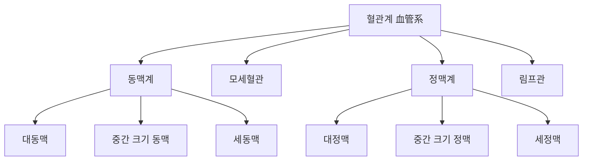
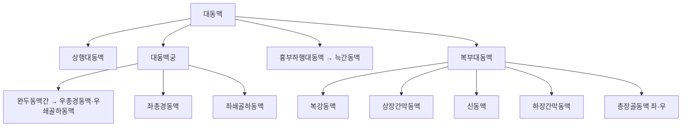
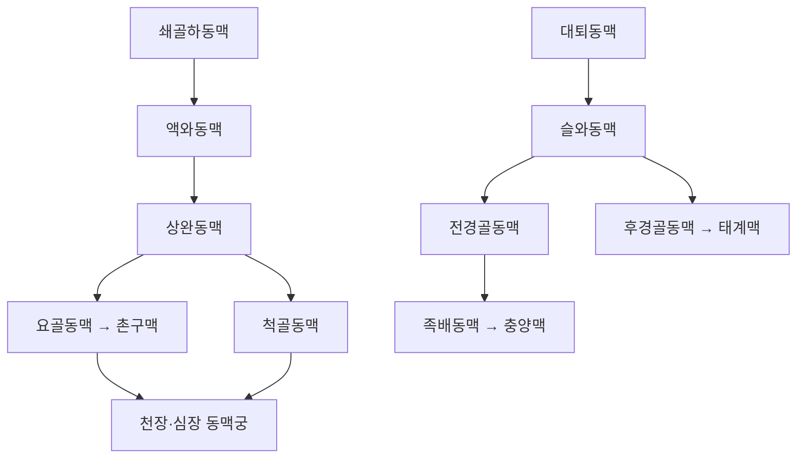
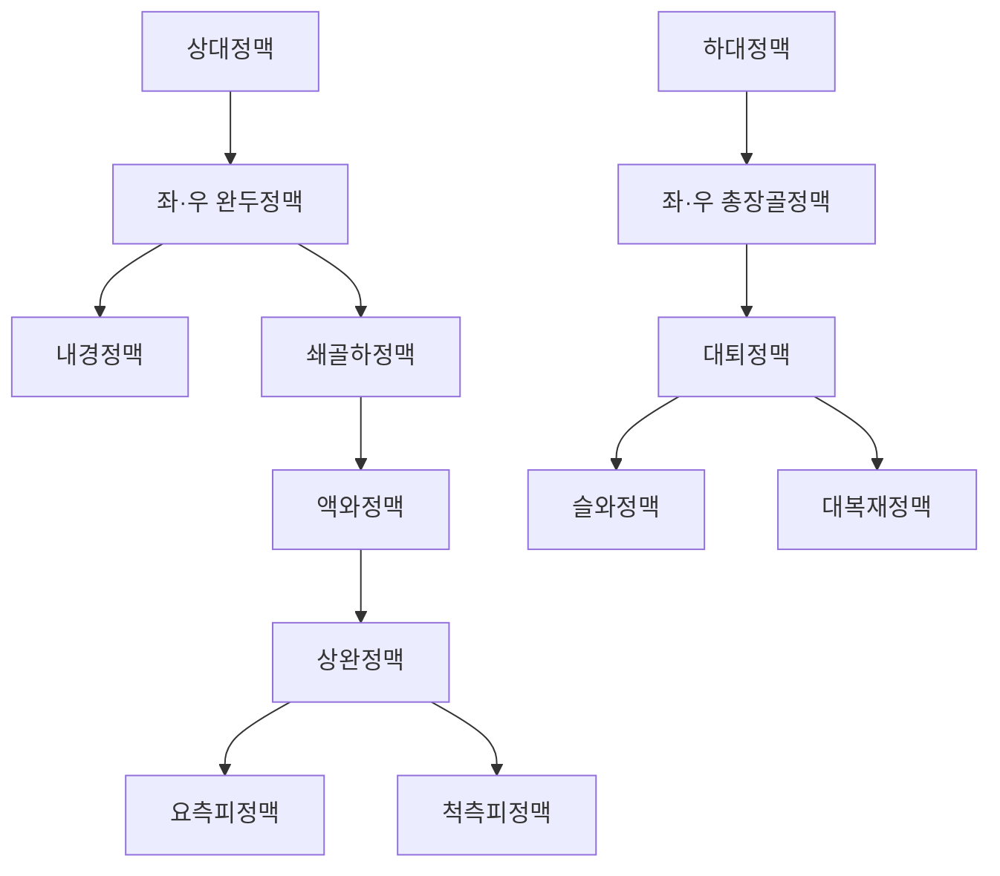
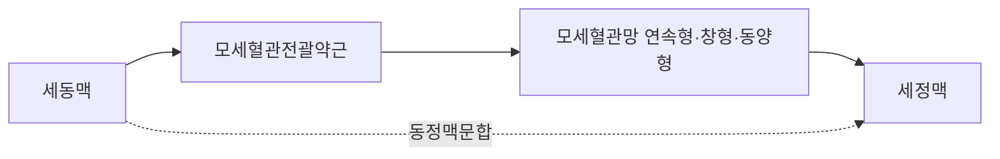

# 혈관(血管, Blood Vessel)

혈관(血管)은 심장에서 박출된 혈액을 전신 조직으로 운반하고 다시 심장으로 되돌리는 폐쇄 회로형 관상(管狀) 구조물의 총칭으로, 동맥(動脈, artery)·모세혈관(毛細血管, capillary)·정맥(靜脈, vein) 및 이와 밀접히 연관되어 조직액을 회수하는 림프관(淋巴管, lymphatic vessel)을 포괄한다. 이 문서는 현대 해부학적 관점에서 혈관계의 구조·분류·주행 경로를 총론부터 국소해부까지 체계적으로 정리하고, 침구(鍼灸)·추나(推拿) 임상에서 반드시 숙지해야 하는 혈관 국소해부 지식과 그에 결부된 안전성 근거를 종합한다.

이 위키에는 혈관이라는 표제어를 다루는 관점이 서로 다른 문서가 함께 존재한다. 한방생리학 영역의 맥(脈, Blood Vessel) 문서는 기항지부(奇恒之腑)로서의 맥이라는 한의학 고유의 이론 체계 — 혈지부(血之府)·심주혈맥(心主血脈)·맥진(脈診)의 생리학적 기초 등 — 를 중심으로 서술한다. 조직학 영역의 결합조직(結合組織, Connective Tissue) 문서는 혈관벽을 구성하는 내피세포·평활근세포·아교질섬유 등 미세 조직 구성 성분을 다룬다. 이 문서는 그와 구별되는 세 번째 관점 — 육안 해부학(gross anatomy) 층위에서 혈관계가 어떻게 분류되고, 대동맥에서 말단까지 어떤 경로로 주행하며, 경혈 자침·방혈(放血)·부항(附缸) 같은 한의학적 시술이 실제로 어떤 혈관 구조와 마주치는가 — 에 집중한다. 세 문서는 서로의 서술을 대체하지 않으며, 필요한 경우 텍스트로만 교차 참조한다.

이 문서는 총 6편으로 구성된다. 제1편은 혈관계의 정의·분류·혈관벽의 3층 구조 및 전통 해부 문헌의 혈관 서술을 개관한다. 제2편은 대동맥과 주요 동맥 분지의 주행 경로를, 제3편은 정맥계의 주행과 표재·심부 정맥 구분을 다룬다. 제4편은 모세혈관·문합·경혈 국소해부의 미세 구조를 다루며, 제5편은 자침·방혈·부항 등 임상 시술과 혈관 손상 예방의 안전성 근거를 종합한다. 제6편은 Q&A와 고전 인용 출처로 마무리한다. 인용된 인간 대상 연구는 med.symbolicinfo.com 데이터베이스에서 전수 수집한 것이며, 동물실험 단독 연구는 인용에서 제외하고 인간 데이터와 동물실험이 혼합된 연구는 인간 데이터 부분만 인용하였다. 순수 해부학적 구조 서술(혈관의 육안 구조·표준 주행 경로 등 표준 교과서 내용)은 `[교과서적 근거]`로 표기하고, 임상 안전성·자침 관련 인간 대상 연구는 개별 각주로 표기한다.

---

## 제1편 총론 — 혈관계의 정의와 분류

### 1. 순환계의 폐쇄 회로 — 혈관계란 무엇인가

혈관계(血管系, vascular system)는 심장을 펌프로 삼아 혈액을 전신에 순환시키는 폐쇄 회로(closed circuit) 구조로, 좌심실에서 나온 혈액이 대동맥→중간 크기 동맥→세동맥→모세혈관을 거쳐 조직에 산소·영양분을 전달한 뒤, 세정맥→중간 크기 정맥→대정맥을 거쳐 우심방으로 되돌아오는 체순환(體循環, systemic circulation)과, 우심실→폐동맥→폐모세혈관→폐정맥→좌심방으로 이어지는 폐순환(肺循環, pulmonary circulation)의 두 회로로 구성된다[교과서적 근거]. 이 두 회로가 심장을 공유하며 직렬로 연결되어 있다는 점이 혈관계 전체를 이해하는 출발점이다.

혈관계는 단순한 배관이 아니라 그 자체로 능동적인 조절 기능을 수행하는 기관계다. 혈관벽은 신경 신호와 국소 화학 신호(산화질소·엔도텔린 등)에 반응하여 스스로 수축·이완하며 혈류 분포를 재조정하고, 손상 시 지혈(止血) 반응을 개시하며, 염증·면역세포가 조직으로 이동하는 통로를 제공한다[교과서적 근거]. 혈관벽의 이러한 능동적 성격은 한의학에서 맥(脈)을 단순한 통로가 아니라 혈(血)을 "봉장(封藏)"하는 기항지부로 규정한 이론적 관점과 개념적으로 조응하는 지점이나, 그 상세한 이론적 논의는 맥(脈, Blood Vessel) 문서에서 다루었으므로 이 문서는 육안 해부학적 서술에 집중한다.

### 2. 혈관의 분류 — 동맥·모세혈관·정맥·림프관

혈관은 혈류의 방향과 구조적 특징에 따라 다음과 같이 분류된다[교과서적 근거].

| 구분 | 혈류 방향 | 대표 구조적 특징 | 대표 예 |
| --- | --- | --- | --- |
|**동맥(動脈, artery)** | 심장→말초 | 두꺼운 중막(평활근·탄력섬유), 높은 내압을 견딤 | 대동맥·경동맥·요골동맥 |
|**세동맥(細動脈, arteriole)** | 심장→말초(말단) | 얇은 관벽에 평활근이 상대적으로 우세, 말초저항의 주 조절 부위 | 각 조직의 말단 세동맥 |
|**모세혈관(毛細血管, capillary)** | 물질 교환의 장 | 단층 내피세포로만 구성, 판막·평활근 없음 | 조직 전반의 모세혈관망 |
|**세정맥(細靜脈, venule)** | 말초→심장(시작) | 얇은 관벽, 백혈구의 조직 이동(누출) 통로 | 각 조직의 말단 세정맥 |
|**정맥(靜脈, vein)** | 말초→심장 | 얇은 중막, 넓은 내강, 정맥판막 보유(사지 정맥) | 대정맥·경정맥·대퇴정맥 |
|**림프관(淋巴管, lymphatic vessel)** | 조직액 회수 → 정맥계 합류 | 맹관에서 시작, 판막이 조밀, 혈액을 담지 않고 림프액을 운반 | 흉관·우림프관 |

**이 표는 임상 틀이지 동일 근거수준의 권고가 아니다.** 실제 인체에서는 혈관 구경이 연속적으로 변화하므로 각 분류 사이의 경계가 절대적이지 않으며, 개인별·부위별 변이가 존재한다.

림프관은 엄밀히 말해 혈액을 운반하지 않으므로 협의의 혈관계에는 포함되지 않으나, 모세혈관에서 여과된 조직액(간질액)을 회수하여 결국 정맥계(주로 좌측 정맥각, 흉관의 종착점)로 합류시킨다는 점에서 순환계 전체의 필수 구성원이며, 방혈(放血)·부항(附缸) 시술 후 국소 부종 관리에서 임상적으로 중요하게 다루어진다.

### 3. 혈관벽의 3층 구조 — 육안 해부학적 개관

동맥과 정맥의 벽은 공통적으로 내막(內膜, tunica intima)·중막(中膜, tunica media)·외막(外膜, tunica adventitia)의 3층 구조를 취한다[교과서적 근거].

-**내막(內膜)**: 혈관 내강을 직접 감싸는 단층의 내피세포(內皮細胞, endothelium)와 그 아래의 얇은 결합조직층(내탄력판 포함)으로 구성된다. 내피세포는 혈액과 혈관벽 사이의 물리적 경계이자 산화질소·엔도텔린-1 등을 분비하여 혈관 긴장도를 능동적으로 조절하는 기능적 계면이다. 내피세포·평활근세포 등 미세 조직 성분의 상세한 조직학적 서술은 결합조직(結合組織, Connective Tissue) 문서에서 다루었다.
-**중막(中膜)**: 평활근세포와 탄력섬유·아교섬유가 층상으로 배열된 층으로, 동맥에서 특히 두껍게 발달하여 혈압을 견디고 혈관 긴장도를 조절하는 주된 구조다. 대동맥과 같은 대혈관은 탄력섬유가 우세한 "탄력형 동맥(elastic artery)"이고, 말초로 갈수록 평활근이 우세한 "근육형 동맥(muscular artery)"으로 이행한다[교과서적 근거].
-**외막(外膜)**: 성긴 결합조직으로 구성되며 혈관 자체에 영양을 공급하는 미세혈관(혈관영양관, vasa vasorum)과 자율신경 섬유가 분포한다. 정맥은 동맥에 비해 외막이 상대적으로 두꺼운 경우가 많아 전체 혈관벽에서 외막이 차지하는 비중이 더 크다[교과서적 근거].

정맥은 동맥에 비해 중막이 얇고 내강이 넓으며, 사지의 정맥은 혈액의 역류를 막는 정맥판막(靜脈瓣膜, venous valve)을 갖추고 있다는 점이 동맥과 구별되는 핵심적 구조적 차이다. 이 판막 구조는 제3편에서 정맥환류 기전과 함께 다시 다룬다.

### 4. 전통 해부 문헌의 혈관 서술과 현대 해부학의 대응

한의학 원전과 조선 의서는 혈관을 현대적 의미의 순환계 구조로 명확히 분리하여 서술하지는 않았으나, 신체 내 혈(血)이 통행하는 관(管)이 존재한다는 인식은 이미 고대 문헌에서부터 뚜렷하다. 『황제내경소문(黃帝內經素問)』·「맥요정미론(脈要精微論)」은 맥(脈)을 "혈지부(血之府)"로 규정하였고, 『영추(靈樞)』·「결기편(決氣篇)」은 "옹알영기(壅遏營氣), 영무소피(令無所避), 시위맥(是謂脈)"이라 하여 맥관 벽이 영기(營氣, 혈 속을 흐르는 정미로운 기)를 가두는 구조적 장벽 역할을 한다고 서술하였다[교과서적 근거]. 이 이론적 배경은 맥(脈, Blood Vessel) 문서에서 상세히 다루었으므로, 이 문서는 그 원전적 서술이 현대 해부학의 어떤 육안 구조와 대응하는지에 초점을 맞춘다.

허준(許浚)의 『동의보감(東醫寶鑑)』내경편(內景篇)은 신형장부도(身形藏府圖)를 통해 인체 내부 구조를 도해하면서, 경락(經絡)과 함께 전신을 관류하는 맥도(脈道)의 존재를 표현하였다[교과서적 근거]. 이러한 전통 도해는 오늘날의 동맥·정맥 구분처럼 관벽의 조직학적 차이나 판막의 유무를 구별하지는 않았지만, "혈이 다니는 정해진 길이 전신에 그물처럼 퍼져 있다"는 인식 자체는 현대 혈관계의 수지형(樹枝形) 분지 구조와 개념적으로 조응한다. 다만 전통 문헌의 "맥"은 순수한 순환계 혈관만을 가리키는 협의의 개념(혈맥血脈)과, 경락 계통 전체를 포괄하는 광의의 개념(경맥經脈)이 혼용되어 사용되었다는 점에서 현대 해부학의 "혈관"과 일대일로 대응하지 않는다는 한계를 인식해야 한다. 이 개념적 분리에 대한 상세한 논의는 맥(脈, Blood Vessel) 문서의 제3편(심-맥 축과 타 장부 관계)을 참고할 수 있다.

경혈(經穴)의 국소해부를 다룬 현대 연구는 이 전통적 인식과 현대 해부학을 잇는 중요한 교량 역할을 한다. 오수혈(五輸穴) 등 다수의 경혈이 피부를 관통하는 천공혈관(穿孔血管, perforator vessel)의 위치와 해부학적으로 일치한다는 관찰은[^74], 전통적으로 "기혈이 모이는 곳"으로 서술된 경혈의 위치 선정이 임의적이지 않고 실제 혈관·신경 분포와 상관관계를 가짐을 시사한다. 경혈의 해부학적 위치와 고전적 분류를 정리한 문헌 고찰도[^75] 이러한 대응 관계를 뒷받침한다.

---

## 제2편 동맥계 해부

### 5. 대동맥과 주요 분지 개관

대동맥(大動脈, aorta)은 좌심실에서 나와 상행대동맥(上行大動脈)·대동맥궁(大動脈弓)·하행대동맥(下行大動脈, 흉부·복부)으로 이어지는 인체 최대의 동맥이다[교과서적 근거]. 대동맥궁에서는 상지·두경부로 향하는 세 개의 주요 분지 — 완두동맥간(腕頭動脈幹, brachiocephalic trunk, 우측 총경동맥과 우측 쇄골하동맥으로 분지)·좌총경동맥(左總頸動脈)·좌쇄골하동맥(左鎖骨下動脈) — 가 순서대로 기시한다. 흉부하행대동맥은 각 늑간(肋間)마다 늑간동맥(肋間動脈)을 분지하여 흉벽·척수를 관류하고, 횡격막을 관통해 복부로 들어가면 복부대동맥이 된다. 복부대동맥은 순서대로 복강동맥(腹腔動脈, celiac trunk, 위·간·비장 관류)·상장간막동맥(上腸間膜動脈, 소장·근위 대장 관류)·신동맥(腎動脈)·하장간막동맥(下腸間膜動脈, 원위 대장·직장 관류) 등 내장 분지를 낸 뒤, 제4요추 높이(배꼽 부근)에서 좌우 총장골동맥(總腸骨動脈)으로 분지되어 하지로 이어진다[교과서적 근거]. 대동맥은 흉추 앞쪽에서는 척추체 좌측에 인접하여 주행하고 복부에서는 척추체 바로 앞을 하행하므로, 등쪽 정중선 인근 심자보다 복부 정중선·좌측 복부 심자 시 대동맥과의 거리가 더 가까워진다는 것이 국소해부학적으로 중요하다. 대동맥은 침구 자침이 직접 닿는 부위는 아니나, 복부 심자(深刺) 시술에서 극히 드물게 손상 사례가 보고된 바 있어(제5편 참조), 심부 대혈관의 위치를 인지하는 것이 안전한 취혈의 전제가 된다. 대동맥의 국소적 협착(대동맥축착)·확장(대동맥류)·박리(대동맥박리) 등은 양방 의학에서 흔히 다루는 대혈관 질환군으로, 이들 병태는 침구 시술의 직접적 대상은 아니지만 복부·요배부 심자 시 감별해야 할 기저질환으로 인식되어야 한다.

### 6. 두경부 동맥 — 총경동맥·외경동맥·내경동맥과 인영혈(人迎穴)

총경동맥(總頸動脈, common carotid artery)은 좌측은 대동맥궁에서, 우측은 완두동맥간에서 기시하여 목을 따라 상행하다가 갑상연골 상연 높이(제4경추 높이 부근)에서 외경동맥(外頸動脈, external carotid artery)과 내경동맥(內頸動脈, internal carotid artery)으로 분지된다[교과서적 근거]. 이 분지점(경동맥 분기부, carotid bifurcation)에는 혈압을 감지하는 경동맥동(頸動脈洞, carotid sinus, 설인신경 지배)과 혈중 산소·이산화탄소 농도를 감지하는 경동맥소체(頸動脈小體, carotid body)가 있어, 이 부위에 대한 과도한 압박·자극이 미주신경 반사를 통한 서맥·실신(경동맥동 실신)을 유발할 수 있다[교과서적 근거]. 외경동맥은 갑상선동맥·안면동맥·상악동맥·천측두동맥 등을 분지하여 안면부·두피·목의 표층 구조에 분포하고, 내경동맥은 분지 없이 두개저의 경동맥관을 통해 두개강 내로 진입하여 대뇌 앞쪽 2/3의 뇌 순환(전대뇌동맥·중대뇌동맥)에 관여한다[교과서적 근거]. 총경동맥·내경정맥·미주신경은 결합조직초에 함께 싸여 경동맥초(carotid sheath)를 이루며 흉쇄유돌근 깊은 곳을 나란히 주행하므로, 경부 측면 심자 시 이 세 구조가 하나의 신경혈관 다발로 함께 손상될 수 있다는 점을 유의해야 한다.

경혈학에서 인영(人迎, ST9)은 갑상연골 외측, 총경동맥 박동이 촉지되는 부위에 위치한 것으로 알려져 있으며, 이는 고전적으로 "인영맥(人迎脈)"을 촌구맥(寸口脈)과 대비하여 진단에 활용했던 이론적 배경과 맞닿아 있다[교과서적 근거]. 침구·뜸 치료가 초기 경동맥 죽상경화(carotid atherosclerosis) 환자의 동맥 탄성도에 미치는 효과를 평가한 임상시험은[^49] 경동맥 인근 경혈 자극이 실제 동맥 벽의 물리적 성질에 개입할 수 있음을 시사하는 근거로 참고할 수 있으나, 동시에 인영 부위는 총경동맥이 매우 얕게 주행하는 부위이므로 자침 각도·깊이에 대한 해부학적 숙지가 반드시 선행되어야 한다(제4편·제5편에서 상술).

### 7. 상지 동맥 — 쇄골하동맥에서 손끝까지, 촌구맥(寸口脈)의 해부학적 대응

쇄골하동맥(鎖骨下動脈, subclavian artery)은 제1늑골 외측연을 지나면서 액와동맥(腋窩動脈, axillary artery)으로 명칭이 바뀌고, 액와동맥은 상완 부위에서 상완동맥(上腕動脈, brachial artery)으로 이어진다[교과서적 근거]. 쇄골하동맥은 사각근간극(경신경총·완신경총의 신경근과 함께 주행하는 좁은 통로)을 지나므로, 이 부위의 압박(흉곽출구증후군)은 신경·혈관 증상을 동시에 유발할 수 있다. 상완동맥은 상완이두근 안쪽 고랑을 따라 정중신경과 나란히 하행하여 팔꿈치 앞쪽(주와, 肘窩)에서 요골동맥(橈骨動脈, radial artery)과 척골동맥(尺骨動脈, ulnar artery)으로 분지되며, 이 두 동맥은 손목·손바닥에서 심장(深掌)·천장(淺掌) 동맥궁을 이루어 서로 문합함으로써 손가락 말단까지 이중 혈류 공급을 보장한다[교과서적 근거]. 이 문합 구조 덕분에 요골동맥 한쪽이 폐쇄되어도 척골동맥을 통한 측부순환으로 손 전체의 관류가 유지될 수 있으며, 이를 임상적으로 확인하는 것이 알렌 검사(Allen test, 요골동맥 채혈이나 경요골동맥 시술 전 척골동맥 측부순환 여부를 확인하는 검사)다.

요골동맥은 손목 요측(엄지 쪽) 피부 아래 얕게 주행하며, 이 부위가 바로 한의학 맥진(脈診)에서 촌구맥(寸口脈)을 촉지하는 해부학적 위치다 — 촌(寸)·관(關)·척(尺) 세 부위는 요골경상돌기(橈骨莖狀突起)를 기준으로 근위(관)·원위(촌)·더 근위(척) 방향으로 요골동맥 박동을 짚는 지점에 해당한다[교과서적 근거]. 맥상(脈象)이 반영하는 생리학적 기전(동맥벽 탄성·심박출량·말초저항 등 맥파의 물리적 기초)에 대한 상세한 논의는 맥(脈, Blood Vessel) 문서 제5편에서 다루었으므로, 이 문서는 촌구맥 진단이 가능한 해부학적 전제 — 요골동맥이 이 부위에서 피부 표면 가까이 주행하여 외부에서 촉지 가능하다는 점 — 를 확인하는 데 그친다.

임상적으로 요골동맥은 관상동맥 조영술 등 경요골동맥(transradial) 접근의 표준 통로로도 활용되며, 초음파 유도하 요골동맥 부위 자침이 하지 동맥이 아닌 상지 동맥 혈류에 미치는 영향을 평가한 연구도 참고할 수 있다(제4편 참조).

### 8. 하지 동맥 — 대퇴동맥·슬와동맥·경골동맥·족배동맥

총장골동맥은 서혜인대(鼠蹊靭帶) 아래를 지나면서 대퇴동맥(大腿動脈, femoral artery)으로 명칭이 바뀌며, 서혜부에서는 대퇴동맥(외측)·대퇴정맥(내측)·대퇴신경(더 외측)이 나란히 대퇴삼각(femoral triangle) 내를 주행한다(외측에서 내측으로 신경-동맥-정맥 순서, "NAVEL" 배열)[교과서적 근거]. 대퇴동맥은 대퇴 상부에서 대퇴부 근육 대부분을 관류하는 대퇴심동맥(deep femoral artery, 대퇴동맥 혈류의 주된 공급원)을 분지한 뒤, 대퇴부 내측 근육관(내전근관, adductor canal)을 지나 대퇴부 내측을 하행하여 무릎 뒤쪽(슬와, 膝窩)에서 슬와동맥(膝窩動脈, popliteal artery)이 된다[교과서적 근거]. 슬와동맥은 하퇴에서 전경골동맥(前脛骨動脈)과 후경골동맥(後脛骨動脈)으로 분지되고, 전경골동맥은 발등에서 족배동맥(足背動脈, dorsalis pedis artery)으로 이어져 촉지 가능한 말단 맥박점을 형성한다[교과서적 근거].

대퇴동맥은 서혜부 중점(서혜인대의 중점, 치골결합과 전상장골극의 중간)에서 비교적 얕게 촉지되는 대표적 맥박점이며, 슬와동맥은 슬와 깊은 곳에 슬와정맥·경골신경·총비골신경과 함께 신경혈관 다발(neurovascular bundle)을 이루어 주행하므로 슬와부 자침·침도(鍼刀) 시술 시 특히 주의가 필요한 부위다. 하지 동맥의 협착·폐쇄로 인한 말초동맥질환(peripheral arterial disease, PAD)은 간헐적 파행(intermittent claudication, 보행 시 하지 통증·조이는 느낌이 발생했다가 휴식 시 소실되는 양상)을 특징적으로 유발하며, 발목-상완 지수(ankle-brachial index, ABI, 발목과 상완의 수축기 혈압 비율)와 각 맥박점(대퇴·슬와·족배·후경골동맥)의 촉지 여부가 표준적인 선별 진찰 방법으로 활용된다는 점이 하지 동맥 국소해부의 임상적 함의다[교과서적 근거]. 실제로 자침 후 슬와동맥 가성동맥류(假性動脈瘤, pseudoaneurysm)가 발생하여 스텐트 그라프트로 치료한 증례가 보고된 바 있다[^26]. 족삼리(足三里, ST36)·풍륭(豊隆, ST40) 등 하지 경혈에 동맥 자극 기법(자침예술동맥법)을 적용해 당뇨발 초기 단계 환자의 말초 미세순환·교감신경 활성을 조절하려는 임상시험도 이 부위 동맥 국소해부에 대한 이해를 전제로 한다[^37][^38].

### 9. 맥진 부위와 임상적으로 중요한 촉지 부위 총정리표

아래 표는 전신에서 체표를 통해 촉지 가능한 대표적 동맥 맥박점을 정리한 것이다.

| 동맥 | 촉지 부위 | 한의학적 대응 개념 |
| --- | --- | --- |
| 총경동맥 | 갑상연골 외측 (인영혈 부근) | 인영맥(人迎脈) |
| 요골동맥 | 손목 요측, 요골경상돌기 근위 | 촌구맥(寸口脈, 촌·관·척) |
| 상완동맥 | 팔꿈치 앞쪽(주와), 상완이두근 건 내측 | 혈압 측정의 표준 청진 부위 |
| 대퇴동맥 | 서혜부 중점 | — |
| 슬와동맥 | 슬와부 깊은 곳 | — |
| 족배동맥 | 발등, 제1·2 중족골 사이 | 충양맥(衝陽脈, ST42 부근) |
| 후경골동맥 | 내과(內踝) 후방 | 태계맥(太谿脈, KI3 부근) |

**이 표는 임상 틀이지 동일 근거수준의 권고가 아니다.** 촉지 부위는 개인별 체형·혈관 변이에 따라 차이가 있으며, 표에 제시된 위치는 평균적인 해부학적 기준점일 뿐 모든 개인에게 동일하게 적용되지 않는다. 특히 충양맥(衝陽脈)·태계맥(太谿脈)은 전통적으로 신기(腎氣)·위기(胃氣)의 존망을 살피는 삼부구후(三部九候) 진단에서 활용되었던 개념으로, 이 역시 요골동맥 중심의 촌구맥진과 함께 원전에 기록된 진단법이나 현대 임상에서는 촌구맥진이 주로 활용된다[교과서적 근거].

---

## 제3편 정맥계 해부

### 10. 상대정맥계 — 경정맥·쇄골하정맥·완두정맥

상반신(두경부·상지·흉부)의 정맥혈은 상대정맥(上大靜脈, superior vena cava)을 통해 우심방으로 유입된다[교과서적 근거]. 두경부에서는 내경정맥(內頸靜脈, internal jugular vein)이 뇌·안면부의 정맥혈을 모아 흉쇄유돌근 안쪽 깊은 곳을 총경동맥·미주신경과 함께 경동맥초 내부를 하행하며, 외경정맥(外頸靜脈, external jugular vein)은 흉쇄유돌근 표면을 피부 아래 얕게 주행하여 육안으로도 관찰되는 경우가 많다[교과서적 근거]. 안면부 정맥 중 눈 안쪽~코 옆~윗입술을 잇는 안면정맥(facial vein)은 판막이 없어 안면부 감염이 역행성으로 해면정맥동(cavernous sinus)까지 파급될 수 있는 경로가 되므로, 이 부위(코~윗입술 주변, 이른바 "위험 삼각")의 감염·시술 시 이 해부학적 특성을 유의해야 한다[교과서적 근거]. 내경정맥은 쇄골하정맥(鎖骨下靜脈, subclavian vein)과 합류하여 완두정맥(腕頭靜脈, brachiocephalic vein)을 이루고, 좌우 완두정맥이 합쳐져 상대정맥이 된다[교과서적 근거]. 내경정맥은 중심정맥관 삽입·투석 카테터 거치 등 임상에서 빈번히 이용되는 통로이며, 이 부위의 안전한 천자 기법을 정리한 고전적 연구는 320례의 경험을 통해 해부학적 지표(흉쇄유돌근의 두 갈래 사이 삼각) 기반 접근법의 유용성을 확인하였다[^77].

### 11. 하대정맥계 — 대퇴정맥·대복재정맥

하반신의 정맥혈은 하대정맥(下大靜脈, inferior vena cava)을 통해 우심방으로 유입된다[교과서적 근거]. 하지에서는 심부 정맥(대퇴정맥·슬와정맥·경골정맥 등)이 동명의 동맥과 나란히 주행하며, 표재정맥인 대복재정맥(大伏在靜脈, great saphenous vein)은 발등 안쪽에서 시작해 내과(內踝) 앞을 지나 하지 내측을 따라 상행하여 서혜부에서 대퇴정맥으로 합류한다[교과서적 근거]. 소복재정맥(小伏在靜脈, small saphenous vein)은 발등 외측에서 시작해 외과(外踝) 뒤를 지나 하퇴 후면을 상행하여 슬와정맥으로 합류하며, 이 두 표재정맥계는 하지 곳곳의 관통정맥(perforating vein)을 통해 심부정맥계와 연결된다[교과서적 근거]. 관통정맥의 판막이 손상되면 심부정맥의 높은 압력이 표재정맥으로 역류하여 하지 정맥류의 병태생리를 이루는데, 이 때문에 표재정맥만을 대상으로 하는 방혈·부항 시술은 심부정맥계의 고압 혈류와는 원리적으로 구획이 분리되어 있다는 점이 안전성 논의의 전제가 된다(제5편 참조). 대복재정맥은 정맥류(靜脈瘤)가 호발하는 부위이자, 관상동맥우회술(CABG) 시 이식편으로 채취되는 대표적 표재정맥이기도 하다.

### 12. 표재정맥과 심부정맥 — 상지 표재정맥과 사혈·정맥천자

상지에는 요측피정맥(橈側皮靜脈, cephalic vein)·척측피정맥(尺側皮靜脈, basilic vein)·주정중피정맥(肘正中皮靜脈, median cubital vein)의 세 표재정맥이 대표적이다[교과서적 근거]. 주정중피정맥은 팔꿈치 앞쪽(주와)에서 요측피정맥과 척측피정맥을 연결하는 위치에 있으며, 피부 아래 비교적 얕고 고정되어 있어 채혈·정맥주사·정맥천자(靜脈穿刺, venipuncture)의 표준 부위로 가장 널리 활용된다[교과서적 근거]. 혈액응고검사를 위한 채혈 시 정맥천자 표준화가 검사 정확도에 미치는 영향을 정리한 문헌 고찰은[^78] 정맥천자라는 일상적 시술에서도 정맥 국소해부에 근거한 표준 절차가 임상적으로 중요함을 보여준다.

한의학의 방혈(放血)요법은 전통적으로 정혈(井穴, 손발톱 부근)이나 이첨(耳尖, EX-HN6)·태양(太陽, EX-HN5)과 같은 표재정맥·모세혈관이 풍부한 부위에서 소량의 혈액을 배출시키는 시술로, 심부정맥이 아닌 표층의 미세혈관·세정맥을 대상으로 한다는 점에서 정맥천자와는 겨냥하는 혈관의 층위가 다르다[교과서적 근거]. 태양혈(太陽穴) 방혈로 안와주위 정맥기형(periorbital venous malformation)을 치료한 증례는[^61] 표재정맥 구조에 대한 방혈 시술의 임상 적용례를 보여준다. 방혈요법의 상세한 임상 근거는 제5편에서 종합한다.

### 13. 정맥판막과 정맥환류 기전

사지의 정맥, 특히 하지 정맥에는 혈액의 역류를 막는 반달 모양의 정맥판막이 일정 간격으로 배치되어 있어, 중력을 거슬러 심장으로 혈액을 되돌리는 정맥환류(靜脈還流, venous return)를 돕는다[교과서적 근거]. 정맥환류는 판막의 구조적 방향성뿐 아니라 하지 근육의 수축(근육펌프, muscle pump)과 호흡에 따른 흉강 내압 변화(호흡펌프)에도 크게 의존한다[교과서적 근거]. 정맥판막 기능 부전이나 근육펌프 작용 저하는 하지 정맥류·만성 정맥부전으로 이어질 수 있으며, 이러한 정맥환류 장애를 외과적으로 관리하는 임상 사례(유리피판 재건술 후 발생한 정맥부전에 방혈 기법을 적용한 증례[^70], 유리피판 이식 후 정맥울혈 관리 경험[^71])는 정맥환류 이론이 실제 임상 국소해부와 어떻게 연결되는지 보여준다.

---

## 제4편 미세혈관과 국소해부

### 14. 모세혈관·문합·측부순환

모세혈관은 단층의 내피세포로만 구성되어 판막이나 평활근층이 없으며, 혈액과 조직 사이의 산소·이산화탄소·영양분·노폐물 교환이 실질적으로 이루어지는 최종 단계다[교과서적 근거]. 모세혈관은 내피세포 사이의 치밀함에 따라 뇌·근육 등에 분포하며 물질 이동을 엄격히 제한하는 연속모세혈관(continuous capillary), 내분비선·신장 사구체 등에 분포하며 내피에 작은 창(fenestra)이 있어 물질 투과성이 높은 창모세혈관(fenestrated capillary), 간·비장·골수 등에 분포하며 내피 사이 간격이 커서 혈구세포까지 통과할 수 있는 동양모세혈관(sinusoidal capillary)의 세 유형으로 구분된다[교과서적 근거]. 모세혈관 앞쪽(세동맥 말단)에는 평활근으로 이루어진 모세혈관 전 괄약근(precapillary sphincter)이 있어 국소 조직의 대사 요구에 따라 모세혈관망으로의 혈류 유입을 개폐하며, 일부 부위(손가락·발가락 등 말단)에는 모세혈관을 거치지 않고 세동맥이 세정맥으로 직접 연결되는 동정맥문합(動靜脈吻合, arteriovenous anastomosis)이 있어 체온 조절에 관여한다[교과서적 근거].

인접한 두 동맥(또는 정맥)의 말단 가지가 서로 연결되는 문합(吻合, anastomosis)은 한 혈관이 폐쇄되었을 때 다른 경로를 통해 혈류를 우회시키는 측부순환(側副循環, collateral circulation)의 해부학적 기초를 이룬다[교과서적 근거]. 손바닥의 천장·심장 동맥궁, 무릎 주위의 슬관절 동맥망(genicular anastomosis) 등이 대표적인 문합 구조로, 이러한 구조 덕분에 특정 동맥의 국소적 폐쇄나 결찰이 반드시 원위부 조직의 괴사로 이어지지는 않는다. 반면 뇌·심장·비장·신장과 같이 문합이 극히 적거나 없는 종말동맥(end artery) 지배 조직에서는 해당 동맥의 폐쇄가 곧바로 그 지배 영역의 경색(梗塞, infarction)으로 이어진다는 점이 대조적이다[교과서적 근거].

말초동맥질환·당뇨발 환자에서 침 치료가 미세순환을 증가시킬 수 있는지 평가한 예비 임상시험은[^43] 침 자극이 모세혈관 수준의 관류에 영향을 미칠 가능성을 시사하며, 침 자극에 따른 국소 혈류 변화를 체계적으로 고찰한 연구는[^44] 이러한 반응이 취혈 부위·자극 강도에 따라 재현 가능한 양상으로 나타남을 확인하였다. 근적외선분광법(NIRS)을 이용해 침 치료가 뇌·근육 미세순환에 미치는 영향을 체계적으로 고찰한 연구[^39]와, 교감신경계와 미세순환의 관계를 정리한 문헌 고찰[^40]은 침구 자극이 국소 미세혈관 반응을 매개로 전신 순환에 개입할 수 있다는 이론적 틀을 제공한다.

### 15. 경혈 부위 관통혈관(perforator vessel)의 해부학적 근거

경혈의 해부학적 실체를 규명하려는 현대 연구는 다수의 경혈이 근막을 관통하여 피부로 올라오는 천공혈관(穿孔血管, perforator vessel)의 위치와 일치함을 반복적으로 확인해 왔다. 오수혈 등 상지 경혈에 대한 해부 연구는 다수의 경혈이 피부관통혈관의 출현 지점과 통계적으로 유의하게 일치함을 보고하였고[^74], 경혈의 해부학적 분류를 정리한 문헌 고찰도 이러한 대응 관계를 뒷받침한다[^75]. 이는 경혈이 임의의 체표 지점이 아니라 특정한 혈관-근막 구조와 결부되어 분포한다는 것을 시사하며, 자침 시 경혈 부위에 얕게 주행하는 관통혈관이 존재할 수 있다는 임상적 함의를 갖는다 — 즉 정확한 취혈이 곧 정확한 혈관 회피와 결부될 수 있다는 것이다.

한국의 경혈 실습 교육에서 경혈 관련 신경혈관·근육 구조를 3차원으로 시각화하는 소프트웨어를 개발·적용한 사례는[^76] 이러한 국소해부 지식을 임상 교육에 통합하려는 최신 시도를 보여준다.

### 16. 경혈별 혈관 국소해부 위험 부위표

침구 임상에서 자침 깊이·각도 설정 시 특히 인접 혈관을 고려해야 하는 대표적 경혈은 다음과 같다.

| 경혈 | 인접 혈관 구조 | 임상적 주의점 |
| --- | --- | --- |
| 인영(人迎, ST9) | 총경동맥 | 경동맥이 매우 얕게 주행, 직자·심자 금기 원칙 적용 |
| 극천(極泉, HT1) | 액와동맥 | 액와 신경혈관 다발과 인접, 얕은 사자(斜刺) 권장 |
| 결분(缺盆, ST12) | 쇄골하동·정맥, 폐첨 | 심자 시 기흉·대혈관 손상 위험 |
| 견정(肩井, GB21) | 폐첨, 견갑상동맥 | 초음파로 안전 깊이 계측한 근거 존재[^7] |
| 기충(氣衝, ST30) | 대퇴동맥 | 서혜부 대혈관 인접, 자침 각도 주의 |
| 위중(委中, BL40) | 슬와동·정맥, 경골신경 | 슬와부 신경혈관 다발, 심자 금기 |
| 태연(太淵, LU9) | 요골동맥 | 촌구맥 촉지 부위와 일치, 직자 시 동맥 자입 위험 |
| 태계(太谿, KI3) | 후경골동맥 | 내과 후방 신경혈관 다발 |

**이 표는 임상 틀이지 동일 근거수준의 권고가 아니다.** 개인별 혈관 변이(고위분지·부주행 등)가 드물지 않게 관찰되므로, 위 표는 평균적인 해부학적 기준을 제시할 뿐 모든 환자에게 동일하게 적용할 수 있는 절대적 안전 보장이 아니다. 초음파 등 영상 유도 기법을 병용하면 개인별 변이를 확인하고 손상 위험을 추가로 낮출 수 있다(제5편 참조).

### 17. 초음파 기반 경혈 혈관 국소해부 연구

초음파는 침습 없이 실시간으로 경혈 부위의 혈관·신경 구조를 확인할 수 있는 도구로, 최근 침구 임상에서 국소해부 지식을 보완하는 표준 도구로 자리잡아가고 있다. 초음파로 견정(肩井, GB21) 부위 안전 자침 깊이를 계측한 연구는 흉막·대혈관 손상을 예방할 수 있는 구체적 기준을 제시하였고[^7], 초음파 유도하 족삼리(足三里, ST36) 자침이 하지 동맥 혈류량에 미치는 즉각 효과를 평가하는 임상시험 프로토콜도 등록되어 있다[^27]. 초음파 유도 자침 시 침감(득기)과 국소 혈관·신경 구조의 관계를 관찰한 연구[^29], 초음파로 침도(鍼刀) 시술 시 혈관·신경 구조를 실시간 시각화한 예비 연구[^30]와 척추·관절 질환에서의 대조군 연구[^31], 경항부 매선(埋線) 시술에서 초음파로 확인한 유효 해부 구조 분석[^32]은 모두 초음파가 혈관 국소해부를 실시간으로 보완할 수 있음을 뒷받침한다. 근골격계 최소침습 시술의 최신 동향을 정리한 문헌 고찰[^33], 초음파가 침구 임상 실무를 변화시키는 양상에 대한 전문가 의견[^34], 초음파 유도 침·건침 요법 연구 동향을 정리한 주사적 고찰[^35], 한국에서 초음파 유도 침구 시술의 발전 양상을 정리한 문헌 고찰[^36]은 이러한 흐름이 개별 사례를 넘어 침구 임상의 표준 관행으로 자리잡아가고 있음을 보여준다.

다만 초음파 유도가 만능은 아니다 — 초음파 유도 자침에서도 정중신경 관통이 발생한 증례가 보고된 바 있어[^28], 영상 유도가 해부학적 지식을 대체하는 것이 아니라 보완하는 도구임을 정직하게 인식해야 한다.

---

## 제5편 임상 적용과 안전성

### 18. 자침 관련 혈관·흉막 손상 — 기흉

침 치료의 심각한 외상성 합병증 중 가장 빈번히 보고되는 것이 기흉(氣胸, pneumothorax)이며, 그 발생 기전은 대부분 흉곽 주변 경혈의 과도한 심자(深刺)가 흉막과 함께 인접 혈관을 손상시키는 데서 비롯된다[^1]. 흉부 경혈 자침 후 발생한 외상성 기흉 증례[^2], 17건의 침 관련 기흉 증례를 분석하여 발생 요인(자침 깊이·부위·체형)을 정리한 연구[^3], 흉부 CT로 경혈별 안전 자침 깊이를 계측한 연구[^5], 38건의 침·경혈주사 유발 기흉 증례 분석[^6]은 모두 이 위험을 뒷받침하는 근거다. 침 치료의 진통 효과와 심각한 위험을 종합 평가한 review of reviews도 기흉을 대표적인 중대 이상반응으로 꼽았다[^4].

중국 문헌에서 보고된 침구 관련 이상반응을 체계적으로 고찰한 연구들[^8][^9][^10], 대만의 국가 자료를 이용해 침 치료 후 의인성 기흉 발생률을 정량적으로 산출한 관찰연구[^11], 여러 건의 침구 관련 기흉 증례 보고[^12][^13][^14][^15][^16][^19][^20]는 기흉이 드물지만 반복적으로 보고되는 합병증임을 보여준다. 협척혈(華佗夾脊) 자침 후 발생한 혈흉기흉(hemopneumothorax) 증례[^17]와 한국의 전통의학 시술 관련 이상반응을 분석한 연구[^18]는 척추 주변 경혈 자침에서도 유사한 위험이 존재함을 시사하며, 침 치료로 유발된 양측 긴장성 기흉으로 사망한 사례를 부검 CT로 진단한 보고는[^21] 이 합병증이 극단적인 경우 치명적일 수 있음을 경고한다.

이러한 근거들은 흉곽 주변 경혈(결분·견정·폐수 등)의 자침 시 반드시 흉막·폐첨·쇄골하혈관의 위치를 숙지하고, 개인별 체형(특히 마른 체형·저신장)에 따라 안전 깊이가 달라질 수 있음을 고려해야 함을 뒷받침한다. 초음파로 안전 자침 깊이를 계측한 연구[^7]는 이러한 위험을 정량적으로 관리할 수 있는 실용적 방법을 제시한다.

### 19. 자침 관련 혈종·가성동맥류 — 항응고제 병용 환자의 특별한 주의

혈관벽이 자침 바늘에 의해 부분적으로 손상되면 혈액이 주변 조직으로 스며들어 혈종(血腫, hematoma)을 형성할 수 있다. 항응고제를 복용하는 환자에서 자침 후 발생한 근육내 혈종 증례는[^22] 항응고요법 병용 시 혈관 손상 위험이 증가할 수 있음을 시사하며, 통증 시술 후 발생한 척추 경막외 혈종 증례[^23]는 척추 주변 자입 시술에서도 유사한 위험이 존재함을 보여준다. 항응고제 복용 환자에서 침 치료의 안전성을 체계적으로 고찰한 연구는[^24] 이러한 위험을 종합적으로 정리하였다.

더 드물지만 중대한 합병증으로 가성동맥류(假性動脈瘤, pseudoaneurysm)가 있다 — 동맥벽의 전층 손상 후 혈액이 주변 조직에 국한되어 박동성 종괴를 형성하는 상태로, 복부 자침 후 발생한 복부대동맥 가성동맥류 증례[^25]와 자침 후 발생한 슬와동맥 가성동맥류를 스텐트 그라프트로 치료한 증례[^26]가 보고되어 있다. 이러한 증례는 극히 드물지만, 심부 대혈관에 인접한 경혈(기충·복부 정중선 인근·슬와부 등)의 심자를 피하고 적절한 각도·깊이를 준수해야 하는 이유를 명확히 보여준다.

**변증 없는 관행적 취혈은 근거에 부합하지 않는다는 원칙은 안전성 측면에서도 동일하게 적용된다** — 특정 경혈의 전통적 주치(主治)만을 근거로 해부학적 위험을 고려하지 않은 채 관행적으로 심자하는 것은 근거 기반 임상의 원칙에 부합하지 않으며, 개별 환자의 체형·항응고제 복용 여부·해부학적 변이를 종합적으로 고려한 자침 계획이 필요하다.

### 20. 초음파 유도 시술과 안전성 향상

앞서 제4편 17절에서 다룬 바와 같이, 초음파는 자침 전 실시간으로 혈관·신경·흉막의 위치를 확인할 수 있는 도구로서 혈관 손상 예방에 실질적으로 기여할 수 있다[^7][^27][^33][^34][^35][^36]. 다만 초음파 유도 자침에서도 정중신경 관통이 보고된 사례가 있듯이[^28], 초음파가 모든 위험을 제거하는 것은 아니며 시술자의 해부학적 지식과 결합될 때 비로소 안전성 향상 효과가 극대화된다는 점을 강조해야 한다. 초음파 유도 침도(鍼刀)·매선(埋線) 시술의 관련 근거[^30][^31][^32]도 같은 원칙을 뒷받침한다.

### 21. 방혈(放血)요법의 해부학적 근거와 임상 안전성

방혈요법은 정혈(井穴)·이첨(耳尖, EX-HN6)·태양(太陽, EX-HN5) 등 표재정맥·모세혈관이 풍부한 부위에서 소량의 혈액을 배출시키는 한의학 고유의 시술로, 원리적으로는 심부 대혈관이 아닌 표층 미세혈관을 대상으로 한다는 점에서 앞서 다룬 기흉·가성동맥류 같은 심부 혈관 손상 위험과는 구별되는 안전성 프로파일을 갖는다[교과서적 근거].

방혈요법의 임상 근거는 다양한 질환군에서 축적되어 있다. 만성 특발성 두드러기 환자에서 방혈요법의 유효성을 평가한 무작위 대조 시험[^58]과 이를 종합한 메타분석[^59], 이첨 방혈이 다래끼(맥립종) 안약 병용 치료의 보조 요법으로서 갖는 효과를 평가한 메타분석[^60], 급성 대상포진에 대한 방혈요법의 유효성·안전성을 평가한 메타분석[^62], 급성 통풍성 관절염[^63]·통풍 전반[^64]·슬관절 골관절염[^65]에서 방혈요법의 유효성·안전성을 평가한 메타분석들은 방혈이 다양한 염증성·통증성 질환에서 보조 요법으로서 근거를 축적해 왔음을 보여준다. 국소 근막통증유발점 방혈과 협척혈 자침을 병행해 상부 등 근막통증증후군을 치료한 무작위 대조 시험[^66], 정혈(井穴) 방혈과 의이인(薏苡仁)을 병행하여 외상성 뇌경색 환자의 뇌보호 효과를 평가한 임상시험[^67], 다차원적 근거 평가를 바탕으로 방혈요법의 적응증을 재정리한 체계적 고찰[^68], 방혈 부항요법이 고혈압 관리에 미치는 효과를 평가한 관찰연구[^69], 혈열(血熱) 두통에서 방혈요법과 침 치료의 효과를 비교한 임상시험[^79], 급성 연부조직 손상에 대한 방혈요법의 연구 전략을 정리한 문헌 고찰[^72], 망막분지동맥폐쇄에서 동맥 마사지와 방혈을 병행한 구제 유리체절제술 증례[^73]도 방혈요법의 폭넓은 임상 적용 범위를 보여준다.

태양혈(太陽穴) 방혈로 안와주위 정맥기형을 치료한 증례[^61]와, 유리피판 재건술 후 정맥부전에 피하 헤파린과 조절된 소파(scarification)를 이용한 방혈 기법을 적용한 증례[^70], 유리피판 이식 후 정맥울혈 관리 경험[^71]은 방혈이 현대 외과 영역에서도 표재정맥 울혈을 관리하는 기법으로 응용되고 있음을 보여준다.

다만 방혈요법도 시술 부위의 위생 관리가 소홀하면 감염 등 합병증으로 이어질 수 있다는 점을 정직하게 인식해야 한다 — 습식 부항(사혈 부항) 후 발생한 천장관절 농양·골수염 증례는[^56] 사혈을 동반한 시술에서 감염 관리의 중요성을 경고한다. 통풍에 대한 자락방혈요법을 다룬 체계적 고찰의 총괄 정리도[^64] 근거 수준이 아직 소규모 임상시험 단계에 머무르는 경우가 많다는 점을 함께 지적한다.

### 22. 부항(附缸)요법과 피부 미세혈관

부항(附缸, cupping)은 국소 음압을 이용해 피부·피하 조직의 미세혈관에 울혈을 유도하는 시술로, 방혈과 병용되는 습식 부항(사혈 부항)과 음압만을 이용하는 건식 부항으로 나뉜다[교과서적 근거]. 레이저도플러혈류계와 웨이블릿 분석으로 부항 후 피부 혈류 조절 양상을 정량적으로 규명한 연구[^50], 반응성 충혈을 이용해 부항 크기에 따른 피부 혈류 반응 차이를 평가한 연구[^51], 부항의 압력·시술 시간이 피부 혈류 반응에 미치는 영향을 정량 평가한 연구[^52]는 부항이 피부 미세혈관 반응을 유발하는 기전을 물리적으로 규명한 근거다. 부항 시행 중 나타나는 피부색 변화(울혈·발적)의 기전을 모세혈관·피부 미세혈관 관점에서 해설한 문헌 고찰도[^53] 참고할 수 있다.

부항 역시 시술이 과도하거나 부적절할 경우 합병증을 유발할 수 있다. 비전문가에 의한 과도한 부항 시술 후 빈혈·피부색소침착이 발생한 증례[^54], 부항 자국이 둔상으로 오인될 수 있음을 보여준 법의학적 증례[^55], 치료 목적 흡각(부항) 사용 후 발생한 피부 병변을 정리한 보고[^57]는 부항이 비교적 안전한 시술로 인식되지만 시술 강도·시간·위생 관리에 대한 표준화된 기준 없이 시행될 경우 예상치 못한 피부·혈액학적 합병증으로 이어질 수 있음을 보여준다.

### 23. 혈액투석 동정맥루(AVF) 주변 시술과 혈관 국소해부

만성 신장병 환자의 혈액투석용 동정맥루(動靜脈瘻, arteriovenous fistula)는 동맥과 정맥을 외과적으로 문합하여 만든 혈관 접근로로, 이 부위의 반복적 천자 통증·성숙 지연 관리에 한의학적 시술이 보조적으로 활용된 근거가 확인된다. 노궁(勞宮) 간격구(間隔灸)와 삼칠(三七)을 병용해 동정맥루의 성숙을 촉진함을 확인한 무작위 대조 시험[^80], 삼음교(三陰交)·족삼리(足三里) 지압이 동정맥루 천자통에 미치는 효과를 비교한 임상시험[^81], 동정맥루 천자 관련 통증에 대한 냉요법 효과를 평가한 메타분석[^82]은 이 특수한 혈관 문합부 국소해부에 대한 이해가 한의학적 보조 요법의 안전한 적용에도 전제되어야 함을 보여준다.

### 24. 안전성 표 종합

| 시술 | 대상 혈관 구조 | 주요 위험 | 예방·관리 |
| --- | --- | --- | --- |
| 흉곽 주변 경혈 심자 | 흉막 하 혈관, 폐첨 | 기흉·혈흉기흉[^1][^6][^17] | 안전 깊이 준수, 초음파 계측[^7] |
| 경부 경혈(인영 등) 심자 | 총경동맥 | 경동맥 손상 | 얕은 사자, 직자 회피 |
| 슬와·서혜부 심자 | 슬와동맥·대퇴동맥 | 가성동맥류[^26], 대동맥 손상[^25] | 심자 회피, 해부학적 표지 확인 |
| 항응고제 복용 환자 자침 | 전신 혈관 | 혈종·출혈 경향 증가[^22][^24] | 복용력 확인, 자침 강도 조절 |
| 방혈·부항(사혈) | 표재정맥·모세혈관 | 감염(농양·골수염)[^56], 과다 시술 시 빈혈[^54] | 위생 관리, 시술량 제한 |
| 정맥천자·투석 동정맥루 관리 | 표재정맥·문합 혈관 | 천자통, 혈관 손상 | 표준 해부학적 지표 활용[^77][^78] |

**이 표는 임상 틀이지 동일 근거수준의 권고가 아니다.** 표에 제시된 합병증은 침구 임상 전체에서 극히 낮은 빈도로 발생하는 사건이며, 이 표가 침구 치료 전반의 위험성을 과장하는 근거로 해석되어서는 안 된다. 다만 드물게 발생하는 중대한 합병증이 대부분 해부학적 지식 부족·부적절한 자침 깊이에서 비롯된다는 공통점은, 혈관 국소해부 교육의 중요성을 뒷받침하는 근거로 활용되어야 한다.

### 25. 혈관 건강 관리 지도표

침구 임상에서 환자에게 제공할 수 있는 혈관 건강 관련 생활지도는 다음과 같이 정리할 수 있다.

| 항목 | 지도 내용 | 관련 근거 |
| --- | --- | --- |
| 금연 | 흡연은 동맥벽 내피기능을 저하시켜 동맥경직도를 높임 | 활혈(活血) 계열 개입과 동맥탄성 관련 근거(맥(脈) 문서 참조) |
| 규칙적 유산소 운동 | 하지 근육펌프 강화를 통한 정맥환류 개선 | 정맥판막·근육펌프 기전(제3편 13절) |
| 장시간 좌위·기립 회피 | 하지 정맥울혈·정맥류 예방 | 정맥환류 기전 |
| 항응고제 복용력 고지 | 자침 전 반드시 시술자에게 알릴 것 | 항응고제 병용 자침 안전성 근거[^22][^24] |
| 방혈·부항 시술 후 관리 | 시술 부위 청결 유지, 과도한 반복 시술 회피 | 사혈 부항 감염 합병증 근거[^56] |

**이 표는 임상 틀이지 동일 근거수준의 권고가 아니다.** 개별 환자의 기저질환(당뇨병·말초동맥질환·항응고요법 등)에 따라 생활지도 내용은 개별화되어야 한다.

### 26. 혈관 건강 추적 지표표

| 영역 | 추적 지표 |
| --- | --- |
| 동맥 탄성도 | 맥파전달속도(PWV), 상완-발목 맥파전달속도(baPWV) |
| 말초동맥 관류 | 발목-상완지수(ABI), 경피산소분압 |
| 미세순환 | 레이저도플러혈류계(LDF), 손톱주름 모세혈관경검사 |
| 정맥 기능 | 정맥초음파(하지 정맥류·역류 평가) |
| 자침 부위 국소 안전성 | 초음파를 이용한 혈관·신경 위치 확인 |

**이 표는 임상 틀이지 동일 근거수준의 권고가 아니다.** 이러한 지표는 대부분 심혈관내과·혈관외과의 표준 검사이며, 한의학적 개입의 효과 평가에 활용될 수 있으나 개별 지표의 정상 범위·해석은 해당 검사의 표준 기준을 따라야 한다.

다음은 환자 설명용 요약이다.

> 혈관은 우리 몸 구석구석까지 산소와 영양분을 실어 나르고 노폐물을 회수하는 "길"입니다. 이 길은 심장에서 나가는 동맥, 조직에서 물질을 주고받는 아주 가는 모세혈관, 다시 심장으로 돌아오는 정맥으로 이어져 있으며, 팔다리 정맥에는 피가 거꾸로 흐르지 않도록 막아주는 작은 판막도 있습니다. 침 치료·부항·방혈은 모두 이 혈관 구조와 밀접한 관련이 있는 시술입니다 — 정확한 위치와 깊이를 지키면 매우 안전하지만, 목이나 무릎 뒤처럼 굵은 혈관이 얕게 지나가는 부위는 시술자가 해부학적 지식을 바탕으로 특히 신중하게 접근해야 하는 곳입니다. 항응고제를 복용 중이라면 반드시 시술 전 한의사에게 알려주시기 바라며, 방혈·부항 시술 후에는 시술 부위를 청결하게 유지하는 것이 중요합니다.

---

## 제6편 Q&A·고전 인용 출처

**Q1. 혈관 문서와 맥(脈) 문서는 왜 따로 있는가?**

두 문서는 같은 대상(혈관)을 다루지만 관점이 다르다. 맥(脈) 문서는 기항지부(奇恒之腑)로서 맥이 갖는 한의학 고유의 생리·병기 이론(혈지부·심주혈맥·맥락어조 등)을 중심으로 서술하고, 이 문서는 동맥·정맥·모세혈관의 육안 해부학적 분류와 주행 경로, 그리고 그로부터 도출되는 임상 시술의 안전성 근거에 집중한다. 두 문서는 상호 보완적이다.

**Q2. 촌구맥(寸口脈)은 요골동맥과 정확히 같은 것인가?**

촌구맥진은 요골동맥의 박동을 손목 부위에서 촉지하는 진단법이므로, 진단에 이용하는 해부학적 구조 자체는 요골동맥이 맞다[교과서적 근거]. 다만 맥상(부·침·현·긴 등)이 반영하는 생리학적 의미는 단순히 "요골동맥이 뛴다"는 사실을 넘어 전신의 기혈 상태를 유추하는 한의학 고유의 해석 체계이며, 이 해석 체계의 상세한 논의는 맥(脈, Blood Vessel) 문서에서 다루었다.

**Q3. 침 치료로 기흉이 생길 위험은 실제로 얼마나 되는가?**

여러 국가의 자료를 종합한 관찰연구·체계적 고찰에 따르면 기흉은 침 치료의 심각한 합병증 중 가장 빈번하게 보고되지만, 전체 침 치료 건수 대비로는 매우 드문 사건이다[^8][^10][^11]. 다만 발생 시 응급 처치가 필요할 수 있으므로, 흉곽 주변 경혈(견정·결분·폐수 등)의 안전 자침 깊이를 숙지하고 개인별 체형(특히 마른 체형)을 고려하는 것이 중요하다[^5][^7].

**Q4. 항응고제(아스피린·와파린 등)를 복용 중인 환자에게 침을 놓아도 되는가?**

체계적 고찰에 따르면 항응고제 복용이 침 치료를 절대적으로 금기하는 근거는 확립되어 있지 않으나, 혈종 등 출혈성 합병증의 위험이 상대적으로 높아질 수 있다는 점은 인정된다[^22][^24]. 따라서 항응고제 복용력을 반드시 사전에 확인하고, 심부 대혈관 인접 부위의 심자를 피하며 자침 후 압박 지혈 시간을 충분히 확보하는 등의 주의가 필요하다.

**Q5. 방혈요법은 서양의학의 정맥천자·채혈과 같은 것인가?**

원리적으로는 다르다. 정맥천자·채혈은 심부에 가까운 표재정맥(주로 주정중피정맥)에서 진단·수혈 목적으로 혈액을 채취하는 시술인 반면, 한의학의 방혈요법은 정혈(井穴)·이첨·태양 등 매우 표층의 모세혈관·세정맥에서 소량의 혈액을 배출시켜 국소 어혈(瘀血)을 해소하려는 치료적 시술이다[교과서적 근거]. 다만 두 시술 모두 표재정맥·모세혈관의 국소해부 지식에 기반한다는 공통점이 있다.

**Q6. 부항 후 생기는 자국(울혈)은 병적인 것인가?**

부항 자국은 국소 음압으로 피부 미세혈관에 일시적 울혈이 유도된 결과이며, 대부분 수일 내로 자연히 소실되는 정상적인 생리 반응이다[^50][^51][^52][^53]. 다만 과도한 강도·시간의 시술이나 비전문가에 의한 시술은 빈혈·피부색소침착 등 예상치 못한 합병증으로 이어질 수 있으므로[^54], 적절한 시술 강도와 표준화된 절차를 준수하는 것이 중요하다.

**Q7. 인영혈(人迎穴)에 자침해도 안전한가?**

인영혈은 총경동맥이 매우 얕게 주행하는 부위에 위치하므로, 전통적으로도 심자를 금기시하는 경혈로 취급되어 왔다[교과서적 근거]. 침구·뜸 치료가 경동맥 탄성도에 긍정적 영향을 줄 수 있다는 임상 근거도 있으나[^49], 이는 얕은 자극이나 뜸을 전제로 한 것이며 경동맥에 대한 직접적 심자를 정당화하는 근거가 아니다. 경동맥 손상은 매우 드물지만 발생 시 중대한 결과로 이어질 수 있으므로 특별한 주의가 필요하다.

**Q8. 초음파를 사용하면 혈관 손상 위험이 완전히 사라지는가?**

그렇지 않다. 초음파 유도는 혈관·신경의 위치를 실시간으로 확인하여 손상 위험을 상당히 낮출 수 있는 유용한 도구이지만[^7][^27][^33][^34][^35][^36], 초음파 유도 자침 중에도 신경 손상이 보고된 사례가 있듯이[^28] 완벽한 안전을 보장하지는 않는다. 초음파는 시술자의 해부학적 지식을 보완하는 도구이지 이를 대체하는 수단이 아니다.

**고전 인용 출처**: 『黃帝內經素問』(脈要精微論, 五藏別論, 五藏生成篇), 『靈樞』(決氣篇, 經脈篇, 經脈別論), 『難經』(寸口脈法), 『東醫寶鑑』(內景篇 身形藏府圖, 脈法).

**문헌 데이터 출처**: [한의학 논문 데이터베이스 (med.symbolicinfo.com)](https://med.symbolicinfo.com) — 2026-08-25 조회 기준

---

[^1]: Rare but serious complications of acupuncture: traumatic lesions. Peuker E 외. _Acupuncture in medicine : journal of the British Medical Acupuncture Society_. 2001-12. [문헌 고찰] [DOI 10.1136/aim.19.2.103](https://doi.org/10.1136/aim.19.2.103) [PMID 11829156](https://pubmed.ncbi.nlm.nih.gov/11829156/) — 침 치료의 심각한 외상성 합병증(기흉·척수손상·혈관손상)이 대부분 시술자의 해부학적 지식 부족에서 기인함을 지적, 혈관 국소해부 숙지의 임상적 근거.
[^2]: Traumatic Pneumothorax Secondary to Acupuncture Needling. Sia CH 외. _Cureus_. 2018-08-23. [증례 보고] [DOI 10.7759/cureus.3194](https://doi.org/10.7759/cureus.3194) [PMID 30402362](https://pubmed.ncbi.nlm.nih.gov/30402362/) — 흉부 경혈 자침 후 발생한 외상성 기흉 증례, 대혈관·흉막 인접 부위 자침 시 주의 필요성을 뒷받침.
[^3]: 17 Cases of Acupuncture Related Pneumothorax and Factors Influencing Pneumothorax. Kim JS 외. _Acupuncture & electro-therapeutics research_. 2016. [증례 보고] [DOI 10.3727/036012916x14666839504596](https://doi.org/10.3727/036012916x14666839504596) [PMID 29897686](https://pubmed.ncbi.nlm.nih.gov/29897686/) — 17건의 침 관련 기흉 증례를 분석하여 발생에 영향을 미치는 요인(자침 깊이·부위·체형)을 정리.
[^4]: Acupuncture: does it alleviate pain and are there serious risks? A review of reviews. Ernst E 외. _Pain_. 2011-04. [체계적 고찰] [DOI 10.1016/j.pain.2010.11.004](https://doi.org/10.1016/j.pain.2010.11.004) [PMID 21440191](https://pubmed.ncbi.nlm.nih.gov/21440191/) — 침 치료의 진통 효과와 심각한 위험(기흉 등)을 종합 review of reviews로 평가, 안전성-유효성 균형 논의.
[^5]: [Detection of the safety depth on human chest by computer tomographic scanning]. Sheu CY 외. _Zhonghua yi xue za zhi = Chinese medical journal; Free China ed_. 1992-11. [관찰연구] [PMID 1338010](https://pubmed.ncbi.nlm.nih.gov/1338010/) — 흉부 CT를 이용해 경혈별 안전 자침 깊이를 계측, 흉강 혈관·흉막 손상 예방의 해부학적 기준 제시.
[^6]: [Clinical analysis on 38 cases of pneumothorax induced by acupuncture or acupoint injection]. Zhao DY 외. _Zhongguo zhen jiu = Chinese acupuncture & moxibustion_. 2009-03. [증례 보고] [PMID 19358511](https://pubmed.ncbi.nlm.nih.gov/19358511/) — 38건의 침·경혈주사 유발 기흉 증례를 분석하여 임상적 위험 부위·양상을 정리.
[^7]: Using Ultrasonography Measurements to Determine the Depth of the GB 21 Acupoint to Prevent Pneumothorax. Chen HN 외. _Journal of acupuncture and meridian studies_. 2018-12. [관찰연구] [DOI 10.1016/j.jams.2018.06.004](https://doi.org/10.1016/j.jams.2018.06.004) [PMID 29936338](https://pubmed.ncbi.nlm.nih.gov/29936338/) — 초음파로 견정(肩井, GB21) 부위 안전 자침 깊이를 계측하여 기흉 예방에 활용 가능함을 확인.
[^8]: Acupuncture-related adverse events: a systematic review of the Chinese literature. Zhang J 외. _Bulletin of the World Health Organization_. 2010-12-01. [체계적 고찰] [DOI 10.2471/BLT.10.076737](https://doi.org/10.2471/BLT.10.076737) [PMID 21124716](https://pubmed.ncbi.nlm.nih.gov/21124716/) — 중국 문헌에서 보고된 침구 관련 이상반응(혈관 손상 포함)을 체계적으로 고찰.
[^9]: Acupuncture adverse events in China: a glimpse of historical and contextual aspects. Birch S 외. _Journal of alternative and complementary medicine (New York, N.Y.)_. 2013-10. [문헌 고찰] [DOI 10.1089/acm.2012.0639](https://doi.org/10.1089/acm.2012.0639) [PMID 23544845](https://pubmed.ncbi.nlm.nih.gov/23544845/) — 중국 내 침구 이상반응의 역사적·맥락적 배경을 정리, 혈관 손상 등 외상성 합병증의 발생 맥락을 제공.
[^10]: Adverse events following acupuncture: a systematic review of the Chinese literature for the years 1956-2010. He W 외. _Journal of alternative and complementary medicine (New York, N.Y.)_. 2012-10. [체계적 고찰] [DOI 10.1089/acm.2011.0825](https://doi.org/10.1089/acm.2011.0825) [PMID 22967282](https://pubmed.ncbi.nlm.nih.gov/22967282/) — 1956–2010년 중국 문헌의 침구 이상반응을 전수 고찰, 혈관·장기 손상의 빈도와 유형을 정리.
[^11]: Incidence of iatrogenic pneumothorax following acupuncture treatments in Taiwan. Lin SK 외. _Acupuncture in medicine : journal of the British Medical Acupuncture Society_. 2019-12. [관찰연구] [DOI 10.1136/acupmed-2018-011697](https://doi.org/10.1136/acupmed-2018-011697) [PMID 31433202](https://pubmed.ncbi.nlm.nih.gov/31433202/) — 대만의 국가 자료를 이용해 침 치료 후 의인성 기흉 발생률을 정량적으로 산출.
[^12]: Case series: acupuncture-related pneumothorax. Th'ng F 외. _International journal of emergency medicine_. 2022-09-12. [증례 보고] [DOI 10.1186/s12245-022-00455-z](https://doi.org/10.1186/s12245-022-00455-z) [PMID 36096724](https://pubmed.ncbi.nlm.nih.gov/36096724/) — 침구 관련 기흉의 증례군을 정리하여 임상 양상과 대처를 제시.
[^13]: Iatrogenic Pneumothorax during Acupuncture: Case Report. Chiu WS 외. _Medicina (Kaunas, Lithuania)_. 2023-06-07. [증례 보고] [DOI 10.3390/medicina59061100](https://doi.org/10.3390/medicina59061100) [PMID 37374304](https://pubmed.ncbi.nlm.nih.gov/37374304/) — 자침 중 발생한 의인성 기흉 증례, 흉곽 주변 경혈 자침의 위험을 재확인.
[^14]: Acupuncture-associated pneumothorax. Ding M 외. _Journal of alternative and complementary medicine (New York, N.Y.)_. 2013-06. [증례 보고] [DOI 10.1089/acm.2011.0495](https://doi.org/10.1089/acm.2011.0495) [PMID 23317392](https://pubmed.ncbi.nlm.nih.gov/23317392/) — 침구 관련 기흉 증례 보고.
[^15]: Acupuncture-Related Pneumothorax. Hampton DA 외. _Medical acupuncture_. 2014-08-01. [증례 보고] [DOI 10.1089/acu.2013.1022](https://doi.org/10.1089/acu.2013.1022) [PMID 25184016](https://pubmed.ncbi.nlm.nih.gov/25184016/) — 침구 관련 기흉의 임상 경과를 기술한 증례.
[^16]: Traumatic Pneumothorax in a 58-Year-Old Man: A Case Report of a Rare Post-Acupuncture Adverse Event. Smith B 외. _The American journal of case reports_. 2021-01-24. [증례 보고] [DOI 10.12659/AJCR.928094](https://doi.org/10.12659/AJCR.928094) [PMID 33486502](https://pubmed.ncbi.nlm.nih.gov/33486502/) — 고령 환자에서 발생한 침 치료 후 외상성 기흉 증례, 연령별 위험도 고려 필요성을 시사.
[^17]: A case report on hemopneumothorax caused by acupuncture at Huatuo-Jiaji points. Jeong H 외. _Heliyon_. 2024-07-15. [증례 보고] [DOI 10.1016/j.heliyon.2024.e34190](https://doi.org/10.1016/j.heliyon.2024.e34190) [PMID 39071604](https://pubmed.ncbi.nlm.nih.gov/39071604/) — 협척혈(華佗夾脊) 자침 후 발생한 혈흉기흉(hemopneumothorax) 증례, 척추 주변 혈관·흉막 손상 위험을 보여줌.
[^18]: Adverse events attributed to traditional Korean medical practices: 1999-2010. Shin HK 외. _Bulletin of the World Health Organization_. 2013-08-01. [관찰연구] [DOI 10.2471/BLT.12.111609](https://doi.org/10.2471/BLT.12.111609) [PMID 23940404](https://pubmed.ncbi.nlm.nih.gov/23940404/) — 한국의 전통의학 시술과 관련된 이상반응(기흉·출혈 포함)을 1999–2010년 자료로 분석.
[^19]: Pneumothorax Following Acupuncture. Weagle K 외. _Cureus_. 2021-03-31. [증례 보고] [DOI 10.7759/cureus.14207](https://doi.org/10.7759/cureus.14207) [PMID 33948398](https://pubmed.ncbi.nlm.nih.gov/33948398/) — 침 치료 후 기흉 발생 증례.
[^20]: Bilateral pneumothorax after acupuncture treatment. Nishie M 외. _BMJ case reports_. 2021-03-01. [증례 보고] [DOI 10.1136/bcr-2020-241510](https://doi.org/10.1136/bcr-2020-241510) [PMID 33649032](https://pubmed.ncbi.nlm.nih.gov/33649032/) — 양측성 기흉이 발생한 침 치료 후 증례, 심각한 합병증 가능성을 보여줌.
[^21]: Autopsy diagnosis of acupuncture-induced bilateral tension pneumothorax using whole-body postmortem computed tomography: A case report. Jian J 외. _Medicine_. 2018-11. [증례 보고] [DOI 10.1097/MD.0000000000013059](https://doi.org/10.1097/MD.0000000000013059) [PMID 30383682](https://pubmed.ncbi.nlm.nih.gov/30383682/) — 침 치료로 유발된 양측 긴장성 기흉으로 사망한 사례를 부검 CT로 진단, 극단적 합병증의 실제 위험을 경고.
[^22]: Acupuncture-Induced Intramuscular Hematoma in Patients Taking Anticoagulation Drugs: An Emerging Clinical Entity. Zhi-Qi Han 외. _Medical Acupuncture_. 2010-09-01. [증례 보고] [DOI 10.1089/acu.2009.0736](https://doi.org/10.1089/acu.2009.0736) — 항응고제 복용 환자에서 자침 후 발생한 근육내 혈종 증례, 항응고요법 병용 시 혈관 손상 위험 증가를 시사.
[^23]: Spinal epidural hematoma after pain control procedure. Nam KH 외. _Journal of Korean Neurosurgical Society_. 2010-09. [증례 보고] [DOI 10.3340/jkns.2010.48.3.281](https://doi.org/10.3340/jkns.2010.48.3.281) [PMID 21082060](https://pubmed.ncbi.nlm.nih.gov/21082060/) — 통증 시술 후 발생한 척추 경막외 혈종 증례, 척추 주변 자입 시술의 혈관 손상 가능성을 뒷받침.
[^24]: Acupuncture safety in patients receiving anticoagulants: a systematic review. Mcculloch M 외. _The Permanente journal_. 2015. [체계적 고찰] [DOI 10.7812/TPP/14-057](https://doi.org/10.7812/TPP/14-057) [PMID 25432001](https://pubmed.ncbi.nlm.nih.gov/25432001/) — 항응고제 복용 환자에서 침 치료의 안전성을 체계적으로 고찰, 혈종 등 출혈성 합병증 위험을 정리.
[^25]: Pseudoaneurysm of the abdominal aorta caused by acupuncture therapy. Kim DI 외. _Surgery today_. 2002. [증례 보고] [DOI 10.1007/s005950200188](https://doi.org/10.1007/s005950200188) [PMID 12376801](https://pubmed.ncbi.nlm.nih.gov/12376801/) — 복부 자침 후 발생한 복부대동맥 가성동맥류 증례, 심부 대혈관 인접 경혈 자침의 중대한 위험을 보여줌.
[^26]: [Successful deployment of a stent graft in the popliteal artery for pseudoaneurysm after acupuncture: a case report]. Nakanishi N 외. _Journal of cardiology_. 2007-09. [증례 보고] [PMID 17941198](https://pubmed.ncbi.nlm.nih.gov/17941198/) — 자침 후 발생한 슬와동맥 가성동맥류를 스텐트 그라프트로 치료한 증례.
[^27]: Observation of the immediate effect of ultrasound-guided acupuncture at Zusanli (ST36) point on Blood flow volume in lower limb arteries: a randomized controlled trial study protocol. Jie Tu 외. _(프리프린트, Research Square)_. 2024-05-14. [임상시험] [DOI 10.21203/rs.3.rs-4362173/v1](https://doi.org/10.21203/rs.3.rs-4362173/v1) — 초음파 유도하 족삼리(足三里) 자침이 하지 동맥 혈류량에 미치는 즉각 효과를 평가하는 임상시험 프로토콜.
[^28]: Perforation of the median nerve with an acupuncture needle guided by ultrasound. Kessler J 외. _Acupuncture in medicine : journal of the British Medical Acupuncture Society_. 2008-12. [증례 보고] [DOI 10.1136/aim.26.4.231](https://doi.org/10.1136/aim.26.4.231) [PMID 19098694](https://pubmed.ncbi.nlm.nih.gov/19098694/) — 초음파 유도로도 정중신경 관통이 발생할 수 있음을 보고, 혈관·신경 국소해부 지식의 한계와 초음파 병용의 의의를 함께 시사.
[^29]: Acupuncture sensation during ultrasound guided acupuncture needling. Park JJ 외. _Acupuncture in medicine : journal of the British Medical Acupuncture Society_. 2011-12. [실험연구] [DOI 10.1136/aim.2010.003616](https://doi.org/10.1136/aim.2010.003616) [PMID 21642648](https://pubmed.ncbi.nlm.nih.gov/21642648/) — 초음파 유도 자침 시 침감(득기)과 국소 혈관·신경 구조의 관계를 관찰.
[^30]: [Preliminary study on the visualization of ultrasound-guided acupotomy manipulation]. Ding Y 외. _Zhongguo zhen jiu = Chinese acupuncture & moxibustion_. 2012-04. [임상시험] [PMID 22734387](https://pubmed.ncbi.nlm.nih.gov/22734387/) — 초음파로 침도(鍼刀) 시술 시 혈관·신경 구조를 실시간 시각화하는 예비 연구.
[^31]: [Controlled study of ultrasound-guided acupotomy on spinal and articular diseases]. Ding Y 외. _Zhongguo zhen jiu = Chinese acupuncture & moxibustion_. 2013-11. [임상시험] [PMID 24494297](https://pubmed.ncbi.nlm.nih.gov/24494297/) — 척추·관절 질환에서 초음파 유도 침도 시술의 대조군 연구, 혈관 손상 회피 효과를 시사.
[^32]: [Effective anatomic structures of ultrasound-guide acupoint embedding therapy for cervical spondylosis]. Sun W 외. _Zhongguo zhen jiu = Chinese acupuncture & moxibustion_. 2015-10. [임상시험] [PMID 26790205](https://pubmed.ncbi.nlm.nih.gov/26790205/) — 경항부 매선 시술에서 초음파로 확인한 유효 해부 구조(혈관·신경 포함) 분석.
[^33]: Current advances and novel research on minimal invasive techniques for musculoskeletal disorders. Romero-Morales C 외. _Disease-a-month : DM_. 2021-10. [문헌 고찰] [DOI 10.1016/j.disamonth.2021.101210](https://doi.org/10.1016/j.disamonth.2021.101210) [PMID 34099238](https://pubmed.ncbi.nlm.nih.gov/34099238/) — 근골격계 최소침습 시술(침도·매선 등)의 최신 동향을 정리, 혈관 회피를 위한 영상 유도 기법의 위치를 개관.
[^34]: The Transformation of Acupuncture Practice Using Ultrasonography: Expert Opinions. Cho E 외. _Journal of acupuncture and meridian studies_. 2024-10-31. [기타] [DOI 10.51507/j.jams.2024.17.5.165](https://doi.org/10.51507/j.jams.2024.17.5.165) [PMID 39444101](https://pubmed.ncbi.nlm.nih.gov/39444101/) — 초음파가 침구 임상 실무를 변화시키는 양상에 대한 전문가 의견, 혈관 회피와 정밀 취혈의 결합을 강조.
[^35]: Analysis of Research Trends in Ultrasound-Guided Acupuncture and Dry-Needling: A Scoping Review. Shin H 외. _Journal of clinical medicine_. 2024-08-22. [체계적 고찰] [DOI 10.3390/jcm13164962](https://doi.org/10.3390/jcm13164962) [PMID 39201104](https://pubmed.ncbi.nlm.nih.gov/39201104/) — 초음파 유도 침·건침 요법 연구 동향을 주사적 고찰로 정리, 혈관 안전성 연구의 성장 추세를 확인.
[^36]: Ultrasound-guided acupuncture therapy in Korea: advancing traditional practices with new technology. Lee SH 외. _Frontiers in medicine_. 2025. [문헌 고찰] [DOI 10.3389/fmed.2025.1544618](https://doi.org/10.3389/fmed.2025.1544618) [PMID 40206473](https://pubmed.ncbi.nlm.nih.gov/40206473/) — 한국에서 초음파 유도 침구 시술이 전통 기법을 어떻게 보완하는지 정리한 문헌 고찰.
[^37]: [Acupuncture artery technique at Zusanli (ST 36) for Wagner grade 0 diabetic foot]. Huang Z 외. _Zhongguo zhen jiu = Chinese acupuncture & moxibustion_. 2024-09-12. [임상시험] [DOI 10.13703/j.0255-2930.20231214-k0001](https://doi.org/10.13703/j.0255-2930.20231214-k0001) [PMID 39318289](https://pubmed.ncbi.nlm.nih.gov/39318289/) — 족삼리 부위 동맥 자극 기법(자침예술동맥법)을 당뇨발 초기 단계 환자에 적용한 임상시험.
[^38]: Effects of Acupuncture Artery Technique at ST40 on Peripheral Microcirculation and Sympathetic Activity in Patients with Wagner Grade 0 Diabetic Foot: A Randomized, Single-Blind, Controlled Trial. Zhou L 외. _Journal of integrative and complementary medicine_. 2026-04-09. [임상시험] [DOI 10.1177/27683605261441031](https://doi.org/10.1177/27683605261441031) [PMID 41957887](https://pubmed.ncbi.nlm.nih.gov/41957887/) — 풍륭(豊隆, ST40) 동맥 자극 기법이 말초 미세순환과 교감신경 활성에 미치는 효과를 평가한 무작위 대조 시험.
[^39]: The Effects of Acupuncture on Cerebral and Muscular Microcirculation: A Systematic Review of Near-Infrared Spectroscopy Studies. Ming-Yu Lo 외. _Evidence-Based Complementary and Alternative Medicine_. 2015. [체계적 고찰] [DOI 10.1155/2015/839470](https://doi.org/10.1155/2015/839470) — 근적외선분광법(NIRS)을 이용해 침 치료가 뇌·근육 미세순환에 미치는 영향을 체계적으로 고찰.
[^40]: The Sympathetic Nervous System in Western and Eastern Medicine: Microcirculation Does Make a Difference. James Woessner. _Acupuncture & Electro-Therapeutics Research_. 2006-02. [문헌 고찰] [DOI 10.1177/036012932007032001009](https://doi.org/10.1177/036012932007032001009) — 교감신경계와 미세순환의 관계를 서양·동양의학 관점에서 정리한 문헌 고찰.
[^41]: Time Course of Changes in Nail Fold Microcirculation Induced by Acupuncture Stimulation at the Waiguan Acupoints. Ching-Liang Hsieh 외. _The American Journal of Chinese Medicine_. 2006-01. [실험연구] [DOI 10.1142/s0192415x06004284](https://doi.org/10.1142/s0192415x06004284) — 외관(外關) 자침이 손톱주름 미세순환에 미치는 시간 경과별 변화를 관찰.
[^42]: Laser doppler flowmetry in combined needle acupuncture and moxibustion: a pilot study in healthy adults. Sandner-Kiesling A 외. _Lasers in medical science_. 2001. [임상시험] [DOI 10.1007/pl00011353](https://doi.org/10.1007/pl00011353) [PMID 11482816](https://pubmed.ncbi.nlm.nih.gov/11482816/) — 레이저도플러혈류계로 침구 병용 시술의 미세순환 변화를 건강 성인에서 예비 관찰.
[^43]: Can acupuncture increase microcirculation in peripheral artery disease and diabetic foot syndrome? - a pilot study. Valentini J 외. _Frontiers in medicine_. 2024. [임상시험] [DOI 10.3389/fmed.2024.1371056](https://doi.org/10.3389/fmed.2024.1371056) [PMID 38476441](https://pubmed.ncbi.nlm.nih.gov/38476441/) — 말초동맥질환·당뇨발 환자에서 침 치료가 미세순환을 증가시킬 수 있는지 평가한 예비 임상시험.
[^44]: Changes of Local Blood Flow in Response to Acupuncture Stimulation: A Systematic Review. Kim SY 외. _Evidence-based complementary and alternative medicine : eCAM_. 2016. [체계적 고찰] [DOI 10.1155/2016/9874207](https://doi.org/10.1155/2016/9874207) [PMID 27403201](https://pubmed.ncbi.nlm.nih.gov/27403201/) — 침 자극에 따른 국소 혈류 변화를 체계적으로 고찰, 취혈 부위별 혈류 반응의 재현성을 평가.
[^45]: Effect of Low- and High-Frequency Auricular Stimulation with Electro-Acupuncture on Cutaneous Microcirculation: A Cross-Over Study in Healthy Subjects. Veronica Gagliardi 외. _Medicines_. 2023-02-13. [임상시험] [DOI 10.3390/medicines10020017](https://doi.org/10.3390/medicines10020017) — 이침 전기자극의 저주파·고주파 조건이 피부 미세순환에 미치는 차별적 효과를 교차 연구로 확인.
[^46]: The Effect of Electroacupuncture on Microcirculation in Patients With Hypertension and Cognitive Impairment: Protocol for a Multicenter Randomized Controlled Trial. Wen J 외. _JMIR research protocols_. 2025-10-21. [임상시험] [DOI 10.2196/70876](https://doi.org/10.2196/70876) [PMID 41118648](https://pubmed.ncbi.nlm.nih.gov/41118648/) — 고혈압·인지기능저하 환자에서 전침이 미세순환에 미치는 영향을 평가하는 다기관 무작위 대조 시험 프로토콜.
[^47]: [Effects of mild moxibustion on the uterine microcirculation in patients of primary dysmenorrhea]. Liu Q 외. _Zhongguo zhen jiu = Chinese acupuncture & moxibustion_. 2018-07-12. [임상시험] [DOI 10.13703/j.0255-2930.2018.07.009](https://doi.org/10.13703/j.0255-2930.2018.07.009) [PMID 30014665](https://pubmed.ncbi.nlm.nih.gov/30014665/) — 온화구(溫和灸)가 원발성 월경통 환자의 자궁 미세순환에 미치는 영향을 평가.
[^48]: [Effect on blood pressure and microcirculation of nail fold in primary hypertension patients treated with acupuncture according to syndrome differentiation]. Xing XM 외. _Zhongguo zhen jiu = Chinese acupuncture & moxibustion_. 2011-04. [임상시험] [PMID 21528593](https://pubmed.ncbi.nlm.nih.gov/21528593/) — 변증에 따른 침 치료가 본태성 고혈압 환자의 혈압·손톱주름 미세순환에 미치는 효과를 평가.
[^49]: Effect of acupuncture and moxibustion on artery elasticity for early carotid atherosclerosis. Huang XC 외. _Zhen ci yan jiu = Acupuncture research_. 2024-06-25. [임상시험] [DOI 10.13702/j.1000-0607.20230354](https://doi.org/10.13702/j.1000-0607.20230354) [PMID 38897805](https://pubmed.ncbi.nlm.nih.gov/38897805/) — 침구 치료가 초기 경동맥 죽상경화 환자의 동맥 탄성도에 미치는 효과를 평가한 임상시험, 인영(人迎) 인근 경동맥 부위 시술의 임상 근거.
[^50]: Using laser Doppler flowmetry with wavelet analysis to study skin blood flow regulations after cupping therapy. Xiao Hou 외. _Skin Research and Technology_. 2020-10-22. [실험연구] [DOI 10.1111/srt.12970](https://doi.org/10.1111/srt.12970) — 레이저도플러혈류계와 웨이블릿 분석으로 부항 후 피부 혈류 조절 양상을 정량적으로 규명.
[^51]: Using reactive hyperemia to investigate the effect of cupping sizes of cupping therapy on skin blood flow responses. Xiangfeng He 외. _Journal of Back and Musculoskeletal Rehabilitation_. 2021-03-22. [실험연구] [DOI 10.3233/bmr-200120](https://doi.org/10.3233/bmr-200120) — 반응성 충혈을 이용해 부항 크기에 따른 피부 혈류 반응 차이를 평가.
[^52]: Effect of Pressures and Durations of Cupping Therapy on Skin Blood Flow Responses. Xiaoling Wang 외. _Frontiers in Bioengineering and Biotechnology_. 2020-12-08. [실험연구] [DOI 10.3389/fbioe.2020.608509](https://doi.org/10.3389/fbioe.2020.608509) — 부항의 압력·시술 시간이 피부 혈류 반응에 미치는 영향을 정량 평가.
[^53]: Skin Color Changes During Cupping Therapy : Explanations and Applications. Tamer Aboushanab. _F1000Research_. 2019-01-08. [문헌 고찰] [DOI 10.7490/f1000research.1116382.1](https://doi.org/10.7490/f1000research.1116382.1) — 부항 시행 중 피부색 변화(울혈·발적)의 기전을 모세혈관·피부 미세혈관 관점에서 해설.
[^54]: Anaemia and Skin Pigmentation after Excessive Cupping Therapy by An Unqualified Therapist in Korea: A Case Report. Kun Hyung Kim 외. _Acupuncture in Medicine_. 2012-09. [증례 보고] [DOI 10.1136/acupmed-2012-010185](https://doi.org/10.1136/acupmed-2012-010185) — 비전문가에 의한 과도한 부항 시술 후 빈혈·피부색소침착이 발생한 증례, 시술 안전기준의 중요성을 시사.
[^55]: Circular Skin Lesions Mimicking Blunt Trauma: A Forensic Case of Cupping Therapy. Takeuchi I 외. _Cureus_. 2025-07. [증례 보고] [DOI 10.7759/cureus.87240](https://doi.org/10.7759/cureus.87240) [PMID 40755694](https://pubmed.ncbi.nlm.nih.gov/40755694/) — 부항 자국이 둔상으로 오인될 수 있음을 보여준 법의학적 증례, 부항 후 피부 병변의 감별 필요성을 제시.
[^56]: Sacroiliac joint abscess and osteomyelitis associated with wet cupping therapy: a case report. Kandemir B 외. _BMC complementary medicine and therapies_. 2026-07-03. [증례 보고] [DOI 10.1186/s12906-026-05455-7](https://doi.org/10.1186/s12906-026-05455-7) [PMID 42399906](https://pubmed.ncbi.nlm.nih.gov/42399906/) — 습식 부항(사혈 부항) 후 발생한 천장관절 농양·골수염 증례, 사혈 시술의 감염 관리 중요성을 경고.
[^57]: [Skin lesions from the application of suction cups for therapeutic purposes]. Mataix J 외. _Actas dermo-sifiliograficas_. 2006-04. [증례 보고] [DOI 10.1016/s0001-7310(06)73384-1](https://doi.org/10.1016/s0001-7310(06)73384-1) [PMID 16796972](https://pubmed.ncbi.nlm.nih.gov/16796972/) — 치료 목적 흡각(부항) 사용 후 발생한 피부 병변을 정리.
[^58]: Efficacy of Bloodletting Therapy in Patients with Chronic Idiopathic Urticaria: A Randomized Control Trial. Biru Ma 외. _Evidence-Based Complementary and Alternative Medicine_. 2020-01. [임상시험] [DOI 10.1155/2020/6598708](https://doi.org/10.1155/2020/6598708) — 만성 특발성 두드러기 환자에서 방혈요법의 유효성을 평가한 무작위 대조 시험.
[^59]: Bloodletting Therapy for Patients with Chronic Urticaria: A Systematic Review and Meta-Analysis. Qin Yao 외. _BioMed Research International_. 2019-04-16. [메타분석] [DOI 10.1155/2019/8650398](https://doi.org/10.1155/2019/8650398) — 만성 두드러기에 대한 방혈요법의 유효성을 메타분석으로 종합.
[^60]: Bloodletting at EX-HN6 as an adjunctive therapy to eye drops for stye. Hong-wei Qiao 외. _Medicine_. 2020-08-07. [메타분석] [DOI 10.1097/md.0000000000021555](https://doi.org/10.1097/md.0000000000021555) — 이첨(耳尖, EX-HN6) 방혈이 다래끼(맥립종) 안약 병용 치료의 보조 요법으로서 갖는 효과를 메타분석으로 평가.
[^61]: The traditional Chinese medicine bloodletting therapy at the Taiyang acupoint (No.EX-HN5) for the treatment of periorbital venous malformation: a case report. Yanli Zhang 외. _Frontiers in Ophthalmology_. 2026-06-17. [증례 보고] [DOI 10.3389/fopht.2026.1787288](https://doi.org/10.3389/fopht.2026.1787288) — 태양혈(太陽穴, EX-HN5) 방혈을 이용해 안와주위 정맥기형을 치료한 증례, 표재정맥 구조에 대한 방혈 시술의 적용례.
[^62]: Efficacy and safety of bloodletting therapy for acute herpes zoster: a systematic review and meta-analysis. Danhui Wu 외. _Frontiers in Neurology_. 2025-10-13. [메타분석] [DOI 10.3389/fneur.2025.1674245](https://doi.org/10.3389/fneur.2025.1674245) — 급성 대상포진에 대한 방혈요법의 유효성·안전성을 메타분석으로 평가.
[^63]: The efficacy of bloodletting therapy in patients with acute gouty arthritis: A systematic review and meta-analysis. Li SH 외. _Complementary therapies in clinical practice_. 2022-02. [메타분석] [DOI 10.1016/j.ctcp.2021.101503](https://doi.org/10.1016/j.ctcp.2021.101503) [PMID 34814062](https://pubmed.ncbi.nlm.nih.gov/34814062/) — 급성 통풍성 관절염에서 방혈요법의 유효성을 메타분석으로 확인.
[^64]: [Overview of systematic reviews on efficacy and safety of puncture and bloodletting therapy for gout]. Zuo JX 외. _Zhongguo Zhong yao za zhi = Zhongguo zhongyao zazhi = China journal of Chinese materia medica_. 2025-12. [체계적 고찰] [DOI 10.19540/j.cnki.cjcmm.20250916.501](https://doi.org/10.19540/j.cnki.cjcmm.20250916.501) [PMID 41814711](https://pubmed.ncbi.nlm.nih.gov/41814711/) — 통풍에 대한 자락방혈요법의 유효성·안전성을 다룬 체계적 고찰들을 총괄 정리.
[^65]: Efficacy and Safety of Bloodletting Therapy in Patients with Knee Osteoarthritis: A Meta-Analysis. Dong S 외. _Journal of pain research_. 2026. [메타분석] [DOI 10.2147/JPR.S600101](https://doi.org/10.2147/JPR.S600101) [PMID 42318530](https://pubmed.ncbi.nlm.nih.gov/42318530/) — 슬관절 골관절염에서 방혈요법의 유효성·안전성을 메타분석으로 평가.
[^66]: Effect of bloodletting therapy at local myofascial trigger points and acupuncture at Jiaji (EX-B 2) points on upper back myofascial pain syndrome: a randomized controlled trial. Jiang G 외. _Journal of traditional Chinese medicine = Chung i tsa chih ying wen pan_. 2016-02. [임상시험] [DOI 10.1016/s0254-6272(16)30004-8](https://doi.org/10.1016/s0254-6272(16)30004-8) [PMID 26946615](https://pubmed.ncbi.nlm.nih.gov/26946615/) — 국소 근막통증유발점 방혈과 협척혈 자침을 병행해 상부 등 근막통증증후군을 치료한 무작위 대조 시험.
[^67]: [Comparative study on the brain protection in patients of traumatic cerebral infarction treated with bloodletting at Jing-well points and semen coicis]. Zhang M 외. _Zhongguo zhen jiu = Chinese acupuncture & moxibustion_. 2013-09. [임상시험] [PMID 24298764](https://pubmed.ncbi.nlm.nih.gov/24298764/) — 정혈(井穴) 방혈과 의이인(薏苡仁)을 병행하여 외상성 뇌경색 환자의 뇌보호 효과를 평가.
[^68]: [Indication of bloodletting therapy based on multi-dimensional evidence assessment]. Lv ZX 외. _Zhongguo zhen jiu = Chinese acupuncture & moxibustion_. 2020-04-12. [체계적 고찰] [DOI 10.13703/j.0255-2930.20190425-k0004](https://doi.org/10.13703/j.0255-2930.20190425-k0004) [PMID 32275379](https://pubmed.ncbi.nlm.nih.gov/32275379/) — 다차원적 근거 평가를 바탕으로 방혈요법의 적응증을 재정리한 체계적 고찰.
[^69]: Evaluation of Bloodletting Cupping Therapy in the Management of Hypertension. Al-Tabakha MM 외. _Journal of pharmacy & bioallied sciences_. 2018. [관찰연구] [DOI 10.4103/jpbs.JPBS_242_17](https://doi.org/10.4103/jpbs.JPBS_242_17) [PMID 29657501](https://pubmed.ncbi.nlm.nih.gov/29657501/) — 방혈 부항요법이 고혈압 관리에 미치는 효과를 평가한 관찰연구.
[^70]: Bloodletting Therapy Using Subcutaneous Heparin and Controlled Scarification for Venous Insufficiency in Free Flap Reconstruction. Can Ege Yalcin 외. _Microsurgery_. 2025-11-12. [증례 보고] [DOI 10.1002/micr.70147](https://doi.org/10.1002/micr.70147) — 유리피판 재건술 후 정맥부전에 피하 헤파린과 조절된 소파(scarification)를 이용한 방혈 기법을 적용한 증례, 표재정맥 울혈에 대한 방혈의 외과적 응용.
[^71]: Clinical Case Handling and Experience Sharing for Venous Congestion Following Free Flap Graft. Zhang SL 외. _The Journal of craniofacial surgery_. 2026-05-01. [증례 보고] [DOI 10.1097/SCS.0000000000012032](https://doi.org/10.1097/SCS.0000000000012032) [PMID 41066662](https://pubmed.ncbi.nlm.nih.gov/41066662/) — 유리피판 이식 후 정맥울혈 관리 임상 경험을 정리, 정맥환류 장애의 국소해부학적 대응.
[^72]: Study strategies for bloodletting therapy in treatment of acute soft tissue injuries. Chen PD 외. _Zhong xi yi jie he xue bao = Journal of Chinese integrative medicine_. 2011-03. [문헌 고찰] [DOI 10.3736/jcim20110302](https://doi.org/10.3736/jcim20110302) [PMID 21419074](https://pubmed.ncbi.nlm.nih.gov/21419074/) — 급성 연부조직 손상에 대한 방혈요법의 연구 전략을 정리한 문헌 고찰.
[^73]: Rescue vitrectomy with blocked artery massage and bloodletting for branch retinal artery occlusion. Lin CJ 외. _Indian journal of ophthalmology_. 2017-04. [증례 보고] [DOI 10.4103/ijo.IJO_698_16](https://doi.org/10.4103/ijo.IJO_698_16) [PMID 28513500](https://pubmed.ncbi.nlm.nih.gov/28513500/) — 망막분지동맥폐쇄에서 동맥 마사지와 방혈을 병행한 구제 유리체절제술 증례.
[^74]: Perforating cutaneous vessels: A key feature of acupoints – Anatomical evidence from five‐Shu acupoints in the upper limbs. Shuo Meng 외. _Clinical Anatomy_. 2023-06-21. [실험연구] [DOI 10.1002/ca.24077](https://doi.org/10.1002/ca.24077) — 오수혈(五輸穴) 상지 부위 해부 연구로 다수 경혈이 피부관통혈관(perforator vessel) 위치와 일치함을 확인.
[^75]: Anatomy and classification of acupoints. Hwang YC. _Problems in veterinary medicine_. 1992-03. [문헌 고찰] [PMID 1581648](https://pubmed.ncbi.nlm.nih.gov/1581648/) — 경혈의 해부학적 위치와 분류 체계를 정리한 고전적 문헌 고찰.
[^76]: 3D Visualized Anatomy Model Software for Teaching Acupoints and Related Neurovascular Musculature in Korean Acupoint Practice Classes. Soo-Hyun Kim 외. _Medical Acupuncture_. 2025-02. [기타] [DOI 10.1089/acu.2024.0112](https://doi.org/10.1089/acu.2024.0112) — 한국 경혈 실습 교육에서 경혈 관련 신경혈관·근육 구조를 3차원으로 시각화하는 소프트웨어를 개발·적용.
[^77]: A safer technique of internal jugular venipuncture: experience with 320 cases. Khatri VP 외. _Journal of cardiothoracic and vascular anesthesia_. 1994-12. [관찰연구] [DOI 10.1016/1053-0770(94)90199-6](https://doi.org/10.1016/1053-0770(94)90199-6) [PMID 7880996](https://pubmed.ncbi.nlm.nih.gov/7880996/) — 내경정맥 천자의 안전한 기법을 320례 경험으로 정리, 경부 정맥 국소해부 지식에 기반한 합병증 감소 전략.
[^78]: Quality standards for sample collection in coagulation testing. Lippi G 외. _Seminars in thrombosis and hemostasis_. 2012-09. [문헌 고찰] [DOI 10.1055/s-0032-1315961](https://doi.org/10.1055/s-0032-1315961) [PMID 22669757](https://pubmed.ncbi.nlm.nih.gov/22669757/) — 정맥천자 채혈의 표준화가 응고검사 정확도에 미치는 영향을 정리한 문헌 고찰.
[^79]: Comparative Study of Bloodletting Therapy and Acupuncture Treatment on Headache Caused by "Blood-Fire Origin". Bao Lian Sheng 외. _Central Asian Journal of Medical Sciences_. 2019-03-31. [임상시험] [DOI 10.24079/cajms.2019.03.003](https://doi.org/10.24079/cajms.2019.03.003) — 혈열(血熱) 두통에서 방혈요법과 침 치료의 효과를 비교한 임상시험.
[^80]: A clinical randomized controlled trial: moxibustion at Laogong interval with Panax notoginseng promoted the maturation of arteriovenous fistulae. Yurou Chen 외. _Chinese Medicine_. 2022-04-20. [임상시험] [DOI 10.1186/s13020-022-00604-9](https://doi.org/10.1186/s13020-022-00604-9) — 노궁(勞宮) 간격구(間隔灸)와 삼칠(三七) 병용이 혈액투석용 동정맥루의 성숙을 촉진함을 확인한 무작위 대조 시험, 혈관 문합부 국소해부와 한의학적 개입의 접점.
[^81]: A Comparative Study on the Effects of Acupressure at SP6 and ST36 Acupoints on the Pain Caused by Fistula Needle Placement in Hemodialysis Patients. Tahereh Baloochi Beydokhti. _Complementary Medicine Journal_. 2021-01-01. [임상시험] [DOI 10.32598/cmja.10.4.975.1](https://doi.org/10.32598/cmja.10.4.975.1) — 혈액투석 동정맥루 천자통에 삼음교(三陰交)·족삼리(足三里) 지압이 미치는 효과를 비교한 임상시험.
[^82]: Effect of cryotherapy on arteriovenous fistula puncture-related pain in hemodialysis patients: A systematic review and meta-analysis. Jafari-Koulaee A 외. _Complementary therapies in medicine_. 2020-03. [메타분석] [DOI 10.1016/j.ctim.2020.102326](https://doi.org/10.1016/j.ctim.2020.102326) [PMID 32147063](https://pubmed.ncbi.nlm.nih.gov/32147063/) — 동정맥루 천자 관련 통증에 대한 냉요법 효과를 메타분석으로 평가, 천자 부위 국소 혈관 반응 관리의 근거.
