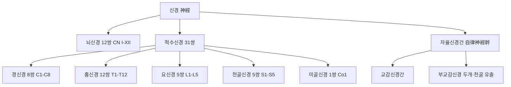
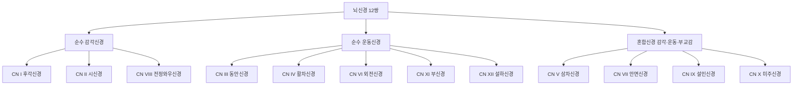
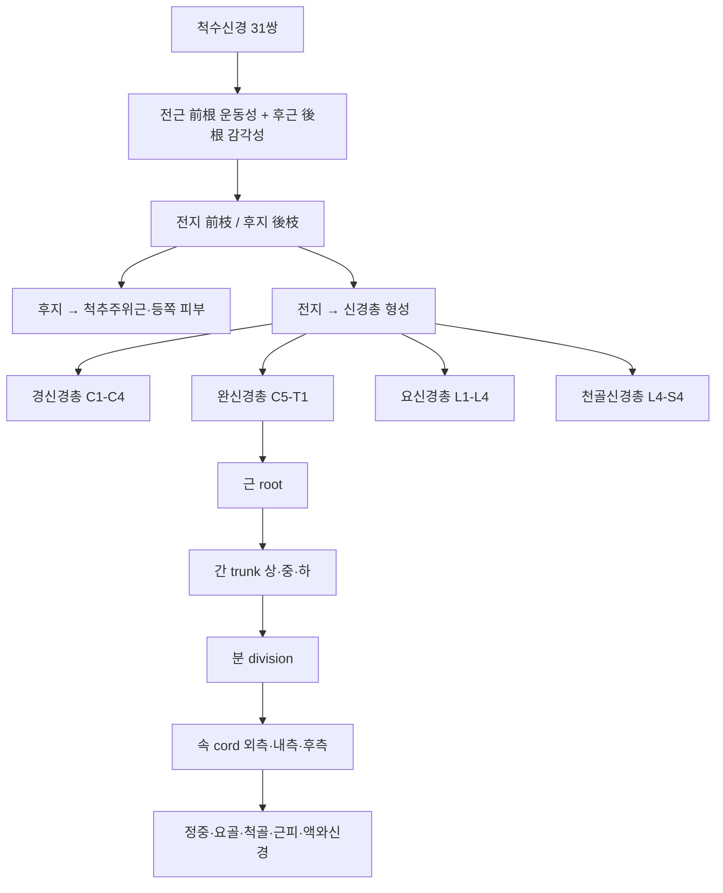
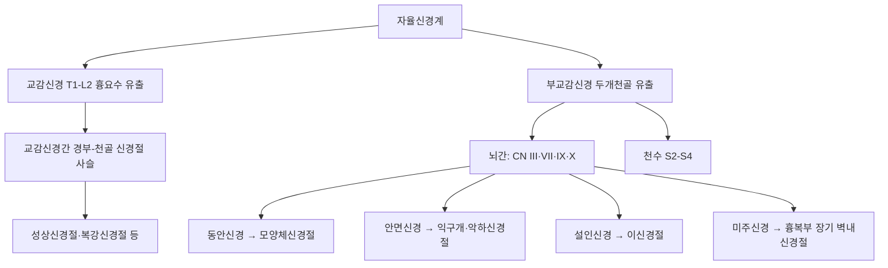

# 신경(神經, Nerve)

신경(神經, nerve)은 육안해부학적으로 관찰되는 신경섬유의 다발로, 결합조직초에 싸여 중추신경계(central nervous system, CNS)와 신체 각 부위 사이를 연결하는 구조물이다[교과서적 근거]. 조직학 총론에서는 신경조직(神經組織, nervous tissue)의 미세구조인 뉴런·신경교세포·시냅스·신경가소성을 뉴런 단위에서 다루었고, 한방생리학에서는 뇌(腦)를 수해(髓海)로 규정하는 중추신경계 중심의 이론을 심층적으로 다루었다. 본 문서는 그와 구별되는 **육안 해부학(gross anatomy)적 관점**에서, 뇌신경(腦神經) 12쌍·척수신경(脊髓神經) 31쌍·신경총(神經叢)·자율신경간(自律神經幹)이 인체에서 실제로 어떤 경로로 주행하며 어느 부위에서 침구·추나 시술과 해부학적으로 교차하는지를 국소해부학 수준에서 정리한다.

침구 임상에서 신경의 육안 해부학적 주행 경로를 이해하는 것은 두 가지 실용적 의미를 지닌다. 첫째, 다수의 전통 경혈이 특정 말초신경의 주행 경로·분지점·신경 밀도가 높은 구역과 밀접하게 일치한다는 해부학적 관찰이 축적되어 있어, 경혈-신경 상관은 침구 자극의 신경생리학적 기전을 설명하는 유력한 틀이 된다[^1]. 둘째, 자입 각도·깊이가 신경·혈관·흉막의 해부학적 위치를 벗어나면 기흉·신경 손상과 같은 심각한 합병증으로 이어질 수 있어, 신경 해부학 지식은 시술 안전성의 토대가 된다. 본 문서는 이 두 축(경혈-신경 상관의 임상적 활용, 신경 손상 예방을 위한 국소해부)을 중심으로 뇌신경·척수신경·신경총·자율신경계의 각론을 서술한다.

## 제1편 총론 — 신경계의 육안 해부학적 구성

### 1. 중추신경계와 말초신경계의 구분

신경계는 육안해부학적으로 뇌와 척수로 구성된 중추신경계, 그리고 뇌신경·척수신경·말초신경절로 구성된 말초신경계(peripheral nervous system, PNS)로 대별된다[교과서적 근거]. 중추신경계는 두개골과 척추관이라는 골성 구조물로 둘러싸여 보호받으며, 말초신경계는 이 골성 보호에서 벗어나 체표와 내장 기관까지 뻗어 나가므로 외상·압박·시술에 의한 손상에 상대적으로 더 노출되어 있다[교과서적 근거]. 침구 시술이 직접 접촉하는 대상은 대부분 말초신경계이며, 본 문서의 제2·3편은 이 말초신경계의 두 축인 뇌신경과 척수신경을 각각 다룬다.

### 2. 기능적 구분 — 체성신경계와 자율신경계

기능적으로 말초신경계는 의식적 조절을 받는 체성신경계(體性神經系, somatic nervous system)와 불수의적으로 내장·혈관·분비샘을 조절하는 자율신경계(自律神經系, autonomic nervous system)로 나뉜다[교과서적 근거]. 체성신경계는 골격근의 수축을 지배하는 원심성(운동) 섬유와 피부·근육·관절의 감각을 전달하는 구심성(감각) 섬유로 구성되며, 자율신경계는 다시 교감신경(交感神經, sympathetic nervous system)과 부교감신경(副交感神經, parasympathetic nervous system)으로 나뉘어 서로 길항적으로 내장 기능을 조절한다[교과서적 근거]. 이 구분은 제4편에서 다룰 자율신경 해부와 체성-자율신경 반사의 해부학적 토대가 된다.

### 3. 말초신경의 결합조직초 구조 — 신경외막·신경주위막·신경내막

육안으로 관찰되는 하나의 말초신경은 다수의 신경섬유다발(신경속, fascicle)이 모인 구조이며, 세 층의 결합조직초로 둘러싸여 있다[교과서적 근거]. 신경외막(神經外膜, epineurium)은 신경 전체를 감싸는 가장 바깥층의 성긴 결합조직으로, 신경에 영양을 공급하는 혈관과 지방조직을 포함하여 신경을 외부 압박·견인으로부터 보호하는 완충재 역할을 한다. 신경주위막(神經周圍膜, perineurium)은 개별 신경속을 감싸는 치밀한 결합조직층으로, 혈액-신경장벽(blood-nerve barrier)을 형성하여 신경속 내부의 미세환경을 안정적으로 유지한다. 신경내막(神經內膜, endoneurium)은 신경주위막 안쪽에서 개별 신경섬유(축삭과 슈반세포)를 감싸는 성긴 결합조직으로, 모세혈관과 섬유모세포를 포함한다[교과서적 근거]. 이 삼층 구조는 신경이 관절 운동이나 자입 시 발생하는 견인력을 어느 정도 흡수할 수 있게 하지만, 자입침이 신경외막을 뚫고 신경속 내부로 직접 진입하면 신경내막 내 축삭이 직접 손상되어 저항감·전기 충격감(electric shock sensation)과 함께 감각·운동 결손이 발생할 수 있다[^2]. 침 시술 중 발생하는 전기 충격감은 정상적인 득기(得氣) 반응이 아니라 말초신경이 직접 자극되었거나 손상되었을 가능성을 알리는 경고 신호로 해석해야 한다는 문헌 고찰이 있어[^2], 임상에서 이러한 감각이 발생하면 즉시 자침 깊이·각도를 재조정해야 한다.

### 4. 신경 분포와 경혈의 관계 — 분절 지배와 국소해부

각 척수분절은 특정 피부분절(dermatome)·근분절(myotome)·내장분절(viscerotome)을 지배하며, 이 분절 지배 원칙은 침구 취혈의 신경해부학적 근거를 제공한다[교과서적 근거]. 흔한 질환에 사용되는 전통 경혈이 서양의학적 신경해부학 구조와 밀접히 관련된다는 고찰은, 근육통에는 근육 내 자극이, 신경병증에는 신경 자체에 대한 자극이, 위염과 같은 내장 질환에는 체성-자율신경 반사 기전이 각각 관여함을 제시하여 침구 치료의 신경해부학적 근거와 환자 설명 틀을 제공하였다[^1]. 안면·전두부 경혈들을 삼차신경(CN V)과 안면신경(CN VII)의 해부학적 경로를 통해 재정의하여 경혈 위치를 과학적으로 이해할 수 있는 근거를 제시한 고전적 연구도 있다[^3]. 말초신경병증에 대한 성공적인 무작위 대조 임상시험들을 검토한 후속 체계적 고찰은, 대부분의 유효한 연구가 병변이 있는 말초신경과 해부학적으로 밀접한 위치의 혈위를 선택하여 자침하였다는 공통점을 확인하였다[^4]. 이러한 근거들은 변증 없는 관행적 취혈이 아니라, 병변 신경의 해부학적 위치와 환자의 변증을 함께 고려한 취혈 전략이 근거에 부합함을 시사한다.

> 신경 해부학 지식이 곧 침구 치료 기전의 전부를 설명하지는 않는다. 경혈-신경 상관은 침구 자극의 국소적 작용 기전을 이해하는 하나의 틀일 뿐이며, 변증에 따른 전신적 치료 원칙과 함께 해석되어야 한다.

## 제2편 뇌신경(腦神經) 12쌍

### 1. 개관과 분류

뇌신경은 뇌간과 대뇌에서 직접 기시하여 두개골의 구멍(공, foramen)을 통해 나가는 12쌍의 말초신경으로, 로마 숫자(CN I~XII)로 번호를 매겨 지칭한다[교과서적 근거]. 기능적으로 순수 감각신경(CN I, II, VIII), 순수 운동신경(CN III, IV, VI, XI, XII), 혼합신경(감각·운동·부교감섬유를 함께 포함, CN V, VII, IX, X)으로 나뉜다[교과서적 근거]. 기시 위치를 기준으로 보면 CN I(후각신경)은 대뇌(후각망울)에서, CN II(시신경)는 간뇌(시각교차 경유)에서 발생학적으로 기원하며, CN III·IV는 중뇌, CN V·VI·VII·VIII는 교뇌(뇌교), CN IX·X·XI·XII는 연수에서 각각 기시하여 뇌간의 상하 위치와 뇌신경 번호가 대체로 대응한다는 규칙성을 보인다[교과서적 근거]. 각 뇌신경은 두개골의 특정 공(孔)을 통해 두개강을 벗어나는데, 시신경은 시신경관(optic canal), 삼차신경은 상안와열(V1)·정원공(V2)·난원공(V3), 안면신경·전정와우신경은 내이도, 설인신경·미주신경·부신경은 경정맥공, 설하신경은 설하신경관을 각각 통과한다[교과서적 근거]. 안면 및 전두부의 경혈들이 삼차신경과 안면신경의 경로를 통해 재정의될 수 있다는 고전적 연구[^3]와, 두면부 경혈 전반을 뇌신경의 해부학적 분포와 연계하여 정리한 문헌[^5]은 뇌신경 해부가 두면부 침구 취혈의 기초임을 뒷받침한다.

| 번호 | 명칭(국문/한자) | 주 기능 | 침구 임상 관련성 |
|---|---|---|---|
| CN I | 후각신경(嗅覺神經) | 후각 | 두면부 취혈 시 직접 손상 위험은 낮음 |
| CN II | 시신경(視神經) | 시각 | 안와 주변 자침 시 손상 회피 대상 |
| CN III | 동안신경(動眼神經) | 안구 운동(내직근·상직근·하직근·하사근), 동공 수축 | 안구운동장애 침구 치료의 대상[^6] |
| CN IV | 활차신경(滑車神經) | 상사근 운동 | 안구운동장애 감별 대상 |
| CN V | 삼차신경(三叉神經) | 안면 감각, 저작근 운동 | 삼차신경통, 안면부 경혈 신경해부의 핵심[^3][^7] |
| CN VI | 외전신경(外轉神經) | 외직근 운동 | 외직근 마비 침구 치료 대상[^8] |
| CN VII | 안면신경(顔面神經) | 표정근 운동, 혀 앞 2/3 미각, 눈물·타액선 분비 | 안면신경마비(구안와사)의 핵심 신경[^9][^10] |
| CN VIII | 전정와우신경(前庭蝸牛神經) | 청각, 평형감각 | 청신경초종 수술 후 합병증과 연관[^8] |
| CN IX | 설인신경(舌咽神經) | 혀 뒤 1/3 미각·감각, 인두 운동, 경동맥동 반사 | 연하곤란 관련 |
| CN X | 미주신경(迷走神經) | 광범위한 부교감 지배(심장·위장관·호흡기) | 체성-자율신경 반사, 제4편에서 상술 |
| CN XI | 부신경(副神經) | 흉쇄유돌근·승모근 운동 | 경항부 취혈 시 근전도 연관 |
| CN XII | 설하신경(舌下神經) | 혀 근육 운동 | 연하·구음 장애 관련 |

> 이 표는 뇌신경의 표준 해부학적 분류이며, 실제 임상에서는 개별 신경의 손상 원인(외상·감염·종양·특발성)에 따라 관여하는 침구 치료 전략이 달라진다.

### 2. 안면신경(CN VII)과 안면신경마비 각론

#### 2-1. 안면신경의 주행 경로

안면신경은 뇌교(교뇌)에서 기시하여 내이도(internal acoustic meatus)를 통과한 뒤 측두골 안의 안면신경관(facial canal)을 굴곡 주행하고, 경유돌공(stylomastoid foramen)을 통해 두개골 밖으로 나온 후 이하선(귀밑샘) 내부에서 측두지·관골지·협지·하악연지·경지의 다섯 분지로 갈라져 안면 표정근을 지배한다[교과서적 근거]. 이 주행 경로 중 특히 경유돌공 부위와 이하선 내부 구간은 부종·염증·수술적 손상에 취약한 해부학적 협착부다.

안면신경관 내부를 지나는 동안 안면신경은 슬신경절(膝神經節, geniculate ganglion)을 이루고, 대추체신경(greater petrosal nerve, 누선·코샘 분비 지배)·등골근신경(stapedial nerve, 등골근 지배)·고삭신경(chorda tympani, 혀 앞 2/3 미각과 악하선·설하선 분비 지배)의 세 분지를 순서대로 낸다[교과서적 근거]. 병변의 위치가 이 세 분지 중 어느 지점보다 근위(近位)인지 원위(遠位)인지에 따라 미각 소실·눈물 분비 이상 동반 여부가 달라지므로, 이 국소해부는 벨마비의 병변 국재화(localization)에 임상적으로 활용된다. 안면신경 자체의 표면 지표는 이개(귓바퀴) 앞쪽 이주(耳珠, tragus) 전하방 약 1cm 지점의 경유돌공 투영점과 하관(下關, ST7)·협거(頰車, ST6) 부근의 이하선 영역이며, 이 부위는 초음파로 신경 분지를 확인할 수 있다. 다섯 분지가 지배하는 표정근은 각각 전두근·안륜근(측두지), 상순거근·협골근(관골지), 협근·구륜근(협지), 하순하체근(하악연지), 경활근(경지)으로, 손상 부위에 따라 이마 주름 소실·눈 감김 불완전(토안, lagophthalmos)·구각 처짐 등 특징적인 하위운동신경세포성(peripheral) 마비 양상이 상위운동신경세포성 마비와 감별점을 이룬다[교과서적 근거].

#### 2-2. 말초성 안면신경마비(벨마비)의 침구 임상 근거

말초성 안면신경마비(구안와사, 벨마비, Bell's palsy)에 대한 전침(電鍼) 치료가 수침이나 일반 치료보다 반응률과 신경 기능 회복 면에서 우수함을 확인한 메타분석(1,985명)이 있다[^9]. 벨마비 환자의 안면신경 손상 정도를 평가할 때 전기 반응 등급(electrical response grading) 방식이 기존 House-Brackmann 척도보다 예후 예측에 더 객관적이라는 관찰연구도 있다[^10]. 급성기 침 치료 및 원적외선 병행이 치료 지연군보다 완치 기간을 단축시킨다는 임상시험[^11], 침과 뜸 치료가 일반 약물 치료(스테로이드·비타민)보다 우수한 효과를 보였다는 439명 대상 다기관 무작위 대조 연구[^12], 득기를 유도하는 강한 자극의 침 치료가 안면신경 기능 회복·삶의 질 향상에 더 효과적임을 보인 338명 대상 CMAJ 게재 RCT[^13]가 대표적이다. 매선(埋線) 요법이 침 치료보다 안면신경 기능 회복과 전기신경도(ENoG) 개선에 더 효과적이라는 279명 대상 무작위 대조 연구[^14]도 있다. 일본안면신경연구회가 2023년 개정한 벨마비 임상진료지침은 표준 용량의 전신 스테로이드 투여를 강력히 권고하고 있어[^15], 한의학적 침구 치료는 이러한 표준 치료와의 병용 관점에서 근거를 축적하고 있다.

코로나19 백신(ChAdOx1 nCoV-19) 접종 후 발생한 말초성 안면신경마비 환자에게 표준 치료와 병행하여 침·전침·봉침·부항·한약의 복합 한방 치료를 적용해 증상이 개선된 증례[^16], 벨마비 후유증 환자에게 8주간 침 치료를 시행해 안면 기능뿐 아니라 사회적 기능·웰빙 지수가 향상되었다는 무작위 대조 연구[^17]도 있다. 다만 안면신경 자기공명영상 결과가 정상인 환자에서는 침 단독 치료와 스테로이드 병용 치료 사이에 완치율 차이가 유의하지 않았다는 관찰도 있어[^18], 병변의 중증도에 따른 치료 전략 차별화가 필요함을 시사한다.

#### 2-3. 의원성·외상성 안면신경 손상에 대한 침구 개입

수술적 시술이 안면신경을 직접 손상시킨 경우에도 침구 개입이 시도되고 있다. 턱관절 수술 후 발생한 의원성 안면신경마비에 침 치료를 시행하여 House-Brackmann 등급이 개선된 증례[^19], 청신경초종(聽神經鞘腫) 수술 후 발생한 외직근 마비와 안면신경 손상에 방씨침구 이론을 적용한 침 치료가 효과적이었던 증례[^8], 이하선(귀밑샘) 전절제술 후 발생한 안면신경 손상에 경근(經筋) 이론에 기반해 근막 유착 부위('근결', 筋結)를 도침(刃針)으로 박리한 증례[^20]가 보고되었다. 감마나이프 수술 후 발생한 다발성 뇌신경 손상 환자에게 기혈을 보하고 혈액순환을 촉진하는 침구 치료와 재활을 병행해 안면마비·연하곤란이 개선된 증례[^21]도 있다. 이러한 증례들은 안면신경의 정확한 해부학적 주행 경로에 대한 이해가 손상 부위 특정과 치료 계획 수립에 필수적임을 보여준다.

### 3. 삼차신경(CN V)과 삼차신경통 각론

#### 3-1. 삼차신경의 3대 분지와 안면부 경혈의 해부학적 관계

삼차신경은 뇌교에서 기시하여 측두골 추체 첨단부의 삼차신경절(三叉神經節, trigeminal ganglion, Gasserian ganglion 또는 semilunar ganglion)에서 안신경(眼神經, V1), 상악신경(上顎神經, V2), 하악신경(下顎神經, V3)의 세 분지로 나뉘며, 각각 상안와열(V1)을 거쳐 안와상공(supraorbital foramen), 정원공(V2)을 거쳐 안와하공(infraorbital foramen), 난원공(V3)을 거쳐 이공(mental foramen)을 통해 안면부로 나와 감각을 지배한다[교과서적 근거]. 감각 지배 영역은 V1이 이마·두피 앞부분·각막을, V2가 상안검 아래부터 윗입술까지의 중안면부를, V3가 아래턱·아랫입술·측두부를 각각 담당하여 세 분지가 겹치지 않는 뚜렷한 피부분절 경계를 이룬다는 점이 임상적으로 중요하다 — 이 경계는 안면 감각 이상의 분포만으로 침범된 분지를 감별하는 근거가 된다[교과서적 근거]. 하악신경(V3)은 유일하게 운동섬유를 함께 포함하여 교근(咬筋)·측두근(側頭筋)·내·외측익돌근(翼突筋) 등 저작근군을 지배하므로, 삼차신경 운동핵 병변에서는 감각 이상 없이 저작 기능 저하만 나타날 수 있다[교과서적 근거]. 안면부 경혈들이 삼차신경의 주행 경로·분지점·신경 밀도가 높은 구역과 밀접하게 일치한다는 해부학적 고찰이 있으며[^3], 이는 두면부 경혈(양백·사백·지창·하관 등)이 삼차신경 분지의 체표 투영점과 상당 부분 겹친다는 전통 취혈 원칙의 신경해부학적 근거로 논의된다. 안와상공·안와하공·이공은 각각 눈썹 안쪽 1/3 지점, 눈 아래 약 1cm, 아래턱 앞니와 어금니 사이 지점에서 촉지·압통으로 체표에서 확인할 수 있어, 삼차신경통 진찰 시 압통점(Valleix 압통점) 검사의 해부학적 근거가 된다.

#### 3-2. 삼차신경통에 대한 침구 임상 근거

삼차신경통에 전침 단독 또는 저용량 카르바마제핀 단독 치료 모두 통증 완화에 효과적이며, 두 치료를 병용했을 때 가장 큰 시너지 효과가 나타났다는 2×2 요인설계 RCT(120명)가 있다[^22]. 침 치료가 카르바마제핀보다 통증 감소 효과가 우수하고 부작용은 더 적었다는 메타분석(1,231명)[^23], 침 치료가 삼차신경통 환자의 통증 강도·발생 빈도·전체 반응률을 개선하며 특히 약물 병용 시 효능이 증대되고 부작용은 감소하는 경향을 보인 최신 메타분석(2,836명, GRADE 평가 포함)[^24], 다수의 네트워크 메타분석이 침구 관련 요법들의 상대적 효과를 비교하였다[^25]. 다만 개별 연구의 편향 위험이 높고 통증 보고 방식이 일관되지 않아 결과 신뢰도가 제한적이라는 최신 메타분석의 지적도 있어[^26], 근거 해석에 신중함이 요구된다. 삼차신경통 환자에게 시행한 침 치료가 장기적으로 우울증 발생 위험을 유의하게 낮출 수 있다는 대규모 코호트 연구(1,552명)[^27]도 있다.

삼차신경통의 침구 치료에서는 해부학적 신경공(神經孔)과 신경절을 표적으로 하는 국소 취혈이 강조된다. 하관(下關, ST7) 혈위를 접형구개신경절(sphenopalatine ganglion) 깊이까지 깊게 자입하는 전침 치료가 일반적인 천자법보다 효과적이었다는 무작위 대조 연구[^28], 삼차신경통 치료 시 국소 혈위·신경 분포 기반 혈위·원위 취혈을 조합하는 것이 효과적이라는 취혈 규칙 분석[^29], 해부학적 신경공과 신경절을 표적으로 하는 침 치료법의 이론적 근거를 정리한 문헌[^30]이 이를 뒷받침한다.

### 4. 미주신경(CN X)과 그 밖의 뇌신경 임상 함의

미주신경은 체내 최장의 뇌신경으로 두개저의 경정맥공(jugular foramen)을 통해 나와 경부·흉부·복부까지 광범위하게 분포하며 부교감신경 지배를 담당한다[교과서적 근거]. 미주신경의 상세 경로와 침구 자극과의 관계는 제4편에서 다룬다. 안구운동장애를 유발하는 신경(동안신경·외전신경) 손상에 대해서는 전침 치료가 안구 이동 거리·동공 크기 개선 및 완치율 면에서 일반 침 치료보다 우수했다는 임상시험(60명)이 있다[^6]. 다발성 뇌신경 병변을 동반한 람세이 헌트 증후군(Ramsay Hunt syndrome) 환자의 난치성 외이도 소양증에 침 치료가 대안이 될 수 있다는 증례[^31], 감마나이프 수술 후 다발성 뇌신경 손상에 대한 침구 병행 증례[^21]도 뇌신경 영역 침구 치료의 임상 스펙트럼을 보여준다.

> 뇌신경 손상 관련 침구 근거는 벨마비·삼차신경통에서는 임상시험·메타분석 수준의 자료가 상당히 축적되어 있으나, 그 외 뇌신경(동안신경·외전신경 손상, 다발성 뇌신경병증)에 대한 근거는 대부분 증례 보고 수준에 머물러 있다. 변증 없는 관행적 취혈이 아니라 손상된 개별 뇌신경의 해부학적 주행과 변증을 함께 고려한 취혈이 근거에 부합한다.

## 제3편 척수신경과 신경총(神經叢)

### 1. 척수신경 총론

척수신경은 척수의 좌우에서 각 분절마다 한 쌍씩, 총 31쌍(경신경 8쌍, 흉신경 12쌍, 요신경 5쌍, 천골신경 5쌍, 미골신경 1쌍)이 나와 척추관을 벗어난다[교과서적 근거]. 각 척수신경은 척수 앞쪽의 전근(前根, ventral root, 운동성)과 뒤쪽의 후근(後根, dorsal root, 감각성)이 척추간공(intervertebral foramen) 부근에서 합쳐져 형성되며, 후근에는 감각신경절(후근신경절, dorsal root ganglion)이 있다[교과서적 근거]. 척추간공을 나온 직후 척수신경은 즉시 전지(前枝, ventral ramus)와 후지(後枝, dorsal ramus)로 나뉘는데, 후지는 척추 주변 근육(척추기립근군)과 등 쪽 피부를, 전지는 사지와 몸통 앞쪽을 각각 지배한다[교과서적 근거]. 흉부 영역을 제외한 대부분의 척수신경 전지는 인접한 분절끼리 그물처럼 얽혀 신경총(神經叢, plexus)을 형성한 뒤 재편성되어 말초로 나가는데, 이 신경총 구조가 사지 신경 손상의 임상 양상을 이해하는 핵심이다[교과서적 근거].

### 2. 경신경총(頸神經叢, Cervical Plexus)

경신경총은 제1~4경신경(C1-C4)의 전지로 구성되며, 흉쇄유돌근 뒤모서리 중점(Erb점, 신경총의 표재 분지가 피부 밑으로 나오는 대표적 체표 지표) 부근에서 소후두신경(小後頭神經, lesser occipital)·대이개신경(大耳介神經, great auricular)·경횡신경(頸橫神經, transverse cervical)·쇄골상신경(鎖骨上神經, supraclavicular) 네 개의 표재 감각지를 내어 후두부·귓바퀴 주변·경부 앞면·어깨 상부 피부감각을 지배하고, 견갑거근·설골하근군을 지배하는 근지(筋枝), 그리고 대요근 앞쪽을 지나 흉강으로 내려가 횡격막을 지배하는 횡격신경(膈神經, phrenic nerve, C3-C5)을 분지한다[교과서적 근거]. 횡격신경은 경부에서는 전사각근 표면을 비스듬히 하행하므로 경부 심자 시 손상 가능성이 있으며, 손상 시 동측 횡격막 마비로 호흡곤란이 유발될 수 있다. 경부 측면(견정·풍지·완골 인근)의 심자(深刺) 시 경신경총의 표재 분지와 횡격신경 주행 경로를 고려해야 하며, 견정혈(肩井, GB21) 심부 자침이 폐첨(肺尖)에 가까워 기흉 위험이 있다는 점은 제5편에서 상술한다.

### 3. 완신경총(腕神經叢, Brachial Plexus)과 상지 말초신경

#### 3-1. 완신경총의 구성

완신경총은 제5경신경부터 제1흉신경(C5-T1)까지의 전지가 사각근 사이 공간(사각근간극)에서 근간(根, root)·간(幹, trunk, 상간·중간·하간)·분(division, 전분지·후분지)·속(束, cord, 외측속·내측속·후측속)의 순서로 재편성되어 형성되는 복잡한 신경총이다[교과서적 근거]. 쇄골 아래에서 최종적으로 정중신경(正中神經, median nerve)·요골신경(橈骨神經, radial nerve)·척골신경(尺骨神經, ulnar nerve)·근피신경(筋皮神經, musculocutaneous nerve)·액와신경(腋窩神經, axillary nerve)의 다섯 주요 말초신경으로 분지되어 상지로 내려간다[교과서적 근거].

#### 3-2. 정중신경 — 합곡·수근관 임상해부

정중신경은 완신경총의 외측속과 내측속에서 각각 기시한 두 뿌리가 합쳐져 상완을 따라 하행하고, 손목 부위에서 수근관(手根管, carpal tunnel)을 통과해 손바닥으로 진입한다[교과서적 근거]. 수근관은 굴근지대(flexor retinaculum)와 손목뼈로 둘러싸인 좁은 통로로, 이 부위 압박이 수근관증후군(carpal tunnel syndrome, CTS)의 병태생리다[교과서적 근거]. 합곡(合谷, LI4)(이하 합곡(LI4)) 혈위는 정중신경이 아닌 요골신경 천지(淺枝)의 혈관지와 인접하며, 개인별 해부 변이가 있어 안전한 자침 깊이·각도 설정이 필요하다는 해부학적 연구가 있다[^32][^33].

수근관증후군에 대한 코크란 체계적 고찰은 침 및 관련 중재법이 증상 완화에 잠재적 유용성이 있으나 현재까지의 근거는 매우 낮거나 불확실하며 단기 효과에 국한된다고 결론지었다(869명)[^34]. 야간 손목 보조기와 전침 병행이 보조기 단독보다 증상·기능 개선에 효과적이었다는 181명 대상 CMAJ RCT[^35], 침 치료가 손목 부목 치료와 병행 시 정중신경의 단면적(CSA)을 초음파로 확인 가능한 수준까지 유의하게 감소시켰다는 27명 대상 임상시험[^36], 전침이 통증·증상심각도·손 기능을 개선하고 정중신경 단면적을 유의하게 감소시켰다는 최신 임상·전기생리·초음파 병행 연구[^37]가 있다. 전침 치료가 수근관증후군 환자의 S1-시상 및 S1-해마 간 뇌 연결성을 조절함으로써 정중신경 기능 회복과 임상 증상 개선을 유도한다는 연구[^38], 전침 치료가 일차 체성감각피질(S1)의 재구성(rewiring)을 유도한다는 Brain지 게재 연구(80명)[^39]는 말초신경 병변에 대한 침구 개입이 중추신경계 수준의 신경가소성 변화와 연관될 수 있음을 보여준다. 정중신경과 척골신경 상의 혈위에 대한 침구 자극이 신경전도와 감각 역치에 미치는 국소적 영향을 분석한 파일럿 연구도 진행되었다[^40].

#### 3-3. 요골신경 — 자침 안전과의 관계

요골신경은 완신경총 후측속에서 기시하여 상완골 뒤쪽의 요골신경구(radial groove)를 나선형으로 감아 돌아 하행한 뒤, 팔꿈치 부근에서 심지(운동, 후골간신경)와 천지(감각)로 나뉜다[교과서적 근거]. 요골신경 천지는 손등에서 합곡혈 부위와 밀접하게 인접하는데, 합곡혈이 요골신경 천지에서 분지되어 동맥으로 진입하는 혈관지(vascular branch)와 매우 인접해 있다는 해부학적 연구[^32], 합곡혈 주변 정맥총·요골신경 분지·제1배측골간근의 해부 변이를 확인한 연구[^33]가 자입 깊이·각도 설정의 안전성 근거를 제공한다. 진동 유발 손가락 굴곡 반사에 대한 요골신경뿐 아니라 정중신경·척골신경 영역 혈위 자극의 억제 효과를 비교한 연구도 있다[^41].

#### 3-4. 척골신경 — 봉침 안전사고 사례

척골신경은 완신경총 내측속에서 기시하여 상완 내측을 따라 하행한 뒤 팔꿈치의 척골신경구(주관, cubital tunnel)를 통과하여 전완·손으로 내려간다[교과서적 근거]. 이 팔꿈치 부위는 척골신경이 피부 가까이 얕게 주행하는 대표적인 해부학적 취약 구간으로, 봉침(蜂鍼) 시술 시 이 부위 인근에 자침한 뒤 심각한 신경 손상이 발생한 증례가 보고되었다[^42]. 이 증례는 해부학적 위험 부위에 대한 정확한 지식 없이 자극성이 강한 시술(봉침 등)을 시행할 경우 발생할 수 있는 합병증을 경고한다. 척골신경 완전 파열 환자에게 침을 이용한 직접 전기자극과 재활을 병행하여 신경 재생과 기능 회복을 촉진시킨 증례[^43], 주관절 터널 증후군 환자에게 궁상인대 기점·종점을 절개하는 '두 지점' 도침 수술을 시행하여 척골신경 포착을 해소한 증례[^44]도 있다.

#### 3-5. 근피신경·액와신경

근피신경은 상완 전방의 굴근군(상완이두근·상완근)을 지배하고 전완 외측의 피부감각을 담당하며, 액와신경은 삼각근과 어깨 외측 피부감각을 담당한다[교과서적 근거]. 견관절 주변 자침 시 삼각근 깊이 이상의 과도한 자입은 액와신경 손상 위험을 높일 수 있어 주의가 필요하다.

### 4. 요신경총·천골신경총과 하지 말초신경

#### 4-1. 요신경총과 대퇴신경

요신경총은 제1~4요신경(L1-L4)의 전지로 구성되며, 대요근(psoas major muscle) 내부에서 형성되어 대퇴신경(大腿神經, femoral nerve)·폐쇄신경(閉鎖神經, obturator nerve)·외측대퇴피신경(lateral femoral cutaneous nerve) 등을 분지한다[교과서적 근거]. 대퇴신경은 대퇴사두근을 지배하고 대퇴 전면·하퇴 내측의 피부감각을 담당한다. 만성 중증 대퇴신경 손상 환자에게 전침 치료를 적용하여 운동·감각 기능이 유의미하게 개선된 증례가 보고되어[^45], 대퇴신경 손상 자체가 침구 치료의 대상이 될 수 있음을 시사한다.

#### 4-2. 천골신경총과 좌골신경

천골신경총은 제4·5요신경과 제1~4천골신경(L4-S4)의 전지로 구성되며, 인체에서 가장 굵고 긴 신경인 좌골신경(坐骨神經, sciatic nerve)을 분지한다[교과서적 근거]. 좌골신경은 이상근(梨狀筋, piriformis muscle) 아래 또는 사이로 골반을 빠져나와 둔부·대퇴 후면을 지나 슬와부(오금)에서 총비골신경(總腓骨神經, common peroneal nerve)과 경골신경(脛骨神經, tibial nerve)으로 나뉜다[교과서적 근거]. 환도(環跳, GB30) 혈위는 좌골신경이 이상근 아래를 지나는 지점과 해부학적으로 밀접하여 전통적으로 좌골신경통(요각통) 취혈의 핵심 혈위로 사용되어 왔다.

좌골신경통에 대한 X선 유도 하 척수신경근 직접 전침술이 즉각적인 증상 완화와 선택적 신경차단술보다 긴 효과 지속 시간을 보였다는 코호트 연구[^46], 요추 추간판 탈출증에 의한 좌골신경통에 좌골신경줄기를 직접 자극하는 침 치료를 병행한 것이 통증 완화·임상 개선율을 높였다는 무작위 대조 연구(60명)[^47], 좌골신경 손상 치료에서 침 치료, 특히 환도·회종(會宗) 혈위 사용과 전침 치료가 신경 재생·통증 완화에 효과적임을 확인한 서지계량학적 분석[^48]이 있다. 난치성 좌골신경통에 환도혈 온침과 부항 병행이 효과적이며, 특히 자침 시 좌골신경을 직접 자극하는 기법이 치료 유효율을 높일 수 있다는 관찰도 있다[^49]. 다만 좌골신경 자궁내막증(sciatic nerve endometriosis)이 요추척추증으로 오인될 수 있다는 증례 보고는[^50], 좌골신경통 양상을 보이는 환자에서 정밀한 병력 청취를 통한 기질적 질환 감별의 중요성을 보여준다.

#### 4-3. 총비골신경(비골신경)과 경골신경

총비골신경은 비골두(fibular head) 외측을 표재적으로 감아 도는 구간이 있어 압박·외상에 특히 취약하며, 이 부위 손상은 족하수(foot drop)를 유발할 수 있다[교과서적 근거]. 비골신경마비에 대한 침 치료를 다룬 임상시험이 확인되며[^51], 양릉천(陽陵泉, GB34)이 전통적으로 비골신경 주행부 인근 혈위로서 하지 마비·저림 치료에 활용되어 왔다. 경골신경은 하퇴 후면 굴근군을 지배하며 발목 안쪽의 족근관(tarsal tunnel)을 통과하는데, 이 통로의 압박은 족근관증후군의 병태생리다[교과서적 근거].

> 상·하지 신경총 영역의 침구 근거는 좌골신경통·수근관증후군에서는 임상시험 수준의 자료가 축적되어 있으나, 나머지 말초신경(요골·근피·대퇴·비골신경 등)에 대한 근거는 대체로 증례 보고 수준에 머물러 있다. 신경총 영역 취혈 시에는 변증과 함께 손상 신경의 정확한 해부학적 위치를 확인하는 것이 안전성과 효과 모두에 중요하다.

## 제4편 자율신경계 해부

### 1. 교감신경간(交感神經幹)의 해부학적 경로

교감신경의 절전신경섬유는 흉수 T1~요수 L2 분절의 측각(側角, lateral horn)에서 기시하여 전근을 통해 나온 뒤 척추 양측을 따라 상하로 이어지는 교감신경간(sympathetic trunk)의 신경절에서 절후신경세포와 시냅스를 형성한다[교과서적 근거]. 교감신경간은 두개저부터 미골까지 척추 옆을 따라 사슬처럼 이어지며, 경부에서는 상경신경절·중경신경절·하경신경절(성상신경절, stellate ganglion 포함)을 형성하고, 흉부·복부에서는 각 분절 신경절과 함께 대내장신경·소내장신경 등을 분지하여 복강신경절로 이어진다[교과서적 근거]. 절전섬유가 반드시 같은 분절의 척추옆신경절(paravertebral ganglion)에서 시냅스를 이루는 것은 아니며, 상당수는 신경절을 그대로 통과하여 대내장신경(greater splanchnic nerve, T5-T9)·소내장신경(lesser splanchnic nerve, T10-T11)·최소내장신경(least splanchnic nerve, T12)을 이루어 횡격막을 관통한 뒤 복강동맥·상장간막동맥 주위의 척추앞신경절(prevertebral ganglion, 복강신경절·상장간막신경절·하장간막신경절)에서 비로소 절후뉴런과 시냅스를 형성한다[교과서적 근거]. 부신수질(副腎髓質)은 이러한 절전-절후 시냅스 과정 없이 절전신경섬유가 직접 분포하는 예외적인 표적기관으로, 자극 시 에피네프린·노르에피네프린을 혈중으로 직접 분비한다는 점에서 교감신경계의 특수한 확장으로 이해된다[교과서적 근거]. 이 경로는 배수혈(背兪穴)이 척추 양측을 따라 배치된 전통 취혈 원칙과 해부학적으로 겹치는 부분이 많아, 배수혈 자침이 국소적으로 교감신경간 및 그 주변 구조와 상호작용할 가능성이 논의된다.

### 2. 부교감신경 — 두개천골 경로와 미주신경

부교감신경은 뇌간(동안신경·안면신경·설인신경·미주신경에 동반)과 천골(S2-S4)의 두 부위에서만 기시하는 두개천골 경로(craniosacral outflow)를 취한다[교과서적 근거]. 뇌간 유출은 중뇌의 동안신경핵 옆 에딩거-베스트팔핵(Edinger-Westphal nucleus, 동안신경에 동반하여 모양체신경절에서 시냅스, 동공조임근·모양체근 지배)·교뇌의 상타액핵(안면신경에 동반하여 익구개신경절·악하신경절에서 시냅스, 누선·악하선·설하선 지배)·연수의 하타액핵(설인신경에 동반하여 이신경절에서 시냅스, 이하선 지배)·미주신경핵(dorsal motor nucleus of vagus, 흉복부 장기 벽내신경절에서 시냅스)의 네 뇌신경핵에서 각각 기시하며, 천수(S2-S4) 유출은 골반내장신경(骨盤內臟神經, pelvic splanchnic nerve)을 이루어 하행결장·직장·방광·생식기의 배뇨·배변·성기능을 조절한다[교과서적 근거]. 이 중 미주신경(CN X)은 체내 최장의 뇌신경으로 경정맥공을 나와 경동맥초(carotid sheath) 내부를 따라 하행하며 흉부에서 폐·심장 신경총을, 복부에서 위장관 대부분(횡행결장 근위부까지)에 부교감신경 지배를 제공한다[교과서적 근거]. 미주신경은 구심성 섬유를 통해 내장 상태를 중추신경계로 전달하는 뇌-장 축(brain-gut axis)의 핵심 경로이기도 하다[교과서적 근거].

이개(耳介, 귓바퀴)의 이개갑개(concha)는 미주신경의 이개지(auricular branch of vagus nerve)가 유일하게 체표에 분포하는 부위로 알려져 있으며, 이 해부학적 근거를 바탕으로 경피적 이개 미주신경 자극술(transcutaneous auricular vagus nerve stimulation, taVNS)이 개발되었다[^52]. 이개 미주신경 전침 자극은 뇌피질로 연결되는 유일한 말초 경로를 통해 고혈압·당뇨병·뇌전증·우울증 등 다양한 질환의 조절에 기여할 수 있다는 고찰이 있다[^52]. taVNS가 불면증 환자의 수면 질 개선·피로 감소·우울 및 불안 완화에 긍정적 영향을 줄 수 있다는 무작위 임상시험(72명)[^53], 아급성 허혈성 뇌졸중 환자에서 재활훈련과 taVNS 병행이 상지 운동기능 회복에 유의한 효과가 있고 안전했다는 무작위 파일럿 연구(21명)[^54], taVNS가 약제 내성 뇌전증 환자의 발작 빈도를 감소시키고 일부에서 발작 소실을 유도했다는 임상시험(50명)[^55]이 대표적이다. 만성 통증 관리에서 taVNS가 안전하고 내약성이 좋은 비침습적 대안이 될 수 있다는 최근 체계적 고찰도 있다[^56].

### 3. 체성-자율신경 반사와 침구 자극의 접점

체성-자율신경 반사(somato-autonomic reflex)는 체표·근육의 구심성 신호가 척수·뇌간을 거쳐 원심성 자율신경 출력(교감·부교감)을 변화시키는 반사 회로로, 침구 자극이 내장 기능을 조절하는 핵심 신경생리학적 기전으로 논의된다[교과서적 근거]. 이 반사궁은 척수 분절 수준에서 체성 구심로와 자율신경 원심로가 수렴하는 해부학적 배치에 기초하며, 족삼리(足三里, ST36)·내관(內關, PC6)과 같은 사지 혈위가 위장관·심혈관계에 대한 원위 조절 효과를 나타내는 이유를 설명하는 틀로 활용된다. 미주신경 자극과 관련한 안전성 측면도 함께 보고되어 있다. 침 치료 후 미주신경 반사로 인한 심한 서맥·부정맥이 유발되어 사망에 이른 부검 증례가 있어[^57], 미주신경 반응이 항상 치료적으로만 작용하는 것은 아니며 기저 심장질환이 있는 환자에서는 신중한 접근이 필요함을 보여준다.

### 4. 자율신경 기능 평가 지표

자율신경 기능은 심박변이도(heart rate variability, HRV)와 같은 비침습적 지표로 평가할 수 있으며, 이는 침구 연구에서 가장 널리 사용되는 객관적 지표다[교과서적 근거]. HRV의 저주파(LF)/고주파(HF) 성분비는 각각 교감/부교감 신경 활동의 상대적 균형을 반영하는 것으로 해석되며, 제5편의 추적 지표표에서 상술한다.

> 자율신경계 해부와 침구 자극 기전에 관한 근거는 taVNS와 같이 명확한 해부학적 표적(이개 미주신경 분포)을 가진 영역에서 상대적으로 확립되어 있으나, 체성-자율신경 반사 전반에 대한 근거는 여전히 관찰·실험 수준에 머물러 있다. 임상 적용 시 변증에 따른 취혈 원칙과 함께 해석해야 한다.

## 제5편 임상 적용과 안전성 — 국소해부와 신경 손상 예방

### 1. 흉곽 인접 혈위와 기흉(氣胸) 위험

흉막(胸膜, pleura)은 폐 표면을 감싸는 매우 얇은 막으로, 견갑배부·경항부·흉협부의 다수 경혈이 흉막 상단(폐첨)과 해부학적으로 가까운 위치에 있다[교과서적 근거]. 침 치료는 일반적으로 안전한 것으로 알려져 있으나 기흉이나 척수 손상과 같은 드물지만 치명적인 외상성 합병증이 발생할 수 있다는 문헌 고찰이 있다[^58]. 견정혈(肩井, GB21) 자침 시 발생할 수 있는 기흉을 예방하기 위해 초음파를 이용한 해부학적 깊이 측정의 유용성을 제시한 연구[^59], CT 스캔으로 흉부 주요 혈위의 피부 표면에서 흉막까지의 거리를 측정하여 안전 자입 깊이를 정량 분석한 연구[^60]가 안전한 자침 깊이 설정의 근거를 제공한다.

침 치료 후 기흉 발생은 드물지만 실제 임상에서 반복적으로 보고된다. 대만의 대규모 관찰연구(411,734명)는 침 치료 후 기흉 발생률이 매우 낮으나 흉부 수술 이력·만성 기관지염·폐기종·폐렴·결핵·폐암 등 폐 질환 병력이 있는 환자와 남성에서 발생 위험이 유의하게 높다고 보고했다[^61]. 중국 문헌을 체계적으로 분석한 세계보건기구(WHO) 학술지 게재 연구는 기흉·실신·지주막하출혈·감염 등 다양한 이상반응이 대부분 부적절한 시술 기술로 인해 발생했음을 확인했다(479명)[^62]. 1956~2010년 중국 문헌을 분석한 또 다른 체계적 고찰(1,038명)도 훈침·기흉·지주막하출혈이 주요 이상반응으로 나타났으며 환자의 심리적 긴장·시술자의 미숙한 조작·멸균 불충분이 주요 원인으로 분석되었다[^63]. 경부 부위 침 치료 및 부항 시술 후 기흉이 발생한 증례[^64], 화타협척혈(華佗夾脊穴)에 대한 침 치료 중 혈기흉이 발생한 증례[^65], 견갑거근 부위와 같이 피하 조직이 얇은 곳에 자침하여 발생한 양측성 기흉 증례[^66], 상배부·척추 주위의 부적절한 자침으로 양측 긴장성 기흉이 발생해 사망에 이른 부검 증례[^67]도 있다. 한국의 전통의학 시술 관련 부작용을 분석한 관찰연구(9,624명)에서도 기흉이 주요 부작용 유형 중 하나로 확인되었다[^68].

### 2. 척수·신경근 인접 혈위의 위험

경추 부위에 온침 시술 중 침의 직접 삽입 또는 열 손상으로 인해 척수 손상이 발생하여 해리성 감각 소실이 나타난 증례가 보고되어 있다[^69]. 이는 경항부 심자 시 척추관 내 척수·신경근까지 도달할 수 있는 자침 깊이·각도에 대한 각별한 주의가 필요함을 보여준다. 약침(藥鍼) 시술 시에도 부적절한 환자 자세, 주입 각도·깊이, 약물 선택이 말초신경 손상을 유발할 수 있다는 문헌 고찰이 있다[^70].

### 3. 안전성 표

| 위험 요소 | 관련 신경·부위 | 내용 | 근거 |
|---|---|---|---|
| 기흉 | 폐첨 인접 흉곽부(견정·대저·풍문 등) | 흉막 천공으로 인한 기흉·혈기흉, 극히 드물게 긴장성 기흉으로 사망 | [^58][^61][^67] |
| 척수·신경근 손상 | 경추부 심자 | 온침 등 열 손상 포함 척수 직접 손상, 해리성 감각 소실 | [^69] |
| 말초신경 직접 손상 | 척골신경(주관절·손목), 요골신경(합곡 인근), 정중신경(수근관) | 오자(誤刺)로 인한 감각·운동 결손, 봉침 등 자극성 시술 시 특히 주의 | [^32][^33][^42] |
| 안면·두경부 신경 손상 | 안면신경, 삼차신경 분지 | 안면부 경혈의 신경 밀집도가 높아 오자 위험 | [^3][^20] |
| 미주신경 반사성 서맥·부정맥 | 경부·이개 부위 자극 | 미주신경긴장 항진에 의한 서맥·실신, 극히 드물게 치명적 | [^57] |
| 약침 관련 신경 손상 | 사지 관절 주변 | 부적절한 자세·각도·약물 선택으로 인한 말초신경 손상 | [^70] |
| 근거 수준의 한계 | 전반 | 다수의 신경 손상 관련 근거가 증례 보고·소규모 관찰연구 수준 | [^34][^42] |

> 이 표는 신경 관련 임상 안전 원칙을 정리한 것이지 동일 근거수준의 권고가 아니며, 개별 환자의 해부학적 변이·기저질환(특히 만성 폐질환·심질환)에 따라 위험도가 달라질 수 있으므로 시술 전 개별 평가가 필요하다. 변증 없는 관행적 취혈·자침은 근거에 부합하지 않으며, 특히 신경·흉막 인접 혈위는 변증과 해부학적 위치를 함께 고려한 신중한 시술이 요구된다.

### 4. 신경전도검사(NCS)·근전도(EMG)와 침구 임상의 통합

신경전도검사(nerve conduction study, NCS)는 말초신경에 전기 자극을 가해 전도속도·진폭·잠복기를 측정함으로써 신경병증의 축삭 변성형·탈수초형을 감별하는 객관적 검사이며, 근전도(electromyography, EMG)는 근육의 전기적 활동을 기록하여 신경-근육 접합부와 근육 자체의 병변을 평가한다[교과서적 근거]. 건강한 한국인 성인을 대상으로 하지 신경전도검사의 연령별·신경별 표준 참고치를 제시한 연구[^71], 하지 말초신경에 대한 고해상도 초음파 단면적(CSA) 표준치를 제공한 연구[^72]는 국내 임상에서 신경전도·초음파 검사 결과를 해석하는 참고 기준이 된다.

한의학 진료에서 신경전도검사·근전도 결과를 변증 판단과 통합하는 접근은 임상적으로 중요하다. 침 치료가 당뇨병성 신경병증·벨마비·수근관증후군 환자의 신경병성 증상 개선 및 신경전도 파라미터 회복에 유의미한 효과가 있음을 보인 메타분석(680명)[^73], ACUDIN 연구(180명)는 전통 침 치료와 레이저 침 치료를 신경전도검사로 객관적으로 검증한 다기관 무작위 대조시험으로 당뇨병성 말초신경병증 환자의 신경전도 기능 회복에 유의한 효과를 확인했다[^74]. 침 치료가 화학요법 유발 말초신경병증 환자의 신경전도속도·진폭을 개선하여 구조적 신경 재생을 촉진했다는 무작위 교차 임상시험(ACUCIN, 60명)[^75]도 있다. 만성 대퇴신경 손상[^45], 척골신경 완전 파열[^43] 사례에서 침을 이용한 직접 전기자극이 신경 재생과 기능 회복에 기여했다는 증례들, 간헐적 직류 전침(DCEA) 자극이 말초신경 손상 환자의 신경 재생을 촉진할 가능성을 보인 탐색적 증례 시리즈(7명)[^76]는 신경전도검사와 같은 객관적 지표를 병용한 근거 축적이 계속 이루어지고 있음을 보여준다.

### 5. 추적 지표표

| 영역 | 추적 지표 | 관련 근거 |
|---|---|---|
| 말초신경 전도 기능 | 신경전도속도(NCV)·진폭·잠복기, 정중/척골/비골신경 CSA(초음파) | [^73][^74][^36][^71][^72] |
| 안면신경 기능 | House-Brackmann 등급, Sunnybrook 척도, 전기 반응 등급, 표면근전도(sEMG) | [^9][^10] |
| 자율신경 기능 | 심박변이도(HRV: SDNN, LF/HF), 기립경사검사 | [교과서적 근거] |
| 신경병성 통증 | 시각아날로그척도(VAS), DN4·PainDETECT | [^24][^73] |
| 근육-신경 접합 | 근전도(EMG) F파·H반사, CMAP·SNAP | [^73] |

> 이 지표들은 신경 손상·회복을 비침습적·반침습적으로 추적하는 참고 지표이지, 변증 없이 관행적으로 적용해도 되는 정형화된 검사 프로토콜은 아니다. 변증 층화에 따른 개별 평가가 함께 이루어져야 한다.

### 6. 조섭표

| 항목 | 지도 내용 | 이론적 근거 |
|---|---|---|
| 시술 전 병력 확인 | 만성 폐질환·심장질환·항응고제 복용 여부 사전 문진 | 기흉·미주신경성 서맥 예방[^61][^57] |
| 시술 후 관찰 | 흉통·호흡곤란·감각 이상 발생 시 즉시 재평가 | 기흉·신경 손상 조기 발견[^58] |
| 반복 손상 예방 | 수근관증후군·주관절터널증후군 등 반복사용 증후군 예방을 위한 자세·작업 습관 교정 | 현대 의학적 근거 |
| 혈당 관리 | 당뇨병성 말초신경병증 환자는 혈당 변동성 관리가 신경 손상 예방에 중요 | 현대 의학적 근거 |
| 금연·절주 | 흡연·과음은 말초신경 미세혈관 손상을 가속화 | 현대 의학적 근거 |
| 정서 관리 | 만성 통증·신경병증 환자의 불안·우울 동반 관리 | 현대 의학적 근거[^27] |

## 제6편 Q&A

**Q1. 침 치료 시 "저릿하고 찌릿한" 전기 충격 같은 느낌이 드는 것은 정상적인 득기(得氣) 반응인가?**

일반적인 득기감(묵직함·저림·뻐근함)과는 구분해야 한다. 순간적으로 강하고 날카로운 전기 충격 같은 감각은 말초신경이 직접 자극되었거나 손상되었을 가능성을 알리는 경고 신호일 수 있다는 문헌 고찰이 있다[^2]. 이러한 감각이 발생하면 즉시 침을 얕게 빼거나 방향을 바꾸어야 하며, 증상(저림·근력 저하)이 지속되면 신경 손상 가능성을 평가해야 한다.

**Q2. 견정(肩井, GB21)이나 폐수(肺兪) 등 등 쪽 혈위는 왜 깊이 찌르면 안 되는가?**

이 부위들이 폐첨(肺尖)·흉막과 해부학적으로 가깝기 때문이다. 초음파나 CT를 이용한 해부학적 연구들은 개인의 체형(특히 마른 체형)에 따라 흉막까지의 거리가 달라질 수 있음을 보여준다[^59][^60]. 표준 교과서의 권장 깊이·각도를 지키고, 특히 마른 체형·만성 폐질환자에서는 더욱 얕고 신중하게 자침해야 한다[^61].

**Q3. 벨마비(구안와사)에 침 치료를 언제부터 시작하는 것이 좋은가?**

급성기(발병 후 1~3주 이내)에 침구 치료를 시작하는 것이 회복기보다 효과적이라는 대규모 다기관 무작위 대조 연구(900명)가 있다. 조기에 치료를 시작하되, 표준 스테로이드 치료를 병행하는 것이 국제 임상진료지침의 권고 방향과 부합한다[^15].

**Q4. 삼차신경통에 침 치료가 카르바마제핀을 대체할 수 있는가?**

현재까지의 근거로는 대체보다는 병용이 더 근거에 부합한다. 전침과 저용량 카르바마제핀 병용이 각각의 단독 치료보다 통증 완화 효과가 컸다는 요인설계 임상시험이 있으며[^22], 병용 시 부작용 감소 경향도 함께 보고된다[^24]. 다만 개별 연구의 방법론적 한계(편향 위험, 통증 보고 방식의 이질성)가 지적되고 있어[^26] 절대적 대체 근거로 보기는 이르다.

**Q5. 수근관증후군에 침 치료가 도움이 되는가? 수술을 대신할 수 있는가?**

경증~중등도 수근관증후군에서 침 치료가 정중신경 단면적 감소·신경전도 개선 등 객관적 지표 호전과 연관된다는 임상시험들이 있다[^36][^37][^39]. 다만 코크란 체계적 고찰은 전반적인 근거 수준이 낮거나 불확실하다고 평가하였다[^34]. 중증(뚜렷한 근위축·감각 소실 동반)이거나 보존적 치료에 반응하지 않는 경우에는 수술적 감압술이 표준 치료이며, 침 치료는 수술 전 증상 관리나 경증 사례의 보조 요법으로 위치시키는 것이 근거에 부합한다.

**Q6. 봉침 시술은 일반 침 시술보다 신경 손상 위험이 더 높은가?**

봉침 자체가 위험한 것이 아니라, 팔꿈치 척골신경구와 같은 신경 표재 주행 부위에 대한 해부학적 지식 없이 시술할 경우 위험이 커진다. 척골신경 인근에 봉침을 시행한 뒤 심각한 신경 손상이 발생한 증례가 보고된 바 있다[^42]. 자극성이 강한 시술일수록 해부학적 랜드마크를 더욱 엄격히 확인해야 한다.

**Q7. 좌골신경통에 환도(環跳, GB30) 혈위를 깊게 자침하는 것이 더 효과적인가?**

좌골신경줄기를 직접 자극하는 취혈이 일부 임상시험에서 통증 완화·개선율 향상과 연관되었다는 보고가 있다[^47][^49]. 그러나 신경을 직접 강하게 자극하는 방식은 득기감이 강할 수 있는 만큼 신경 손상 위험도 함께 고려해야 하며, 변증(어혈·풍한습 등)에 따른 배혈과 함께 신중히 적용해야 한다.

**Q8. 이침(耳鍼)이 미주신경을 자극한다는 것이 어떤 의미인가?**

이개갑개(귓바퀴 중앙 오목한 부위)는 미주신경의 이개지가 유일하게 체표로 나오는 부위로 알려져 있다[^52]. 이 해부학적 근거를 바탕으로 개발된 경피적 이개 미주신경 자극술(taVNS)은 불면·우울·뇌전증·뇌졸중 재활 등 다양한 영역에서 연구되고 있다[^53][^54][^55]. 다만 미주신경 자극이 항상 유익한 방향으로만 작용하는 것은 아니며, 기저 심장질환이 있는 환자에서는 서맥·부정맥과 같은 반대 방향의 반응이 나타날 수 있어 주의가 필요하다[^57].

**고전 인용 출처**: 『黃帝內經素問』(五藏生成篇, 痿論), 『靈樞』(經脈, 經筋, 海論), 『難經』, 『鍼灸大成』, 『鍼灸甲乙經』.

**문헌 데이터 출처**: [한의학 논문 데이터베이스 (med.symbolicinfo.com)](https://med.symbolicinfo.com) — 2026-08-24 조회 기준.

[^1]: Neuroanatomical Basis of Acupuncture Treatment for Some Common Illnesses. Kwokming James Cheng. _Acupuncture in Medicine_. 2009-06. [문헌 고찰] [DOI 10.1136/aim.2009.000455](https://doi.org/10.1136/aim.2009.000455) — 흔한 질환에 사용되는 전통 경혈이 서양의학적 신경해부학 구조와 밀접히 관련됨을 제시, 근육통·신경병증·내장질환별로 다른 신경해부학적 기전이 관여함을 정리.
[^2]: The Electric Shock during Acupuncture: A Normal Needling Sensation or a Warning Sign. Guo Y 외. _Neural plasticity_. 2020. [문헌 고찰] [DOI 10.1155/2020/8834573](https://doi.org/10.1155/2020/8834573) [PMID 33204248](https://pubmed.ncbi.nlm.nih.gov/33204248/) — 침 시술 중 전기 충격감은 정상적인 득기 반응이 아니라 말초신경 직접 자극·손상의 경고 신호일 수 있음을 지적.
[^3]: The Anatomical Relationship Between Acupoints of the Face and the Trigeminal Nerve. Leah Meltz 외. _Medical Acupuncture_. 2020-08. [문헌 고찰] [DOI 10.1089/acu.2020.1413](https://doi.org/10.1089/acu.2020.1413) — 안면부 경혈들이 삼차신경(CN V)의 주행 경로·분지점·신경 밀도가 높은 구역과 밀접하게 일치함을 확인, 두면부 취혈의 신경해부학적 근거.
[^4]: The Case for Local Needling in Successful Randomized Controlled Trials of Peripheral Neuropathy: A Follow-Up Systematic Review. Dimitrova A 외. _Medical acupuncture_. 2018-08-01. [체계적 고찰] [DOI 10.1089/acu.2018.1297](https://doi.org/10.1089/acu.2018.1297) [PMID 30147819](https://pubmed.ncbi.nlm.nih.gov/30147819/) — 말초신경병증에 대한 성공적인 RCT들이 대부분 병변 신경과 해부학적으로 밀접한 혈위를 선택했음을 확인, 국소 취혈 전략의 근거.
[^5]: Acupuncture Points of the Cranial Nerves. H.C. Dung. _The American Journal of Chinese Medicine_. 1984-01. [문헌 고찰] [DOI 10.1142/s0192415x8400009x](https://doi.org/10.1142/s0192415x8400009x) — 안면·전두부 경혈을 삼차신경·안면신경 경로로 재정의하여 경혈 위치의 신경해부학적 이해 근거를 제시.
[^6]: [Efficacy observation on electroacupuncture in the treatment of oculomotor impairment caused by ophthalmic nerve injury]. Ji XJ 외. _Zhongguo zhen jiu = Chinese acupuncture & moxibustion_. 2013-11. [임상시험, 60명] [PMID 24494281](https://pubmed.ncbi.nlm.nih.gov/24494281/) — 안구 신경 손상으로 인한 안구운동장애에 전침 치료가 일반 침 치료보다 눈꺼풀 틈새·안구 이동거리·동공 크기 개선 및 완치율에서 우수함을 확인.
[^7]: Neuroanatomical Basis of Acupuncture Treatment for Some Common Illnesses. Kwokming James Cheng. _Acupuncture in Medicine_. 2009-06. [문헌 고찰] [DOI 10.1136/aim.2009.000455](https://doi.org/10.1136/aim.2009.000455) — 삼차신경·안면신경 경로와 침구 혈위의 신경해부학적 관계를 재확인.
[^8]: [Acupuncture for left lateral rectus muscle paralysis combined with facial nerve injury after acoustic neuroma surgery: a case report]. Gu K 외. _Zhongguo zhen jiu = Chinese acupuncture & moxibustion_. 2026-02-12. [증례 보고, 1명] [DOI 10.13703/j.0255-2930.20250220-k0009](https://doi.org/10.13703/j.0255-2930.20250220-k0009) [PMID 41741991](https://pubmed.ncbi.nlm.nih.gov/41741991/) — 청신경초종 수술 후 외직근 마비·안면신경 손상에 방씨침구 이론 적용 침 치료가 효과적일 수 있음을 시사.
[^9]: Electroacupuncture Is Effective for Peripheral Facial Paralysis: A Meta‐Analysis. Wei-Hua Wang 외. _Evidence-Based Complementary and Alternative Medicine_. 2020-01. [메타분석, 1985명] [DOI 10.1155/2020/5419407](https://doi.org/10.1155/2020/5419407) — 말초성 안면신경마비에 전침 치료가 수침·일반 치료보다 반응률·신경 기능 회복 면에서 우수함을 확인.
[^10]: Electrical response grading versus House-Brackmann scale for evaluation of facial nerve injury after Bell's palsy: a comparative study. Huang B 외. _Journal of integrative medicine_. 2014-07. [관찰연구, 68명] [DOI 10.1016/S2095-4964(14)60036-4](https://doi.org/10.1016/S2095-4964(14)60036-4) [PMID 25074886](https://pubmed.ncbi.nlm.nih.gov/25074886/) — 전기 반응 등급이 House-Brackmann 척도보다 예후 예측·치료효과 분석에 더 객관적임을 확인.
[^11]: [Study on clinical effectiveness of acupuncture and moxibustion on acute Bell's facial paralysis: randomized controlled clinical observation]. Wu B 외. _Zhongguo zhen jiu = Chinese acupuncture & moxibustion_. 2006-03. [임상시험] [PMID 16570431](https://pubmed.ncbi.nlm.nih.gov/16570431/) — 급성 벨마비에 조기 침 치료·원적외선 병행이 치료 지연보다 완치 기간을 단축시킴을 확인.
[^12]: A multicentral randomized control study on clinical acupuncture treatment of Bell's palsy. Liang F 외. _Journal of traditional Chinese medicine = Chung i tsa chih ying wen pan_. 2006-03. [임상시험, 439명] [PMID 16705841](https://pubmed.ncbi.nlm.nih.gov/16705841/) — 침과 뜸 치료가 일반 약물 치료(스테로이드·비타민)보다 증상 개선 효과가 우수함을 대규모 다기관 연구로 확인.
[^13]: Effectiveness of strengthened stimulation during acupuncture for the treatment of Bell palsy: a randomized controlled trial. Xu SB 외. _CMAJ : Canadian Medical Association journal_. 2013-04-02. [임상시험, 338명] [DOI 10.1503/cmaj.121108](https://doi.org/10.1503/cmaj.121108) [PMID 23439629](https://pubmed.ncbi.nlm.nih.gov/23439629/) — 득기를 유도하는 강한 자극 침 치료가 안면신경 기능 회복·삶의 질 향상에 더 효과적임을 대규모 RCT로 확인.
[^14]: [Intractable facial paralysis treated with different acupuncture and acupoint embedding therapies: a randomized controlled trial]. Ding M 외. _Zhongguo zhen jiu = Chinese acupuncture & moxibustion_. 2015-10. [임상시험, 279명] [PMID 26790204](https://pubmed.ncbi.nlm.nih.gov/26790204/) — 매선 요법이 침 치료보다 안면신경 기능 회복·전기신경도(ENoG) 개선에 더 효과적임을 확인.
[^15]: Summary of Japanese clinical practice guidelines for Bell's palsy (idiopathic facial palsy) - 2023 update edited by the Japan Society of Facial Nerve Research. Fujiwara T 외. _Auris, nasus, larynx_. 2024-10. [임상진료지침] [DOI 10.1016/j.anl.2024.07.003](https://doi.org/10.1016/j.anl.2024.07.003) [PMID 39079445](https://pubmed.ncbi.nlm.nih.gov/39079445/) — 벨마비 표준 치료로 전신 스테로이드 투여를 강력히 권고하는 최신 임상진료지침.
[^16]: Improved Symptoms of Peripheral Facial Nerve Palsy in ChAdOx1 nCoV-19 Vaccine Recipients Following Complex Korean Medicine Treatment. Woo Seok Jang 외. _Journal of Acupuncture Research_. 2022-05-31. [증례 보고, 2명] [DOI 10.13045/jar.2021.00283](https://doi.org/10.13045/jar.2021.00283) — 코로나19 백신 접종 후 발생한 말초성 안면신경마비에 표준 치료와 복합 한방 치료 병행으로 증상 개선을 확인.
[^17]: Acupuncture for the sequelae of Bell's palsy: a randomized controlled trial. Kwon HJ 외. _Trials_. 2015-06-03. [임상시험, 39명] [DOI 10.1186/s13063-015-0777-z](https://doi.org/10.1186/s13063-015-0777-z) [PMID 26037730](https://pubmed.ncbi.nlm.nih.gov/26037730/) — 벨마비 후유증에 8주간 침 치료가 안면 기능뿐 아니라 사회적 기능·웰빙 지수도 향상시킴을 확인.
[^18]: [A controlled study on the therapeutic effect of acupuncture and acupuncture combined with drugs on peripheral facial paralysis with normal result of facial nerve magnetic resonance examination]. Huang YL 외. _Zhongguo zhen jiu = Chinese acupuncture & moxibustion_. 2019-02-12. [임상시험, 48명] [DOI 10.13703/j.0255-2930.2019.02.007](https://doi.org/10.13703/j.0255-2930.2019.02.007) [PMID 30942031](https://pubmed.ncbi.nlm.nih.gov/30942031/) — 안면신경 MRI 정상군에서 침 단독과 스테로이드 병용 사이 완치율 차이가 유의하지 않음을 확인, 중증도별 치료 전략 차별화 시사.
[^19]: Improved Iatrogenic Facial Nerve Paralysis Based on House–Brackmann Facial Nerve Grading System by Using Acupuncture Therapy: A Case Report. Andry Hartanto 외. _Medical Acupuncture_. 2022-10. [증례 보고, 1명] [DOI 10.1089/acu.2021.0042](https://doi.org/10.1089/acu.2021.0042) — 턱관절 수술 후 의원성 안면신경마비에 약물 치료 병행 침 치료로 House-Brackmann 등급이 개선됨을 확인.
[^20]: [Professor LI De-hua's experience in treating facial nerve injury after total parotidectomy with blade needle based on jingjin theory]. Zhang CP 외. _Zhongguo zhen jiu = Chinese acupuncture & moxibustion_. 2023-09-12. [증례 보고] [DOI 10.13703/j.0255-2930.20230330-k0002](https://doi.org/10.13703/j.0255-2930.20230330-k0002) [PMID 37697871](https://pubmed.ncbi.nlm.nih.gov/37697871/) — 이하선 전절제술 후 안면신경 손상에 경근 이론 기반 도침 근막 박리가 유효할 수 있음을 제시.
[^21]: [Case of multiple cranial nerve injury]. Yan J 외. _Zhongguo zhen jiu = Chinese acupuncture & moxibustion_. 2025-06-12. [증례 보고, 1명] [DOI 10.13703/j.0255-2930.20250218-k0004](https://doi.org/10.13703/j.0255-2930.20250218-k0004) [PMID 40518776](https://pubmed.ncbi.nlm.nih.gov/40518776/) — 감마나이프 수술 후 다발성 뇌신경 손상에 기혈 보익·혈행 촉진 침구와 재활 병행으로 안면마비·연하곤란 개선을 확인.
[^22]: Electroacupuncture and carbamazepine for patients with trigeminal neuralgia: a randomized, controlled, 2 × 2 factorial trial. Rongrong Li 외. _Journal of Neurology_. 2024-05-31. [임상시험, 120명] [DOI 10.1007/s00415-024-12433-x](https://doi.org/10.1007/s00415-024-12433-x) — 전침·저용량 카르바마제핀 병용이 각 단독 치료보다 가장 큰 통증 감소·시너지 효과를 보임을 확인.
[^23]: Meta-analysis and sequential analysis of acupuncture compared to carbamazepine in the treatment of trigeminal neuralgia. Li Wei 외. _World Journal of Clinical Cases_. 2024-08-06. [메타분석, 1231명] [DOI 10.12998/wjcc.v12.i22.5083](https://doi.org/10.12998/wjcc.v12.i22.5083) — 침 치료가 카르바마제핀보다 통증 감소 효과가 우수하고 부작용이 더 적음을 확인.
[^24]: Updated Evidence of Acupuncture for Trigeminal Neuralgia: A Systematic Review and Meta-Analysis with GRADE Assessment. Xu Y 외. _Journal of pain research_. 2026. [메타분석, 2836명] [DOI 10.2147/JPR.S604548](https://doi.org/10.2147/JPR.S604548) [PMID 42256031](https://pubmed.ncbi.nlm.nih.gov/42256031/) — 침 치료가 통증 강도·발생 빈도·반응률을 개선하며 약물 병용 시 효능 증대·부작용 감소 경향을 확인, GRADE 평가 포함.
[^25]: Acupuncture Methods for Primary Trigeminal Neuralgia: A Systematic Review and Network Meta-Analysis of Randomized Controlled Trials. Yin Z 외. _Evidence-based complementary and alternative medicine : eCAM_. 2022. [메타분석, 4126명] [DOI 10.1155/2022/3178154](https://doi.org/10.1155/2022/3178154) [PMID 35237333](https://pubmed.ncbi.nlm.nih.gov/35237333/) — 침 치료가 카르바마제핀보다 통증 감소·반응률 면에서 효과적이며 안전한 선택지가 될 수 있음을 대규모 네트워크 메타분석으로 확인.
[^26]: Does Acupuncture Produce Durable Analgesia in Trigeminal Neuralgia? An Updated Systematic Review and Meta-Analysis. Wang W 외. _Healthcare (Basel, Switzerland)_. 2026-07-01. [메타분석, 1774명] [DOI 10.3390/healthcare14131926](https://doi.org/10.3390/healthcare14131926) [PMID 42450934](https://pubmed.ncbi.nlm.nih.gov/42450934/) — 침 치료가 통증 강도를 감소시키나 편향 위험이 높고 통증 보고 방식이 불명확해 결과 신뢰도가 낮음을 지적.
[^27]: Long-Term Beneficial Effects of Acupuncture with Reduced Risk of Depression Development Following Trigeminal Neuralgia: A Nationwide Population-Based Cohort Study. Liao CC 외. _Neuropsychiatric disease and treatment_. 2020. [관찰연구, 1552명] [DOI 10.2147/NDT.S284857](https://doi.org/10.2147/NDT.S284857) [PMID 33311982](https://pubmed.ncbi.nlm.nih.gov/33311982/) — 삼차신경통 환자의 침 치료가 장기적으로 우울증 발생 위험을 유의하게 낮출 수 있음을 대규모 코호트로 확인.
[^28]: [Trigeminal neuralgia of hyperactive of liver yang type treated with acupuncture at Xiaguan (ST 7) at different depth: a randomized controlled trial]. He L 외. _Zhongguo zhen jiu = Chinese acupuncture & moxibustion_. 2012-02. [임상시험, 63명] [PMID 22493910](https://pubmed.ncbi.nlm.nih.gov/22493910/) — 하관혈을 접형구개신경절 깊이까지 깊게 자입하는 전침 치료가 일반 천자법보다 효과적임을 확인.
[^29]: [Anaysis on acupoint selection rule of acupuncture for trigeminal neuralgia]. Tao S 외. _Zhongguo zhen jiu = Chinese acupuncture & moxibustion_. 2016-02. [체계적 고찰] [PMID 27348932](https://pubmed.ncbi.nlm.nih.gov/27348932/) — 국소·신경분포 기반·원위 취혈을 조합한 삼차신경통 취혈 전략이 효과적임을 정리.
[^30]: [Target points: a discussion on acupuncture treatment of primary trigeminal neuralgia]. He L 외. _Zhong xi yi jie he xue bao = Journal of Chinese integrative medicine_. 2012-09. [문헌 고찰] [DOI 10.3736/jcim20120902](https://doi.org/10.3736/jcim20120902) [PMID 22979925](https://pubmed.ncbi.nlm.nih.gov/22979925/) — 해부학적 신경공·신경절을 표적으로 한 삼차신경통 침 치료의 이론적 근거를 제시.
[^31]: Acupuncture: a potential modality for the treatment of auricular pruritus in Ramsay Hunt Syndrome with multiple cranial nerve lesions. Liu LY 외. _The Journal of craniofacial surgery_. 2015-03. [증례 보고, 2명] [DOI 10.1097/SCS.0000000000001379](https://doi.org/10.1097/SCS.0000000000001379) [PMID 25710744](https://pubmed.ncbi.nlm.nih.gov/25710744/) — 다발성 뇌신경 병변을 동반한 람세이 헌트 증후군의 난치성 외이도 소양증에 침 치료가 대안이 될 수 있음을 시사.
[^32]: Acupuncture Point "Hegu" (LI4) Is Close to the Vascular Branch from the Superficial Branch of the Radial Nerve. Kanae Umemoto 외. _Evidence-Based Complementary and Alternative Medicine_. 2019-06-25. [실험연구] [DOI 10.1155/2019/6879076](https://doi.org/10.1155/2019/6879076) — 합곡혈이 요골신경 천지에서 분지되어 동맥으로 들어가는 혈관지와 매우 인접해 있다는 해부학적 근거.
[^33]: Anatomical characterization of acupoint large intestine 4. [실험연구] [DOI 10.1002/ar.24681](https://doi.org/10.1002/ar.24681) — 합곡혈 주변 정맥총·요골신경·배측골간근 해부 변이 확인, 안전 자침 근거.
[^34]: Acupuncture and related interventions for the treatment of symptoms associated with carpal tunnel syndrome. Choi GH 외. _The Cochrane database of systematic reviews_. 2018-12-02. [체계적 고찰, 869명] [DOI 10.1002/14651858.CD011215.pub2](https://doi.org/10.1002/14651858.CD011215.pub2) [PMID 30521680](https://pubmed.ncbi.nlm.nih.gov/30521680/) — 침 및 관련 중재법이 수근관증후군 증상 완화에 잠재적 유용성이 있으나 근거가 매우 낮거나 불확실함을 지적.
[^35]: Electroacupuncture and splinting versus splinting alone to treat carpal tunnel syndrome: a randomized controlled trial. Chung VCH 외. _CMAJ : Canadian Medical Association journal_. 2016-09-06. [임상시험, 181명] [DOI 10.1503/cmaj.151003](https://doi.org/10.1503/cmaj.151003) [PMID 27270119](https://pubmed.ncbi.nlm.nih.gov/27270119/) — 야간 손목 보조기와 전침 병행이 보조기 단독보다 증상·기능·장애도 개선에 효과적임을 확인.
[^36]: The Acupuncture Effect on Median Nerve Morphology in Patients with Carpal Tunnel Syndrome: An Ultrasonographic Study. Ural FG 외. _Evidence-based complementary and alternative medicine : eCAM_. 2017. [임상시험, 27명] [DOI 10.1155/2017/7420648](https://doi.org/10.1155/2017/7420648) [PMID 28676832](https://pubmed.ncbi.nlm.nih.gov/28676832/) — 손목 부목과 침 치료 병행이 정중신경 단면적(CSA)을 유의하게 감소시킴을 초음파로 확인.
[^37]: Effects of electroacupuncture on carpal tunnel syndrome: a clinical, electrophysiological and ultrasonographical pilot study. Ntoutsouli AM 외. _Acupuncture in medicine : journal of the British Medical Acupuncture Society_. 2025-08. [임상시험, 12명] [DOI 10.1177/09645284251363989](https://doi.org/10.1177/09645284251363989) [PMID 40760926](https://pubmed.ncbi.nlm.nih.gov/40760926/) — 전침이 통증·증상심각도·손 기능을 개선하고 정중신경 단면적을 유의하게 감소시킴을 확인.
[^38]: S1 Brain Connectivity in Carpal Tunnel Syndrome Underlies Median Nerve and Functional Improvement Following Electro-Acupuncture. Fisher H 외. _Frontiers in neurology_. 2021. [임상시험, 92명] [DOI 10.3389/fneur.2021.754670](https://doi.org/10.3389/fneur.2021.754670) [PMID 34777225](https://pubmed.ncbi.nlm.nih.gov/34777225/) — 전침이 S1-시상·S1-해마 간 뇌 연결성을 조절해 정중신경 기능 회복·증상 개선을 유도함을 확인.
[^39]: Rewiring the primary somatosensory cortex in carpal tunnel syndrome with acupuncture. Maeda Y 외. _Brain : a journal of neurology_. 2017-04-01. [임상시험, 80명] [DOI 10.1093/brain/awx015](https://doi.org/10.1093/brain/awx015) [PMID 28334999](https://pubmed.ncbi.nlm.nih.gov/28334999/) — 전침이 정중신경 전도속도 개선과 일차 체성감각피질의 재구성(rewiring)을 유도함을 확인.
[^40]: Local effects of acupuncture on the median and ulnar nerves in patients with carpal tunnel syndrome: a pilot mechanistic study protocol. Dimitrova A 외. _Trials_. 2019-01-05. [임상시험] [DOI 10.1186/s13063-018-3094-5](https://doi.org/10.1186/s13063-018-3094-5) [PMID 30611294](https://pubmed.ncbi.nlm.nih.gov/30611294/) — 정중신경·척골신경 혈위 자극의 신경전도·감각 역치에 대한 국소적 영향을 분석하는 프로토콜.
[^41]: Inhibitory Effect of Acupuncture on Vibration-Induced Finger Flexion Reflex in Humans: Comparisons Among Radial, Median, and Ulnar Nerve Stimulation. Yajima H 외. _Medical acupuncture_. 2013-08. [임상시험, 10명] [DOI 10.1089/acu.2012.0955](https://doi.org/10.1089/acu.2012.0955) [PMID 24761176](https://pubmed.ncbi.nlm.nih.gov/24761176/) — 요골·정중·척골신경 영역 혈위 자극이 진동 유발 손가락 굴곡 반사를 유의하게 억제함을 확인.
[^42]: Severe Ulnar Nerve Injury After Bee Venom Acupuncture at a Traditional Korean Medicine Clinic: A Case Report. Park JS 외. _Annals of rehabilitation medicine_. 2017-06. [증례 보고, 1명] [DOI 10.5535/arm.2017.41.3.483](https://doi.org/10.5535/arm.2017.41.3.483) [PMID 28758087](https://pubmed.ncbi.nlm.nih.gov/28758087/) — 봉침 시술 시 척골신경 인근 자침으로 심각한 신경 손상이 발생할 수 있음을 경고.
[^43]: Direct electrical stimulation on the injured ulnar nerve using acupuncture needles combined with rehabilitation accelerates nerve regeneration and functional recovery-A case report. Tang YJ 외. _Complementary therapies in medicine_. 2016-02. [증례 보고, 1명] [DOI 10.1016/j.ctim.2015.12.003](https://doi.org/10.1016/j.ctim.2015.12.003) [PMID 26860810](https://pubmed.ncbi.nlm.nih.gov/26860810/) — 척골신경 완전 파열에 침을 이용한 직접 전기자극·재활 병행으로 신경 재생·기능 회복이 촉진되어 75일 만에 직장 복귀가 가능했던 증례.
[^44]: [Anatomical basis and clinical application of "two points" acupotomology surgery program in treating cubital tunnel syndrome]. Zhang TM 외. _Zhongguo zhen jiu = Chinese acupuncture & moxibustion_. 2014-09. [증례 보고, 21명] [PMID 25509753](https://pubmed.ncbi.nlm.nih.gov/25509753/) — 궁상인대 기점·종점 절개 '두 지점' 도침 수술이 척골신경 포착 해소·기능 회복에 효과적임을 확인.
[^45]: Electroacupuncture (EA) Treatment for a Chronic Severe Femoral Nerve Injury: A Case Report. Hossein Haghir 외. _Traditional and Integrative Medicine_. 2025-07-06. [증례 보고, 1명] [DOI 10.18502/tim.v10i2.19061](https://doi.org/10.18502/tim.v10i2.19061) — 만성 중증 대퇴신경 손상에 전침 치료로 운동·감각 기능의 유의미한 개선을 확인.
[^46]: Electroacupuncture direct to spinal nerves as an alternative to selective spinal nerve block in patients with radicular sciatica--a cohort study. Inoue M 외. _Acupuncture in medicine : journal of the British Medical Acupuncture Society_. 2005-03. [기타, 3명] [DOI 10.1136/aim.23.1.27](https://doi.org/10.1136/aim.23.1.27) [PMID 15844437](https://pubmed.ncbi.nlm.nih.gov/15844437/) — X선 유도 하 척수신경근 직접 전침술이 즉각적 증상 완화와 신경차단술보다 긴 효과 지속을 보임을 확인.
[^47]: [A Randomized Controlled Clinical Trial of Treatment of Lumbar Disc Herniation-induced Sciatica by Acupuncture Stimulation of Sciatic Nerve Trunk]. Qiu L 외. _Zhen ci yan jiu = Acupuncture research_. 2016-10-25. [임상시험, 60명] [PMID 29071947](https://pubmed.ncbi.nlm.nih.gov/29071947/) — 좌골신경줄기 직접 자극 침 치료 병행이 통증 완화·임상 개선율을 높임을 확인.
[^48]: Sciatic nerve injury treated by acupuncture: a bibliometric study and visualization analysis. Wang Y 외. _Frontiers in neurology_. 2024. [체계적 고찰] [DOI 10.3389/fneur.2024.1432249](https://doi.org/10.3389/fneur.2024.1432249) [PMID 39811451](https://pubmed.ncbi.nlm.nih.gov/39811451/) — 좌골신경 손상 치료에 환도·회종 혈위 및 전침이 신경 재생·통증 완화에 효과적임을 서지계량학적으로 확인.
[^49]: [Clinical observation on the treatment for intractable systremma by warming needling combined with cupping]. Qin YG. _Zhongguo zhen jiu = Chinese acupuncture & moxibustion_. 2009-07. [임상시험, 150명] [PMID 19835119](https://pubmed.ncbi.nlm.nih.gov/19835119/) — 난치성 좌골신경통에 환도혈 온침·부항 병행 및 좌골신경 직접 자극이 유효율을 높일 수 있음을 시사.
[^50]: Endometriosis of the sciatic nerve masquerading as lumbar spondylosis in a 40-year-old Chinese woman. Nair A 외. _BMJ case reports_. 2021-08-25. [증례 보고, 1명] [DOI 10.1136/bcr-2021-244584](https://doi.org/10.1136/bcr-2021-244584) [PMID 34433537](https://pubmed.ncbi.nlm.nih.gov/34433537/) — 좌골신경 자궁내막증이 요추척추증으로 오인될 수 있어 정밀한 병력 청취의 중요성을 시사.
[^51]: [Clinical observation on treatment of peroneal nerve palsy by exercise needling combined with electroacupuncture]. _Zhongguo zhen jiu = Chinese acupuncture & moxibustion_. [임상시험] — 비골신경마비에 운동침법·전침을 중심으로 한 치료의 임상적 효과를 관찰.
[^52]: Auricular acupuncture and biomedical research--A promising Sino-Austrian research cooperation. Rong PJ 외. _Chinese journal of integrative medicine_. 2015-12. [문헌 고찰] [DOI 10.1007/s11655-015-2090-9](https://doi.org/10.1007/s11655-015-2090-9) [PMID 26631173](https://pubmed.ncbi.nlm.nih.gov/26631173/) — 이개 미주신경 전침 자극이 뇌피질로 연결되는 유일한 말초 경로를 통해 다양한 질환 조절에 기여할 수 있음을 시사.
[^53]: Effect of Transcutaneous Vagus Nerve Stimulation at Auricular Concha for Insomnia: A Randomized Clinical Trial. Yue Jiao 외. _Evidence-Based Complementary and Alternative Medicine_. 2020-01. [임상시험, 72명] [DOI 10.1155/2020/6049891](https://doi.org/10.1155/2020/6049891) — 이개 연골 부위 taVNS가 불면증 환자의 수면 질·피로·우울·불안·삶의 질에 긍정적 영향을 줄 수 있음을 확인.
[^54]: Effect and Safety of Transcutaneous Auricular Vagus Nerve Stimulation on Recovery of Upper Limb Motor Function in Subacute Ischemic Stroke Patients: A Randomized Pilot Study. Wu D 외. _Neural plasticity_. 2020. [임상시험, 21명] [DOI 10.1155/2020/8841752](https://doi.org/10.1155/2020/8841752) [PMID 32802039](https://pubmed.ncbi.nlm.nih.gov/32802039/) — 재활훈련과 taVNS 병행이 아급성 뇌졸중 상지 운동기능 회복에 안전하고 유의한 효과가 있음을 확인.
[^55]: An alternative therapy for drug-resistant epilepsy: transcutaneous auricular vagus nerve stimulation. Rong P 외. _Chinese medical journal_. 2014. [임상시험, 50명] [PMID 24438620](https://pubmed.ncbi.nlm.nih.gov/24438620/) — taVNS가 약제 내성 뇌전증 환자의 발작 빈도를 유의하게 감소시키고 일부 발작 소실을 유도하는 안전한 대안임을 확인.
[^56]: The role of transcutaneous auricular vagus nerve stimulation in chronic pain: from neurobiological mechanisms to clinical applications. Zhang J 외. _Frontiers in pain research (Lausanne, Switzerland)_. 2026. [체계적 고찰] [DOI 10.3389/fpain.2026.1733445](https://doi.org/10.3389/fpain.2026.1733445) [PMID 41694119](https://pubmed.ncbi.nlm.nih.gov/41694119/) — taVNS가 신경병성·근골격계 만성 통증 관리에 안전하고 내약성이 좋은 대안이 될 수 있음을 정리.
[^57]: An autopsy case of vagus nerve stimulation following acupuncture. Watanabe M 외. _Legal medicine (Tokyo, Japan)_. 2015-03. [증례 보고, 1명] [DOI 10.1016/j.legalmed.2014.11.001](https://doi.org/10.1016/j.legalmed.2014.11.001) [PMID 25465674](https://pubmed.ncbi.nlm.nih.gov/25465674/) — 침 치료 후 미주신경 반사로 인한 심한 서맥·부정맥으로 사망에 이른 부검 증례.
[^58]: Rare but serious complications of acupuncture: traumatic lesions. Peuker E 외. _Acupuncture in medicine : journal of the British Medical Acupuncture Society_. 2001-12. [문헌 고찰] [DOI 10.1136/aim.19.2.103](https://doi.org/10.1136/aim.19.2.103) [PMID 11829156](https://pubmed.ncbi.nlm.nih.gov/11829156/) — 침 치료가 대체로 안전하나 기흉·척수 손상 등 드물지만 치명적인 외상성 합병증이 발생할 수 있음을 정리.
[^59]: Using Ultrasonography Measurements to Determine the Depth of the GB 21 Acupoint to Prevent Pneumothorax. Chen HN 외. _Journal of acupuncture and meridian studies_. 2018-12. [관찰연구, 101명] [DOI 10.1016/j.jams.2018.06.004](https://doi.org/10.1016/j.jams.2018.06.004) [PMID 29936338](https://pubmed.ncbi.nlm.nih.gov/29936338/) — 견정혈(GB21) 자침 시 기흉 예방을 위한 초음파 깊이 측정의 유용성을 제시.
[^60]: [Detection of the safety depth on human chest by computer tomographic scanning]. Sheu CY 외. _Zhonghua yi xue za zhi = Chinese medical journal; Free China ed_. 1992-11. [관찰연구, 120명] [PMID 1338010](https://pubmed.ncbi.nlm.nih.gov/1338010/) — CT 스캔으로 흉부 주요 혈위의 피부-흉막 거리를 측정하여 안전 자입 깊이를 정량 분석.
[^61]: Incidence of iatrogenic pneumothorax following acupuncture treatments in Taiwan. Lin SK 외. _Acupuncture in medicine : journal of the British Medical Acupuncture Society_. 2019-12. [관찰연구, 411734명] [DOI 10.1136/acupmed-2018-011697](https://doi.org/10.1136/acupmed-2018-011697) [PMID 31433202](https://pubmed.ncbi.nlm.nih.gov/31433202/) — 침 치료 후 기흉 발생률은 낮으나 폐질환 병력·남성에서 위험이 유의하게 높음을 대규모 관찰연구로 확인.
[^62]: Acupuncture-related adverse events: a systematic review of the Chinese literature. Zhang J 외. _Bulletin of the World Health Organization_. 2010-12-01. [체계적 고찰, 479명] [DOI 10.2471/BLT.10.076737](https://doi.org/10.2471/BLT.10.076737) [PMID 21124716](https://pubmed.ncbi.nlm.nih.gov/21124716/) — 기흉·실신·지주막하출혈·감염 등 이상반응이 대부분 부적절한 시술 기술로 인해 발생함을 확인.
[^63]: Adverse events following acupuncture: a systematic review of the Chinese literature for the years 1956-2010. He W 외. _Journal of alternative and complementary medicine (New York, N.Y.)_. 2012-10. [체계적 고찰, 1038명] [DOI 10.1089/acm.2011.0825](https://doi.org/10.1089/acm.2011.0825) [PMID 22967282](https://pubmed.ncbi.nlm.nih.gov/22967282/) — 훈침·기흉·지주막하출혈이 주요 이상반응이며 심리적 긴장·미숙한 조작·멸균 불충분이 주요 원인으로 분석됨.
[^64]: Traumatic Pneumothorax Secondary to Acupuncture Needling. Sia CH 외. _Cureus_. 2018-08-23. [증례 보고, 1명] [DOI 10.7759/cureus.3194](https://doi.org/10.7759/cureus.3194) [PMID 30402362](https://pubmed.ncbi.nlm.nih.gov/30402362/) — 경부 침·부항 시술 후 기흉 발생 사례, 시술 후 흉통·호흡곤란 시 기흉 감별의 중요성을 강조.
[^65]: A case report on hemopneumothorax caused by acupuncture at Huatuo-Jiaji points. Jeong H 외. _Heliyon_. 2024-07-15. [증례 보고, 1명] [DOI 10.1016/j.heliyon.2024.e34190](https://doi.org/10.1016/j.heliyon.2024.e34190) [PMID 39071604](https://pubmed.ncbi.nlm.nih.gov/39071604/) — 화타협척혈 침 치료 후 혈기흉이 발생할 수 있음을 시사.
[^66]: Bilateral pneumothorax after acupuncture treatment. Nishie M 외. _BMJ case reports_. 2021-03-01. [증례 보고, 1명] [DOI 10.1136/bcr-2020-241510](https://doi.org/10.1136/bcr-2020-241510) [PMID 33649032](https://pubmed.ncbi.nlm.nih.gov/33649032/) — 견갑거근 부위 등 피하 조직이 얇은 곳에 자침 시 흉막 손상으로 인한 기흉 위험을 시사.
[^67]: Autopsy diagnosis of acupuncture-induced bilateral tension pneumothorax using whole-body postmortem computed tomography: A case report. Jian J 외. _Medicine_. 2018-11. [증례 보고, 1명] [DOI 10.1097/MD.0000000000013059](https://doi.org/10.1097/MD.0000000000013059) [PMID 30383682](https://pubmed.ncbi.nlm.nih.gov/30383682/) — 상배부·척추 주위 부적절한 자침이 양측 긴장성 기흉으로 사망에 이른 사례.
[^68]: Adverse events attributed to traditional Korean medical practices: 1999-2010. Shin HK 외. _Bulletin of the World Health Organization_. 2013-08-01. [관찰연구, 9624명] [DOI 10.2471/BLT.12.111609](https://doi.org/10.2471/BLT.12.111609) [PMID 23940404](https://pubmed.ncbi.nlm.nih.gov/23940404/) — 한국 전통의학 시술 관련 부작용(간기능 저하·감염·기흉·화상 등)을 대규모로 분석.
[^69]: [Dissociated sensory loss caused by acupuncture injury to the cervical spinal cord]. Onda K 외. _Brain and nerve = Shinkei kenkyu no shinpo_. 2008-10. [증례 보고, 1명] [PMID 18975607](https://pubmed.ncbi.nlm.nih.gov/18975607/) — 경추 온침 시술 중 삽입·열 손상으로 척수 손상이 발생, 해리성 감각 소실이 나타난 사례.
[^70]: [On relationship of acupoint-injection with injury of peripheral nerves]. Guo CQ 외. _Zhongguo zhen jiu = Chinese acupuncture & moxibustion_. 2007-04. [문헌 고찰] [PMID 17585678](https://pubmed.ncbi.nlm.nih.gov/17585678/) — 약침 시술 시 부적절한 자세·각도·깊이·약물 선택이 말초신경 손상을 유발할 수 있음을 시사.
[^71]: Reference Standards for Nerve Conduction Studies of Individual Nerves of Lower Extremity With Expanded Uncertainty in Healthy Korean Adults. Kim JY 외. _Annals of rehabilitation medicine_. 2022-02. [관찰연구, 199명] [DOI 10.5535/arm.21170](https://doi.org/10.5535/arm.21170) [PMID 35272436](https://pubmed.ncbi.nlm.nih.gov/35272436/) — 건강한 한국 성인의 하지 신경전도검사 연령별·신경별 표준 참고치와 확장 불확도를 제시.
[^72]: Cross-sectional area reference values for high-resolution ultrasonography of the lower extremity nerves in healthy Korean adults. Bae DW 외. _Medicine_. 2022-07-01. [관찰연구, 107명] [DOI 10.1097/MD.0000000000029842](https://doi.org/10.1097/MD.0000000000029842) [PMID 35777005](https://pubmed.ncbi.nlm.nih.gov/35777005/) — 건강한 한국인 성인 하지 말초신경의 초음파 단면적 표준 참고치를 제공.
[^73]: Acupuncture for the Treatment of Peripheral Neuropathy: A Systematic Review and Meta-Analysis. Dimitrova A 외. _Journal of alternative and complementary medicine (New York, N.Y.)_. 2017-03. [메타분석, 680명] [DOI 10.1089/acm.2016.0155](https://doi.org/10.1089/acm.2016.0155) [PMID 28112552](https://pubmed.ncbi.nlm.nih.gov/28112552/) — 침 치료가 당뇨병성 신경병증·벨마비·수근관증후군의 신경병성 증상·신경전도 파라미터 개선에 유의미함을 확인.
[^74]: ACUDIN - ACUpuncture and laser acupuncture for treatment of DIabetic peripheral Neuropathy: a randomized, placebo-controlled, partially double-blinded trial. Meyer-Hamme G 외. _BMC neurology_. 2018-04-13. [임상시험, 180명] [DOI 10.1186/s12883-018-1037-0](https://doi.org/10.1186/s12883-018-1037-0) [PMID 29653569](https://pubmed.ncbi.nlm.nih.gov/29653569/) — 전통 침 치료·레이저 침 치료가 당뇨병성 말초신경병증의 신경전도 기능 회복에 유의한 효과가 있음을 다기관 RCT로 확인.
[^75]: Acupuncture improves chemotherapy-induced neuropathy explored by neurophysiological and clinical outcomes - The randomized, controlled, cross-over ACUCIN trial. Friedemann T 외. _Phytomedicine : international journal of phytotherapy and phytopharmacology_. 2022-09. [임상시험, 60명] [DOI 10.1016/j.phymed.2022.154294](https://doi.org/10.1016/j.phymed.2022.154294) [PMID 35785559](https://pubmed.ncbi.nlm.nih.gov/35785559/) — 침 치료가 화학요법 유발 말초신경병증의 신경전도속도·진폭을 개선하여 구조적 신경 재생을 촉진함을 확인.
[^76]: Direct current electrical stimulation of acupuncture needles for peripheral nerve regeneration: an exploratory case series. Inoue M 외. _Acupuncture in medicine : journal of the British Medical Acupuncture Society_. 2011-06. [증례 보고, 7명] [DOI 10.1136/aim.2010.003046](https://doi.org/10.1136/aim.2010.003046) [PMID 21357254](https://pubmed.ncbi.nlm.nih.gov/21357254/) — 간헐적 직류 전침(DCEA) 자극이 말초신경 손상 환자의 신경 재생·기능 회복을 촉진할 가능성을 시사.
