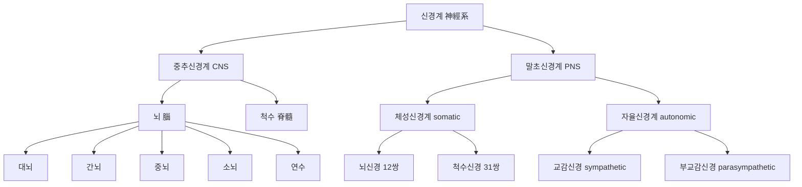
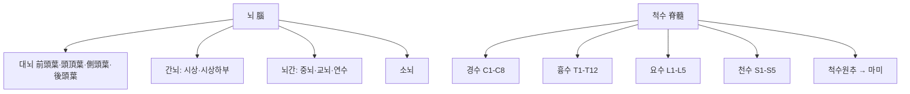
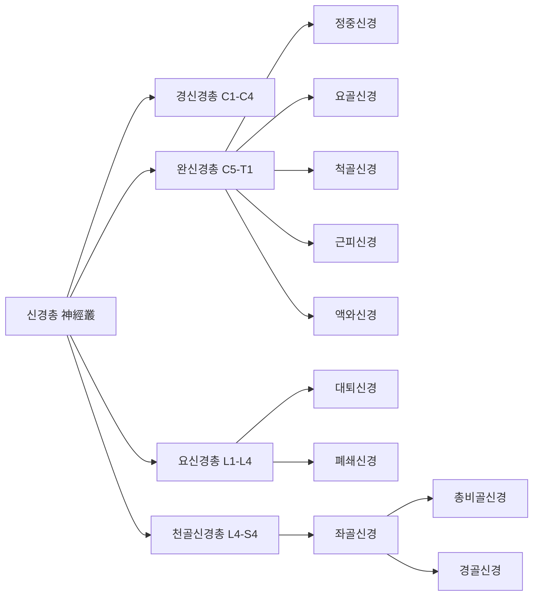

# 신경계(神經系, Nervous System)

신경계(神經系, nervous system)는 중추신경계(central nervous system, CNS)와 말초신경계(peripheral nervous system, PNS)로 구성되어 신체 내외의 자극을 감지하고 통합하여 반응을 조절하는 인체 최상위 조절계다[교과서적 근거]. 이 위키에는 신경계라는 표제어를 다루는 관점이 서로 다른 문서가 함께 존재한다. 신경(神經, Nerve) 문서는 뇌신경 12쌍·척수신경 31쌍·신경총·자율신경간의 육안 해부학적 주행 경로와 침구 국소해부·안전성을 각론 수준에서 정밀하게 다루었고, 한방생리학의 뇌(腦)·수(髓) 문서는 "뇌위수해(腦爲髓海)" 이론을 중심으로 한의학 고유의 생리학적 관점을 다룬다. 이 문서는 그와 구별되는**계통 총론(系統總論)**— 신경계 전체를 중추·말초·체성·자율의 네 축으로 조망하고, 각 하위 영역의 임상적 위상과 침구 근거의 분포를 총괄하는 상위 개관 — 에 집중한다. 개별 뇌신경·척수신경·신경총의 상세 국소해부는 신경(神經, Nerve) 문서에서 이미 서술하였으므로, 이 문서는 그 내용을 반복하지 않고 텍스트로만 교차 참조하며 계통 전체의 구조·기능·임상 근거 분포를 정리하는 데 집중한다.

이 문서는 총 6편으로 구성된다. 제1편은 신경계 전체의 분류 체계(중추/말초, 체성/자율)를 개관한다. 제2편은 중추신경계(뇌·척수)의 육안 구조와 뇌졸중·척수손상·인지장애 영역의 침구 근거를 정리한다. 제3편은 말초신경계·자율신경계의 기능적 구성과 말초신경병증·자율신경 조절 영역의 근거를 종합한다. 제4편은 한의학적 상관(신주골생수통어뇌腎主骨生髓通於腦 등)을 다룬다. 제5편은 임상 적용과 안전성을, 제6편은 Q&A와 고전 인용 출처로 마무리한다. 인용된 인간 대상 연구는 med.symbolicinfo.com 데이터베이스에서 수집한 것이며, 동물실험 단독 연구는 인용에서 제외하였다. 순수 해부학적 구조 서술(표준 교과서 내용)은 `[교과서적 근거]`로 표기하고, 임상 근거는 개별 각주로 표기한다.

---

## 제1편 총론 — 신경계의 분류 체계

### 1. 중추신경계와 말초신경계

신경계는 두개골·척추관이라는 골성 구조물 안에 위치하여 보호받는 중추신경계(뇌·척수)와, 그 바깥으로 뻗어 나가는 말초신경계(뇌신경·척수신경·신경절·말초신경간)로 대별된다[교과서적 근거]. 중추신경계는 정보의 통합·저장·명령 생성을 담당하는 "사령탑"이며, 말초신경계는 그 명령을 신체 각 부위로 전달하고 말초의 감각 정보를 중추로 되돌리는 "전선망" 역할을 한다[교과서적 근거]. 침구 시술이 물리적으로 직접 접촉하는 대상은 대부분 말초신경계이지만, 그 자극이 최종적으로 작용하는 표적은 척수·뇌간·대뇌피질을 포함하는 중추신경계의 정보 처리 과정이라는 점에서, 두 구획을 하나의 연속된 계통으로 이해하는 것이 임상적으로 중요하다.

### 2. 체성신경계와 자율신경계 — 기능적 이분

기능적으로는 골격근의 수의적 운동과 피부·근육·관절의 의식적 감각을 담당하는 체성신경계(體性神經系)와, 내장·혈관·분비샘을 불수의적으로 조절하는 자율신경계(自律神經系)로 나뉜다[교과서적 근거]. 자율신경계는 다시 교감신경(交感神經)과 부교감신경(副交感神經)으로 나뉘어 서로 길항적으로 작용하며, 침구 자극의 전신적 조절 효과(진통·항염증·심혈관 조절 등) 대부분은 체성 구심로가 척수·뇌간 수준에서 자율신경 원심로와 수렴하는 체성-자율신경 반사(somato-autonomic reflex)를 매개로 설명된다[교과서적 근거]. 이 반사궁의 해부학적 세부 사항은 신경(神經, Nerve) 문서 제4편에서 이미 상술하였다.

### 3. 신경계 질환에 대한 침구 근거의 전체 지형

신경계 질환 전반에 대한 침 치료의 작용 기전을 다룬 체계적 고찰은, 침 치료가 p38 MAPK 신호 경로를 이중적으로 조절하여 염증을 완화하고 세포 재생을 촉진함으로써 다양한 신경계 질환의 증상을 개선할 수 있다고 보고하였다[^1]. 침과 전침이 가짜 침에 비해 중추신경계의 신경학적 구성 요소에 더 뚜렷한 변조 효과를 유발함을 확인한 신경영상·신경모니터링 문헌 고찰도 있다[^2]. 두피침(頭皮鍼) 요법은 서양의 대뇌피질 국재화 지식과 전통 자침법을 결합한 현대적 침법으로, 파킨슨병·무도병·뇌염 등 다양한 중추신경계 질환에 유효할 수 있다는 고전적 문헌 고찰이 있으며[^3], 신경계 질환 치료 시 두침 반응의 성별 차이(성차)를 고려해야 한다는 최신 종설도 있다[^4]. 수십이정혈(手十二井穴) 자극이 "정혈-뇌 연결(Well point-Brain Connection)" 기전을 통해 중추신경계 질환 환자의 의식 수준과 운동-인지 기능을 조절할 수 있다는 연구 틀도 제시되었다[^5]. 신경계 자가면역질환에 대해 침·한약·식이·운동을 결합한 중의학적 접근이 표준 치료와 병행할 때 신경학적 결손 회복에 보조적으로 유용하다는 문헌 고찰들도 있다[^6][^7].

> 이러한 전체 지형은 신경계가 침구 임상에서 다루는 범위가 매우 넓다는 것을 보여주지만, 동시에 근거 수준이 영역별로 크게 다르다는 것도 시사한다. 뇌졸중 재활·말초신경병증 영역은 메타분석 수준의 근거가 상당히 축적되어 있는 반면, 다른 다수 신경계 질환은 문헌 고찰·증례 보고 수준에 머물러 있다.

---

## 제2편 중추신경계(中樞神經系) 개관 — 뇌와 척수

### 4. 뇌와 척수의 육안 해부학적 구조 — 한방생리학 뇌·수 문서와의 관계

뇌(腦)는 대뇌·간뇌·중뇌·소뇌·연수로 구성되며, 척수(脊髓)는 연수에 이어져 척추관 내부를 하행하는 원통형 신경 조직으로, 둘 다 뇌척수막(경막·지주막·연막)과 뇌척수액에 의해 보호받는다[교과서적 근거]. 이 두 구조의 세부 육안 해부(대뇌 엽 구분·뇌실계·척수 분절 배열 등)와 "뇌위수해(腦爲髓海)" 이론에 입각한 정(精)·수(髓)·뇌(腦)의 생리학적 상관관계는 한방생리학의 뇌(腦) 문서와 수(髓) 문서에서 각각 상세히 다루었으므로, 이 문서는 그 내용을 반복하지 않고 중추신경계가 임상 침구 근거의 관점에서 어떤 위상을 갖는지에 집중한다.

뇌를 육안 해부학적으로 세분하면, 대뇌(大腦)는 전두엽(前頭葉)·두정엽(頭頂葉)·측두엽(側頭葉)·후두엽(後頭葉)의 4개 엽으로 나뉘며, 각각 수의운동·체성감각·청각 및 언어 이해·시각의 일차 피질 영역을 담당한다[교과서적 근거]. 대뇌 표면의 회백질(피질)과 그 안쪽 백질(신경섬유로), 대뇌 심부의 기저핵(基底核, basal ganglia, 선조체·담창구 등 추체외로 운동 조절 중추)은 파킨슨병·무도병과 같은 추체외로 질환의 해부학적 기초를 이룬다. 간뇌(間腦)는 감각 정보를 대뇌피질로 중계하는 시상(視床, thalamus)과 자율신경·내분비 조절의 최고 중추인 시상하부(視床下部, hypothalamus)로 구성되며, 중뇌(中腦)·교뇌(橋腦)·연수(延髓)로 이루어지는 뇌간(腦幹, brainstem)은 대부분의 뇌신경 핵과 호흡·순환을 관장하는 생명 중추를 담고 있어 뇌간 손상이 곧 생명과 직결되는 이유가 된다[교과서적 근거]. 소뇌(小腦)는 뇌간 뒤쪽에 위치하여 운동의 협조·평형·정교한 조절을 담당한다.

척수는 경수(頸髓, C1-C8)·흉수(胸髓, T1-T12)·요수(腰髓, L1-L5)·천수(薦髓, S1-S5)·미수(尾髓)의 다섯 분절로 구성되며, 성인에서는 척수 자체가 제1~2요추 높이에서 끝나는 척수원추(脊髓圓錐, conus medullaris)를 이루고 그 아래로는 신경근만 마미(馬尾, cauda equina) 형태로 척추관 내를 하행한다[교과서적 근거]. 이 사실은 요추 하부(L3-L4 이하)에서 시행하는 요추천자(腰椎穿刺)가 척수 손상 위험 없이 비교적 안전하게 이루어질 수 있는 근거이며, 역으로 상부 요추·흉추·경추 부위의 심자(深刺)는 척수 자체를 직접 손상시킬 수 있다는 안전성 원칙(제5편 참조)과 직결된다. 뇌와 척수를 둘러싼 뇌척수막은 바깥쪽부터 경막(硬膜, dura mater)·지주막(蛛網膜, arachnoid mater)·연막(軟膜, pia mater)의 3층으로 구성되며, 지주막과 연막 사이 지주막하강(蛛網膜下腔)을 뇌척수액이 순환하여 뇌·척수에 대한 물리적 완충과 노폐물 배출 기능을 겸한다[교과서적 근거].

### 5. 뇌졸중(中風) 재활 — 중추신경계 침구 근거의 최대 축적 영역

뇌졸중 재활은 중추신경계 관련 침구 임상 근거가 가장 광범위하게 축적된 영역이다. 코크란 체계적 고찰은 아급성·만성기 뇌졸중 환자의 재활에서 침 치료의 방법론적 질이 낮고 이질성이 커 임상적 근거가 아직 불충분하다고 지적하였으나[^8], 그 이후 축적된 다수의 메타분석은 보다 긍정적인 결과를 보고한다. 체침·전침·이침을 비교한 최신 메타분석은 세 기법 모두 대조군보다 운동 기능과 일상생활 동작 개선에 효과적이며, 그중 전침이 가장 높은 치료 효과를 보였다고 보고하였다[^9]. 급성·아급성 뇌졸중 환자에서 재활 치료에 침 치료를 병행하는 것이 운동 기능·일상생활 수행능력 개선에 더 효과적일 가능성이 높다는 체계적 고찰[^10], 뇌졸중 후 재활에서 침 치료가 대조군 대비 유의한 효과가 있을 가능성을 제시한 Stroke지 메타분석(OR 4 이상)[^11], GRADE 접근법으로 기존 체계적 고찰들의 근거 수준을 평가한 연구[^12]도 이러한 축적을 뒷받침한다.

세부 증상별로는 연하장애(dysphagia)에서 전침 치료를 삼킴 재활과 병행하는 것이 흡인성 폐렴 발생률 감소를 포함해 유의한 효과를 보인 메타분석(1,216명)[^13], 침 치료가 연하장애로 인한 흡인 증상과 관련 지표(PAS·VFSS)를 개선한 메타분석(1,284명)[^14]이 있다. 편측 무시(unilateral neglect)에 침 치료를 병행하는 것이 운동 기능·일상생활 수행능력을 개선한 메타분석(542명)[^15], 어깨-손 증후군(shoulder-hand syndrome)에 수동 침치료를 병행하는 것이 통증·상지 기능·일상생활 수행능력 개선에 효과적이었다는 메타분석(1,918명)[^16], 실어증(aphasia) 재활에서 설침·체침·두침 조합이 효과적일 수 있다는 네트워크 메타분석(5,097명)[^17]도 확인된다. 뇌졸중 후 경직(spasticity)에 대해 전침을 병행하는 것이 상하지 경직도 감소와 운동 기능 개선에 효과적이라는 메타분석(1,425명)[^18], 사지 경직 감소에 전침과 재활 훈련 병행이 효과적이라는 메타분석(2,488명)[^19]도 있다. 다만 침 치료와 고강도 경피적 전기신경자극이 가짜 자극 대비 유의미한 추가 효과를 주지 못했다는 Stroke지 임상시험(150명)도 있어[^20], 병기·중증도별로 근거가 균질하지 않음을 인식해야 한다.

### 6. 뇌영상 연구를 통한 중추신경계 작용 기전 규명

기능적 자기공명영상(fMRI)을 이용한 연구는 침 자극이 중추신경계에 미치는 영향을 직접 시각화한다. 침 자극의 지속 시간이 길어질수록 뇌의 더 넓고 유의미한 영역이 활성화됨을 확인한 실험연구[^21], fMRI·PET·EEG·MEG 등 현대 뇌영상 기술로 침 치료가 뇌 활동과 중추신경계 네트워크에 미치는 영향을 종합한 문헌 고찰[^22]이 대표적이다. 외관혈(外關, TE5) 침 치료가 좌측 기저핵 허혈성 뇌졸중 환자의 병변측 감각운동 네트워크를 조절하고 건측 네트워크를 자극하여 양측 반구 간 협력을 증진시킬 수 있다는 임상시험(24명)[^23]은 침구 자극이 국소 병변 주변의 신경가소성 재편에 관여할 수 있음을 시사한다. 만성 요통·경부통·슬관절골관절염 등 통증 질환에서도 침 치료 효과가 인슐라·변연계 등 통증 처리 네트워크 조절과 관련된다는 신경영상 메타분석·임상시험들이 있다[^24][^25][^26].

### 7. 인지장애·치매 — 혈관성 인지장애를 중심으로

인지장애 영역에서는 특히 혈관성 인지장애 비치매(VCIND, vascular cognitive impairment no dementia) 단계에 대한 근거가 두드러진다. 전침 치료가 VCIND 환자의 인지 기능을 개선하는 데 안전하고 효과적이라는 무작위 대조 시험(120명)[^27], 침 치료가 기존 인지 개선제(시티콜린)보다 우수하거나 유사한 효과를 보였다는 임상시험(216명)[^28], 침 치료가 약물 치료보다 더 효과적인 임상적 개선을 보일 수 있다는 갱신 메타분석(1,148명)[^29]이 이를 뒷받침한다. 경도인지장애 및 치매 전반에 대한 체계적 고찰들의 개관 연구는 침 치료가 양약이나 일반 치료보다 효과적일 수 있으며 특히 MMSE 점수 개선에 유의미한 영향을 준다고 정리하였고[^30], 알츠하이머병 환자의 인지 기능(MMSE·ADAS-Cog)과 한의학적 증후군 점수를 개선하고 이상반응 발생률을 낮춘다는 메타분석(1,172명)[^31]도 있다. 침 치료를 도네페질과 병용했을 때 도네페질 단독보다 인지 기능(ADAS-cog)이 더 유의하게 개선되었다는 신경영상 파일럿 연구(44명)[^32]는 인지장애 영역에서 침구가 표준 약물 치료의 보조 요법으로 병용될 수 있음을 보여준다. 이침(耳鍼)을 병행하는 것이 인지·사회적 기능 개선에 더 효과적이라는 임상시험(100명)[^33], 이침이 한약과 병용 시 인지 기능·일상생활 수행능력 개선에 긍정적 영향을 줄 수 있다는 체계적 고찰(677명)[^34]도 확인된다.

### 8. 척수(脊髓) 손상 — 운동·감각·배뇨 기능 재활

척수손상 재활 영역은 신경인성 방광 관리를 중심으로 방대한 근거가 축적되어 있다. 침 치료를 표준 치료와 병행하는 것이 척수손상 환자의 운동 기능 회복(ASIA·FIM 점수)과 방광 기능 장애 개선에 효과적일 수 있다는 메타분석[^35], 전침 치료가 운동·감각 기능과 일상생활 수행능력 향상에 유의미한 효과가 있으며 중등도 수준의 근거를 가진다는 메타분석(712명)[^36], 운동 요법과 전침을 병행하는 것이 운동 기능·일상생활 수행능력 향상에 효과적이라는 네트워크 메타분석(1,644명)[^37]이 대표적이다. 신경인성 방광의 요정체·배뇨근 과활동에 대해서는 전침과 뜸을 병행하는 것이 임상 유효율·잔뇨량 감소에 가장 우수한 효과를 보인 베이지안 네트워크 메타분석(1,652명)[^38], 재활 훈련과 침구를 병행하는 것의 유효성·안전성을 평가한 체계적 고찰[^39], 요실금 관리에서 전침이 방광 용적·순응도 개선에 유의미한 효과를 보인 메타분석(1,394명)[^40]이 있다. 척수손상 후 신경병성 통증에 전침 치료가 통증 강도·범위 감소에 유효할 수 있다는 메타분석(286명)[^41], 불완전 척수손상에 재활 훈련과 침 치료를 병행하는 것이 운동 능력·일상생활 수행능력 개선에 효과적이라는 임상시험(72명)[^42]도 있다. 침 치료를 병행한 척수손상 환자의 신경학적 회복에 대한 종합 메타분석은 긍정적 가능성을 시사하였다[^43]. 척수손상 후 우울·불안 관리에 침 치료를 병행하는 것의 효과를 평가하는 메타분석 프로토콜도 진행 중이다[^44].

> 척수손상 재활 근거의 대다수는 중국 문헌의 소규모 무작위 대조 시험으로 구성되어 있어, 방법론적 질과 서구 임상 환경으로의 일반화 가능성에 제한이 있다. 다만 방광·배변 기능 재활이라는 구체적이고 측정 가능한 결과 지표를 사용한 연구가 많아, 임상적 참고 가치는 상대적으로 높은 편이다.

---

## 제3편 말초신경계(末梢神經系)와 자율신경계(自律神經系) 개관

### 9. 말초신경계 개관과 신경(神經) 문서와의 관계

말초신경계는 뇌신경 12쌍, 척수신경 31쌍, 이들이 재편성되어 형성하는 경신경총·완신경총·요신경총·천골신경총, 그리고 교감신경간·부교감신경으로 구성된다[교과서적 근거]. 각 신경의 기시·주행·분지와 경혈-신경 국소해부 상관, 안면신경마비·삼차신경통·수근관증후군·좌골신경통 등 개별 신경 병변에 대한 침구 임상 근거는 신경(神經, Nerve) 문서에서 이미 상세히 각론화하였으므로, 이 문서는 그 내용을 반복하지 않고 말초신경계 전반에 걸친 근거의 분포와 자율신경계의 기능적 조절이라는 계통적 관점에 집중한다.

말초신경계를 육안해부학적으로 계통화하면, 뇌신경 12쌍은 후각신경(CN I)부터 설하신경(CN XII)까지 뇌간·대뇌에서 직접 기시하여 두개골의 각 공(孔)을 통해 두경부로 나가며, 척수신경 31쌍은 경신경 8쌍(C1-C8)·흉신경 12쌍(T1-T12)·요신경 5쌍(L1-L5)·천골신경 5쌍(S1-S5)·미골신경 1쌍(Co1)으로 구성되어 각 척추간공(intervertebral foramen)을 통해 나온다[교과서적 근거]. 척수신경은 척추간공을 나온 직후 척추 뒤쪽 근육·피부를 지배하는 후지(後枝)와 몸통 앞쪽·사지를 지배하는 전지(前枝)로 갈라지며, 흉부 분절을 제외한 전지들은 경신경총(C1-C4)·완신경총(C5-T1)·요신경총(L1-L4)·천골신경총(L4-S4)의 네 신경총(神經叢)으로 재편성되어 사지 말초신경으로 분지된다[교과서적 근거]. 각 척수분절은 특정 피부분절(dermatome)·근분절(myotome)·내장분절(viscerotome)을 지배하므로(분절 지배 원칙), 감각·운동 결손의 분포 양상만으로 손상 분절의 위치를 임상적으로 추정할 수 있다는 점이 신경학적 진찰의 핵심 원리다. 개별 뇌신경·신경총·말초신경(정중신경·요골신경·척골신경·좌골신경 등)의 상세한 주행 경로·분지 순서·지배 영역과 촉지 가능한 체표 지표는 신경(神經, Nerve) 문서 제2·3편에서 이미 각론화하였다.

### 10. 말초신경병증(末梢神經病症) — 당뇨병성·화학요법 유발 신경병증을 중심으로

말초신경병증은 병인이 매우 다양하지만, 침구 임상 근거는 당뇨병성 말초신경병증(DPN)과 화학요법 유발 말초신경병증(CIPN)의 두 영역에 특히 집중되어 있다. DPN에 대해서는 침 치료 병행이 운동신경 기능 개선에는 전침이, 감각신경 기능 개선에는 혈위주입이 가장 우수한 효과를 보였다는 베이지안 네트워크 메타분석(5,942명)[^45], 침 치료가 신경전도속도와 임상 증상 개선에 유의미한 효과를 보인 체계적 고찰들의 평가(23,240명 규모의 근거 지도)[^46], 수기침 단독 또는 비타민 B 병용이 비타민 B 단독보다 효과적이라는 메타분석(1,200명)[^47]이 대표적이다. 고령 DPN 환자에서도 침 치료가 증상 완화·혈당 감소·신경전도속도 개선에 효과적일 가능성이 높다는 메타분석이 있다[^48]. 통증성 DPN에서 온침이 프레가발린보다 통증 완화·신경전도속도 향상에 우수했다는 무작위 대조 시험(60명)[^49], 침 치료가 신경병성 증상 개선 및 신경전도 파라미터 회복에 유의미한 효과를 보인 메타분석(680명, 벨마비·수근관증후군 포함)[^50]도 있다.

CIPN에 대해서는 침 치료가 표준 치료 대비 유효율을 높이고 통증 완화·신경전도속도 회복에 효과적이며 안전하다는 메타분석(1,174명)[^51], 침 치료를 병행한 대장암 환자의 CIPN 삶의 질·불안·불면이 개선되었다는 무작위 임상시험(75명)[^52], 유방암 환자의 CIPN에 침 치료가 통증 강도를 감소시키고 안전하다는 메타분석(653명)[^53]이 있다. 전침이 옥살리플라틴 유발 CIPN의 중증도를 완화하고 신체적·사회적 기능을 개선한다는 무작위 샴대조 시험(60명)[^54], 침 치료가 신경전도 속도·진폭을 개선하여 구조적 신경 재생을 촉진한다는 교차설계 임상시험(60명, ACUCIN)[^55]도 대표적이다. 다만 성공적인 RCT 대부분이 병변이 있는 말초신경과 해부학적으로 밀접한 위치의 혈위를 선택하여 자침하였다는 후속 체계적 고찰의 관찰은[^56], 변증뿐 아니라 병변 신경의 정확한 국소해부를 함께 고려하는 취혈 전략이 근거에 부합함을 재확인한다. 데이터마이닝 분석은 CIPN 치료에 족삼리(足三里, ST36)·곡지(曲池, LI11)·합곡(合谷, LI4)·태충(太衝, LR3)·삼음교(三陰交, SP6)가 핵심 혈위로 활용됨을 확인하였다[^57].

### 11. 자율신경계 — 심박변이도(HRV)를 통한 기능 평가

자율신경 기능은 심박변이도(heart rate variability, HRV)로 비침습적으로 평가할 수 있으며, 이는 침구 연구에서 가장 널리 쓰이는 객관적 지표다[교과서적 근거]. HRV를 이용한 체계적 고찰은 침 치료가 자율신경계에 미치는 영향을 분석하였으나 가짜 침 대비 일관된 유의한 효과를 입증하지 못했다고 결론지었다[^58]. 그러나 개별 임상시험 수준에서는 구체적인 효과가 다수 보고된다. 수삼리(手三里, LI10) 침 자극이 심박수를 감소시키고 부교감신경 활동(HFnu)을 촉진하며 교감-부교감 균형(LF/HF)을 조절한다는 실험연구(25명)[^59], 침 자극 시 발생하는 득기(得氣) 감각이나 통증 유무와 무관하게 심박수가 감소하고 부교감신경 우위로 전환된다는 실험연구(40명)[^60], 내관(內關, PC6)·간사(間使, PC5) 자침이 심장 미주신경을 흥분시켜 심박수를 감소시키며 유침 시 그 지속 시간이 더 길다는 임상시험(60명)[^61]이 대표적이다. 전침 주파수에 따라 자율신경 반응이 상반되게 나타나 저주파(2 Hz)는 부교감신경을, 중주파(15 Hz)는 교감신경을 활성화한다는 임상시험(20명)[^62], 만성피로증후군 환자에서 침과 뜸 모두 자율신경계 조절을 통해 피로를 개선하나 뜸이 장기적으로 더 효과적이라는 임상시험(45명)[^63], 족삼리 침 치료로 스트레스 대학생의 자율신경 균형이 회복되었다는 파일럿 임상시험(28명)[^64]도 있다. 침 치료의 자율신경 조절 효과를 종합한 최신 메타분석(744명)은 SDNN을 유의하게 개선하며 안전성이 우수하다고 결론지었다[^65].

이명(耳鳴) 환자는 건강 대조군보다 미주신경 활성 저하·교감신경 과활성 상태를 보이며 이환 기간이 길수록 불균형이 심해진다는 관찰연구(80명)[^66], 심부 자침이 천층 자침보다 이명장애지수(THI)를 더 개선하고 자율신경 균형(LF/HF)을 회복시킨다는 임상시험(30명)[^67]은 자율신경 기능 이상 자체가 특정 이비인후과·순환기 증상의 병태생리와 결부될 수 있음을 시사한다. 뇌졸중 회복기 환자의 자율신경 기능 장애 개선에 침 치료의 즉각 효과를 HRV로 평가한 임상시험(60명)[^68]도 중추신경계-자율신경계 상호작용의 임상적 접점을 보여준다.

### 12. 경피 이개 미주신경 자극술(taVNS) — 자율신경계 조절의 특수한 통로

이개(耳介)의 이개갑개(concha)는 미주신경의 이개지(auricular branch of vagus nerve, ABVN)가 유일하게 체표에 분포하는 부위로, 이 해부학적 근거를 바탕으로 경피 이개 미주신경 자극술(transcutaneous auricular vagus nerve stimulation, taVNS)이 개발되었다[^69]. ABVN의 해부학적 분포를 분석해 taVNS의 이론적 근거를 제시한 문헌 고찰도 있다[^70]. taVNS는 불면증 환자의 수면 질 개선·피로 감소·우울 및 불안 완화에 긍정적 영향을 줄 수 있다는 무작위 임상시험(72명)[^71]을 비롯해, 만성 불면장애 환자에서 20주까지 효과가 지속되었다는 JAMA Network Open 게재 임상시험(72명)[^72], 약제 내성 뇌전증 환자의 발작 빈도를 감소시키고 일부에서 발작 소실을 유도했다는 임상시험(50명)[^73], 아급성 허혈성 뇌졸중 환자의 상지 운동기능 회복에 안전하게 기여했다는 무작위 파일럿 연구(21명)[^74]로 임상 스펙트럼이 매우 넓다. 주요우울장애에서 taVNS가 표준 항우울제(시탈로프람)와 유사한 수준의 반응률을 보였다는 무작위 임상시험(107명)[^75], 우울증 환자의 우울 점수를 유의하게 감소시키고 항우울제와 유사한 반응률을 보였다는 메타분석(838명)[^76]도 확인된다. 경도인지장애(MCI) 환자의 전반적 인지 기능(MoCA-B)과 언어 학습·명명 능력을 개선했다는 이중맹검 무작위 임상시험(52명)[^77]은 taVNS가 인지 영역까지 임상 적용 범위를 확장하고 있음을 보여준다.

> taVNS는 명확한 해부학적 표적(이개 미주신경 분포)을 가진 자율신경 자극법으로서 상대적으로 근거가 체계적으로 축적되어 있으나, 그 밖의 체성-자율신경 반사 전반에 대한 근거는 여전히 관찰·실험 수준에 머물러 있다.

---

## 제4편 신경계와 한의학적 상관

### 13. 신주골생수통어뇌(腎主骨生髓通於腦) — 신(腎)-수(髓)-뇌(腦) 축

한의학은 신(腎)이 정(精)을 저장하고, 정이 수(髓)를 생성하며, 수가 위로 뇌(腦)에 모여 "뇌위수해(腦爲髓海)"를 이룬다는 신-수-뇌 축을 핵심 이론으로 삼는다[교과서적 근거]. 『황제내경소문(黃帝內經素問)』·「선명오기편(宣明五氣篇)」의 "신주골(腎主骨)"과 『영추(靈樞)』·「해론편(海論篇)」의 "뇌위수지해(腦爲髓之海)"는 신(腎)-골(骨)-수(髓)-뇌(腦)가 하나의 생리적 연속체를 이룬다는 인식을 보여준다[교과서적 근거]. 이 이론적 관점은 현대 해부학의 중추신경계(뇌·척수) 구조와 정확히 일대일 대응하지는 않으나, 노년기 인지 기능 저하·골밀도 저하·신경계 퇴행이 임상적으로 함께 진행하는 양상과 개념적으로 조응하는 지점으로 자주 논의된다. 이 이론의 상세한 생리학적 논의는 한방생리학 신(腎) 문서와 뇌(腦)·수(髓) 문서에서 각각 다루었다.

### 14. 심주신명(心主神明)과 뇌-심 축

한의학은 전통적으로 심(心)이 신명(神明, 정신·의식 활동)을 주관한다고 보아 왔으며, 이는 현대 해부학이 의식·인지 기능을 대뇌피질에 귀속시키는 것과 개념적으로 구분된다[교과서적 근거]. 다만 임상적으로는 심혈관계 질환(뇌졸중·부정맥 등)이 인지 기능·정서 상태와 밀접하게 연관된다는 관찰이 축적되어 있어, 심-뇌 축(brain-heart axis)이라는 현대적 개념과 전통적 심주신명 이론이 상호 참조될 수 있다. 이 관계의 순환계 측면은 순환계(循環系) 문서에서 상술한다.

### 15. 간주근(肝主筋)·간장혈(肝藏血)과 체성신경계

간(肝)이 근(筋)을 주관하고 혈(血)을 저장한다는 이론은 골격근의 수축·이완과 그 신경 지배(체성신경계 원심로)가 정상적으로 작동하려면 근육에 대한 혈액 공급이 충분해야 한다는 관찰과 연결된다[교과서적 근거]. 간혈허(肝血虛)로 인한 근육 경련·저림 등의 증상은 말초신경계·근골격계가 상호작용하는 대표적 임상 양상으로 논의되며, 이 병리의 상세한 논의는 한방병리학 간혈허 문서에서 다루었다.

### 16. 정지(情志)와 자율신경계 — 심신 상관의 해부학적 기초

한의학의 정지(情志) 이론은 칠정(七情, 희·노·우·사·비·경·공)의 과도함이 장부 기능 실조를 유발한다고 보는데, 이는 현대적으로 시상하부-뇌하수체-부신(HPA) 축과 자율신경계(특히 교감신경)의 활성화로 설명되는 스트레스 반응과 상당 부분 조응한다[교과서적 근거]. 간실증(肝實證, 간기울결·간양상항·간화상염)이 교감신경 항진(혈장 노르에피네프린·에피네프린 상승)과 연관됨을 확인한 관찰연구는 정지-자율신경 축의 직접적 증거로 자주 인용되며[교과서적 근거], 이 상관관계의 상세한 논의는 한방병리학 간기울결 문서에서 다루었다.

---

## 제5편 임상 적용과 안전성

### 17. 침구 관련 중추신경계 손상 — 척수·뇌 직접 손상

침구 시술이 중추신경계를 직접 손상시킨 증례는 드물지만 반복적으로 보고된다. 경추 부위 온침 시술 중 침의 직접 삽입 또는 열 손상으로 척수 손상이 발생해 해리성 감각 소실이 나타난 증례[^78], 침이 부러져 척수관 내로 진입하여 신경학적 증상이 나타난 증례[^79], 소침도(小針刀) 시술 중 침이 파손되어 척수에 삽입되어 지연성 신경학적 증상이 발생한 증례[^80]가 대표적이다. 경추 주변 부위 침 시술 중 심부 자입이나 침의 이동으로 경추 척수 손상(c-SCI)이 발생할 수 있다는 최신 증례 보고(2명)[^81]와, 피하에 침을 장기간 유치하는 오키바리(okibari) 시술 후 외부 충격으로 척수 손상이 발생한 고전적 증례[^82]도 있다. 535편의 체계적 고찰을 분석한 최신 근거 지도(evidence mapping)는 침 치료와 관련된 부작용(실신·조직 손상·전신 반응 등) 대부분이 경증이라고 보고하였으나[^83], 중추신경계 직접 손상은 극히 드물지만 발생 시 중대하다는 점에서 별도로 인식해야 한다.

### 18. 안전성 표

| 위험 요소 | 관련 구조·부위 | 내용 | 근거 |
|---|---|---|---|
| 척수 직접 손상 | 경추·흉추 심자, 온침 열손상 | 해리성 감각 소실, 침 파손 후 척수관 내 이동 | [^78][^79][^80][^81][^82] |
| 말초신경 직접 손상 | 안면신경·삼차신경·좌골신경·정중신경 등 | 신경(神經, Nerve) 문서에서 각론화한 오자(誤刺) 위험 | (신경 문서 참조) |
| 미주신경 반사성 서맥 | 경부·이개 자극 | 서맥·실신, 극히 드물게 치명적 부정맥 | (신경 문서 참조) |
| taVNS 관련 이상반응 | 이개 갑개 자극 | 대체로 경증(국소 자극감·이명 악화 등), 중대 이상반응 드묾 | [^69][^71][^72] |
| 전신 이상반응 전반 | 전신 | 535편 체계적 고찰 분석에서 대부분 경증으로 확인 | [^83] |
| 근거 수준의 한계 | 전반 | 다수 신경계 질환 영역은 소규모 중국 문헌 RCT 위주로 방법론적 질이 낮음 | [^8][^58] |

**이 표는 임상 틀이지 동일 근거수준의 권고가 아니다.**신경계 관련 침구 안전성 근거는 극히 드문 중대 합병증(척수 손상)과 상대적으로 흔한 경증 이상반응이 혼재되어 있으며, 개별 환자의 해부학적 변이·기저 신경계 질환 유무에 따라 위험도가 달라질 수 있으므로 시술 전 개별 평가가 필요하다. 변증 없는 관행적 취혈·자침은 근거에 부합하지 않으며, 특히 경추·척추 인접 혈위와 자율신경 자극 부위는 변증과 해부학적 위치를 함께 고려한 신중한 시술이 요구된다.

### 19. 신경계 질환군별 침구 적용의 근거 수준 요약

| 영역 | 대표 근거 수준 | 대표 지표 |
|---|---|---|
| 뇌졸중 재활(운동·연하·경직) | 메타분석 다수 | FMA, Barthel Index, NIHSS, PAS/VFSS |
| 혈관성 인지장애(VCIND) | 임상시험·메타분석 | MoCA, ADAS-cog, MMSE |
| 척수손상(신경인성 방광 포함) | 메타분석·네트워크 메타분석 | ASIA, FIM, 잔뇨량, 요역동학 지표 |
| 당뇨병성·화학요법 유발 말초신경병증 | 메타분석 다수 | 신경전도속도(NCV), TCSS, 통증 VAS |
| 자율신경 조절(HRV, taVNS) | 체계적 고찰(결과 혼재) | HRV(LF/HF, SDNN), PSQI |

**이 표는 임상 틀이지 동일 근거수준의 권고가 아니다.**근거 수준은 영역별로 상당히 이질적이며, 메타분석이 존재한다고 해서 그 결론이 항상 일관되게 긍정적인 것은 아니다(예: HRV 체계적 고찰[^58]은 일관된 유의성을 확인하지 못했다).

---

## 제6편 Q&A, 환자 설명, 고전 인용 출처

### 20. 신경계 질환군별 추적 지표표

임상에서 신경계 관련 침구 치료 효과를 추적할 때 참고할 수 있는 대표 지표는 다음과 같다.

| 영역 | 추적 지표 |
|---|---|
| 뇌졸중 재활(운동) | Fugl-Meyer Assessment(FMA), Barthel Index, NIHSS |
| 뇌졸중 연하장애 | PAS(Penetration-Aspiration Scale), VFSS |
| 인지장애·치매 | MMSE, MoCA, ADAS-cog |
| 척수손상 방광 기능 | 잔뇨량, 요역동학 지표(최대 요류율·방광 순응도) |
| 말초신경병증 | 신경전도속도(NCV), TCSS(Toronto Clinical Scoring System), 통증 VAS |
| 자율신경 기능 | 심박변이도(HRV: LF/HF, SDNN), PSQI(수면 질) |

**이 표는 임상 틀이지 동일 근거수준의 권고가 아니다.**각 지표는 연구마다 측정 시점·방법이 다르므로 개별 환자 추적 시 동일한 도구를 일관되게 사용하는 것이 중요하다.

### 21. 환자 설명용 요약

> 신경계는 뇌·척수(중추신경)와 온몸에 뻗어 있는 신경(말초신경)으로 이루어져, 몸의 감각을 느끼고 움직임을 명령하며 심장·소화기 등 내 뜻대로 되지 않는 장기까지 자동으로 조절하는 "몸 전체의 통신망"입니다. 뇌졸중·척수손상·당뇨병성 신경병증처럼 신경계가 손상되었을 때, 침·전침 치료는 신경 자체를 대신하는 것이 아니라, 손상된 신경 주변의 회복 과정과 자율신경 균형을 도와 재활 치료의 효과를 높이는 보조적 역할을 합니다. 신경계 질환은 회복에 시간이 걸리는 경우가 많으므로, 표준 재활·약물 치료를 유지하면서 침구 치료를 꾸준히 병행하는 것이 중요합니다.

**Q1. 신경계 질환에 대한 침구 치료는 신경계 자체를 재생시키는가, 아니면 증상만 완화하는가?**

두 측면이 모두 보고된다. 척수손상 영역에서는 전침이 신경영양인자(BDNF) 증가와 염증 경로 억제를 통해 운동 기능·경직을 개선한다는 기전 연구가 있고[^43], 화학요법 유발 말초신경병증에서도 침 치료가 신경전도속도·진폭 개선을 통해 구조적 신경 재생을 촉진할 가능성이 제시된다[^55]. 다만 대부분의 임상시험은 증상·기능 지표(통증·경직·일상생활 수행능력) 개선을 일차 결과로 삼고 있어, "재생"과 "증상 완화"를 명확히 구분하기 어려운 경우가 많다.

**Q2. 뇌졸중 급성기에도 침구 치료를 바로 시작해도 되는가?**

급성·아급성기 침 치료 병행이 재활 단독보다 효과적일 수 있다는 체계적 고찰이 있으나[^10], 전침 치료를 손상 후 2주 이내 조기에 적용하는 것이 그 이후보다 신경학적 회복·기능 개선·합병증 감소에 더 유의했다는 척수손상 관찰연구도 있어[^84], 시기를 지나치게 늦추지 않는 것이 일반적으로 권고된다. 다만 급성기 활력징후가 불안정한 환자, 항응고제 사용 환자 등은 개별 평가가 선행되어야 한다.

**Q3. taVNS와 일반 이침(耳鍼)은 같은 것인가?**

taVNS는 이개갑개 부위에 전기 자극을 가하는 특정 프로토콜로, 이개 미주신경 분포라는 명확한 해부학적 근거에 기반한다는 점에서 일반적인 이침과 이론적 배경이 다르다[^69][^70]. 다만 이침 시술 시 이개갑개 부위를 자극하면 자연히 미주신경 이개지를 함께 자극하게 되므로, 개념적으로 서로 겹치는 부분이 있다.

**Q4. 자율신경 균형을 "심박변이도(HRV)"로만 판단해도 되는가?**

HRV는 비침습적이고 접근성이 높은 지표이지만, 체계적 고찰은 침 치료 전후 HRV 변화가 가짜 침 대비 일관되게 유의하지 않다고 보고하였다[^58]. 따라서 HRV 단일 지표만으로 치료 효과를 판정하기보다, 임상 증상·기능 지표와 함께 종합적으로 해석해야 한다.

**Q5. 말초신경병증에 대한 침구 취혈은 변증과 무관하게 손상 신경 부위에만 집중하면 되는가?**

성공적인 RCT들이 병변 신경과 해부학적으로 밀접한 혈위를 선택했다는 관찰은[^56] 국소 취혈의 중요성을 보여주지만, 이는 변증을 배제해도 된다는 의미가 아니다. 당뇨병성 신경병증에서 양허(陽虛)·한응(寒凝) 변증에 온침을 적용한 연구가 별도로 유효성을 보인 것처럼, 국소 해부학적 취혈과 전신 변증 치료는 상호 보완적으로 적용되어야 한다.

**Q6. 척수손상 환자의 신경인성 방광에 침구 치료가 정말 효과가 있는가?**

베이지안 네트워크 메타분석 등 다수의 메타분석이 전침·뜸 병행 치료의 유효성을 일관되게 보고하고 있어[^38][^40], 이 영역은 신경계 질환 중 침구 근거가 비교적 잘 확립된 편에 속한다. 다만 개별 연구 대부분이 중국 단일기관 연구로 구성되어 있어 다기관·다인종 반복 검증이 더 필요하다.

**Q7. 경도인지장애·치매에 침 치료를 시작하면 양약(콜린에스테라제 억제제 등)을 중단해도 되는가?**

아니다. 침 치료를 도네페질과 병행했을 때 병용군이 도네페질 단독보다 더 우수한 인지 기능 개선을 보인 연구가 있듯이[^32], 한의학적 치료는 표준 약물 치료를**대체**하는 것이 아니라**병용**하는 보조 요법으로 위치해야 한다.

---

**고전 인용 출처**: 『黃帝內經素問』(宣明五氣篇, 五藏生成篇), 『靈樞』(海論篇, 決氣篇), 『難經』, 『東醫寶鑑』(內景篇).
**문헌 데이터 출처**: [한의학 논문 데이터베이스 (med.symbolicinfo.com)](https://med.symbolicinfo.com) — 2026-08-25 조회 기준

[^1]: Effect of Acupuncture on the p38 Signaling Pathway in Several Nervous System Diseases: A Systematic Review. Tzu-Hsuan Wei 외. _International Journal of Molecular Sciences_. 2020-06-30. [체계적 고찰] [DOI 10.3390/ijms21134693](https://doi.org/10.3390/ijms21134693) — 침 치료는 p38 MAPK 신호 경로를 이중 조절하여 신경계 질환의 염증을 조절하고 세포 재생을 촉진한다.
[^2]: Neuroimaging and Neuromonitoring Effects of Electro and Manual Acupuncture on the Central Nervous System: A Literature Review and Analysis. Scheffold BE 외. _Evidence-based complementary and alternative medicine : eCAM_. 2015. [체계적 고찰] [DOI 10.1155/2015/641742](https://doi.org/10.1155/2015/641742) [PMID 26339269](https://pubmed.ncbi.nlm.nih.gov/26339269/) — 수침과 전침이 가짜 침에 비해 중추신경계 신경학적 구성 요소에 더 큰 변조 효과를 유발한다.
[^3]: Scalp Needle Therapy — Acupuncture Treatment for Central Nervous System Disorders. Tak Ho Liu 외. _The American Journal of Chinese Medicine_. 1974-01. [문헌 고찰] [DOI 10.1142/s0192415x7400033x](https://doi.org/10.1142/s0192415x7400033x) — 두침 요법이 파킨슨병·무도병·뇌염 등 중추신경계 질환 개선에 유효할 수 있다.
[^4]: Comprehensive review on sexual dimorphism to improve scalp acupuncture in nervous system disease. Chaojie Wang 외. _CNS Neuroscience & Therapeutics_. 2023-09-04. [문헌 고찰] [DOI 10.1111/cns.14447](https://doi.org/10.1111/cns.14447) — 신경계 질환 치료 시 성차를 고려한 두침 치료의 필요성.
[^5]: Research framework for scientific innovation and translational application of original acupuncture theories: a review based on Hand Twelve Jing-Well Points stimulation therapy. Yu Luo 외. _Acupuncture and Herbal Medicine_. 2026-02-19. [문헌 고찰] [DOI 10.1097/hm9.0000000000000193](https://doi.org/10.1097/hm9.0000000000000193) — 수십이정혈 자극이 '정혈-뇌 연결' 기전을 통해 중추신경계 질환 환자의 의식·운동-인지 기능을 조절한다.
[^6]: Restorative capability of traditional Chinese medicine in autoimmune diseases of nervous system: a literature review. Yu.O. Novikov 외. _Problems of Balneology, Physiotherapy and Exercise Therapy_. 2024-04-22. [문헌 고찰] [DOI 10.17116/kurort202410102164](https://doi.org/10.17116/kurort202410102164) — 신경계 자가면역질환의 신경학적 결손 회복에 중의학적 접근이 보조적으로 유용하다.
[^7]: The Value of Traditional Medicine Should not be Underestimated—Traditional Chinese Medicine in Treatment of Autoimmune Diseases. Yurii O Novikov 외. _Chinese Medicine and Culture_. 2024-04-03. [문헌 고찰] [DOI 10.1097/mc9.0000000000000102](https://doi.org/10.1097/mc9.0000000000000102) — 신경계 자가면역질환의 치료·예방에 통합적 TCM 접근이 유용한 보조 요법이 될 수 있다.
[^8]: Acupuncture for stroke rehabilitation. Wu HM 외. _The Cochrane database of systematic reviews_. 2006-07-19. [체계적 고찰, 368명] [DOI 10.1002/14651858.CD004131.pub2](https://doi.org/10.1002/14651858.CD004131.pub2) [PMID 16856031](https://pubmed.ncbi.nlm.nih.gov/16856031/) — 아급성·만성기 뇌졸중 재활에서 침 치료의 방법론적 질이 낮고 이질성이 커 임상적 근거가 불충분하다.
[^9]: Comparative Efficacy of Body Acupuncture, Electroacupuncture, and Auricular Acupuncture in Stroke Rehabilitation. Xueqi Qian 외. _American Journal of Physical Medicine & Rehabilitation_. 2026-08-18. [메타분석] [DOI 10.1097/phm.0000000000003129](https://doi.org/10.1097/phm.0000000000003129) — 체침·전침·이침 모두 효과적이며 전침이 가장 높은 치료 효과를 보였다.
[^10]: Effectiveness of Acupuncture Combined with Rehabilitation for Treatment of Acute Or Subacute Stroke: A Systematic Review. Larissa Vados 외. _Acupuncture in Medicine_. 2015-04-01. [체계적 고찰] [DOI 10.1136/acupmed-2014-010705](https://doi.org/10.1136/acupmed-2014-010705) — 급성·아급성 뇌졸중에서 재활 단독보다 침 치료 병행이 운동 기능·일상생활 수행능력 개선에 더 효과적일 가능성.
[^11]: Acupuncture in Poststroke Rehabilitation. Ping Wu 외. _Stroke_. 2010-04. [메타분석] [DOI 10.1161/strokeaha.109.573576](https://doi.org/10.1161/strokeaha.109.573576) — 뇌졸중 후 재활에서 침 치료가 대조군보다 유의하게 효과적일 가능성(OR 4 이상).
[^12]: GRADE in Systematic Reviews of Acupuncture for Stroke Rehabilitation: Recommendations based on High-Quality Evidence. Xin Z 외. _Scientific reports_. 2015-11-12. [체계적 고찰] [DOI 10.1038/srep16582](https://doi.org/10.1038/srep16582) [PMID 26560971](https://pubmed.ncbi.nlm.nih.gov/26560971/) — 뇌졸중 재활 침구 근거의 GRADE 수준 평가.
[^13]: Clinical Effects and Safety of Electroacupuncture for the Treatment of Poststroke Dysphagia: A Comprehensive Systematic Review and Meta‐Analysis. Jinke Huang 외. _Evidence-Based Complementary and Alternative Medicine_. 2020-01. [메타분석, 1216명] [DOI 10.1155/2020/1560978](https://doi.org/10.1155/2020/1560978) — 전침 병행이 삼킴 기능 개선 및 흡인성 폐렴 발생률 감소에 유의하게 효과적이다.
[^14]: A systematic review and meta-analysis of acupuncture in aspiration caused by post-stroke dysphagia. Hongwei Li 외. _Frontiers in Neurology_. 2024-06-10. [메타분석, 1284명] [DOI 10.3389/fneur.2024.1305056](https://doi.org/10.3389/fneur.2024.1305056) — 침 치료가 PAS·VFSS 개선 및 설골 변위 증가에 효과적이고 안전하다.
[^15]: Acupuncture plus Rehabilitation for Unilateral Neglect after Stroke: A Systematic Review and Meta‐Analysis. Yonghui Hou 외. _Evidence-Based Complementary and Alternative Medicine_. 2020-01. [메타분석, 542명] [DOI 10.1155/2020/5301568](https://doi.org/10.1155/2020/5301568) — 침 치료 병행이 운동 기능·일상생활 수행능력 개선에 더 효과적이다.
[^16]: Traditional manual acupuncture combined with rehabilitation therapy for shoulder hand syndrome after stroke within the Chinese healthcare system: a systematic review and meta-analysis. Le Peng 외. _Clinical Rehabilitation_. 2017-09-13. [메타분석, 1918명] [DOI 10.1177/0269215517729528](https://doi.org/10.1177/0269215517729528) — 수동 침치료 병행이 통증·상지 운동 기능·일상생활 수행능력 개선에 효과적이다.
[^17]: Effects of Acupuncture-Related Therapies in the Rehabilitation of Patients with Post-Stroke Aphasia—A Network Meta-Analysis of Randomized Controlled Trials. Pengpeng Liang 외. _Brain Sciences_. 2022-09-23. [메타분석, 5097명] [DOI 10.3390/brainsci12101282](https://doi.org/10.3390/brainsci12101282) — 설침, 체침+설침, 체침+두침 조합이 다른 단독 치료보다 효과적일 수 있다.
[^18]: Electroacupuncture for Poststroke Spasticity: A Systematic Review and Meta-Analysis. Cai Y 외. _Archives of physical medicine and rehabilitation_. 2017-12. [메타분석, 1425명] [DOI 10.1016/j.apmr.2017.03.023](https://doi.org/10.1016/j.apmr.2017.03.023) [PMID 28455191](https://pubmed.ncbi.nlm.nih.gov/28455191/) — 전침 병행이 상하지 경직도 감소와 운동 기능 개선에 효과적이다.
[^19]: Electroacupuncture with rehabilitation training for limb spasticity reduction in post-stroke patients: A systematic review and meta-analysis. Zhang J 외. _Topics in stroke rehabilitation_. 2021-07. [메타분석, 2488명] [DOI 10.1080/10749357.2020.1812938](https://doi.org/10.1080/10749357.2020.1812938) [PMID 32845210](https://pubmed.ncbi.nlm.nih.gov/32845210/) — 전침·재활 병행이 사지 경직 감소에 더 효과적이다.
[^20]: Acupuncture and Transcutaneous Nerve Stimulation in Stroke Rehabilitation. Barbro B. Johansson 외. _Stroke_. 2001-03. [임상시험, 150명] [DOI 10.1161/01.str.32.3.707](https://doi.org/10.1161/01.str.32.3.707) — 침·전기신경자극이 가짜 자극 대비 유의미한 추가 효과를 주지 못했다.
[^21]: Changes in FMRI in the human brain related to different durations of manual acupuncture needling. Li K 외. _Journal of alternative and complementary medicine_. 2006-09. [실험연구, 18명] [DOI 10.1089/acm.2006.12.615](https://doi.org/10.1089/acm.2006.12.615) [PMID 16970531](https://pubmed.ncbi.nlm.nih.gov/16970531/) — 침 자극 지속 시간이 길수록 더 넓은 뇌 영역이 활성화된다.
[^22]: Neuroimaging acupuncture effects in the human brain. Dhond RP 외. _Journal of alternative and complementary medicine_. 2026-08-14. [문헌 고찰] [DOI 10.1089/acm.2007.7040](https://doi.org/10.1089/acm.2007.7040) [PMID 17718643](https://pubmed.ncbi.nlm.nih.gov/17718643/) — fMRI·PET·EEG·MEG로 침 치료가 뇌 활동·CNS 네트워크에 미치는 영향을 분석하였다.
[^23]: Modulatory effect of acupuncture at Waiguan (TE5) on the functional connectivity of the central nervous system of patients with ischemic stroke in the left basal ganglia. Chen J 외. _PloS one_. 2014. [임상시험, 24명] [DOI 10.1371/journal.pone.0096777](https://doi.org/10.1371/journal.pone.0096777) [PMID 24927275](https://pubmed.ncbi.nlm.nih.gov/24927275/) — 외관혈 침 치료가 병변측 감각운동 네트워크 조절과 양측 반구 협력 증진에 관여한다.
[^24]: Neuroimaging evidence for central mechanisms of acupuncture in non-specific low back pain: a systematic review and meta-analysis. Huang FF 외. _Frontiers in medicine_. 2025. [메타분석, 358명] [DOI 10.3389/fmed.2025.1657241](https://doi.org/10.3389/fmed.2025.1657241) [PMID 41179904](https://pubmed.ncbi.nlm.nih.gov/41179904/) — 침 치료 효과가 인슐라·변연계 조절과 관련된다.
[^25]: Modulatory effects of acupuncture on raphe nucleus-related brain circuits in patients with chronic neck pain: A randomized neuroimaging trial. Wang X 외. _CNS neuroscience & therapeutics_. 2024-03. [임상시험, 99명] [DOI 10.1111/cns.14335](https://doi.org/10.1111/cns.14335) [PMID 37408438](https://pubmed.ncbi.nlm.nih.gov/37408438/) — 진침이 만성 경부통의 통증·기능장애·삶의 질을 유의하게 개선한다.
[^26]: The Efficacy and Brain Network Mechanism of Acupuncture for Knee Osteoarthritis: A Study Protocol for Randomized Controlled Neuroimaging Trial. Sun YY 외. _Journal of pain research_. 2025. [임상시험, 60명] [DOI 10.2147/JPR.S500024](https://doi.org/10.2147/JPR.S500024) [PMID 39872091](https://pubmed.ncbi.nlm.nih.gov/39872091/) — 슬관절골관절염에서 침 치료의 뇌 기능 네트워크 연결성 평가 프로토콜.
[^27]: Effects of Acupuncture on Vascular Cognitive Impairment with No Dementia: A Randomized Controlled Trial. Huang L 외. _Journal of Alzheimer's disease_. 2021. [임상시험, 120명] [DOI 10.3233/JAD-201353](https://doi.org/10.3233/JAD-201353) [PMID 33935074](https://pubmed.ncbi.nlm.nih.gov/33935074/) — 전침 치료가 VCIND 환자의 단기 인지 기능 개선에 안전하고 효과적이다.
[^28]: Effectiveness of acupuncture for vascular cognitive impairment no dementia: a randomized controlled trial. Yang JW 외. _Clinical rehabilitation_. 2019-04. [임상시험, 216명] [DOI 10.1177/0269215518819050](https://doi.org/10.1177/0269215518819050) [PMID 30672317](https://pubmed.ncbi.nlm.nih.gov/30672317/) — 침 치료가 시티콜린보다 인지 기능(ADAS-cog) 개선에 더 우수하거나 유사하다.
[^29]: An Updated Meta-Analysis of the Efficacy and Safety of Acupuncture Treatment for Vascular Cognitive Impairment Without Dementia. Min D 외. _Current neurovascular research_. 2016. [메타분석, 1148명] [DOI 10.2174/1567202613666160530150525](https://doi.org/10.2174/1567202613666160530150525) [PMID 27237931](https://pubmed.ncbi.nlm.nih.gov/27237931/) — 침 치료가 약물 치료보다 더 효과적인 임상적 개선을 보일 수 있다.
[^30]: Acupuncture for Mild Cognitive Impairment and Dementia: An Overview of Systematic Reviews. He W 외. _Frontiers in aging neuroscience_. 2021. [체계적 고찰] [DOI 10.3389/fnagi.2021.647629](https://doi.org/10.3389/fnagi.2021.647629) [PMID 34054504](https://pubmed.ncbi.nlm.nih.gov/34054504/) — 침치료가 MMSE 점수 개선에 유의미한 영향을 준다.
[^31]: Efficacy and safety of acupuncture for cognitive impairment in Alzheimer's disease: a systematic review and meta-analysis. Guo R 외. _Frontiers in dementia_. 2024. [메타분석, 1172명] [DOI 10.3389/frdem.2024.1380221](https://doi.org/10.3389/frdem.2024.1380221) [PMID 39081600](https://pubmed.ncbi.nlm.nih.gov/39081600/) — 침 치료가 알츠하이머병 환자의 인지 기능·증후군 점수를 개선하고 이상반응을 낮춘다.
[^32]: Modulation of Brain Activity and Functional Connectivity by Acupuncture Combined With Donepezil on Mild-to-Moderate Alzheimer's Disease: A Neuroimaging Pilot Study. Zhan Y 외. _Frontiers in neurology_. 2022. [임상시험, 44명] [DOI 10.3389/fneur.2022.912923](https://doi.org/10.3389/fneur.2022.912923) [PMID 35899271](https://pubmed.ncbi.nlm.nih.gov/35899271/) — 도네페질 병용군이 도네페질 단독보다 인지 기능이 더 유의하게 개선되었다.
[^33]: [Vascular cognitive impairment with no dementia treated with auricular acupuncture and acupuncture: a randomized controlled trial]. Wang S 외. _Zhongguo zhen jiu = Chinese acupuncture & moxibustion_. 2016-06-12. [임상시험, 100명] [DOI 10.13703/j.0255-2930.2016.06.004](https://doi.org/10.13703/j.0255-2930.2016.06.004) [PMID 29231449](https://pubmed.ncbi.nlm.nih.gov/29231449/) — 이침 병행이 인지 기능·사회적 기능 개선에 더 효과적이다.
[^34]: Efficacy and Safety of Auricular Acupuncture for Cognitive Impairment and Dementia: A Systematic Review. Chan-Young Kwon 외. _Evidence-Based Complementary and Alternative Medicine_. 2018-01. [체계적 고찰, 677명] [DOI 10.1155/2018/3426078](https://doi.org/10.1155/2018/3426078) — 이침이 한약 병용 시 인지 기능·일상생활 수행능력 개선에 긍정적이다.
[^35]: Acupuncture for Spinal Cord Injury and Its Complications: A Systematic Review and Meta-Analysis of Randomized Controlled Trials. In Heo 외. _Evidence-Based Complementary and Alternative Medicine_. 2013. [메타분석] [DOI 10.1155/2013/364216](https://doi.org/10.1155/2013/364216) — 침 치료 병행이 운동 기능 회복(ASIA·FIM)과 방광 기능 장애 치료에 효과적일 수 있다.
[^36]: Electroacupuncture for Spinal Cord Injury: A Systematic Review and Meta-Analysis of Randomised Controlled Trials. Jiuqing Tan 외. _Evidence-Based Complementary and Alternative Medicine_. 2022-03-04. [메타분석, 712명] [DOI 10.1155/2022/8040555](https://doi.org/10.1155/2022/8040555) — 전침이 운동·감각 기능 및 일상생활 수행능력 향상에 중등도 수준의 근거로 효과적이다.
[^37]: The Effect of Different Acupuncture Therapies on Neurological Recovery in Spinal Cord Injury: A Systematic Review and Network Meta-Analysis of Randomized Controlled Trials. Xiong F 외. _Evidence-based complementary and alternative medicine : eCAM_. 2019. [메타분석, 1644명] [DOI 10.1155/2019/2371084](https://doi.org/10.1155/2019/2371084) [PMID 31772592](https://pubmed.ncbi.nlm.nih.gov/31772592/) — 운동 요법과 전침 병행이 운동 기능·일상생활 수행능력 향상에 효과적이다.
[^38]: Comparative Efficacy of Acupuncture-Related Techniques for Urinary Retention After a Spinal Cord Injury: A Bayesian Network Meta-Analysis. He K 외. _Frontiers in neurology_. 2021. [메타분석, 1652명] [DOI 10.3389/fneur.2021.723424](https://doi.org/10.3389/fneur.2021.723424) [PMID 35211071](https://pubmed.ncbi.nlm.nih.gov/35211071/) — 전침과 뜸을 병행하는 치료법이 임상 유효율·잔뇨량 감소에 가장 우수하다.
[^39]: Effects of acupuncture and pelvic floor muscle training on bladder dysfunction after spinal cord injury: A meta-analysis. Y.T. Zang 외. _Medicine_. 2023-03-10. [메타분석, 1468명] [DOI 10.1097/md.0000000000033048](https://doi.org/10.1097/md.0000000000033048) — 침 치료와 골반저근 운동 병행이 방광 기능 재활에 유의미한 효과가 있다.
[^40]: Clinical efficacy of electroacupuncture for urinary incontinence following spinal cord injury: a meta-analysis and trial sequential analysis. Zhang PY 외. _Frontiers in neurology_. 2025. [메타분석, 1394명] [DOI 10.3389/fneur.2025.1573090](https://doi.org/10.3389/fneur.2025.1573090) [PMID 41079363](https://pubmed.ncbi.nlm.nih.gov/41079363/) — 전침이 요실금 관리에서 방광 용적·순응도 개선에 유의미한 효과가 있다.
[^41]: Effects of Acupuncture on Neuropathic Pain Induced by Spinal Cord Injury: A Systematic Review and Meta-Analysis. Kelin He 외. _Evidence-Based Complementary and Alternative Medicine_. 2022-08-19. [메타분석, 286명] [DOI 10.1155/2022/6297484](https://doi.org/10.1155/2022/6297484) — 전침 치료가 신경병성 통증 강도·범위 감소에 유효할 수 있다.
[^42]: Effect of Specific Acupuncture Therapy Combined with Rehabilitation Training on Incomplete Spinal Cord Injury: A Randomized Clinical Trial. Xiong F 외. _Evidence-based complementary and alternative medicine : eCAM_. 2021. [임상시험, 72명] [DOI 10.1155/2021/5671998](https://doi.org/10.1155/2021/5671998) [PMID 34987595](https://pubmed.ncbi.nlm.nih.gov/34987595/) — 재활과 침 치료 병행이 운동 능력·일상생활 수행능력 개선에 효과적이다.
[^43]: Exosome Cargo Molecules and NLRP3/BDNF: Clinical and Preclinical Evidence for Acupuncture-Mediated Spinal Cord Injury Recovery. Wang Y 외. _International journal of general medicine_. 2026. [체계적 고찰] [DOI 10.2147/IJGM.S595567](https://doi.org/10.2147/IJGM.S595567) [PMID 41873357](https://pubmed.ncbi.nlm.nih.gov/41873357/) — 전침이 NLRP3 염증 경로를 억제하고 BDNF를 증가시켜 운동 기능·경직을 개선한다.
[^44]: Acupuncture for the treatment of anxiety and depression in patients with spinal cord injury: A study protocol for systematic review and meta analysis. Liu K 외. _Medicine_. 2024-09-20. [메타분석, 716명] [DOI 10.1097/MD.0000000000039701](https://doi.org/10.1097/MD.0000000000039701) [PMID 39312333](https://pubmed.ncbi.nlm.nih.gov/39312333/) — 침 치료 병행이 척수손상 환자의 불안·우울 완화에 효과적이다.
[^45]: Acupuncture for diabetic peripheral neuropathy: A systematic review and Bayesian network meta-analysis. Shuxiong Lin 외. _Medicine_. 2025-08-08. [메타분석, 5942명] [DOI 10.1097/md.0000000000043796](https://doi.org/10.1097/md.0000000000043796) — 운동신경 기능 개선에는 전침이, 감각신경 기능 개선에는 혈위주입이 가장 우수한 효과를 보였다.
[^46]: Acupuncture treatment of diabetic peripheral neuropathy: an overview of systematic reviews based on evidence mapping. Jiang J 외. _Frontiers in neurology_. 2024. [체계적 고찰, 23240명] [DOI 10.3389/fneur.2024.1420510](https://doi.org/10.3389/fneur.2024.1420510) [PMID 39421572](https://pubmed.ncbi.nlm.nih.gov/39421572/) — 침 치료가 총 유효율·신경전도속도를 유의하게 개선하며 안전성이 입증되었다.
[^47]: Manual Acupuncture or Combination with Vitamin B to Treat Diabetic Peripheral Neuropathy: A Systematic Review and Meta-Analysis of Randomized Controlled Trials. Jiang HL 외. _BioMed research international_. 2020. [메타분석, 1200명] [DOI 10.1155/2020/4809125](https://doi.org/10.1155/2020/4809125) [PMID 33954169](https://pubmed.ncbi.nlm.nih.gov/33954169/) — 수기침 단독 또는 비타민 B 병용이 비타민 B 단독보다 효과적이다.
[^48]: Acupuncture for the treatment of diabetic peripheral neuropathy in the elderly: a systematic review and meta-analysis. Zhang X 외. _Frontiers in medicine_. 2024. [메타분석] [DOI 10.3389/fmed.2024.1339747](https://doi.org/10.3389/fmed.2024.1339747) [PMID 38947240](https://pubmed.ncbi.nlm.nih.gov/38947240/) — 고령 DPN 환자에서 증상 완화·혈당 감소·신경전도속도 개선에 효과적일 가능성이 높다.
[^49]: [Dragon-tiger fighting needling therapy in treatment of painful diabetic peripheral neuropathy: a randomized controlled trial]. Deng XM 외. _Zhongguo zhen jiu = Chinese acupuncture & moxibustion_. 2021-01-12. [임상시험, 60명] [DOI 10.13703/j.0255-2930.20200105-0004](https://doi.org/10.13703/j.0255-2930.20200105-0004) [PMID 33559437](https://pubmed.ncbi.nlm.nih.gov/33559437/) — 용호교전침법이 프레가발린보다 통증 완화·신경전도속도 향상에 우수했다.
[^50]: Acupuncture for the Treatment of Peripheral Neuropathy: A Systematic Review and Meta-Analysis. Dimitrova A 외. _Journal of alternative and complementary medicine_. 2017-03. [메타분석, 680명] [DOI 10.1089/acm.2016.0155](https://doi.org/10.1089/acm.2016.0155) [PMID 28112552](https://pubmed.ncbi.nlm.nih.gov/28112552/) — 당뇨병성 신경병증·벨마비·수근관증후군 신경병성 증상 개선 및 신경전도 파라미터 회복에 유의한 효과가 있다.
[^51]: Efficacy and Safety of Acupuncture against Chemotherapy‐Induced Peripheral Neuropathy: A Systematic Review and Meta‐Analysis. Yuxia Jin 외. _Evidence-Based Complementary and Alternative Medicine_. 2020-01. [메타분석, 1174명] [DOI 10.1155/2020/8875433](https://doi.org/10.1155/2020/8875433) — 침 치료가 약물·가짜 침보다 유효율을 높이고 통증 완화 및 신경전도속도 회복에 효과적이며 안전하다.
[^52]: Health-Related Quality of Life in Cancer Survivors with Chemotherapy-Induced Peripheral Neuropathy: A Randomized Clinical Trial. Bao T 외. _The oncologist_. 2021-11. [임상시험, 75명] [DOI 10.1002/onco.13933](https://doi.org/10.1002/onco.13933) [PMID 34390283](https://pubmed.ncbi.nlm.nih.gov/34390283/) — 8주간 침 치료로 삶의 질, 불안 및 불면증 증상이 유의하게 개선되었다.
[^53]: Efficacy and safety of acupuncture in the treatment of chemotherapy-induced peripheral neuropathy in breast cancer patients: a systematic review and meta-analysis. Huang B 외. _Frontiers in neurology_. 2025. [메타분석, 653명] [DOI 10.3389/fneur.2025.1690446](https://doi.org/10.3389/fneur.2025.1690446) [PMID 41613176](https://pubmed.ncbi.nlm.nih.gov/41613176/) — 침 치료는 유방암 환자의 CIPN에 대해 임상적 유효성을 높이고 통증 강도를 감소시키는 안전한 보조 요법이다.
[^54]: Efficacy and safety of electroacupuncture for oxaliplatin-induced peripheral neuropathy in colorectal cancer patients: a single-blinded, randomized, sham-controlled trial. Kaiyin Chan 외. _Acupuncture in Medicine_. 2022-11-03. [임상시험, 60명] [DOI 10.1177/09645284221125421](https://doi.org/10.1177/09645284221125421) — 전침 치료가 CIPN 중증도를 유의하게 완화하고 신체적·사회적 기능을 개선한다.
[^55]: Acupuncture improves chemotherapy-induced neuropathy explored by neurophysiological and clinical outcomes - The randomized, controlled, cross-over ACUCIN trial. Friedemann T 외. _Phytomedicine_. 2022-09. [임상시험, 60명] [DOI 10.1016/j.phymed.2022.154294](https://doi.org/10.1016/j.phymed.2022.154294) [PMID 35785559](https://pubmed.ncbi.nlm.nih.gov/35785559/) — 침 치료가 신경전도속도·진폭을 개선하여 구조적 신경 재생을 촉진한다.
[^56]: The Case for Local Needling in Successful Randomized Controlled Trials of Peripheral Neuropathy: A Follow-Up Systematic Review. Dimitrova A 외. _Medical acupuncture_. 2018-08-01. [체계적 고찰] [DOI 10.1089/acu.2018.1297](https://doi.org/10.1089/acu.2018.1297) [PMID 30147819](https://pubmed.ncbi.nlm.nih.gov/30147819/) — 성공적인 RCT 대부분이 병변 신경과 해부학적으로 밀접한 혈위를 선택하여 자침하였다.
[^57]: Data mining analysis reveals key acupoints and meridians for the treatment of chemotherapy-induced peripheral neuropathy. Gu J 외. _Explore (New York, N.Y.)_. 2026-08-14. [체계적 고찰] [DOI 10.1016/j.explore.2022.04.003](https://doi.org/10.1016/j.explore.2022.04.003) [PMID 35437224](https://pubmed.ncbi.nlm.nih.gov/35437224/) — CIPN 치료의 핵심 혈위로 족삼리(ST36)·곡지(LI11)·합곡(LI4)·태충(LR3)·삼음교(SP6)를 제시한다.
[^58]: Acupuncture and heart rate variability: a systematic review. Lee S 외. _Autonomic neuroscience : basic & clinical_. 2010-06-24. [체계적 고찰] [DOI 10.1016/j.autneu.2010.02.003](https://doi.org/10.1016/j.autneu.2010.02.003) [PMID 20304708](https://pubmed.ncbi.nlm.nih.gov/20304708/) — 침 치료가 HRV에 미치는 영향은 가짜 침 대비 일관된 유의성을 확인하지 못했다.
[^59]: Evaluation of Autonomic Nervous System Function Using Heart Rate Variability Analysis During Transient Heart Rate Reduction Caused by Acupuncture. Uchida C 외. _Medical acupuncture_. 2018-04-01. [실험연구, 25명] [DOI 10.1089/acu.2017.1266](https://doi.org/10.1089/acu.2017.1266) [PMID 29682149](https://pubmed.ncbi.nlm.nih.gov/29682149/) — 수삼리 침 자극이 심박수 감소·부교감신경 활동 촉진·교감-부교감 균형 조절 효과가 있다.
[^60]: Effects of Acupuncture Sensations on Transient Heart Rate Reduction and Autonomic Nervous System Function During Acupuncture Stimulation. Uchida C 외. _Medical acupuncture_. 2019-06-01. [실험연구, 40명] [DOI 10.1089/acu.2019.1350](https://doi.org/10.1089/acu.2019.1350) [PMID 31297171](https://pubmed.ncbi.nlm.nih.gov/31297171/) — 득기 감각·통증 유무와 무관하게 심박수 감소와 부교감신경 우위 전환이 나타난다.
[^61]: [Effects of retained needling and non-retained needling on regulation of the cardiac autonomic nerve]. Luo LP 외. _Zhongguo zhen jiu = Chinese acupuncture & moxibustion_. 2011-11. [임상시험, 60명] [PMID 22136024](https://pubmed.ncbi.nlm.nih.gov/22136024/) — 내관·간사 자침이 심장 미주신경을 흥분시켜 심박수를 감소시키며, 유침 시 지속 시간이 더 길다.
[^62]: The 2 Hz and 15 Hz electroacupuncture induced reverse effect on autonomic function in healthy adult using a heart rate variability analysis. Jia BA 외. _Journal of traditional and complementary medicine_. 2011-10. [임상시험, 20명] [DOI 10.1016/s2225-4110(16)30056-6](https://doi.org/10.1016/s2225-4110(16)30056-6) [PMID 24716105](https://pubmed.ncbi.nlm.nih.gov/24716105/) — 저주파(2Hz)는 부교감신경을, 중주파(15Hz)는 교감신경을 활성화하는 상반된 효과가 있다.
[^63]: Acupuncture and Moxibustion have Different Effects on Fatigue by Regulating the Autonomic Nervous System: A Pilot Controlled Clinical Trial. Qing Shu 외. _Scientific Reports_. 2016-11-25. [임상시험, 45명] [DOI 10.1038/srep37846](https://doi.org/10.1038/srep37846) — 침과 뜸 모두 피로 개선 효과가 있으나 뜸이 장기적으로 더 효과적이다.
[^64]: Effects of Acupuncture on Autonomic Nervous System Parameters and Salivary Cortisol Level Among Mental Stress University Students: A Pilot Randomized Controlled Trial. Sulukkana Noiprasert 외. _Journal of Current Science and Technology_. 2024-05-02. [임상시험, 28명] [DOI 10.59796/jcst.v14n2.2024.25](https://doi.org/10.59796/jcst.v14n2.2024.25) — 족삼리 침 치료가 혈압·심박수를 유의하게 감소시켜 자율신경계 균형을 회복시킨다.
[^65]: Clinical efficacy and safety of acupuncture in modulating autonomic nervous function: a meta-analysis of randomized controlled trials. Ma YZ 외. _Frontiers in neuroscience_. 2025. [메타분석, 744명] [DOI 10.3389/fnins.2025.1694110](https://doi.org/10.3389/fnins.2025.1694110) [PMID 41230507](https://pubmed.ncbi.nlm.nih.gov/41230507/) — 침 치료가 SDNN을 유의하게 개선하며 안전성이 우수하다.
[^66]: Autonomic Conditions in Tinnitus and Implications for Korean Medicine. Eun Ji Choi 외. _Evidence-Based Complementary and Alternative Medicine_. 2013. [관찰연구, 80명] [DOI 10.1155/2013/402585](https://doi.org/10.1155/2013/402585) — 이명 환자는 미주신경 활성 저하·교감신경 과활성 상태를 보이며 이환 기간이 길수록 심해진다.
[^67]: Influence of Acupuncture on Autonomic Balance in Adult Tinnitus Patients: An Exploratory Study. Tu JF 외. _Current medical science_. 2019-12. [임상시험, 30명] [DOI 10.1007/s11596-019-2127-y](https://doi.org/10.1007/s11596-019-2127-y) [PMID 31845226](https://pubmed.ncbi.nlm.nih.gov/31845226/) — 심부 자침이 이명장애지수를 더 개선하고 자율신경 균형(LF/HF)을 회복시킨다.
[^68]: Study on the effect of acupunture treatment on autonomic nerve dysfunction in convalescent period of stroke based on heart rate variability assessment technique. Jia S 외. _Medicine_. 2022-12-16. [임상시험, 60명] [DOI 10.1097/MD.0000000000032355](https://doi.org/10.1097/MD.0000000000032355) [PMID 36550889](https://pubmed.ncbi.nlm.nih.gov/36550889/) — 뇌졸중 회복기 자율신경 기능 장애 개선에 침 치료의 즉각 효과를 HRV로 평가하였다.
[^69]: Effect of Transcutaneous Vagus Nerve Stimulation at Auricular Concha for Insomnia: A Randomized Clinical Trial. Yue Jiao 외. _Evidence-Based Complementary and Alternative Medicine_. 2020-01. [임상시험, 72명] [DOI 10.1155/2020/6049891](https://doi.org/10.1155/2020/6049891) — 이개 갑개 부위 taVNS가 이개 미주신경 분포에 근거하며 수면·피로·정서에 긍정적 영향을 준다.
[^70]: The anatomical basis for transcutaneous auricular vagus nerve stimulation. Butt MF 외. _Journal of anatomy_. 2020-04. [문헌 고찰] [DOI 10.1111/joa.13122](https://doi.org/10.1111/joa.13122) [PMID 31742681](https://pubmed.ncbi.nlm.nih.gov/31742681/) — 이개 분지 미주신경(ABVN)의 해부학적 분포를 분석해 taVNS의 이론적 근거를 제시하였다.
[^71]: Effect of Transcutaneous Vagus Nerve Stimulation at Auricular Concha for Insomnia: A Randomized Clinical Trial. Yue Jiao 외. _Evidence-Based Complementary and Alternative Medicine_. 2020-01. [임상시험, 72명] [DOI 10.1155/2020/6049891](https://doi.org/10.1155/2020/6049891) — taVNS는 불면증 환자의 수면 질 개선·피로 감소·우울 및 불안 완화에 긍정적이다.
[^72]: Transcutaneous Auricular Vagus Nerve Stimulation for Chronic Insomnia Disorder: A Randomized Clinical Trial. Zhang S 외. _JAMA network open_. 2024-12-02. [임상시험, 72명] [DOI 10.1001/jamanetworkopen.2024.51217](https://doi.org/10.1001/jamanetworkopen.2024.51217) [PMID 39680406](https://pubmed.ncbi.nlm.nih.gov/39680406/) — taVNS가 만성 불면증 환자의 수면 질을 20주까지 유의하게 개선한다.
[^73]: An alternative therapy for drug-resistant epilepsy: transcutaneous auricular vagus nerve stimulation. Rong P 외. _Chinese medical journal_. 2014. [임상시험, 50명] [PMID 24438620](https://pubmed.ncbi.nlm.nih.gov/24438620/) — taVNS가 약제 내성 뇌전증 환자의 발작 빈도를 유의하게 감소시키고 일부에서 발작 소실을 유도한다.
[^74]: Effect and Safety of Transcutaneous Auricular Vagus Nerve Stimulation on Recovery of Upper Limb Motor Function in Subacute Ischemic Stroke Patients: A Randomized Pilot Study. Wu D 외. _Neural plasticity_. 2020. [임상시험, 21명] [DOI 10.1155/2020/8841752](https://doi.org/10.1155/2020/8841752) [PMID 32802039](https://pubmed.ncbi.nlm.nih.gov/32802039/) — taVNS 병행이 아급성 허혈성 뇌졸중 환자의 상지 운동 기능 회복에 안전하게 기여한다.
[^75]: Comparative Effectiveness of Transcutaneous Auricular Vagus Nerve Stimulation vs Citalopram for Major Depressive Disorder: A Randomized Trial. Li S 외. _Neuromodulation_. 2022-04. [임상시험, 107명] [DOI 10.1016/j.neurom.2021.10.021](https://doi.org/10.1016/j.neurom.2021.10.021) [PMID 35088753](https://pubmed.ncbi.nlm.nih.gov/35088753/) — taVNS가 주요우울장애에서 시탈로프람과 유사한 수준의 증상 개선 효과를 보였다.
[^76]: The efficacy and safety of transcutaneous auricular vagus nerve stimulation in the treatment of depressive disorder: A systematic review and meta-analysis of randomized controlled trials. Tan C 외. _Journal of affective disorders_. 2023-09-15. [메타분석, 838명] [DOI 10.1016/j.jad.2023.05.048](https://doi.org/10.1016/j.jad.2023.05.048) [PMID 37230264](https://pubmed.ncbi.nlm.nih.gov/37230264/) — taVNS가 우울 점수를 유의하게 감소시키며 항우울제와 유사한 반응률을 보인다.
[^77]: The efficacy and safety of transcutaneous auricular vagus nerve stimulation in patients with mild cognitive impairment: A double blinded randomized clinical trial. Wang L 외. _Brain stimulation_. 2026-08-13. [임상시험, 52명] [DOI 10.1016/j.brs.2022.09.003](https://doi.org/10.1016/j.brs.2022.09.003) [PMID 36150665](https://pubmed.ncbi.nlm.nih.gov/36150665/) — taVNS가 경도인지장애 환자의 전반적 인지 기능·언어 학습·명명 능력을 개선한다.
[^78]: [Dissociated sensory loss caused by acupuncture injury to the cervical spinal cord]. Onda K 외. _Brain and nerve = Shinkei kenkyu no shinpo_. 2008-10. [증례 보고, 1명] [PMID 18975607](https://pubmed.ncbi.nlm.nih.gov/18975607/) — 경추 온침 시술 중 직접 삽입·열 손상으로 척수 손상이 발생해 해리성 감각 소실이 나타났다.
[^79]: [Cervical spinal cord injury caused by a broken acupuncture needle: a case report]. Matsui S 외. _No shinkei geka. Neurological surgery_. 1992-04. [증례 보고, 1명] [PMID 1570078](https://pubmed.ncbi.nlm.nih.gov/1570078/) — 침이 부러져 척수관 내로 진입해 신경학적 증상이 나타날 수 있다.
[^80]: Broken needle in the cervical spine: a previously unreported complication of Xiaozendao acupuncture therapy. Liou JT 외. _Journal of alternative and complementary medicine_. 2026-08-14. [증례 보고, 1명] [DOI 10.1089/acm.2006.6007](https://doi.org/10.1089/acm.2006.6007) [PMID 17309387](https://pubmed.ncbi.nlm.nih.gov/17309387/) — 소침도 요법 중 침 파손 후 척수 삽입으로 지연성 신경학적 증상이 발생하였다.
[^81]: Cervical Spinal Cord Injury Due to Direct Needle Damage During Acupuncture. Kim MS. _Korean journal of neurotrauma_. 2025-10. [증례 보고, 2명] [DOI 10.13004/kjnt.2025.21.e27](https://doi.org/10.13004/kjnt.2025.21.e27) [PMID 41220883](https://pubmed.ncbi.nlm.nih.gov/41220883/) — 경추 주변 심부 자입·침 이동으로 경추 척수 손상(c-SCI)이 발생할 수 있다.
[^82]: Spinal cord injury as a complication of an acupuncture. Shiraishi S 외. _Neurology_. 1979-08. [증례 보고, 1명] [DOI 10.1212/wnl.29.8.1188](https://doi.org/10.1212/wnl.29.8.1188) [PMID 572512](https://pubmed.ncbi.nlm.nih.gov/572512/) — 오키바리 시술 후 외부 충격으로 척수 손상과 같은 합병증이 발생할 수 있다.
[^83]: Adverse effects associated with acupuncture therapies: An evidence mapping from 535 systematic reviews. Xu M 외. _Chinese medicine_. 2023-04-10. [체계적 고찰] [DOI 10.1186/s13020-023-00743-7](https://doi.org/10.1186/s13020-023-00743-7) [PMID 37038228](https://pubmed.ncbi.nlm.nih.gov/37038228/) — 535편의 체계적 고찰을 통해 침 치료 관련 부작용을 분석하였고 대부분 경증이었다.
[^84]: Retrospective comparative study of early versus delayed electroacupuncture intervention on neurological functional recovery in patients with traumatic spinal cord injury. Gong R 외. _Medicine_. 2026-01-02. [관찰연구, 92명] [DOI 10.1097/MD.0000000000046511](https://doi.org/10.1097/MD.0000000000046511) [PMID 41496047](https://pubmed.ncbi.nlm.nih.gov/41496047/) — 손상 후 2주 이내 조기 전침 개입이 그 이후보다 신경학적 회복·기능 개선·통증 완화·합병증 감소에 더 유의하게 효과적이었다.
