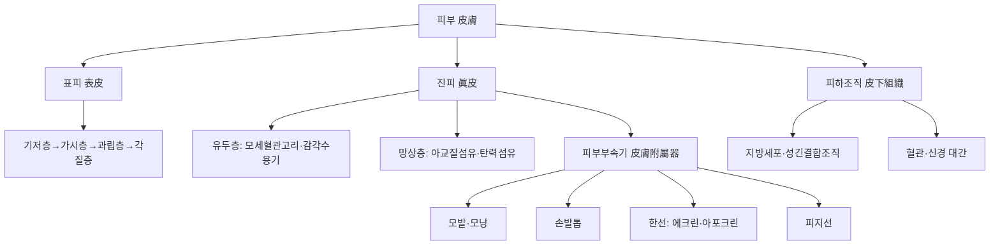

# 외피계(外皮系, Integumentary System)

외피계(外皮系, integumentary system)는 피부(皮膚)와 그 부속기(附屬器, 모발·손발톱·한선·피지선)로 구성되어 인체 표면을 둘러싸는 최대의 기관계다[교과서적 근거]. 성인의 피부는 면적 약 1.5~2.0㎡, 무게로는 체중의 약 15%를 차지하는 최대 기관이며, 외부 환경과 신체 내부를 구분하는 물리적 장벽인 동시에 체온 조절·감각 수용·비타민D 합성·면역 감시라는 다중 기능을 수행한다. 외피계는 침구(鍼灸) 시술이 직접 관통하는 조직이라는 점에서 한의학 임상과 가장 밀접하게 맞닿아 있는 계통이며, 자침 부위의 피부 반응·뜸 화상·감염 예방은 모든 침구 시술의 안전성 기반이 된다.

한의학에서는 폐주피모(肺主皮毛)라 하여 폐(肺)의 기능이 피부·체모의 상태와 직결된다고 보며, 망진(望診)은 피부의 색택(色澤)·윤조(潤燥)·창양(瘡瘍) 등을 관찰해 전신 상태를 추론하는 진단법이다. 이 문서는 조직학 폴더의 「상피조직(上皮組織, Epithelial Tissue)」 문서가 다룬 표피 각질형성세포 분화·재상피화 등 미세구조·병리 기전과는 별개로, 피부·피부부속기의 육안 해부학적 구조, 침구 시술의 피부 안전성에 관한 인체 대상 임상 근거, 그리고 한의학적 상관을 종합적으로 정리한 계통 총론(系統 總論) 문서다.

## 제1편 총론 — 피부의 정의와 육안 해부학적 구조

### 1. 피부의 3층 구조

피부는 육안적으로 표피(表皮, epidermis)·진피(眞皮, dermis)·피하조직(皮下組織, hypodermis, subcutaneous tissue)의 3층으로 구성된다[교과서적 근거]. 표피는 각질형성세포가 주를 이루는 중층편평상피로, 그 세부 분화 과정(기저층→가시층→과립층→각질층)과 각질층의 장벽 기능은 조직학 폴더 문서에서 상세히 다루었으므로, 이 문서에서는 육안 해부학적 두께·부위별 차이에 집중한다. 표피의 두께는 부위에 따라 크게 달라, 눈꺼풀에서 가장 얇고(약 0.05mm) 손발바닥에서 가장 두껍다(약 1.5mm)[교과서적 근거].

다음 개념도는 피부의 3층 구조와 각 층에 부속되는 피부부속기의 관계를 도식화한 것이다.

이 개념도는 피부 3층 구조와 부속기의 계통적 소속 관계를 정리한 것이며, 각 구조의 위치·기능은 아래 각론에서 상술한다.

### 2. 진피의 구조와 국소해부학적 의의

진피는 표피 아래에 위치하는 결합조직층으로, 표피와 접하는 유두층(乳頭層, papillary layer, 성긴 결합조직으로 모세혈관 고리와 감각 수용기가 풍부)과 그 아래의 망상층(網狀層, reticular layer, 치밀한 아교질섬유·탄력섬유로 구성되어 피부의 인장강도를 담당)으로 나뉜다[교과서적 근거]. 진피에는 혈관총(피하-진피 경계의 심부혈관총, 유두층의 표재혈관총)·감각신경종말·모낭·한선·피지선이 위치하며, 자침 시 진피층의 혈관총을 관통하면 피하출혈(반상출혈)이 발생할 수 있다는 점이 침구 임상에서 중요하다[교과서적 근거]. 진피 혈관계는 피하조직과의 경계에 위치한 심부혈관총(deep/cutaneous plexus)에서 시작해 진피 중간층의 중간혈관총, 유두층의 표재혈관총(subpapillary plexus)까지 계층적으로 분지되며, 각 유두마다 하나씩 뻗어 올라가는 모세혈관 고리(capillary loop)가 표피에 산소·영양을 공급한다 — 표피 자체에는 혈관이 없어(무혈관성, avascular) 확산을 통해서만 영양을 공급받는다는 것이 조직학적으로 중요하다[교과서적 근거]. 진피의 감각신경종말은 부위·자극 종류에 따라 특화된 여러 소체(小體)로 구성된다 — 유두층의 마이스너소체(Meissner corpuscle, 정밀촉각), 진피-피하 경계의 파치니소체(Pacinian corpuscle, 진동·압각), 표피 기저층의 메르켈세포(Merkel cell, 지속압각), 루피니소체(Ruffini corpuscle, 피부 신전)가 대표적이며, 이 다양한 수용기의 밀도·분포가 부위별 촉각 예민도 차이(손끝·입술이 등·허벅지보다 예민한 이유)를 설명한다[교과서적 근거]. 진피의 신경 지배는 척수신경의 피부분절(dermatome)을 따르며, 이 피부분절 지도는 침구 경혈의 신경분절적 위치를 이해하는 데 활용된다[교과서적 근거]. 임상적으로 켈로이드(瘢痕疙瘩, keloid)·비후성반흔(肥厚性瘢痕, hypertrophic scar)은 진피 손상 후 아교질 과잉 축적의 결과이며, 자반증(紫斑症, purpura)은 진피 혈관총의 손상·투과성 이상을 반영하는 육안 소견이다[교과서적 근거].

### 3. 피하조직과 부위별 두께 변이

피하조직은 지방세포가 풍부한 성긴 결합조직으로 체온 보존·기계적 완충·에너지 저장 기능을 담당하며, 두께는 부위·성별·영양 상태에 따라 크게 달라진다[교과서적 근거]. 흉부·배부처럼 피하조직이 얇고 그 아래에 흉막·폐가 근접한 부위에서는 자침 깊이 조절이 특히 중요하며, 이는 제4편에서 다루는 기흉(氣胸) 예방의 해부학적 근거가 된다. 흉부 주요 경혈의 피부 표면에서 흉막까지의 거리를 CT로 정량 분석한 연구는, 성별·체형(과체중·저체중)에 따라 경혈별 안전 깊이에 유의한 차이가 있음을 확인했다[^48]. 견정(肩井, GB21)의 깊이를 초음파로 측정한 연구는 체중·신장·체질량지수(BMI)가 클수록, 남성이 여성보다 깊이가 유의하게 깊다는 것을 확인해 자침 깊이 결정에 체형을 고려해야 함을 보여준다[^50]. 피하조직에는 굵은 피부 혈관(피부동맥perforator이 근막을 뚫고 올라와 심부혈관총을 형성하기 전 주행하는 구간)과 표재정맥·피부신경 대간(great cutaneous nerve trunk)이 함께 주행하며, 이 구조가 정맥주사·피하주사의 해부학적 기반이자 심부 자침 시 표재혈관 손상(멍·혈종)의 원인이 되기도 한다[교과서적 근거]. 임상적으로 봉와직염(蜂窩織炎, cellulitis)은 진피-피하조직에 발생하는 세균 감염을 가리키는 대표적 진단명이며, 지방종(脂肪腫, lipoma)은 피하조직 지방세포의 양성 종양이다[교과서적 근거].

### 4. 피부의 기능 개관

피부는 물리적 장벽(각질층의 방수·항균), 체온 조절(한선 분비·피부혈류 조절), 감각 수용(촉각·통각·온도각·압각), 비타민D 합성(자외선에 의한 표피 내 7-디하이드로콜레스테롤의 광화학적 전환), 면역 감시(랑게르한스세포·비만세포)라는 다중 기능을 수행한다[교과서적 근거]. 이 가운데 감각 수용 기능은 경혈(經穴) 자극이 매개되는 일차 관문이며, 체온 조절 기능은 뜸(灸)의 온열 자극이 작용하는 표적이다.

## 제2편 피부부속기(皮膚附屬器) 해부

### 1. 모발(毛髮)과 모낭(毛囊)의 구조

모발은 진피·피하조직에 깊이 박힌 모낭에서 생성되며, 모낭은 모구(毛球, hair bulb)·모유두(毛乳頭, dermal papilla)·모기질(毛基質, hair matrix)로 구성된다[교과서적 근거]. 모발의 성장주기는 성장기(生長期, anagen, 2~6년)·퇴행기(退行期, catagen, 2~3주)·휴지기(休止期, telogen, 2~3개월)로 순환하며, 정상 두피에서는 약 85~90%의 모낭이 성장기에 있다. 원형탈모증(圓形脫毛症, alopecia areata)은 모낭에 대한 자가면역 반응으로 성장기 모낭이 급격히 퇴행기로 전환되는 질환이며, 안드로겐성 탈모(androgenetic alopecia)는 모낭의 점진적 소형화(miniaturization)가 특징이다[교과서적 근거]. 모낭 옆에는 입모근(立毛筋, arrector pili muscle)이라는 평활근이 비스듬히 부착되어 있으며, 교감신경(콜린성 신경절후섬유의 예외적인 부교감유사 지배) 자극에 의해 수축하면 모발이 곤두서고 모낭 주위 피부가 소름(입모笠毛) 형태로 솟아오른다 — 이는 정서적 반응·추위 노출 시 나타나는 자율신경 반사의 육안적 지표다[교과서적 근거]. 모낭 각 모낭 기저부에는 진피 유두층에서 이어지는 모세혈관 그물이 모유두에 영양을 공급하며, 이 혈류 공급의 저하가 안드로겐성 탈모·휴지기탈모(telogen effluvium)의 병태생리적 요인 중 하나로 거론된다[교과서적 근거].

침과 뜸이 원형탈모·안드로겐성탈모·지루성탈모 등 다양한 원인의 탈모증에 효과적일 수 있다는 내러티브 리뷰는, 면역 조절·염증 감소·테스토스테론 수치 저하 등을 기전으로 제시하며 부작용이 적은 대안적 치료 옵션이 될 수 있다고 정리했다[^3]. 원형탈모증에 매화침(梅花鍼, plum-blossom needling)을 서양의학적 치료와 병행하는 것이 단독 치료보다 개선율을 높일 수 있다는 체계적 고찰·메타분석이 있으나, 근거의 확신도가 낮고 표본 크기가 작다는 한계가 함께 지적되었다[^4]. 매화침과 기익표고법(氣益表固法)을 병행한 치료가 지루성 탈모증 환자의 호르몬 수치(테스토스테론 감소·에스트라디올 증가)를 조절하고 모발 성장을 촉진했다는 임상시험[^5], 청장년층 지루성 탈모증 환자 대상의 침 치료 유효성·안전성·비용효과성 평가 프로토콜[^6], 원형탈모증에 대한 침 치료의 체계적 고찰 프로토콜[^7]이 있다. 이개(耳蓋)의 압통점 분석을 통한 개별화된 이침(耳鍼) 진단·치료 접근을 제시한 관찰연구[^8], 원형탈모증을 영기병(營氣病)·위기병(衛氣病)으로 변증해 계지탕(桂枝湯) 등을 병용한 임상 경험 보고[^9], 캄포 처방과 침·자가 소나무 바늘 자극법을 병용해 재발성 원형탈모증에서 3년 이상의 장기 관해를 유지한 증례[^10], 6년간 지속된 만성 원형탈모증에 매화침 타법과 전신 침 치료를 병행해 9개월 만에 완전 관해를 유도한 증례[^11]도 있다. 지루성 탈모의 병기를 비위(脾胃) 기능 저하로 인한 습탁(濕濁)의 내생으로 보고 호화침(火火鍼)·자락방혈(刺絡放血)·투침(透鍼) 요법을 병행하는 치료 전략을 제시한 문헌도 있다[^12].

> 탈모증 관련 침구 근거는 대부분 증례 보고·소규모 임상시험 수준이며, 원형탈모증의 자연 관해 가능성을 고려할 때 침구 단독의 효과를 과대평가해서는 안 된다. 변증 없는 관행적 취혈은 근거에 부합하지 않으며, 광범위 탈모나 급속 진행성 탈모는 반드시 피부과와 공동 관리해야 한다.

### 2. 손발톱(爪甲)의 구조

손발톱은 표피가 변형된 각질 구조물로, 조체(爪體, nail plate)·조모(爪母, nail matrix, 손발톱을 생성하는 배아 조직)·조상(爪床, nail bed)·조근(爪根, nail root)·조주름(爪周, nail fold)으로 구성된다[교과서적 근거]. 손톱은 하루 약 0.1mm, 발톱은 그보다 느린 속도로 성장하며, 조모의 손상은 영구적인 손발톱 변형을 남길 수 있다. 한의학에서는 조갑(爪甲)을 "근지여(筋之餘)"라 하여 간(肝)의 상태를 반영하는 것으로 보는데, 이는 간주근(肝主筋) 이론과 조갑의 케라틴 구조가 개념적으로 연결된 것이다[교과서적 근거]. 조상 아래에는 손가락 말단동맥의 분지가 풍부한 모세혈관망을 형성하며, 조체는 반투명하여 이 모세혈관의 혈색이 비쳐 보이는데, 손톱을 눌렀다가 뗀 뒤 혈색이 돌아오는 시간(모세혈관재충혈시간, capillary refill time)이 말초 관류 상태를 평가하는 임상 지표로 활용된다[교과서적 근거]. 임상적으로 조갑진균증(爪甲眞菌症, onychomycosis)·내성발톱(嵌入爪甲, ingrown nail)·곤봉지(棍棒指, clubbing, 만성 저산소증·심폐질환 시 조상 각도 변화)는 이 구조와 직결되는 대표적 소견·진단명이다[교과서적 근거].

### 3. 한선(汗腺)의 구조와 종류

한선은 에크린한선(eccrine gland, 전신에 분포, 메로크린 분비 방식으로 수분성 땀을 분비해 체온 조절을 담당)과 아포크린한선(apocrine gland, 액와부·서혜부·유륜 등에 국한 분포, 사춘기 이후 활성화되어 냄새 있는 분비물을 배출)으로 나뉜다[교과서적 근거]. 이 분비 방식의 조직학적 차이는 조직학 폴더 문서(선상피 각론)에서 상세히 다루었다. 에크린한선은 교감신경(콜린성) 지배를 받아 체온 조절 발한뿐 아니라 정서적 스트레스에 반응하는 정서성 발한(emotional sweating)도 매개한다. 에크린한선은 진피 깊은 층·피하조직 경계에 위치한 분비부(coiled secretory portion)와 표피를 나선형으로 관통해 피부 표면에 개구하는 도관부(duct)로 구성되며, 분비부는 심부혈관총에서 갈라진 모세혈관망에 둘러싸여 있어 체온 상승 시 국소 혈류량 증가와 함께 발한량이 늘어난다는 것이 체온 조절의 혈관-분비선 연동 기전이다[교과서적 근거]. 임상적으로 다한증(多汗症, hyperhidrosis, 특히 손바닥·발바닥·액와부 국소 다한증)·무한증(無汗症, anhidrosis)은 에크린한선 기능 이상과 직결되며, 아포크린한선의 감염은 화농한선염(化膿汗腺炎, hidradenitis suppurativa)의 병태생리와 연관된다[교과서적 근거].

침 치료가 폐경·유방암 관련 안면홍조(顔面紅潮) 환자의 증상 빈도·중증도를 단기적으로 개선하는 데 효과적일 수 있으나 치료 종료 3개월 후에는 효과가 감소하는 경향이 있고, 원발성·정서적 다한증(多汗症, hyperhidrosis)에 대한 근거는 아직 부족하다는 최근 문헌 고찰이 있다[^53].

### 4. 피지선(皮脂腺)의 구조

피지선은 대부분 모낭에 부속되어 모낭피지선단위(毛囊皮脂腺單位, pilosebaceous unit)를 이루며, 홀로크린(holocrine) 분비 방식으로 피지(皮脂)를 분비해 피부·모발의 방수·윤활 기능을 담당한다[교과서적 근거]. 두피·안면·흉배부에 밀도가 높으며, 이 부위는 지루성 피부염(脂漏性 皮膚炎)·여드름(痤瘡)·지루성 탈모의 호발 부위와 일치한다. 지루성 탈모증에 대한 매화침 치료 근거[^5][^6]는 피지선 활성이 높은 두피 부위에 대한 침구 개입의 대표적 임상 사례다.

## 제3편 한의학적 상관 — 폐주피모(肺主皮毛)와 망진(望診)

### 1. 폐주피모(肺主皮毛)의 이론적 구조

한의학은 폐(肺)가 피모(皮毛)를 주관한다고 보아, 폐기(肺氣)의 선발(宣發) 작용이 위기(衛氣)와 진액(津液)을 피부 표면으로 퍼뜨려 주리(腠理)의 개합(開闔)과 외사(外邪) 방어를 담당한다고 설명한다[교과서적 근거]. 이는 현대적으로 표피의 물리적 장벽 기능·피부 면역(랑게르한스세포)·한선을 통한 체온 조절 기능과 개념적으로 대응하며, 폐기허(肺氣虛)가 피부 위축·다한(多汗)·감염 취약성과 임상적으로 연관된다고 보는 전통적 관점을 형성한다.

### 2. 폐-피부 축(肺-皮膚 軸)과 알레르기성 피부질환

아토피피부염(atopic dermatitis, 습진濕疹)·건선(乾癬, psoriasis) 등 만성 염증성 피부질환에 대한 침구 근거는 폐-피부 축의 임상적 함의를 뒷받침하는 방대한 자료를 형성한다. 아토피습진 침 치료 시 곡지(曲池, LI11)와 음릉천(陰陵泉, SP10)의 조합이 빈번히 사용되며 족삼리(足三里, ST36)·삼음교(三陰交, SP6)·합곡(合谷, LI4)이 핵심 혈위 네트워크를 이룬다는 범위 문헌고찰(scoping review)[^13], 침 치료가 SCORAD·소양증(搔痒症, VAS)·삶의 질(DLQI)을 유의하게 개선한다는 체계적 고찰·메타분석[^14], 침 치료가 가려움증 강도·EASI 점수를 낮추고 심각한 부작용이 보고되지 않았다는 메타분석[^15]이 있다. 곡지혈(LI11) 자가 지압이 가려움증·태선화(苔癬化, lichenification)를 완화한다는 파일럿 임상시험[^16], 영유아 습진에 십점추나(十點推拿)를 적용해 장기 재발률을 낮췄다는 임상시험[^17], 면면구(棉綿灸)가 만성 습진에서 스테로이드 연고보다 가려움증·삶의 질 개선에 우수했다는 임상시험[^18], 만성 항문주위습진에 이혈압박(耳穴壓迫)을 병행해 재발률을 낮춘 임상시험[^19], 양씨 휼자화관(刺絡火罐) 치료가 습진성 소양증과 관련된 뇌 기능 이상을 rs-fMRI로 확인해 역전시켰다는 임상시험[^20], 삼릉침(三稜鍼) 점자출혈과 배수혈 부항이 급성 습진에서 양약 치료군보다 개선율이 높았다는 임상시험[^21], 폐(肺)·신문(神門)·내분비·부신 이혈에 이침을 적용해 성인 습진의 SCORAD·DLQI를 개선한 무작위 임상시험[^22], 호침 화침(毫火鍼)의 얕은 자침법이 신경성피부염 소양증에서 스테로이드 연고보다 우수한 억제 효과를 보인 무작위 대조 시험[^23], 봉침(蜂鍼)과 한약을 병용해 만성 손습진의 장기 재발을 방지한 증례[^24]도 있다.

건선에 대해서는 다양한 침법의 상대적 유효성을 비교하는 네트워크 메타분석 프로토콜[^25], 화침(火鍼)의 유효성·안전성을 평가하는 메타분석[^26], 침 치료가 피부 병변뿐 아니라 우울·불안 등 심리사회적 증상 개선에 미치는 영향을 평가한 임상시험[^27], 청대(靑黛) 도포·커큐민·침술이 위약 대비 유의한 효과를 보였다는 체계적 고찰[^28], 침구 치료가 보통건선에서 아시트레틴 단독 투여보다 완치·개선율이 우수했다는 임상시험[^29], 혈어증(血瘀證) 판상건선에 애구(艾灸)를 병행해 재발률을 낮추고 삶의 질을 개선한 임상시험[^30], 침 치료가 건선의 보조 요법이 될 수 있으나 기존 문헌의 방법론적 질이 낮다는 체계적 고찰 개관[^31]이 있다. 혈위매선(穴位埋線) 요법의 부작용(국소 홍종열통·저열·피로감·동형반응)을 분석한 체계적 고찰은 적응증·금기증의 엄격한 준수와 시술 표준화의 필요성을 강조했다[^32]. 부항(cupping)이 케브너 현상(Koebner phenomenon)으로 건선 증상을 악화시킬 위험이 있어 주의가 필요하다는 체계적 고찰[^33]은 건선 환자에 대한 물리적 자극 시술 선택에서 중요한 안전성 근거다. 지압·매선요법이 건선의 대안·보조 요법이 될 수 있으나 갈증·구강건조 등 부작용에 유의해야 한다는 체계적 고찰·네트워크 메타분석[^34]도 있다.

> 아토피피부염·건선에 대한 침구 근거는 대부분 중등도 이하 증례에서의 보조 요법 수준이며, 중증·전신형 건선이나 아나필락시스 병력이 있는 아토피피부염은 반드시 피부과 표준 치료(생물학적 제제 등)를 우선해야 한다. 변증 없는 관행적 취혈은 근거에 부합하지 않으며, 습열침윤(濕熱浸淫)·비허습곤(脾虛濕困)·혈허풍조(血虛風燥) 등 병기 단계에 맞춘 변증 치료가 원칙이다.

### 3. 망진(望診)과 피부 관찰의 진단적 기초

망진은 피부의 색택(色澤)·윤조(潤燥)·창양(瘡瘍)·반진(斑疹) 등을 육안으로 관찰해 장부 기능과 기혈(氣血) 상태를 추론하는 진단법이다[교과서적 근거]. 피부의 색(청靑·적赤·황黃·백白·흑黑)은 오행(五行) 배속에 따라 오장(五臟)의 상태를 반영한다고 보며, 피부의 윤택함은 진액(津液)과 기혈의 충실함을, 건조·거칠어짐은 혈허(血虛)·음허(陰虛)를 시사하는 소견으로 해석된다. 이는 표피 각질층의 수분 보유 기능·진피 혈류량이라는 현대 피부생리학적 지표와 개념적으로 대응하며, 원형탈모증·건선 등에서 피부 병변의 형태·분포를 관찰하는 것이 변증의 출발점이 된다는 점에서 임상적으로 중요하다.

## 제4편 임상 적용과 안전성

### 1. 자침 부위 피부 소독과 감염 예방

일반적으로 육안상 깨끗한 피부에서는 침 시술 전 소독이 반드시 필요하지는 않으나, 피부가 눈에 띄게 오염되었거나 감염 부위 주변에 자침할 때는 알코올 소독이 필요하며, 시술자의 손 위생(비누와 물 또는 알코올 손소독제)이 매우 중요하다는 문헌 고찰이 있다[^2]. 항생제 치료에 반응하지 않던 소아의 중증 포도상구균 피부 감염에 침·뜸을 병행해 신속한 임상적 개선과 상처 치유를 이룬 증례는, 표준 치료 저항성 피부 감염에서 침구가 보완적 치료 수단이 될 수 있음을 보여주는 동시에 감염이 있는 피부에 대한 시술의 위생 관리 중요성도 함께 시사한다[^1]. 한국인 습진 환자를 대상으로 금(金)에 대한 접촉 알레르기 빈도를 조사한 연구는 금박 한약·금침(金鍼, gold acupuncture needle) 등 한국 특유의 금 접촉원에 의한 알레르기 반응이 예상보다 적음(3.1%)을 확인해, 금침 사용의 알레르기 위험이 상대적으로 낮음을 보여준다[^56].

### 2. 뜸(灸)·온침(溫鍼)의 화상 안전성

뜸은 피부에 직접 열을 가하는 시술이므로 화상(火傷)이 가장 중요한 안전성 이슈다. 삼음교(三陰交, SP6)에서 뜸 시술 시 화상을 방지하면서 효과를 낼 수 있는 안전 거리(3cm)를 제시한 임상시험은, 이 거리에서 피부 표면 온도가 최대 11°C까지 상승하면서도 안전하게 시술 가능함을 확인했다[^36]. 뜸 치료가 완전히 무위험한 시술이 아니며 알레르기 반응·화상·봉와직염 및 감염(C형 간염 등) 등 다양한 이상반응이 발생할 수 있고, 임신부에서는 조산·태반압박 위험까지 보고되었다는 체계적 고찰[^37]은 뜸의 상용화된 안전성 인식에 대한 중요한 반증이다. 관원(關元, CV4)·신궐(神闕, CV8)에서의 4주간 간접구(間接灸) 요법이 혈액·소변 검사 지표에 유의한 변화를 일으키지 않아 안전함을 확인한 임상시험[^38]도 있다. 온침 시 침 재질에 따라 전달 온도가 달라지며 은침(銀鍼)이 가장 강한 열자극과 화상 위험을 보이는 반면 구리침은 43~47℃의 적절한 온도를 안전하게 유지한다는 실험연구[^39], 체계적 간호 중재로 온침 화상 발생률을 유의하게 낮췄다는 임상시험[^40], MRI·수치모델로 뜸 치료 시 열이 조직 내부 최대 3cm 깊이까지 전달됨을 확인한 실험연구[^41]는 뜸·온침의 화상 예방을 위한 물리적 근거를 제공한다.

부적절한 민간요법으로서의 뜸·빙초산 사용이 심각한 화상(수술적 치료가 필요한 수준)으로 이어질 수 있다는 관찰연구[^42], 1999~2010년 한국 전통의학 시술의 이상반응(간기능 저하·감염·기흉·화상)을 분석한 관찰연구[^43], 한국에서 뜸으로 인한 화상의 역학을 분석해 복부 이외 부위 시술 시 깊은 화상 위험이 유의하게 높음을 보인 관찰연구[^44]는 뜸 화상이 드물지 않은 임상 현실임을 보여준다. 부적절한 뜸 패치 사용 후 심부 화상과 Pseudomonas oryzihabitans 감염이 발생해 변연절제술·음압상처치료(NPWT)·피부이식이 필요했던 당뇨병 환자 증례[^45], 당뇨병·말초신경병증 환자에서 경미한 뜸 화상이 메티실린내성황색포도상구균(MRSA)의 혈류 전파 경로가 되어 치명적인 다발성 장기 감염으로 이어진 증례[^46]는, 당뇨병·말초신경병증 등 고위험군에서 뜸 화상이 단순 피부 손상을 넘어 전신 감염으로 진행할 수 있음을 명확히 경고한다.

### 3. 자침의 심부 손상 — 기흉(氣胸) 예방

피부·피하조직을 관통하는 자침이 과도하게 깊거나 각도가 부적절하면 흉막을 뚫어 기흉을 유발할 수 있으며, 이는 침구 시술의 가장 중대한 외상성 합병증이다. 침 치료가 대체로 안전하나 기흉·척수손상과 같은 드물지만 치명적인 외상성 합병증이 발생할 수 있고, 대부분 시술자의 해부학적 지식 부족이나 적용 오류에 기인한다는 문헌 고찰[^47]이 있다. 경부·부항 시술 후 기흉이 발생한 증례[^49]를 비롯해, 흉부·견갑부 자침 후 기흉이 보고된 다수의 증례가 축적되어 있으며, 흉부 X-선·초음파(POCUS) 등을 통한 신속한 진단과 흉관삽관(thoracostomy) 등의 처치가 필요하다는 증례 보고들이 이어진다[^49]. 견정혈(GB21)의 자침 깊이를 초음파로 측정해 체형별 안전 깊이를 제시한 연구[^50], 침 치료 후 기흉 발생의 위험 요인(흉부수술 병력·만성 기관지염·폐기종·폐렴·결핵·폐암 병력·남성)을 분석한 관찰연구[^52], 중국 문헌 분석에서 기흉·실신·지주막하출혈·감염 등이 대부분 부적절한 시술 기술로 인해 발생했음을 보고한 체계적 고찰[^51]도 있다.

> 기흉 예방을 위한 핵심 원칙은 흉곽 부위(견정·폐유·백로 등) 경혈의 자침 깊이를 환자의 체형(BMI·근육량)에 맞추어 조절하고, 만성 폐질환·흉부수술 병력이 있는 고위험군에서는 더욱 보수적인 깊이를 적용하는 것이다. 시술 후 흉통·호흡곤란이 나타나면 즉시 기흉을 감별해야 하며, 지연 진단은 긴장성 기흉으로 진행해 치명적일 수 있다.

### 4. 안전성 표

| 부위/상황 | 위험 | 근거·비고 |
|---|---|---|
| 감염·오염 피부 자침 | 국소·전신 감염 | 손 위생·알코올 소독 필요[^2] |
| 뜸(직접구·간접구) | 화상, 봉와직염, 드물게 조산 | 체계적 고찰에서 다양한 이상반응 보고[^37] |
| 온침 | 화상(재질별 차등) | 은침이 구리침보다 화상 위험 높음[^39] |
| 당뇨병·말초신경병증 환자 뜸 | 심부 화상 후 중증 감염(MRSA 등) | 증례 보고[^45][^46] |
| 흉곽 부위(견정 등) 자침 | 기흉 | 체형별 안전 깊이 고려 필요[^48][^50] |
| 건선 병변 부위 부항 | 케브너 현상으로 악화 가능 | 체계적 고찰의 주의 권고[^33] |
| 혈위매선(埋線) | 국소 홍종·저열·동형반응 | 체계적 고찰[^32] |
| 금침(金鍼) 사용 | 접촉 알레르기(낮은 빈도) | 관찰연구, 3.1% 발생률[^56] |

> 이 표는 임상 틀이지 동일 근거수준의 권고가 아니다. 개별 환자의 피부 상태, 기저질환(당뇨병·말초신경병증·만성 폐질환), 시술 부위의 해부학적 특성을 종합적으로 평가한 뒤 시술 여부와 방법을 결정해야 한다.

### 5. 임상 추적 관찰 지표

| 피부 영역 | 추적 지표 |
|---|---|
| 아토피피부염 | SCORAD, EASI, 소양증 VAS, DLQI |
| 건선 | PASI, BSA, DLQI |
| 탈모 | 모발 밀도, 성장기/휴지기 모낭 비율, SALT 점수(원형탈모) |
| 시술 안전성 | 자침 부위 발적·부종·화상 여부, 흉통·호흡곤란 발생 여부 |

> 이 표는 임상 참고용 추적 지표 목록이며, 중증 피부질환·시술 관련 합병증 의심 시에는 피부과·응급의학과와의 협진이 우선되어야 한다.

### 6. 생활 관리와 조섭(調攝)

| 항목 | 지도 내용 | 이론적 근거 |
|---|---|---|
| 피부 보습 | 목욕 후 즉시 보습제 도포, 과도한 세정 자제 | 폐주피모(肺主皮毛)와 진액 보존 이론[교과서적 근거] |
| 자침 부위 관리 | 시술 후 24시간 내 심한 온열 자극·문지름 자제 | 자침 부위 미세 손상의 회복 시간 확보[교과서적 근거] |
| 뜸 시술 후 관리 | 시술 부위 수포·발적 관찰, 심하면 진료 | 화상 조기 발견[^37] |
| 정서 관리 | 스트레스성 소양증·탈모 악화 요인 관리 | 정지(情志)와 피모 상태의 상관[교과서적 근거] |

> 이 표는 생활지도 참고 틀이며, 중증 피부질환의 표준 치료(스테로이드 국소제·생물학적 제제 등)를 대체하지 않는다.

### 7. 환자 설명용 요약

> 피부는 우리 몸을 둘러싼 가장 큰 기관이며, 외부로부터 몸을 보호하고 체온을 조절하는 중요한 역할을 합니다. 침이나 뜸 치료는 이 피부를 직접 통과하거나 자극하는 치료이므로, 시술 전후의 피부 관리가 매우 중요합니다. 뜸 치료 후 물집이 잡히거나 심하게 붉어지면 반드시 담당 한의사에게 알려야 하며, 당뇨병이 있는 경우 작은 화상도 심각한 감염으로 이어질 수 있으므로 더욱 주의해야 합니다. 가슴 주변(어깨·등)에 침을 맞은 후 갑자기 숨쉬기 힘들거나 가슴이 아프면 반드시 즉시 병원 진료를 받아야 합니다.

## 제5편 Q&A

**Q1. 뜸 치료를 받으면 항상 흉터가 남는가?**

아니다. 현대 임상에서 사용하는 대부분의 간접구·온구는 피부에 직접 화상을 남기지 않도록 안전 거리(약 3cm)를 유지하며 시행한다[^36]. 다만 직접구(直接灸)나 부적절한 시술은 화상·흉터를 남길 수 있으므로, 시술 부위와 방식에 따라 다르다는 점을 환자에게 설명해야 한다.

**Q2. 침을 맞은 후 멍이 드는 것은 정상인가?**

진피의 혈관총이 손상되면 경미한 피하출혈(반상출혈)이 생길 수 있으며, 이는 대부분 경미하고 자연히 흡수된다[교과서적 근거]. 다만 항응고제 복용 환자나 출혈 경향이 있는 환자는 멍이 더 크고 오래갈 수 있으므로 시술 전 확인이 필요하다.

**Q3. 건선이 있는 환자에게 부항을 해도 되는가?**

주의가 필요하다. 건선 병변 부위에 대한 물리적 자극(부항 등)은 케브너 현상을 통해 새로운 병변을 유발하거나 기존 병변을 악화시킬 위험이 있다는 체계적 고찰이 있다[^33]. 병변이 활동성인 부위는 피하고, 비병변 부위 위주로 시술하는 것이 안전하다.

**Q4. 원형탈모증에 침 치료가 얼마나 효과적인가?**

매화침 등 침구 치료를 병행하는 것이 서양의학적 치료 단독보다 개선율을 높일 수 있다는 메타분석이 있으나[^4], 근거의 확신도가 낮고 소규모 연구가 많다. 원형탈모증은 자연 관해되는 경우도 있으므로, 침구 단독의 효과인지 자연경과인지 구분하기 어려운 한계가 있다. 광범위 탈모나 급속 진행성인 경우 피부과 진료를 병행해야 한다.

**Q5. 당뇨병 환자에게 뜸 치료를 할 때 특별히 주의할 점은?**

매우 중요하다. 당뇨병·말초신경병증 환자는 통증 감각이 저하되어 화상을 늦게 인지할 수 있고, 작은 화상도 심각한 세균 감염(봉와직염, 심하면 MRSA 균혈증)으로 진행할 수 있다는 증례가 보고되었다[^45][^46]. 이러한 환자에게는 온도·시간을 더 보수적으로 설정하고, 시술 후 피부 상태를 반드시 재확인해야 한다.

**Q6. 어깨나 등에 침을 맞은 후 가슴이 아프면 어떻게 해야 하는가?**

즉시 의료기관에 알려야 한다. 흉곽 주변 경혈(견정 등)의 깊은 자침은 드물지만 기흉을 유발할 수 있으며[^47][^49], 초기 증상이 경미해도 시간이 지나며 악화될 수 있다. 흉통·호흡곤란이 나타나면 흉부 X-선 등으로 신속히 기흉 여부를 확인해야 한다.

**Q7. 아토피피부염에 침 치료를 받아도 스테로이드 연고를 끊을 수 있는가?**

아니다. 침 치료가 SCORAD·소양증·삶의 질을 개선한다는 메타분석이 있지만[^14][^15], 이는 대부분 중등도 이하 환자에서의 보조 요법 수준 근거다. 중증 아토피피부염이나 급성 악화 시에는 표준 치료(국소 스테로이드·면역조절제)를 임의로 중단해서는 안 되며, 침구는 병용 보조 요법으로 위치해야 한다.

**Q8. 금(金)으로 만든 침이나 금박 한약재에 알레르기가 있을 수 있는가?**

가능하지만 빈도는 낮다. 한국인 습진 환자를 대상으로 한 조사에서 금 접촉 알레르기 발생률은 3.1%로 낮게 나타났다[^56]. 다만 금속 알레르기 병력이 있는 환자는 시술 전 문진에서 반드시 확인해야 한다.

---

[^1]: Acupuncture and moxibustion as fundamental therapeutic complements for full recovery of staphylococcal skin infection after a poor 50-day treatment response to antibiotics. Diógenes MS 외. _Journal of alternative and complementary medicine (New York, N.Y.)_. 2008-07. [증례 보고] [DOI 10.1089/acm.2008.0071](https://doi.org/10.1089/acm.2008.0071) [PMID 18684080](https://pubmed.ncbi.nlm.nih.gov/18684080/) — 항생제 저항성 포도상구균 피부감염에 침·뜸 병행이 회복을 도운 증례.
[^2]: Skin Disinfection and Acupuncture. Peter Hoffman. _Acupuncture in Medicine_. 2001-12. [문헌 고찰] [DOI 10.1136/aim.19.2.112](https://doi.org/10.1136/aim.19.2.112) — 자침 전 피부 소독·시술자 손위생의 원칙을 정리.
[^3]: Efficacy of Acupuncture and Moxibustion in Alopecia: A Narrative Review. Li AR 외. _Frontiers in medicine_. 2022. [문헌 고찰] [DOI 10.3389/fmed.2022.868079](https://doi.org/10.3389/fmed.2022.868079) [PMID 35755043](https://pubmed.ncbi.nlm.nih.gov/35755043/) — 다양한 원인의 탈모증에 대한 침구 치료의 기전·안전성 개관.
[^4]: Acupuncture for treating alopecia areata: A systematic review and meta-analysis. Ji Hee Jun 외. _Medicine_. 2026-03-20. [메타분석] [DOI 10.1097/md.0000000000048073](https://doi.org/10.1097/md.0000000000048073) — 매화침 병행이 원형탈모증 개선율을 높일 가능성, 근거 확신도는 낮음.
[^5]: The clinical effect of plum blossom needle acupuncture with qi-invigorating superficies-consolidating therapy on seborrheic alopecia. Li Q 외. _Annals of palliative medicine_. 2020-05. [임상시험] [DOI 10.21037/apm-20-909](https://doi.org/10.21037/apm-20-909) [PMID 32434362](https://pubmed.ncbi.nlm.nih.gov/32434362/) — 매화침·기익표고법이 지루성 탈모증의 호르몬 지표·모발 성장을 개선.
[^6]: A randomized controlled clinical study of acupuncture therapy for Seborrheic alopecia in young and middle ages: Study protocol clinical trial (SPIRIT compliant). Chen Q 외. _Medicine_. 2020-04. [임상시험] [DOI 10.1097/MD.0000000000019842](https://doi.org/10.1097/MD.0000000000019842) [PMID 32332635](https://pubmed.ncbi.nlm.nih.gov/32332635/) — 지루성 탈모증 침 치료의 유효성·안전성·비용효과성 평가 설계.
[^7]: Acupuncture for treating alopecia areata: a protocol of systematic review of randomised clinical trials. Lee HW 외. _BMJ open_. 2015-10-26. [체계적 고찰] [DOI 10.1136/bmjopen-2015-008841](https://doi.org/10.1136/bmjopen-2015-008841) [PMID 26503391](https://pubmed.ncbi.nlm.nih.gov/26503391/) — 원형탈모증 침 치료 체계적 고찰 프로토콜.
[^8]: Auricular Diagnosis and Therapy for Alopecia: Patient Data Analysis. Emil Iliev. _Acupuncture in Medicine_. 1997-05. [관찰연구] [DOI 10.1136/aim.15.1.14](https://doi.org/10.1136/aim.15.1.14) — 이개 압통점 기반 개별화 이침 진단·치료 접근.
[^9]: [Professor YANG Wen-hui's experience in treatment of alopecia areata with the combination of acupuncture and Chinese herbs based on yingwei theory]. Wu D 외. _Zhongguo zhen jiu_. 2020-09-12. [증례 보고] [DOI 10.13703/j.0255-2930.20190813-k0004](https://doi.org/10.13703/j.0255-2930.20190813-k0004) [PMID 32959597](https://pubmed.ncbi.nlm.nih.gov/32959597/) — 영기병·위기병 변증에 따른 원형탈모증 침·한약 치료 경험.
[^10]: A combination of herbal formulas, acupuncture, and novel pine-needle stimulation for recurrent alopecia areata: A case report. Kawashima N 외. _Medicine_. 2021-05-21. [증례 보고] [DOI 10.1097/MD.0000000000026084](https://doi.org/10.1097/MD.0000000000026084) [PMID 34011130](https://pubmed.ncbi.nlm.nih.gov/34011130/) — 재발성 원형탈모증에서 침·한약·자가 자극법 병용으로 장기 관해.
[^11]: Efficacy of Acupuncture Therapy in a Patient with Long-Standing Alopecia Areata: A Case Report. Wang X 외. _Complementary medicine research_. 2026-05-19. [증례 보고] [DOI 10.1159/000552417](https://doi.org/10.1159/000552417) [PMID 42154642](https://pubmed.ncbi.nlm.nih.gov/42154642/) — 6년 지속 만성 원형탈모증의 매화침·전신 침 치료로 완전 관해.
[^12]: [Discussion on the treatment of seborrheic alopecia with acupuncture and moxibustion based on the theory of zhuoxie haiqing]. Zhang M 외. _Zhongguo zhen jiu_. 2026-03-12. [문헌 고찰] [DOI 10.13703/j.0255-2930.20250901-0005](https://doi.org/10.13703/j.0255-2930.20250901-0005) [PMID 41839607](https://pubmed.ncbi.nlm.nih.gov/41839607/) — 비위습탁 이론에 기반한 지루성 탈모 침구 치료 전략.
[^13]: Potential Acupoint Prescriptions and Outcome Reporting for Acupuncture in Atopic Eczema: A Scoping Review. Zhiwen Zeng 외. _Evidence-Based Complementary and Alternative Medicine_. 2021-06-26. [체계적 고찰] [DOI 10.1155/2021/9994824](https://doi.org/10.1155/2021/9994824) — 아토피습진 침 치료의 핵심 혈위 네트워크와 평가 지표 정리.
[^14]: Acupuncture for atopic dermatitis: a systematic review and meta-analysis. Shuang Liang 외. _BMJ Open_. 2024-12. [메타분석] [DOI 10.1136/bmjopen-2024-084788](https://doi.org/10.1136/bmjopen-2024-084788) — 침 치료의 SCORAD·소양증·삶의 질 개선 효과.
[^15]: The effectiveness and safety of acupuncture for patients with atopic eczema: a systematic review and meta-analysis. Ruimin Jiao 외. _Acupuncture in Medicine_. 2019-09-09. [메타분석] [DOI 10.1177/0964528419871058](https://doi.org/10.1177/0964528419871058) — 침 치료의 가려움증·EASI 개선, 심각한 부작용 미보고.
[^16]: Effectiveness of acupressure on pruritus and lichenification associated with atopic dermatitis: a pilot trial. Lee KC 외. _Acupuncture in medicine_. 2012-03. [임상시험] [DOI 10.1136/acupmed-2011-010088](https://doi.org/10.1136/acupmed-2011-010088) [PMID 22207450](https://pubmed.ncbi.nlm.nih.gov/22207450/) — 곡지혈 자가 지압의 가려움증·태선화 완화 효과.
[^17]: [Observation on short and long-term effects of Tuina for treatment of infants eczema]. He YH 외. _Zhongguo zhen jiu_. 2009-08. [임상시험] [PMID 19947273](https://pubmed.ncbi.nlm.nih.gov/19947273/) — 십점추나가 영유아 습진의 장기 재발률을 낮춤.
[^18]: [Effect of cotton-moxibustion on chronic eczema and quality of life]. Hao LF 외. _Zhongguo zhen jiu_. 2021-09-12. [임상시험] [DOI 10.13703/j.0255-2930.20200817-k0002](https://doi.org/10.13703/j.0255-2930.20200817-k0002) [PMID 34491652](https://pubmed.ncbi.nlm.nih.gov/34491652/) — 면면구가 만성 습진의 가려움증·삶의 질 개선에서 스테로이드 연고보다 우수.
[^19]: [Clinical observation of chronic perianal eczema treated with auricular point sticking therapy and western medication]. Wen Y 외. _Zhongguo zhen jiu_. 2017-06-12. [임상시험] [DOI 10.13703/j.0255-2930.2017.06.009](https://doi.org/10.13703/j.0255-2930.2017.06.009) [PMID 29231502](https://pubmed.ncbi.nlm.nih.gov/29231502/) — 이혈압박 병행이 만성 항문주위습진의 재발률을 낮춤.
[^20]: Exploration of the effects of Yang's pricking-cupping therapy on eczema-induced pruritus based on rs-fMRI. Wei X 외. _Zhongguo zhen jiu_. 2024-01-12. [임상시험] [DOI 10.13703/j.0255-2930.20230326-0006](https://doi.org/10.13703/j.0255-2930.20230326-0006) [PMID 38191154](https://pubmed.ncbi.nlm.nih.gov/38191154/) — 자락화관 요법이 습진성 소양증 관련 뇌기능 이상을 역전.
[^21]: [Clinical observation on pricking and blood-letting and cupping with a three-edge needle for treatment of acute eczema]. Yao J 외. _Zhongguo zhen jiu_. 2007-06. [임상시험] [PMID 17663106](https://pubmed.ncbi.nlm.nih.gov/17663106/) — 삼릉침 점자출혈·부항이 급성 습진에서 양약보다 개선율 우수.
[^22]: The effects of auricular acupuncture at lung, shenmen, endocrine, adrenal points on adult eczema: a randomized trial. Dieu Thuong Thi Trinh 외. _MedPharmRes_. 2023-03-31. [임상시험] [DOI 10.32895/ump.mpr.7.1.7](https://doi.org/10.32895/ump.mpr.7.1.7) — 폐·신문·내분비·부신 이혈 이침이 성인 습진의 SCORAD·DLQI를 개선.
[^23]: [Shallow needling with filiform fire-needle for pruritus of neurodermatitis: a randomized controlled trial]. Sun W 외. _Zhongguo zhen jiu_. 2026-06-12. [임상시험] [DOI 10.13703/j.0255-2930.20250606-0003](https://doi.org/10.13703/j.0255-2930.20250606-0003) [PMID 42343517](https://pubmed.ncbi.nlm.nih.gov/42343517/) — 호침 화침의 얕은 자침이 신경성피부염 소양증에서 스테로이드보다 우수.
[^24]: Bee venom acupuncture and herbal medicine for hand eczema: Two case reports and an in vivo study. Jang S 외. _Explore (New York, N.Y.)_. [증례 보고] [DOI 10.1016/j.explore.2024.03.002](https://doi.org/10.1016/j.explore.2024.03.002) [PMID 38637265](https://pubmed.ncbi.nlm.nih.gov/38637265/) — 봉침·한약 병용이 만성 손습진의 장기 재발을 방지(인간 증례 부분 한정).
[^25]: Effectiveness comparisons of acupuncture for psoriasis. Zhi-yin Xie 외. _Medicine_. 2019-04. [체계적 고찰] [DOI 10.1097/md.0000000000015356](https://doi.org/10.1097/md.0000000000015356) — 다양한 침법의 건선 치료 효과 비교 네트워크 메타분석 프로토콜.
[^26]: Efficacy and safety of fire acupuncture for psoriasis vulgaris. Xueli Cheng 외. _Medicine_. 2021-03-26. [메타분석] [DOI 10.1097/md.0000000000025038](https://doi.org/10.1097/md.0000000000025038) — 화침의 건선 치료 유효성·안전성 평가.
[^27]: The effects of acupuncture for patients with psoriasis. Juan Du 외. _Medicine_. 2021-05-28. [임상시험] [DOI 10.1097/md.0000000000026042](https://doi.org/10.1097/md.0000000000026042) — 침 치료가 건선의 피부 증상과 심리사회적 증상에 미치는 영향 평가.
[^28]: Complementary and Alternative Medicine Therapies for Psoriasis: A Systematic Review. Gamret AC 외. _JAMA dermatology_. 2018-11-01. [체계적 고찰] [DOI 10.1001/jamadermatol.2018.2972](https://doi.org/10.1001/jamadermatol.2018.2972) [PMID 30193251](https://pubmed.ncbi.nlm.nih.gov/30193251/) — 청대·커큐민·침술의 건선 치료 근거 수준 비교.
[^29]: [Randomized controlled trials for treatment of 30 cases of ordinary psoriasis by acupuncture and moxibustion]. Wu JP 외. _Zhen ci yan jiu_. 2011-02. [임상시험] [PMID 21585062](https://pubmed.ncbi.nlm.nih.gov/21585062/) — 침구치료가 보통건선에서 아시트레틴 단독보다 우수.
[^30]: [Moxibustion on plaque psoriasis of blood stasis: a randomized controlled trial]. Chen ZX 외. _Zhongguo zhen jiu_. 2021-07-12. [임상시험] [DOI 10.13703/j.0255-2930.20200907-0004](https://doi.org/10.13703/j.0255-2930.20200907-0004) [PMID 34259409](https://pubmed.ncbi.nlm.nih.gov/34259409/) — 혈어형 판상건선에서 애구 병행이 재발률·삶의 질 개선.
[^31]: Efficacy and safety of acupuncture therapy for psoriasis: an overview of systematic reviews. Jing M 외. _Annals of palliative medicine_. 2021-10. [체계적 고찰] [DOI 10.21037/apm-21-2523](https://doi.org/10.21037/apm-21-2523) [PMID 34763442](https://pubmed.ncbi.nlm.nih.gov/34763442/) — 건선 침 치료 근거의 방법론적 질 문제 지적.
[^32]: [Adverse events/adverse reactions of acupoint catgut embedding therapy for psoriasis vulgaris: a systematic review]. Luo Y 외. _Zhen ci yan jiu_. 2022-04-25. [체계적 고찰] [DOI 10.13702/j.1000-0607.20210077](https://doi.org/10.13702/j.1000-0607.20210077) [PMID 35486018](https://pubmed.ncbi.nlm.nih.gov/35486018/) — 혈위매선의 국소 부작용(홍종열통·저열·동형반응) 분석.
[^33]: Mind-Body Interventions as Alternative and Complementary Therapies for Psoriasis: A Systematic Review of the English Literature. Timis TL 외. _Medicina (Kaunas, Lithuania)_. 2021-04-23. [체계적 고찰] [DOI 10.3390/medicina57050410](https://doi.org/10.3390/medicina57050410) [PMID 33922733](https://pubmed.ncbi.nlm.nih.gov/33922733/) — 부항이 케브너 현상으로 건선을 악화시킬 위험을 경고.
[^34]: Acupuncture-Related Techniques for Psoriasis: A Systematic Review with Pairwise and Network Meta-Analyses of Randomized Controlled Trials. Yeh ML 외. _Journal of alternative and complementary medicine_. 2017-12. [메타분석] [DOI 10.1089/acm.2016.0158](https://doi.org/10.1089/acm.2016.0158) [PMID 28628749](https://pubmed.ncbi.nlm.nih.gov/28628749/) — 지압·매선요법의 건선 개선 효과와 갈증·구강건조 부작용.
[^36]: Changes in Skin Surface Temperature at An Acupuncture Point with Moxibustion. Li-Mei Lin 외. _Acupuncture in Medicine_. 2013-06. [임상시험] [DOI 10.1136/acupmed-2012-010268](https://doi.org/10.1136/acupmed-2012-010268) — 뜸 화상 방지를 위한 안전 거리(3cm) 및 피부온도 변화 측정.
[^37]: Adverse events of moxibustion: a systematic review. Park JE 외. _Complementary therapies in medicine_. 2010-10. [체계적 고찰] [DOI 10.1016/j.ctim.2010.07.001](https://doi.org/10.1016/j.ctim.2010.07.001) [PMID 21056845](https://pubmed.ncbi.nlm.nih.gov/21056845/) — 뜸 치료의 화상·감염·임신부 위험 등 이상반응 종합.
[^38]: Safety of 4-week indirect-moxibustion therapy at CV4 and CV8. Son CG. _Journal of acupuncture and meridian studies_. 2011-12. [임상시험] [DOI 10.1016/j.jams.2011.09.018](https://doi.org/10.1016/j.jams.2011.09.018) [PMID 22196510](https://pubmed.ncbi.nlm.nih.gov/22196510/) — 관원·신궐 간접구의 혈액·소변 검사 안전성 확인.
[^39]: [Analysis on the temperature-time curve in warm needling manipulation with acupuncture needles of different materials]. Lin L 외. _Zhongguo zhen jiu_. 2019-12-12. [실험연구] [DOI 10.13703/j.0255-2930.2019.12.012](https://doi.org/10.13703/j.0255-2930.2019.12.012) [PMID 31820606](https://pubmed.ncbi.nlm.nih.gov/31820606/) — 온침 재질별 온도 전달 특성과 화상 위험 비교(인간 데이터 한정).
[^40]: [Effect of nursing intervention on the prevention of burns in warm needling moxibustion]. Tan BR 외. _Zhongguo zhen jiu_. 2013-11. [임상시험] [PMID 24494292](https://pubmed.ncbi.nlm.nih.gov/24494292/) — 간호 중재를 통한 온침 화상 발생률 감소.
[^41]: Experimental and Numerical Study on the Temperature Elevation in Tissue during Moxibustion Therapy. Solovchuk M 외. _Evidence-based complementary and alternative medicine_. 2020. [실험연구] [DOI 10.1155/2020/7514302](https://doi.org/10.1155/2020/7514302) [PMID 32190089](https://pubmed.ncbi.nlm.nih.gov/32190089/) — MRI·수치모델로 뜸 열전달 깊이(최대 3cm) 확인.
[^42]: An Etiology Report for Burns Caused by Korean Folk Remedies. Joo HS 외. _Archives of plastic surgery_. 2023-05. [관찰연구] [DOI 10.1055/a-2040-0826](https://doi.org/10.1055/a-2040-0826) [PMID 37256034](https://pubmed.ncbi.nlm.nih.gov/37256034/) — 뜸·빙초산 오용으로 인한 중증 화상 사례 분석.
[^43]: Adverse events attributed to traditional Korean medical practices: 1999-2010. Shin HK 외. _Bulletin of the World Health Organization_. 2013-08-01. [관찰연구] [DOI 10.2471/BLT.12.111609](https://doi.org/10.2471/BLT.12.111609) [PMID 23940404](https://pubmed.ncbi.nlm.nih.gov/23940404/) — 한국 전통의학 시술의 간손상·감염·기흉·화상 이상반응 분석.
[^44]: Epidemiology of burns caused by moxibustion in Korea. Yoon C 외. _Burns_. 2016-11. [관찰연구] [DOI 10.1016/j.burns.2016.04.015](https://doi.org/10.1016/j.burns.2016.04.015) [PMID 27156790](https://pubmed.ncbi.nlm.nih.gov/27156790/) — 뜸 화상의 부위별 심도 차이 역학 분석.
[^45]: Pseudomonas oryzihabitans: An Emerging Opportunistic Pathogen Causing Severe Burn Wound Infection After Improper Moxibustion Patch Use in an Elderly Diabetic Farmer. Wang R 외. _Infection and drug resistance_. 2026. [증례 보고] [DOI 10.2147/IDR.S611045](https://doi.org/10.2147/IDR.S611045) [PMID 42261283](https://pubmed.ncbi.nlm.nih.gov/42261283/) — 부적절한 뜸 패치 사용 후 심부 화상·기회감염 증례.
[^46]: Case Report: Moxibustion-induced burns leading to disseminated methicillin-resistant Staphylococcus aureus infection in a patient with type 2 diabetes mellitus. Liang H 외. _Frontiers in endocrinology_. 2026. [증례 보고] [DOI 10.3389/fendo.2026.1860646](https://doi.org/10.3389/fendo.2026.1860646) [PMID 42272806](https://pubmed.ncbi.nlm.nih.gov/42272806/) — 당뇨병 환자의 뜸 화상이 MRSA 전신 감염으로 진행한 증례.
[^47]: Rare but serious complications of acupuncture: traumatic lesions. Peuker E 외. _Acupuncture in medicine_. 2001-12. [문헌 고찰] [DOI 10.1136/aim.19.2.103](https://doi.org/10.1136/aim.19.2.103) [PMID 11829156](https://pubmed.ncbi.nlm.nih.gov/11829156/) — 침 치료의 기흉·척수손상 등 외상성 합병증 개관.
[^48]: [Detection of the safety depth on human chest by computer tomographic scanning]. Sheu CY 외. _Zhonghua yi xue za zhi_. 1992-11. [관찰연구] [PMID 1338010](https://pubmed.ncbi.nlm.nih.gov/1338010/) — CT로 측정한 흉부 경혈의 성별·체형별 안전 자침 깊이.
[^49]: [Clinical analysis on 38 cases of pneumothorax induced by acupuncture or acupoint injection]. Zhao DY 외. _Zhongguo zhen jiu_. 2009-03. [증례 보고] [PMID 19358511](https://pubmed.ncbi.nlm.nih.gov/19358511/) — 침·혈위주사로 인한 기흉 38례의 임상 분석.
[^50]: Using Ultrasonography Measurements to Determine the Depth of the GB 21 Acupoint to Prevent Pneumothorax. Chen HN 외. _Journal of acupuncture and meridian studies_. 2018-12. [관찰연구] [DOI 10.1016/j.jams.2018.06.004](https://doi.org/10.1016/j.jams.2018.06.004) [PMID 29936338](https://pubmed.ncbi.nlm.nih.gov/29936338/) — 견정혈 자침 깊이의 체형별 초음파 측정.
[^51]: Acupuncture-related adverse events: a systematic review of the Chinese literature. Zhang J 외. _Bulletin of the World Health Organization_. 2010-12-01. [체계적 고찰] [DOI 10.2471/BLT.10.076737](https://doi.org/10.2471/BLT.10.076737) [PMID 21124716](https://pubmed.ncbi.nlm.nih.gov/21124716/) — 중국 문헌의 침구 이상반응(기흉·실신·지주막하출혈·감염) 종합.
[^52]: Incidence of iatrogenic pneumothorax following acupuncture treatments in Taiwan. Lin SK 외. _Acupuncture in medicine_. 2019-12. [관찰연구] [DOI 10.1136/acupmed-2018-011697](https://doi.org/10.1136/acupmed-2018-011697) [PMID 31433202](https://pubmed.ncbi.nlm.nih.gov/31433202/) — 대만의 침 치료 후 기흉 발생률과 위험 요인(폐질환 병력·남성) 분석.
[^53]: The role of acupuncture in managing hyperhidrosis and vasomotor sweating: Evidence, mechanisms, and gaps. Lu G 외. _Complementary therapies in medicine_. 2026-05. [문헌 고찰] [DOI 10.1016/j.ctim.2026.103337](https://doi.org/10.1016/j.ctim.2026.103337) [PMID 41765151](https://pubmed.ncbi.nlm.nih.gov/41765151/) — 안면홍조 대비 원발성 다한증에 대한 침 치료 근거의 격차 지적.
[^56]: Multicenter study of the frequency of contact allergy to gold. Lee AY 외. _Contact dermatitis_. 2001-10. [관찰연구] [DOI 10.1034/j.1600-0536.2001.450404.x](https://doi.org/10.1034/j.1600-0536.2001.450404.x) [PMID 11683831](https://pubmed.ncbi.nlm.nih.gov/11683831/) — 한국인 습진 환자의 금 접촉 알레르기 빈도(3.1%) 조사, 금침 안전성 참고자료.

**고전 인용 출처**: 『黃帝內經素問』(五藏生成篇, 咳論, 皮部論), 『靈樞』(經脈, 本藏), 『難經』(四十難), 『醫學入門』, 『類經』.
**문헌 데이터 출처**: [한의학 논문 데이터베이스 (med.symbolicinfo.com)](https://med.symbolicinfo.com) — 2026-08-25 조회 기준.
