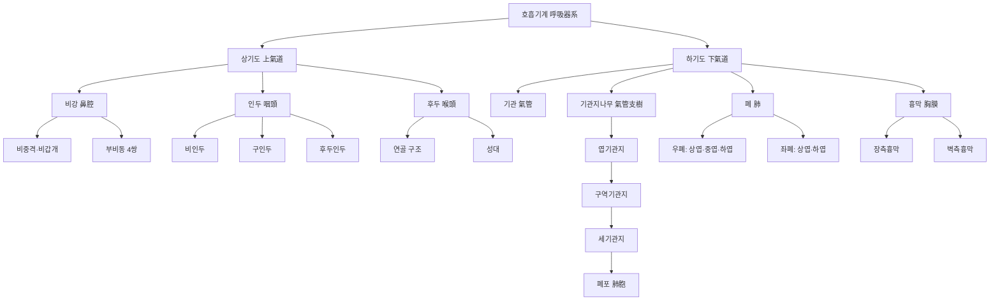
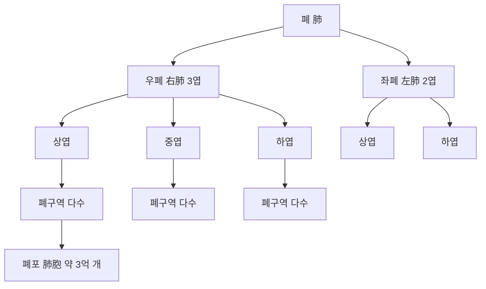

# 호흡기계(呼吸器系, Respiratory System)

호흡기계(呼吸器系, respiratory system)는 공기가 드나드는 통로인 상기도(上氣道)·하기도(下氣道)와, 실제 가스 교환이 일어나는 폐(肺)로 구성되어 산소를 흡수하고 이산화탄소를 배출하는 인체 계통이다[교과서적 근거]. 이 문서는 해부학 폴더에서 그동안 "작성 예정"으로 남아 있던 호흡기계 항목을 **계통 총론(系統總論)** 으로 새롭게 정리한다. 한방생리학의 폐(肺) 문서는 "폐주기사호흡(肺主氣司呼吸)"·"폐주선발숙강(肺主宣發肅降)" 등 한의학 고유의 생리학적 관점을 다루며, 이 문서는 그와 구별되는 육안 해부학적 구조(상기도·하기도·폐엽·흉막)와 침구 임상 근거·안전성에 집중한다.

이 문서는 총 6편으로 구성된다. 제1편은 상기도/하기도 구분과 발생학적 개요를 총론으로 다룬다. 제2편은 상기도(비강·인두·후두)의 육안 해부와 알레르기 비염 등 상기도 질환의 침구 근거를 다룬다. 제3편은 하기도(기관·기관지·폐엽·흉막)의 육안 해부와 자침 시 기흉 위험 부위, 천식·COPD의 침구 근거를 종합한다. 제4편은 한의학적 상관(폐주기사호흡肺主氣司呼吸 등)을 다룬다. 제5편은 임상 적용과 안전성을, 제6편은 Q&A와 고전 인용 출처로 마무리한다. 인용된 인간 대상 연구는 med.symbolicinfo.com 데이터베이스에서 수집한 것이며, 동물실험 단독 연구는 인용에서 제외하였다. 순수 해부학적 구조 서술은 `[교과서적 근거]`로 표기하고, 임상 근거는 개별 각주로 표기한다.

---

## 제1편 총론 — 상기도·하기도 구분과 발생학적 개요

### 1. 상기도와 하기도의 해부학적 구분

호흡기계는 관행적으로 후두(喉頭)를 경계로 상기도(비강·인두·후두)와 하기도(기관·기관지·폐)로 나뉜다[교과서적 근거]. 상기도는 흡입 공기를 데우고 가습하며 이물질을 여과하는 "공기 조절 장치"의 역할을 하고, 하기도는 이렇게 조절된 공기를 폐포까지 전달해 실제 가스 교환이 일어나는 곳까지 안내하는 역할을 한다[교과서적 근거]. 이 구분은 임상적으로도 중요한데, 상기도 질환(알레르기 비염·부비동염·인후두염)과 하기도 질환(천식·만성폐쇄성폐질환COPD·폐렴)은 병태생리와 치료 전략이 서로 다르면서도, "일측기도(one airway)" 개념처럼 상하기도가 하나의 연속된 점막 면역 반응 단위로 함께 다뤄지기도 한다[교과서적 근거].

다음 개념도는 호흡기계 전체의 구성과 상기도·하기도의 세부 구조를 도식화한 것이다.

이 흐름도는 해부학적 구조를 계통적으로 정리한 개념도일 뿐이며, 실제 삼차원 형태나 위치 관계는 아래 각론에서 서술하는 육안 해부를 참조해야 한다.

### 2. 호흡기계의 발생학적 개요

호흡기계는 배아 발생 4주경 전장(前腸, foregut) 배쪽 벽에서 형성되는 후두기관구(喉頭氣管溝, laryngotracheal groove)에서 기원하며, 이 구조가 식도와 분리되면서 기관·기관지·폐로 분화한다[교과서적 근거]. 이 발생학적 기원 때문에 기관과 식도가 인접해 있으며, 드물게 기관식도루(氣管食道瘻)와 같은 선천 기형이 발생할 수 있다[교과서적 근거]. 폐 자체는 이후 여러 차례의 분지 형성을 거쳐 기관지나무(bronchial tree) 구조를 완성하며, 출생 전후 폐포의 성숙이 계속 진행된다[교과서적 근거].

### 3. 호흡기계 질환에 대한 침구 근거의 전체 지형

호흡기계 질환에 대한 침구 근거는 상기도의 알레르기 비염과 하기도의 천식·COPD에서 특히 두텁게 축적되어 있다. 일본 내 호흡기 질환에 대한 침구 치료 연구를 검토한 체계적 고찰은 천식·COPD 등 다양한 호흡기 질환에 침구 치료가 폭넓게 적용되어 왔음을 확인하였다[^1]. 소아의 호흡기·소화기·신경계 질환에 대한 침 치료의 임상적 유효성과 기전을 종합한 문헌 고찰도 있다[^2]. 다만 코크란 체계적 고찰을 포함한 여러 고전적 문헌은 천식에서 침 치료가 가짜 침 대비 통계적으로 유의미하거나 임상적으로 관련 있는 효과를 보이지 않았다고 보고하는 등[^3][^4], 근거가 완전히 일관되지는 않는다.

> 호흡기계는 상기도(알레르기성 질환 중심)와 하기도(폐쇄성 폐질환 중심)로 병태생리가 뚜렷이 나뉘며, 근거 수준도 하위 영역별로 다르다. 제2·3편에서 각각의 근거를 종합한다.

---

## 제2편 상기도(上氣道) 해부 — 비강·인두·후두

### 4. 비강(鼻腔)의 육안 해부

비강은 비중격(鼻中隔)에 의해 좌우로 나뉘며, 상·중·하 비갑개(鼻甲介)가 점막 표면적을 넓혀 흡입 공기의 가온·가습·여과 기능을 극대화한다[교과서적 근거]. 비강 점막은 혈관이 매우 풍부하여 알레르기 반응·염증에 민감하게 부어오르며, 이것이 알레르기성 비염의 코막힘 증상의 해부학적 기초다[교과서적 근거]. 부비동(副鼻洞, paranasal sinus)은 비강과 연결된 공기 주머니로, 전두동·상악동·사골동·접형동으로 구성되며 비강 점막과 연속된 점막으로 덮여 있어 비염이 부비동염으로 파급되기 쉽다[교과서적 근거].

비강의 위치·경계를 보다 세밀히 살피면, 비강 상벽은 사골(篩骨)의 사판(篩板, cribriform plate)을 사이에 두고 전두개와(前頭蓋窩)와 접하고, 하벽은 구강 천장인 경구개(硬口蓋)를 사이에 두고 구강과 접하며, 외측벽은 상악동 내측벽과 인접한다[교과서적 근거]. 이 사판 인접 관계 때문에 두부 외상이나 심한 비강 내 조작 시 극히 드물게 뇌척수액비루(腦脊髓液鼻漏)가 발생할 수 있다는 것이 임상적으로 중요하다[교과서적 근거]. 비강의 동맥 혈류는 외경동맥 분지인 접형구개동맥(蝶形口蓋動脈, sphenopalatine artery)과 안동맥(眼動脈, ophthalmic artery)에서 갈라진 전·후사골동맥(anterior/posterior ethmoidal artery)이 이중으로 공급하며, 비중격 앞쪽 하방에서 이 여러 동맥이 서로 문합해 그물망을 이루는 부위(키셀바흐 부위, Kiesselbach's plexus/Little's area)가 코피(鼻出血, epistaxis)의 90% 이상을 차지하는 호발 부위다[교과서적 근거]. 정맥 배출은 익돌근정맥총(翼突筋靜脈叢, pterygoid venous plexus)을 거쳐 해면정맥동으로 연결되는 경로도 있어, 안면부 감염이 두개내로 파급될 수 있는 "위험 삼각(danger triangle)" 개념의 해부학적 근거가 된다[교과서적 근거]. 신경 지배는 삼차신경(三叉神經, trigeminal nerve) 제1·2가지(안신경·상악신경)의 감각 지배와, 후각 상피에 분포하는 후신경(嗅神經, olfactory nerve)의 특수감각 지배로 나뉜다[교과서적 근거]. 조직학적으로 비강 대부분은 위중층섬모원주상피(僞重層纖毛圓柱上皮, pseudostratified ciliated columnar epithelium)에 술잔세포(goblet cell)가 섞인 호흡상피(呼吸上皮)로 덮여 있으나, 비강 천장 부위는 후각수용세포를 포함하는 후상피(嗅上皮)로 특화되어 있다[교과서적 근거]. 임상적으로 비중격만곡증(鼻中隔彎曲症, deviated nasal septum)·비용종(鼻茸腫, nasal polyp)·부비동염(副鼻洞炎, sinusitis)은 이 국소해부학적 구조의 이상·염증과 직결되는 대표적 진단명이다[교과서적 근거].

### 5. 알레르기 비염(過敏性 鼻炎)에 대한 침구 근거

알레르기 비염은 상기도 침구 근거가 가장 두텁게 축적된 영역이다. 침 치료가 알레르기 비염 환자의 비강 증상(TNSS)·비강 외 증상(TNNSS)을 유의하게 개선하며 안전하다는 다기관 무작위 대조 시험(238명)[^5], 모든 종류의 침술 요법이 가짜 침보다 증상·삶의 질 개선에 효과적이고 안전하다는 베이지안 메타분석(3,433명)[^6]이 대표적이다. 접형구개신경절(蝶形口蓋神經節, sphenopalatine ganglion, SPG) 침 치료가 다른 침구 기법보다 효과 확률이 가장 높다는 개관 연구·네트워크 메타분석(3,769명)[^7], SPG 단독 침치료가 비강 증상·삶의 질 개선에 효과적이라는 메타분석(1,004명)[^8]도 있다. 삼복첩(三伏貼)·삼복구(三伏灸) 등 계절 특이적 혈위 첩부 요법이 양호한 치료 효과와 높은 순응도를 보인다는 체계적 고찰(1,785명)[^9], 비강 내 침 치료가 재발률을 낮춰 장기적 증상 완화 효과가 기대된다는 메타분석(1,009명)[^10]도 확인된다.

다만 코크란 계열의 초기 체계적 고찰은 분석된 RCT의 질이 낮고 IgE 수치 감소나 증상 개선 효과가 통계적으로 유의하지 않았다고 보고하였으며[^11], 계절성 알레르기 비염보다는 다년성(perennial) 비염에서 더 유효할 수 있다는 체계적 고찰도 있다[^12]. 침 치료와 중약(한약) 처방 병용이 계절성 알레르기 비염의 증상 중증도(VAS)와 삶의 질을 유의하게 개선했다는 무작위 대조 시험(52명)[^13], 지속성 알레르기 비염에 침 치료가 안전하고 효과적이라는 무작위 샴대조 시험(80명)[^14]도 있다. 익구와(翼口窩, pterygopalatine fossa) 자침법이 중등도-중증 지속성 알레르기 비염에서 일반 진성 침치료보다 효과 발현이 빠르고 지속 기간이 길었다는 무작위 대조 예비 시험(96명)[^15]도 SPG 인근 국소해부를 표적으로 한 취혈의 근거를 보여준다.

### 6. 인두(咽頭)와 후두(喉頭)의 육안 해부

인두는 비강·구강·후두와 연결되는 근육성 관으로 비인두·구인두·후두인두의 세 부분으로 나뉘며, 소화관(식도)과 호흡관(후두)이 갈라지는 해부학적 교차점이다[교과서적 근거]. 후두는 갑상연골·윤상연골·피열연골 등의 연골 구조와 성대(聲帶)로 구성되어 발성과 기도 보호(연하 시 후두덮개가 기도 입구를 막는 반사)의 두 기능을 겸한다[교과서적 근거]. 인후두 부위는 천돌(天突, CV22)과 같은 응급 혈위가 위치하는 곳으로, 담음을 제거하고 기의 흐름을 조절하여 천식·혼수·딸꾹질 등 호흡기 및 상기도 응급 상황에서 활용된다는 문헌 고찰이 있다[^16].

인두의 세 구간은 위치·경계가 뚜렷이 구분된다. 비인두는 비강 후방에서 연구개(軟口蓋) 높이까지, 구인두는 연구개에서 후두덮개(喉頭蓋, epiglottis) 높이까지, 후두인두는 후두덮개에서 윤상연골 하연(식도 시작부)까지에 해당하며, 편도(扁桃, tonsil, 구개편도·인두편도·설편도로 구성되는 발다이어고리Waldeyer's ring)가 이 경계 부위에 배치되어 있다[교과서적 근거]. 인두의 혈액 공급은 주로 외경동맥의 상행인두동맥(ascending pharyngeal artery)·안면동맥·상행구개동맥 분지가 담당하고, 정맥은 인두정맥총을 거쳐 내경정맥으로 유입된다[교과서적 근거]. 신경 지배는 인두신경총(pharyngeal plexus, 미주신경·설인신경·교감신경 섬유가 합류)이 담당하며, 이 신경총의 장애는 연하곤란(嚥下困難, dysphagia)의 신경학적 원인이 된다[교과서적 근거]. 후두의 위치는 제3~6경추 높이에 해당하며, 전방은 피부·근막으로 얕게 덮여 있어 촉진이 용이하고, 후방은 후두인두를 사이에 두고 경추체와 접한다[교과서적 근거]. 후두의 동맥은 상후두동맥(상갑상동맥 분지)·하후두동맥(하갑상동맥 분지)의 이중 공급을 받으며, 신경은 미주신경의 두 분지인 상후두신경(superior laryngeal nerve, 성대 위 점막 감각·윤상갑상근 운동)과 되돌이후두신경(recurrent laryngeal nerve, 나머지 후두 내근 운동)이 지배한다 — 되돌이후두신경은 갑상선 바로 뒤를 주행하므로 갑상선 수술이나 경부 자침 시 손상되면 애성(嗄聲, hoarseness)·성대마비가 초래될 수 있다[교과서적 근거]. 후두 점막은 성대 부위를 제외하고는 위중층섬모원주상피로 덮여 있으나, 마찰이 많은 성대 표면은 중층편평상피로 특화되어 있다[교과서적 근거]. 임상적으로 급성후두염(急性喉頭炎, acute laryngitis)·성대결절(聲帶結節, vocal cord nodule)·후두암(喉頭癌, laryngeal cancer)은 이 부위 병변의 대표적 진단명이다[교과서적 근거].

> 비강·부비동 국소해부에 대한 상세한 신경·혈관 지배는 신경계(神經系) 문서와 순환계(循環系) 문서에서 각각 텍스트 교차 참조할 수 있다.

---

## 제3편 하기도(下氣道) 해부 — 기관·기관지·폐엽·흉막

### 7. 기관(氣管)과 기관지(氣管支)의 육안 해부

기관은 후두 아래에서 시작하여 흉골각(胸骨角) 높이(제4~5흉추)에서 좌우 주기관지로 갈라지며, C자 모양의 유리연골 고리가 앞쪽·측면을 지지하여 관강을 항상 열어 둔다[교과서적 근거]. 우측 주기관지는 좌측보다 더 굵고 짧으며 수직에 가까운 각도로 분지되어, 이물질 흡인이나 흡인성 폐렴이 우측 폐에서 더 흔히 발생하는 해부학적 이유가 된다[교과서적 근거]. 기관지는 이후 엽기관지·구역기관지·세기관지로 반복 분지되어 기관지나무를 형성하며, 세기관지 이하에서는 연골이 소실되고 평활근이 관벽의 주된 구성이 되어 천식의 기관지 경련(bronchospasm)이 일어나는 해부학적 기초가 된다[교과서적 근거].

기관의 위치·경계를 살피면, 앞쪽은 흉선(胸腺)·좌완두정맥 등 종격 구조와, 뒤쪽은 식도와 직접 접하며(공통 발생 기원의 결과), 양옆은 좌우 총경동맥·갑상선엽과 인접한다[교과서적 근거]. 기관 혈액 공급은 상부는 하갑상동맥, 하부는 기관지동맥(bronchial artery, 대동맥 직접 분지)이 담당하며, 신경은 미주신경과 교감신경간(交感神經幹)에서 오는 자율신경 섬유가 기관·기관지 평활근의 수축(부교감 항진 시)과 이완(교감 항진 시)을 조절한다[교과서적 근거]. 기관·기관지 점막의 조직학적 구조는 위중층섬모원주상피에 술잔세포가 섞인 호흡상피이며, 섬모의 규칙적인 박동이 점액-섬모 청소(mucociliary clearance) 기능을 수행해 이물질·병원체를 인두 쪽으로 배출한다 — 흡연이나 만성 염증은 이 섬모 기능을 손상시켜 만성기관지염(慢性氣管支炎, chronic bronchitis)의 병태생리로 이어진다[교과서적 근거]. 임상적으로 기관연화증(氣管軟化症, tracheomalacia)·기관지확장증(氣管支擴張症, bronchiectasis)·급성기관지염(急性氣管支炎)은 이 구조의 이상·손상과 직결되는 진단명이며, 기관절개술(氣管切開術, tracheostomy)은 이 육안 해부 구조(윤상연골 하방의 기관 앞면)를 표적으로 하는 대표적 응급 술식이다[교과서적 근거].

### 8. 폐엽(肺葉)의 육안 해부

우폐는 상엽·중엽·하엽의 세 엽으로, 좌폐는 심장이 차지하는 공간(심절흔) 때문에 상엽·하엽의 두 엽으로 구성된다[교과서적 근거]. 각 폐엽은 다시 폐구역(肺區域, bronchopulmonary segment)으로 세분되며, 각 구역은 독립적인 구역기관지·동맥 분지를 가져 외과적 폐구역 절제의 해부학적 단위가 된다[교과서적 근거]. 폐포(肺胞, alveolus)는 폐 전체에 약 3억 개가 분포하며, 단층의 편평상피와 모세혈관망이 매우 얇은 막(폐포-모세혈관막)을 사이에 두고 가스 교환을 수행한다[교과서적 근거].

폐의 위치·경계는 흉강(胸腔) 내에서 종격(縱隔, mediastinum, 심장·대혈관·식도·기관을 포함)을 사이에 두고 좌우 대칭적으로 자리하며, 아래로는 횡격막(橫膈膜)과 접하고, 폐첨(肺尖, apex)은 쇄골 위 약 2~3cm까지 돌출해 목 아래쪽 경혈 자침 시 기흉 위험이 발생하는 구조적 이유가 된다(제9절에서 상술)[교과서적 근거]. 폐는 두 계통의 이중 혈관 지배를 받는다는 점이 다른 대부분의 장기와 구별되는 특징이다 — 폐동맥(肺動脈, pulmonary artery)은 우심실에서 정맥혈을 받아 가스 교환이 일어나는 폐포 모세혈관으로 저압 순환시키는 기능 혈관(functional vessel)이고, 기관지동맥(대동맥 직접 분지)은 폐 실질 조직 자체에 산소화된 혈액을 공급하는 영양 혈관(nutrient vessel)이다[교과서적 근거]. 폐의 신경 지배는 폐신경총(肺神經叢, pulmonary plexus, 미주신경의 부교감 섬유와 교감신경간의 섬유가 합류)이 담당하며, 부교감신경은 기관지수축·분비 촉진을, 교감신경은 기관지확장을 매개해 기관지 평활근 긴장도를 길항적으로 조절한다[교과서적 근거]. 임상적으로 폐구역절제술(segmentectomy)·엽절제술(lobectomy)·전폐절제술(pneumonectomy)은 이 폐구역·폐엽 구조를 단위로 한 수술명이며, 무기폐(無氣肺, atelectasis)·폐렴(肺炎, pneumonia)·폐암(肺癌, lung cancer)의 병변 기술도 이 엽·구역 단위로 이루어진다[교과서적 근거].

### 9. 흉막(胸膜)의 육안 해부와 자침 시 기흉 위험 부위

흉막은 폐 표면을 감싸는 장측흉막(臟側胸膜)과 흉벽 안쪽을 덮는 벽측흉막(壁側胸膜)의 두 층으로 구성되며, 그 사이의 흉막강(胸膜腔)에는 소량의 흉막액이 있어 호흡 시 두 막이 마찰 없이 미끄러지도록 한다[교과서적 근거]. 흉막강 내부는 대기압보다 낮은 음압(陰壓)이 유지되어 폐를 흉벽에 밀착시키는데, 이 음압이 소실되면(흉막 천공으로 공기가 유입되면) 폐가 스스로의 탄성으로 쭈그러드는 것이 기흉의 근본적인 병태생리다[교과서적 근거]. 조직학적으로 흉막은 단층편평상피인 중피(中皮, mesothelium)와 그 아래의 얇은 결합조직층으로 구성되며, 이 얇은 구조 때문에 벽측흉막은 늑간신경(肋間神經, intercostal nerve)의 체성감각 지배를 받아 흉막염(胸膜炎, pleuritis) 시 날카로운 흉통을 유발하는 반면, 장측흉막은 자율신경 지배만 받아 통증에 비교적 둔감하다는 임상적으로 중요한 차이가 있다[교과서적 근거]. 흉막강에 액체가 고이는 흉수(胸水, pleural effusion), 공기가 고이는 기흉(氣胸, pneumothorax), 고름이 고이는 농흉(膿胸, empyema)은 모두 이 흉막강이라는 잠재 공간의 병리적 확장이라는 공통된 기전을 갖는다[교과서적 근거]. 이 흉막은 매우 얇아 견갑배부·경항부·흉협부의 다수 경혈이 흉막 상단(폐첨肺尖)과 해부학적으로 가까운 위치에 있으며, 이 부위의 과도한 심자(深刺)는 흉막을 천공시켜 기흉(氣胸, pneumothorax)을 유발할 수 있다[^17]. 흉부 CT로 주요 경혈의 피부 표면에서 흉막까지의 거리를 정량 분석한 연구[^18], 초음파로 견정(肩井, GB21) 혈의 안전 자침 깊이를 계측한 연구[^19]는 안전한 자침 깊이 설정의 근거를 제공한다. 침구 관련 기흉 위험 부위와 안전성 근거는 제5편에서 종합한다.

### 10. 기관지 천식(氣管支 喘息)에 대한 침구 근거

천식은 하기도 침구 근거 중 가장 방대하게 축적되어 있으나 결과가 가장 불일치하는 영역이기도 하다. 표준 치료와 침 치료를 병행하는 것이 증상 반응률을 높이고 염증 지표(IL-6)를 감소시킨다는 메타분석[^20], 다양한 침술 요법 중 혈(穴) 부착법(acupoint application)이 폐 기능 개선·임상 반응률 향상에 가장 효과적이라는 네트워크 메타분석(2,722명)[^21]이 있다. 반면 코크란 체계적 고찰 두 편은 침 치료가 가짜 침 대비 천식 증상·폐 기능 개선에 통계적으로 유의미하거나 임상적으로 관련 있는 효과를 보이지 않았다고 보고하였다[^3][^4]. 대규모 실용적 임상시험(1,445명)은 표준 치료에 침 치료를 병행할 경우 질환 특이적 삶의 질(AQLQ)과 전반적 삶의 질(SF-36)이 유의하게 개선됨을 확인하였다[^22]. 항천식제 치료에 침 치료를 병행하면 폐기능(FEV1·PEF)이 유의하게 개선되고 약물 투여량을 줄일 수 있다는 임상시험(104명)[^23], 침(鍼)과 뜸(灸) 치료가 천식 환자의 전반적 유효율과 PEFR·FVC·FEV1/FVC 등 폐기능 지표를 유의하게 개선했다는 메타분석(3,058명)[^24]도 있다.

급성 천식 발작 시 청천혈(淸川穴) 자침이 정천혈(定喘穴)보다 더 높은 유효율과 빠른 증상 완화를 보였다는 다기관 임상시험(200명)[^25], 어제(魚際, LU10) 침 치료가 유침 30분 후 살부타몰 흡입제와 유사한 폐기능 개선 효과를 보였다는 대규모 임상시험(577명)[^26]은 급성 발작 관리에서의 침구 활용 가능성을 보여준다. 데이터마이닝 분석은 천식 치료의 핵심 혈위로 폐유(肺兪, BL13)·정천(定喘, EX-B1)·대추(大椎, GV14)·풍문(風門, BL12)을 제시하였다[^27]. 다만 방법론적 질과 근거 수준이 매우 낮다는 개관 연구의 지적[^28]과, 침 치료 후 발생한 이상반응을 환자가 의사보다 훨씬 많이 보고하는 경향이 있다는 대규모 관찰연구(44,818명)의 지적[^29]은 이 영역의 근거 해석에 신중함이 필요함을 보여준다.

### 11. 만성폐쇄성폐질환(COPD)에 대한 침구 근거

COPD는 안정기 관리와 급성 악화기(AECOPD) 관리로 나누어 근거가 축적되어 있다. 침 치료가 COPD 환자의 보행 거리 개선과 삶의 질(SGRQ) 향상에 유의한 효과가 있다는 메타분석(1,298명)[^30], 안정기 COPD에서 침 치료가 폐기능·운동 능력·삶의 질 개선에 유의미한 효과가 있다는 메타분석(2,130명)[^31]이 대표적이다. 침 치료가 COPD 환자의 건강 관련 삶의 질(HRQL)을 유의하게 개선한다는 메타분석(798명)[^32], 호침(毫鍼) 치료가 삶의 질·운동 능력·폐기능 개선에 유익하다는 메타분석[^33], 침구가 COPD 환자의 횡격막 근력을 강화하고 호흡근 피로를 완화한다는 체계적 고찰[^34]도 있다. 침 치료가 6분 보행 거리(6MWD)·Borg 척도·FEV1·FVC를 유의하게 개선한다는 최신 메타분석[^35]도 확인된다.

급성 악화기(AECOPD)에서는 표준 치료와 침 치료 병행이 단독 치료보다 임상 유효율·폐기능(FEV1%)·동맥혈 가스 지표·운동 능력을 유의하게 개선한다는 메타분석(2,299명)[^36], AECOPD 환자에게 침 치료와 혈위첩부를 병행하는 것이 표준 치료 단독보다 증상·삶의 질·폐기능 회복에 더 효과적이라는 임상시험(62명)[^37]이 있다. 다만 개관 연구는 COPD에 대한 침 치료가 유효한 치료법일 가능성은 있으나 포함된 연구들의 방법론적 질과 근거 수준이 매우 낮다고 지적하였다[^38]. COPD의 병태생리에서 자율신경계 불균형(교감신경 저하·부교감신경 과활성)이 핵심적 역할을 하며 이를 조절하는 것이 새로운 치료 전략이 될 수 있다는 문헌 고찰[^39]은 COPD와 자율신경 조절이라는 신경계 문서와의 접점을 보여준다.

> 천식·COPD 모두에서 개별 메타분석은 긍정적 결과를 보고하는 경우가 많으나, 코크란 계열의 고전적 체계적 고찰과 방법론 개관 연구는 근거 수준의 한계를 반복적으로 지적한다. 변증 없는 관행적 취혈은 근거에 부합하지 않으며, 표준 흡입제·약물 치료를 유지하면서 보조적으로 침구를 병행하는 것이 원칙이다.

---

## 제4편 호흡기계와 한의학적 상관

### 12. 폐주기사호흡(肺主氣司呼吸) — 폐와 종기(宗氣)

한의학은 폐(肺)가 기(氣)를 주관하고 호흡을 담당한다고 보아 "폐주기사호흡(肺主氣司呼吸)"이라 하였다[교과서적 근거]. 이 이론에 따르면 폐는 자연계의 청기(淸氣)를 흡입하여 비위(脾胃)가 만든 수곡정기(水穀精氣)와 결합시켜 종기(宗氣)를 형성하며, 종기는 흉중(胸中)에 쌓여 호흡 운동과 심맥의 박동을 함께 추동한다고 본다[교과서적 근거]. 이 이론은 현대 해부학의 폐포-모세혈관막 가스 교환과 개념적으로 대응하는 지점이 있으나, 종기라는 개념 자체는 서양의학의 특정 해부 구조에 일대일로 대응하지 않는다는 한계가 있다. 이 이론의 상세한 생리학적 논의는 한방생리학 폐(肺) 문서에서 다루었다.

### 13. 폐주선발숙강(肺主宣發肅降)과 상기도-하기도 기능의 대응

"폐주선발숙강(肺主宣發肅降)"은 폐가 기(氣)와 진액(津液)을 상방·외방으로 퍼뜨리는 선발(宣發) 작용과, 하방으로 내리며 맑게 하는 숙강(肅降) 작용을 동시에 수행한다고 보는 이론이다[교과서적 근거]. 선발 기능의 실조는 코막힘·재채기·피부 위기(衛氣) 실조와 같은 상기도·체표 증상으로, 숙강 기능의 실조는 기침·천식과 같은 하기도 증상으로 나타난다고 해석되어, 상기도-하기도의 기능적 이분이라는 현대 해부학적 구분과 개념적으로 조응하는 지점이 있다.

### 14. 폐위교장지관(肺爲嬌臟)과 외사(外邪) 감수

한의학은 폐를 "교장(嬌臟, 연약한 장기)"으로 표현하며 외부의 한(寒)·열(熱)·조(燥)·습(濕) 등 외사(外邪)에 가장 쉽게 손상받는 장기로 본다[교과서적 근거]. 비강·기관지 점막이 외부 환경(온도·습도·알레르겐·병원체)에 직접 노출되어 있다는 현대 해부학적 사실은 이 이론의 개념적 기초가 된다. 폐신상교(肺腎相交)·폐비상생(肺脾相生) 등 폐와 타 장부의 상관관계는 한방생리학 폐(肺) 문서와 신(腎)·비(脾) 문서에서 상세히 다루었다.

---

## 제5편 임상 적용과 안전성

### 15. 침구 관련 기흉(氣胸) — 발생 기전과 위험 부위

침 치료의 심각한 외상성 합병증 중 가장 빈번히 보고되는 것이 기흉이며, 침 치료는 일반적으로 안전하지만 기흉·척수 손상과 같은 드물지만 치명적인 외상성 합병증이 발생할 수 있다는 문헌 고찰이 있다[^40]. 경부 부위 침 치료 및 부항 시술 후 발생한 외상성 기흉 증례[^41], 17건의 침 관련 기흉 증례를 분석하여 발생 요인(자침 깊이·부위·체형)을 정리한 연구[^42], 38건의 침·경혈주사 유발 기흉 증례 분석[^43]이 대표적이다. 침 치료의 진통 효과와 심각한 위험을 종합 평가한 review of reviews도 기흉을 대표적인 중대 이상반응으로 꼽았다[^44].

중국 문헌에서 보고된 침구 관련 이상반응을 체계적으로 고찰한 연구들[^45][^46][^47], 대만의 국가 자료를 이용해 침 치료 후 의인성 기흉 발생률을 산출한 관찰연구(411,734명)는 흉부 수술 이력·만성 기관지염·폐기종·폐렴·결핵·폐암 등 폐 질환 병력이 있는 환자와 남성에서 발생 위험이 유의하게 높다고 보고했다[^48]. 여러 건의 침구 관련 기흉 증례 보고[^49][^50][^51][^52]는 기흉이 드물지만 반복적으로 보고되는 합병증임을 보여준다. 협척혈(華佗夾脊) 자침 후 발생한 혈흉기흉(hemopneumothorax) 증례[^53]와 한국의 전통의학 시술 관련 이상반응을 분석한 연구(9,624명)[^54]는 척추 주변 경혈 자침에서도 유사한 위험이 존재함을 시사하며, 침 치료로 유발된 양측 긴장성 기흉으로 사망한 사례를 부검 CT로 진단한 보고[^55]는 이 합병증이 극단적인 경우 치명적일 수 있음을 경고한다.

### 16. 뜸 치료와 호흡기 증상 — 연기 흡입 관련 주의

뜸(灸) 시술 시 발생하는 쑥 연기가 천식이나 기관지염 소인이 있는 환자에게 호흡기 증상을 유발할 수 있어, 시술 시 충분한 환기를 확보하거나 대체 열원을 사용하는 것이 권장된다는 보고가 있다[^56]. 이는 침 자체의 기계적 손상과는 다른 경로(흡입성 자극)로 호흡기계에 영향을 줄 수 있다는 점에서 별도로 고려해야 할 안전성 항목이다.

### 17. 안전성 표

| 위험 요소 | 관련 구조·부위 | 내용 | 근거 |
|---|---|---|---|
| 기흉(氣胸) | 폐첨 인접 흉곽부(견정·대저·풍문·화타협척 등) | 흉막 천공, 극히 드물게 혈기흉·긴장성 기흉으로 사망 | [^40][^48][^55] |
| 만성 폐질환자의 기흉 위험 증대 | 흉부 수술 이력·COPD·폐기종·폐렴·결핵·폐암 병력 | 기저 폐질환·마른 체형에서 발생 위험 유의하게 상승 | [^48] |
| 뜸 연기 흡입 자극 | 천식·기관지염 소인 환자 | 뜸 연기로 인한 호흡기 증상 유발 가능 | [^56] |
| 알레르기 비염 침구 치료의 안전성 | 전신 | 대체로 경증, 계절성 비염에서 효과 근거는 제한적 | [^11][^12] |
| 근거 수준의 한계 | 천식·COPD 전반 | 코크란 계열 고찰·방법론 개관에서 근거 수준이 낮다고 반복 지적 | [^3][^4][^38] |

**이 표는 임상 틀이지 동일 근거수준의 권고가 아니다.** 기흉은 극히 드물지만 만성 폐질환 병력이 있는 환자·마른 체형·남성에서 위험이 상대적으로 높으므로, 흉곽 주변 경혈 자침 시 반드시 개별 위험 요인을 평가해야 한다. 변증 없는 관행적 취혈·자침은 근거에 부합하지 않으며, 특히 흉곽 인접 혈위는 변증과 해부학적 위치를 함께 고려한 신중한 시술이 요구된다.

### 18. 호흡기계 질환군별 근거 수준 요약

| 영역 | 대표 근거 수준 | 대표 지표 |
|---|---|---|
| 알레르기 비염 | 메타분석·네트워크 메타분석(비교적 일관된 긍정적 결과) | TNSS/TNNSS, 삶의 질 척도 |
| 기관지 천식 | 메타분석 다수(결과 상당히 불일치, 코크란 고찰은 부정적) | FEV1, PEF, ACT, IL-6 |
| COPD(안정기) | 메타분석 다수 | FEV1%, 6MWD, SGRQ, CAT |
| COPD(급성 악화기) | 메타분석 | 임상 유효율, 동맥혈 가스, mMRC |
| 침구 관련 기흉 안전성 | 관찰연구·증례 보고 다수 | 발생률, 위험 인자 |

**이 표는 임상 틀이지 동일 근거수준의 권고가 아니다.** 특히 천식 영역은 메타분석의 존재와 코크란 체계적 고찰의 부정적 결론이 공존하므로, 개별 연구의 방법론적 질을 함께 확인해야 한다.

---

## 제6편 Q&A, 환자 설명, 고전 인용 출처

### 19. 호흡기계 질환군별 추적 지표표

| 영역 | 추적 지표 |
|---|---|
| 알레르기 비염 | TNSS(총 비강 증상 점수), TNNSS(비강 외 증상 점수), 삶의 질(RQLQ) |
| 천식 | FEV1, PEF, ACT(천식 조절 테스트), 호기 일산화질소(FeNO) |
| COPD | FEV1%, 6분 보행 거리(6MWD), CAT 점수, mMRC 호흡곤란 척도 |
| 침구 안전성 | 흉부 X-ray/CT(기흉 확인), 산소포화도 |

**이 표는 임상 틀이지 동일 근거수준의 권고가 아니다.** 각 지표는 이비인후과·호흡기내과 표준 진료에서 이미 사용되는 지표이며, 침구 치료 효과 판정 시에도 동일한 도구로 반복 측정하는 것이 중요하다.

### 20. 환자 설명용 요약

> 호흡기계는 코와 목(상기도)에서 시작해 기관지와 폐(하기도)까지 이어지는, 숨을 쉬는 통로 전체를 말합니다. 알레르기 비염처럼 코 증상이 중심인 질환에는 침 치료의 근거가 비교적 잘 축적되어 있어 적극적으로 고려할 수 있습니다. 천식이나 만성폐쇄성폐질환(COPD)처럼 폐 자체의 기능이 떨어지는 질환에서는 개별 연구마다 결과가 엇갈리는 경우가 많아, 침구 치료를 표준 흡입제·약물 치료를 대신하는 것이 아니라 증상 완화를 돕는 보조 요법으로 받아들이는 것이 안전합니다. 등이나 어깨 부위에 침을 맞을 때는 매우 드물지만 폐에 미세한 구멍이 생기는 기흉이라는 합병증이 보고된 적이 있으므로, 시술 후 갑작스러운 흉통이나 호흡곤란이 있으면 즉시 병원에 알려야 합니다.

**Q1. 알레르기 비염에 침 치료를 받으면 항히스타민제를 끊어도 되는가?**

아니다. 침 치료를 표준 약물 치료와 **병행** 했을 때의 유의한 효과를 보고한 연구가 다수이나[^5][^13], 침 단독으로 약물을 대체할 수 있다는 근거는 충분하지 않다. 특히 삶의 질에 큰 영향을 주는 경우 비강 스테로이드나 항히스타민제를 우선 고려하는 것이 임상진료지침의 원칙이다.

**Q2. 천식 환자에게 침을 놓으면 흡입 스테로이드 용량을 줄일 수 있는가?**

일부 연구는 침 치료 병행 시 약물 투여량 감소를 보고했으나[^23], 코크란 체계적 고찰은 침 치료가 가짜 침 대비 폐기능·증상 개선에 유의한 효과가 없다고 결론지었다[^3][^4]. 흡입 스테로이드 등 표준 치료를 임의로 감량해서는 안 되며, 담당의와 상의 하에 조정해야 한다.

**Q3. 견갑부·등 부위 침 치료는 안전한가?**

일반적으로 안전하지만, 흉막이 매우 얇은 부위(견정·풍문·화타협척혈 등)에 과도한 심자를 하면 극히 드물게 기흉이 발생할 수 있다[^40][^42]. 특히 만성 폐질환 병력이 있거나 마른 체형인 환자는 더 주의가 필요하다[^48].

**Q4. COPD 급성 악화 시에도 침 치료를 병행할 수 있는가?**

일부 메타분석은 급성 악화기(AECOPD)에 침 치료 병행이 임상 유효율·폐기능·동맥혈 가스 지표를 개선한다고 보고하지만[^36], 이는 표준 약물 치료(기관지 확장제·스테로이드·항생제 등)를 유지하는 것을 전제로 한 보조 요법이다.

**Q5. 뜸 치료 시 연기 때문에 천식이 악화될 수 있는가?**

가능성이 있다. 뜸 연기가 천식·기관지염 소인이 있는 환자의 호흡기 증상을 유발할 수 있다는 보고가 있어[^56], 이러한 환자에게는 충분한 환기나 무연 뜸·전자뜸과 같은 대체 방법을 고려하는 것이 안전하다.

**Q6. 접형구개신경절(SPG) 침 치료가 일반 침 치료보다 항상 우수한가?**

일부 네트워크 메타분석·메타분석은 SPG 침 치료의 효과 확률이 다른 기법보다 높다고 보고하지만[^7][^8], 이는 알레르기 비염이라는 특정 질환·특정 국소해부(접형구개신경절)를 표적으로 한 결과이며, 모든 호흡기 질환에 일반화할 수 있는 결론은 아니다.

---

**고전 인용 출처**: 『黃帝內經素問』(五藏生成篇, 陰陽應象大論), 『靈樞』(決氣篇, 邪客篇), 『東醫寶鑑』(內景篇).
**문헌 데이터 출처**: [한의학 논문 데이터베이스 (med.symbolicinfo.com)](https://med.symbolicinfo.com) — 2026-08-25 조회 기준

[^1]: Research into Acupuncture for Respiratory Disease in Japan: A Systematic Review. Masao Suzuki 외. _Acupuncture in Medicine_. 2009-06. [체계적 고찰] [DOI 10.1136/aim.2009.000471](https://doi.org/10.1136/aim.2009.000471) — 일본 내 호흡기 질환 침구 치료 연구 검토 결과, 천식과 COPD 등에 침구 치료가 폭넓게 적용되었다.
[^2]: Progress in the Application of Acupuncture Intervention in Common Childhood Diseases: From Clinical Efficacy to Mechanism Exploration. Mingyue Ma 외. _Journal of Contemporary Medical Practice_. 2025-10-30. [문헌 고찰] [DOI 10.53469/jcmp.2025.07(10).35](https://doi.org/10.53469/jcmp.2025.07(10).35) — 소아의 호흡기·소화기·신경계 질환에 대한 침 치료의 임상적 유효성과 기전을 종합 검토하였다.
[^3]: Acupuncture for chronic asthma. Linde K 외. _The Cochrane database of systematic reviews_. 2000. [체계적 고찰, 174명] [DOI 10.1002/14651858.CD000008](https://doi.org/10.1002/14651858.CD000008) [PMID 10796465](https://pubmed.ncbi.nlm.nih.gov/10796465/) — 침 치료가 가짜 침 대비 통계적으로 유의미하거나 임상적으로 관련 있는 효과를 보이지 않았다.
[^4]: Acupuncture for chronic asthma. McCarney RW 외. _The Cochrane database of systematic reviews_. 2004. [체계적 고찰, 324명] [DOI 10.1002/14651858.CD000008.pub2](https://doi.org/10.1002/14651858.CD000008.pub2) [PMID 14973944](https://pubmed.ncbi.nlm.nih.gov/14973944/) — 침 치료가 가짜 침 치료에 비해 천식 증상·폐 기능 개선에 유의미한 효과를 보이지 않았다.
[^5]: A multicenter, randomized, controlled trial testing the effects of acupuncture on allergic rhinitis. Choi SM 외. _Allergy_. 2013-03. [임상시험, 238명] [DOI 10.1111/all.12053](https://doi.org/10.1111/all.12053) [PMID 23253122](https://pubmed.ncbi.nlm.nih.gov/23253122/) — 침 치료가 비강 증상(TNSS)·비강 외 증상(TNNSS)을 유의하게 개선하며 안전하다.
[^6]: Acupuncture methods for allergic rhinitis: a systematic review and bayesian meta-analysis of randomized controlled trials. Yin Z 외. _Chinese medicine_. 2020. [메타분석, 3433명] [DOI 10.1186/s13020-020-00389-9](https://doi.org/10.1186/s13020-020-00389-9) [PMID 33062045](https://pubmed.ncbi.nlm.nih.gov/33062045/) — 모든 침술 요법이 가짜 침보다 증상·삶의 질 개선에 효과적이며 안전하다.
[^7]: Different Acupuncture Therapies for Allergic Rhinitis: Overview of Systematic Reviews and Network Meta‐Analysis. Jinhuan Zhang 외. _Evidence-Based Complementary and Alternative Medicine_. 2020-01. [체계적 고찰, 3769명] [DOI 10.1155/2020/8363027](https://doi.org/10.1155/2020/8363027) — 접형구개신경절 침 치료의 효과 확률이 가장 높게 나타났다.
[^8]: Effectiveness of Acupuncturing at the Sphenopalatine Ganglion Acupoint Alone for Treatment of Allergic Rhinitis: A Systematic Review and Meta-Analysis. Fu Q 외. _Evidence-based complementary and alternative medicine : eCAM_. 2019. [메타분석, 1004명] [DOI 10.1155/2019/6478102](https://doi.org/10.1155/2019/6478102) [PMID 30992709](https://pubmed.ncbi.nlm.nih.gov/30992709/) — SGA 단독 침치료가 비강 증상 완화·삶의 질 개선에 효과적인 치료 옵션이 될 수 있다.
[^9]: A Systematic and Narrative Review of Acupuncture Point Application Therapies in the Treatment of Allergic Rhinitis and Asthma during Dog Days. Cai-Yu-Zhu Wen 외. _Evidence-Based Complementary and Alternative Medicine_. 2015. [체계적 고찰, 1785명] [DOI 10.1155/2015/846851](https://doi.org/10.1155/2015/846851) — 삼복첩·삼복구 요법이 양호한 치료 효과와 높은 순응도를 보이며 부작용이 적다.
[^10]: Intranasal acupuncture for allergic rhinitis: A systematic review and meta-analysis. Yongjun Li 외. _Medicine_. 2024-11-08. [메타분석, 1009명] [DOI 10.1097/md.0000000000040305](https://doi.org/10.1097/md.0000000000040305) — 비강 내 침 치료가 증상 개선·삶의 질 향상 및 낮은 재발률을 보인다.
[^11]: A systematic review of the clinical effectiveness of acupuncture for allergic rhinitis. Roberts J 외. _BMC complementary and alternative medicine_. 2008-04-22. [체계적 고찰] [DOI 10.1186/1472-6882-8-13](https://doi.org/10.1186/1472-6882-8-13) [PMID 18430229](https://pubmed.ncbi.nlm.nih.gov/18430229/) — 분석된 RCT의 질이 낮고 통계적으로 유의미한 증상 개선이나 IgE 감소가 나타나지 않았다.
[^12]: Acupuncture for allergic rhinitis: a systematic review. Lee MS 외. _Annals of allergy, asthma & immunology_. 2009-04. [체계적 고찰] [DOI 10.1016/S1081-1206(10)60330-4](https://doi.org/10.1016/S1081-1206(10)60330-4) [PMID 19441597](https://pubmed.ncbi.nlm.nih.gov/19441597/) — 침 치료 효과가 계절성보다 다년성 비염 환자의 증상 완화에 더 유효할 수 있다.
[^13]: Acupuncture and Chinese herbal medicine in the treatment of patients with seasonal allergic rhinitis: a randomized‐controlled clinical trial. B. Brinkhaus 외. _Allergy_. 2004-08-02. [임상시험, 52명] [DOI 10.1111/j.1398-9995.2004.00540.x](https://doi.org/10.1111/j.1398-9995.2004.00540.x) — 침 치료와 중약 처방 병용이 증상 중증도(VAS)·삶의 질을 유의하게 개선하고 안전하다.
[^14]: Acupuncture for persistent allergic rhinitis: a randomised, sham-controlled trial. Xue CC 외. _The Medical journal of Australia_. 2007-09-17. [임상시험, 80명] [DOI 10.5694/j.1326-5377.2007.tb01275.x](https://doi.org/10.5694/j.1326-5377.2007.tb01275.x) [PMID 17874980](https://pubmed.ncbi.nlm.nih.gov/17874980/) — 지속성 알레르기 비염에 침 치료가 증상 완화에 효과적이며 안전하다.
[^15]: A Multicenter Randomized Controlled Pilot Trial Testing the Efficacy and Safety of Pterygopalatine Fossa Puncture Using One Acupuncture Needle for Moderate-to-Severe Persistent Allergic Rhinitis. Zhang L 외. _Evidence-based complementary and alternative medicine : eCAM_. 2020. [임상시험, 96명] [DOI 10.1155/2020/2975974](https://doi.org/10.1155/2020/2975974) [PMID 32148537](https://pubmed.ncbi.nlm.nih.gov/32148537/) — 익구와 자침법이 일반 진성 침치료보다 효과 발현이 빠르고 지속 기간이 길다.
[^16]: [Application of Tiantu (CV 22) in emergency]. Zhu XM 외. _Zhongguo zhen jiu = Chinese acupuncture & moxibustion_. 2013-06. [문헌 고찰] [PMID 23967641](https://pubmed.ncbi.nlm.nih.gov/23967641/) — 천돌(CV22) 혈위는 담음 제거·기 흐름 조절을 통해 천식·혼수·딸꾹질 등 응급 상황에서 효과적일 수 있다.
[^17]: Rare but serious complications of acupuncture: traumatic lesions. Peuker E 외. _Acupuncture in medicine_. 2001-12. [문헌 고찰] [DOI 10.1136/aim.19.2.103](https://doi.org/10.1136/aim.19.2.103) [PMID 11829156](https://pubmed.ncbi.nlm.nih.gov/11829156/) — 침 치료는 일반적으로 안전하나 기흉·척수 손상과 같은 드문 치명적 외상성 합병증이 발생할 수 있다.
[^18]: [Detection of the safety depth on human chest by computer tomographic scanning]. Sheu CY 외. _Zhonghua yi xue za zhi_. 1992-11. [관찰연구, 120명] [PMID 1338010](https://pubmed.ncbi.nlm.nih.gov/1338010/) — CT로 흉부 주요 혈위의 피부-흉막 간 거리를 측정해 안전 자입 깊이를 정량 분석하였다.
[^19]: Using Ultrasonography Measurements to Determine the Depth of the GB 21 Acupoint to Prevent Pneumothorax. Chen HN 외. _Journal of acupuncture and meridian studies_. 2018-12. [관찰연구, 101명] [DOI 10.1016/j.jams.2018.06.004](https://doi.org/10.1016/j.jams.2018.06.004) [PMID 29936338](https://pubmed.ncbi.nlm.nih.gov/29936338/) — 초음파로 견정(GB21) 안전 자침 깊이를 계측해 기흉 예방에 기여할 수 있다.
[^20]: Conventional Treatments plus Acupuncture for Asthma in Adults and Adolescent: A Systematic Review and Meta-Analysis. Chunxiang Jiang 외. _Evidence-Based Complementary and Alternative Medicine_. 2019-01-17. [메타분석] [DOI 10.1155/2019/9580670](https://doi.org/10.1155/2019/9580670) — 표준 치료에 침 치료 병행이 증상 반응률을 높이고 IL-6 수치를 유의하게 감소시킨다.
[^21]: A network meta-analysis of different acupuncture modalities in the treatment of bronchial asthma. Xingyi Wang 외. _BMC Pulmonary Medicine_. 2023-09-22. [메타분석, 2722명] [DOI 10.1186/s12890-023-02645-8](https://doi.org/10.1186/s12890-023-02645-8) — 혈 부착법이 폐 기능 개선·임상 반응률 향상에 가장 효과적이다.
[^22]: Acupuncture in Patients with Allergic Asthma: A Randomized Pragmatic Trial. Brinkhaus B 외. _Journal of alternative and complementary medicine_. 2017-04. [임상시험, 1445명] [DOI 10.1089/acm.2016.0357](https://doi.org/10.1089/acm.2016.0357) [PMID 28287818](https://pubmed.ncbi.nlm.nih.gov/28287818/) — 표준 치료와 침 치료 병행이 AQLQ·SF-36을 유의하게 개선한다.
[^23]: [Effects of acupuncture on clinical symptoms and pulmonary function in the patient of bronchial asthma]. Zhang WP. _Zhongguo zhen jiu = Chinese acupuncture & moxibustion_. 2006-11. [임상시험, 104명] [PMID 17165494](https://pubmed.ncbi.nlm.nih.gov/17165494/) — 항천식제에 침 치료를 병행하면 임상 증상·폐기능이 개선되고 약물 투여량을 줄일 수 있다.
[^24]: [Meta-analysis on randomized controlled clinical trials of acupuncture for asthma]. Yu L 외. _Zhongguo zhen jiu = Chinese acupuncture & moxibustion_. 2010-09. [메타분석, 3058명] [PMID 20886804](https://pubmed.ncbi.nlm.nih.gov/20886804/) — 침·뜸 치료가 전반적 유효율을 높이며 PEFR·FVC·FEV1/FVC를 유의하게 개선한다.
[^25]: [Multicenter controlled study on transient asthma-stopping action of acupuncture at "Qingchuan point"]. Cai ZH 외. _Zhongguo zhen jiu = Chinese acupuncture & moxibustion_. 2005-06. [임상시험, 200명] [PMID 16309078](https://pubmed.ncbi.nlm.nih.gov/16309078/) — 급성 발작 시 청천혈 자침이 정천혈보다 더 높은 유효율과 빠른 증상 완화를 보였다.
[^26]: [Observation on effect of acupuncture at Yuji (LU 10) on the pulmonary function of patients with bronchial asthma and immediate efficacy of relieving asthma]. Han J. _Zhongguo zhen jiu = Chinese acupuncture & moxibustion_. 2012-10. [임상시험, 577명] [PMID 23259263](https://pubmed.ncbi.nlm.nih.gov/23259263/) — 어제(LU10) 침 치료가 유침 30분 후 살부타몰 흡입제와 유사한 폐기능 개선 효과를 보였다.
[^27]: Analysis of Acupoint Selection and Combinations in Acupuncture Treatment of Asthma Based on Data Mining. Shang PP 외. _Complementary medicine research_. 2022. [체계적 고찰] [DOI 10.1159/000521346](https://doi.org/10.1159/000521346) [PMID 34875661](https://pubmed.ncbi.nlm.nih.gov/34875661/) — 폐유(BL13)·정천(EX-B1)·대추(GV14)·풍문(BL12)이 핵심 혈위로 활용된다.
[^28]: [Overview of systematic review on acupoint application for bronchial asthma]. Liu LZ 외. _Zhen ci yan jiu = Acupuncture research_. 2020-06-25. [체계적 고찰] [DOI 10.13702/j.1000-0607.191033](https://doi.org/10.13702/j.1000-0607.191033) [PMID 32643888](https://pubmed.ncbi.nlm.nih.gov/32643888/) — 경혈 적용 치료 관련 체계적 고찰들의 방법론적 질과 근거 수준이 매우 낮다.
[^29]: Comparing physicians' and patients' reporting on adverse reactions in randomized trials on acupuncture-a secondary data analysis. Schwaneberg T 외. _BMC complementary and alternative medicine_. 2019-08-22. [관찰연구, 44818명] [DOI 10.1186/s12906-019-2638-x](https://doi.org/10.1186/s12906-019-2638-x) [PMID 31438954](https://pubmed.ncbi.nlm.nih.gov/31438954/) — 환자가 의사보다 이상반응을 훨씬 더 많이 보고하는 경향이 있다.
[^30]: Acupuncture Therapy for Functional Effects and Quality of Life in COPD Patients: A Systematic Review and Meta-Analysis. Jiajia Wang 외. _BioMed Research International_. 2018. [메타분석, 1298명] [DOI 10.1155/2018/3026726](https://doi.org/10.1155/2018/3026726) — 침 치료가 COPD 환자의 보행 거리 개선과 삶의 질(SGRQ) 향상에 유의한 효과가 있다.
[^31]: Efficacy of acupuncture therapy for stable chronic obstructive pulmonary disease: A systematic review and meta-analysis. Su Fan 외. _Medicine_. 2023-04-14. [메타분석, 2130명] [DOI 10.1097/md.0000000000033537](https://doi.org/10.1097/md.0000000000033537) — 안정기 COPD에서 침 치료가 폐기능·운동 능력·삶의 질 개선에 유의미한 효과가 있다.
[^32]: Acupuncture therapy improves health-related quality of life in patients with chronic obstructive pulmonary disease: A systematic review and meta-analysis. Hsieh PC 외. _Complementary therapies in clinical practice_. 2019-05. [메타분석, 798명] [DOI 10.1016/j.ctcp.2019.02.016](https://doi.org/10.1016/j.ctcp.2019.02.016) [PMID 31003660](https://pubmed.ncbi.nlm.nih.gov/31003660/) — 체침 병행이 건강 관련 삶의 질(HRQL)을 유의하게 개선시킨다.
[^33]: Filiform needle acupuncture for copd: A systematic review and meta-analysis. Fernández-Jané C 외. _Complementary therapies in medicine_. 2019-12. [메타분석] [DOI 10.1016/j.ctim.2019.08.016](https://doi.org/10.1016/j.ctim.2019.08.016) [PMID 31780020](https://pubmed.ncbi.nlm.nih.gov/31780020/) — 호침 치료가 삶의 질·운동 능력·폐 기능 개선에 유익한 효과가 있을 수 있다.
[^34]: Rehabilitation Effects of Acupuncture on the Diaphragm Dysfunction in Chronic Obstructive Pulmonary Disease: A Systematic Review. Liu Q 외. _International journal of chronic obstructive pulmonary disease_. 2021. [체계적 고찰] [DOI 10.2147/COPD.S313439](https://doi.org/10.2147/COPD.S313439) [PMID 34262271](https://pubmed.ncbi.nlm.nih.gov/34262271/) — 침 치료가 횡격막 근력을 강화하고 호흡근 피로를 완화하며 폐 환기 기능을 개선한다.
[^35]: Efficacy of acupuncture-based treatment in Chronic Obstructive Pulmonary Disease - A systematic review and meta-analysis. Li M 외. _Complementary therapies in medicine_. 2025-10. [메타분석] [DOI 10.1016/j.ctim.2025.103211](https://doi.org/10.1016/j.ctim.2025.103211) [PMID 40712803](https://pubmed.ncbi.nlm.nih.gov/40712803/) — 침술 기반 치료가 6MWD·Borg 척도·FEV1·FVC를 유의하게 개선한다.
[^36]: Efficacy of acupuncture as adjunctive therapy for patients with acute exacerbation of chronic obstructive pulmonary disease: a systematic review and meta-analysis. Li G 외. _Frontiers in medicine_. 2025. [메타분석, 2299명] [DOI 10.3389/fmed.2025.1513888](https://doi.org/10.3389/fmed.2025.1513888) [PMID 40421292](https://pubmed.ncbi.nlm.nih.gov/40421292/) — 표준 치료에 침 치료 병행이 임상 유효율·폐기능·동맥혈 가스·운동 능력을 유의하게 개선한다.
[^37]: [Acupuncture Combined with Acupoint Application Improves Symptoms, Daily Life Quality and Lung Function in Chronic Obstructive Pulmonary Disease Patients during Acute Exacerbation]. Liu H. _Zhen ci yan jiu = Acupuncture research_. 2016-06-25. [임상시험, 62명] [PMID 29071915](https://pubmed.ncbi.nlm.nih.gov/29071915/) — 침 치료와 혈위첩부 병행이 표준 치료 단독보다 증상·삶의 질·폐기능 회복에 더 효과적이다.
[^38]: Role of Acupuncture in the Treatment of COPD: An Overview of Systematic Reviews. Chun L 외. _International journal of general medicine_. 2021. [체계적 고찰] [DOI 10.2147/IJGM.S300270](https://doi.org/10.2147/IJGM.S300270) [PMID 33790637](https://pubmed.ncbi.nlm.nih.gov/33790637/) — 침 치료가 유효할 가능성은 있으나 포함 연구들의 방법론적 질과 근거 수준이 매우 낮다.
[^39]: Autonomic nervous system dysfunction in chronic obstructive pulmonary disease: mechanistic insights and therapeutic implications. Chen D 외. _Annals of medicine_. 2025-12. [문헌 고찰] [DOI 10.1080/07853890.2025.2596426](https://doi.org/10.1080/07853890.2025.2596426) [PMID 41355150](https://pubmed.ncbi.nlm.nih.gov/41355150/) — COPD 병태생리에서 자율신경계 불균형이 핵심 역할을 하며 이를 조절하는 것이 새로운 치료 전략이 될 수 있다.
[^40]: Rare but serious complications of acupuncture: traumatic lesions. Peuker E 외. _Acupuncture in medicine_. 2001-12. [문헌 고찰] [DOI 10.1136/aim.19.2.103](https://doi.org/10.1136/aim.19.2.103) [PMID 11829156](https://pubmed.ncbi.nlm.nih.gov/11829156/) — 침 치료는 일반적으로 안전하나 기흉과 같은 드물고 치명적인 외상성 합병증이 발생할 수 있다.
[^41]: Traumatic Pneumothorax Secondary to Acupuncture Needling. Sia CH 외. _Cureus_. 2018-08-23. [증례 보고, 1명] [DOI 10.7759/cureus.3194](https://doi.org/10.7759/cureus.3194) [PMID 30402362](https://pubmed.ncbi.nlm.nih.gov/30402362/) — 경부 침 치료 및 부항 시술 후 기흉이 발생하였다.
[^42]: 17 Cases of Acupuncture Related Pneumothorax and Factors Influencing Pneumothorax. Kim JS 외. _Acupuncture & electro-therapeutics research_. 2016. [증례 보고, 17명] [DOI 10.3727/036012916x14666839504596](https://doi.org/10.3727/036012916x14666839504596) [PMID 29897686](https://pubmed.ncbi.nlm.nih.gov/29897686/) — 침 관련 기흉 발생 요인(자침 깊이·부위·체형)을 분석하였다.
[^43]: [Clinical analysis on 38 cases of pneumothorax induced by acupuncture or acupoint injection]. Zhao DY 외. _Zhongguo zhen jiu = Chinese acupuncture & moxibustion_. 2009-03. [증례 보고, 38명] [PMID 19358511](https://pubmed.ncbi.nlm.nih.gov/19358511/) — 침 끝이 폐 조직을 관통할 경우 기흉이 발생하며 호흡곤란·쇼크·흉통 등으로 나타난다.
[^44]: Acupuncture: does it alleviate pain and are there serious risks? A review of reviews. Ernst E 외. _Pain_. 2011-04. [체계적 고찰] [DOI 10.1016/j.pain.2010.11.004](https://doi.org/10.1016/j.pain.2010.11.004) [PMID 21440191](https://pubmed.ncbi.nlm.nih.gov/21440191/) — 기흉·감염과 같은 심각한 부작용과 사망 사례가 보고되었다.
[^45]: Acupuncture-related adverse events: a systematic review of the Chinese literature. Zhang J 외. _Bulletin of the World Health Organization_. 2010-12-01. [체계적 고찰, 479명] [DOI 10.2471/BLT.10.076737](https://doi.org/10.2471/BLT.10.076737) [PMID 21124716](https://pubmed.ncbi.nlm.nih.gov/21124716/) — 기흉·실신·지주막하출혈·감염 등이 대부분 부적절한 시술 기술로 인해 발생하였다.
[^46]: Acupuncture adverse events in China: a glimpse of historical and contextual aspects. Birch S 외. _Journal of alternative and complementary medicine_. 2013-10. [문헌 고찰] [DOI 10.1089/acm.2012.0639](https://doi.org/10.1089/acm.2012.0639) [PMID 23544845](https://pubmed.ncbi.nlm.nih.gov/23544845/) — 이상반응이 치료법 자체보다 시술자의 숙련도·시술 방식 문제로 발생하는 경우가 많다.
[^47]: Adverse events following acupuncture: a systematic review of the Chinese literature for the years 1956-2010. He W 외. _Journal of alternative and complementary medicine_. 2012-10. [체계적 고찰, 1038명] [DOI 10.1089/acm.2011.0825](https://doi.org/10.1089/acm.2011.0825) [PMID 22967282](https://pubmed.ncbi.nlm.nih.gov/22967282/) — 훈침·기흉·지주막하출혈이 주요 이상반응으로 보고되었다.
[^48]: Incidence of iatrogenic pneumothorax following acupuncture treatments in Taiwan. Lin SK 외. _Acupuncture in medicine_. 2019-12. [관찰연구, 411734명] [DOI 10.1136/acupmed-2018-011697](https://doi.org/10.1136/acupmed-2018-011697) [PMID 31433202](https://pubmed.ncbi.nlm.nih.gov/31433202/) — 기흉 발생률은 매우 낮으나 폐 질환 병력자와 남성에서 위험이 유의하게 높다.
[^49]: Case series: acupuncture-related pneumothorax. Th'ng F 외. _International journal of emergency medicine_. 2022-09-12. [증례 보고, 4명] [DOI 10.1186/s12245-022-00455-z](https://doi.org/10.1186/s12245-022-00455-z) [PMID 36096724](https://pubmed.ncbi.nlm.nih.gov/36096724/) — 침 치료 후 발생할 수 있는 기흉은 드물지만 생명을 위협할 수 있다.
[^50]: Iatrogenic Pneumothorax during Acupuncture: Case Report. Chiu WS 외. _Medicina (Kaunas, Lithuania)_. 2023-06-07. [증례 보고, 2명] [DOI 10.3390/medicina59061100](https://doi.org/10.3390/medicina59061100) [PMID 37374304](https://pubmed.ncbi.nlm.nih.gov/37374304/) — 목·어깨 주변 침 치료 시 의원성 기흉의 위험이 있다.
[^51]: Acupuncture-associated pneumothorax. Ding M 외. _Journal of alternative and complementary medicine_. 2013-06. [증례 보고, 1명] [DOI 10.1089/acm.2011.0495](https://doi.org/10.1089/acm.2011.0495) [PMID 23317392](https://pubmed.ncbi.nlm.nih.gov/23317392/) — 자침 깊이·각도 조절의 중요성을 보여주는 기흉 사례다.
[^52]: Acupuncture-Related Pneumothorax. Hampton DA 외. _Medical acupuncture_. 2014-08-01. [증례 보고, 1명] [DOI 10.1089/acu.2013.1022](https://doi.org/10.1089/acu.2013.1022) [PMID 25184016](https://pubmed.ncbi.nlm.nih.gov/25184016/) — 흉부·견갑골 주변 자침 시 해부학적 변이·체형을 고려하지 않으면 기흉이 발생할 수 있다.
[^53]: A case report on hemopneumothorax caused by acupuncture at Huatuo-Jiaji points. Jeong H 외. _Heliyon_. 2024-07-15. [증례 보고, 1명] [DOI 10.1016/j.heliyon.2024.e34190](https://doi.org/10.1016/j.heliyon.2024.e34190) [PMID 39071604](https://pubmed.ncbi.nlm.nih.gov/39071604/) — 화타협척혈 침 치료 시 혈기흉이 발생할 수 있다.
[^54]: Adverse events attributed to traditional Korean medical practices: 1999-2010. Shin HK 외. _Bulletin of the World Health Organization_. 2013-08-01. [관찰연구, 9624명] [DOI 10.2471/BLT.12.111609](https://doi.org/10.2471/BLT.12.111609) [PMID 23940404](https://pubmed.ncbi.nlm.nih.gov/23940404/) — 전통 의학 처치 후 간 기능 저하·감염·기흉·화상 등이 보고되었다.
[^55]: Autopsy diagnosis of acupuncture-induced bilateral tension pneumothorax using whole-body postmortem computed tomography: A case report. Jian J 외. _Medicine_. 2018-11. [증례 보고, 1명] [DOI 10.1097/MD.0000000000013059](https://doi.org/10.1097/MD.0000000000013059) [PMID 30383682](https://pubmed.ncbi.nlm.nih.gov/30383682/) — 상배부·척추 주위 부적절한 자침이 양측 긴장성 기흉을 유발해 사망에 이를 수 있다.
[^56]: Moxibustion: Respiratory Complications. Beatrice Urneh. _Acupuncture in Medicine_. 1989-01. [증례 보고] [DOI 10.1136/aim.6.2.61](https://doi.org/10.1136/aim.6.2.61) — 뜸 연기가 천식·기관지염 소인 환자에게 호흡기 증상을 유발할 수 있어 충분한 환기나 대체 열원이 권장된다.
